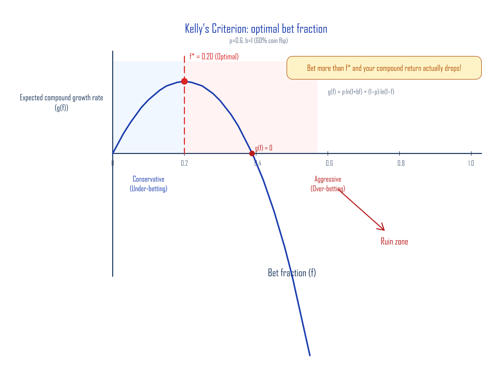

# butterflow Investment Notes

**Notes for the retail investor who treats volatility as fuel, not as enemy.**

Math- and data-driven investment principles. In an age where AI dominates markets in milliseconds, some things don't change — the math of compounding, the structure of volatility, and time as a weapon.

<!-- DASHBOARD_START -->

## 📊 Live Dashboard

<small>**As of 2026-05-08** · Auto-updates daily after the US close · [Framework details →](posts/cash-allocation.md)</small>

### 💰 Suggested Cash / Equity Mix

  

    Kelly:
    <button class="kelly-pill" data-kelly-set="quarter">¼</button>
    <button class="kelly-pill is-active" data-kelly-set="half">½</button>
    <button class="kelly-pill" data-kelly-set="full">Full</button>
    ·
    Risk sensitivity:
    <button class="kelly-pill" data-discount-set="loose">Loose</button>
    <button class="kelly-pill is-active" data-discount-set="standard">Standard</button>
    <button class="kelly-pill" data-discount-set="tight">Tight</button>
  

  <table class="kelly-table">
    <thead><tr><th>Step</th><th>Value</th></tr></thead>
    <tbody>
      <tr><td>① Kelly × VIX base (VIX 17.2)</td><td><strong>85%</strong></td></tr>
      <tr><td>② COR/SKEW 🟢 Normal</td><td>× 1.00</td></tr>
      <tr><td>③ VIX TS 🟢 Contango (normal)</td><td>× 1.00</td></tr>
      <tr><td>④ VolVol 🟢 Calm</td><td>× 1.00</td></tr>
      <tr class="kelly-final"><td><strong>Suggested mix</strong></td><td><strong>Equity 85% / Cash 15%</strong></td></tr>
    </tbody>
  </table>

<small>*Half-Kelly @ μ−r=5%, σ=VIX/100. Risk sensitivity = per-group multiplier (loose 0.95/0.85 · standard 0.90/0.75 · tight 0.85/0.65). **Educational — not investment advice.** [Read more →](posts/cash-allocation.md)*</small>

---

### VIX Futures Term Structure

| Field | Value | State |
|:------|------:|:------|
| VIX spot | 17.19 | — |
| Front (M1, 2026-05-19) | 19.22 | — |
| **M2 − M1** (short-term) | +1.47 | 🟢 Contango (normal) |
| **M7 − M4** (mid-term, VXZ zone) | +0.79 | 🟢 Contango (normal) |

<small>*Source: Cboe CFE settlement — a reliable alternative to vixcentral · Use the slider/▶ to scrub through up to 1 year of past curves · [Reading guide →](posts/vix-term-structure.md)*</small>

---

### COR + SKEW Dashboard

| Signal | Value | State |
|:-------|------:|:------|
| **Term Structure** (COR1Y − COR1M) | 6.2 | 🟢 Normal |
| **COR90D** (synchronization) | 33.1 | 🟢 Normal |
| **SKEW** (tail risk) | 138.2 | 🟢 Normal |

---

### VolVol — VVIX / VIX ratio

| Signal | Value | State |
|:-------|------:|:------|
| **VolVol = VVIX / VIX** (5DMA) | 5.471 | 🟢 Calm (5DMA > middle) |
| BB middle (20-day MA) | 5.332 | — |

<small>*5-day MA above the 20-day BB middle = vol is decompressing (calm regime); below = vol is building (stressed). A cross through the middle band marks a sentiment shift. **Not an official index — a 'psychological' confirmation signal**, best read alongside VIX TS and COR/SKEW rather than as a standalone trading trigger.*</small>

---
<!-- DASHBOARD_END -->

## Free articles

### Returns 101

- [**Returns, Compounding, and Log Charts**](posts/log-return.md) — Why arithmetic and log returns are different and why log charts exist
- [**How is my portfolio actually doing?**](posts/portfolio-return.md) — TWR vs MWR, same trade two answers
- [**Expected Return — QQQ vs TQQQ**](posts/expected-return.md) — A probability view of leverage and vol drag
- [**Cost of Leverage in Derivatives**](posts/derivatives-leverage-cost.md) — Same 3×, wildly different bills

### Options analysis

- [**Options Basics**](posts/options-basics.md) — Calls, puts, strike, expiration, delta — explained via car insurance (start *here* if options are new)
- [**Volatility Skew**](posts/skew.md) — The "smirk" in S&P 500 index options, Implied Correlation, the CBOE SKEW Index
- [**Hedging the Wings**](posts/hedging-wings.md) — Low-cost tail-risk hedging (1:2 put ratio, with a concrete SPY example)
- [**Market-Sentiment Volatility Indices**](posts/implied-correlation.md) — COR3M, the IV Surface, Delta Skew + a TradingView Pine Script

### Market data tools

- [**The COT Report**](posts/cot.md) — Reading institutional intent in the futures market
- [**The FedWatch Tool**](posts/fedwatch.md) — Pricing rate moves with Fed Funds futures

### Tools

- [**Monte Carlo Simulation**](posts/monte-carlo.md) — Backtesting investments with Google Sheets + Python
- [**The Almanac Trader**](posts/almanac.md) — Monthly seasonality analysis (Google Sheets + Python)
- [**Calculating GEX Yourself**](posts/gex-calculator.md) — Gamma exposure with Google Sheets + Python
- [**0DTE Gamma Patterns**](posts/gex-0dte-patterns.md) — How GEX shifts intraday
- [**Volatility Dashboard**](posts/volatility-dashboard.md) — Tracking Correlation + Skew (Google Sheets + Python)
- [**VIX Futures Term Structure**](posts/vix-term-structure.md) — Reading contango/backwardation (vixcentral alternative)

---

## Series (paid e-books)

**How to use volatility as fuel — a complete curriculum for the retail investor, written with math and data.**

- **13 articles / 167 pages**, with **90+ original diagrams**
- Formulas at arithmetic level only, the rest is analogies and pictures
- Each Gumroad listing includes **both English and Korean PDFs**

| Series | What's inside | Articles | Gumroad |
|:-------|:--------------|:---------|:--------|
| [**Principles (61p)**](series/s1-shannons-demon.md) | Shannon's Demon to Kelly's Criterion | 4 (part 1 free) | [Buy](https://butt2rflow.gumroad.com/l/aejfrj) |
| [**Execution (35p)**](series/s2-preview.md) | Read VIX, size positions with ETFs + cash | 3 | [Buy](https://butt2rflow.gumroad.com/l/ozijat) |
| [**Extension (32p)**](series/s3-preview.md) | LEAP, Protective Put, Covered Call | 2 | [Buy](https://butt2rflow.gumroad.com/l/ozuyjb) |
| [**Depth (39p)**](series/s4-preview.md) | Gamma, dynamic hedging, GEX, 0DTE | 4 | [Buy](https://butt2rflow.gumroad.com/l/cwwzss) |
| **Complete bundle (167p)** | Principles + Execution + Extension + Depth | 13 | [**Buy**](https://butt2rflow.gumroad.com/l/dbkyt) |

> 💡 **Bundle = ~33% off vs buying each series separately.** Buying all four together is significantly cheaper than buying them individually.

[Buy the Complete Bundle on Gumroad](https://butt2rflow.gumroad.com/l/dbkyt){ .md-button .md-button--primary }

---

*All content is for educational purposes only. This is not investment advice or a recommendation to buy or sell any specific security. All investments carry the risk of capital loss.*
