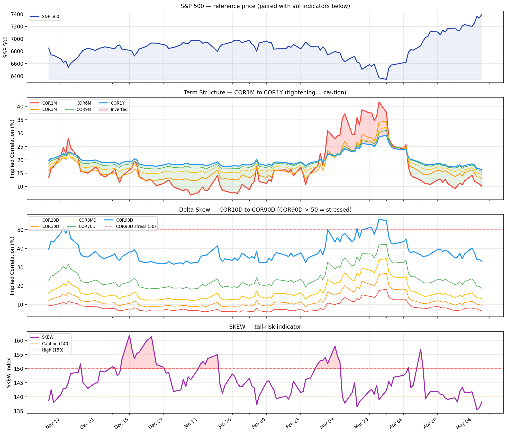
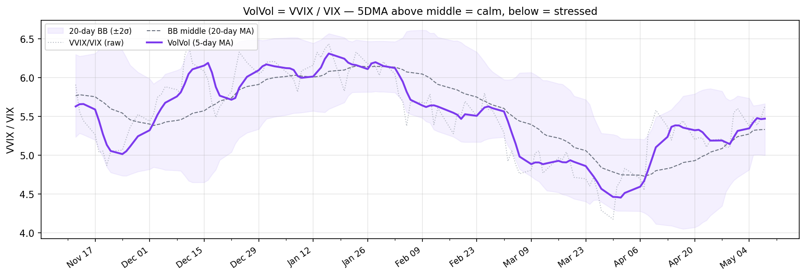

# butterflow Notes

**Notes for the retail investor who treats volatility as fuel, not as enemy.**

Math- and data-driven investment principles. In an age where AI dominates markets in milliseconds, some things don't change — the math of compounding, the structure of volatility, and time as a weapon.

<!-- DASHBOARD_START -->

## 📊 Daily Dashboard

<small>**As of 2026-05-11** · Auto-updates daily after the US close · [Framework details →](posts/cash-allocation.md)</small>

  

    📊 <strong>Today's mix</strong> — Equity <strong>90%</strong> / Cash <strong>10%</strong>
  

  

    Split:
    <button class="kelly-pill" data-split-set="80-20">80 / 20</button>
    <button class="kelly-pill is-active" data-split-set="90-10">90 / 10</button>
    <button class="kelly-pill" data-split-set="95-5">95 / 5</button>
    <a class="allocation-master__split-info" href="posts/cash-allocation/#choosing-the-split" title="Which split should I pick?">ⓘ</a>
  

  

    

  

  

    Main 90% × 100% equity
    +
    Tactical 10% × 0% deploy
    =
    <strong>90% equity</strong>
  

### 💰 Main Bucket — Suggested Equity / Cash Mix

  

    Kelly:
    <button class="kelly-pill" data-kelly-set="quarter">¼</button>
    <button class="kelly-pill" data-kelly-set="half">½</button>
    <button class="kelly-pill is-active" data-kelly-set="threequarter">¾</button>
    <button class="kelly-pill" data-kelly-set="full">Full</button>
    ·
    Risk sensitivity:
    <button class="kelly-pill" data-discount-set="loose">Loose</button>
    <button class="kelly-pill is-active" data-discount-set="standard">Standard</button>
    <button class="kelly-pill" data-discount-set="tight">Tight</button>
  

  

    Equity premium μ−r:
    <button class="kelly-pill" data-premium-set="conservative">5%</button>
    <button class="kelly-pill is-active" data-premium-set="standard">7%</button>
    <button class="kelly-pill" data-premium-set="aggressive">9%</button>
    ⓘ
  

  <table class="kelly-table">
    <thead><tr><th>Step</th><th>Value</th></tr></thead>
    <tbody>
      <tr><td>① Kelly × VIX base (VIX 18.4)</td><td><strong>100%</strong></td></tr>
      <tr><td>② COR/SKEW 🟢 Normal</td><td>× 1.00</td></tr>
      <tr><td>③ VIX TS 🟢 Contango (normal)</td><td>× 1.00</td></tr>
      <tr><td>④ VolVol 🟢 Calm</td><td>× 1.00</td></tr>
      <tr class="kelly-final"><td><strong>Suggested mix</strong></td><td><strong>Equity 100% / Cash 0%</strong></td></tr>
    </tbody>
  </table>

<small>*This mix is **internal to the main bucket** — the tactical bucket is sized in the next card, and the whole-portfolio composite plus the split (80/20·90/10·95/5) live in the master bar at the top. Formula: f* = (μ−r) ÷ (VIX/100)², capped at 100%. Kelly fraction (¼·½·¾·Full) × premium (5·7·9%) × risk sensitivity (loose 0.95/0.85 · standard 0.90/0.75 · tight 0.85/0.65) compose the final weight. Both the curve chart and the card numbers update with the selected μ−r. **Educational — not investment advice.** [Read more →](posts/cash-allocation.md)*</small>

---

### ⚡ Tactical Bucket — Offensive Deploy Signal

| Trigger | Now | Tier / Fired |
|:---|---:|:---:|
| VIX sustained 5d — 40+ ×½ / 50+ ×1 / 60+ ×1½ | 18.4 (5d min 17.1) | 🟢 Inactive (0) |
| COR90D > 55 AND SKEW > 150 | 33.0 / 140.2 | ❌ (0) |
| 30-day SPX drawdown ≥ 20% | +0.0% | ❌ (0) |
| **Tactical bucket deploy** | **🟢 0% (Inactive)** | — |

<small>*Tactical bucket holds *offensive cash to monetise the time edge*. T1 (VIX sustained) is laddered 40/50/60 with weights ½/1/1½; T2 and T3 are binary 0/1. Total weight ÷ 3 → deploy %, capped at 100. Deploy % shown above is **internal to the tactical bucket** — see the master bar at the top for the whole-portfolio composite and the split selector · [Read more →](posts/cash-allocation.md)*</small>

---

### VIX Futures Term Structure

| Field | Value | State |
|:------|------:|:------|
| VIX spot | 18.38 | — |
| Front (M1, 2026-05-19) | 19.47 | — |
| **M2 − M1** (short-term) | +1.52 | 🟢 Contango (normal) |
| **M7 − M4** (mid-term, VXZ zone) | +0.75 | 🟢 Contango (normal) |

<small>*Source: Cboe CFE settlement — a reliable alternative to vixcentral · Use the slider/▶ to scrub through up to 1 year of past curves · [Reading guide →](posts/vix-term-structure.md)*</small>

---

### COR + SKEW Dashboard

| Signal | Value | State |
|:-------|------:|:------|
| **Term Structure** (COR1Y − COR1M) | 5.3 | 🟢 Normal |
| **COR90D** (synchronization) | 33.0 | 🟢 Normal |
| **SKEW** (tail risk) | 140.2 | 🟢 Normal |

<small>*Cboe COR + SKEW indices — market diversification and tail-risk view · [Full guide →](posts/volatility-dashboard.md)*</small>

---

### VolVol — VVIX / VIX ratio

| Signal | Value | State |
|:-------|------:|:------|
| **VolVol = VVIX / VIX** (5DMA) | 5.463 | 🟢 Calm (5DMA > middle) |
| BB middle (20-day MA) | 5.330 | — |

<small>*5-day MA above the 20-day BB middle = vol is decompressing (calm regime); below = vol is building (stressed). A cross through the middle band marks a sentiment shift. **Not an official index — a 'psychological' confirmation signal**, best read alongside VIX TS and COR/SKEW rather than as a standalone trading trigger · [Read more →](posts/cash-allocation.md)*</small>

---
<!-- DASHBOARD_END -->

## Free articles

### Returns 101

- [**Returns, Compounding, and Log Charts**](posts/log-return.md) — Why arithmetic and log returns are different and why log charts exist
- [**How is my portfolio actually doing?**](posts/portfolio-return.md) — TWR vs MWR, same trade two answers
- [**Expected Return — QQQ vs TQQQ**](posts/expected-return.md) — A probability view of leverage and vol drag
- [**Cost of Leverage in Derivatives**](posts/derivatives-leverage-cost.md) — Same 3×, wildly different bills
- [**Quadruple Witching Is Whole Again**](posts/ssf-relaunch.md) — Single stock futures are back after 6 years, and why they fit a directional earnings bet

### Options analysis

- [**Options Basics**](posts/options-basics.md) — Calls, puts, strike, expiration, delta — explained via car insurance (start *here* if options are new)
- [**Volatility Skew**](posts/skew.md) — The "smirk" in S&P 500 index options, Implied Correlation, the CBOE SKEW Index
- [**Hedging the Wings**](posts/hedging-wings.md) — Low-cost tail-risk hedging (1:2 put ratio, with a concrete SPY example)

### Market data tools

- [**The COT Report**](posts/cot.md) — Reading institutional intent in the futures market
- [**The FedWatch Tool**](posts/fedwatch.md) — Pricing rate moves with Fed Funds futures
- [**Reading Credit Spreads as an Indicator**](posts/credit-spreads.md) — The index is calm while the CCC−B gap widens; a late-cycle signal you can read on FRED without trading CDS
- [**The Bond Market's VIX — MOVE Index**](posts/move-index.md) — the fear gauge for Treasury yields; in bp not %, and the divergence from VIX is the signal
- [**Market-Sentiment Volatility Indices**](posts/implied-correlation.md) — COR3M, the IV Surface, Delta Skew + a TradingView Pine Script

### Tools

- [**Monte Carlo Simulation**](posts/monte-carlo.md) — Backtesting investments with Google Sheets + Python
- [**The Almanac Trader**](posts/almanac.md) — Monthly seasonality analysis (Google Sheets + Python)
- [**Calculating GEX Yourself**](posts/gex-calculator.md) — Gamma exposure with Google Sheets + Python
- [**0DTE Gamma Patterns**](posts/gex-0dte-patterns.md) — How GEX shifts intraday
- [**Beyond Gamma — The Vanna Rally, Pinning**](posts/vanna-charm.md) — Vanna, Charm, and dealer positioning — how much is actually true
- [**Volatility Dashboard**](posts/volatility-dashboard.md) — Tracking Correlation + Skew (Google Sheets + Python)
- [**VIX Futures Term Structure**](posts/vix-term-structure.md) — Reading contango/backwardation (vixcentral alternative)

### Physical AI

**Start Here**

- [**Choosing a Physical AI Approach**](posts/choosing-physical-ai.md) — from deterministic automation to learned behavior, three designs
- [**Learned Policies**](posts/learned-policy-track-b.md) — robots that copy what you show them, and where that breaks

**Robot Vision**

- [**From Stereo to Grasp**](posts/stereo-to-grasp.md) — How a robot learns to see a part
- [**Frames & Transforms**](posts/frames-transforms.md) — How a robot knows where to grab
- [**Inside the Three Models**](posts/inside-the-models.md) — FoundationStereo · SAM 2 · FoundationPose, opened up (deep dive)
- [**Model Anatomy**](posts/model-anatomy.md) — Unfolding three networks' blueprints (deep dive)
- [**Why Robots Learn in a 'Fake World' First**](posts/robot-simulation.md) — Simulation and sim-to-real
- [**How Many Cameras, and Where**](posts/camera-placement.md) — when one wrist camera is enough and when you need an overhead
- [**Which Depth Camera**](posts/depth-camera-selection.md) — from mounting position to distance, from distance to camera

**Cobots**

- [**What Is a Collaborative Robot?**](posts/cobot-basics.md) — The basics of robots that work beside people
- [**UR vs FANUC: Openness**](posts/cobot-ur-vs-fanuc.md) — Comparing the two camps' openness and ecosystems

**From Teach Pendant to ROS 2 (Parts 1–4)**

- [**Part 1 · ROS 2 nodes and the graph**](posts/ros2-for-robot-programmers.md) — ROS 2 for pendant programmers · [Part 2 URDF, TF2](posts/ros2-robot-description.md) · [Part 3 MoveIt 2](posts/moveit2-goals-not-points.md) · [Part 4 Isaac ROS](posts/isaac-ros-gpu.md)

**Field Notes: The Robot's Brain at the Edge**

- [**Part 1 · Jetson & ROS 2**](posts/jetson-ros2-setup.md) — setting up a Jetson Orin NX
- [**Part 2 · Isaac ROS & Foundation Models**](posts/jetson-isaac-foundation-models.md) — running it on the edge
- [**A Correction**](posts/jetson-foundationpose-16gb.md) — the whole stack runs on 16 GB after all
- [**Tuning**](posts/jetson-tuning-licensing.md) — 11 s to 4 s, and a chain you can ship
- [**Scanning**](posts/jetson-scan-no-cad.md) — scanning an object with no CAD on one printed board
- [**Motion**](posts/jetson-pose-to-motion.md) — 186 ms motion plans, and planning around a live obstacle map
- [**The Real Robot**](posts/jetson-real-robot-first-move.md) — an edge computer moves a real UR20 for the first time; calibration 3.95→0.06 mm, 0.1 mm from goal
- [**The Simulators**](posts/jetson-ursim-planners.md) — cuMotion, Pilz and OMPL on two URSims; a 510° wrist turn for 10 cm
- [**Isaac Sim**](posts/isaac-sim-pc-and-cloud.md) — a virtual work cell on a home RTX 3090 and a cloud L4; a synthetic-data memory leak; the cloud wasn't faster

**Hands-on Notes**

- [**Part 0 · Learning Without a Real Industrial Robot**](posts/learn-without-industrial-robot.md) — choosing practice grounds with SO-101 and URSim

**Physical AI Investing**

- [**Part 1 · Value Migrates**](posts/cobot-investing.md) — no pure plays, and where the value moves
- [**Part 2 · Value Shifts Through One Joint**](posts/physical-ai-investing-actuators.md) — reducers, motors and ETFs
- [**Part 3 · The Humanoid Power Problem**](posts/physical-ai-investing-power.md) — batteries, uptime and reactors

---

## Series (paid e-books)

**How to use volatility as fuel — a complete curriculum for the retail investor, written with math and data.**

- **13 articles / 167 pages**, with **90+ original diagrams**
- Formulas at arithmetic level only, the rest is analogies and pictures
- Each Gumroad listing includes **both English and Korean PDFs**

| Series | What's inside | Articles | Gumroad |
|:-------|:--------------|:---------|:--------|
| [**Principles (61p)**](series/s1-shannons-demon.md) | Shannon's Demon to Kelly's Criterion | 4 (part 1 free) | [Buy](https://butt2rflow.gumroad.com/l/aejfrj) |
| [**Execution (35p)**](series/s2-preview.md) | Read VIX, size positions with ETFs + cash | 3 | [Buy](https://butt2rflow.gumroad.com/l/ozijat) |
| [**Extension (32p)**](series/s3-preview.md) | LEAP, Protective Put, Covered Call | 2 | [Buy](https://butt2rflow.gumroad.com/l/ozuyjb) |
| [**Depth (39p)**](series/s4-preview.md) | Gamma, dynamic hedging, GEX, 0DTE | 4 | [Buy](https://butt2rflow.gumroad.com/l/cwwzss) |
| **Complete bundle (167p)** | Principles + Execution + Extension + Depth | 13 | [**Buy**](https://butt2rflow.gumroad.com/l/dbkyt) |

<small>The bundle collects all four series in one.</small>

---

*All content is for educational purposes only. This is not investment advice or a recommendation to buy or sell any specific security. All investments carry the risk of capital loss.*
