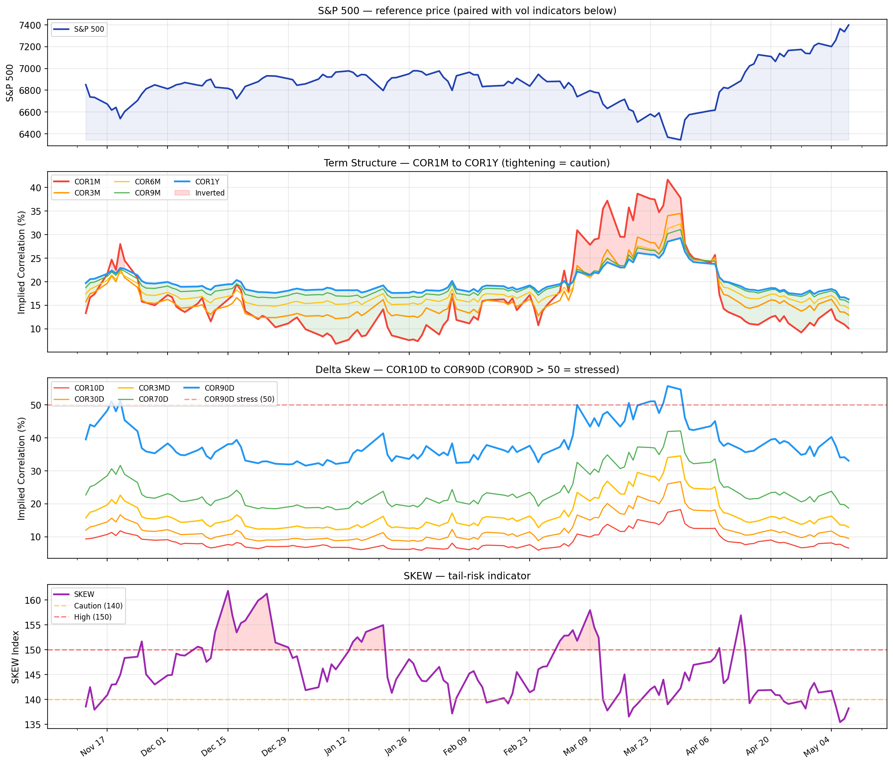
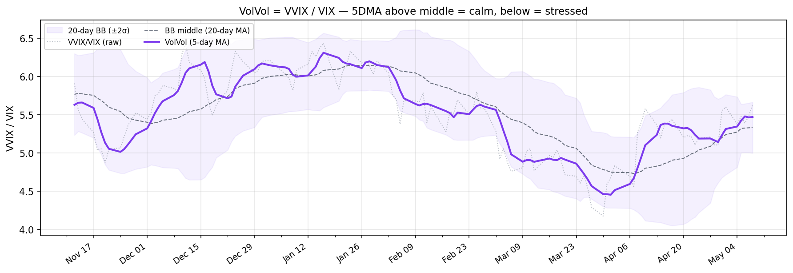

# butterflow 투자 노트

**변동성을 적이 아닌 연료로 바라보는 개인 투자자를 위한 기록.**

수학과 데이터에 기반한 투자 원칙을 연구하고 정리합니다. AI가 시장을 지배하는 시대에도 변하지 않는 것 — 복리의 수학, 변동성의 구조, 그리고 시간이라는 무기.

<!-- DASHBOARD_START -->

## 📊 라이브 대시보드

<small>**2026-05-08 기준** · 미국 장 마감 후 매일 자동 갱신 · [자세히 →](posts/volatility-dashboard.md)</small>

### 💰 권장 현금/주식 비중

  

    Kelly:
    <button class="kelly-pill" data-kelly-set="quarter">¼</button>
    <button class="kelly-pill is-active" data-kelly-set="half">½</button>
    <button class="kelly-pill" data-kelly-set="full">Full</button>
    ·
    위험 민감도:
    <button class="kelly-pill" data-discount-set="loose">느슨</button>
    <button class="kelly-pill is-active" data-discount-set="standard">기본</button>
    <button class="kelly-pill" data-discount-set="tight">빡빡</button>
  

  <table class="kelly-table">
    <thead><tr><th>단계</th><th>값</th></tr></thead>
    <tbody>
      <tr><td>① Kelly × VIX 베이스 (VIX 17.2)</td><td><strong>85%</strong></td></tr>
      <tr><td>② COR/SKEW 🟢 정상</td><td>× 1.00</td></tr>
      <tr><td>③ VIX TS 🟢 콘탱고 (정상)</td><td>× 1.00</td></tr>
      <tr><td>④ VolVol 🟢 안도</td><td>× 1.00</td></tr>
      <tr class="kelly-final"><td><strong>권장 비중</strong></td><td><strong>주식 85% / 현금 15%</strong></td></tr>
    </tbody>
  </table>

<small>*Half-Kelly @ μ−r=5%, σ=VIX/100. 위험 민감도 = 그룹별 multiplier (loose 0.95/0.85 · standard 0.90/0.75 · tight 0.85/0.65). **교육 목적 · 투자 권유 아님** · [자세히 →](posts/cash-allocation.md)*</small>

---

### VIX Futures Term Structure

| 항목 | 값 | 상태 |
|:-----|---:|:-----|
| VIX 현물 | 17.19 | — |
| Front (M1, 2026-05-19) | 19.22 | — |
| **M2 − M1** (단기) | +1.47 | 🟢 콘탱고 (정상) |
| **M7 − M4** (중기, VXZ 영역) | +0.79 | 🟢 콘탱고 (정상) |

<small>*Cboe 결제 데이터(CFE) 기준. Vixcentral 대안으로 활용 가능 · 지난 1년 곡선을 슬라이더/▶로 재생 가능 · [해석 가이드 →](posts/vix-term-structure.md)*</small>

---

### COR + SKEW 대시보드

| 신호 | 값 | 상태 |
|:-----|---:|:-----|
| **Term Structure** (COR1Y − COR1M) | 6.2 | 🟢 정상 |
| **COR90D** (동조화 수준) | 33.1 | 🟢 정상 |
| **SKEW** (꼬리 위험) | 138.2 | 🟢 정상 |

---

### VolVol — VVIX / VIX 비율 지표

| 신호 | 값 | 상태 |
|:-----|---:|:-----|
| **VolVol = VVIX / VIX** (5DMA) | 5.471 | 🟢 안도 (5DMA > 중간선) |
| BB 중간선 (20일 이평) | 5.332 | — |

<small>*5일 이평선이 20일 볼린저밴드 중간선 위에 있으면 변동성이 줄어드는 안도 국면, 아래면 긴장 국면. 중간선을 가르는 크로스가 시장 심리 전환 신호. **공식 지표가 아닌 '심리적' 보조 신호** — 단독 매매 판단보다는 VIX TS·COR/SKEW와 함께 시장 분위기를 읽는 용도.*</small>

---
<!-- DASHBOARD_END -->

## 무료 콘텐츠

### 수익률 기초

- [**수익률, 복리, 그리고 로그차트**](posts/log-return.md) — 산술수익률 vs 로그수익률, 복리, 로그차트가 한 묶음인 이유
- [**내 포트폴리오의 수익률은?**](posts/portfolio-return.md) — TWR vs MWR, 같은 거래 두 가지 답
- [**수익률의 기댓값**](posts/expected-return.md) — 확률 모델로 본 QQQ vs TQQQ
- [**파생상품의 레버리지 사용료**](posts/derivatives-leverage-cost.md) — 같은 3배라도 비용은 70배 차이

### 옵션 분석

- [**옵션의 기초**](posts/options-basics.md) — 자동차 보험 비유로 풀어 보는 콜·풋·행사가·델타 (옵션 처음이라면 *여기부터*)
- [**변동성 Skew**](posts/skew.md) — S&P500 지수 옵션의 "썩소"와 Implied Correlation, CBOE SKEW Index
- [**Hedging the Wings**](posts/hedging-wings.md) — 저비용 테일 리스크 헷지 (1:2 Put Ratio, SPY 구체 예시)
- [**시장 심리 변동성 지수**](posts/implied-correlation.md) — COR3M, IV Surface, Delta Skew + TradingView Pine Script

### 시장 데이터 도구

- [**COT 리포트**](posts/cot.md) — 선물시장에서 기관의 의중 읽기
- [**FedWatch Tool**](posts/fedwatch.md) — Fed Fund 선물로 금리 예측하기

### 도구

- [**몬테카를로 시뮬레이션**](posts/monte-carlo.md) — 구글시트 + Python으로 투자 백테스팅
- [**Almanac Trader**](posts/almanac.md) — 월별 Seasonality 분석 (구글시트 + Python)
- [**GEX 직접 계산하기**](posts/gex-calculator.md) — Google Sheets + Python으로 감마 노출 계산
- [**0DTE 감마 패턴**](posts/gex-0dte-patterns.md) — 장중 GEX는 어떻게 변하는가
- [**변동성 대시보드**](posts/volatility-dashboard.md) — Correlation + Skew 추적 (Google Sheets + Python)
- [**VIX Futures Term Structure**](posts/vix-term-structure.md) — 콘탱고/백워데이션 해석 (vixcentral 대안)

---

## 시리즈 (유료 전자책)

**변동성을 연료로 쓰는 법 — 수학과 데이터로 풀어 쓴 개인 투자자용 완결 시리즈.**

- 총 **13편 / 179페이지**, 다이어그램 **90장+**
- 공식은 **사칙연산 수준**, 나머지는 비유와 그림
- **한국 구매자**는 크몽, **해외**는 Gumroad에서 구매

| 시리즈 | 내용 | 편수 | 크몽 | Gumroad |
|:-------|:-----|:-----|:-----|:--------|
| [**원칙편 (65p)**](series/s1-shannons-demon.md) | 섀넌의 도깨비부터 캘리 기준까지 | 4편 (1편 무료) | [구매](https://kmong.com/gig/762026) | [Buy](https://butt2rflow.gumroad.com/l/aejfrj) |
| [**실행편 (37p)**](series/s2-preview.md) | VIX를 읽고 ETF+현금으로 비중 조절 | 3편 | [구매](https://kmong.com/gig/762058) | [Buy](https://butt2rflow.gumroad.com/l/ozijat) |
| [**확장편 (35p)**](series/s3-preview.md) | LEAP, Protective Put, Covered Call | 2편 | [구매](https://kmong.com/gig/762059) | [Buy](https://butt2rflow.gumroad.com/l/ozuyjb) |
| [**심화편 (42p)**](series/s4-preview.md) | 감마, 동적 헷지, GEX, 0DTE | 4편 | [구매](https://kmong.com/gig/762062) | [Buy](https://butt2rflow.gumroad.com/l/cwwzss) |
| **전 13편 번들 (179p)** | 원칙편 + 실행편 + 확장편 + 심화편 | 13편 | [**구매**](https://kmong.com/gig/762066) | [**Buy**](https://butt2rflow.gumroad.com/l/dbkyt) |

> 💡 **번들 = 개별 구매 대비 약 33% 할인**. 4개 시리즈 따로 사는 것보다 한 번에 사는 게 훨씬 저렴합니다.

[크몽 전체 세트 구매](https://kmong.com/gig/762066){ .md-button .md-button--primary }
[Gumroad Bundle](https://butt2rflow.gumroad.com/l/dbkyt){ .md-button }

---

*모든 콘텐츠는 교육 목적으로만 제공됩니다. 특정 금융상품에 대한 투자 권유나 매수·매도 추천이 아니며, 모든 투자에는 원금 손실의 위험이 있습니다.*
