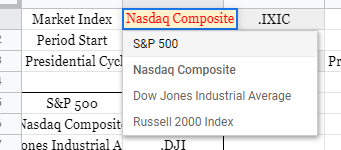
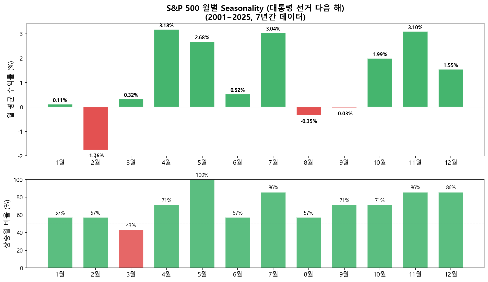
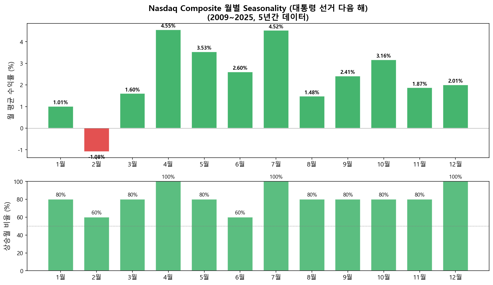
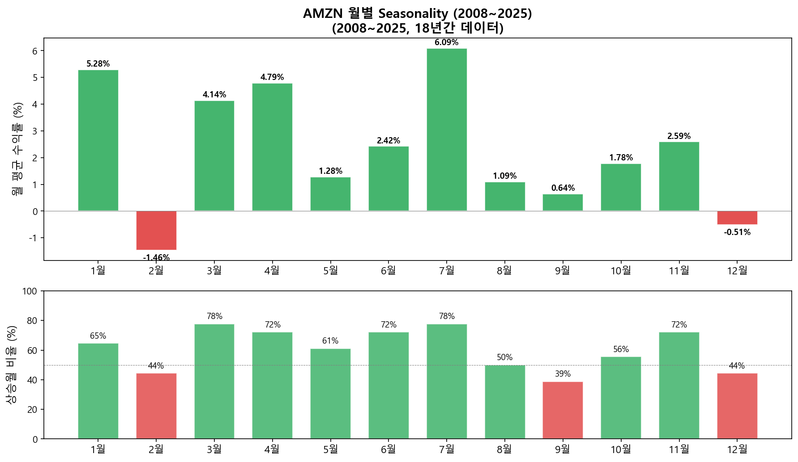
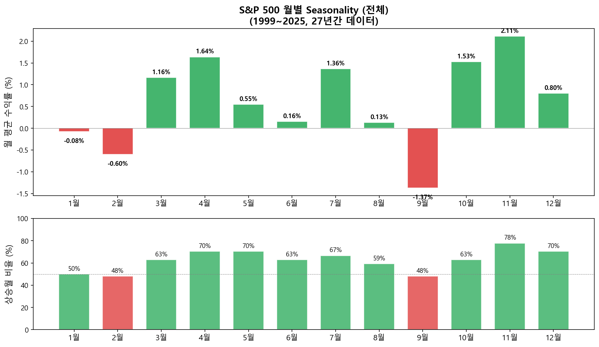

# The Almanac Trader — Seasonality Analysis

---

## What seasonality is

**Seasonality** is the historical tendency of prices to rise or fall around specific dates or months. The classic example is the **January Effect** — the observation that small-cap stocks have a tendency to rally in January.

The [Stock Trader's Almanac 2021](https://www.amazon.com/Stock-Traders-Almanac-2021-Investor/dp/111977876X), considered required reading for short-term traders, lays out this kind of seasonality data in detail.

> What did the Nasdaq Composite do on February 1st historically, between 1999 and 2020?

The answer: February 1st was an up day **76.2%** of the time — roughly 7.6 out of every 10 years.

You can build this kind of seasonality table yourself with nothing more than historical price data.

---

## Google Sheets version

> **Copy the Almanac Trader template:** [Google Sheets link](https://docs.google.com/spreadsheets/d/13rne6WEWYdma8cTmxUdkctY1LPcmogp-kcXiPH4VzNs/copy)

In the sheet, you can change three filters to slice the analysis any way you want:



| Filter | What it does | Example |
|:-------|:-------------|:--------|
| **Market Index** | Index or ticker to analyze | S&P 500, Nasdaq, AMZN, etc. |
| **Period Start** | Start year of the data window | 1999, 2008, etc. |
| **Presidential Cycle** | Filter by presidential election cycle | All, Election Year+1, etc. |

### Presidential cycle

There's a long-standing observation that the U.S. four-year presidential cycle leaves a footprint on the market — new-administration policy shifts, fiscal-spending changes, and so on. Historically the **year after an election (Election Year + 1)** has been the weakest year of the cycle. This filter lets you isolate just the years that match a specific stage of the cycle when computing seasonality.

### How to read the seasonality chart

The chart has two parts:

| Section | What it shows |
|:--------|:--------------|
| **Top (cumulative log return — returns transformed into a form you can sum)** | The yearly return trend. An upward slope means the period was historically positive. |
| **Bottom (up-day rate)** | The probability that this date was an up day. Above 50% (green) = mostly up; below 50% (red) = mostly down |

> Use this data as a guide to **directional tendency** for a date, not as a literal expected return.

---

## Python version

You can run the same analysis in Python without the Google Sheets limits. Pull data with `yfinance`, then compute the seasonality.

### S&P 500 — year after a presidential election (2001–2025)



### Nasdaq Composite — year after a presidential election (2009–2025)



### AMZN (2008–2025)



### S&P 500 — full sample (1999–2025)



<details><summary>Core Python code</summary>

```python
import numpy as np
import pandas as pd
import yfinance as yf

# Pull data
data = yf.download("^GSPC", start="1999-01-01", end="2025-12-31")
data['log_return'] = np.log(data['Close'] / data['Close'].shift(1))

# Filter to year-after-election
election_years = set(range(2000, 2025, 4))
valid_years = {y + 1 for y in election_years}
data = data[data.index.year.isin(valid_years)]

# Compute seasonality by month/day
data['month'] = data.index.month
data['day'] = data.index.day
seasonality = data.groupby(['month', 'day']).agg(
    win_rate=('log_return', lambda x: (x > 0).mean() * 100),
    log_return_sum=('log_return', 'sum')
)
```

</details>

---

## The uncomfortable truth about seasonality

### Most "patterns" don't survive on out-of-sample data

When you first see a seasonality table, the temptation is "I can trade this." Honest version:

- **Most patterns you find in historical data are coincidence.** Flip a coin 1,000 times and you *will* see a stretch of "7 heads in a row" — calling that "this coin lands heads every 7th flip" is the same mistake. With 252 trading days × 26 years = 6,552 data points, finding "this date was up 76% of the time" isn't hard. But the probability that the same pattern repeats **next year** is barely better than chance.
- **"Sell in May"**: it's true that November–April outperforms May–October on average, but trading on this rule (in and out twice a year) typically underperforms simple buy-and-hold once you account for trading costs and timing slippage.
- **March 2020**: the COVID crash (−34%) happened during the "safe" Nov–Apr stretch.

### Why bother, then?

If patterns break, why look at them? Because they provide **context**.

| Situation | Role of seasonality |
|:----------|:--------------------|
| Other signals (VIX, technical analysis) point the same direction | Adds confirmation |
| A historically weak month (September) gets an extra bear signal | Strengthens the "play defense" call |
| Entering during a historically strong stretch (November–January) | Eases the psychological friction of timing |

### In-sample vs out-of-sample: what does it actually look like?

Compare S&P 500 monthly average returns split between **1999–2015 (in-sample)** and **2016–2025 (out-of-sample)**:

| Month | In-Sample (99–15) | Out-of-Sample (16–25) | Sign match |
|:------|:-----------------:|:---------------------:|:----------:|
| Jan | −1.01% | **+1.41%** | ✗ |
| Feb | −0.63% | −0.54% | ✓ |
| Mar | +1.74% | +0.18% | ✓ |
| Apr | +1.95% | +1.11% | ✓ |
| May | +0.01% | +1.46% | ✓ |
| Jun | −0.84% | **+1.85%** | ✗ |
| Jul | +0.18% | +3.37% | ✓ |
| Aug | −0.33% | **+0.92%** | ✗ |
| Sep | −1.39% | −1.34% | ✓ |
| Oct | +2.04% | +0.66% | ✓ |
| Nov | +0.92% | +4.15% | ✓ |
| Dec | +1.20% | +0.13% | ✓ |

**Sign match: 9/12 (75%)** — better than a coin flip (50%), but January, June, and August completely flipped sign. The reversal of the famous "January Effect" out of sample is especially worth noticing.

> **Seasonality on its own is barely better than a coin flip; combined with other tools, it's useful context.**

### Presidential-cycle characteristics

| Cycle year | Profile | Historical average |
|:-----------|:--------|:-------------------|
| Election year (Year 0) | Incumbent-friendly policy, market-supportive | Tends up |
| **Year +1 (year after election)** | **Weakest year** — new administration adjusts | Generally weak |
| Year +2 (midterm year) | Peak political uncertainty | Tends to bottom mid-year, rally in H2 |
| Year +3 (pre-election year) | Stimulus into the election cycle, strongest year | Strong |

## Wrap-up

Seasonality is **a tendency in historical data** — it doesn't guarantee anything about the future. But patterns that appear consistently across decades are worth knowing about:

- **Use it as a reference, not a trade signal**: combine with VIX, technical analysis, and other tools.
- **Per-ticker direction matters**: a long-term uptrend stock like AMZN will have a very different seasonality than a long-term downtrend stock like XOM.
- **Patterns can break**: 2020 COVID and the 2008 GFC both produced crashes during "safe" periods.
- **The biggest value**: knowing that "historically, this date has tended to do X" gives you context — not a forecast.

---

## References

- [Stock Trader's Almanac 2021 (Amazon)](https://www.amazon.com/Stock-Traders-Almanac-2021-Investor/dp/111977876X)

---

*Previous: [Monte Carlo Simulation Backtesting](monte-carlo.md) | Next: [Calculating GEX Yourself — Google Sheets + Python](gex-calculator.md)*
