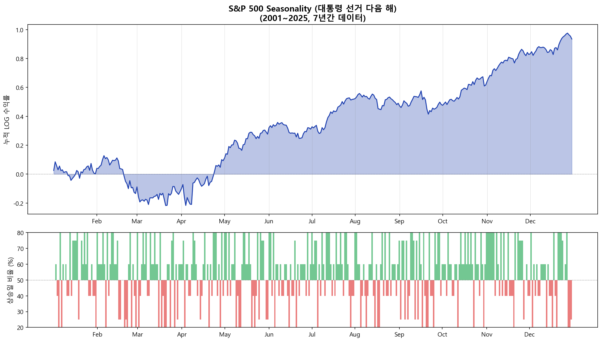
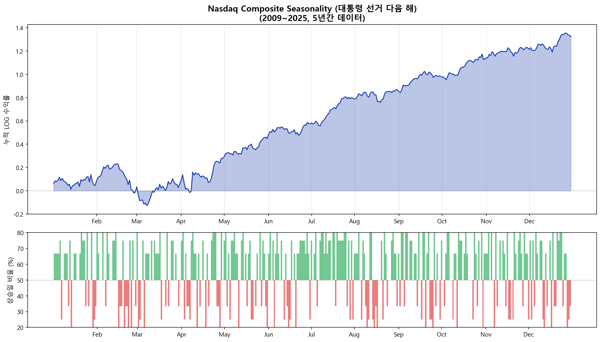
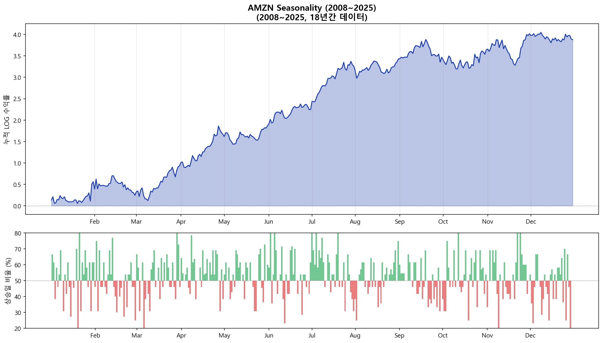
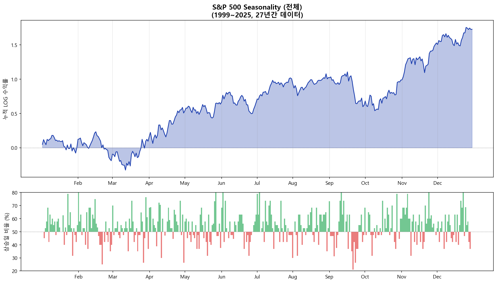

# Almanac Trader — Seasonality 분석 도구

---

## Seasonality란

**Seasonality(계절성)**란 주가가 특정 날짜나 월에 역사적으로 오르거나 내리는 경향을 말합니다. 예를 들어 "1월에는 상승하는 경향이 있다(January Effect)" 같은 것이 대표적입니다.

단기 투자자에게 필수 서적이라고 불리는 [Stock Trader's Almanac 2021](https://www.amazon.com/Stock-Traders-Almanac-2021-Investor/dp/111977876X)에는 이런 seasonality 데이터가 상세하게 정리되어 있습니다.

> 과거 1999년부터 2020년까지 Nasdaq Composite 지수의 2월 1일의 수익은 어땠을까요?

위 질문의 답: 2월 1일에는 **76.2%** 즉 10번 중 7.62번의 확률로 상승장이었습니다.

이런 seasonality 데이터는 과거 주가 데이터만 있으면 직접 만들 수 있습니다.

---

## 구글 시트 버전

> **Almanac Trader 구글 시트 복사하기:** [Google Sheets 링크](https://docs.google.com/spreadsheets/d/13rne6WEWYdma8cTmxUdkctY1LPcmogp-kcXiPH4VzNs/copy)

시트에서 세 가지 조건을 변경하여 원하는 분석을 생성할 수 있습니다:


| 조건 | 설명 | 예시 |
|:----|:-----|:-----|
| **Market Index** | 분석할 지수/종목 | S&P 500, Nasdaq, AMZN 등 |
| **Period Start** | 데이터 시작 연도 | 1999, 2008 등 |
| **Presidential Cycle** | 대통령 선거 주기 필터 | All, Election Year+1 등 |

### 대통령 선거 주기 (Presidential Cycle)

미국 시장에서는 4년 주기의 대통령 선거가 시장에 영향을 미친다고 알려져 있습니다. 역사적으로 **선거 다음 해(Election Year + 1)**가 가장 약한 해로 기록되어 왔습니다. 이 필터를 적용하면 해당 주기에 해당하는 연도만 추출하여 seasonality를 계산합니다.

### Seasonality 차트 읽는 법

차트는 두 부분으로 구성됩니다:

| 영역 | 의미 |
|:----|:-----|
| **상단 (누적 LOG 수익률)** | 1년간의 수익 추세. 우상향이면 해당 구간에서 역사적으로 상승 경향 |
| **하단 (상승일 비율)** | 각 날짜에 상승장이었던 확률. 50% 이상(초록)이면 상승 우세, 미만(빨강)이면 하락 우세 |

> 이 데이터는 절대적인 수치보다는 **해당일의 추세 방향**을 참조하는 용도로 사용하는 것이 적절합니다.

---

## 파이썬 버전

구글 시트의 제약 없이 파이썬으로 동일한 분석을 실행할 수 있습니다. `yfinance`로 데이터를 받아 seasonality를 계산합니다.

### S&P 500 — 대통령 선거 다음 해 (2001~2025)



### Nasdaq Composite — 대통령 선거 다음 해 (2009~2025)



### AMZN (2008~2025)



### S&P 500 — 전체 연도 (1999~2025)



### 핵심 코드

```python
import numpy as np
import pandas as pd
import yfinance as yf

# 데이터 다운로드
data = yf.download("^GSPC", start="1999-01-01", end="2025-12-31")
data['log_return'] = np.log(data['Close'] / data['Close'].shift(1))

# 대통령 선거 다음 해 필터
election_years = set(range(2000, 2025, 4))
valid_years = {y + 1 for y in election_years}
data = data[data.index.year.isin(valid_years)]

# 월/일별 seasonality 계산
data['month'] = data.index.month
data['day'] = data.index.day
seasonality = data.groupby(['month', 'day']).agg(
    win_rate=('log_return', lambda x: (x > 0).mean() * 100),
    log_return_sum=('log_return', 'sum')
)
```

---

## 마무리

Seasonality는 **과거 데이터의 경향**이지 미래를 보장하지 않습니다. 하지만 수십 년간의 데이터에서 반복적으로 나타나는 패턴은 참고할 가치가 있습니다. 특히:

- **대통령 선거 주기**: 선거 다음 해와 중간선거 해의 패턴이 다름
- **종목별 차이**: AMZN처럼 장기 상승 종목은 seasonality도 우상향, XOM처럼 장기 하락 종목은 우하향 — 종목 자체의 추세를 함께 고려해야 합니다
- **실전 활용**: 절대적 매매 신호가 아닌, 다른 분석 도구와 함께 **추세 방향 참조** 용도로 사용

---

## 참고

- [Stock Trader's Almanac 2021 (Amazon)](https://www.amazon.com/Stock-Traders-Almanac-2021-Investor/dp/111977876X)
