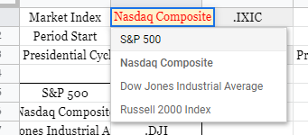
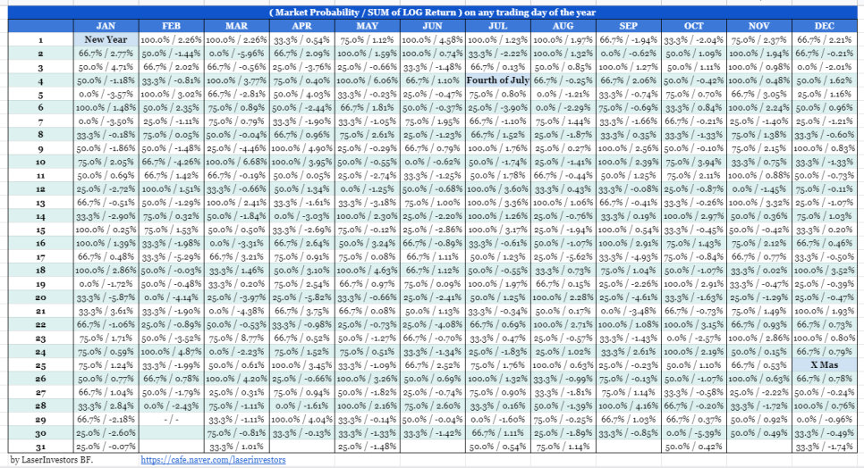
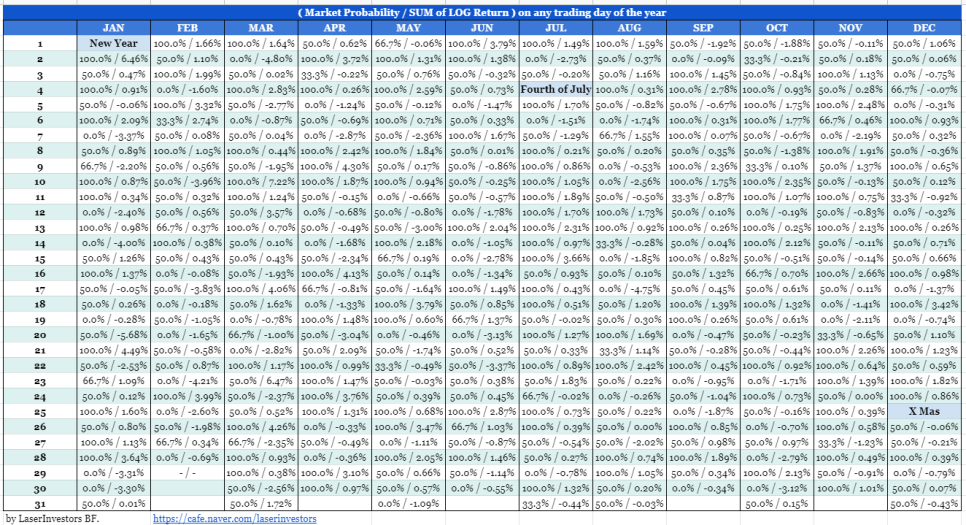
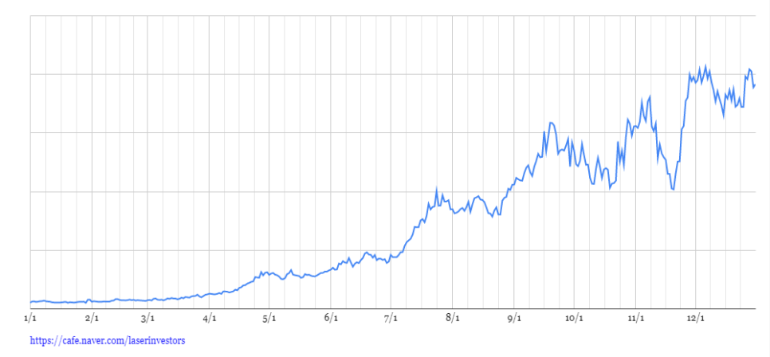
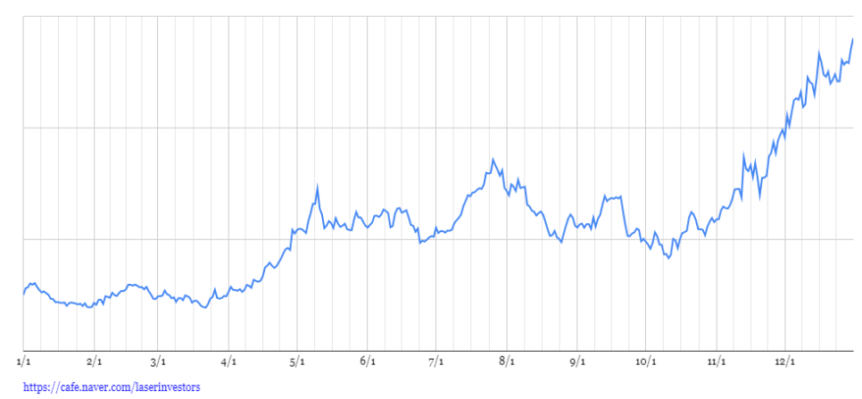
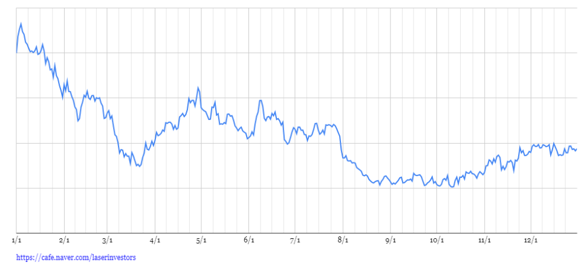

# 구글시트 — Almanac Trader (Seasonality 분석 도구)

---

## Seasonality란

**Seasonality(계절성)**란 주가가 특정 날짜나 월에 역사적으로 오르거나 내리는 경향을 말합니다. 예를 들어 "1월에는 상승하는 경향이 있다(January Effect)" 같은 것이 대표적입니다.

단기 투자자에게 필수 서적이라고 불리는 [Stock Trader's Almanac 2021](https://www.amazon.com/Stock-Traders-Almanac-2021-Investor/dp/111977876X)에는 이런 seasonality 데이터가 상세하게 정리되어 있습니다.

> 과거 1999년부터 2020년까지 Nasdaq Composite 지수의 2월 1일의 수익은 어땠을까요?

위 질문의 답: 2월 1일에는 **76.2%** 즉 10번 중 7.62번의 확률로 상승장이었습니다.

이런 seasonality 데이터는 과거 주가 데이터만 있으면 직접 만들 수 있습니다. 그래서 구글 시트로 만들어봤습니다.

---

## 구글 시트 사용법

> **Almanac Trader 구글 시트 복사하기:** [Google Sheets 링크](https://docs.google.com/spreadsheets/d/13rne6WEWYdma8cTmxUdkctY1LPcmogp-kcXiPH4VzNs/copy)

시트에서 세 가지 조건을 변경하여 원하는 분석을 생성할 수 있습니다:

| 조건 | 설명 | 예시 |
|:----|:-----|:-----|
| **Market Index** | 분석할 지수/종목 | S&P 500, Nasdaq, AMZN 등 |
| **Period Start** | 데이터 시작 연도 | 1999, 2008 등 |
| **Presidential Cycle** | 대통령 선거 주기 필터 | All, Election Year+1 등 |

### 대통령 선거 주기 (Presidential Cycle)

미국 시장에서는 4년 주기의 대통령 선거가 시장에 영향을 미친다고 알려져 있습니다. 역사적으로 **선거 다음 해(Election Year + 1)**가 가장 약한 해로 기록되어 왔습니다. 이 필터를 적용하면 해당 주기에 해당하는 연도만 추출하여 seasonality를 계산합니다.

---

## Seasonality 테이블 읽는 법

표의 각 날짜에는 두 개의 숫자가 쌍으로 표기됩니다:

| 숫자 | 의미 | 예시 |
|:----|:-----|:-----|
| **첫 번째** | 해당 날짜에 상승장이었던 확률 (%) | 76.2% = 10번 중 7.6번 상승 |
| **두 번째** | 해당 날짜의 LOG 수익률 합계 | +0.34 = 누적 상승 경향 |

차트는 LOG 수익률을 누적하여 1년 동안의 수익 추세를 시각적으로 보여줍니다.

> 이 데이터는 절대적인 수치보다는 **해당일의 추세 방향**을 참조하는 용도로 사용하는 것이 적절합니다.

---

## 지수 Seasonality 예시

### S&P500 (1999~2020, 대통령 선거 다음 해)

### Nasdaq Composite (2008~2020, 대통령 선거 다음 해)

---

## 개별 종목 Seasonality

개별 종목도 seasonality가 있는 경우가 많습니다. Market Index 드롭다운에서 티커를 직접 입력하면 개별 종목의 seasonality를 계산할 수 있습니다.

### AMZN (2008~2020)

### DIS (2008~2020)

### XOM (2008~2020, 장기 우하향 중)

XOM(ExxonMobil)은 2014년부터 2020년까지 장기 하락 추세에 있었기 때문에, seasonality 차트에서도 전반적으로 우하향하는 패턴이 나타납니다. Seasonality는 과거 데이터의 경향이므로, 종목 자체의 장기 추세를 함께 고려해야 합니다.

---

## 참고

- 구글 시트 제작 과정: [카페 글 링크](https://cafe.naver.com/laserinvestors/202)
- 책 참조: [Stock Trader's Almanac 2021 (Amazon)](https://www.amazon.com/Stock-Traders-Almanac-2021-Investor/dp/111977876X)
