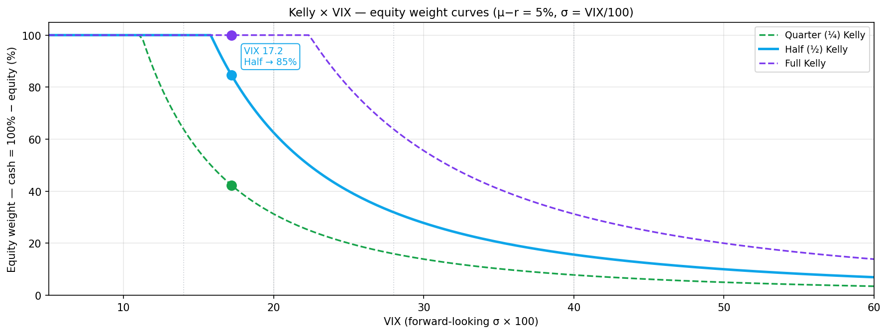

# 변동성 기반 현금 비중 — Kelly 공식과 위험 신호의 결합

> **이 글의 위치**: [원칙편 시리즈](../series/index.md) Part 3 (Kelly의 공식, 유료)의 베팅 비율을 **변동성(VIX)을 σ로 입력**해 일일 현금/주식 비중 추천으로 확장합니다. [Part 1 — Shannon's Demon](../series/s1-shannons-demon.md)이 "현금 = 리밸런싱의 연료"로 끝맺었다면, 이 글은 *얼마만큼*에 대한 답. 라이브 대시보드 첫 카드의 수학적 근거.

---

## 한 줄 요약

> **변동성이 낮을 때 현금을 줄이고, 변동성이 높아지면 현금을 늘린다 — 이 직관을 Kelly 공식으로 수치화한 것.**

**f\* = (μ − r) / σ²** — σ에 VIX를 대입하면, 변동성이 2배 되면 권장 비중이 1/4로 줄어드는 *자동 디레버리지* 곡선이 됩니다. 여기에 COR/SKEW · VIX 백워데이션 · VolVol 같은 추가 위험 신호가 켜지면 곱셈 할인가 더해져 현금 비중이 한 단계 더 올라갑니다.

---

## 1. 왜 변동성 자체가 손실인가 — vol drag와 기하평균

Kelly 공식의 σ²을 이해하려면 먼저 **변동성이 그 자체로 자산을 깎는다**는 사실부터 짚어야 합니다. 이게 큰손·기관들이 변동성 신호에 민감하게 반응하는 *진짜 이유*입니다.

### 산술평균 vs 기하평균

수익률의 평균은 두 가지가 있습니다:

- **산술평균**: 매년 수익률을 단순 평균. "평균적으로 한 해에 몇 % 났나"
- **기하평균**: 실제로 *복리되는* 수익률. "10년 후 내 자산이 몇 배 되어 있나"

복리는 곱셈으로 누적되기 때문에, *실제로 내 통장에 남는 건* 기하평균입니다. 그리고 이 둘은 변동성이 클수록 벌어집니다:

```
기하평균 ≈ 산술평균 − σ² / 2
```

이 차이를 **vol drag** (변동성 끌림, 음의 복리)라고 부릅니다. σ가 *제곱*으로 들어가는 게 핵심.

### 횡보에서도 돈이 사라진다

| 시나리오 | Year 1 | Year 2 | 산술평균 | 기하평균 (실제 손익) |
|:---|---:|---:|---:|---:|
| 변동성 낮음 | +5% | −5% | 0% | **−0.13%** |
| 변동성 중간 | +15% | −15% | 0% | **−1.13%** |
| **변동성 높음** | +30% | −30% | 0% | **−4.6%** |
| 위기 수준 | +50% | −50% | 0% | **−13.4%** |

산술평균은 모두 0%로 똑같지만, *실제 자산*은 변동성이 클수록 빠르게 줄어듭니다. 가장 극단인 마지막 행: 한 해에 +50%, 다음 해 −50% — "평균 0%인데 본전이겠지?" 싶지만 자산은 100 → 150 → 75. **2년 동안 25% 손실**.

거래도 안 하고 가만히 있는데도 사라지는 돈 — 이게 vol drag.

### 연 단위 끌림 추정

연간 변동성별로 vol drag (σ²/2):

| 변동성 σ | VIX 수준 | vol drag (연) |
|:---|:---|---:|
| 16% | 평시 VIX | **−1.3%** (감내 가능) |
| 20% | 약간 긴장 | −2.0% |
| 25% | 경계 | **−3.1%** (의미 있음) |
| 30% | 스트레스 | −4.5% |
| 40% | 위기 | **−8.0%** (압도적) |

S&P500의 장기 산술평균 수익률이 ~9%인데, 위기 구간(VIX 40)의 vol drag가 8%면 **기대수익의 거의 전부를 변동성이 먹어버립니다**. 들고 있는 것 자체가 손해.

### 왜 큰손들은 변동성 신호에 민감한가

리테일 투자자는 보통 *산술평균*으로 사고합니다: "장기 평균 +9%니까 그냥 들고 있자". 기관·헤지펀드 같은 큰손들은 *기하평균* (= 실제 장기 자산 성장률) 또는 *이길 확률*로 사고합니다. 같은 산술평균이라도 변동성이 다르면 **장기 생존 확률이 완전히 다르다는 걸 수학적으로 알기 때문**입니다.

큰손의 사고:
> "지금 산술기대 +5%인데 σ=40%면 vol drag가 8%다 → 기하평균은 음수 → **들고 있으면 장기적으로 손실 확정** → 일단 현금화"

이게 변동성 신호가 떴을 때 *스마트 머니가 먼저 나가는* 메커니즘입니다. 신문 헤드라인 때문이 아니라, 곱셈 수학 때문에.

### Kelly 공식과의 직접 연결

여기까지 오면 Kelly 공식의 σ²이 어디서 오는지 자연스럽게 보입니다:

```
f* = (μ − r) / σ²
```

분모의 σ²이 정확히 **vol drag의 크기**입니다. Kelly는 "변동성이 까먹는 만큼 익스포져를 줄여서 기하평균을 최대화하라"는 공식 — *왜* σ²이냐는 질문에 "vol drag와 정확히 같은 항이기 때문"이 답입니다.

> **요약**: 변동성 자체가 곱셈 손실(vol drag)을 만든다 → 큰손은 기하평균 사고로 변동성 신호에 미리 반응한다 → Kelly의 σ²이 이 반응 곡선을 수학적으로 명시한다.

---

## 2. Kelly 공식 한 줄

Kelly 공식의 본질은 **"수익률 분포에서 장기 자산 성장률을 최대화하는 단일 비율"** 입니다. 주식·채권 같은 연속 분포 자산에 대해서는 다음과 같은 형태로 정리됩니다:

```
f* = (μ − r) / σ²
```

| 기호 | 의미 |
|:---|:---|
| **f\*** | 자산에 투입할 자본 비율 (나머지는 현금) |
| **μ** | 자산의 기대수익률 (연환산) |
| **r** | 무위험 수익률 (연환산) |
| **σ** | 자산 수익률의 표준편차 (연환산 변동성) |

S&P500을 예로 들면 장기 평균 μ ≈ 9%, r ≈ 4%, 즉 **μ − r = 5%** 정도가 균형 가정입니다. σ는 평시 16~20%, 패닉 시 40~50%까지 튑니다.

> **왜 σ²인가?**: 분모에 σ가 *제곱*으로 들어가는 게 핵심입니다. 변동성이 2배 되면 권장 비중은 4배 줄어듭니다. "변동성 신호 → 현금 늘림"의 가속도가 이 제곱항에서 옵니다.

---

## 3. σ에 무엇을 넣을까? — VIX의 등장

Kelly 공식의 약점은 σ가 미래 변동성이라는 점입니다. *지금까지의* 실현변동성은 알 수 있지만, *앞으로의* σ는 추정해야 합니다.

**가장 깔끔한 향후 변동성 추정치가 VIX**입니다. VIX는 S&P500 옵션 시장이 현재 가격에 반영하고 있는 **향후 30일 기대 변동성**을 연환산한 값(%)입니다. 매일 실시간으로 갱신되고, 옵션 시장 전체의 합의된 추정치라는 점에서 어떤 통계적 추정량보다 강력합니다.

```
σ ≈ VIX / 100
```

VIX = 17이면 σ ≈ 0.17, VIX = 30이면 σ ≈ 0.30.

| VIX | σ² | Half-Kelly @ μ−r=5% |
|---:|---:|---:|
| 12 | 0.0144 | 173% → **100% (상한)** |
| 17 | 0.0289 | **86%** |
| 22 | 0.0484 | 52% |
| 30 | 0.0900 | 28% |
| 40 | 0.1600 | 16% |

변동성이 17 → 30으로 1.8배 오르면 권장 비중은 86 → 28%로 1/3 토막. "VIX가 두 자리 후반에 들어가면 현금 비중을 절반 이상으로"라는 어림셈도 같은 곡선에서 나옵니다.



---

## 4. Kelly 비율 — 사용자가 선택하는 첫 번째 토글

**Full Kelly (f\* 그대로) 는 이론적 최대지만 리테일에는 위험**합니다. 이유는 두 가지:

1. **μ와 σ 추정 오차**: 실제 평균 수익률은 추정치보다 낮을 수 있고, 변동성은 추정치보다 높을 수 있습니다. Full Kelly는 이 오차에 매우 민감 — 한 번 어긋나면 베팅 비율이 폭발합니다.
2. **손실폭 변동성**: Full Kelly의 장기 성장률은 최대지만 *경로*가 격렬합니다. -50%, -70% 손실폭이 정상이고, 멘탈로 견디기 어려움.

그래서 실무에서는 **Half-Kelly** 또는 **Quarter-Kelly**를 씁니다 ([원칙편 시리즈](../series/index.md) Part 4 "엣지 없는 게임" 유료편 참조).

| 비율 | 평시 (VIX 17) | 스트레스 (VIX 30) | 위기 (VIX 40) |
|:---|---:|---:|---:|
| **Quarter (¼)** | 43% | 14% | 8% |
| **Half (½) ← 기본** | 86% → 100% (cap) | 28% | 16% |
| **Full (1×)** | 100% (cap) | 56% | 31% |

대시보드의 첫 번째 토글이 이 비율 선택입니다:

- **Quarter**: 보수적. 변동성 추정 오차에 가장 덜 민감. 기관에서 흔히 쓰는 기준.
- **Half**: 원칙편 Part 4 "엣지 없는 게임"의 보수성과 일치하는 *기본값*. 장기 성장과 멘탈 사이 균형.
- **Full**: 이론적 최대. 본인이 μ·σ 추정에 강한 확신이 있고 손실폭을 견딜 멘탈/유동성이 있을 때만.

> **본인의 비율을 한 번 정하면 거의 바꿀 필요 없습니다.** 시장 상황에 따라 비율을 흔드는 게 아니라, *동일한 비율*로 계산된 권장값이 변동성에 따라 자동으로 움직이는 구조입니다.

### 심화: 위기 한복판에서 Kelly 비율을 올려도 되는가?

자주 나오는 질문 — 폭락 와중에 Half에서 Full로 바꾸는 게 무모한가?

**수학적으로는 옹호 가능**합니다. 가격이 빠질수록 향후 μ−r이 확대된다는 가정이 합리적이기 때문 (평시 5% → 위기 8~10%). 예: VIX 60 + μ−r=10%로 Full Kelly = 28%, 같은 VIX의 Half Kelly @ 5% = 7%. 차이가 4배여도 80%+ 현금 상태에서의 *절대 위험*은 여전히 작습니다.

**그럼에도 비율 자체를 흔드는 건 권하지 않습니다:**

- **떨어지는 칼날** — VIX > 60은 바닥처럼 보이지만 2008년에는 1년 사이 두 번. "충분히 떨어졌나"는 사후에만 답할 수 있음.
- **추정 오차의 역설** — σ가 가장 불확실한 시점에 μ 추정도 가장 불확실. 그때 비율을 올리는 건 *가장 흔들리는 곳에서 베팅을 키우는* 행동.
- **행동심리적 위험** — 공포 극단에서 토글을 만지는 건 결국 감정적 결정. Kelly 비율 고정의 핵심 이유(감정 배제)가 무너짐.
- **트리거의 과거 적합화 위험** — "VIX > 50 5일 지속" 같은 규칙은 과거 데이터로 잘 작동하는 것만 골라 만든 것이라 미래 보장 없음.

### 공격 자본 (Tactical bucket)은 프레임워크의 *필수 짝*

여기서 끝내면 중요한 게 빠집니다. 시리즈의 두 핵심 명제를 다시 짚어보세요:

1. **장기 우상향** — 충분히 긴 시간 창에서 주식은 채권/현금을 이긴다
2. **시간이 우리의 에지** — 리테일은 환매 압력 없이 기다릴 수 있는 *구조적 우위*가 있다

이 둘을 합치면 함의가 명확해집니다: **향후 위험 프리미엄이 가장 확대되는 순간 = 위기 한복판**. 그 순간 자본을 투입할 메커니즘이 없으면, 시간 에지를 *가지고 있다*고 말하면서 *가장 비싼 순간에 안 쓰는* 모순.

**방어 프레임워크만 있을 때의 빈자리:**

- Kelly × VIX 자동 디레버리지로 100% → 2% 갈 수 있음 ✓ (연쇄 흡수)
- VIX가 식으면 자동 재진입 → 그러나 *회복기 가격*에 사게 됨, *바닥 가격이 아니라*
- 결과: 변동성 끌림은 피하지만 진짜 저점 매수는 못 함. [Shannon's Demon](../series/s1-shannons-demon.md)이 끝맺은 "리밸런싱 = 저점 매수 + 고점 매도" 중 고점 매도 쪽만 동작

따라서 **현금을 두 종류로 분리**하는 게 시리즈 철학과 맞물리는 완결된 구조:

| 자본 분리 | 역할 | 메커니즘 |
|:---|:---|:---|
| **메인 (~80%)** | 방어 — *생존을 위한 연료* | Kelly × VIX + 위험 신호. 자동 디레버리지·재진입. |
| **공격 자본 (~20%)** | 공격 — *공격을 위한 연료* | VIX 극단 복합 트리거에 1/3씩 단계 투입. 시간 에지 행사. |

### 공격 자본 운영 원칙

- **크기**: 전체 포트폴리오의 10~20%. 너무 크면 메인 프레임워크의 안정성을 흔들고, 너무 작으면 투입 효과가 미미.
- **복합 트리거** — T1은 단계별 가중치, T2·T3는 이진:
    - **T1 (VIX 5일 지속, 단계별)**
        - VIX 5일 최저 > **40** → 가중치 **0.5** (약한 부분 진입)
        - VIX 5일 최저 > **50** → 가중치 **1.0** (표준 1트랜치)
        - VIX 5일 최저 > **60** → 가중치 **1.5** (깊은 스트레스, 큰 트랜치)
    - **T2 (교차 자산 스트레스)**: COR90D > 55 AND SKEW > 150 동시 → 가중치 **1.0**
    - **T3 (가격 항복)**: 30일 누적 SPX 하락 ≥ **20%** → 가중치 **1.0**
- **단계 투입 (laddered)** — 총 가중치를 3으로 나눠 투입 % 산출, 100% 초과는 cap:
    - 예: VIX 5일 최저 45 (T1=0.5) + COR/SKEW 발동 (T2=1.0) + SPX 누적 −22% (T3=1.0) → 총 2.5 → 83% 투입
    - 모든 신호 최대 (VIX 60+, T2, T3) → 총 3.5 → cap 100% (capitulation)
- **상태 라벨** — 투입 %를 5단계로 구분:

    | 투입 % | 0% | 1~33% | 34~66% | 67~99% | 100% |
    |:---|:---:|:---:|:---:|:---:|:---:|
    | 상태 | 🟢 대기 | 🟡 1차 발동 | 🟠 2차 발동 | 🔴 3차 발동 | 🔴 Capitulation |

- **회복기에 천천히 재충전** — 평시로 돌아오면 메인 프레임워크의 익스포져 감소분 또는 차익으로 공격 자본을 재충전. 한 번 투입 후 영원히 비워두지 말 것.
- **사전 정의된 규칙으로만 발동** — "느낌" 아닌 *사전에 적어둔 조건*에서만. 조건 미달이면 가만히. (감정적 진입 차단)

> **결론**: 비율 자체는 절대 흔들지 말고, *대신* 공격 자본을 메인 프레임워크의 짝으로 두세요. 프레임워크는 *생존*을 책임지고, 공격 자본은 *시간 에지를 활용* 합니다. 이 둘이 합쳐져야 시리즈의 **"변동성을 연료로"** 가 진정 완성됩니다.

---

## 5. 단순 Kelly@VIX의 한계 — 추가 신호가 필요한 이유

VIX 하나만으로는 **"겉은 평온, 속은 위태" (smoke without fire)** 상황을 잡지 못합니다. 예시:

- VIX 17 (평온해 보임)
- 그런데 SKEW = 155 (꼬리 위험 가격 폭증)
- COR90D = 55 (개별 종목들이 같이 떨어지기 시작)
- VIX 선물이 backwardation (front > spot)

이건 VIX 자체는 안 움직였지만 옵션 시장이 *조용히* 가격에 패닉을 넣고 있는 상태입니다. Kelly@VIX = 86% 그대로 들고 가면 며칠 안에 후회할 가능성이 큽니다.

해결책: **다른 위험 신호 그룹들이 켜지면 Kelly 베이스에 추가 할인을 곱한다.**

대시보드의 세 위험 신호 그룹:

| 그룹 | 무엇을 보는가 | 🟢 정상 | 🟡 경계 | 🔴 스트레스 |
|:---|:---|:---|:---|:---|
| **COR/SKEW** | Term Structure 스프레드 · COR90D · SKEW | 모두 정상 | 하나 경계 | 하나 이상 스트레스 |
| **VIX TS shape** | M1 vs VIX 현물, M2 − M1 | 콘탱고 (M2 > M1, 현물 < M1) | 혼합 (M2 ≤ M1이지만 현물 ≤ M1) | 백워데이션 (현물 > M1) |
| **VolVol** | VVIX/VIX 5DMA vs 20일 BB 중간선 | 5DMA > 중간선 | 최근 5일 내 크로스 | 5DMA < 중간선 |

각 그룹의 가장 안 좋은 하위 신호가 그룹 상태를 결정하고, 그룹 상태별 배율이 Kelly 베이스에 곱해집니다.

> **각 지표 자세히**: COR/SKEW 의미는 [내재상관관계 지수 글](implied-correlation.md), VIX TS shape 해석은 [VIX 선물 만기 구조 글](vix-term-structure.md), VolVol 정의(VVIX/VIX 비율 + 5DMA + 20일 BB)는 [라이브 대시보드 VolVol 카드](../index.md)와 향후 실행편(유료) Part 3 — *변동성의 변동성과 시장 심리*에서 다룹니다.

---

## 6. 위험 민감도 — 사용자가 선택하는 두 번째 토글

배율 강도는 본인의 **위험 회피 수준**에 따라 다르게 설정할 수 있습니다. 대시보드에는 세 프로파일이 있습니다:

| 프로파일 | 🟡 경계 | 🔴 스트레스 | 모든 그룹 적색 시 누적 |
|:---|---:|---:|---:|
| **느슨 (loose)** | × 0.95 | × 0.85 | 0.85³ ≈ 0.61 |
| **기본 (standard)** | × 0.90 | × 0.75 | 0.75³ ≈ 0.42 |
| **빡빡 (tight)** | × 0.85 | × 0.65 | 0.65³ ≈ 0.27 |

해석:

- **느슨**: 위험 신호를 약하게 반영. 모든 신호가 빨강이어도 Kelly 베이스의 61%까지만 줄임. 신호에 따라 자주 움직이고 싶지 않은 사람용.
- **기본**: [원칙편](../series/index.md)의 보수성과 일치. 세 신호가 모두 빨강이면 베이스의 42% — 즉 Half-Kelly 86%였다면 약 36%로 줄어듦.
- **빡빡**: 신호에 강하게 반응. 셋 다 빨강이면 베이스의 27%. 위기 회피를 최우선으로 두는 사람용.

> **선택 기준**: 평소 시장에 자주 들어갔다 나오는 게 싫으면 *느슨*, "위험 신호 뜨면 무조건 현금 비중 크게"가 본인 철학이면 *빡빡*. 잘 모르겠으면 기본.

---

## 7. 최종 공식 — 한 줄로

```
Equity Weight = min( f × (μ − r) / σ², 100% ) × d_CS × d_VTS × d_VV
```

| 항 | 의미 | 사용자 토글 |
|:---|:---|:---|
| **f** | Kelly 비율 (¼ / ½ / 1) | **첫 번째 토글** |
| **σ = VIX/100** | 앞을 보는 변동성 | (자동) |
| **d_CS** | COR/SKEW 그룹 배율 | **두 번째 토글이 강도 결정** |
| **d_VTS** | VIX TS shape 배율 | 동일 |
| **d_VV** | VolVol 배율 | 동일 |

**현금 비중 = 100% − 주식 비중**

---

## 8. 라이브 대시보드 사용법

홈 페이지 [라이브 대시보드](../index.md)의 첫 카드가 이 계산을 매일 자동으로 갱신합니다.

**카드 안에서 할 수 있는 것:**

1. **Kelly 비율 토글** (¼ / ½ / Full) — 한 번 본인 값으로 정하고 거의 안 바꿈
2. **위험 민감도 토글** (느슨 / 기본 / 빡빡) — 본인 철학에 맞춰 한 번 설정
3. **결정 테이블** — 베이스값 + 각 그룹 배율 + 최종 주식/현금 % 한눈에
4. **Kelly 곡선 차트** — VIX → 비중의 관계를 시각화, 현재 위치 마커

선택은 브라우저 `localStorage`에 저장돼서 다음 방문 때도 같은 설정이 유지됩니다.

**전형적인 사용 흐름:**

- 매주 한 번 대시보드 확인
- 모든 그룹 🟢 → "현재 권장 그대로 유지"
- 어느 그룹이 🟡로 바뀜 → "포지션을 천천히 줄이기 시작"
- 두 개 이상 🔴 → "현금 비중 크게 올림, 단기 현금화"
- 평온해지면 다시 신호 따라 점진적으로 익스포져 복귀

---

## 9. 실전 시나리오 — 첫 갭은 못 피해도 연쇄는 깎는다

이 프레임워크의 가치는 **폭락의 첫 갭**이 아니라 **그 뒤 누적**에서 나옵니다. 첫 -3%, -5% 갭은 인사이더나 우연을 빼면 누구도 못 피하는 영역이라 프레임워크의 한계로 볼 이유가 없습니다. 진짜 차이는 *그 다음 며칠~몇 주*에서 발생합니다.

| 단계 | 시장 움직임 | 자동 반응 |
|:---|:---|:---|
| **1일차 갭** | 폭락 -5% | 풀 포지션 그대로 맞음 (반응형 프레임워크의 진입 비용) |
| **2일차 ~ N일차** | VIX 폭증 → σ² 4배 → Kelly 베이스 1/4 이하 + 위험 신호 빨강 × 0.42 | 익스포져가 *이미* 작아진 상태에서 후속 폭락 흡수 |

### 역사적 사례

**2020년 3월 COVID 폭락:**

| 시점 | VIX | Half-Kelly 베이스 | 신호 상태 | 권장 비중 |
|:---|---:|---:|:---|---:|
| 2/14 (평시) | 14 | 100% (cap) | 모두 🟢 | 주식 100% / 현금 0% |
| 2/24 (−3.4% 첫 갭) | 28 | 32% | 일부 🟡 | 주식 ~25% / 현금 ~75% |
| 3/16 (저점) | 82 | 4% | 모두 🔴 | **주식 ~2% / 현금 ~98%** |

VIX 14 → 82로 6배 뛰면서 권장 비중은 100% → 2%. 이 한 달 사이 시장이 추가로 약 −25% 더 빠졌는데, 그 연쇄는 *이미 줄어든* 익스포져로 맞기 때문에 정적 풀투자 대비 누적 손실이 크게 줄어듭니다.

**2008년 9월 리먼 사태:**

리먼 파산 발표(9/15) 직후 첫 주 −10%는 그대로. 하지만 그 뒤 한 달간 추가 −25% 하락은, 프레임워크가 자동으로 디레버리지된 상태에서 맞기 때문에 누적 손실이 정적 포지션의 절반 수준 (개념적 예시).

> **요약**: 프레임워크는 *예측 도구*가 아니라 *연쇄 buffer*. 첫 갭은 진입 비용으로 받아들이고, 그 뒤 누적 손실을 줄이는 게 핵심 가치.

---

## 10. 한계와 주의

이 프레임워크는 **수학적 직관을 자동화한 것**이지, 백테스트 검증된 완성된 시스템이 아닙니다. 주요 한계:

1. **μ − r = 5% 가정의 위험성**: 미래 주식 위험 프리미엄이 4% 또는 3%라면 권장 비중이 과대평가됩니다. 본인이 더 보수적이라고 생각하면 Quarter-Kelly로 자동 보정 가능.
2. **VRP 편향**: VIX는 평균적으로 실현변동성보다 3~5포인트 높음 (변동성 위험 프리미엄, VRP). 즉 Kelly 베이스가 *살짝 보수적*으로 나옴 — 이 방향은 안전한 편이지만, 정확히 최적은 아님.
3. **VIX는 30일 앞을 보는 지표**: 더 긴 보유 기간(6개월~)에는 VIX 단일값보다 VIX 선물 평균 등 다른 σ 대체값이 더 정확.
4. **신호 간 상관성**: COR/SKEW·VIX TS·VolVol이 서로 독립이 아니라 같은 기저 시장 스트레스를 다른 각도에서 보는 거라서, 곱셈 할인이 *과도하게* 작용할 수도 있음. 그래서 배율이 0.75 이상으로 보수적.
5. **회복기 잘못된 발동**: 폭락 *직후* 회복기에는 VolVol 같은 신호가 기계적으로 늦게 풀려서 익스포져 회복을 늦출 수 있음.

> **이 도구는 투자 권유가 아닙니다.** 변동성과 Kelly의 관계를 시각적으로 직관화하기 위한 *교육적 시뮬레이션*이며, 본인의 위험 성향·세제·유동성 상황에 맞는 의사결정은 본인이 내려야 합니다.

---

## 관련 글

- [시리즈 Part 1 — Shannon's Demon](../series/s1-shannons-demon.md): 왜 변동성이 적이 아니라 연료가 될 수 있는가
- [시장 심리 변동성 지수](implied-correlation.md): COR3M, IV Surface, Delta Skew 개념
- [변동성 대시보드 (구글시트)](volatility-dashboard.md): COR/SKEW를 직접 추적하는 도구
- [VIX 선물 만기 구조](vix-term-structure.md): VIX TS shape의 해석법

---

*이 글은 변동성에 따른 자산 배분의 *수학적 정직성*에 초점을 둡니다. 실전에서는 거래비용·세제·심리적 한계도 같이 고려해야 합니다.*
