# Physical AI를 고르는 법 — 결정론적 자동화에서 학습된 행동까지

> **Physical AI 시작하기.** 이 블로그의 로봇 글들은 각자 한 부분을 깊게 다룹니다. 이 글은 그 위에서 "왜 이 방식을 고르는가"를 정리하는 지도입니다. 끝에 각 개념을 자세히 다룬 글의 링크를 모아 두었습니다.

"우리 라인에도 Physical AI를 넣을 수 있을까?"라는 질문에는 보통 파운데이션 모델, 모방학습, NVIDIA Isaac 같은 기술 이름이 먼저 따라옵니다. 그런데 실제로 먼저 정해야 하는 건 기술이 아니라 **설계의 종류**입니다. 카메라가 본 것을 로봇 움직임으로 바꾸는 방법은 크게 세 가지가 있고, 셋은 서로 경쟁한다기보다 계단처럼 이어집니다.

---

## 30초 요약

- 카메라에서 움직임까지 가는 설계는 셋입니다. **기하 방식**(CAD를 점구름에 맞추는 계산, 신경망 없음), **신경망 인식**(신경망이 자세를 찾고 플래너가 경로를 계산), **학습 정책**(시연으로 학습한 정책). 기하 방식은 인식은 하되 신경망은 쓰지 않는 기준선이고, 나머지 둘은 신경망을 쓰는 두 갈래입니다. 업계에서는 흔히 차례대로 고전적(모델 기반) 방식, 모듈형 파이프라인, end-to-end 학습이라고 부릅니다.
- 오른쪽으로 갈수록 학습된 부분이 늘고, 속을 들여다보기 어려워집니다. 기존 티칭 기반 자동화는 그 왼쪽 끝, 1단입니다.
- 고르는 법은 **질문 순서**입니다. 고정할 수 있나, 평면만 바뀌나, 기하로 적을 수 있나, 사람이 시연할 수 있나. 처음 "예"가 나오는 단에서 멈춥니다.
- 기하 방식과 신경망 인식 중에서는 **새 부품당 엔지니어 시간**을 따져 고르고, 실제 현장에서 4단은 대개 **하이브리드**로 씁니다.
- 진짜 기준은 비결정론이냐가 아니라 **실패를 알아챌 수 있느냐**입니다. 그래서 인수 기준도 "반복한다"에서 "N번 중 X번 성공하고, 실패를 스스로 안다"로 바뀝니다.

---

## 같은 작업, 세 가지 설계

비교는 같은 팔, 같은 작업에서 해야 공정합니다. 팔이나 작업이 다르면 차이가 설계 때문인지 하드웨어 때문인지 가릴 수 없거든요. 신경망 인식의 대표적인 예는 FoundationPose 같은 자세 추정 모델이고, 학습 정책은 ACT 같은 모방학습 정책입니다. 학습 정책만 CAD 없이 시연 데이터로 시작하는데, 카메라-로봇 캘리브레이션이 필요 없는 대신 카메라 위치는 시연 때와 같게 유지해야 합니다.

## 결정론에서 블랙박스까지, 한 축으로

**결정론적**이라는 건 같은 입력이면 늘 같은 결과가 나온다는 뜻입니다. 지그와 티칭 점으로 만든 셀이 그렇고, 신경망이 없는 기하 방식도 그렇습니다. 신경망 인식은 인식 결과가 조명에 따라 조금씩 흔들리지만 단계마다 결과를 검사할 수 있어요.

셀 설계는 움직임과 판정을 나눠 두면 쉬워집니다. 로봇의 **움직임**은 매번 달라도 되지만, 합격/불합격 같은 **판정**은 매번 같아야 합니다. 인식과 학습은 움직임을 편차에 맞추는 데 쓰고, 판정은 기존 센서·게이지·PLC 인터록에 둡니다. 구체적인 방법은 [펜던트에서 ROS 2로 1부](ros2-for-robot-programmers.md)에 정리했습니다.

## 질문 순서대로 단을 고른다

원칙은 문제를 풀 수 있는 가장 낮은 단을 쓰는 겁니다. 1·2단이면 되는 곳에 3단을 쓰면 셋업, 캘리브레이션 관리, 조명 민감도만 늘어납니다. 3단과 4단은 한 가지 질문으로 갈립니다. 작업을 좌표로 적을 수 있으면 기하 방식이나 신경망 인식, 적을 수는 없지만 사람이 보여 줄 수 있으면 학습 정책입니다. 케이블 배선은 좌표로 적기 어렵지만 누구나 손으로 보여 줄 수 있죠.

티칭 경로에 비전이 잰 오프셋을 더하는 2단의 구체적인 모습은 [펜던트에서 ROS 2로 3부](moveit2-goals-not-points.md)의 자동화 사다리에서 다룹니다.

## 기하 방식이냐 신경망 인식이냐, 부품 종류를 센다

기하 방식(ICP로 CAD를 점구름에 맞추기)은 결정론적이고 설명하기 쉽지만, 시작 위치 근처에서만 답을 찾는 방식이라 부품이 바뀔 때마다 시작 위치와 임계값을 다시 튜닝해야 합니다. 신경망 인식은 새 물체마다 학습할 필요가 없어서, 새 부품이 생겨도 대개 CAD를 바꾸고 마스크·검출기를 설정하는 정도로 끝납니다. 부품 종류가 적고 고정이면 기하 방식, 많거나 자주 바뀌면 신경망 인식입니다. 그림의 숫자는 설명용이니, 실제로는 "부품 하나 추가에 드는 시간 × 예상 부품 종류 수"를 각자 계산해 보세요.

## 현실의 4단은 하이브리드

4단을 쓴다고 셀 전체를 학습 정책에 맡기는 경우는 드뭅니다. 접근과 정렬은 3단의 기하와 플래너가 하고, 학습 정책은 끼우거나 누르는 마지막 몇 밀리미터만 맡습니다. 정책의 범위가 좁으니 검증할 수 있고, 실패해도 어디로 되돌릴지가 분명해요.

## 조용한 실패가 더 위험하다

세 설계의 차이가 가장 크게 드러나는 건 팔이 닿지 않는 곳에 물체를 두었을 때입니다. 기하 방식과 신경망 인식은 자세를 찾은 뒤 플래너가 "경로 없음"으로 실패를 알립니다. 학습 정책은 조용합니다. 도달할 수 있는지 판단하는 장치 없이 시연 속 동작만 배웠기 때문이에요. 시연에 없던 자리에서는 그럴듯한 동작을 오류 신호 없이 이어 갈 수 있습니다. 단, 신경망 인식도 자세 자체가 틀리면 조용히 실패할 수 있어서 단계별 출력(마스크, 자세 점수)을 검사해야 합니다. 실제로 [튜닝편](jetson-tuning-licensing.md)에서는 검출기가 천장의 난방기를 찾는 물체로 잘못 잡았고, 뒤 단계들은 오류 없이 5m 밖의 자세를 내놓았습니다. 체인 끝에 크기와 거리 검사를 두는 이유예요.

그러니 선택 기준은 "비결정론적이냐"가 아니라 "**실패를 알아챌 수 있느냐**"입니다. 이 경향은 같은 팔에서 위치, 조명, 새 물체, 가림, 도달 불가로 조건을 바꿔 가며 직접 재 봐야 합니다.

## 무엇을 재나

원인을 찾는 데 몇 분이 걸리느냐 몇 시간이 걸리느냐는 한 건만 보면 작은 차이 같아도, 1년 치 실패 건수를 곱하면 운영비의 대부분이 됩니다.

## 기존 방식에서 넘어갈 때 바뀌는 것

티칭 기반 자동화를 해 온 팀이라면 인수(buy-off) 방식부터 달라진다는 걸 먼저 알아 두어야 합니다.

티칭 셀은 "같은 경로를 반복한다"로 인수가 끝납니다. 인식이나 학습이 들어가면 결과가 통계로 바뀌기 때문에, 성공률만이 아니라 **실패를 스스로 감지하는지**, 어디까지가 운용 범위인지, 실패하면 무엇을 하는지를 계약 단계에서 정해야 합니다. 범위를 정할 때 조심할 신호도 있습니다.

티칭 기반 자동화는 여전히 1단이고, 대부분은 그게 정답입니다. 새 선택지는 그걸 대체하지 않고, 지그로 위치를 보장할 수 없는 곳까지 범위를 **넓힐** 뿐이에요.

## 이 블로그의 Physical AI 지도

| 알고 싶은 것 | 읽을 글 |
|---|---|
| 신경망 인식의 단계 (깊이, 마스크, 자세) | [스테레오 비전에서 목표물 잡기까지](stereo-to-grasp.md) · [세 모델의 안쪽](inside-the-models.md) · [모델 해부](model-anatomy.md) |
| 카메라 좌표를 로봇 좌표로 | [좌표계와 변환](frames-transforms.md) |
| 시뮬레이션과 sim-to-real | [로봇은 왜 '가짜 세계'에서 먼저 배우나](robot-simulation.md) |
| 카메라를 몇 대, 어디에, 어떤 걸 | [카메라는 몇 대, 어디에](camera-placement.md) · [어떤 3D 카메라를](depth-camera-selection.md) |
| 로봇 제조사별 차이 | [협동로봇이란](cobot-basics.md) · [UR vs 화낙](cobot-ur-vs-fanuc.md) |
| ROS 2, MoveIt 2, 결정론적 셀 설계 | [펜던트에서 ROS 2로 1부](ros2-for-robot-programmers.md) · [2부](ros2-robot-description.md) · [3부](moveit2-goals-not-points.md) · [4부](isaac-ros-gpu.md) |
| 엣지 컴퓨터에서 실제로 실행하기 | [현장 노트 1부](jetson-ros2-setup.md) · [2부](jetson-isaac-foundation-models.md) · [정정편](jetson-foundationpose-16gb.md) · [튜닝편](jetson-tuning-licensing.md) · [스캔편](jetson-scan-no-cad.md) |
| 자세에서 움직임, 실제 로봇까지 | [현장 노트 모션편](jetson-pose-to-motion.md) · [실물편](jetson-real-robot-first-move.md) · [시뮬레이터편](jetson-ursim-planners.md) |
| 학습 정책 | [학습 정책](learned-policy-track-b.md) |
| 직접 해 보기 | [실습 노트 0부: SO-101과 URSim](learn-without-industrial-robot.md) |
| 투자 관점 | [Physical AI 투자 1부](cobot-investing.md) · [2부](physical-ai-investing-actuators.md) · [3부](physical-ai-investing-power.md) |

---

## 정리

| 개념 | 한 줄 설명 |
|---|---|
| **기하 방식** | CAD를 점구름에 맞추는 기하 계산(ICP). 결정론적, 맞춤 오차가 신뢰도 역할 |
| **신경망 인식** | 신경망이 CAD로 자세를 추정하고 플래너가 움직임. 물체별 학습 불필요, 단계를 검사할 수 있음 |
| **학습 정책** | 사람 시연으로 학습한 정책이 영상을 바로 관절 명령으로. 좌표로 못 적는 일에 |
| **계단** | 고정 → 평면 오프셋 → 기하 → 시연. 처음 되는 단에서 멈춘다 |
| **손익분기** | 기하 방식 vs 신경망 인식은 새 부품당 엔지니어 시간 × 부품 종류 수 |
| **하이브리드** | 기하로 다가가고 학습은 마지막 몇 mm만 |
| **진짜 기준** | 비결정론이냐가 아니라 실패를 알아챌 수 있느냐 |
| **인수 기준** | "반복한다" → "N번 중 X번 성공하고, 실패를 스스로 안다" |

---

**시리즈** · [다음: 학습 정책 →](learned-policy-track-b.md)

*관련: [펜던트에서 ROS 2로 1부](ros2-for-robot-programmers.md) · [스테레오 비전에서 목표물 잡기까지](stereo-to-grasp.md) · [현장 노트 2부](jetson-isaac-foundation-models.md) · [직접 해 보기: 실습 노트 (0) — SO-101과 URSim](learn-without-industrial-robot.md) · [카메라는 몇 대, 어디에](camera-placement.md)*

### 출처와 표기

세 설계의 구분과 계단, 실패 양상 비교는 공개 자료를 바탕으로 정리한 개념 틀입니다. ICP는 Besl & McKay(1992)의 Iterative Closest Point, FoundationPose와 Isaac ROS는 NVIDIA의 공개 자료, SAM 2는 Meta의 공개 논문, ACT(Action Chunking with Transformers)는 Zhao 외(2023)의 공개 논문과 Hugging Face LeRobot 문서를 근거로 했습니다. 실패 양상과 원인 찾는 시간의 규모는 예상되는 경향이며 측정 결과가 아니고, 손익분기 그림의 숫자는 설명용 예시입니다. NVIDIA·Isaac·Isaac ROS·FoundationPose는 NVIDIA Corporation의, Hugging Face·LeRobot은 Hugging Face, Inc.의 상표이며, SAM 2는 Meta Platforms, Inc.가 공개한 모델입니다. 또한 ROS는 Open Source Robotics Foundation(Open Robotics)의, MoveIt은 PickNik Inc.의, FANUC은 FANUC Corporation의, Universal Robots·UR은 Universal Robots A/S(Teradyne 계열)의 상표이며, 지칭 목적으로만 사용했습니다.

### 용어 설명

- *Physical AI*: 지그와 티칭 점에만 기대지 않고, 보고 판단해 움직이는 로봇 기술
- *결정론적 · 비결정론적*: 같은 입력이면 늘 같은 결과 · 학습된 행동이라 결과가 통계로 나옴
- *기하 방식 · 신경망 인식 · 학습 정책*: 세 설계의 이름. 업계에서는 흔히 고전적(모델 기반) 방식, 모듈형 파이프라인, end-to-end 학습이라고 부른다. 기하 방식은 카메라로 부품을 찾되 신경망 없이 기하 계산만 쓰는 기준선(지그·티칭 점만 쓰는 기존 셀과는 다름). 나머지 둘은 신경망을 쓰는 두 갈래로, 신경망 인식은 인식에만, 학습 정책은 동작 전체에 쓴다
- *ICP (Iterative Closest Point)*: CAD 모델을 점구름에 조금씩 옮기고 돌려 맞추는 기하 계산. 맞추고 남는 거리(잔차)가 신뢰도 역할을 하지만, 대칭 부품이나 잘못된 시작 위치에서는 틀린 답도 잔차가 작을 수 있다
- *점구름(point cloud)*: 3D 카메라가 잰 표면의 점 수천 개 묶음
- *캘리브레이션*: 카메라 좌표와 로봇 좌표의 관계를 재 두는 일
- *플래너*: 목표 자세까지 부딪히지 않는 경로를 계산하는 프로그램
- *6-DoF 자세*: 위치 셋과 회전 셋, 모두 여섯 개의 값으로 적는 물체의 자리와 방향
- *마스크*: 이미지에서 물체에 해당하는 픽셀만 오려 낸 것
- *학습 정책(policy)*: 카메라 영상을 받아 로봇 동작을 내놓도록 학습한 모델
- *시연(demonstration)*: 예를 들어 사람이 리더 팔(손으로 움직이는 조종용 팔)을 움직이고 로봇이 따라 할 때 기록한 데이터 한 건
- *하이브리드*: 기하와 플래너로 다가가고, 학습 정책은 마지막 접촉만 맡기는 구성
- *인수(buy-off)*: 설비를 넘겨받기 전에 요구 조건을 만족하는지 확인하는 절차
- *운용 범위(operating envelope)*: 위치 범위, 조명, 부품 목록처럼 셀이 책임지는 조건의 경계
