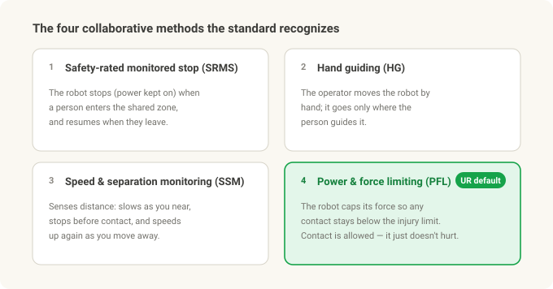
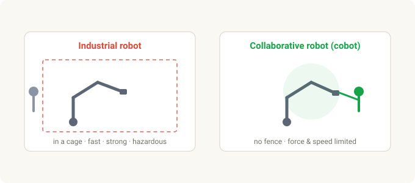
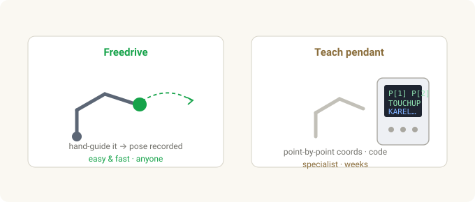
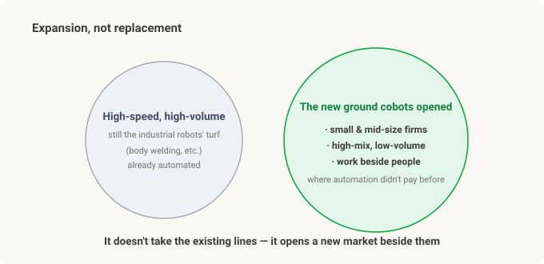

# What Is a Collaborative Robot (Cobot)? — Why Robots Stepped Out of the Cage

> **Cobot series · Part 1 of 3.** This one is *what a cobot is and why it's different*. [Part 2](cobot-ur-vs-fanuc.md) compares UR vs FANUC products; [Part 3](cobot-investing.md) connects it to Physical AI investing (UR = Teradyne · FANUC · NVIDIA).

Walk into a factory and most robots are behind bars. Yellow fencing, a red e-stop, a sign that says "open the door and it halts." Inside, the arm moves with a speed and force no human could match — and that speed and force is exactly **why it has to be caged.** Stand next to it and you're in danger.

Then, at some point, you start seeing arms that move **right next to the operator** with no fence at all. Nudge one and it stops; you can even grab it and drag it into the pose you want. That's a **collaborative robot — a cobot.**

This is the story of what a cobot actually is, how it differs from a traditional industrial robot, and why it reshaped automation over the last fifteen years.

---

## In 30 seconds

- A **traditional industrial robot** is fast, strong, and precise — and therefore **dangerous.** You separate it from people with a safety fence (a cage).
- A **cobot** is built to work **in the same space as people, without a fence.** It limits its own force and speed so a collision won't injure you.
- International standards define this — **ISO 10218** (robot and system safety) and **ISO/TS 15066** (the force and pressure limits for collaborative work). There are four collaborative methods; UR cobots primarily use **power-and-force limiting (PFL).**
- A cobot's real weapon isn't performance — it's **ease.** Teaching by grabbing the arm (freedrive) collapsed the cost of deploying a robot, so **small manufacturers** could finally automate.
- The price is being **slower, weaker, and shorter-reach.** So cobots don't *replace* high-volume lines — they **expand automation** into work that was never economical to automate.
- The category was created by **Universal Robots (UR), whose first commercial cobot shipped in 2008**; the incumbent's answer is **FANUC's CRX** line.

---

## The traditional industrial robot — why it lives in a cage

In one line, an industrial robot is **"a powerful machine in a locked room."**

- **Fast.** The tool tip moves at several meters per second.
- **Strong.** From a few-kg part up to FANUC's giant M-2000iA lifting a **car body over 2 tonnes.**
- **Precise.** Repeatability — how tightly it returns to the same taught point — is typically **±0.02–0.03 mm,** a fraction of a hair's width.

Those three traits are the heart of a mass-production line. And precisely because of them, **a person inside the working envelope is a serious-injury event.** So you wrap it in a safety fence / light curtain that stops it the instant a door opens or a person is detected. This isn't just practice, it's codified — industrial-robot safety lives in **ISO 10218-1 (the robot itself)** and **ISO 10218-2 (the installed system / cell).**

Teaching it was a specialist's job too. You'd jog the robot point by point on a **teach pendant,** recording positions, and write the harder logic in a robot language like **KAREL.** Frames and tool setup, safety-cell design, PLC handshaking — standing up one cell was a **weeks-to-months engineering project.** So the cost only made sense at **high volume,** where millions of parts amortized it.

That very wall — **expensive, slow to deploy** — is what the cobot set out to knock down.

---

## The cobot — a robot with the fence removed

The core of a cobot is this: **it limits its own force and speed so contact won't injure you.**

An industrial robot doesn't *sense* you and stop — it **cages** you out in the first place. A cobot is the opposite. It shares your space, but is built so that **any contact stays below the injury threshold.** Force/torque sensing in each joint means that if it meets more resistance than expected, it stops or backs off at once.

The document that put numbers on "safe to touch" is **ISO/TS 15066:2016.** It tabulates how much force and pressure each region of the human body can tolerate, and cobots are tuned to stay under those limits. (TS = Technical Specification, i.e. it supplements ISO 10218.)

There are four ways an application can count as "collaborative":

1. **Safety-rated monitored stop (SRMS)** — the robot halts (power retained) when a person enters the shared zone, and resumes when they leave.
2. **Hand guiding (HG)** — the operator moves the robot directly by hand; it only moves under manual command.
3. **Speed and separation monitoring (SSM)** — sensors track the human–robot distance; the robot slows as you approach, stops before contact, and speeds up as you retreat.
4. **Power and force limiting (PFL)** — the robot limits its own force so no contact exceeds the injury limits. Contact *is* allowed; it just can't hurt.

The cobots we usually picture — like UR's — run on that fourth method, **power-and-force limiting (PFL),** by default. They feel contact through force/torque sensing and stop, with dozens of configurable limits on force, speed, and momentum. (Add a sensor and they can do SSM or hand guiding too.)

---

## The real weapon isn't performance — it's ease

Here's the myth to clear up first: cobots didn't change the world by being *better.* Their performance is actually **worse** than an industrial robot's (more on that below). A cobot's real product is **accessibility.**

The traditional way meant punching coordinates on a pendant and writing robot code. Cobots invert that.

- **Freedrive teaching** — grab the arm, drag it to the pose you want, and it records that position. No coordinate math, no offline programming. It's the moment a first-timer thinks, "oh — *that's* all?"
- **PolyScope** — UR's tablet programming environment. Instead of writing code, you stack waypoints and simple logic as icons.
- **URCaps** — an ecosystem where grippers, cameras, and sensors plug in like apps. Adding a tool used to be an integration project; now it's "install the plug-in."

Why does this matter? Because it demolished the **fixed cost** of automation. Fencing, a specialist integrator, custom programming — once that big up-front cost disappeared, **small and mid-size manufacturers** and **high-mix, low-volume** shops could automate for the first time. What UR really sold wasn't robot performance; it was **"anyone can use it."**

---

## The price is slow, weak, short — so why does it win?

To be safe on contact, you have to give something up physically, because collision energy has to stay under the injury limits.

- **Slow.** Tool-tip speed is capped, and drops further when a person is near. A caged robot runs flat out because nobody can be in the way.
- **Low payload.** A heavier, faster arm stores more energy in a collision. Cobots top out at a few to tens of kg; big industrial arms reach hundreds to thousands.
- **Short reach, and slightly less precise** (cobot repeatability is roughly ±0.03–0.1 mm — fine for most tasks, but looser than a caged precision arm).

On paper it looks like a losing hand. Why it wins anyway:

- **No fence.** Safety guarding, light curtains, and cage floor space are a big share of a traditional cell's cost. Remove them and you save money and square meters.
- **Fast redeploy.** A cobot on a cart moves to another job in hours, not weeks.
- **High-mix, low-volume.** Where product changes often and a dedicated line can't be justified, the cobot fits.

The key point: **cobots are not replacing high-volume lines.** A car-body weld line is still fast caged robots. What cobots did was **open up work that was never economical to automate — small shops, high-mix cells, tasks beside people.** That's market *expansion,* not substitution.

---

## Who makes them — UR, and FANUC's answer

- **Universal Robots (UR)** — founded in Odense, Denmark in 2005; its **first commercial cobot, the UR5, shipped in 2008,** effectively creating the category. The lineup, by payload: **UR3e (3 kg) · UR5e (5 kg) · UR10e (12.5 kg) · UR16e (16 kg) · UR20 (20 kg) · UR30 (30 kg).** Since 2015 it's been a subsidiary of the US company **Teradyne.** (That ownership is the key hook for the Part 3 investing piece.)
- **FANUC** — the industrial-robot heavyweight (a "Big Four" with ABB, KUKA, Yaskawa) and the dominant supplier of machine-tool **CNC controls.** It announced its **one-millionth robot** shipped in 2023. Its answer in the cobot category is the **CRX series** — aimed squarely at UR's ease-of-use — e.g. the **CRX-25iA (25 kg payload, 1,889 mm reach).**
- Plenty of others compete too — Doosan Robotics, Techman, ABB (GoFa/YuMi), KUKA (LBR iiwa) — and UR remains the cobot market-share leader.

---

## The big myth — "a cobot is just a safe robot"

This is the most important one, so it gets its own section. **A cobot is not automatically safe on its own.**

Safety doesn't come from the arm alone; it comes from the **risk assessment of the whole installed application** — robot + gripper + workpiece + speed + task. A cobot holding a **sharp blade or a hot part,** or moving a heavy load fast, can absolutely injure someone. Power-and-force limiting protects against **the arm's own contact,** not against dangerous tooling.

"No fence" doesn't mean the safety work vanished, either — it means it **moved into the risk assessment and configuration** (force, speed, zone limits). Under ISO 10218-2, the integrator/employer is still responsible.

And one more: **"collaborative" is a property of the operation, not the robot.** The same UR arm can run fenced in a high-speed mode (not collaborative) or force-limited and fenceless (collaborative). How you set it up is what decides.

---

## Summary

| Idea | Core |
|---|---|
| **Industrial robot** | fast · strong · precise → dangerous → in a cage. ISO 10218 |
| **Cobot** | limits its own force & speed → fenceless, beside people. ISO/TS 15066 |
| **Collaborative methods** | monitored stop · hand guiding · speed-separation · power-force-limiting (PFL). UR uses PFL |
| **Real weapon** | not performance but *ease* — freedrive teaching collapsed the deployment cost |
| **The price** | slow · low payload · short reach. High-volume lines are still industrial |
| **Its role** | not replacement but **market expansion** — SMEs, high-mix, work beside people |
| **Who makes it** | UR (category creator, owned by Teradyne), FANUC CRX (incumbent's answer), others |
| **Biggest myth** | the arm alone doesn't make it safe — safety is a property of the whole *application* |

**The one thing to remember:** the cobot's innovation wasn't making the robot stronger — it was **removing the barriers to entry: the safety fence and the specialist integrator.** So the cobot story is really about *who sells that accessibility best* — which is where **[Part 2](cobot-ur-vs-fanuc.md) puts UR and FANUC head to head,** before **[Part 3](cobot-investing.md) connects it to Physical AI investing (UR = Teradyne · FANUC · NVIDIA).**

---

*Related: [Part 2 — UR vs FANUC, openness](cobot-ur-vs-fanuc.md) · [Part 3 — Physical AI investing](cobot-investing.md) · [From Stereo to Grasp](stereo-to-grasp.md)*

### Sources & trademarks

Safety content follows ISO 10218-1/-2 and ISO/TS 15066:2016; product specs and company facts follow the manufacturers' (Universal Robots, FANUC) public materials. ISO 10218 has a 2025 revision, and specific figures (payload, reach, repeatability) vary by model and datasheet revision, so they're given as approximations. Universal Robots, UR, PolyScope, and URCaps are trademarks of Universal Robots (Teradyne); FANUC and CRX are trademarks of FANUC Corporation, used here for identification only.

### Glossary

- *Collaborative robot / cobot* — a robot with limited force and speed, built to work in the same space as people without a fence.
- *Cage / cell* — the safety fencing that separates an industrial robot from people, and its working space.
- *ISO 10218* — the international industrial-robot safety standard. Part 1 is the robot; Part 2 is the installed system.
- *ISO/TS 15066* — the technical specification giving body-region force and pressure limits for collaborative work.
- *Power and force limiting (PFL)* — the collaborative method where the robot limits its force so contact stays under the injury limits. UR's default mode.
- *Freedrive / hand guiding* — teaching a pose by grabbing the arm and moving it by hand.
- *Teach pendant* — the traditional handheld terminal used to jog a robot point by point and record positions.
- *Payload / reach / repeatability* — how much it can lift · how far the arm reaches · how tightly it returns to the same point.
