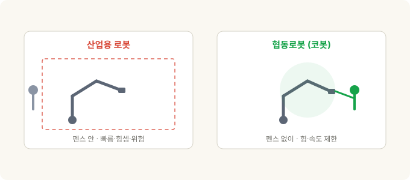
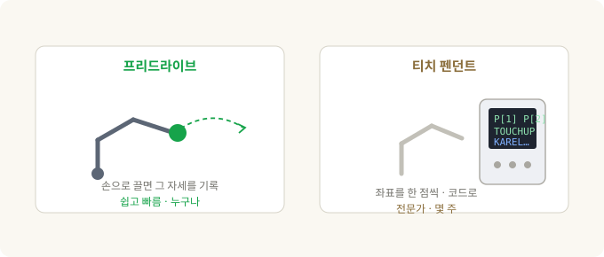

# 협동로봇(cobot)이란 — 로봇이 안전 펜스 밖으로 나온 이유

> **코봇 3부작 · 1부.** 이 글은 협동로봇이 *무엇이고 왜 다른가*입니다. 2부는 UR vs FANUC 제품 비교, 3부는 이걸 Physical AI 투자 관점(UR·FANUC·NVIDIA)으로 잇습니다.

공장에 처음 가보면 로봇은 대부분 **철창 안**에 있습니다. 노란 펜스, 빨간 비상정지 버튼, "문 열면 정지"라는 경고판. 그 안에서 로봇 팔은 사람은 흉내도 못 낼 속도와 힘으로 움직여요. 그리고 그 속도와 힘이야말로 그 로봇을 **우리 안에 가둬야 하는 이유**입니다. 사람이 그 옆에 서 있으면 위험하니까요.

그런데 언젠가부터, 펜스 없이 **작업자 바로 옆에서** 팔을 움직이는 로봇이 보이기 시작했습니다. 손으로 툭 밀면 멈추고, 심지어 손으로 잡고 원하는 자세로 끌고 갈 수도 있어요. 이게 **협동로봇(collaborative robot), 줄여서 코봇(cobot)**입니다.

이 글은 그 코봇이 정확히 무엇인지, 전통 산업용 로봇과 뭐가 다른지, 그리고 왜 지난 십수 년간 자동화의 판도를 바꿨는지에 대한 이야기예요.

---

## 30초 요약

- **전통 산업용 로봇**은 빠르고·힘세고·정밀하지만, 그래서 **위험**합니다. 사람과 분리하려고 안전 펜스(cage) 안에 둡니다.
- **코봇**은 사람과 **같은 공간에서 펜스 없이** 일하도록 설계됐어요. 부딪혀도 다치지 않게 힘과 속도를 스스로 제한하거든요.
- 이걸 정의하는 국제 규격이 있습니다 — **ISO 10218**(로봇·시스템 안전)과 **ISO/TS 15066**(협동 작업의 힘·압력 한계). 협동 방식은 네 가지고, UR 코봇은 그중 **동력·힘 제한(PFL)**을 씁니다.
- 코봇의 진짜 무기는 성능이 아니라 **'쉬움'**이에요. 팔을 손으로 잡고 가르치는(프리드라이브) 방식이 로봇 도입 비용을 확 낮춰, **중소기업**도 자동화를 시작할 수 있게 만들었습니다.
- 대가는 **느림·낮은 가반하중·짧은 리치**. 그래서 코봇은 고속·대량 라인을 *대체*하는 게 아니라, **자동화가 안 되던 영역을 넓히는** 쪽입니다.
- 카테고리를 만든 건 **UR(Universal Robots, 2008년 첫 상용 코봇)**, 인큐번트의 응수가 **FANUC의 CRX** 라인이에요.

---

## 전통 산업용 로봇 — 왜 우리(cage) 안에 사는가

산업용 로봇을 한마디로 요약하면 **"잠긴 방 안의 강력한 기계"**입니다.

- **빠릅니다.** 팔 끝이 초당 몇 미터로 움직여요.
- **힘셉니다.** 수 kg짜리 부품부터, FANUC의 초대형 모델(M-2000iA)은 **2톤이 넘는 차체**까지 듭니다.
- **정밀합니다.** 같은 점으로 되돌아오는 반복정밀도가 보통 **±0.02~0.03mm** — 머리카락 굵기의 몇 분의 일이에요.

이 세 가지가 대량생산 라인의 심장입니다. 그런데 정확히 그 세 가지 때문에, **사람이 그 작업 반경 안에 있으면 심각한 사고**가 납니다. 그래서 안전 펜스·라이트 커튼(광막)으로 둘러싸고, 문을 열거나 사람이 감지되면 즉시 멈추게 해요. 이건 관행이 아니라 규격입니다 — 산업용 로봇 안전은 국제 규격 **ISO 10218-1(로봇 본체)**과 **ISO 10218-2(설치된 시스템·셀)**로 정해져 있어요.

가르치는 방식도 전문가의 영역이었습니다. **티치 펜던트(teach pendant)**라는 단말기로 로봇을 한 점 한 점 이동시켜 위치를 기록하고, 복잡한 로직은 **KAREL** 같은 로봇 전용 언어로 짭니다. 좌표계(프레임)와 툴 설정, 안전 셀 설계, PLC 연동까지 — 셀 하나를 세우는 게 **몇 주에서 몇 달짜리 엔지니어링 프로젝트**였죠. 그러니 이 비용은 **대량생산**에서만 수지가 맞았습니다. 수백만 개를 찍어내야 그 초기 비용이 분산되니까요.

바로 이 **"비싸고 오래 걸리는 도입"**이라는 벽이, 코봇이 넘어뜨리려 한 지점입니다.

---

## 코봇 — 펜스를 없앤 로봇

코봇의 핵심은 **"부딪혀도 다치지 않게, 로봇 스스로 힘과 속도를 제한한다"**는 겁니다.

산업용 로봇은 사람을 *감지*해서 멈추는 게 아니라, 애초에 사람이 못 들어오게 **가둬**둡니다. 코봇은 반대예요. 사람과 같은 공간을 공유하되, **접촉이 일어나도 부상 한계 아래**가 되도록 만들어져 있습니다. 관절마다 힘·토크를 감지해서, 예상보다 큰 저항이 걸리면 즉시 멈추거나 물러나요.

이 "부딪혀도 안전한" 기준을 숫자로 정한 게 **ISO/TS 15066:2016**입니다. 사람 신체 부위별로 견딜 수 있는 힘·압력 한계를 표로 정해뒀고, 코봇은 그 한계 아래에서 움직이도록 튜닝됩니다. (TS는 Technical Specification, 즉 ISO 10218을 보완하는 기술 사양이에요.)

규격상 "협동 작업"으로 인정받는 방식은 네 가지입니다.

1. **안전정격 감시정지(SRMS)** — 사람이 공유 구역에 들어오면 로봇이 (전원은 유지한 채) 멈추고, 나가면 다시 움직입니다.
2. **핸드 가이딩(hand guiding)** — 작업자가 로봇을 직접 손으로 잡고 이동시킵니다. 사람이 시키는 대로만 움직여요.
3. **속도·분리 감시(SSM)** — 센서로 사람과의 거리를 재서, 가까워지면 느려지고 닿기 전에 멈췄다가, 멀어지면 다시 속도를 냅니다.
4. **동력·힘 제한(PFL)** — 로봇 자체가 힘을 제한해, 어떤 접촉도 부상 한계를 넘지 않게 합니다. 접촉 자체는 *허용*되지만, 아프지 않은 거예요.

우리가 흔히 떠올리는 코봇 — UR 같은 — 이 바로 이 네 번째, **동력·힘 제한(PFL)** 방식을 기본으로 씁니다. 힘·토크 센서로 접촉을 느껴 멈추고, 힘·속도·운동량 같은 수십 가지 안전 한계를 설정할 수 있어요. (필요하면 센서를 붙여 SSM이나 핸드 가이딩도 함께 씁니다.)

---

## 진짜 무기는 성능이 아니라 '쉬움'

여기서 오해를 하나 풀어야 합니다. 코봇이 세상을 바꾼 건 성능이 좋아서가 아니에요. 오히려 성능은 산업용 로봇보다 **떨어집니다**(뒤에서 설명). 코봇의 진짜 상품은 **접근성**입니다.

전통 방식은 티치 펜던트로 좌표를 찍고 로봇 언어로 프로그램을 짰다고 했죠. 코봇은 이걸 뒤집습니다.

- **프리드라이브(freedrive) 티칭** — 로봇 팔을 손으로 잡고 원하는 위치로 끌고 가면, 그 자세를 그대로 기록합니다. 좌표 계산도, 오프라인 프로그래밍도 필요 없어요. 처음 보는 사람도 "아, 이거면 되겠네" 하는 바로 그 순간입니다.
- **폴리스코프(PolyScope)** — UR의 태블릿 화면 프로그래밍 환경. 코드를 쓰는 게 아니라, 웨이포인트와 간단한 로직을 아이콘으로 쌓아 프로그램을 만듭니다.
- **URCaps** — 그리퍼·카메라·센서 같은 주변 장치를 플러그인처럼 꽂아 쓰는 생태계. 로봇의 앱스토어라고 보면 돼요. 예전엔 툴 하나 붙이는 것도 통합 프로젝트였는데, 이제 "플러그인 설치"가 됐습니다.

이게 왜 중요하냐면, 자동화의 **고정비**를 무너뜨렸기 때문입니다. 펜스 설계, 전문 통합 업체, 맞춤 프로그래밍 — 이 큰 초기 비용이 사라지자, **고정비를 감당 못 하던 중소기업**과 **다품종 소량생산** 현장이 처음으로 자동화를 시작할 수 있게 됐어요. 코봇이 판 건 로봇 성능이 아니라, 바로 이 **"누구나 쓸 수 있음"**입니다.

---

## 대가는 느림·약함·짧음 — 그런데 왜 이기나

부딪혀도 안전하려면 물리적으로 손해를 봐야 합니다. 충돌 에너지를 부상 한계 아래로 유지해야 하니까요.

- **느립니다.** 팔 끝 속도가 제한되고, 사람이 가까우면 더 느려집니다. 펜스 안 산업용 로봇은 아무도 못 들어오니 전속력으로 달리죠.
- **가반하중이 낮습니다.** 무겁고 빠른 팔은 충돌 시 더 큰 에너지를 담으니까요. 코봇은 보통 수 kg~수십 kg, 산업용 대형기는 수백~수천 kg입니다.
- **리치가 짧고**, 구조가 가벼워 **정밀도도 약간 떨어집니다**(코봇 반복정밀도 대략 ±0.03~0.1mm — 대부분의 작업엔 충분하지만 캐이지 안 정밀기보단 헐거워요).

이렇게 종이 스펙만 보면 코봇은 다 지는 싸움 같습니다. 그런데도 이기는 이유:

- **펜스가 없습니다.** 안전 펜스·광막·셀 바닥 면적은 전통 셀 비용의 큰 몫이에요. 그걸 없애면 돈과 공간이 절약됩니다.
- **재배치가 빠릅니다.** 카트에 얹은 코봇은 몇 시간이면 다른 작업으로 옮겨요. 셀을 다시 짜는 데 몇 주가 아니라요.
- **다품종 소량**에 강합니다. 제품이 자주 바뀌어 전용 라인을 깔 수 없는 현장이 코봇의 자리입니다.

핵심은 이겁니다. **코봇은 고속·대량 라인을 대체하는 게 아닙니다.** 자동차 차체 용접 라인은 여전히 빠른 산업용 로봇의 몫이에요. 코봇이 한 일은 **자동화가 애초에 수지가 안 맞던 영역 — 작은 공장, 다품종 셀, 사람 곁의 일 — 을 새로 열어젖힌 것**입니다. 대체가 아니라 시장 확대죠.

---

## 누가 만드나 — UR, 그리고 FANUC의 응수

- **Universal Robots(UR)** — 덴마크 오덴세에서 2005년 창업, **2008년 첫 상용 코봇 UR5**를 내놓으며 사실상 이 카테고리를 만들었습니다. 라인업은 가반하중 순으로 **UR3e(3kg)·UR5e(5kg)·UR10e(12.5kg)·UR16e(16kg)·UR20(20kg)·UR30(30kg)**. 2015년부터 미국 **Teradyne**의 자회사예요. (이 소유 구조가 3부 투자 편의 핵심 훅입니다.)
- **FANUC** — 산업용 로봇의 절대 강자(ABB·KUKA·야스카와와 함께 '빅4')이자 공작기계 **CNC 제어기**의 지배적 공급자. 2023년 **누적 100만 대** 로봇 출하를 발표했죠. 코봇 카테고리엔 **CRX 시리즈**로 응수했는데, 태블릿 드래그·드롭 프로그래밍을 앞세워 UR의 '쉬움'을 정면으로 겨눴습니다. 예: **CRX-25iA(25kg 가반, 리치 1,889mm)**.
- 이 외에도 두산로보틱스·테크맨·ABB(GoFa/YuMi)·KUKA(LBR iiwa) 등 여럿이 뛰고 있고, 코봇 시장 점유율 선두는 여전히 UR입니다.

---

## 흔한 오해 — "코봇은 그냥 안전한 로봇"

가장 중요한 오해라 따로 짚습니다. **코봇 자체가 자동으로 안전한 건 아닙니다.**

안전은 로봇 팔 하나에서 나오는 게 아니라, **설치된 작업 전체의 위험성 평가(risk assessment)**에서 나와요. 로봇 + 그리퍼 + 부품 + 속도 + 작업 내용을 통째로 봐야 합니다. **날카로운 칼날이나 뜨거운 부품**을 쥔 코봇, 혹은 무거운 짐을 빠르게 옮기는 코봇은 얼마든지 사람을 다치게 할 수 있어요. 동력·힘 제한이 막아주는 건 **로봇 팔 자체의 접촉**이지, 위험한 툴이 아닙니다.

"펜스가 없다"는 것도 **안전 작업이 사라졌다는 뜻이 아니라, 위험성 평가와 설정(힘·속도·구역 한계) 쪽으로 옮겨갔다**는 뜻이에요. 규격상 그 책임은 여전히 통합자·사용자에게 있습니다(ISO 10218-2).

그리고 하나 더 — **"협동"은 로봇의 속성이 아니라 '작업'의 속성**입니다. 같은 UR 팔도 펜스를 치고 고속 모드로 쓰면 협동이 아니고, 힘을 제한해 펜스 없이 쓰면 협동이에요. 어떻게 세팅하느냐가 정하는 겁니다.

---

## 정리

| 개념 | 핵심 |
|---|---|
| **산업용 로봇** | 빠르고·힘세고·정밀 → 위험 → 펜스(cage) 안. ISO 10218 |
| **코봇** | 힘·속도를 스스로 제한 → 펜스 없이 사람 옆에서. ISO/TS 15066 |
| **협동 방식** | 감시정지·핸드가이딩·속도분리감시·동력힘제한(PFL). UR은 PFL 기본 |
| **진짜 무기** | 성능 아닌 '쉬움' — 프리드라이브 티칭이 도입 고정비를 무너뜨림 |
| **대가** | 느림·낮은 가반하중·짧은 리치. 고속 대량 라인은 여전히 산업용 |
| **역할** | 대체가 아니라 **시장 확대** — 중소기업·다품종·사람 곁의 일 |
| **만드는 곳** | UR(카테고리 창시, Teradyne 소유), FANUC CRX(인큐번트 응수) 등 |
| **최대 오해** | 코봇 팔만으론 안전이 완성되지 않음 — 안전은 '작업 전체'의 성질 |

**기억할 한 가지:** 코봇의 혁신은 로봇을 더 세게 만든 게 아니라, **안전 펜스와 전문 통합이라는 진입장벽을 없앤 것**입니다. 그래서 코봇 이야기는 곧 "누가 그 접근성을 가장 잘 파느냐"의 이야기이고 — 다음 편에서 **UR과 FANUC의 제품을 정면으로 비교**한 뒤, 3부에서 이걸 **Physical AI 투자 관점(UR=Teradyne · FANUC · NVIDIA)**으로 이어보겠습니다.

---

*관련: [스테레오 비전에서 목표물 잡기까지 — 로봇은 목표한 사물을 어떻게 발견하는가](stereo-to-grasp.md)*

### 출처와 표기

안전 규격은 ISO 10218-1/-2 및 ISO/TS 15066:2016을, 제품 사양·기업 정보는 각 제조사(Universal Robots, FANUC)의 공개 자료를 근거로 했습니다. ISO 10218은 2025년 개정판이 발행됐으며, 세부 수치(가반하중·리치·반복정밀도)는 모델·데이터시트 개정에 따라 달라질 수 있어 근사치로 적었습니다. Universal Robots·UR·PolyScope·URCaps는 Universal Robots(Teradyne)의, FANUC·CRX는 FANUC Corporation의 상표이며, 지칭 목적으로만 사용했습니다.

### 용어 설명

- *협동로봇(collaborative robot) · 코봇(cobot)* — 사람과 같은 공간에서 펜스 없이 일하도록, 힘·속도를 제한한 로봇
- *펜스 / 셀(cage / cell)* — 산업용 로봇을 사람과 분리하는 안전 울타리와 그 작업 공간
- *ISO 10218* — 산업용 로봇 안전 국제 규격. Part 1은 로봇 본체, Part 2는 설치 시스템
- *ISO/TS 15066* — 협동 작업의 신체 부위별 힘·압력 한계를 정한 기술 사양
- *동력·힘 제한(PFL, Power and Force Limiting)* — 접촉이 일어나도 부상 한계를 넘지 않게 로봇이 힘을 제한하는 협동 방식. UR의 기본 모드
- *프리드라이브(freedrive) · 핸드 가이딩(hand guiding)* — 로봇 팔을 손으로 잡고 끌어 자세를 가르치는 방식
- *티치 펜던트(teach pendant)* — 로봇을 한 점씩 이동시켜 위치를 기록하는 전통적 단말기
- *가반하중(payload) · 리치(reach) · 반복정밀도(repeatability)* — 들 수 있는 무게 · 팔이 닿는 거리 · 같은 점으로 되돌아오는 정확도
