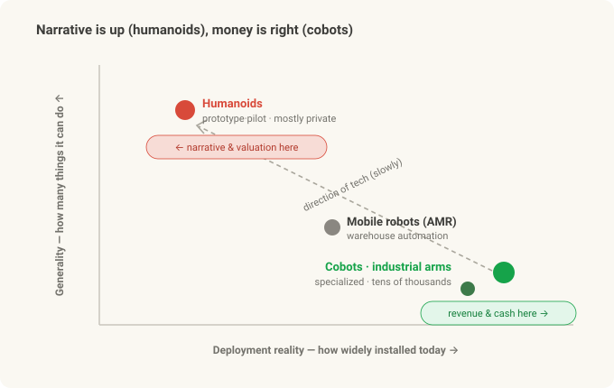
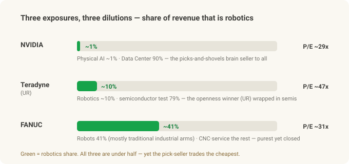
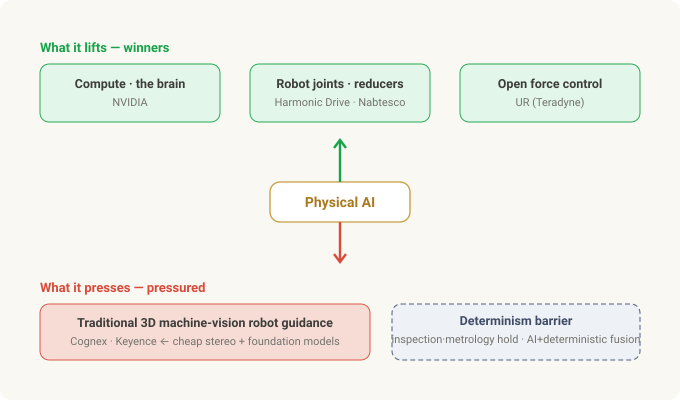
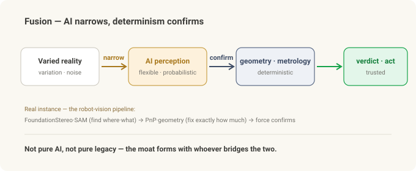

# Investing in Physical AI — There's No Pure-Play, and the Value Is Moving

> **Cobot series · Part 3 of 3 (finale).** [Part 1](cobot-basics.md) was what a cobot is; [Part 2](cobot-ur-vs-fanuc.md) split UR vs FANUC on "openness." Now we connect it to **investing** — if Physical AI is real, how do we buy it?

Suppose the first two parts convinced you Physical AI is real. AI becomes the robot's eyes and hands (the [Robot Vision series](stereo-to-grasp.md)), and what decides the contest isn't specs but openness (Part 2).

Then the natural next question: **"So — where do I invest?"**

Bad news first. **There's no clean stock to buy.** The names that come up when you search "Physical AI pure-play" — NVIDIA, Teradyne, FANUC — are all **diluted exposure in different ways.** And the good news: that's why this piece asks not "which stock" but **"where does value move?"** Drawing that map is the better trade.

---

## In 30 seconds

- **The narrative is humanoids; the money is cobots.** When people say Physical AI they picture a robot that walks like a person — but those are mostly **prototypes and pilots,** and mostly **private.** The actual revenue comes from the **cobots and industrial arms** already installed by the tens of thousands.
- **No pure-play.** No US large-cap sells "just cobots" or "just Physical AI." The closest are small (Korea's Doosan Robotics) or Chinese (humanoid makers UBTech and Unitree) — and the one that was supposed to become a ticker, ABB's robotics spin-off, was **sold to SoftBank instead of listing.**
- **Three flavors of dilution.** **NVIDIA** = the picks-and-shovels seller of brains to everyone (but Physical AI is ~1% of revenue, 90% is Data Center). **Teradyne** = the openness winner via UR (but ~10% of revenue; 79% is semiconductor test). **FANUC** = the purest automation name (but robots are 41% and mostly *traditional* industrial arms; China-cyclical).
- **A valuation twist.** On earnings (P/E), **NVDA is the cheapest of the three (~29x), and the cobot owner, TER, is the most expensive (~47x).** The pick-seller trades cheaper than the miner.
- **Value is moving.** Physical AI *lifts* one side (compute, robot-joint reducers, open force control) and *presses* another (the robot-guidance premium of traditional 3D machine vision).
- **The real moat = fusion.** AI is non-deterministic; industrial inspection is deterministic. Whoever **bridges** the two wins — not the pure-AI player, not the pure-legacy incumbent.
- *This is a viewpoint, not stock advice. Please read the disclosure at the bottom.*

---

## The narrative is humanoids; the money is cobots

Before the investing, set the board. "Physical AI" makes people overlay two different pictures:

- **Humanoids** — two legs, two arms, do-anything. The general-purpose dream: "just drop it into a human's spot."
- **Cobots / industrial arms** — one arm bolted to a table, repeating one task precisely in one place.

They're at completely different maturities.

| | **Cobot (collaborative robot)** | **Humanoid** |
|---|---|---|
| Form | fixed base + one arm | two legs + two arms, whole body |
| Status today | **tens of thousands deployed, cash-generating** | mostly **prototype / pilot** |
| ROI | proven (boring but sure) | **unproven,** expensive, hard |
| Good at | one place, one task | general — "anything" (still a dream) |
| What's left | mature | walking, battery, hand dexterity, safety, cost — all of it |
| Public access | listed (but diluted) | **mostly private** |

The point: **the hot narrative and valuation crowd around humanoids, but the revenue and cash flow come from cobots and industrial arms.** While the walking-robot clips rack up views, the money is quietly welding in a car plant.

And here's the trap. **The hot side (humanoids) is mostly un-buyable** — the Western leaders Figure, Agility, Apptronik, 1X are all private. The only listed pure humanoid plays are **Chinese** — UBTech, and Unitree (up +487% on its 2026 debut day). **The buyable side (cobots) is all a slice of a bigger company,** so it's diluted.

That gap — *you can't buy what you want, and what you can buy is diluted* — is where Part 3 starts.

---

## There's no pure-play

The honest answer to "just name me one Physical AI pure-play" is **"there isn't one in US large-caps."**

- **Doosan Robotics** (listed in Korea) — the **closest listed cobot pure-play,** but small and Korea-listed, so access and liquidity are limited.
- **UBTech · Unitree** (listed in China) — actually-listed **humanoid pure-plays** with real revenue (though humanoid revenue is still ~$100M each). Not industrial cobots, and China-listed.
- **Symbotic (SYM)** — the **closest thing to a US-listed Physical AI pure-play,** but really a **warehouse-automation proxy** where ~85% of revenue is Walmart. Neither a cobot nor a humanoid play.
- **ABB robotics — off.** ABB once planned to spin its Robotics division into a separate listing, then **scrapped it and sold the whole thing to SoftBank** (~$5.4B, announced late 2025). So no new ticker here either.
- Everything else — Yaskawa, Rockwell, Intuitive Surgical — is **diversified or a different domain** (surgical robots, etc.), not a cobot pure-play.

Conclusion: there's **no clean way to buy this board with a US large-cap.** So we examine the three names you *can* actually hold — NVIDIA, Teradyne, FANUC — and see **how each is diluted.**

---

## Three exposures — each diluted differently

All three have under half their revenue in robots — each diluted by something different. Here it is at a glance.

### NVIDIA — selling brains to everyone (picks and shovels)

NVIDIA's role in Physical AI is **"the merchant selling jeans and picks in a gold rush."** Whoever wins the robot war, that robot's brain and training ground come from NVIDIA. In fact it sells compute to **both** Part 2 protagonists — **UR (Teradyne) and FANUC.** A neutral arms dealer.

- **Brain:** Jetson Thor (on-robot computer). **Training ground:** Isaac Sim / Omniverse (digital-twin simulation), Cosmos (world models). **Model:** Isaac GR00T N1 — an **open** vision-language-action foundation model for humanoids.
- Jensen Huang's "Physical AI is the next wave" story is **real.** The products exist and lead.

**But on the income statement it's a rounding error.** ~90% of NVIDIA's revenue (about $216B in FY2026) is **Data Center,** and the "Automotive & Robotics" bucket robots live in is **~1%** — and mostly automotive, so **pure robotics is under 1%.** Buying NVDA "for Physical AI" buys **a very thin slice of a $5.5T data-center company,** at a rich price.

- The irony: it's still **the cheapest of the three on earnings (P/E ~29x)** — because earnings are growing so fast.
- One line: **right technology, tiny exposure, price set by Data Center.**

### Teradyne (TER) — the most direct way to buy UR, wrapped in semiconductor test

The most direct public route to Part 2's openness winner, **Universal Robots,** is Teradyne. UR + MiR (mobile robots) form Teradyne's Robotics segment.

- UR bills itself as **"the preferred platform for Physical AI,"** shipping an NVIDIA-based "AI Accelerator" — pushing exactly Part 2's openness.
- **The problem is weight.** Robotics is **~10%** of Teradyne's revenue (about $308M in FY2025, mostly UR). The other **79% is semiconductor test equipment.** So TER is **fundamentally a semiconductor-test company** with a cobot side-business.
- A subtler trap: TER's loud "AI" story is really **semiconductor gear that tests AI chips,** not Physical AI cobots. Same word, easy to conflate.

**But don't nail it down as "declining."** Robotics is **rebounding** after two 2025 restructurings (which cut breakeven revenue from $440M to $365M) — Q2 2026 hit a **record $100M quarter (+33%).** A side-business, but a growing one.

- Valuation: **the most expensive of the three (P/E ~47x)** — the AI-chip-test + robotics rebound is already priced in.
- One line: **the most direct buy on the openness winner (UR), but it arrives wrapped in the semiconductor-test cycle.**

### FANUC — the purest robotics of the three, but the "closed" side

The **purest factory-automation company** here is FANUC. Robots + CNC + Robomachine — all automation.

- **Best balance sheet.** Debt-free, net cash ~$5.1B, operating margin **~21%.** It pays a dividend (~1.9% yield).
- **Yet still not "pure."** Robots are **41%** of revenue; the rest splits into CNC/FA (24%), Robomachine (17%), and Service. And that 41% is **mostly traditional industrial robots,** not cobots (CRX).
- **And it's Part 2's "closed" side.** On the openness axis FANUC trailed. But in late 2025 it **partnered with NVIDIA** (Jetson, Isaac Sim, Omniverse into ROBOGUIDE) to start opening up, and reported **1,000+ AI-robot orders** right after. The hedge has begun.
- **Access caveat:** the Tokyo listing (**6954**) is the real body; the US ADR (**FANUY**) trades OTC at 1 ADR = 0.1 share and is thinner. And revenue swings hard with **China capex (especially EV).**
- Valuation: **P/E ~31x** (in the middle). One line: **the purest-robotics balance-sheet name, but the closed side of the thesis + a China cycle.**

### One table

| | **NVIDIA** | **Teradyne (UR)** | **FANUC** |
|---|---|---|---|
| Physical AI purity | tiny (~1%, mostly auto) | low (Robotics ~10%) | mid (robots 41%, mostly industrial) |
| Part 2 openness position | enabler (sells to both) | **open (UR)** | closed (+NVIDIA hedge) |
| Dilution | Data Center 90% | semi test 79% | CNC·Robomachine·Service + China |
| Financial strength | hyper-growth | semi cycle | **debt-free · net cash · high margin** |
| Valuation (P/E, approx) | ~29x (**lowest**) | ~47x (**highest**) | ~31x |
| Access | mega-cap, top liquidity | large-cap | 6954 primary / FANUY thin |

*(Figures are 2025–2026 approximations; they move with timing, FX, and the AI cycle.)*

---

## Where value moves — the shift map

Stopping at three tickers is only half the picture. The real Physical AI story is **where value moves from and to.** Two directions.

**What it lifts (winners):**
- **Compute** — NVIDIA. Whoever wins, the brain comes from here.
- **Robot joints = reducers** — precision-reducer makers like Harmonic Drive (6324) and Nabtesco (6268). **Every** robot arm and humanoid uses these at every joint. The **reducer maker can be a purer robot bet than the robot maker** — whoever wins, the joints all come from here. The real picks and shovels. (Caveat: Chinese reducer makers — Sanhua, Leaderdrive — are moving into the cost-sensitive humanoid tier, so the Japanese duopoly isn't forever.)
- **Open force control** — Part 2's axis. The side, like UR (Teradyne), that lets AI reach the force loop.

**What it presses (pressured):**
- **The robot-guidance premium of traditional 3D machine vision** — the "tell the robot where to grab" work that firms like Cognex (CGNX) and Keyence (6861) solved with expensive proprietary 3D vision. Now **cheap stereo cameras + foundation models** (the very pipeline you saw in the [Robot Vision series](stereo-to-grasp.md)) undercut it. The old "expensive 3D scanner + proprietary software + vision engineer" bundle thins out.

### The determinism barrier — why they don't just die

Stop here and you'd conclude "traditional vision is finished." It isn't. **The erosion hits a wall.**

Industrial inspection demands **determinism** — the same answer every time, traceable, a certifiable pass/fail, never letting a bad part through. AI foundation models are **non-deterministic** — flexible but probabilistic, occasionally hallucinating, and "94% likely good" can't go straight into a safety/quality gate.

**These collide head-on.** So value settles not in replacement but in **fusion.**

> **AI narrows; determinism confirms.**
> AI takes the flexible, perception-hard part (find the object, absorb variation); classical vision and geometry take the verdict and the measurement (sub-pixel gauge, hard thresholds).

This is exactly **your Robot Vision pipeline** — FoundationStereo/SAM (AI, flexible) find the "where/what," geometry (deterministic math) fixes "exactly how much," and force confirms the grasp. **Fusion is the architecture that series already proved.**

So for investing:
- **Why incumbents are defended** — Cognex and Keyence already **own the deterministic, certified layer,** and can bolt AI on top. The robot-guidance segment gets pressured, but the **inspection / metrology / reading core likely holds** — because they hold the fusion layer.
- **NVIDIA is an enabler, not a replacer** — it supplies the AI layer, not the deterministic verdict. It doesn't kill the incumbents; it powers their fusion.

In fact, Cognex and Keyence **each grew ~9%** through 2025–2026 — the very window this thesis predicts pain. The pressure is not "revenue collapse" but **margin/mix pressure at the 3D-guidance frontier.** That the frontier is real shows elsewhere — Intel's RealSense spun out as a standalone company in 2025 and **refocused on robotics,** and NVIDIA's FoundationStereo and FoundationPose now ship inside Isaac ROS. The erosion is coming — at the frontier, not the core.

---

## Closing — the real moat is fusion

To sum up: Physical AI has no clean pure-play. NVDA's exposure is thin, TER is wrapped in semis, FANUC is split and closed. The hot humanoids are mostly un-buyable.

So it's not a game of picking one ticker — it's a game of reading **where value moves.** And that movement converges on one place.

**Pure-AI startups** can't meet industry's determinism. **Pure-legacy incumbents** can't absorb AI's variety. The winner is **whoever owns the fusion of the two.** Part 2's openness echoes here — you have to be **open** to slot a deterministic verification layer around the AI; close it off and you can't attach that layer.

Picks (NVDA) sell, joints (reducers) turn, open arms (UR) take AI in, and deterministic eyes (Cognex/Keyence) are positioned to absorb AI. **Physical AI's real moat isn't with the robot makers or the AI makers — it forms with whoever bridges the two.**

That closes the trilogy. What a cobot is (Part 1), what divides them (Part 2), and how to read and invest in the board (Part 3) — the one word running through all of it was **openness,** and, built on top of it, **fusion.**

---

## Summary

| Lens | Takeaway |
|---|---|
| Narrative vs revenue | Narrative/valuation = humanoids (mostly private); revenue/cash = cobots/industrial arms |
| Pure-play | None in US large-caps (Doosan = small/Korea, UBTech/Unitree = China humanoid, ABB robotics = sold to SoftBank) |
| The three, one line | NVDA = thin but cheapest · TER = openness winner wrapped in semis · FANUC = pure balance-sheet name but closed |
| Value shift | Lifts: compute · reducers · open force control / Presses: traditional 3D vision's robot guidance |
| Watch (risks) | Chinese reducer competition · FANUC's China cycle · FANUY liquidity · Symbotic's Walmart concentration |
| Real moat | **Fusion** — whoever bridges non-deterministic AI + deterministic inspection |

---

*Related: [What Is a Collaborative Robot (Cobot)?](cobot-basics.md) · [UR vs FANUC — Openness](cobot-ur-vs-fanuc.md) · [From Stereo to Grasp](stereo-to-grasp.md) · [Jetson + ROS 2 Setup — Field Notes (1)](jetson-ros2-setup.md)*

### Sources & trademarks

Financial figures follow each company's disclosures / earnings releases (FY2025–2026) and public market data; market caps, P/Es, segment shares, and revenues are **approximations** that vary with timing, FX, and fiscal-year conventions. Valuations are rough point-in-time references, not price targets. Company/platform/product names (NVIDIA·Jetson·Isaac·GR00T, Teradyne·Universal Robots·MiR, FANUC·CRX·ROBOGUIDE, Cognex, Keyence, ABB, Harmonic Drive, Nabtesco, Unitree, Doosan Robotics, etc.) are trademarks of their respective owners, used here for identification only. **This article is not a solicitation to buy or sell any security and is not investment advice; the author accepts no responsibility for any investment outcome.** Investment decisions and their consequences are entirely the reader's own.

### Glossary

- *Physical AI* — AI that, beyond simulation and screens, perceives and acts in the physical world through robots
- *Pure-play* — a stock focused on a single business that "cleanly" represents a theme
- *Picks and shovels* — the gold-rush strategy of selling gear instead of mining gold; you win whoever the winner is
- *P/E (price/earnings)* — price ÷ earnings per share; lower means cheaper relative to earnings (simplified)
- *ADR* — a depositary receipt that lets a foreign stock trade in the US (FANUY = FANUC's ADR)
- *Semiconductor test (ATE)* — equipment that checks whether chips work; Teradyne's core business
- *Reducer* — the precision part that turns a motor's fast spin into a robot joint's slow, forceful motion
- *GR00T* — NVIDIA's open action foundation model for humanoids
- *Deterministic / non-deterministic* — always the same answer to the same input (deterministic) vs possibly varying, probabilistic (non-deterministic)
- *TAM* — the theoretical maximum market (Total Addressable Market)
