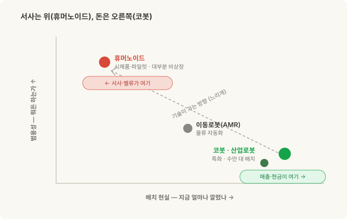
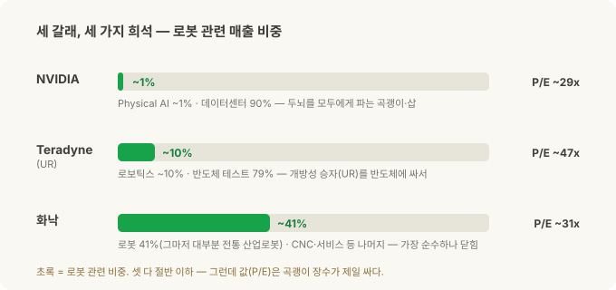
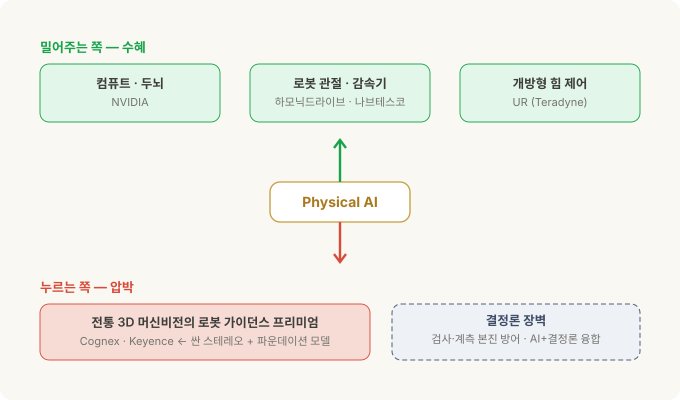
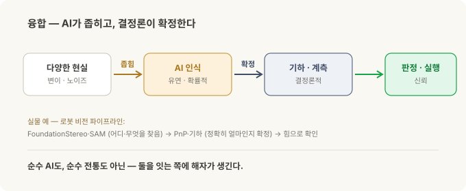

# Physical AI에 투자한다면 — 순수 플레이는 없고, 가치는 이동한다

> **코봇 3부작 · 3부(완결).** [1부](cobot-basics.md)는 코봇이 무엇인가, [2부](cobot-ur-vs-fanuc.md)는 UR vs 화낙(FANUC)을 '개방성'으로 갈랐습니다. 이번엔 그걸 **투자**와 연결합니다 — Physical AI가 진짜라면, 우리는 그걸 어떻게 사는가.

앞의 두 편에서 Physical AI가 진짜라는 걸 봤다고 칩시다. AI가 로봇의 눈과 손이 되고([로봇 비전 시리즈](stereo-to-grasp.md)), 그 승부를 가르는 건 스펙이 아니라 '개방성'이었죠(2부).

그럼 자연스러운 다음 질문. **"그래서, 어디에 투자하지?"**

나쁜 소식부터. **깔끔하게 살 수 있는 종목이 없습니다.** 'Physical AI 순수주'를 검색하면 나오는 이름들 — NVIDIA, Teradyne, 화낙 — 은 셋 다 **서로 다른 방식으로 희석된** 노출이에요. 그리고 좋은 소식. 그래서 이 글의 질문은 "무슨 종목을 사냐"가 아니라 **"가치가 어디서 어디로 이동하나"**입니다. 그 지도를 그리는 게 훨씬 남는 장사예요.

---

## 30초 요약

- **서사는 휴머노이드, 돈은 코봇.** 요즘 Physical AI 하면 떠오르는 건 사람처럼 걷는 로봇인데, 그건 대부분 **시제품·파일럿**이고 **대부분 비상장**입니다. 실제로 매출을 내는 건 공장에 이미 수만 대 깔린 **코봇·산업로봇**이에요.
- **순수 플레이는 없다.** 미국 대형주 중에 "코봇만" 혹은 "Physical AI만" 파는 회사가 없어요. 가장 가까운 건 소형(한국 두산로보틱스)·중국(휴머노이드 UBTech·Unitree)이거나, 아예 티커가 안 생긴 것 — 한때 기대됐던 ABB 로보틱스 분사는 상장 대신 **소프트뱅크에 매각**됐습니다.
- **세 갈래, 세 가지 희석.** **NVIDIA** = 모두에게 두뇌를 파는 곡괭이·삽(단 Physical AI는 매출의 ~1%, 90%가 데이터센터). **Teradyne** = UR을 가진 개방성 승자(단 매출의 ~10%, 79%가 반도체 테스트). **화낙** = 가장 순수한 자동화(단 로봇은 41%이고 대부분 전통 산업로봇, 중국 경기민감).
- **밸류에이션 반전.** 이익 대비(P/E)로 보면 **NVDA가 셋 중 제일 싸고(~29배), 코봇 주인 TER이 제일 비쌉니다(~47배).** 곡괭이 장수가 광부보다 싸게 거래되는 아이러니.
- **가치는 이동한다.** Physical AI가 **밀어주는 쪽**(컴퓨트·로봇 관절 감속기·개방형 힘 제어)과 **눌리는 쪽**(전통 3D 머신비전의 로봇 가이던스 프리미엄)이 갈립니다.
- **진짜 해자 = 융합.** AI는 비결정론적, 산업검사는 결정론적. 이 둘을 **연결하는 쪽**이 이깁니다. 순수 AI도, 순수 전통도 아닌.
- *이 글은 종목 추천이 아니라 관점입니다. 맨 아래 고지를 읽어주세요.*

---

## 서사는 휴머노이드, 돈은 코봇

투자 얘기 전에 판을 깔아야 합니다. Physical AI라는 말에 사람들은 두 가지 다른 그림을 겹쳐 떠올려요.

- **휴머노이드** — 사람처럼 두 다리로 걷고 두 팔로 뭐든 하는 로봇. "사람 자리에 그냥 투입"하는 범용의 꿈.
- **코봇/산업로봇** — 테이블에 고정된 팔 하나. 한 자리에서 한 작업을 정밀하게 반복.

둘은 성숙도가 완전히 다릅니다.

| | **코봇 (협동로봇)** | **휴머노이드** |
|---|---|---|
| 형태 | 고정 베이스 + 한 팔 | 두 다리 + 두 팔, 전신 |
| 지금 상태 | **현장에 수만 대, 돈을 번다** | 대부분 **시제품·파일럿** |
| ROI | 검증됨(지루하지만 확실) | **미검증**, 비싸고 어려움 |
| 잘하는 것 | 한 자리 한 작업 | 범용 — "뭐든" (아직 꿈) |
| 남은 숙제 | 성숙 단계 | 보행·배터리·손 기민성·안전·원가 전부 |
| 상장 접근성 | 상장(단 희석) | **대부분 비상장** |

핵심은 이겁니다. **뜨거운 서사와 밸류에이션은 휴머노이드에 쏠려 있는데, 실제 매출과 현금흐름은 코봇·산업로봇에서 나옵니다.** 사람처럼 걷는 로봇 영상이 조회수를 먹는 동안, 정작 돈은 자동차 공장에서 조용히 용접하는 팔에서 돌아요.

그리고 여기 함정. **뜨거운 쪽(휴머노이드)은 대부분 못 삽니다** — Figure, Agility, Apptronik, 1X 같은 서구 유력 주자가 죄다 비상장이에요. 상장된 순수 휴머노이드는 **중국계뿐** — UBTech, 그리고 Unitree(2026년 8월 상장 첫날 +487%) 정도. **살 수 있는 쪽(코봇)은 죄다 큰 회사의 일부**라 희석돼 있고요.

이 간극 — *사고 싶은 건 못 사고, 살 수 있는 건 희석돼 있다* — 이 3부 전체의 출발점입니다.

---

## 순수 플레이는 없다

"Physical AI 순수주 하나만 콕 집어줘"에 대한 정직한 답은 **"미국 대형주엔 없다"**입니다.

- **두산로보틱스**(한국 상장) — 상장된 **코봇 순수주에 가장 근접**하지만 소형이고 한국 상장이라 접근성·유동성이 제한적.
- **UBTech·Unitree**(중국 상장) — 실제로 상장돼 매출도 내는 **휴머노이드 순수주**(단 아직 휴머노이드 매출은 각각 1억 달러 안팎). 산업 코봇이 아니고 중국 상장이라는 벽.
- **Symbotic(SYM)** — 미국 상장 중 **Physical AI 순수주에 가장 근접**하지만, 실은 매출의 ~85%가 월마트인 **창고 자동화 프록시**. 순수 코봇도 휴머노이드도 아님.
- **ABB 로보틱스 — 무산.** 한때 로보틱스 부문을 별도 상장으로 분사한다던 ABB는 계획을 접고 **소프트뱅크에 통째로 매각**(약 54억 달러, 2025년 말 발표)하기로 했어요. 즉 여기서도 **새 티커는 안 생깁니다.**
- 그 외 Yaskawa·Rockwell·Intuitive Surgical 등은 전부 **분산형이거나 다른 도메인**(수술로봇 등)이라 코봇 순수주가 아닙니다.

결론: 지금 이 판을 **미국 대형주로 깔끔하게 사는 길은 없습니다.** 그래서 실제로 손에 쥘 수 있는 세 이름 — NVIDIA·Teradyne·화낙 — 을 뜯어보되, **각자 어떻게 희석돼 있는지**를 봐야 해요.

---

## 세 갈래 노출 — 각자 다르게 희석돼 있다

세 이름 모두 로봇 노출이 매출의 절반을 못 넘깁니다 — 각자 다른 것에 희석돼 있어요. 한눈에 보면 이렇습니다.

### NVIDIA — 모두에게 두뇌를 파는 곡괭이·삽

Physical AI에서 NVIDIA의 자리는 **"골드러시에 청바지·곡괭이 파는 상인"**입니다. 누가 로봇 전쟁에서 이기든, 그 로봇의 두뇌와 훈련장은 NVIDIA에서 나와요. 실제로 2부의 두 주인공 **UR(Teradyne)에도, 화낙에도** NVIDIA가 컴퓨트를 팝니다 — 중립적 무기상.

- **두뇌**: Jetson Thor(로봇용 온보드 컴퓨터). **훈련장**: Isaac Sim·Omniverse(디지털 트윈 시뮬레이션), Cosmos(월드 모델). **모델**: Isaac GR00T N1 — 휴머노이드용 **개방형** 비전-언어-행동 파운데이션 모델.
- 젠슨 황의 "Physical AI가 다음 물결" 서사는 **진짜**입니다. 제품은 실재하고 앞서 있어요.

**그런데 손익계산서에선 반올림 오차입니다.** NVIDIA 매출(2026 회계연도 약 2,160억 달러)의 **~90%가 데이터센터**고, 로봇이 속한 '자동차·로보틱스'는 **~1%**, 그마저 대부분 자동차라 **순수 로봇은 1% 미만**이에요. 즉 "Physical AI 때문에 NVDA 산다"는 건, **시가총액 5.5조 달러 규모의 데이터센터 회사 속의 아주 얇은 조각**을 아주 비싸게 사는 셈.

- 아이러니: 그런데도 **이익 대비로는 셋 중 제일 쌉니다(P/E ~29배)** — 이익이 워낙 빠르게 늘어서요.
- 한 줄 요약: **기술은 정답, 노출은 극소량, 값은 데이터센터가 정한다.**

### Teradyne(TER) — UR을 사는 가장 직접적인 길, 반도체 테스트에 싸여

2부의 개방성 승자 **Universal Robots**를 공개시장에서 사는 가장 직접적인 통로가 Teradyne입니다. UR + MiR(이동로봇)이 Teradyne의 로보틱스 부문이에요.

- UR은 **"Physical AI의 선호 플랫폼"**을 자처하고, NVIDIA 기반 'AI Accelerator'를 내놓는 등 2부의 개방성을 그대로 밀고 있습니다.
- **문제는 비중.** 로보틱스는 Teradyne 매출의 **~10%**(2025년 약 3억 달러, 이 중 UR이 대부분). 나머지 **79%는 반도체 테스트 장비**예요. 즉 TER은 **본질적으로 반도체 테스트 회사**고, 코봇은 곁가지.
- 더 미묘한 함정: TER의 요란한 "AI" 스토리는 사실 **AI 칩을 테스트하는 반도체 장비** 쪽이지, Physical AI 코봇이 아닙니다. 이름은 같은 'AI'라 헷갈리기 딱 좋아요.

**단, 쇠퇴로 못 박으면 안 됩니다.** 로보틱스는 2025년 두 차례 구조조정(손익분기 매출을 $440M→$365M로 낮춤) 뒤 **반등 중** — 2026년 2분기 분기 **사상 첫 $100M(+33%)**를 찍었어요. 곁가지지만 다시 자라는 곁가지.

- 밸류에이션: 셋 중 **제일 비쌉니다(P/E ~47배)** — AI 칩 테스트 + 로보틱스 반등을 이미 값에 담아서.
- 한 줄 요약: **개방성 승자(UR)를 가장 직접 사지만, 반도체 테스트 사이클에 싸여 온다.**

### 화낙(FANUC) — 셋 중 가장 순수한 로보틱스, 그런데 '닫힌' 쪽

셋 중 **가장 순수한 공장자동화 회사**는 화낙입니다. 로봇 + CNC + 로보머신, 전부 자동화예요.

- **체력은 최고.** 무차입·순현금 약 51억 달러, 영업이익률 **~21%**의 고수익 구조. 배당도 줍니다(수익률 ~1.9%).
- **그런데도 '순수'는 아니에요.** 로봇은 매출의 **41%**, 나머지는 CNC/FA(24%)·로보머신(17%)·서비스로 쪼개집니다. 게다가 그 로봇 41%도 **대부분 전통 산업로봇**이지 코봇(CRX)이 아니에요.
- **그리고 2부의 '닫힌' 쪽.** 개방성 축에선 화낙이 뒤처졌죠. 다만 2025년 말 **NVIDIA와 손잡고**(Jetson·Isaac Sim·Omniverse를 ROBOGUIDE에 통합) 개방에 착수했고, 화낙은 발표 직후 **AI 로봇 1,000대+ 수주**를 밝혔습니다 — 헤지는 시작됐어요.
- **접근성 주의:** 도쿄 상장(**6954**)이 본체고, 미국 ADR(**FANUY**)는 OTC에 1 ADR = 0.1주라 상대적으로 얇습니다. 그리고 매출이 **중국 경기(특히 EV 설비투자)**에 크게 흔들려요.
- 밸류에이션: **P/E ~31배**(중간). 한 줄 요약: **가장 순수한 로보틱스 체력주지만, 논지의 닫힌 쪽 + 중국 사이클.**

### 한 장 비교

| | **NVIDIA** | **Teradyne(UR)** | **화낙** |
|---|---|---|---|
| Physical AI 순수도 | 극소(~1%, 대부분 자동차) | 낮음(로보틱스 ~10%) | 중간(로봇 41%, 대부분 산업용) |
| 2부 개방성 위치 | 조력자(양쪽에 판매) | **열림(UR)** | 닫힘(+NVIDIA 헤지) |
| 희석 요인 | 데이터센터 90% | 반도체 테스트 79% | CNC·로보머신·서비스 + 중국 |
| 체력 | 초고성장 | 반도체 사이클 | **무차입·순현금·고마진** |
| 밸류(P/E, 근사) | ~29배(**최저**) | ~47배(**최고**) | ~31배 |
| 접근성 | 대형·유동성 최상 | 대형 | 6954 본체 / FANUY 얇음 |

*(수치는 2025~2026 시점 근사치. 시점·환율·AI 사이클에 따라 움직입니다.)*

---

## 가치는 어디서 어디로 — 이동 지도

종목 세 개로 끝내면 반쪽입니다. Physical AI의 진짜 그림은 **가치가 어디서 어디로 옮겨가나**예요. 두 방향이 있습니다.

**밀어주는 쪽(수혜):**
- **컴퓨트** — NVIDIA. 누가 이기든 두뇌는 여기서.
- **로봇 관절 = 감속기** — 하모닉드라이브(6324)·나브테스코(6268) 같은 정밀 감속기 회사. **모든** 로봇팔과 휴머노이드가 관절마다 이걸 씁니다. 로봇 회사보다 **감속기 회사가 더 순수한 로봇 베팅**일 수 있어요 — 누가 이기든 관절은 다 여기서 나오니까. 진짜 곡괭이·삽. (단 주의: 중국 감속기 업체(Sanhua·Leaderdrive 등)가 원가 민감한 휴머노이드 관절에서 치고 들어와, 일본 과점이 영원하진 않습니다.)
- **개방형 힘 제어** — 2부의 그 축. UR(Teradyne)처럼 AI가 힘까지 만질 수 있게 열어둔 쪽.

**눌리는 쪽(압박):**
- **전통 3D 머신비전의 로봇 가이던스 프리미엄** — Cognex(CGNX)·Keyence(6861) 같은 회사가 비싼 독점 3D 비전으로 풀던 "로봇에게 어디를 잡을지 알려주는" 일. 이제 **싼 스테레오 카메라 + 파운데이션 모델**(당신이 [로봇 비전 시리즈](stereo-to-grasp.md)에서 본 그 파이프라인)이 잠식합니다. 예전의 "비싼 3D 스캐너 + 독점 SW + 비전 엔지니어" 묶음이 얇아져요.

### 결정론 장벽 — 그런데 왜 안 죽나

여기서 멈추면 "전통 비전은 끝"이라는 성급한 결론이 됩니다. 아니에요. **잠식엔 벽이 있습니다.**

산업검사가 요구하는 건 **결정론**입니다 — 매번 똑같은 답을 주고, 이력을 추적할 수 있고, 합격·불합격이 인증되고, 불량은 절대 통과시키지 않는 것. 반면 AI 파운데이션 모델은 **비결정론적**이에요 — 유연하지만 확률적이고, 가끔 환각하고, "94% 양품 같음"은 안전·품질 게이트에 그대로 못 넣습니다.

**이 둘은 정면으로 충돌합니다.** 그래서 가치가 자리 잡는 곳은 대체가 아니라 **융합**이에요.

> **AI가 좁히고, 결정론이 확정한다.**
> AI는 어려운 '알아보기'(물체를 찾아내고, 조금씩 다른 모양도 알아채는 일)를 맡고, 전통 비전·기하는 '정밀히 재서 판정하기'(정확히 재고, 딱 떨어지는 합격선을 긋는 일)를 맡습니다.

이게 바로 **당신의 로봇 비전 파이프라인**입니다 — FoundationStereo·SAM(AI, 유연)으로 "어디/무엇"을 찾고, 기하 계산(늘 같은 답을 주는 수학)으로 "정확히 얼마"를 확정하고, 힘으로 확인해 잡죠. **융합은 이미 그 글이 증명한 아키텍처**예요.

그래서 투자로 보면:
- **인컴번트가 방어되는 진짜 이유** — Cognex·Keyence는 **결정론·인증 레이어를 이미 소유**하고, 그 위에 AI를 얹을 수 있습니다. 로봇 가이던스 세그먼트는 눌리되, **검사·계측·판독 본진은 방어될 가능성이 큽니다.** 융합 레이어를 쥐고 있으니까.
- **NVIDIA는 대체자가 아니라 조력자** — AI 층은 주지만 결정론적 판정은 안 줍니다. 인컴번트를 죽이는 게 아니라 그들의 융합을 가능케 해요.

실제로 Cognex·Keyence는 이 논지가 고통을 예언한 바로 그 시기(2025~2026)에도 **매출이 ~9%씩 늘었습니다.** 압박은 '매출 붕괴'가 아니라 **3D 가이던스 최전선의 마진·믹스 압박**이에요. 그 최전선이 진짜라는 신호는 따로 있죠 — 인텔 RealSense가 2025년 별도 회사로 분사해 **로봇 쪽으로 방향을 튼 것**, NVIDIA의 FoundationStereo·FoundationPose가 Isaac ROS로 실려 나온 것. 잠식은 오고 있되, 본진이 아니라 최전선에서 옵니다.

---

## 마무리 — 진짜 해자는 '융합'

정리하면, Physical AI 투자엔 깔끔한 순수 플레이가 없습니다. NVDA는 노출이 얇고, TER은 반도체에 싸여 있고, 화낙은 쪼개져 있고 닫혀 있어요. 뜨거운 휴머노이드는 대부분 못 삽니다.

그래서 종목 하나를 고르는 게임이 아니라, **가치가 어디로 이동하는지**를 읽는 게임입니다. 그리고 그 이동의 종착지는 하나로 모여요.

**순수 AI 스타트업**은 산업의 결정론을 못 맞춥니다. **순수 전통 인컴번트**는 AI의 다양성을 못 받습니다. 이기는 건 **둘을 융합해 소유한 쪽**이에요. 2부의 개방성이 여기서 다시 살아납니다 — **열려 있어야** AI 둘레에 결정론적 검증 층을 끼워 넣을 수 있거든요. 닫히면 그 층을 못 붙입니다.

곡괭이(NVDA)는 팔리고, 관절(감속기)은 돌아가고, 개방형 팔(UR)은 AI를 받아들이고, 결정론을 쥔 눈(Cognex/Keyence)은 AI를 흡수할 공산이 큽니다. **Physical AI의 진짜 해자는 로봇을 만드는 쪽도, AI를 만드는 쪽도 아니라, 둘을 연결하는 쪽에 생깁니다.**

3부작을 여기서 닫습니다. 코봇이 무엇이고(1부), 무엇이 그들을 가르며(2부), 그 판을 어떻게 읽고 투자하나(3부) — 관통하는 한 단어는 결국 **개방성**, 그리고 그 위에 세워지는 **융합**이었습니다.

---

## 정리

| 관점 | 요점 |
|---|---|
| 서사 vs 매출 | 서사·밸류는 휴머노이드(대부분 비상장), 매출·현금은 코봇/산업로봇 |
| 순수 플레이 | 미국 대형주엔 없음(두산=소형·한국, UBTech/Unitree=중국 휴머노이드, ABB=소프트뱅크 매각) |
| 세 종목 한 줄 | NVDA=얇지만 값은 최저 · TER=개방성 승자지만 반도체에 싸임 · 화낙=순수 체력주지만 닫힘 |
| 가치이동 | 수혜: 컴퓨트·감속기·개방형 힘제어 / 압박: 전통 3D 비전의 로봇 가이던스 |
| 볼 것(리스크) | 중국 감속기 경쟁 · 화낙 중국 사이클 · FANUY 유동성 · Symbotic의 월마트 집중 |
| 진짜 해자 | **융합** — 비결정론(AI) + 결정론(산업검사)을 연결하는 쪽 |

---

*관련: [협동로봇(cobot)이란](cobot-basics.md) · [UR vs 화낙 — 개방성](cobot-ur-vs-fanuc.md) · [스테레오 비전에서 목표물 잡기까지](stereo-to-grasp.md)*

### 출처와 표기

재무 수치는 각 사의 공시·실적 발표(2025~2026 회계연도)와 공개 시장 데이터 기준이며, 시가총액·P/E·세그먼트 비중·매출은 시점·환율·회계연도 관행에 따라 달라지는 **근사치**입니다. 밸류에이션은 특정 시점의 대략적 참고치일 뿐 목표가가 아닙니다. 회사·플랫폼·제품명(NVIDIA·Jetson·Isaac·GR00T, Teradyne·Universal Robots·MiR, FANUC·CRX·ROBOGUIDE, Cognex, Keyence, ABB, 하모닉드라이브, 나브테스코, Unitree, 두산로보틱스 등)은 각 소유사의 상표이며 지칭 목적으로만 사용했습니다. **본 글은 특정 종목의 매수·매도 권유나 투자 자문이 아니며, 저자는 어떤 투자 결과에 대해서도 책임지지 않습니다.** 투자 판단과 그 결과는 전적으로 독자 본인의 몫입니다.

### 용어 설명

- *Physical AI* — AI가 시뮬레이션·화면을 넘어 물리 세계에서 로봇을 통해 인식·행동하는 흐름
- *순수 플레이(pure-play)* — 한 사업에만 집중해 그 테마를 '깔끔하게' 대표하는 종목
- *곡괭이·삽(picks and shovels)* — 골드러시에서 금 대신 장비를 팔아 버는 전략. 승자가 누구든 수혜
- *P/E(주가수익비율)* — 주가 ÷ 주당순이익. 낮을수록 이익 대비 싸다는 뜻(단순화)
- *ADR* — 외국 주식을 미국 시장에서 거래하도록 만든 예탁증서(FANUY = 화낙 ADR)
- *반도체 테스트(ATE)* — 칩이 제대로 작동하는지 검사하는 장비. Teradyne의 본업
- *감속기(reducer)* — 모터의 빠른 회전을 로봇 관절의 느리고 힘센 움직임으로 바꾸는 정밀 부품
- *GR00T* — NVIDIA의 휴머노이드용 개방형 행동 파운데이션 모델
- *결정론 / 비결정론* — 같은 입력에 늘 같은 답(결정론)이냐, 확률적으로 달라질 수 있느냐(비결정론)
- *TAM* — 이론상 최대 시장 규모(Total Addressable Market)
