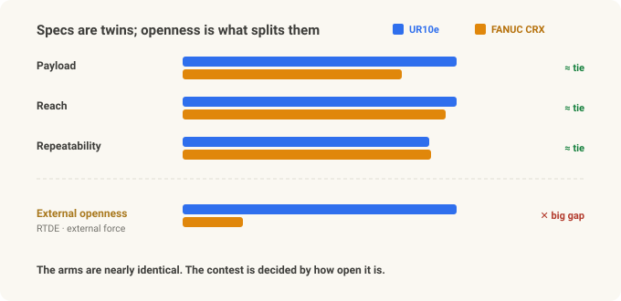
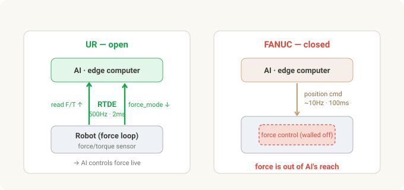
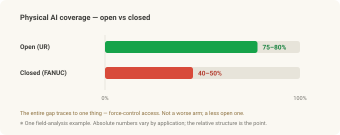

# UR vs FANUC — For Physical AI, What Decides Isn't Specs, It's Openness

> **Cobot series · Part 2 of 3.** [Part 1](cobot-basics.md) was what a cobot is and why it's different. Now we put the two flagships head to head — **Universal Robots (UR)** and **FANUC** — before [Part 3](cobot-investing.md) connects it to investing (UR = Teradyne · FANUC · NVIDIA).

Set two 10 kg-class cobots side by side: UR's **UR10e** and FANUC's **CRX-10iA/L**. Payload, reach, repeatability… on the spec sheet they're near twins. The prices are close too. So — same thing, right?

Then you put **Physical AI** in front of them — the flow from the [Robot Vision series](stereo-to-grasp.md), where AI becomes the robot's eyes and hands — and the two arms become completely different machines. One lets the AI reach far into it; the other hits a wall. And the difference isn't the arm's performance. It's **how open the robot is.**

This is the story of why that openness is decisive.

---

## In 30 seconds

- **The specs are basically a tie.** UR10e (12.5 kg / 1300 mm) and FANUC CRX-10iA/L (10 kg / 1249 mm) overlap on repeatability (±0.05 mm class), safety (ISO/TS 15066), and hand guiding.
- **The decider is external-control openness.** UR opens **RTDE** — 500Hz bidirectional data — so you can **read wrist force/torque externally** and **command force from outside** via `force_mode()`, open and free out of the box. FANUC's force control is strong too, but it runs **inside the robot only** — there's no open channel to reach into the force loop from outside in real time.
- **Why 500Hz matters:** for contact tasks (insertion, touch-off), an AI closing a force loop needs millisecond command intervals. UR gives you 2 ms (500Hz) natively. FANUC has a paid high-rate streaming option too, but it's **position-only,** and the free path runs at tens of Hz — too slow to react to force.
- **The ecosystem splits too.** UR: URScript, `ur_rtde` (Python), an official ROS 2 driver, MoveIt 2, Isaac ROS, free simulators. FANUC centers on proprietary Karel/TP and ROBOGUIDE — though in late 2025 it **partnered with NVIDIA and shipped official ROS 2 + Isaac Sim** to start opening up (more below).
- So **how much the AI can touch** diverges. In one field analysis it worked out to roughly **75–80% (open) vs 40–50% (closed)** Physical AI coverage — and the entire gap was **force-control access.**
- FANUC, in return, is strong on **scale, high-volume precision, CNC integration, and fitting into existing plants.** "Physical AI first" → UR; "traditional automation's stability and scale" → FANUC. Different jobs.

---

## The specs are basically a tie

Clear up the misconception first: this comparison isn't "which arm is better." In the 10 kg class they're strikingly similar.

| Spec | FANUC CRX-10iA/L | UR10e |
|---|---|---|
| Payload | 10 kg | 12.5 kg |
| Reach | 1,249 mm | 1,300 mm |
| Repeatability | ±0.04 mm | ±0.05 mm |
| DoF | 6 | 6 |
| Weight | 45 kg | 33.5 kg |
| IP rating | IP54 | IP54 |
| Collaborative safety | ISO/TS 15066 | ISO/TS 15066 |
| Hand guiding | built-in | built-in |
| Approx. price | ~$45–55k | ~$35–45k |

*(Figures are approximate and vary by datasheet and date.)*

Payload, reach, precision — all comparable, with UR a bit lighter and cheaper. **On the arm alone, you can't really separate them.** The contest is decided where the spec sheet doesn't look.

---

## Ease and precision — the two camps started from opposite ends

The two companies' DNA is opposite.

- **UR** started from **ease.** A Danish startup created the category with the first commercial cobot in 2008, selling "a robot anyone can hand-guide." The trade-off was a reputation for weaker **speed, rigidity, and absolute accuracy** than caged industrial arms.
- **FANUC** is the heavyweight of **precision and scale** — the world's largest industrial-robot maker and the dominant supplier of machine-tool CNC. Caged high-speed, high-precision mass production is home turf. It answered the cobot category with the **CRX series,** leading on tablet drag-and-drop programming aimed straight at UR's ease-of-use.

The interesting part is that **the two camps are converging on each other's weaknesses.** FANUC chases "ease" with CRX, and **UR's newest arms (UR20/UR30) pushed up payload (20–30 kg), reach, speed, rigidity, and sealing (IP65)** — moving into territory that used to force you into a caged industrial robot.

One thing to state precisely, though. People say "UR is easy but less precise," but that's **not about repeatability** (returning to the same taught point) — there UR sat at ±0.03–0.05 mm on the e-Series, within about one class of industrial arms. In fact the big new UR20/UR30 are **±0.1 mm — slightly *looser* than the e-Series** (the normal trade-off for a bigger, faster, heavier arm). UR's real historical weakness was **speed, rigidity, and *absolute* accuracy** (hitting a commanded pose it was never taught — from CAD or a vision offset), which it addresses with per-arm kinematic calibration. And the software was re-architected from PolyScope 5.x to **PolyScope X** — but that's a UX/extensibility story, not a more precise arm (and it didn't ship in lockstep with UR20/UR30). In short, what UR narrowed was **payload, reach, and rigidity** — the things that used to force a caged robot — not the repeatability number itself. Either way, on paper the two are now close. But the real fork isn't here.

---

## The real fork — how open is it?

The heart of Physical AI is a **tight perception → action loop.** The AI sees with a camera, moves the robot, feels force, corrects instantly — and how tightly you can close that loop is everything. For that, **the AI has to read the robot's internal data and issue commands from outside.** This is exactly where the two diverge.

- **UR — open.** The **RTDE (Real-Time Data Exchange)** protocol opens **500Hz** bidirectional communication. You read joint positions and **wrist force/torque externally in real time,** and command **force, speed, and impedance from outside** (e.g. from an edge computer) with calls like `force_mode()` and `speedl()`. An AI policy can drive the robot's force behavior live.
- **FANUC — more closed.** The free standard path is EtherNet/IP + Karel registers, plus a recent official ROS 2 driver — updating at **tens of Hz.** For faster external streaming you buy a **paid option like Stream Motion** (~125–250Hz), and even that is **position-only.** Wrist force/torque can be polled slowly over registers, but that's not a real-time force channel, and **there's no open path to command force from outside in real time.** FANUC's force control is capable — but it runs **inside the robot only.**

### Why 500Hz matters

The numbers make it obvious: **UR is 500Hz — 2 ms between commands.** FANUC's free path (tens of Hz) sits in the tens-to-100 ms range, and even the paid high-rate option updates position at 4–8 ms. On a contact task — seating a connector, a light touch-off — an AI that needs to feel resistance and modulate force can't work at 100 ms; it's already shoved past. 2 ms can react like a fingertip. But more decisive than the rate: **UR carries *force* over that fast channel, while FANUC's channel carries only *position.*** That's the **threshold for reactive force control.**

---

## The software ecosystem — Python, or a vendor?

Openness doesn't stop at one interface; it spreads across the whole ecosystem.

| Software | FANUC CRX | UR |
|---|---|---|
| Native language | Karel / TP (proprietary) | URScript (open, Python-like) |
| Python SDK | none | `ur_rtde` (open source) |
| ROS 2 driver | official (new 2025) · tens of Hz | official · 500Hz |
| MoveIt 2 | limited | full |
| Isaac ROS | partial | full |
| Simulator | ROBOGUIDE + Isaac Sim (NVIDIA partnership) | URSim (free), Gazebo, Isaac Sim |
| Open documentation | limited | comprehensive |
| External-vendor dependency | usually required | not required |

On the UR side, the entire control stack runs as **Python on the edge computer.** You write, debug, and iterate the control code yourself — so you **don't have to call an external FANUC programming vendor every time you add a task.** That slashes reprogramming cost and lead time.

FANUC's closedness isn't automatically bad, of course. **Proven stability, accountable vendor support, and seamless integration with existing FANUC lines** — on a traditional automation floor, those are strengths. It's just a different direction.

---

## Force control — it all comes down to whether the AI can touch it

Both robots do force control **internally.** UR has a wrist force/torque sensor built into the e-Series; FANUC does it with a separate F/T sensor + Force Control package (a paid option) — force following, force-threshold touch-off, pressing to a set force. Both get a checkmark on the spec sheet; "FANUC has no force control" is a myth.

The decisive difference: **UR opens that force to the outside; FANUC doesn't.**

- UR: force/torque data streams to the edge computer at 500Hz, and the edge's AI policy commands force back via `force_mode()` → **the AI controls force in real time.**
- FANUC: force control is locked inside the robot, and the AI policy **can't intervene** in its behavior.

On contact-critical work — insertion, assembly, fine touch — this difference is exactly "solvable with AI" vs "frozen in a script." Same for the demonstration data used in **imitation learning.** When you hand-guide to teach, UR records **position *and* force,** while FANUC captures **position only.** The more a task depends on force, the more the very quality of your dataset diverges.

---

## So the Physical AI coverage diverges

To sum up: the **perception layer** (finding the target with a camera and getting 3D coordinates) is the same on both — the edge computer and camera handle it anyway. What diverges is the **manipulation layer,** especially **force-bearing tasks.**

- Open (UR): the AI controls force too, so contact tasks like insertion, touch-off, and compliant assembly are **solvable with an AI policy.**
- Closed (FANUC): perception works, but with the force-control layer walled off, contact tasks stay **frozen in scripts.**

In one field analysis, that difference came out as roughly **75–80% (open) vs 40–50% (closed)** Physical AI coverage. The number itself is an illustrative estimate that varies by application — but the point is that **the entire gap traces to one thing: force-control access.** Not a worse arm — a less open one.

---

## That doesn't mean FANUC loses — different jobs

Keep the balance here. The argument above rests on the premise **"if Physical AI is the top priority."** Drop that premise and the picture changes.

**Where FANUC wins:**
- **Scale and reliability** — the world's largest robot maker, a million-plus units shipped. Proven durability and a support network.
- **High-precision, high-volume** — home turf for caged industrial arms; lines where cycle time and throughput are everything.
- **CNC / factory-automation integration** — in a plant already running on FANUC robots and CNC, bolting on the same ecosystem is natural and stable.
- **Closed = stable** — a validated, vendor-backed stack. For fixed processes that rarely change, that's a plus, not a minus.

**Where UR wins:**
- **Open · Physical AI · research** — contact tasks where the AI must touch force, fast iteration, a Python/ROS 2/Isaac stack.
- **Vendor independence · fast high-mix deployment** — reprogram a new task in-house, immediately.

So: **"stability and scale for a fixed high-speed line" → FANUC; "a flexible cell the AI keeps touching and evolving" → UR.** Not replacement — different uses.

**And FANUC isn't standing still.** In late 2025 it announced an official Physical AI partnership with NVIDIA — putting **NVIDIA Jetson** (on-robot edge AI) and **Isaac Sim / Omniverse** (digital-twin simulation) onto its robots, and lowering the Python barrier with **official ROS 2 support.** The direction is clearly toward *more* open. But what's public so far is mostly **simulation, edge compute, and programming access** — not yet the thing this piece hinges on: **opening the real-time force loop to the outside.** Whether that gap closes ties directly into Part 3's investment story, so we'll pick it up there.

---

## Summary

| Dimension | FANUC CRX | UR |
|---|---|---|
| Arm spec (10 kg class) | comparable (±0.04 mm) | comparable, a bit lighter/cheaper |
| External control | free tens of Hz / paid 125–250Hz · position-only, no real-time force | **RTDE 500Hz · read + command force** |
| Software | Karel/TP · ROBOGUIDE — opening up via ROS 2 · NVIDIA | URScript · Python · official ROS 2 · Isaac |
| AI force control | no (locked inside) | **yes (live external control)** |
| Demo data | position only | **position + force** |
| Physical AI coverage | low (perception only) | high (through force control) |
| Wins instead on | scale · high-volume precision · CNC · stability | openness · flexibility · fast iteration |

**The one thing to remember:** the two arms are nearly the same. What decides Physical AI is **whether the AI can reach into the robot's force loop — i.e. openness.** Which leads straight to the third question: *so if you were investing in this, in whom?* [Part 3](cobot-investing.md) breaks down **UR (parent Teradyne) · FANUC (Tokyo 6954 / ADR FANUY) · NVIDIA** through a Physical AI investing lens.

---

*Related: [Part 1 — What Is a Collaborative Robot (Cobot)?](cobot-basics.md) · [Part 3 — Physical AI investing](cobot-investing.md) · [From Stereo to Grasp](stereo-to-grasp.md)*

### Sources & trademarks

Specs and interfaces follow the manufacturers' (Universal Robots, FANUC) public documentation and open-source tools (`ur_rtde`, ROS 2 drivers); figures and prices are approximations that vary by model and date. The platform-openness comparison and "Physical AI coverage" estimates are illustrative, based on general technical characteristics, not any specific customer or application. RTDE, URScript, and PolyScope are trademarks of Universal Robots (Teradyne); FANUC, CRX, Karel, and ROBOGUIDE are trademarks of FANUC Corporation, used here for identification only. This article is not advice to buy any product or make any investment.

### Glossary

- *RTDE (Real-Time Data Exchange)* — UR's real-time bidirectional data interface (up to 500Hz); the channel for reading robot state and issuing commands from outside.
- *force_mode()* — the UR call that lets an external program directly control the robot's force behavior.
- *Karel / TP* — FANUC's proprietary robot programming language and teach-pendant program.
- *EtherNet/IP* — a standard industrial communication protocol; FANUC's main external interface.
- *Stream Motion* — FANUC's paid external motion-streaming option; an outside PC can send position commands, but not force/torque.
- *Force/torque (F/T) control* — the robot's ability to sense and modulate contact force; core to insertion, touch-off, and other contact tasks.
- *Imitation learning* — training an AI policy from human demonstration data.
- *ROS 2 · MoveIt 2 · Isaac ROS* — the common robotics middleware, motion planning, and NVIDIA GPU-accelerated robot packages.
- *TCO (total cost of ownership)* — the real cost including not just hardware but programming, integration, and maintenance.
