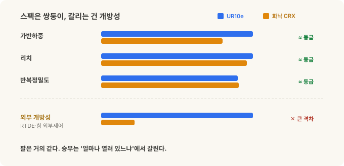
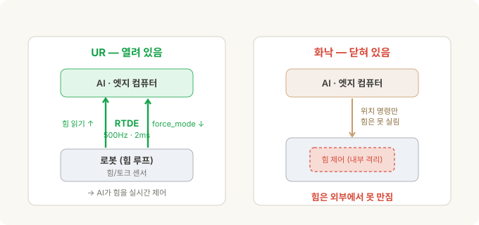
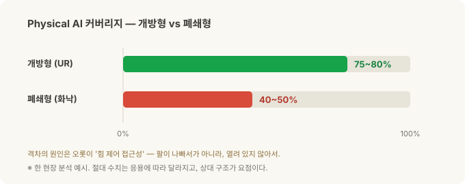

# UR vs 화낙(FANUC) — Physical AI를 가르는 건 스펙이 아니라 '개방성'

> **코봇 3부작 · 2부.** [1부](cobot-basics.md)는 코봇이 무엇이고 왜 다른가였습니다. 이번엔 대표 두 진영 — **Universal Robots(UR)**과 **화낙(FANUC)** — 을 맞대고, [3부](cobot-investing.md)에서 이걸 투자 관점(UR=Teradyne · 화낙 · NVIDIA)으로 연결합니다.

같은 10kg급 협동로봇 두 대를 나란히 놓아봅시다. UR의 **UR10e**와 화낙의 **CRX-10iA/L**. 가반하중, 리치, 반복정밀도… 스펙표만 보면 거의 쌍둥이입니다. 가격도 비슷해요. 그러니 "그게 그거 아니야?" 싶죠.

그런데 **Physical AI** — [로봇 비전 시리즈](stereo-to-grasp.md)에서 본, AI가 로봇의 눈과 손이 되는 그 흐름 — 를 기준으로 놓는 순간, 두 로봇은 완전히 다른 물건이 됩니다. 한쪽은 AI가 손댈 수 있는 범위가 넓고, 다른 쪽은 벽에 막혀요. 그 차이는 팔의 성능이 아니라, **로봇이 얼마나 열려 있느냐**에서 옵니다.

이 글은 그 '개방성'이 왜 결정적인지에 대한 이야기입니다.

---

## 30초 요약

- **스펙은 사실상 동급.** UR10e(12.5kg·1300mm)와 화낙 CRX-10iA/L(10kg·1249mm)은 반복정밀도(±0.05mm급)·안전규격(ISO/TS 15066)·핸드가이딩까지 거의 겹칩니다.
- **결정적 차이는 '외부 제어 개방성'입니다.** UR은 **RTDE**로 **500Hz** 양방향 데이터, 손목 **힘/토크를 외부에서 읽고**, `force_mode()`로 **외부에서 힘을 제어**할 수 있어요 — 오픈·무료·기본 제공. 화낙도 힘 제어 자체는 강력하지만, 그건 **로봇 안에서만** 돌고, 외부에서 **실시간 힘 루프를 만지는 통로는 열려 있지 않습니다.**
- **500Hz가 왜 중요한가?** 접촉 작업(삽입·터치오프)에서 AI가 실시간으로 힘 피드백을 받아 조절하려면 명령 간격이 밀리초 단위여야 해요. UR은 2ms(500Hz)를 기본으로 열어줍니다. 화낙도 고속 스트리밍 옵션(유료)이 있지만 **위치 명령만** 되고, 무료 경로는 수십 Hz라 반응형 힘 제어엔 굼떠요.
- **생태계도 갈립니다.** UR은 URScript·`ur_rtde`(파이썬)·공식 ROS 2·MoveIt 2·Isaac ROS·무료 시뮬레이터. 화낙은 Karel/TP 독점·ROBOGUIDE 중심 — 다만 2025년 말 **NVIDIA와 손잡고 공식 ROS 2·Isaac Sim**으로 개방에 착수했습니다(뒤에서 자세히).
- 그래서 **AI가 손댈 수 있는 범위**가 크게 벌어집니다. 한 현장 분석에선 대략 **개방형 75~80% vs 폐쇄형 40~50%**로 갈렸고, 격차의 전부가 **힘 제어 접근성**이었어요.
- 대신 화낙은 **규모·정밀 대량·CNC 통합·기존 공장 연동**에서 강합니다. "Physical AI 우선"이면 UR, "전통 자동화의 안정·규모"면 화낙 — 각자의 자리가 다릅니다.

---

## 스펙은 사실상 동급

먼저 오해를 풀어야 합니다. 이 비교는 "어느 팔이 더 좋냐"가 아니에요. 10kg급에서 둘은 놀랄 만큼 비슷합니다.

| 항목 | 화낙 CRX-10iA/L | UR10e |
|---|---|---|
| 가반하중 | 10 kg | 12.5 kg |
| 리치 | 1,249 mm | 1,300 mm |
| 반복정밀도 | ±0.04 mm | ±0.05 mm |
| 자유도 | 6 | 6 |
| 무게 | 45 kg | 33.5 kg |
| 보호등급 | IP54 | IP54 |
| 협동 안전 | ISO/TS 15066 | ISO/TS 15066 |
| 핸드가이딩 | 내장 | 내장 |
| 대략 가격대 | 대략 4.5만~5.5만 달러 | 대략 3.5만~4.5만 달러 |

*(수치는 데이터시트·시점에 따라 달라지는 근사치예요.)*

가반하중·리치·정밀도 다 비등하고, UR이 조금 가볍고 저렴한 정도. **팔만 놓고 보면 우열을 가리기 어렵습니다.** 그런데 스펙표가 안 보여주는 곳에서 승부가 갈려요.

---

## 편리함과 정밀함 — 두 진영은 반대에서 출발했다

두 회사의 DNA는 정반대입니다.

- **UR**은 **편리함**에서 출발했어요. 덴마크 스타트업이 2008년 첫 상용 코봇으로 카테고리를 만들면서, "누구나 손으로 끌어 가르치는 로봇"을 팔았습니다. 대신 초기엔 산업용 대비 **속도·강성·절대 정밀도가 약하다**는 평이 따라다녔죠.
- **화낙**은 **정밀·규모**의 절대강자입니다. 세계 최대 산업용 로봇 제조사이자 공작기계 CNC의 지배자 — 케이지 안 고속·고정밀 대량생산이 본진이에요. 그 화낙이 코봇 시장에 **CRX 시리즈**로 응수하며 태블릿 드래그·드롭 프로그래밍으로 UR의 '쉬움'을 정면으로 겨눴습니다.

재밌는 건 **두 진영이 서로의 약점을 향해 수렴**하고 있다는 거예요. 화낙은 CRX로 '쉬움'을 따라오고, **UR은 신세대 UR20·UR30에서 가반하중(20~30kg)·리치·속도·강성·방진방수(IP65)를 끌어올려**, 예전이라면 케이지 산업용을 써야 했던 영역까지 넘어왔습니다.

여기서 한 가지는 정확히 짚어야 합니다. 흔히 "UR은 편리한 대신 덜 정밀하다"고들 하지만, 이건 **반복정밀도**(같은 점을 되짚는 정확도) 얘기가 아니에요 — 거기선 UR도 e-Series 기준 ±0.03~0.05mm로 산업용과 한 급 차이 정도였습니다. 오히려 신형 대형기 UR20·UR30는 ±0.1mm로 e-Series보다 반복정밀도가 살짝 *느슨*합니다(크고 빠르고 무거운 팔의 정상적인 트레이드오프예요). UR의 진짜 약점은 반복정밀도가 아니라 **속도·강성, 그리고 절대정확도**(가르치지 않은 좌표 — CAD나 비전 오프셋 — 로 정확히 찾아가는 능력)였고, 이건 팔마다 들어가는 기구학 캘리브레이션으로 보완합니다. 소프트웨어도 PolyScope 5.x에서 **PolyScope X**로 바닥부터 새로 짰지만, 이건 UX·확장성 이야기지 팔이 더 정밀해진 건 아닙니다. (PolyScope X와 UR20·UR30가 한날 나온 것도 아니고요.)

요컨대 UR이 좁힌 건 **가반하중·리치·강성** — 예전엔 케이지 산업용을 강요하던 것들 — 이지, 반복정밀도 숫자 자체가 아닙니다. 어쨌든 종이 스펙만 보면 둘의 거리가 꽤 가까워졌어요. 하지만 진짜 갈림길은 여기가 아닙니다.

---

## 진짜 갈림길 — 얼마나 '열려 있느냐'

Physical AI의 심장은 **인식 → 행동의 빠른 피드백 루프(feedback loop)**입니다. AI가 카메라로 보고, 로봇을 움직이고, 힘을 느끼고, 즉시 보정하고 — 이걸 얼마나 촘촘히 돌리느냐가 전부예요. 그런데 그러려면 **AI가 로봇 내부 데이터를 읽고, 외부에서 명령을 넣을 수 있어야** 합니다. 바로 이 지점에서 두 로봇이 갈립니다.

- **UR — 열려 있음.** **RTDE(Real-Time Data Exchange)** 프로토콜로 **500Hz** 양방향 통신을 엽니다. 관절 위치·**손목 힘/토크를 외부에서 실시간으로 읽고**, `force_mode()`·`speedl()` 같은 명령으로 **외부(예: 엣지 컴퓨터)에서 힘·속도·임피던스를 직접 제어**할 수 있어요. AI 정책이 로봇의 힘 거동을 실시간으로 쥐락펴락하는 게 가능합니다.
- **화낙 — 더 닫혀 있음.** 무료로 쓰는 표준 경로는 EtherNet/IP + Karel 레지스터, 그리고 최근 나온 공식 ROS 2 드라이버인데 갱신율이 **수십 Hz** 수준입니다. 더 빠른 외부 스트리밍을 원하면 **Stream Motion 같은 유료 옵션**(대략 125~250Hz)을 따로 사야 하고, 그마저 **위치 명령만** 됩니다 — 힘/토크는 레지스터로 느리게 읽을 순 있어도 실시간 힘 채널은 아니고, **외부에서 힘을 실시간으로 명령하는 통로는 열려 있지 않아요.** 화낙의 힘 제어는 강력하지만, **로봇 안에서만** 돕니다.

### 500Hz가 왜 중요한가

숫자로 보면 분명합니다. **UR은 500Hz — 명령 사이가 2ms**예요. 화낙의 무료 경로(수십 Hz)는 수십~100ms대, 유료 고속 옵션이라도 위치만 4~8ms고요. 커넥터를 꽂거나 표면을 살짝 터치하는 접촉 작업에서, AI가 저항을 느끼고 힘을 조절하려면 100ms는 너무 굼뜹니다 — 이미 밀어버린 뒤죠. 2ms는 사람 손끝처럼 반응할 수 있고요. 그런데 속도보다 더 결정적인 건, **UR은 그 빠른 통로로 '힘'까지 주고받지만 화낙의 통로엔 '위치'만 실린다**는 점이에요. **반응형 힘 제어의 문턱**이 여기서 갈립니다.

---

## 소프트웨어 생태계 — 파이썬이냐, 벤더냐

개방성은 인터페이스 하나로 끝나지 않고 생태계 전체로 번집니다.

| 소프트웨어 | 화낙 CRX | UR |
|---|---|---|
| 네이티브 언어 | Karel / TP (독점) | URScript (개방, 파이썬스러움) |
| 파이썬 SDK | 없음 | `ur_rtde` (오픈소스) |
| ROS 2 드라이버 | 공식(2025 신규) · 수십 Hz | 공식 · 500Hz |
| MoveIt 2 | 제한적 | 완전 |
| Isaac ROS | 부분 | 완전 |
| 시뮬레이터 | ROBOGUIDE + Isaac Sim(NVIDIA 제휴) | URSim(무료)·Gazebo·Isaac Sim |
| 문서 개방성 | 제한적 | 포괄적 |
| 외부 벤더 종속 | 대개 필요 | 불필요 |

UR 쪽은 로봇 제어 스택 전체가 **엣지 컴퓨터 위 파이썬**으로 돌아갑니다. 코드를 직접 쓰고 고치고 반복할 수 있으니, **새 작업을 넣을 때마다 외부 화낙 프로그래밍 벤더를 부를 필요가 없어요.** 이게 재프로그래밍 비용과 리드타임을 크게 줄입니다.

물론 화낙의 폐쇄성이 무조건 나쁜 건 아닙니다. **검증된 안정성, 벤더의 책임 있는 지원, 기존 화낙 라인과의 매끄러운 연동** — 전통 자동화 현장에선 이게 오히려 강점이에요. 방향이 다를 뿐입니다.

---

## 힘 제어 — AI가 만질 수 있느냐가 전부

두 로봇 모두 **내부적으로는** 힘 제어를 합니다. UR은 e-Series 손목에 힘/토크 센서가 내장돼 있고, 화낙도 별도 F/T 센서 + Force Control 패키지(유료 옵션)로 힘 따라가기·터치오프·정해진 힘으로 밀기를 잘 해냅니다 — 스펙표엔 둘 다 체크 표시가 붙어요. "화낙은 힘 제어가 없다"는 건 오해예요.

결정적 차이는 이겁니다. **UR은 그 힘을 외부로 열어주고, 화낙은 열지 않습니다.**

- UR: 힘/토크 데이터가 엣지 컴퓨터로 500Hz로 흘러오고, 엣지의 AI 정책이 `force_mode()`로 힘을 되받아 명령합니다 → **AI가 실시간으로 힘을 제어**.
- 화낙: 힘 제어가 로봇 안에 갇혀 있어, AI 정책이 그 거동에 **끼어들 수 없습니다**.

접촉이 핵심인 작업 — 삽입, 조립, 미세 터치 — 에서 이 차이가 곧 "AI로 풀리느냐, 스크립트로 고정하느냐"를 가릅니다. 그리고 **모방학습**을 위한 시연 데이터도 마찬가지예요. 손으로 끌어 가르칠 때 UR은 **위치 + 힘**을 함께 기록하지만, 화낙은 **위치만** 담깁니다. 힘이 중요한 작업일수록 데이터의 질 자체가 벌어져요.

---

## 그래서 Physical AI 커버리지가 벌어진다

정리하면 이렇습니다. **인식 층**(카메라로 목표를 찾고 3D 좌표를 얻는 부분)은 두 로봇이 똑같아요 — 어차피 엣지 컴퓨터와 카메라가 담당하니까요. 갈리는 건 **조작(manipulation) 층**, 특히 **힘이 걸리는 작업**입니다.

- 개방형(UR): AI가 힘까지 제어하니, 삽입·터치오프·순응 조립 같은 접촉 작업을 **AI 정책으로 풀 수 있음**.
- 폐쇄형(화낙): 인식은 되지만 힘 제어 층이 막혀, 접촉 작업은 **여전히 스크립트로 고정**.

한 현장 분석에서는 이 차이가 **Physical AI 커버리지 대략 75~80%(개방) vs 40~50%(폐쇄)**로 나타났습니다. 숫자 자체는 응용에 따라 달라지는 예시지만, **격차의 원인이 오롯이 '힘 제어 접근성' 하나**라는 게 핵심이에요. 팔이 나빠서가 아니라, 열려 있지 않아서입니다.

---

## 그렇다고 화낙이 지는 건 아니다 — 각자의 자리

여기서 균형을 잡아야 합니다. 위 논지는 **"Physical AI를 최우선으로 놓는다면"**이라는 전제 위에 있어요. 그 전제를 빼면 그림이 달라집니다.

**화낙이 강한 곳:**
- **규모와 신뢰성** — 세계 최대 로봇 제조사, 누적 100만 대. 검증된 내구성과 지원망.
- **정밀·고속 대량** — 케이지 안 산업용 본진. 사이클 타임과 처리량이 생명인 라인.
- **CNC·공장 자동화 통합** — 이미 화낙 로봇·CNC로 돌아가는 공장이라면, 같은 생태계로 붙이는 게 자연스럽고 안정적.
- **폐쇄성 = 안정성** — 벤더가 책임지는 검증된 스택. 바꿀 일이 적은 고정 공정엔 오히려 장점.

**UR이 강한 곳:**
- **개방·Physical AI·연구** — AI가 힘까지 만져야 하는 접촉 작업, 빠른 반복, 파이썬/ROS 2/Isaac 스택.
- **벤더 독립·다품종 빠른 도입** — 새 작업을 사내에서 즉시 재프로그래밍.

즉 **"고정된 고속 라인의 안정·규모"면 화낙, "AI가 손대며 계속 진화하는 유연 셀"이면 UR.** 대체가 아니라 용도가 다른 겁니다.

**그리고 화낙도 가만있지 않습니다.** 2025년 말, 화낙은 NVIDIA와 Physical AI 파트너십을 공식 발표했어요 — 로봇에 **NVIDIA Jetson**(온로봇 엣지 AI)과 **Isaac Sim·Omniverse**(디지털 트윈 시뮬레이션)를 얹고, **공식 ROS 2 지원**으로 파이썬 프로그래밍의 문턱을 낮췄습니다. 방향은 분명히 '더 열리는' 쪽이에요. 다만 지금까지 공개된 건 주로 **시뮬레이션·엣지 연산·프로그래밍 접근**이지, 이 글의 핵심인 **외부에서 실시간 힘 루프를 여는** 데까지 왔다는 근거는 아직 없습니다. 이 격차가 좁혀질지는 3부의 투자 이야기와 곧장 이어지는 대목이라, 거기서 다시 봅니다.

---

## 정리

| 관점 | 화낙(FANUC) CRX | UR |
|---|---|---|
| 팔 스펙(10kg급) | 거의 동급(±0.04mm) | 거의 동급, 조금 가볍고 저렴 |
| 외부 제어 | 무료 수십 Hz / 유료 125~250Hz·위치만, 실시간 힘 불가 | **RTDE 500Hz·힘 읽기+명령** |
| 소프트웨어 | Karel/TP·ROBOGUIDE — ROS 2·NVIDIA로 개방 착수 | URScript·파이썬·공식 ROS 2·Isaac |
| AI 힘 제어 | 불가(내부 고정) | **가능(실시간 외부 제어)** |
| 시연 데이터 | 위치만 | **위치 + 힘** |
| Physical AI 커버리지 | 낮음(인식까지) | 높음(힘 제어까지) |
| 대신 강한 곳 | 규모·정밀 대량·CNC 통합·안정 | 개방·유연·빠른 반복 |

**기억할 한 가지:** 두 로봇의 팔은 거의 같습니다. Physical AI에서 승부를 가르는 건 **AI가 로봇의 힘 루프에 손을 넣을 수 있느냐 — 즉 '개방성'**이에요. 그래서 이 이야기는 자연스럽게 세 번째 질문으로 넘어갑니다. *그럼 이 판에 투자한다면, 누구에게?* [다음 편](cobot-investing.md)에서 **UR(모회사 Teradyne) · 화낙(도쿄 6954 / ADR FANUY) · NVIDIA**를 Physical AI 투자 관점에서 뜯어봅니다.

---

*관련: [1부 — 협동로봇(cobot)이란](cobot-basics.md) · [3부 — Physical AI 투자편](cobot-investing.md) · [스테레오 비전에서 목표물 잡기까지](stereo-to-grasp.md)*

### 출처와 표기

제품 사양·인터페이스는 각 제조사(Universal Robots, 화낙)의 공개 문서 및 오픈소스 도구(`ur_rtde`, ROS 2 드라이버) 기준이며, 수치·가격대는 모델·시점에 따라 달라지는 근사치입니다. 플랫폼 개방성 비교와 "Physical AI 커버리지" 추정치는 일반적 기술 특성에 근거한 예시로, 특정 고객·응용의 구체 사례가 아닙니다. RTDE·URScript·PolyScope는 Universal Robots(Teradyne)의, FANUC·CRX·Karel·ROBOGUIDE는 FANUC Corporation의 상표이며, 지칭 목적으로만 사용했습니다. 본 글은 특정 제품 구매나 투자에 대한 권유가 아닙니다.

### 용어 설명

- *RTDE (Real-Time Data Exchange)* — UR의 실시간 양방향 데이터 인터페이스(최대 500Hz). 외부에서 로봇 상태를 읽고 명령을 넣는 통로
- *force_mode()* — UR에서 외부 프로그램이 로봇의 힘 거동을 직접 제어하는 명령
- *Karel / TP* — 화낙의 독점 로봇 프로그래밍 언어와 티치펜던트 프로그램
- *EtherNet/IP* — 산업 현장 표준 통신 프로토콜. 화낙의 주된 외부 인터페이스
- *Stream Motion* — 화낙의 유료 외부 모션 스트리밍 옵션. 외부 PC가 위치 명령을 보낼 수 있지만 힘/토크는 실을 수 없음
- *힘/토크(F/T) 제어* — 로봇이 접촉 힘을 감지·조절하는 능력. 삽입·터치오프 등 접촉 작업의 핵심
- *모방학습(imitation learning)* — 사람이 시연한 동작 데이터로 AI 정책을 학습시키는 방법
- *ROS 2 · MoveIt 2 · Isaac ROS* — 로보틱스 공통 미들웨어·모션 계획·NVIDIA GPU 가속 로봇 패키지
- *TCO (총소유비용)* — 하드웨어 가격뿐 아니라 프로그래밍·통합·유지까지 합친 실제 비용
