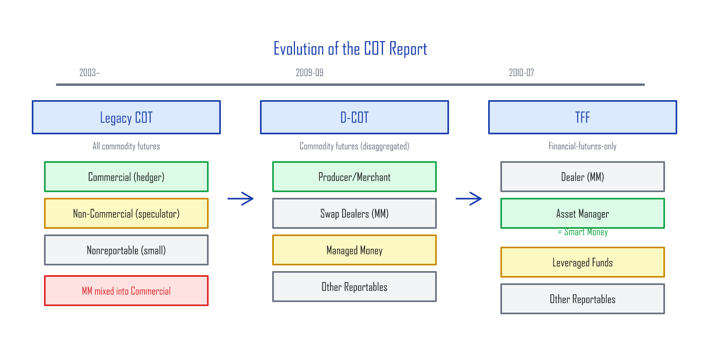
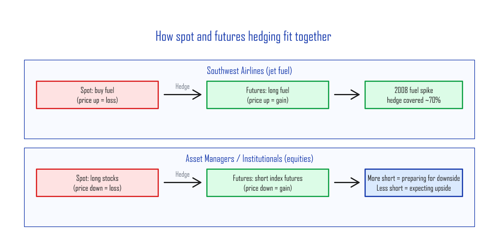
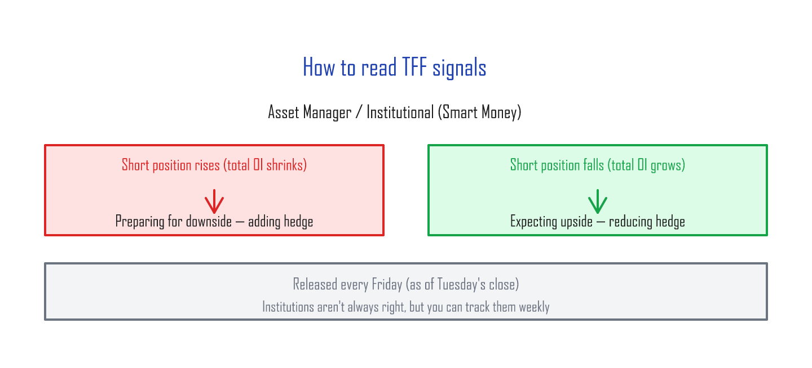
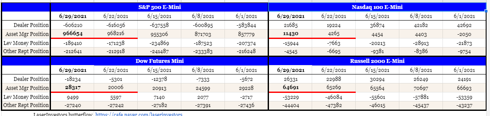
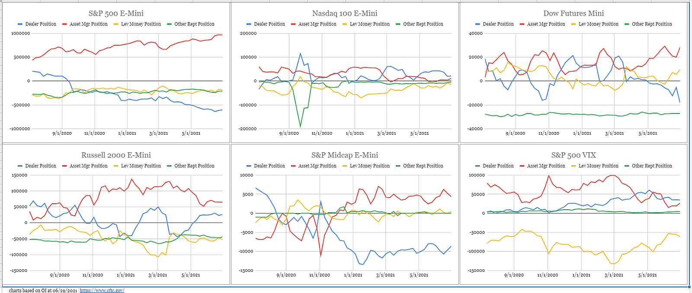
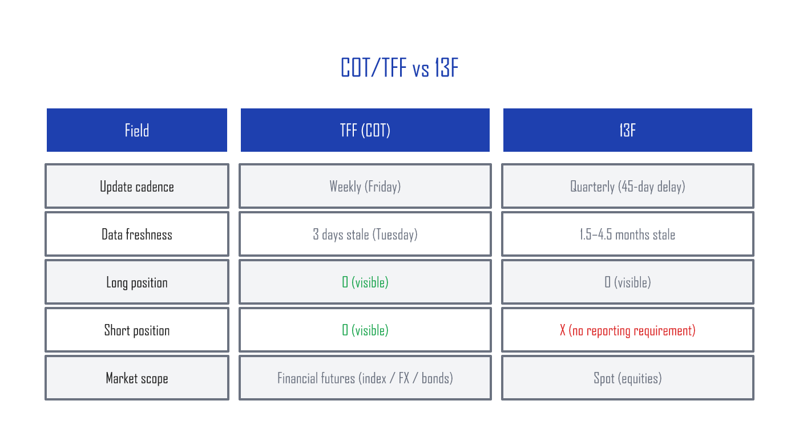

# The COT Report — Reading the Spot Market Through the Futures Market

---

## What the COT Report is

In the futures market (futures = a contract to buy or sell at a set price on a future date), participants above a certain size have to report their **open interest** (OI = the number of contracts that are still open and haven't been closed out) to the **CFTC** (Commodity Futures Trading Commission) every week, as of the **Tuesday close**. Reportable participants file CFTC Form 40, declaring the *business purpose* of their futures activity. CFTC staff use that filing to assign each participant to a business category.

The weekly aggregate of those reported positions — broken down by category, with long positions (bets that price will rise) and short positions (bets that price will fall) summed within each — is called the **COT (Commitments of Traders) Report**, and it's released every **Friday at 3:30 PM Eastern**.

---

## How the COT Report has evolved — Legacy → D-COT → TFF

The report has been through three generations.

### Legacy COT — the original three categories

The legacy report split participants into three buckets:

1. **Commercial** — participants who actually buy and sell the physical underlying (hedgers — positions taken to offset risk in the cash business)
2. **Non-Commercial** — large speculators with no spot business
3. **Nonreportable** — small participants below the reporting threshold

The problem: market makers (MMs) — who don't trade the physical product, but stand in between every buyer and seller as the perpetual counterparty — got bucketed into "Commercial." That diluted the Commercial signal beyond usefulness.

### D-COT — separating the market makers (2009)

On September 4, 2009, the CFTC launched the **Disaggregated COT (D-COT)** report, which split participants into four cleaner buckets:

1. **Producer/Merchant/Processor/User** — actual physical-market participants
2. **Swap Dealers** — market makers
3. **Managed Money** — short-term traders running the position for profit
4. **Other Reportables** — other large participants

Once MMs were peeled out of "Commercial," the **Producer/Merchant/Processor/User category started to mean something**. Intuitively, the people who actually buy and sell the physical product are the group most likely to read the future price of that product correctly.

### TFF — a COT report just for financial futures (2010)

On July 22, 2010, the CFTC launched the **TFF (Traders in Financial Futures)** report, which is a dedicated COT report for financial futures: currency futures, bond futures, and stock-index futures.

| Category | What it is |
|:---------|:-----------|
| **Dealer/Intermediary** | Market makers |
| **Asset Manager/Institutional** | Pension funds, endowments, large institutional investors — what people call **Smart Money** |
| **Leveraged Funds** | Short-term traders, mostly hedge funds |
| **Other Reportables** | Other large participants (corporate treasuries, central banks, smaller banks, etc.) |

In the TFF report, **Asset Manager/Institutional is the "smart money,"** and Leveraged Funds are sometimes called "dumb money."

---

## A lesson from Southwest Airlines

To see how a Producer/Merchant actually uses futures, look at Southwest Airlines (LUV) — famous for hedging its jet-fuel costs in the futures market. As a real consumer of fuel, the airline participates in the futures market in the Producer/Merchant/Processor/User category.

The airline's business prefers fuel prices to fall, so you can think of the airline as carrying an inherent **short position on physical fuel**. To hedge that, **when it expects fuel prices to spike**, it opens **long fuel-futures positions**.

In **2008**, Southwest had its long fuel-futures hedge in place ahead of time. When fuel prices spiked, the futures hedge covered roughly **70%** of the cost increase. American Airlines (AAL), by contrast, had no fuel-futures hedge at all, swallowed the full price spike, and saw its financial position deteriorate dramatically.

If fuel prices had crashed instead, Southwest wouldn't have captured the windfall — but from a business-management perspective, the airline prefers a **predictable, locked-in cost** over an unpredictable swing in profitability.

---

## Reading the report — institutional intent

The same logic that drives an airline's fuel hedge applies to equities. Institutional investors use the futures market to hedge their cash-equity exposure. They run a long position in the cash market (their stock holdings) and overlay a short futures position to dampen volatility.

The airline business wants fuel prices down, so it goes long fuel futures to hedge an upward spike. By the same logic:

> **Institutional investors want stock prices to go up, so by default they're long the cash market. When they expect prices to fall, they open short futures positions as a hedge.**

Institutions don't get the future right every time, of course. But being able to track **what they're doing on a weekly basis** is genuinely useful information.

---

## How TFF compares to 13F

There's another way to look at institutional positioning: the 13F filing. Every institutional investor must file a 13F with the SEC **quarterly** to disclose their long positions. (Shorts are not required.) 13Fs are due 45 days after quarter-end, so the longs you can see are roughly **1.5 to 4.5 months stale**.

TFF, by contrast, updates **weekly** and shows **both longs and shorts**. It's a much fresher and more complete picture of institutional positioning.

---

## Wrap-up — using COT in practice

COT/TFF is one of very few public datasets that lets you see institutional positioning **every week**. The takeaways:

- **Track the trend in Asset Manager shorts** week over week.
- Shorts piling up = institutions preparing for a drop. Shorts shrinking = institutions positioning for a rally.
- **Much faster than 13F** (weekly vs quarterly), and **shows shorts** that 13Fs don't.
- You can pull the data directly from cftc.gov, or get it visualized on Barchart.com and similar sites.

One caveat: COT is **a compass, not a clock**. It points direction, not timing. Institutions are wrong sometimes, and the data is already 3 days old when you get it. The strongest use is in combination with other signals — VIX (the market's fear index), technical analysis, and so on.

---

*Next: [Fed Fund Futures and the CME FedWatch Tool — How rate-cut probabilities are computed](fedwatch.md)*
