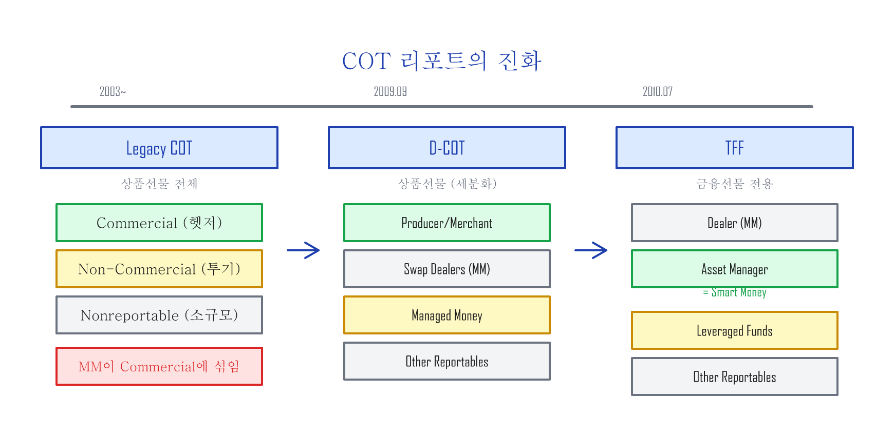
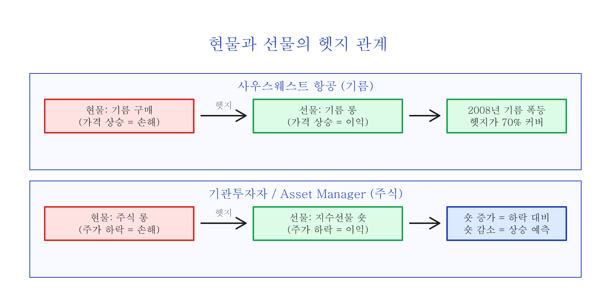
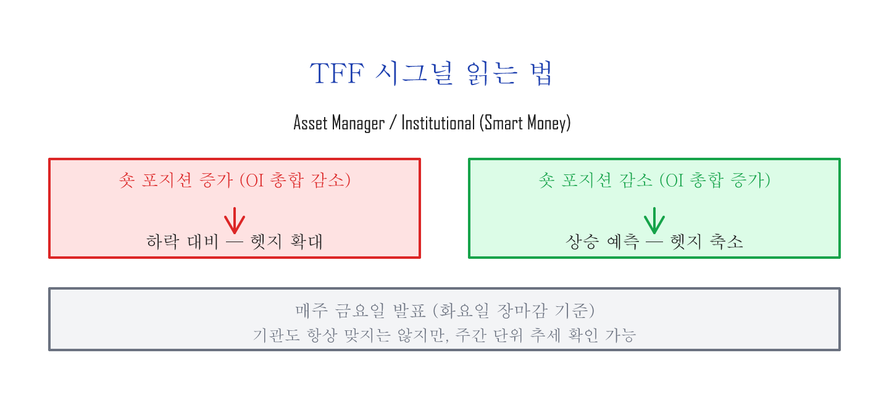
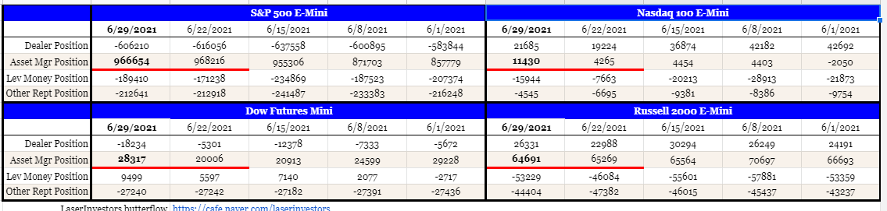
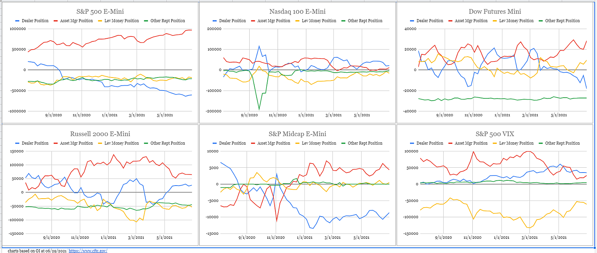
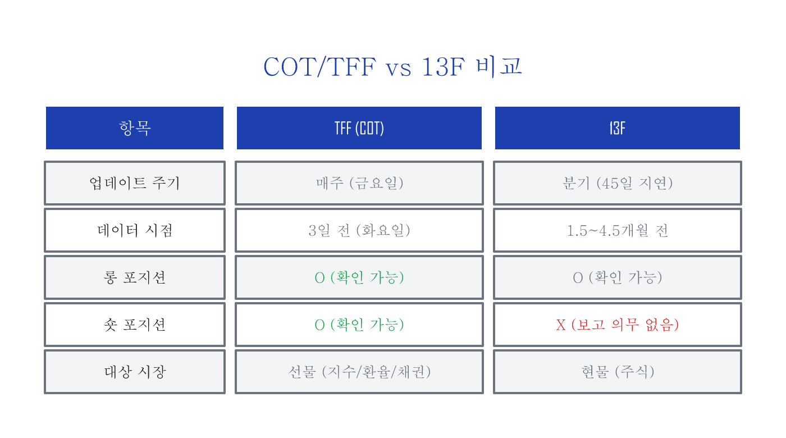

# COT — 선물시장에서 현물시장 살펴보기

---

## COT 리포트란

일정 규모 이상의 선물(futures) 시장 참여자들은 매주 **화요일 장마감** 시점의 미결제약정(OI: Open Interest)을 미국 상품선물거래위원회(CFTC: Commodity Futures Trading Commission)에 보고할 의무가 있습니다. 보고 의무가 있는 참여자들은 CFTC Form 40을 통해서 선물시장에서 비즈니스의 목적을 명시하여 제출하며, CFTC 스태프는 이 보고서를 기준으로 각 시장 참여자들의 비즈니스 범주(category)를 결정합니다.

이렇게 매주 선물시장의 참여자들이 보고하는 미결제약정을 각각의 비즈니스 범주로 나눠서 롱 포지션과 숏 포지션의 총합계를 보여주는 것을 **COT(Commitments of Traders) 리포트**라고 하며, 매주 **금요일 미 동부시간 3:30 PM**에 발표됩니다.

---

## COT 리포트의 진화 — Legacy → D-COT → TFF

COT 리포트는 세 차례에 걸쳐 진화해왔습니다.

### Legacy COT — 초기 3개 범주

COT 리포트에서는 비즈니스 범주를 다음과 같이 세 가지로 나눕니다:

1. **Commercial** — 현물을 직접 사고 파는 거래를 하는 참여자 (헷저)
2. **Non-Commercial** — 현물 거래와 상관없이 선물을 투기 목적으로 거래하는 대형 참여자
3. **Nonreportable** — 보고 기준 미만의 소규모 참여자

그런데 Legacy COT 리포트에서는 현물을 직접 사고 파는 거래를 하지는 않지만 선물 거래에서 거래의 상대편 역할을 하는 **마켓메이커(MM)**의 미결제약정이 Commercial로 포함되면서, Legacy COT 리포트에서 큰 의미를 찾는 것은 한계가 있었습니다.

### D-COT — 마켓메이커 분리 (2009년)

2009년 9월 4일, CFTC는 비즈니스 범주를 더 세분화하는 **D-COT(Disaggregated COT)** 리포트를 시작합니다. D-COT 리포트에서는 비즈니스 범주가 네 가지로 나뉩니다:

1. **Producer/Merchant/Processor/User** — 현물을 직접 사고 파는 참여자
2. **Swap Dealers** — 마켓메이커
3. **Managed Money** — 단기 트레이딩으로 수익을 목적으로 하는 참여자
4. **Other Reportables** — 기타 대형 참여자

마켓메이커의 미결제약정이 현물 거래자들과 분리되면서, D-COT 리포트에서 **Producer/Merchant/Processor/User의 포지션이 가지는 의미가 생기기 시작합니다.** 상식적으로 현물을 실제로 사고 파는 참여자들이 현물의 미래 가격이라고 할 수 있는 선물을 가장 잘 예측할 수 있는 그룹이라는 것을 쉽게 짐작할 수 있습니다.

### TFF — 금융선물 전용 COT (2010년)

CFTC는 2010년 7월 22일부터 **TFF(Traders in Financial Futures)** 리포트를 시작합니다. TFF 리포트는 선물시장에서 금융상품인 환율선물, 채권선물, 시장지수선물의 COT 리포트입니다.

| 범주 | 설명 |
|:----|:-----|
| **Dealer/Intermediary** | 마켓메이커 |
| **Asset Manager/Institutional** | 연금, 기부금 등을 운영하는 대형 기관투자자 (**Smart Money**) |
| **Leveraged Funds** | 단기 트레이딩으로 수익을 목적으로 하는 헷지펀드 등 |
| **Other Reportables** | 기타 대형 참여자 (기업 재무팀, 중앙은행, 소형 은행 등) |

일반적으로 TFF에서 **Asset Manager/Institutional이 스마트 머니(Smart Money)**라고 불리며, Leveraged Funds를 덤 머니(Dumb Money)라고 하기도 합니다.

---

## 사우스웨스트 항공의 교훈

항공유 가격을 선물로 헷지하는 것으로 유명한 **사우스웨스트 항공(LUV)**의 예를 봅니다. 항공사는 기름(현물)을 실제로 사고 파는 Producer/Merchant/Processor/User의 범주로 선물 시장에 참여합니다.

항공사는 비즈니스 특성상 기름 가격이 떨어지기를 원하기 때문에 현물인 기름 가격에 숏 포지션을 가진다고 할 수 있습니다. 항공사는 **기름 가격이 폭등할 것을 예상할 때** 기름 **선물에 롱 포지션을 오픈**하여 헷지합니다.

**2008년** 사우스웨스트 항공은 기름 선물의 롱 포지션을 미리 오픈했기 때문에, 기름 가격이 폭등할 때도 기름 선물 헷지가 폭등한 기름 가격의 약 **70%**를 커버해주었습니다. 반면에 아메리칸 항공(AAL)은 기름 선물을 통한 아무런 헷지가 없었고, 폭등하는 기름 가격을 그대로 다 지불해야 했으며 재정 상황이 크게 악화되는 위기를 겪게 됩니다.

만약 기름 가격이 폭등한 것이 아니라 폭락했다면, 사우스웨스트 항공은 반대로 기름 가격이 떨어지는 혜택을 받지 못했을 것입니다. 하지만 비즈니스 관점에서는 예상치 못한 비용의 증가로 수익률이 어디까지 악화될지 예측 불가능한 상황보다는, **미리 계산된 비용으로 수익률을 예상 및 관리할 수 있는 상황**을 더 선호합니다.

---

## 실전 해석 — 기관의 의중 읽기

기관투자자들은 선물시장을 헷지 목적으로 사용합니다. 현물(주식시장)에서 롱 포지션을 오픈하고, 선물시장에서 숏 포지션을 오픈하여 변동성을 제어하는 헷지 포지션을 유지합니다.

앞서 항공사 비즈니스는 기름 가격이 떨어지기를 원하기 때문에 기름 가격 폭등을 헷지하기 위해 기름 선물에 롱 포지션을 오픈했습니다. 같은 논리로:

> **기관투자자는 주가가 올라가기를 원하기 때문에 기본적으로 주식시장에 롱 포지션이고, 주가 하락을 예상할 때 헷지 목적으로 선물시장에 숏 포지션을 오픈합니다.**

물론 아무리 기관들이라도 모든 것을 다 정확하게 예상할 수는 없겠지만, 적어도 기관들의 동향을 **일주일 단위로** 확인할 수 있다는 것은 상당히 큰 의미가 됩니다.

---

## 13F와의 비교

모든 기관투자자들은 **분기마다** 13F를 통해서 롱 포지션 보고의 의무가 있습니다. (숏 포지션은 보고 의무 없음) 13F는 분기말 후 45일 이내에 제출해야 하므로, 확인 가능한 데이터는 **약 1.5~4.5개월 전** 기관투자자들의 롱 포지션입니다.

반면 TFF 리포트는 **매주** 업데이트되며, 롱과 숏 **모두** 확인할 수 있어 기관투자자들의 최근 동향을 훨씬 빠르게 파악할 수 있습니다.

---

## 마무리 — COT를 실전에 활용하는 법

COT/TFF 리포트는 기관투자자의 포지셔닝을 **매주** 확인할 수 있는 몇 안 되는 공개 데이터입니다. 핵심을 정리하면:

- **Asset Manager의 숏 포지션 추세**를 주간 단위로 추적하라
- 숏이 누적되면 기관이 하락을 대비하고 있다는 신호, 숏이 줄어들면 상승을 예측하고 있다는 신호
- 13F보다 **훨씬 빠르고(주간 vs 분기)**, **숏 포지션까지** 확인 가능
- COT 데이터는 CFTC 웹사이트(cftc.gov)에서 직접 확인하거나, Barchart.com 등의 차트에서 시각적으로 확인 가능

단, COT는 **방향을 가리키는 나침반이지, 타이밍을 알려주는 시계가 아닙니다.** 기관도 항상 맞지는 않으며, 3일 전 데이터라는 시차도 있습니다. 다른 신호(VIX, 기술적 분석 등)와 함께 조합해서 사용하는 것이 가장 효과적입니다.
