# Reading Credit Spreads as an Indicator — The Index Is Calm While the Bottom Already Moves

Equity people watch the VIX. But there's a market that gets scared earlier, and more honestly, than stocks do. **The bond market.**

Specifically, credit spreads — the extra yield you demand for lending to a risky company. That number is currently near its **lowest levels in history**. On the surface, all is well.

Peel back one layer, though, and the story changes. The spread on the riskiest tier has been quietly widening all year. **The average water temperature looks fine, but cold water is coming in along the bottom.**

This post is about how to read that signal — and why someone who can't buy a single CDS should treat it as an **indicator only.**

---

## The 30-second version

- US high-yield (HY) spreads sit around **260bp** (2.6 percentage points), among the lowest in history. Against a long-run median near 450bp, **you're barely paid for default risk.**
- Convert the spread to a default probability (the credit triangle) and you get an implied default rate of about **4.3%**. The actual realized rate is about 4.0%. **The risk premium is essentially zero.**
- The real signal isn't the index — it's **dispersion.** The gap between the lowest tier (CCC) and single-B has widened over 150bp this year, to about **750bp.** The index is calm; the lowest tier is already repricing.
- **You can't trade CDS.** It's an over-the-counter institutional market with million-dollar minimums. So it's an indicator to **read**, not a tool to trade.
- You can track it daily on FRED. One trap, though — since April 2026 these series show **only the last three years.** Long-run context needs your own logging.
- OAS isn't a pure credit spread. It mixes in a **liquidity premium and a call-option adjustment**, which makes it a blunter gauge than CDS.

---

## 1. What a credit spread is — insurance premium, again

In [Options Basics](options-basics.md) we compared an option premium to a car-insurance premium. A credit spread sits in the same place. It's **the premium collected by the side doing the lending.**

US Treasuries are treated as free of default risk, so the Treasury yield is the "risk-free" number. Corporate bonds are different — companies can fail. So a corporate yield sits above the Treasury yield, and **that difference is the spread.**

> Spread = corporate yield − Treasury yield of the same maturity



A wide spread means the market sees that company (or that whole rating) as risky; a narrow one means it sees safety. When the insurance premium gets expensive, the insurer is worried about accidents.

Right now the spread across all of high yield (below investment grade) is about 260bp — **2.6 percentage points.** You're lending to "companies that might fail" for just 2.6 points over Treasuries. Historically the median for this number was about 4.5 points. **We're at roughly half of that — among the lowest in history.**

A record-cheap insurance premium means one of two things. Either the world really is safe, or **nobody is worried about accidents.**

---

## 2. Turning a spread into a default probability — the credit triangle

A spread isn't just a vague sense of "looks risky." You can convert it into an actual **probability.**

The intuition: when a loan defaults, you don't lose everything — you **recover** some of it (collateral, bankruptcy distributions). Roughly 40% is the usual assumption. So a single default costs you about 60%.

That means a spread breaks down roughly like this:

> Spread ≈ default probability × loss per default



Invert it, and you can pull out the **default probability the market has priced in.**

Apply that to today's 260bp spread and the implied default rate comes out to about **4.3%**. (The division is in the collapsible below.)

The market is pricing in about **4.3% defaults** a year in high yield. But the actual realized US speculative-grade default rate has been about **4.0%.**



**They're nearly identical.** That's the point. You took the risk and you're being paid only your expected loss. **There's almost no cushion left for being wrong** — no risk premium.

<details>
<summary>If you want the formula</summary>
<pre><code>Credit triangle (approx.):
  spread ≈ PD × LGD
  PD  = probability of default
  LGD = loss given default = 1 − recovery

Invert:
  implied PD ≈ spread ÷ LGD = spread ÷ (1 − recovery)

  = 2.60% ÷ (1 − 0.40) ≈ 4.3%</code></pre>
<p>The recovery assumption drives the answer. Drop recovery to 30% and the
implied PD is 2.60% ÷ 0.70 ≈ 3.7%; raise it to 50% and it's 2.60% ÷ 0.50 = 5.2%.
So this is a sense-of-scale tool, not a precise measurement. The conclusion —
that the premium is thin — survives any reasonable recovery assumption.</p>
</details>

---

## 3. The index is a trap — the real signal is dispersion

So far this has been "spreads are tight." Tight isn't news; spreads have been tight for years.

**What's new is what's happening underneath the index.**

High yield isn't one blob. It has tiers inside it — from the top: BB (the better end), single-B, and **CCC and lower** (the riskiest floor).

Right now only one of them is moving: CCC.

| Rating | Spread (approx.) | Character |
|---|---|---|
| BB | ~150bp | the safer end of junk |
| Single-B | ~275bp | just above the HY index — still compressed |
| **CCC & lower** | **~1,000bp+** | the floor, near-default candidates — widening alone |

The gap between CCC and single-B is now near **750bp** — over 150bp of widening this year. Yet the index (260bp) and single-B (275bp) both remain near the floor.



How can the index sit still while only CCC widens? Because **the upper tiers are holding it down.** BB and single-B make up a large share of the index weight, and both stay tight, so the average stays low. The average water is fine. But **the cold water is already coming in along the deepest bottom.**

This is the classic late-cycle tell (the tail end of an expansion). The market stays optimistic overall while it **quietly re-prices the weakest names first.** Watch only the index and you miss it.

> The index level tells you "how comfortable things are right now." **Dispersion between ratings tells you "what's breaking first."** The predictive one is the latter.

---

## 4. The limits of OAS — why CDS is cleaner

The spread I've been quoting is, precisely, the **OAS (option-adjusted spread).** The name is the clue: there's a reason "option-adjusted" is in there.

Corporate bonds often carry a **call provision** — the issuer's right to buy the bond back before maturity. That's bad for the holder, so it affects the spread. OAS tries to strip out this option effect, but **not perfectly.**

On top of that, OAS carries more than pure credit risk — it includes a **liquidity premium.** A bond that's hard to sell has to pay up. When markets freeze, credit can be unchanged while this liquidity piece blows out and widens the spread.



So if you want to see **default risk alone**, there's something better than OAS: the **CDS (credit default swap).**

A CDS is literally the contract "I'll pay you if this company defaults." You can buy or sell the default risk by itself, without owning the bond. That makes a CDS price the **purest market price of default risk.**

---

## 5. But CDS stays an indicator only

Here's the sober part. CDS being cleaner doesn't mean you can use it.

**Individuals can't trade CDS.**

- It's an **institutions-only over-the-counter market.** It isn't listed on an exchange.
- Minimum trade size is typically in the **millions of dollars.**
- It comes with ISDA contracts, collateral management, and counterparty risk. There's no seat for a retail account.

So this post treats CDS as an **indicator to read, not a tool to trade.** CDX (the North American high-yield CDS index, precisely CDX.NA.HY) and single-name CDS spreads are a pure thermometer of credit sentiment. **You watch it, you don't buy it.**

If you actually want to act on the signal, do it with the tools you *can* reach — equities, index options, cash weighting — while **sourcing your judgment from the credit market.**

---

## 6. Tracking it yourself — FRED tickers and a trap

CDS may be cleaner, but individuals can barely access its data anyway. The good news: rating-level OAS is on **FRED, free and daily** — and though OAS isn't as pure as CDS, that's fine here, because the signal we want isn't the absolute level but the **gap between ratings.** The tickers you need:

| Ticker | What it is |
|---|---|
| `BAMLH0A0HYM2` | High yield, all-in OAS |
| `BAMLC0A0CM` | Investment grade (IG), all-in OAS |
| `BAMLH0A1HYBB` | BB rating |
| `BAMLH0A2HYB` | Single-B rating |
| `BAMLH0A3HYC` | CCC & lower |

The key signal in this post — the **CCC−B gap** — is just the last two:

```
CCC−B gap = BAMLH0A3HYC − BAMLH0A2HYB
```

The **direction and speed** of that gap moves ahead of the index level. Gap widening while the index sits still is exactly the situation this post is about.

> **One trap.** Since April 2026, FRED serves these ICE BofA series with **only the last three years of observations.** So context like "long-run median ~450bp" can no longer be read off FRED directly. To compare against history, you have to **start logging the values into your own sheet from today.** If you're going to take the signal seriously, start the record now.

---

## 7. What to watch

To put it to work:

- **The direction of dispersion over the level.** That HY sits at 260bp matters less than whether the CCC−B gap is **widening** — that's what flags late cycle first. It's not a timing signal for *when* things break, but the structure — thin pay, open downside — is clear.
- **A spread is a state, not a forecast.** Tight doesn't mean "about to blow up" — it means "you're thinly paid right now." Tight spreads can persist for a long time. But in that state the **downside dwarfs the upside**: there's little room to tighten from 260bp and a lot of room to widen (600bp+ in stress).
- **Read it alongside the VIX.** When equity vol is quiet but credit dispersion widens, the two markets are telling different stories. The bond side is usually the honest one first.

---

## 8. Summary

| Concept | Core |
|---|---|
| **Credit spread** | Extra yield over Treasuries = the premium for taking default risk |
| **Current level** | HY ~260bp, among the lowest in history (median ~450bp). Thin pay |
| **Credit triangle** | Implied default from the spread ≈ 4.3% vs actual ~4.0% |
| **Real signal** | Not the index but **dispersion.** CCC−B gap near 750bp, 150bp+ wider this year |
| **OAS limit** | Mixes liquidity + call adjustment. CDS is cleaner for pure credit |
| **CDS** | Not tradable by individuals (OTC, millions). **Indicator only** |
| **Tracking** | Rating-level OAS on FRED. `CCC−B = BAMLH0A3HYC − BAMLH0A2HYB` |
| **Trap** | Since 2026-04 FRED shows only 3 years → log your own daily |

**The one thing to remember**: in credit, risk gets re-priced from the **edges** first, not the index. If high yield looks calm as a whole but the CCC−B gap is widening, that's the market saying something it hasn't said out loud yet. You can't buy CDS — but you can read that thermometer, free, every day.

---

*Related: [Volatility Skew](skew.md) | [Implied Correlation](implied-correlation.md) | [COT Report](cot.md) | [MOVE — The Bond Market's VIX](move-index.md)*

### Sources and notes

Spread figures are from the ICE BofA US High Yield / by-rating OAS indices (FRED
mirror, as of 2026-08-28); the default rate is the recent realized US
speculative-grade rate compiled by S&P and Moody's. All figures are as of
late August 2026.

The ICE BofA indices and tickers are trademarks and property of ICE Data Indices;
this post references them only to identify the indicators. FRED is a service of
the Federal Reserve Bank of St. Louis. CDX is a trademark of S&P Global (Markit),
referenced here only to identify the index.

### Glossary

- *Credit spread* — corporate yield minus the Treasury yield of the same maturity; the price of default risk
- *OAS (option-adjusted spread)* — a spread adjusted for embedded options like calls; still carries a liquidity premium
- *HY (high yield)* — speculative-grade bonds, rated BB and below
- *IG (investment grade)* — bonds rated BBB and above
- *Recovery* — the fraction a creditor gets back in default; commonly assumed ~40%
- *LGD (loss given default)* — loss in default = 1 − recovery
- *PD (probability of default)*
- *Credit triangle* — the relation spread ≈ PD × LGD; know two, solve the third
- *CDS (credit default swap)* — an OTC derivative that pays out if a named issuer defaults; the purest price of default risk
- *CDX* — a family of North American CDS indices; the high-yield one is CDX.NA.HY
- *Dispersion* — the gap between rating spreads; widening signals the market has started to discriminate risk
