# 신용 스프레드를 지표로 읽기 — 지수는 잠잠한데 바닥 등급은 이미 움직인다

주식 하는 사람은 VIX를 봅니다. 그런데 주식보다 먼저, 그리고 더 정직하게 겁을 먹는 시장이 따로 있습니다. **채권 시장**이에요.

정확히는 신용 스프레드. 위험한 회사에 돈을 빌려주는 대가로 얼마를 더 받느냐입니다. 이 숫자는 지금 **역사적으로 가장 낮은 축**에 있습니다. 표면만 보면 세상이 평온하다는 뜻이죠.

그런데 지수 한 겹만 걷어내면 얘기가 다릅니다. 가장 위험한 등급의 스프레드는 올해 조용히 벌어지고 있어요. **평균 수온은 괜찮은데 바닥으로 찬물이 들어오는 중**입니다.

이 글은 그 신호를 어떻게 읽는지, 그리고 CDS를 한 주도 못 사는 개인이 왜 이걸 **지표로만** 다뤄야 하는지에 대한 이야기입니다.

---

## 30초 요약

- 미국 하이일드(HY) 스프레드는 약 **260bp**(2.6%포인트), 역대 가장 낮은 축입니다. 장기 중위값이 약 450bp인 걸 감안하면 **부도 위험에 대한 보상이 거의 없습니다.**
- 스프레드를 부도 확률로 바꾸면(신용 삼각형) 내재 부도율은 약 **4.3%**. 실제 HY 부도율은 약 4.0%. **위험 프리미엄이 사실상 0**입니다.
- 진짜 신호는 지수가 아니라 **분산**입니다. 가장 낮은 등급(CCC)과 단일B의 격차가 올해 150bp 넘게 벌어져 **750bp에 이르렀습니다.** 지수는 잠잠한데 바닥 등급은 이미 값이 다시 매겨지는 중.
- **CDS는 개인이 못 삽니다.** 장외 기관 시장이고 최소 단위가 수백만 달러예요. 그래서 매매 도구가 아니라 **읽는 지표**입니다.
- FRED로 매일 추적할 수 있습니다. 단 함정 하나 — 2026년 4월부터 이 시리즈들이 **최근 3년치만** 제공됩니다. 장기 맥락은 자체 적재가 필요해요.
- OAS는 순수 신용 스프레드가 아닙니다. **유동성 프리미엄과 콜옵션 조정**이 섞여 있어 CDS보다 근사 정확도가 낮습니다.

---

## 1. 신용 스프레드가 뭔가 — 다시 보험료입니다

[옵션의 기초](options-basics.md)에서 옵션 프리미엄을 자동차 보험료에 비유했었죠. 신용 스프레드도 같은 자리에 있습니다. **돈을 빌려주는 쪽이 받는 보험료**예요.

미국 국채는 떼일 걱정이 없다고 칩니다. 그러니 국채 금리는 "위험 없는 값"이에요. 회사채는 다릅니다. 회사는 망할 수 있으니까요. 그래서 회사채 금리는 국채 금리보다 높고, **그 차이가 스프레드**입니다.

> 스프레드 = 회사채 금리 − 같은 만기 국채 금리



이 값이 넓으면 시장이 그 회사(또는 그 등급 전체)를 위험하게 본다는 뜻이고, 좁으면 안전하게 본다는 뜻입니다. 보험료가 비싸지면 보험사가 사고를 걱정하는 것과 같아요.

지금 하이일드(투기등급) 전체의 스프레드는 약 260bp, 즉 **2.6%포인트**입니다. 국채보다 2.6%포인트만 더 받고 "망할 수도 있는 회사들"에 돈을 빌려준다는 얘기예요. 역사적으로 이 값의 중위값은 약 4.5%포인트였습니다. **지금은 그 절반 수준, 역대 가장 낮은 축**에 있습니다.

보험료가 역대급으로 싸다는 건 둘 중 하나입니다. 정말 안전하거나, **아무도 사고를 걱정하지 않거나.**

---

## 2. 스프레드를 부도 확률로 바꾸기 — 신용 삼각형

스프레드는 그냥 "위험해 보임" 정도의 느낌이 아니라 **숫자로 된 확률**로 바꿀 수 있습니다.

직관은 이렇습니다. 돈을 빌려줬다가 떼이면, 전액을 잃는 게 아니라 **일부는 회수**합니다(담보 매각, 파산 배당 등). 보통 40% 정도 건진다고 봐요. 그러면 한 번 부도날 때 실제 손실은 60%입니다.

그래서 스프레드가 대략 이렇게 쪼개집니다.

> 스프레드 ≈ 부도 확률 × 한 번 부도 시 손실률



이걸 뒤집으면 스프레드에서 **시장이 반영한 부도 확률**을 꺼낼 수 있어요.

지금 스프레드 260bp에 이 방식을 그대로 적용하면 내재 부도율은 **약 4.3%**가 나옵니다. (자세한 계산은 아래 접기에.)

시장은 지금 하이일드에서 **연 4.3% 부도**를 가격에 넣고 있다는 뜻입니다. 그런데 실제 미국 투기등급 부도율은 최근 약 **4.0%**예요.

**둘이 거의 같습니다.** 이게 핵심입니다. 위험을 떠안았는데 실제 예상 손실만큼만 받고 있어요. **틀렸을 때를 대비한 여윳돈(위험 프리미엄)이 거의 남지 않습니다.**



<details>
<summary>수식으로 확인하고 싶다면</summary>
<pre><code>신용 삼각형 (근사):
  스프레드 ≈ PD × LGD
  PD  = 부도 확률 (probability of default)
  LGD = 부도 시 손실률 = 1 − 회수율(recovery)

뒤집으면:
  내재 PD ≈ 스프레드 ÷ LGD = 스프레드 ÷ (1 − 회수율)

  = 2.60% ÷ (1 − 0.40) ≈ 4.3%</code></pre>
<p>회수율 가정이 결과를 좌우합니다. 회수율을 30%로 낮추면 내재 PD는
2.60% ÷ 0.70 ≈ 3.7%, 50%로 높이면 2.60% ÷ 0.50 = 5.2%. 그래서 이건
정밀 측정이 아니라 <em>크기 감</em>을 잡는 도구입니다. 결론(프리미엄이
얇다)은 회수율 가정을 웬만큼 흔들어도 그대로 유지됩니다.</p>
</details>

---

## 3. 지수는 함정이다 — 진짜 신호는 분산

여기까지는 "스프레드가 좁다"는 얘기였습니다. 좁은 건 새로운 정보가 아니에요. 스프레드는 몇 년째 좁았습니다.

**새로운 건 지수 아래에서 벌어지는 일**입니다.

하이일드는 한 덩어리가 아닙니다. 그 안에 등급이 있어요. 위에서부터 BB(그나마 나은 축), 단일B, 그리고 **CCC 이하**(가장 위험한 바닥)입니다.

그런데 지금 튀는 건 딱 하나, CCC뿐입니다.

| 등급 | 스프레드(대략) | 성격 |
|---|---|---|
| BB | 약 150bp | 그나마 안전한 투기등급 |
| 단일B | 약 275bp | HY 지수 바로 위 — 여전히 눌려 있음 |
| **CCC 이하** | **약 1,000bp 이상** | 바닥, 부도 직전 후보 — 혼자 튄다 |

CCC와 단일B의 격차가 **750bp에 육박합니다.** 올해 들어 150bp 넘게 벌어졌어요. 그런데 지수 전체(260bp)도 단일B(275bp)도 여전히 바닥권이에요.



어떻게 지수는 가만한데 CCC만 벌어질까요? **위쪽 등급이 눌러주고 있기 때문**입니다. BB와 단일B가 지수에서 큰 비중을 차지하고, 그쪽이 계속 좁으니 평균이 낮게 유지돼요. 평균 수온은 괜찮은 겁니다. 하지만 **가장 깊은 바닥에는 이미 찬물이 들어오고 있어요.**

이게 후기 사이클(경기 확장의 끝물)의 전형적인 신호입니다. 시장이 전체적으로는 낙관하면서도, **가장 약한 이름들부터 조용히 값을 다시 매기기 시작**하는 거예요. 지수만 보면 이 신호를 놓칩니다.

> 지수 레벨은 "지금 얼마나 편안한가"를 말하고, **등급 간 분산은 "무엇이 먼저 깨지고 있는가"**를 말합니다. 예측력이 있는 쪽은 후자예요.

---

## 4. OAS의 한계 — 왜 CDS가 더 깨끗한가

지금까지 말한 스프레드는 정확히는 **OAS(옵션조정 스프레드)**입니다. 이름에 이미 단서가 있어요 — "옵션조정"이 왜 붙었을까요.

회사채에는 종종 **수의상환(콜) 조항**이 붙습니다. 발행사가 만기 전에 되사갈 권리요. 이건 채권 보유자에게 불리하니 스프레드에 영향을 줍니다. OAS는 이 옵션 효과를 걷어내려고 조정을 하는데, **완벽하진 않아요.**

게다가 OAS에는 순수한 신용 위험 말고 **유동성 프리미엄**도 섞여 있습니다. 잘 안 팔리는 채권일수록 값을 더 쳐줘야 하니까요. 시장이 얼어붙으면 신용은 그대로여도 이 유동성 부분이 튀어서 스프레드가 벌어집니다.



그래서 순수하게 **부도 위험만** 보고 싶으면 OAS보다 나은 게 있습니다. **CDS(신용부도스와프)**예요.

CDS는 애초에 "이 회사가 부도나면 보상하겠다"는 계약 그 자체입니다. 회사채를 들고 있지 않아도 부도 위험만 따로 사고팔 수 있어요. 그래서 CDS 가격은 **부도 위험의 가장 순수한 시장 가격**에 가깝습니다.

---

## 5. 그런데 CDS는 지표로만 다룹니다

여기서 냉정해야 합니다. CDS가 더 깨끗하다고 해서 개인이 쓸 수 있는 건 아니에요.

**CDS는 개인이 거래할 수 없습니다.**

- 장외(OTC) **기관 전용 시장**입니다. 거래소에 상장된 물건이 아니에요.
- 최소 거래 단위가 보통 **수백만 달러**입니다.
- ISDA 계약, 담보 관리, 상대방 위험까지 딸려 옵니다. 개인 계좌로 들어갈 자리가 아니에요.

그래서 이 글은 CDS를 **매매 도구가 아니라 읽는 지표**로 다룹니다. CDX(북미 하이일드 CDS 지수, 정확히는 CDX.NA.HY)나 개별 CDS 스프레드는 신용 시장 심리를 재는 순수한 온도계예요. **사는 게 아니라 보는 겁니다.**

개인이 실제로 이 신호에 반응하고 싶다면, 거래는 자기가 접근 가능한 도구(주식·지수 옵션·현금 비중 등)로 하되, **판단의 근거를 신용 시장에서 가져오는** 방식이 현실적입니다.

---

## 6. 직접 추적하기 — FRED 티커와 함정

CDS가 더 깨끗하다지만 개인은 그 데이터에 접근하기도 어렵습니다. 다행히 등급별 OAS는 **FRED에서 무료로, 매일** 볼 수 있어요. OAS가 CDS만큼 순수하진 않아도 상관없습니다 — 우리가 볼 신호는 스프레드의 절대 수준이 아니라 **등급 간 격차**라서, OAS로 충분하거든요. 필요한 티커는 이렇습니다.

| 티커 | 내용 |
|---|---|
| `BAMLH0A0HYM2` | 하이일드 전체 OAS |
| `BAMLC0A0CM` | 투자등급(IG) 전체 OAS |
| `BAMLH0A1HYBB` | BB 등급 |
| `BAMLH0A2HYB` | 단일B 등급 |
| `BAMLH0A3HYC` | CCC 이하 |

이 글의 핵심 신호인 **CCC−B 격차**는 뒤의 두 개로 바로 계산됩니다.

```
CCC−B 격차 = BAMLH0A3HYC − BAMLH0A2HYB
```

이 격차의 **방향과 속도**가 지수 레벨보다 먼저 움직입니다. 격차가 벌어지는데 지수는 잠잠하면, 그게 이 글이 말하는 상황이에요.

> **함정 하나.** 2026년 4월부터 FRED가 이 ICE BofA 시리즈들을 **최근 3년치 관측값만** 제공하도록 바꿨습니다. 그래서 "장기 중위값 약 450bp" 같은 맥락은 이제 FRED 화면에서 직접 확인할 수 없어요. 장기 비교를 하려면 **지금부터 매일 값을 자기 시트에 적재**해 두는 수밖에 없습니다. 신호를 진지하게 볼 생각이면 오늘부터 기록을 시작하세요.

---

## 7. 무엇을 볼 것인가

정리하면 실전에서 챙길 건 이렇습니다.

- **지수 레벨보다 분산의 방향.** HY 전체가 260bp라는 사실보다, CCC−B 격차가 **벌어지고 있는지**가 후기 사이클을 먼저 알려줍니다. 언제 무너진다는 타이밍 신호는 아니지만, **보상이 얇고 아래가 열려 있다**는 구조는 분명해요.
- **스프레드는 예측이 아니라 상태입니다.** 좁다는 건 "곧 터진다"가 아니라 "지금 보상이 얇다"예요. 좁은 스프레드는 오래갈 수 있습니다. 다만 그 상태에서는 **하방이 상방보다 훨씬 큽니다.** 260bp에서 더 좁아질 여지는 얼마 없고, 벌어질 여지는 큽니다(스트레스 국면엔 600bp 이상).
- **VIX와 함께 보세요.** 주식 변동성이 잠잠한데 신용 분산이 벌어지면, 두 시장이 다른 얘기를 하는 겁니다. 보통 채권 쪽이 먼저 정직합니다.

---

## 8. 정리

| 개념 | 핵심 |
|---|---|
| **신용 스프레드** | 국채 대비 추가 이자 = 부도 위험을 떠안는 보험료 |
| **현재 레벨** | HY 약 260bp, 역대 가장 낮은 축(중위 ~450bp). 보상이 얇음 |
| **신용 삼각형** | 스프레드로 계산한 내재 부도율 ≈ 4.3% vs 실제 ~4.0% |
| **진짜 신호** | 지수가 아니라 **분산**. CCC−B 격차 약 750bp, 올해 150bp+ 확대 |
| **OAS 한계** | 유동성·콜옵션 조정이 섞임. 순수 신용은 CDS가 더 깨끗 |
| **CDS** | 개인 거래 불가(장외·수백만 달러). **지표로만** |
| **추적** | FRED 등급별 OAS. `CCC−B = BAMLH0A3HYC − BAMLH0A2HYB` |
| **함정** | FRED가 2026.04부터 최근 3년치만 제공 → 자체 일별 적재 필요 |

**기억할 한 가지**: 신용 시장에서 위험은 지수가 아니라 **가장자리부터** 다시 매겨집니다. 하이일드 전체가 잠잠해 보여도 CCC−B 격차가 벌어지고 있다면, 그게 시장이 아직 입 밖에 내지 않은 얘기예요. CDS를 못 사도, 그 온도계는 매일 무료로 읽을 수 있습니다.

---

*관련: [변동성 Skew](skew.md) | [시장 심리 변동성 지수](implied-correlation.md) | [COT 리포트](cot.md) | [MOVE 지수 — 채권시장의 VIX](move-index.md)*

### 출처와 표기

스프레드 수치는 ICE BofA US High Yield / 등급별 OAS 지수(FRED 미러, 2026-08-28
기준)를, 부도율은 S&P·무디스가 집계한 최근 미국 투기등급 실현 부도율을 근거로
했으며, 모두 2026년 8월 말 기준입니다.

ICE BofA 지수 및 티커는 ICE Data Indices의 상표·자산이며, 본문은 지표를 지칭할
목적으로만 사용했습니다. FRED는 세인트루이스 연준의 서비스입니다. CDX는
S&P Global(Markit)의 상표이며, 지수를 지칭할 목적으로만 사용했습니다.

### 용어 설명

- *신용 스프레드 (Credit Spread)* — 회사채 금리에서 같은 만기 국채 금리를 뺀 값. 부도 위험의 값
- *OAS (Option-Adjusted Spread)* — 수의상환 등 내장 옵션 효과를 조정한 스프레드. 유동성 프리미엄이 섞여 있음
- *HY (High Yield)* — 투기등급 채권. 신용등급 BB 이하
- *IG (Investment Grade)* — 투자등급 채권. BBB 이상
- *회수율 (Recovery)* — 부도 시 채권자가 건지는 비율. 통상 약 40% 가정
- *LGD (Loss Given Default)* — 부도 시 손실률 = 1 − 회수율
- *PD (Probability of Default)* — 부도 확률
- *신용 삼각형* — 스프레드 ≈ 부도확률 × 손실률의 관계. 셋 중 둘을 알면 나머지를 푼다
- *CDS (Credit Default Swap)* — 특정 발행사 부도 시 보상하는 장외 파생계약. 부도 위험의 순수 가격
- *CDX* — 북미 CDS 지수 계열. 하이일드 지수는 CDX.NA.HY
- *분산 (Dispersion)* — 등급 간 스프레드 격차. 확대되면 시장이 위험을 차별하기 시작했다는 신호
