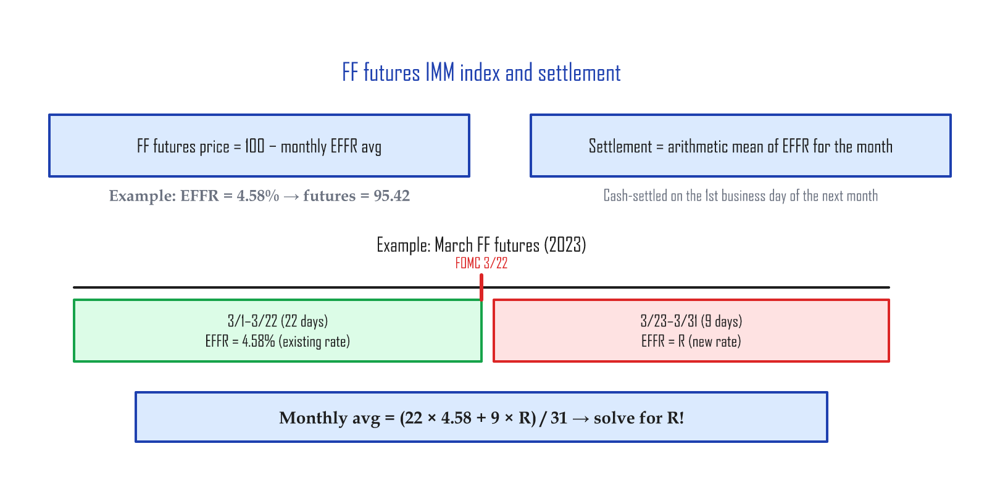
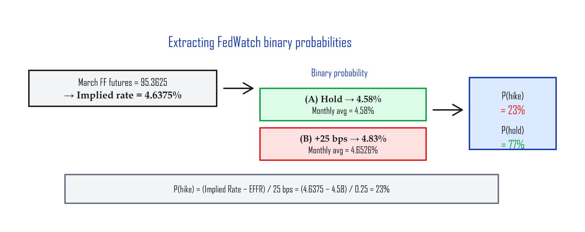

# Fed Funds Futures and the CME FedWatch Tool — How rate-cut probabilities work

---

## Part 1: Fed Funds futures and EFFR

Whether the FOMC (Federal Open Market Committee) raises or cuts rates is the single most consequential variable for stocks, bonds, and currencies alike. The tool that shows what the market is *pricing* on rate direction is the Fed Funds futures market and, on top of it, the FedWatch Tool.

### What Fed Funds futures are

The CME Group lists 30-Day Federal Funds futures under the ticker **ZQ**.

| Spec | Value |
|:-----|:------|
| Contract size | $5,000,000 (notional value per contract) |
| Pricing convention | The IMM (International Monetary Market) index — the convention for converting a rate into a price |
| Settlement | Cash-settled to the arithmetic average of EFFR across all business days of the contract month |

The FF futures price is quoted using CME's IMM-index convention:

```
FF futures price = 100 − (average EFFR for the contract month)
```

For example, if EFFR is 4.58%, the FF futures IMM-index price is 95.42 (100 − 4.58).

### EFFR (Effective Federal Funds Rate)

EFFR is the rate that actually applies when U.S. banks lend each other money overnight — the **Effective Federal Funds Rate**. The Federal Reserve Bank of New York (FRBNY) publishes it daily, computed as the **volume-weighted median** of the prior day's overnight unsecured loan rates between depository institutions (the "trade-volume-weighted representative value" — bigger trades carry more weight).

> EFFR is published every day on the New York Fed's website (newyorkfed.org).

### How FOMC decisions feed into EFFR

When the FOMC sets a new target range, EFFR reflects it starting **the next business day**:

| FOMC meeting | Decision | EFFR change |
|:-------------|:---------|:------------|
| Dec 13–14, 2022 | +50 bps (0.50 pp) | 3.83% → 4.33% (effective Dec 15) |
| Jan 31 – Feb 1, 2023 | +25 bps (0.25 pp) | 4.33% → 4.58% (effective Feb 2) |
| Mar 21–22, 2023 | +25 bps (0.25 pp) | 4.58% → 4.83% (effective Mar 23) |

> **A bps refresher:** 1 bp = 0.01 pp. So 25 bps = 0.25 pp, 50 bps = 0.50 pp.

### Settlement and the implied rate

FF futures settle on the first business day of the month *after* the contract month, using the arithmetic average of EFFR across every business day of the contract month.



The price of an FF futures contract reflects the **market's expectation of where average EFFR will settle** for that month. The big players trading $5 million-notional contracts have models running the rate path constantly, and they trade those views.

When the FOMC announces a new rate, that decision flows into the settlement price of the relevant month's contract — and from there into every subsequent month's contract. So FF futures prices have traders' rate forecasts baked in. Settlement is mechanical (an average of actual EFFR), but the price you see *before* expiration carries the market's expectation about future rates. That hidden forecast is called the **implied rate**.

---

## Part 2: How the CME FedWatch Tool computes probabilities

### What FedWatch is

CME Group runs a free **FedWatch Tool** that uses FF futures prices to translate the market's collective expectation about FOMC decisions into probabilities. You can view it for free at cmegroup.com/markets/interest-rates/cme-fedwatch-tool.html.

Internally, FedWatch uses a **binary probability tree** — at each meeting it considers only two outcomes (e.g. hike vs hold) and splits the probability between them.

### Pulling probabilities out of the implied rate

Walk through a real example. Set the clock to March 20, 2023. The next day's March 21 FOMC meeting hadn't happened yet, and any new rate would only feed into EFFR starting March 23.

On March 20, the March FF contract (ZQH3) closed at 95.3625. Subtract from 100 and you get a **monthly average implied rate of 4.6375%**.

March has 31 days. Of those, the first 22 (through March 22, before the FOMC announcement) carry the *current* rate. The last 9 days (March 23 onward) carry the *new* rate. Only those 9 days are unknown — that weighted split is what lets you back out the new rate.

<details><summary>Show the calculation</summary>

For simplicity, assume EFFR is 4.58% across all 22 days from March 1 through March 22. Call the post-FOMC EFFR `R`. Then:

```
monthly average implied rate = (22 × 4.58 + 9 × R) / 31
```

Plug in 4.6375% for the monthly implied rate and solve for `R`.

</details>

Implied rate by scenario:

| Scenario | R (post-FOMC EFFR) | Monthly average implied rate |
|:---------|:-------------------|:-----------------------------|
| **(A)** Hold | 4.58% | 4.58% |
| **(B-1)** +25 bps hike | 4.83% | 4.6526% |
| **(B-2)** +50 bps hike | 5.08% | 4.7252% |
| **(C)** −25 bps cut | 4.33% | 4.5074% |

The actual monthly implied rate of 4.6375% sits between (A) Hold (4.58%) and (B-1) +25 bps (4.6526%). That tells you the rates market was pricing **only two outcomes**: hold or +25 bps. (Hence: binary probability.)

### Computing the probability



```
EFFR Start = 4.58%
Implied Rate = 4.6375%
```

**Probability of a 25 bps hike:**

<details><summary>Probability formula derivation</summary>

```
P(hike) = (Implied Rate − EFFR Start) / 25 bps
        = (4.6375 − 4.58) / 0.25
        = 0.0575 / 0.25
        = 23%
```

Because FedWatch assumes binary outcomes:

```
P(hold) = 1 − P(hike) = 1 − 23% = 77%
```

</details>

In words: the implied rate is sitting at the 23% mark between "hold" and "+25 bps." 0% would mean hold for sure, 100% would mean hike for sure — 23% means "a hike is possible, but the market is leaning heavily toward hold."

So as of March 20, the rates market priced the March FOMC at **77% hold, 23% hike**.

---

## Summary

| Concept | The point |
|:--------|:----------|
| **EFFR** | The Effective Federal Funds Rate, published daily by the New York Fed (volume-weighted median) |
| **FF futures** | A futures contract whose price reflects the market's expected monthly average EFFR (ticker: ZQ) |
| **IMM index** | FF futures price = 100 − monthly average EFFR |
| **FedWatch Tool** | Uses the implied rate from FF futures and a binary probability tree to extract FOMC decision probabilities |

The point is that you can recover the market's view on the next FOMC decision from a single FF futures price. Chain that reasoning across multiple meetings — use the March contract for March FOMC, then feed the result into the May contract for May FOMC — and you can extract the full rate path the market is currently pricing for the months ahead. When a headline says "90% probability of a hike," that number comes from this calculation.

> FedWatch updates in real time on the CME website, which makes it useful for reading sentiment going into a meeting. Just remember: FF futures prices are tick-by-tick, so FedWatch probabilities move tick-by-tick too. It's not a fixed forecast — it's the **market's current consensus**.

---

*Previous: [The COT Report — Reading the spot market through the futures market](cot.md)*
