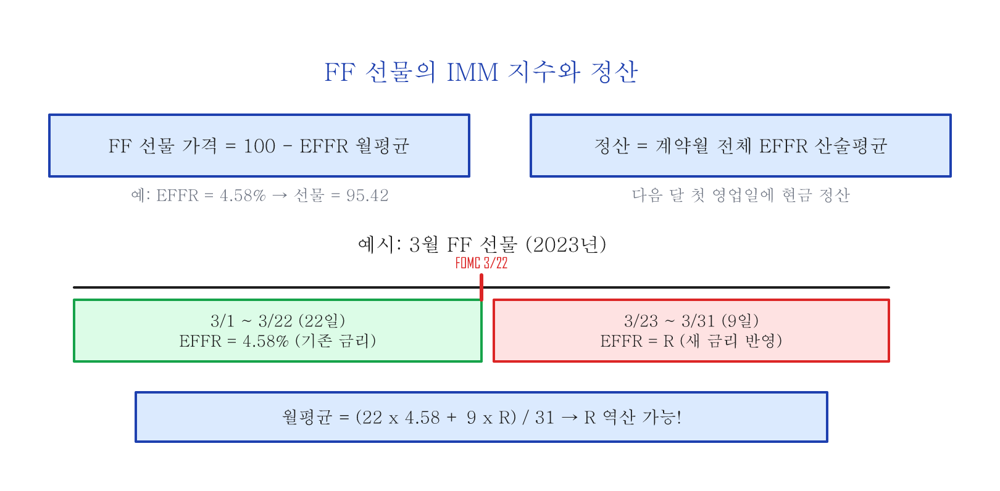
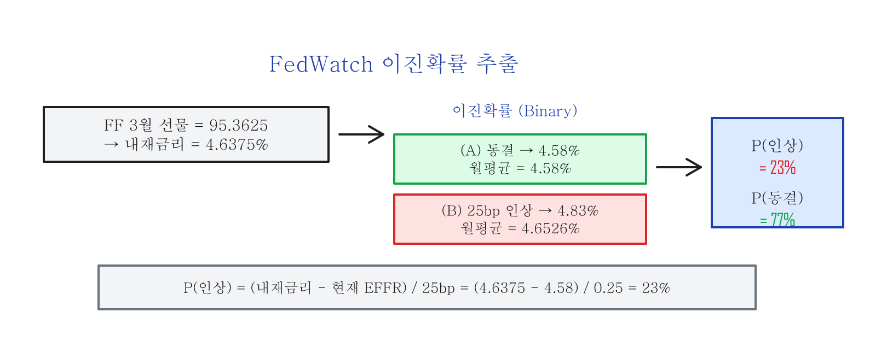

# Fed Fund 선물과 CME FedWatch Tool — 금리 예측의 원리

---

## Part 1: Fed Fund 선물과 EFFR

### FF 선물이란

미국 최대 선물/옵션 거래소인 CME(Chicago Mercantile Exchange) 그룹에서 티커명 **ZQ**인 30 Day Federal Funds 선물을 상장하여 거래를 주관합니다.

| 항목 | 내용 |
|:----|:-----|
| 계약 단위 | $5,000,000 |
| 가격 방식 | IMM(International Monetary Market) 지수 |
| 정산 | 해당 계약월의 모든 영업일 EFFR 산술평균으로 현금 정산 |

FF 선물의 가격은 CME에서 자체 개발한 IMM 지수 방식으로 계산합니다:

```
FF 선물 가격 = 100 - (계약월 EFFR 산술평균)
```

예를 들어 EFFR이 4.58%이면, FF 선물 가격은 IMM 지수로 95.42 (100 - 4.58)가 됩니다.

### EFFR (Effective Federal Funds Rate)

EFFR은 Fed의 뉴욕 연방준비은행(FRBNY)에서 매일 공시하는 **실효 연방기금금리**입니다. 전 거래일에 시장에서 메이저 브로커들이 예탁기관들(Depository institutions) 사이에서 성사시킨 무담보 익일대출(Overnight unsecured loan) 이자율의 **거래량 가중 중앙값(Volume-weighted median)**으로 계산합니다.

> EFFR은 뉴욕 연준 웹사이트(newyorkfed.org)에서 매일 확인할 수 있습니다.

### FOMC 금리 결정과 EFFR의 관계

FOMC 회의에서 금리가 결정되면, 그 **다음 영업일**부터 EFFR에 반영됩니다:

| FOMC 회의 | 결정 | EFFR 변화 |
|:----------|:-----|:----------|
| 2022년 12월 13~14일 | 50bps 인상 | 3.83% → 4.33% (12/15~) |
| 2023년 1월 31일~2월 1일 | 25bps 인상 | 4.33% → 4.58% (2/2~) |
| 2023년 3월 21~22일 | 25bps 인상 | 4.58% → 4.83% (3/23~) |

### FF 선물의 정산과 내재금리

FF 선물의 정산은 해당 계약월의 다음 달 첫 날에, 계약월 동안의 모든 영업일 EFFR 산술평균을 계산하여 현금 정산합니다.



FF 선물의 가격에는 해당 계약월 동안 EFFR에 대한 **시장의 기대치가 반영**되어 있습니다. 한 계약당 $5,000,000인 FF 선물을 거래하는 큰 손들은 부지런히 금리를 예측하여 FF 선물의 예상 가격 기준을 세우고 거래합니다.

FOMC 회의에서 결정되는 금리는 해당 월 FF 선물의 정산가격에 영향을 미치며, 이후 모든 FF 선물계약의 가격을 결정합니다. 따라서 FF 선물 가격은 IMM 시장 참여자들이 예상하는 **금리 변동 예측값**을 반영하게 되며, 이를 **내재금리(Implied Rate)**라고 합니다.

---

## Part 2: CME FedWatch Tool의 금리 예측

### FedWatch Tool이란

CME 그룹은 FF 선물 가격을 바탕으로 FOMC 회의에서 결정되는 금리에 대한 시장 참여자들의 기대치를 반영하는 **FedWatch Tool**을 제공합니다. FedWatch Tool은 CME 웹사이트(cmegroup.com/markets/interest-rates/cme-fedwatch-tool.html)에서 무료로 확인할 수 있습니다.

FedWatch Tool은 내부적으로 **이진확률트리(Binary probability tree)**를 사용하여 최종 금리의 확률을 예측합니다.

### 내재금리에서 확률 추출하기

시간을 2023년 3월 20일로 돌려봅니다. 다음 날인 3월 21일 FOMC 회의의 금리 결정을 아직 알 수 없는 상태입니다. 또한 새로 결정될 금리는 FOMC 회의 다음 날인 3월 23일부터 EFFR에 반영됩니다.

3월 20일 기준으로 FF 3월 선물계약(ZQH3)의 가격은 95.3625였습니다. 여기서 100을 빼면 **월평균 내재금리 4.6375%**가 됩니다.

3월 1일부터 3월 22일까지 22일 동안의 EFFR은 계산의 편의상 모두 4.58%라고 가정합니다. FOMC 이후 갱신될 EFFR을 R이라고 정의하면:

```
월평균 내재금리 = (22일 x 4.58 + 9일 x R) / 31일
```

여기서 월평균 내재금리 4.6375%를 대입하면 R을 역산할 수 있습니다.

각 시나리오별 내재금리:

| 시나리오 | R (FOMC 후 EFFR) | 월평균 내재금리 |
|:--------|:----------------|:-------------|
| **(A)** 금리 동결 | 4.58% | 4.58% |
| **(B-1)** 25bps 인상 | 4.83% | 4.6526% |
| **(B-2)** 50bps 인상 | 5.08% | 4.7252% |
| **(C)** 25bps 인하 | 4.33% | 4.5074% |

실제 월평균 내재금리 4.6375%는 (A) 금리 동결(4.58%)과 (B-1) 25bps 인상(4.6526%) 사이의 값입니다. 금리시장의 트레이더들이 3월 FOMC에서 **"금리 동결"과 "25bps 인상"의 두 가지 가능성**을 보고 있다는 것을 암시합니다. (이진확률, Binary probability)

### 확률 계산



```
FFER Start = 4.58%
내재금리 (Implied Rate) = 4.6375%
```

**25bps 금리 인상 확률:**

```
P(인상) = (내재금리 - FFER Start) / 25bps
        = (4.6375 - 4.58) / 0.25
        = 0.0575 / 0.25
        = 23%
```

FedWatch Tool은 이진확률을 가정하기 때문에:

```
P(동결) = 1 - P(인상) = 1 - 23% = 77%
```

즉 3월 20일 기준으로 금리시장 참여자들은 3월 FOMC에서 **금리 동결 77%, 25bps 인상 23%**의 확률을 보고 있었습니다.

---

## 정리

| 개념 | 핵심 |
|:----|:-----|
| **EFFR** | 뉴욕 연준이 매일 공시하는 실효 연방기금금리 (거래량 가중 중앙값) |
| **FF 선물** | EFFR의 월평균에 대한 시장 기대치를 반영하는 선물 (티커: ZQ) |
| **IMM 지수** | FF 선물 가격 = 100 - 월평균 EFFR |
| **FedWatch Tool** | FF 선물의 내재금리에서 이진확률트리로 FOMC 금리 결정 확률을 추출 |

FF 선물 가격 하나에서 FOMC 금리 결정의 확률을 역산할 수 있다는 것이 핵심입니다. 이 방법론을 여러 FOMC 회의에 걸쳐 연쇄적으로 적용하면, 향후 수개월간의 금리 경로 확률을 추출할 수 있습니다.

> FedWatch Tool은 CME 웹사이트에서 실시간으로 확인할 수 있으며, 금리 결정 전 시장 심리를 파악하는 데 유용합니다. 다만 FF 선물 가격은 실시간으로 변하므로, FedWatch 확률도 시시각각 변합니다 — 고정된 예측이 아니라 **시장의 현재 컨센서스**라는 점을 기억하세요.
