# Frames & Transforms — How a Robot Knows Where to Grab

> **Robot Vision · Part 2 of 2.** [Part 1](stereo-to-grasp.md) was about how the robot *sees* a part. This one is about how it turns "I see it there" into "…so my arm should move *here*."

In [Part 1](stereo-to-grasp.md), the pipeline gave us the part's pose — but in the *camera's* point of view. That's not where the robot lives. The robot moves in its *own* frame. So there's one more idea to cross, and it's the same geometry behind self-driving cars, AR filters, and every camera-guided arm — worked out long before any of them existed.

Here's the whole thing in one sentence:

> **"Where is the part?" has different *numbers* depending on who you ask** — the camera, the wrist, or the robot's base. The job is to translate between them.

And a promise, up front:

> **You never do any of this math yourself.** The robot's computer does the arithmetic. This is just the *idea*, in pictures and everyday stories.

---

## In 30 seconds

- A **frame of reference** is just a viewpoint. The same physical spot gets different numbers from each viewpoint.
- To convert between two frames you need a **transform** — a *slide* plus a *spin*, six numbers in all.
- Applying it, you always **rotate first, then slide**. The order matters.
- A whole chain of frames (part → camera → wrist → base) is handled by **doing the transforms one after another**.
- The code stores each transform as a **4×4 grid (a matrix)** for one reason: grids chain together with a single multiply.

---

## The core idea — a "frame" is a viewpoint

You and a friend stand across a room, both looking at the same cup. You say "2 feet right, 3 feet ahead." Your friend says "2 feet left, 3 feet behind." **Same cup. Different numbers.** Neither of you is wrong — you're each measuring from your own viewpoint.

That viewpoint is a **frame of reference.**

When a robot grabs a part, **four viewpoints** have to agree on where it is:

**Part → Camera → Wrist → Base.**

The camera sees the part. The camera is bolted to the wrist. The wrist hangs off the arm, which is anchored to the base. And the base is the only frame the robot can actually *move* in. So the whole job is this: take the part's location *as the camera sees it* and re-express it *as the base sees it.* That translation is a **coordinate transform.**

---

## Every transform is built from two moves — sliding and spinning

A transform sounds fancy. It's two everyday moves stacked together.

**Sliding (translation).** Alice's ruler starts at the wall; Bob's starts three feet over. A cup that reads "5" on Alice's ruler reads "2" on Bob's. To convert, you add or subtract the gap. In 3D you slide along **three** directions instead of one.

**Spinning (rotation).** Alice faces north; Bob faces east. The cup that's "straight ahead" for Alice is "to my left" for Bob. To convert, you need to know how much one is turned relative to the other. In 3D you can turn **three** ways.

The three turns, named

In 2D, a rotation is a single number — one angle. In 3D it takes three, exactly like a fighter jet: it can <strong>roll</strong> (tip its wings, turning about its forward axis), <strong>pitch</strong> (nose up and down), and <strong>yaw</strong> (nose left and right). Robot controllers usually write these three as <strong>W, P, R</strong> — W is roll (about X), P is pitch (about Y), R is yaw (about Z). Same idea, just the robot's shorthand.

---

## Bundle them together — six numbers, applied in order

So a transform is just **six numbers**: three for how far to *slide*, three for how much to *spin*.

But there's a catch that trips up everyone once: the two moves must be applied **in the right order — rotate first, then slide.** Never the other way.

Why? A rotation always turns things *around the origin*. If you slide first, you've carried the point away from the origin, so the spin swings it around on a big arc and lands it in the wrong place. Rotate it *while it's still at the origin*, then carry it out to where it belongs.

> It's like getting dressed: shirt before jacket, not after. Same six numbers — but the sequence is load-bearing.

---

## The same point, two names

Here's the whole idea in one picture: a single dot, sitting in the **same physical spot**, gets different numbers in each frame. To convert, you rotate it, then slide it.

Same physical dot; different numbers, depending on whose viewpoint you use. And 3D works exactly the same way — just three coordinates and three angles instead of one.

The actual paper-and-pencil version

Say Frame B sits at (5, 3) inside Frame A, turned 30°, and the dot is at (2, 0) in B. To find it in A:

<strong>Step 1 — rotate</strong> (2, 0) by 30°: 
x = 2·cos 30° − 0·sin 30° = 1.732 
y = 2·sin 30° + 0·cos 30° = 1.000

<strong>Step 2 — add the slide</strong> (5, 3): 
X = 1.732 + 5 = 6.732 
Y = 1.000 + 3 = 4.000

Answer in Frame A: <strong>(6.732, 4.000)</strong>. Rotate first, then slide — the order we just talked about.

---

## The magic part — chaining transforms

Here's why this scales. If you know **Camera → Wrist**, and you know **Wrist → Base**, you can get **Camera → Base** by doing one after the other. It doesn't matter how many hops there are — five frames just means four transforms in a row.

> Every camera-guided robot in the world does exactly this. It's the bread and butter.

---

## What our robot actually does — Part → Camera → Wrist → Base

The neat thing about the real pipeline is that each link comes from a *different* source — one from AI, one fixed, one live.

- **Part → Camera — from AI.** This is the output of the vision pipeline in Part 1: the AI finds keypoints on the part, and a step called **PnP** works out the part's pose in front of the lens. (More on PnP below.)
- **Camera → Wrist — fixed.** The camera is bolted to the wrist, so this never changes. You measure it **once** (hand-eye calibration, below), save it to a file, and reuse it forever.
- **Wrist → Base — live.** This one changes every time the arm moves. But you don't have to compute it — you just *ask the robot* "where's your wrist?" and its own sensors answer with six numbers.

Do the three one after another, and out comes the part's pose in the **base frame.** Now the robot knows exactly where to move.

---

## The first link, unpacked — how a flat photo becomes a 3D pose (PnP)

A photo is flat. Nothing in it directly says "250 mm away, tilted 12°." Recovering that needs two ingredients.

**The lens's "ruler" (intrinsics).** Every lens has its own way of turning the world into pixels — how zoomed-in it is (**focal length**) and where it's truly aimed on the sensor (**principal point**). Together these let software turn "a dot at this pixel" into "a ray pointing in this exact direction."

**The geometry (PnP).** Given the handful of dots the AI found on the part, a **known 3D model** of the part, and that lens ruler, PnP finds the *one* position-and-tilt of the real part that would make its points land exactly on those dots. It's the same trick your eye does judging a coffee mug's distance from a single glance — because you know the mug's real size, only one distance-and-angle can make it look the way it does.

A little more on each

<strong>Intrinsics.</strong> Focal length is just zoom — a phone's wide lens versus a birdwatcher's telephoto. The principal point is where the lens actually points on the sensor, which is almost never the exact pixel-center. Lenses also <em>bend</em> straight lines, worst near the edges of the frame — the fisheye/GoPro bow — and a few distortion numbers let software straighten it. All of this comes from a one-time <strong>camera calibration</strong>.

<strong>PnP</strong> stands for "Perspective-n-Point." It takes the part's measured 3D points plus the lens ruler and returns the unique pose that reprojects the model onto the detected dots. That answer <em>is</em> the Part → Camera link the whole chain starts from.

---

## Where the fixed link comes from — the checkerboard trick

We can't just measure Camera → Wrist with a tape: the lens's optical center hides inside the housing. So we let the math solve it, once.

We put a **checkerboard** in the cell and hold it still. Then the robot photographs it from about **20 different arm positions**, each time recording the photo *and* the wrist reading. The board never moved, so all 20 observations have to agree on **one** Camera → Wrist transform. The math finds the only one that fits — something like "45 mm forward, 30 mm up, 5° pitch" — and saves it to a **calibration file.** You only ever redo it if someone unbolts the camera.

Why a checkerboard, and why 20 times

Picture yourself <strong>blindfolded</strong>, holding a flashlight at some unknown angle in your hand, asked to shine it on a target. Without knowing the flashlight-to-hand angle, you miss. So you shine it at a known landmark 20 times from different hand positions and work out the angle from the pattern of misses. That's hand-eye calibration — the camera is the "eye," the wrist is the "hand." (The name comes from robotics papers in the 1980s.)

A checkerboard is used because its geometry is <em>perfectly known</em> (we chose the square size), its corners are easy for a computer to pin down precisely, and there are lots of them — 50-plus corners means more data points and a better answer. Off by a few millimetres and every grasp misses, so we let the math nail it once rather than eyeballing bolt positions in a CAD drawing.

---

## Why the code uses grids (matrices)

You'll hear that robots do this with **matrices.** A matrix here is just the six numbers of a transform, packed into a tidy **4×4 grid** — the top-left block holds the spin, one column holds the slide, and a row of filler makes the arithmetic click.

Why bother? Because grids **multiply cleanly**, and computers multiply them fast. That chaining we did by hand — camera, then wrist, then base — becomes a single line: `M1 × M2 × M3`. Multiplying the grids *automatically* does the whole "rotate, then slide, then do the next one" dance. You never read or write one yourself; it's just the container that makes chaining one multiplication instead of thirty lines of arithmetic.

---

## In five sentences

1. Every "where is the part?" answer depends on whose viewpoint you use — a **frame of reference.**
2. To convert between two frames you need a **transform** — a slide plus a spin, six numbers.
3. Applying it, you **rotate first, then slide.** The order matters.
4. A chain of frames (camera → wrist → base) is handled by **doing the transforms one after another.**
5. The code stores them as **4×4 grids** because grids multiply cleanly — that's the whole reason.

And that closes the loop from Part 1: the pipeline *sees* the part in the camera's frame, and a chain of transforms carries that sighting all the way into the base frame, where the robot can finally reach out and pick it up.

---

*Related: [From Stereo to Grasp — How a Robot Learns to See a Part](stereo-to-grasp.md)*

### Go deeper

- **3Blue1Brown — *Essence of Linear Algebra*** (video series): the best visual intuition for what a matrix *does* to space.
- **Wikipedia — "Rigid transformation"**: the formal version of the slide-plus-spin idea.
- **Murray, Li & Sastry — *A Mathematical Introduction to Robotic Manipulation*, Ch. 2**: the robotics-textbook treatment of frames and transforms.

### Sources & trademarks

Educational summary; the math shown is illustrative, not something you compute by hand. "PnP" (Perspective-n-Point), hand-eye calibration, and camera calibration are standard techniques; the W/P/R orientation shorthand follows common industrial-robot convention (W = roll, P = pitch, R = yaw). GoPro is a trademark used descriptively.

### Glossary

- *Frame of reference* — a viewpoint you measure positions from. The same spot has different numbers in different frames.
- *Transform* — the recipe that converts a location from one frame to another: a rotation (spin) plus a translation (slide), six numbers.
- *Translation / rotation* — the slide and the spin. Applied rotation-first, then translation.
- *W, P, R* — a robot's orientation shorthand: roll (about X), pitch (about Y), yaw (about Z).
- *PnP (Perspective-n-Point)* — recovering a known object's 3D pose from where its points land in one photo.
- *Intrinsics* — a lens's own numbers: focal length (zoom), principal point (true aim), and distortion.
- *Hand-eye calibration* — measuring the fixed Camera → Wrist transform by watching a fixed checkerboard from many arm poses.
- *Matrix (4×4)* — the container that packs a transform's six numbers so a chain of frames becomes one multiplication.
