# 좌표계와 변환 — 로봇은 어디를 잡을지 어떻게 아는가

> **로봇 비전(robot vision) · 2부작 중 2부.** [1부](stereo-to-grasp.md)는 로봇이 부품을 어떻게 *보는지*였습니다. 이 글은 "저기 보인다"를 "그러니 내 팔은 *여기로* 가야겠다"로 바꾸는 이야기예요.

[1부](stereo-to-grasp.md)에서 파이프라인은 부품의 포즈(pose)를 알려줬죠. 그런데 그게 *카메라*의 시점이었습니다. 정작 로봇이 사는 곳은 거기가 아니에요. 로봇은 *자기* 좌표계에서 움직입니다. 그래서 건너야 할 고비가 하나 더 남습니다. 자율주행차·AR 필터·카메라로 유도되는 모든 로봇 팔이 똑같이 밑바탕에 깔고 있는 기하학인데, 그것들이 나오기 훨씬 전에 이미 정리가 끝난 이야기예요.

전부를 한 문장으로 줄이면 이렇습니다.

> **"부품이 어디 있나?"는 누구에게 묻느냐에 따라 *숫자*가 달라진다** — 카메라냐, 손목이냐, 아니면 로봇의 베이스냐. 할 일은 그 사이를 번역하는 것.

그리고 먼저 안심시켜 드릴게요.

> **이 계산을 직접 할 일은 절대 없습니다.** 산수는 로봇의 컴퓨터가 다 합니다. 이 글은 그저 그 *아이디어*를 그림과 일상 이야기로 풀어줄 뿐이에요.

---

## 30초 요약

- **좌표계(frame)**는 그냥 시점입니다. 같은 물리적 지점도 시점마다 숫자가 달라져요.
- 두 좌표계 사이를 오가려면 **변환(transform)**이 필요합니다. *이동*과 *회전*, 합쳐서 숫자 여섯 개예요.
- 이걸 적용할 땐 늘 **먼저 회전, 그다음 이동입니다.** 순서가 중요해요.
- 좌표계가 줄줄이 이어진 사슬(부품 → 카메라 → 손목 → 베이스)은 **변환을 하나씩 차례로** 적용해 풉니다.
- 코드가 변환 하나를 **4×4 격자, 즉 행렬(matrix)**로 저장하는 이유는 딱 하나예요. 격자는 곱하기 한 번으로 사슬이 죽 이어지거든요.

---

## 핵심 아이디어 — "좌표계"는 곧 시점이다

나와 친구가 방 양쪽에 서서 같은 컵을 봅니다. 나는 "오른쪽으로 2, 앞으로 3"이라고 하는데, 친구는 같은 컵을 두고 "왼쪽으로 2, 뒤로 3"이라고 해요. **같은 컵인데 숫자가 다릅니다.** 둘 다 틀린 게 아니에요. 각자 자기 자리에서 쟀을 뿐이죠.

그 "자기 자리"가 바로 **좌표계(frame of reference)**입니다.

로봇이 부품을 집을 땐 **네 개의 시점**이 부품 위치를 두고 합의를 봐야 합니다.

**부품 → 카메라 → 손목 → 베이스.**

카메라가 부품을 봅니다. 그 카메라는 손목에 볼트로 물려 있고요. 손목은 팔에 달려 있고, 팔은 베이스에 박혀 있습니다. 그리고 로봇이 실제로 *움직일 수 있는* 유일한 좌표계가 바로 그 베이스예요. 그러니 결국 할 일은 이겁니다. 부품 위치를 *카메라가 본 그대로* 받아서, *베이스가 보는 식으로* 다시 말해주기. 그 번역이 **좌표 변환(transform)**입니다.

---

## 모든 변환은 두 동작으로 쪼개진다 — 이동과 회전

변환이라니 어렵게 들리지만, 알고 보면 일상적인 두 동작을 겹쳐놓은 것뿐이에요.

**이동(translation).** 쉽게 말해 자를 옆으로 죽 미끄러뜨리는 거예요. 앨리스의 자는 벽에서 시작하고, 밥의 자는 거기서 3만큼 옆에서 시작한다고 해볼게요. 앨리스 자로 "5"인 컵이 밥의 자로는 "2"입니다. 바꾸려면 그 간격만 더하거나 빼면 돼요. 3D에서는 한 방향이 아니라 **세 방향**으로 미끄러진다는 것만 다릅니다.

**회전(rotation).** 쉽게 말해 보는 방향을 트는 거죠. 앨리스는 북쪽을, 밥은 동쪽을 봅니다. 앨리스에게 "바로 앞"인 컵이 밥에게는 "내 왼쪽"이 되죠. 바꾸려면 한쪽이 다른 쪽에 대해 얼마나 틀어져 있는지 알아야 합니다. 3D에서는 **세 가지 방식**으로 돌 수 있어요.

세 가지 회전, 이름 붙이기

2D에서 회전은 숫자 하나 — 각도 하나 — 로 끝납니다. 3D에서는 셋이 필요해요. 전투기를 떠올리면 딱이에요. 전투기는 <strong>롤(roll)</strong>(날개를 기울여 진행 축으로 돎), <strong>피치(pitch)</strong>(기수를 위아래로), <strong>요(yaw)</strong>(기수를 좌우로)를 하잖아요. 로봇 컨트롤러는 보통 이 셋을 <strong>W, P, R</strong>로 씁니다. W가 롤(X축 중심), P가 피치(Y축 중심), R이 요(Z축 중심)예요. 같은 개념을 로봇식 약칭으로 부르는 것뿐입니다.

---

## 하나로 묶기 — 숫자 여섯 개, 순서대로

그러니까 변환은 결국 **숫자 여섯 개**입니다. 얼마나 *이동할지* 셋, 얼마나 *회전할지* 셋.

그런데 누구나 한 번쯤 걸려 넘어지는 함정이 하나 있어요. 두 동작은 **순서를 지켜야 합니다 — 먼저 회전, 그다음 이동.** 절대 거꾸로 하면 안 돼요.

왜냐고요? 회전은 언제나 *원점을 중심으로* 돕니다. 먼저 미끄러뜨려 버리면 점을 원점에서 멀리 옮겨놓은 셈이 되고, 그 상태에서 돌리면 점이 커다란 호를 그리며 엉뚱한 데로 날아가요. 점이 *아직 원점에 있을 때* 돌리고, 그다음 제자리로 옮겨야 합니다.

> 옷 입는 순서랑 똑같아요. 셔츠 먼저, 재킷은 그다음. 숫자 여섯 개는 그대로인데, 순서가 전부를 가릅니다.

그림 하나로 보면 이렇습니다. **같은 자리**에 있는 점 하나가 좌표계마다 다른 숫자를 갖는데, 바꾸는 길이 바로 그 순서예요 — 회전한 다음, 이동.

3D도 방식은 똑같습니다. 좌표 하나·각도 하나 대신 좌표 셋·각도 셋일 뿐이에요.

연필로 직접 풀어보면

좌표계 B가 좌표계 A 안 (5, 3)에 30° 돌아간 채 있고, 점은 B에서 (2, 0)에 있다고 해봅시다. 이 점이 A에서는 어디인지 찾으려면:

<strong>1단계 — 회전.</strong> (2, 0)을 30° 돌리기: 
x = 2·cos 30° − 0·sin 30° = 1.732 
y = 2·sin 30° + 0·cos 30° = 1.000

<strong>2단계 — 이동 더하기.</strong> (5, 3)을 더하기: 
X = 1.732 + 5 = 6.732 
Y = 1.000 + 3 = 4.000

A에서의 답: <strong>(6.732, 4.000)</strong>. 먼저 회전, 그다음 이동 — 방금 말한 그 순서 그대로예요.

---

## 우리 로봇이 실제로 하는 일 — 부품 → 카메라 → 손목 → 베이스

변환의 진짜 힘은 **줄줄이 이어 붙일 수 있다**는 데 있어요. **카메라 → 손목**을 알고 **손목 → 베이스**를 알면, 둘을 차례로 적용해 **카메라 → 베이스**를 얻습니다. 몇 단계를 거치든 상관없죠 — 세상의 모든 카메라 유도 로봇이 정확히 이걸 합니다. 기본 중의 기본이에요.

그리고 이 파이프라인에서 재밌는 점은, 링크 셋이 저마다 *다른 데서* 온다는 거예요. 하나는 AI, 하나는 고정, 하나는 실시간.

- **부품 → 카메라 — AI에서.** 1부 비전 파이프라인이 내놓은 결과예요. AI가 부품 위 특징점을 찾고, **PnP**라는 단계가 렌즈 앞에서 부품이 어떤 포즈인지 계산해냅니다. (PnP는 잠시 뒤에.)
- **카메라 → 손목 — 고정.** 카메라가 손목에 볼트로 붙어 있으니 이건 변할 일이 없어요. **딱 한 번** 재두고(아래의 핸드-아이 캘리브레이션, hand-eye calibration), 파일에 저장해서 두고두고 씁니다.
- **손목 → 베이스 — 실시간.** 이건 팔이 움직일 때마다 바뀌죠. 그런데 계산할 필요가 없어요. 그냥 *로봇한테 물어보면* 됩니다. "네 손목 지금 어디야?" 하면 자기 센서가 숫자 여섯 개로 답해주거든요.

이 셋을 차례로 적용하면 부품의 포즈가 **베이스 좌표계**로 나옵니다. 이제 로봇은 어디로 가야 할지 정확히 알아요.

---

## 첫 번째 링크를 뜯어보면 — 평평한 사진이 3D 포즈가 되기까지 (PnP)

사진은 평평합니다. 그 안 어디에도 "250mm 떨어져 있고 12° 기울어짐" 같은 게 적혀 있지 않아요. 그걸 되살리려면 재료가 둘 필요합니다.

**렌즈의 "자" — 내부 파라미터(intrinsics, K).** 렌즈마다 세상을 픽셀로 옮기는 자기만의 고유한 성질이 있어요. 얼마나 확대해서 보는지(**초점거리**, focal length), 센서 위 정확히 어디를 겨누는지(**주점**, principal point). 이 값들을 하나로 묶은 게 흔히 **K**(카메라 행렬)라고 부르는 것인데, K만 있으면 소프트웨어가 "이 픽셀에 찍힌 점"을 "정확히 이 방향을 가리키는 광선"으로 바꿀 수 있습니다.

**기하 — PnP.** AI가 부품에서 찾아낸 점 몇 개, 부품의 **알려진 3D 모델**, 그리고 방금 그 렌즈 자만 있으면, PnP는 그 점들이 딱 그 자리에 맺히게 만드는 실제 부품의 위치·기울기를 *하나로* 찾아냅니다. 머그컵 하나를 한눈에 보고 거리를 가늠하는 우리 눈의 재주와 똑같아요. 컵의 실제 크기를 아니까, 사진처럼 보이게 하는 거리와 각도가 딱 하나뿐인 거죠.

각각을 조금만 더

<strong>내부 파라미터.</strong> 초점거리는 그냥 확대율이에요. 휴대폰 광각 렌즈냐, 탐조용 망원렌즈냐의 차이죠. 주점은 렌즈가 센서에서 실제로 겨누는 지점인데, 정확히 픽셀 정중앙인 경우는 거의 없습니다. 렌즈는 직선도 <em>휘게</em> 만드는데 프레임 가장자리로 갈수록 심해요. 이른바 어안·GoPro 특유의 볼록함이죠. 왜곡 계수 몇 개면 소프트웨어가 이걸 펴줍니다. 이 전부가 딱 한 번 하는 <strong>카메라 캘리브레이션(camera calibration)</strong>에서 나와요.

<strong>PnP</strong>는 "Perspective-n-Point"의 약자입니다. 부품에서 미리 잰 3D 점에 렌즈 자를 더해, 검출된 점들 위로 모델을 되투영해 딱 맞아떨어지는 단 하나의 포즈를 내놓아요. 그 답이 <em>바로</em> 사슬이 시작되는 부품 → 카메라 링크입니다.

---

## 고정 링크는 어디서 오나 — 체커보드 트릭

카메라 → 손목은 줄자로 잴 수가 없어요. 렌즈의 광학 중심이 하우징 안에 꽁꽁 숨어 있거든요. 그래서 수학이 대신 풀게 둡니다. 딱 한 번만요.

셀 안에 **체커보드(checkerboard)**를 놓고 꼼짝 않게 둡니다. 그런 다음 로봇이 팔 위치를 바꿔가며 약 **스무 번** 그걸 찍는데, 매번 사진과 손목 값을 함께 기록해요. 판은 한 번도 안 움직였으니, 스무 번의 관측 전부가 **단 하나의** 카메라 → 손목 변환에 들어맞아야 합니다. 수학이 딱 맞아떨어지는 그 하나 — 예를 들어 "앞으로 45mm, 위로 30mm, 피치 5°" — 를 찾아서 **캘리브레이션 파일**에 저장해요. 누가 카메라를 떼어내지 않는 한 다시 할 일은 없습니다.

왜 하필 체커보드고, 왜 스무 번인가

<strong>눈을 가린 채</strong>, 정체 모를 각도로 손에 쥔 손전등으로 표적을 비춰 보라고 상상해 보세요. 손전등과 손 사이 각도를 모르면 계속 빗나갑니다. 그래서 알려진 표지를 여러 손 위치에서 스무 번쯤 비춰보고, 빗나가는 패턴에서 그 각도를 역으로 알아내는 거예요. 그게 핸드-아이 캘리브레이션입니다. 카메라가 "눈(eye)", 손목이 "손(hand)"이고요. (이 이름은 1980년대 로보틱스 논문에서 왔습니다.)

체커보드를 쓰는 이유는 세 가지예요. 기하가 <em>완벽하게 알려져</em> 있고(사각형 크기를 우리가 정했으니), 코너를 컴퓨터가 아주 정밀하게 집어내며, 그런 코너가 잔뜩(50개 넘게) 있죠. 데이터 점이 많을수록 답이 좋아지니까요. 몇 mm, 몇 도만 어긋나도 집는 게 죄다 빗나가니, CAD 도면에서 볼트 위치를 눈대중하느니 수학이 한 번에 못 박게 두는 겁니다.

---

## 왜 코드는 격자(행렬)를 쓰나

로봇이 이걸 **행렬(matrix)**로 처리한다는 말을 듣게 될 거예요. 여기서 행렬은 그저 변환의 숫자 여섯 개를 깔끔한 **4×4 격자**에 담아둔 것입니다. 왼쪽 위 블록이 회전을, 한 열이 이동을 담고, 채움용 한 줄이 산수를 딱 맞아떨어지게 하죠.

왜 굳이 그럴까요? 격자는 **깔끔하게 곱해지고**, 컴퓨터는 그걸 빠르게 곱하기 때문이에요. 아까 손으로 했던 이어 붙이기 — 카메라, 손목, 베이스 — 가 한 줄로 줄어듭니다: `M1 × M2 × M3`. 격자를 곱하기만 하면 "회전하고, 이동하고, 다음 것 하고"의 전 과정이 *저절로* 처리돼요. 우리가 직접 읽거나 쓸 일은 전혀 없습니다. 그저 이어 붙이기를 서른 줄 산수 대신 곱하기 한 번으로 만들어주는 그릇일 뿐이에요.

---

## 처음부터 끝까지, 한 흐름으로

카메라가 부품을 봅니다 — 카메라 좌표계에서요. 그 위치를 회전한 다음 이동해 손목 좌표계로, 다시 베이스 좌표계로 옮기죠. 좌표계가 몇 개든 변환을 차례로 이어 붙이기만 하면 되고, 코드는 그 변환들을 **4×4 격자**에 담아 곱셈 한 번으로 처리합니다. 그렇게 *카메라가 본 자리*가 *로봇이 팔을 뻗을 자리*로 번역돼요.

그리고 이걸로 1부와 고리가 이어집니다. 파이프라인이 부품을 카메라 좌표계에서 *보고*, 변환의 사슬이 그 발견을 베이스 좌표계까지 실어 나르면, 로봇은 드디어 손을 뻗어 부품을 집을 수 있게 돼요.

---

*관련: [스테레오 비전에서 목표물 잡기까지 — 로봇은 목표한 사물을 어떻게 발견하는가](stereo-to-grasp.md)*

### 더 깊이 파고들려면

- **3Blue1Brown — *Essence of Linear Algebra*** (영상 시리즈): 행렬이 공간에 *무슨 일을 하는지* 가장 직관적으로 보여주는 자료.
- **Wikipedia — "Rigid transformation"**: 이동+회전 아이디어의 정식 버전.
- **Murray, Li & Sastry — *A Mathematical Introduction to Robotic Manipulation*, 2장**: 좌표계와 변환을 다루는 로보틱스 교과서.

### 출처와 표기

교육용 요약이며, 본문의 수식은 이해를 돕는 예시일 뿐 직접 계산하는 게 아닙니다. "PnP"(Perspective-n-Point), 핸드-아이 캘리브레이션, 카메라 캘리브레이션은 표준 기법이고, W/P/R 방향 약칭은 산업용 로봇의 일반 관례(W = 롤, P = 피치, R = 요)를 따랐습니다. GoPro는 지칭 목적으로만 쓴 상표입니다.

### 용어 설명

- *좌표계(frame of reference)* — 위치를 재는 시점. 같은 지점도 좌표계마다 숫자가 다르다
- *변환(transform)* — 위치를 한 좌표계에서 다른 좌표계로 바꾸는 방법: 회전 + 이동, 숫자 여섯 개
- *이동(translation) · 회전(rotation)* — 위치를 옮기는 것과 방향을 트는 것
- *W, P, R* — 로봇의 방향 약칭: 롤(X축), 피치(Y축), 요(Z축)
- *PnP(Perspective-n-Point)* — 알려진 물체의 3D 포즈를, 그 점들이 사진에 맺힌 위치로부터 되찾는 것
- *내부 파라미터(intrinsics, K)* — 카메라 행렬 K로 묶이는 렌즈 고유의 값: 초점거리(확대율), 주점(실제 겨눔), 왜곡
- *핸드-아이 캘리브레이션(hand-eye calibration)* — 고정된 체커보드를 여러 팔 자세에서 보며, 고정된 카메라 → 손목 변환을 재는 것
- *행렬(matrix, 4×4)* — 변환의 숫자 여섯 개를 담아, 좌표계 사슬을 곱하기 한 번으로 만들어주는 그릇
