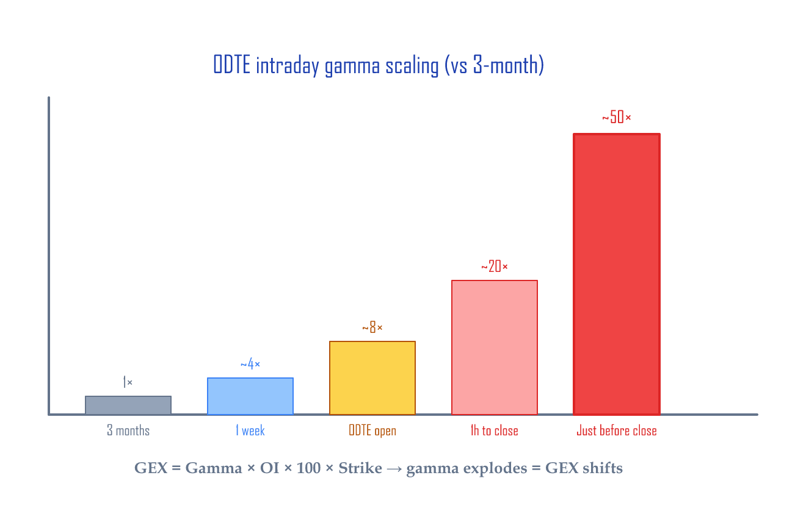
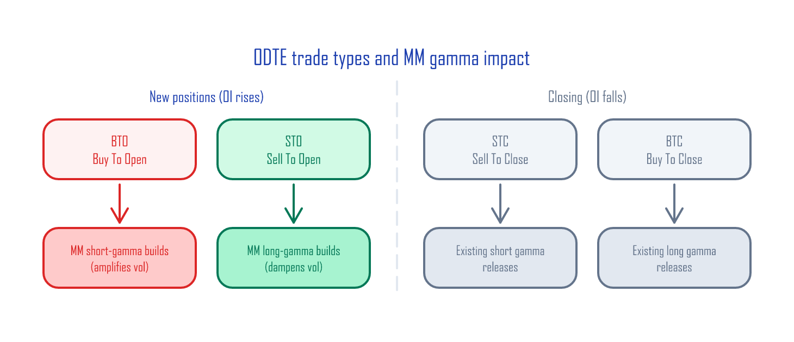
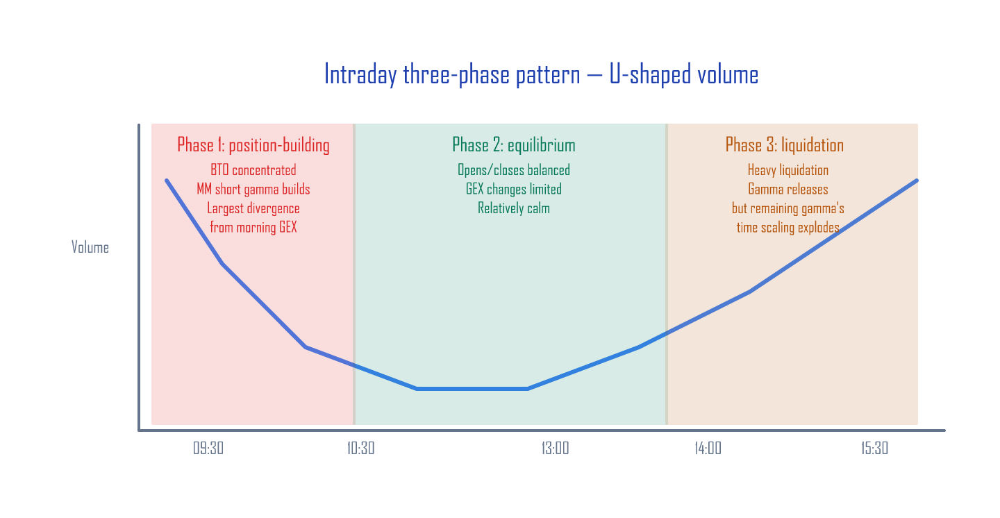

# 0DTE Gamma Patterns — How GEX shifts intraday

> **Google Sheets:** [GammaExposureAndMaxPain](https://docs.google.com/spreadsheets/d/1ZrnHpTddR4hwF3_QY6U5MxpjSzLiqG3n5aZkJ8GskTU/copy) → `0DTE Strategy Patterns` tab (template you fill in by hand)

---

The tool we built in [Calculating GEX Yourself](./gex-calculator.md) is a **snapshot at the prior day's close**. If your morning GEX reads −$22.4B, does it stay −$22.4B all day?

**43–62% of SPX options are 0DTE** (same-day expiry) (Cboe, 2023–2025). Once the market opens, 0DTE options get opened and closed in massive volume. Each of those trades changes the market makers' (MMs') gamma position in real time. Just like a body temperature you measure in the morning can be different in the afternoon, the GEX (gamma exposure — the total gamma weighing on the market) you measure at the open keeps shifting through the day. Looking at only the morning GEX leaves you blind to what's actually causing intraday violence.

This article walks through the **intraday patterns** of 0DTE flow and gives you a checklist for applying intraday corrections to the morning GEX.

---

## Why 0DTE dominates GEX

Gamma grows as expiration approaches. Picture a rubber band: the shorter you hold it, the harder it snaps back for the same pull. Intuition: when time-to-expiration halves, gamma grows by ~1.4×; when it shrinks 10×, gamma grows ~3× (mathematically, gamma scales with 1/√T):

| Time to expiration | ATM gamma (vs 3-month baseline) | Reason |
|:-------------------|:-------------------------------:|:-------|
| 3 months (63 days) | 1× | Baseline |
| 1 week (5 days) | ~4× | √(63/5) ≈ 3.5 |
| 1 day | ~8× | √(63/1) ≈ 7.9 |
| **0DTE at the open (~6.5h left)** | **~8×** | √(63/~1) |
| **0DTE midday (~4h left)** | **~10×** | √(63/0.6) |
| **0DTE 1 hour to close** | **~20×** | √(63/0.15) |
| **Just before close (~10 min)** | **~50×** | √(63/0.03) |

GEX = Gamma × OI × 100 × Strike, so **a small move in 0DTE OI shakes the entire GEX number**. That's why "morning GEX ≠ midday GEX."



---

## The structure of the 0DTE market — Cboe's official data

Cboe's analysis of Open-Close data on 0DTE flow shows the following:

| Stat | Value | Source |
|:-----|:------|:-------|
| 0DTE share of SPX volume | 43% (2023) → 62% (2025-08) | Cboe |
| Retail share | ~50–60% | "0DTEs Decoded" (May 2025) |
| Use of risk-defined strategies | ~95% | "0DTEs Decoded" |
| Single-leg share | ~45–50% | "Evolution of Same Day Options Trading" |
| Spread share (verticals etc.) | ~50–55% | "Evolution of Same Day Options Trading" |
| Buy/sell balance | "remarkably balanced" | "0DTEs Decoded" |

Takeaways: 0DTE volume is **dominated by retail**, traded mostly through **risk-defined strategies**, with the **buy/sell balance roughly even**. But the balance shifts **by time of day**, and that's the source of intraday GEX changes.

---

## The 4 types of 0DTE trades

Every option trade falls into one of four categories based on its effect on open interest:

| Trade type | Meaning | OI effect | MM gamma effect |
|:-----------|:--------|:----------|:----------------|
| **BTO** (Buy To Open) | New buy | OI **increases** | MM sells → **adds short gamma** |
| **STO** (Sell To Open) | New short | OI **increases** | MM buys → **adds long gamma** |
| STC (Sell To Close) | Closing a long | OI decreases | Releases existing short gamma |
| BTC (Buy To Close) | Closing a short | OI decreases | Releases existing long gamma |

**The key: heavy BTO accumulates MM short gamma (positions that force MMs to trade *with* the move — amplifying it); heavy STO accumulates long gamma (positions that dampen moves). STC/BTC just close out existing positions, releasing the gamma that was there.**



How this ratio shifts intraday is the key to GEX corrections.

---

## The three intraday phases

0DTE volume follows the market's well-known **U-shaped volume pattern** (heavy at the open and close, quiet in the middle), with 0DTE-specific BTO/STO ratio shifts layered on top.



### Phase 1: Position-building (09:30–10:00)

- Volume is at its **daily peak** (left side of the U)
- New buying (BTO) clusters in response to the overnight gap
- MMs absorb the other side and **rapidly accumulate short gamma**
- **The biggest divergence from morning GEX happens in this window**

### Phase 2: Equilibrium (10:30–13:00)

- Volume drops (the bottom of the U)
- Some morning positions close out (STC) on profit-taking
- Opens and closes balance → **GEX changes are limited**

### Phase 3: Liquidation (14:00–15:30)

- Volume rises again (right side of the U)
- As 0DTE expiry approaches, traders **close en masse** (BTC and STC spike)
- Closing positions releases existing gamma

!!! warning "The end-of-day paradox"
    A single person clapping in an empty theater is louder than you'd think — and the same goes for end-of-day gamma. As positions close (OI shrinks), the gamma of the few that remain becomes enormous. For example: 100 contracts × 0.05 gamma = 5, but right before the close, 20 contracts × 0.50 gamma = 10. The contract count is smaller, yet the total gamma effect is *larger*. This shows up especially when **a small number of contracts cluster near the ATM** — gamma per contract spikes so much that OI × Gamma doesn't necessarily shrink. Deep-OTM positions have near-zero gamma, so this effect concentrates around ATM positioning.

---

## Morning GEX + intraday correction: the checklist

### Before the open (read the morning GEX)

- [ ] Use [Calculating GEX Yourself](./gex-calculator.md) and check Total GEX sign
- [ ] Note where spot sits relative to the flip point
- [ ] Note Max Pain

### First 30 minutes (09:30–10:00)

- [ ] Is 0DTE volume above normal? (intensity of position-building)
- [ ] Is the buying concentrated on calls or puts?
- [ ] If morning GEX is already short gamma → expect amplified volatility

### Midday (10:00–14:00)

- [ ] If volume drops and stabilizes → GEX changes are limited
- [ ] If volume *doesn't* drop → unusual, pay attention

### Final hours (14:00–16:00)

- [ ] Heavy closing flow → existing gamma releases
- [ ] But gamma scaling (time decay) amplifies the impact of remaining positions
- [ ] **This is the danger zone for relying on morning GEX alone**

### Warning signals

| Signal | What it means | Response |
|:-------|:--------------|:---------|
| Morning short gamma + 09:30 volume spike | Short gamma deepening | Expect amplified volatility |
| Heavy liquidation after 15:00 | Gamma releasing | Possibly stabilization after a sharp move |
| Morning long gamma + quiet midday | Long gamma persists | Volatility dampened, calm |
| Volume spikes from the U-bottom | Unexpected event | Possible structural shift, watch out |

---

## How to actually observe this

Tracking BTO/STO intraday requires distinguishing buys from sells, and that **isn't precisely possible from public data**. Cboe's Open-Close data (paid) is the only official source.

But there are free **approximations** you can use:

### Method 1: Watching your broker's option chain (manual)

Most brokers (TOS, IBKR, etc.) show option-chain volume in real time.

1. Take volume snapshots near 0DTE ATM strikes every 30 minutes.
2. Infer direction from Time & Sales:
   - Trades printed at or above the ask = buy-driven (likely BTO)
   - Trades printed at or below the bid = sell-driven (likely STO)
   - Caveat: this is an approximation — a trade printed above the ask could still be STC (closing an existing long), and you can't perfectly separate BTO from STC.
3. OI changes show up the next day (OI doesn't update intraday).

The `0DTE Strategy Patterns` tab in the Google Sheet is the template — log your observations and build up the pattern over time.

### Method 2: Python volume snapshots

Pull the Cboe CSV multiple times during the session and track volume changes manually. (Cboe delayed quotes are 15-min delayed, and automatic scraping violates Cboe's terms of service.)

<details><summary>Python: 0DTE volume snapshot code</summary>

```python
import pandas as pd
from datetime import datetime

def snapshot_volume(filepath, timestamp):
    """Snapshot 0DTE ATM-area volume from a Cboe CSV."""
    df = pd.read_csv(filepath, skiprows=3)
    df.columns = [
        'expiry', 'call_symbol', 'call_last', 'call_net', 'call_bid', 'call_ask',
        'call_volume', 'call_iv', 'call_delta', 'call_gamma', 'call_oi',
        'strike',
        'put_symbol', 'put_last', 'put_net', 'put_bid', 'put_ask',
        'put_volume', 'put_iv', 'put_delta', 'put_gamma', 'put_oi'
    ]
    for col in ['strike', 'call_volume', 'put_volume']:
        df[col] = pd.to_numeric(df[col], errors='coerce')

    # Filter to today's expiration only (0DTE)
    # Cboe format: "Fri Jun 13 2025" — match on month/day/year
    today = datetime.now().strftime('%b %d %Y')  # e.g., "Jun 13 2025"
    dte0 = df[df['expiry'].astype(str).str.contains(today, na=False)]

    summary = dte0.agg({
        'call_volume': 'sum',
        'put_volume': 'sum'
    })
    summary['timestamp'] = timestamp
    summary['total'] = summary['call_volume'] + summary['put_volume']
    summary['put_call_ratio'] = summary['put_volume'] / max(summary['call_volume'], 1)
    return summary


# Run every 30 minutes
snap = snapshot_volume('spx_options_1000.csv', '10:00')
print(snap)
```

</details>

This script captures **total volume and Put/Call Ratio** only. It can't separate BTO from STO, but it does tell you "is the surge in calls or in puts?" Compare snapshots across multiple time points and you can estimate the speed and direction of volume buildup.

---

## Summary

| | Morning GEX alone | Morning + intraday pattern |
|:-|:------------------|:---------------------------|
| **Information** | Snapshot at prior close | Direction of intraday changes |
| **Blind spot** | Entire trading day | None |
| **Sudden moves before close** | "Why?" | "0DTE gamma structure + time scaling" |
| **Decision basis** | Total GEX sign only | Sign + intraday flow direction |

### The takeaways

1. **Morning GEX is a starting point, not an answer.**
2. **The first 30 minutes' volume and direction** is the strongest signal of how gamma will shift through the day.
3. **The last 30 minutes** see OI fall while gamma per contract explodes. Read the *structure*, not just the raw numbers.
4. Combine the two: **morning snapshot + intraday observation = a much better estimate**.

These tools aren't for short-term trading. They're for the long-term investor who watches a sudden intraday move and wants a structural answer to the "why?" — knowing the cause keeps you from selling into fear.

---

## References

- [Calculating GEX Yourself — Google Sheets + Python](./gex-calculator.md)
- [Cboe SPX Options — Delayed Quotes](https://www.cboe.com/delayed_quotes/spx/quote_table)
- [Cboe "0DTEs Decoded" (May 2025)](https://www.cboe.com/insights/posts/0-dt-es-decoded-positioning-trends-and-market-impact/)
- [Cboe "The Evolution of Same Day Options Trading"](https://www.cboe.com/insights/posts/the-evolution-of-same-day-options-trading/)
- [SqueezeMetrics GEX whitepaper (PDF)](https://squeezemetrics.com/monitor/docs)

*Cboe, SPX, and VIX are registered trademarks of Cboe Exchange, Inc. This article has no affiliation with or endorsement from Cboe.*

---

*Previous: [Calculating GEX Yourself — Google Sheets + Python](gex-calculator.md) | Next: [Volatility Dashboard — Tracking Correlation + Skew](volatility-dashboard.md)*
