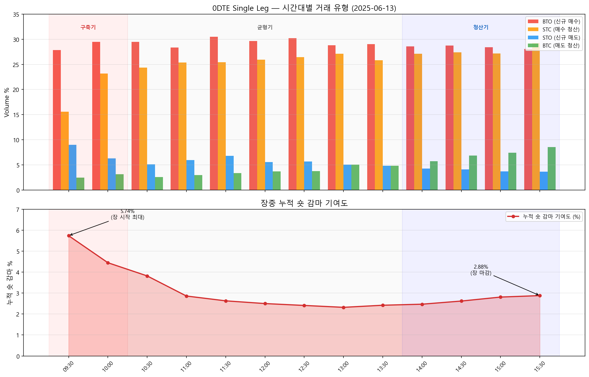

# 0DTE 감마 패턴 — 장중 GEX는 어떻게 변하는가

> **구글 시트:** [GammaExposureAndMaxPain](https://docs.google.com/spreadsheets/d/1ZrnHpTddR4hwF3_QY6U5MxpjSzLiqG3n5aZkJ8GskTU/copy) → `0DTE Strategy Patterns` 탭

---

[GEX 직접 계산하기](./gex-calculator.md)에서 만든 도구는 **전일 장 마감 기준 스냅샷**입니다. 아침에 계산한 GEX가 -$22.4B이라고 해서 장중에도 그대로일까요?

SPX 옵션의 **43~62%가 0DTE(당일 만기)**입니다. 장이 열리면 0DTE 옵션이 대량으로 개설되고 소멸됩니다. 이 거래가 MM의 감마 포지션을 실시간으로 바꿉니다. 아침 GEX만 보면 장중 급변동의 원인을 설명할 수 없습니다.

이 글에서는 0DTE 거래의 **시간대별 패턴**을 분석하고, 아침 GEX에 장중 보정을 적용하는 체크리스트를 만듭니다.

---

## 왜 0DTE가 GEX를 지배하는가

감마는 만기까지 남은 시간이 짧을수록 커집니다. 직관적으로 만기가 절반으로 줄면 감마는 약 1.4배, 1/10로 줄면 약 3배로 커진다고 기억하세요 (수학적으로 1/sqrt(T)에 비례):

| 잔존 만기 | ATM 감마 (3개월 대비) | 근거 |
|:---------|:--------------------:|:-----|
| 3개월 (63일) | 1x | 기준 |
| 1주일 (5일) | ~4x | sqrt(63/5) = 3.5 |
| 1일 | ~8x | sqrt(63/1) = 7.9 |
| **0DTE 장 시작 (6.5h 남음)** | **~8x** | sqrt(63/~1) |
| **0DTE 장 중반 (4h 남음)** | **~10x** | sqrt(63/0.6) |
| **0DTE 장 마감 1h 전** | **~20x** | sqrt(63/0.15) |
| **장 마감 직전 (10min)** | **~50x** | sqrt(63/0.03) |

GEX = Gamma x OI x 100 x Strike이므로, 0DTE 옵션의 OI가 **조금만 변해도 GEX 전체가 크게 흔들립니다.** 이것이 "아침 GEX ≠ 장중 GEX"인 이유입니다.

---

## 0DTE 거래 4가지 유형

옵션 거래는 OI(미결제약정)에 미치는 영향에 따라 4가지로 나뉩니다.

| 거래 유형 | 뜻 | OI 영향 | MM 감마 영향 |
|:---------|:---|:--------|:-----------|
| **BTO** (Buy To Open) | 신규 매수 | OI **증가** | MM 매도 → **숏 감마 추가** |
| **STO** (Sell To Open) | 신규 매도 | OI **증가** | MM 매수 → **롱 감마 추가** |
| STC (Sell To Close) | 매수 청산 | OI 감소 | 기존 숏 감마 **해제** |
| BTC (Buy To Close) | 매도 청산 | OI 감소 | 기존 롱 감마 **해제** |

**핵심: BTO가 많으면 MM 숏 감마가 누적되고, STO가 많으면 롱 감마가 누적됩니다.** STC/BTC는 기존 포지션을 닫으므로 감마를 해제합니다.

이 비율이 장중에 어떻게 변하는지가 GEX 보정의 열쇠입니다.

---

## 시간대별 0DTE 거래 패턴

구글 시트의 `0DTE Strategy Patterns` 탭에서 30분 단위로 추적합니다.

### 실제 데이터 (SPX 0DTE, 2025-06-13)

**Single Leg 거래 비중 변화:**

| 시간 | BTO | STC | STO | BTC | 거래량 |
|:-----|----:|----:|----:|----:|------:|
| **09:30** | **27.9%** | 15.6% | 9.0% | 2.5% | 122,000 |
| 10:00 | 29.5% | 23.2% | 6.3% | 3.2% | 95,000 |
| 11:00 | 28.4% | 25.4% | 6.0% | 3.0% | 67,000 |
| 12:00 | 29.6% | 25.9% | 5.6% | 3.7% | 54,000 |
| 14:00 | 28.6% | 27.1% | 4.3% | **5.7%** | 70,000 |
| **15:30** | 28.1% | **29.3%** | 3.7% | **8.5%** | 82,000 |

(전체 30분 단위 데이터는 구글 시트 `0DTE Strategy Patterns` 탭에서 확인할 수 있습니다.)

**장중 감마 기여도:** (각 %는 해당 30분 동안 개설/청산된 포지션이 전체 거래량에서 차지하는 순 감마 방향 기여입니다. 음수는 청산이 신규 개설을 초과한 것을 의미합니다.)

| 시간 | 숏 감마 순변동 | 롱 감마 순변동 | 순 기여 | 누적 숏 감마 |
|:-----|----------:|----------:|-------:|----------:|
| **09:30** | 12.3% | 6.6% | **+5.7%** | **5.74%** |
| 10:00 | 6.3% | 3.2% | +3.2% | 4.45% |
| 11:00 | 3.0% | 3.0% | 0.0% | 2.86% |
| 12:00 | 3.7% | 1.9% | +1.9% | 2.50% |
| 14:00 | 1.4% | -1.4% | +2.9% | 2.47% |
| **15:30** | **-1.2%** | -4.9% | +3.7% | **2.88%** |

---

## 3단계 패턴: 구축 → 균형 → 청산



이 데이터에서 뚜렷한 3단계 패턴이 관찰됩니다. 일반적인 U자형 거래량 패턴(장 시작·마감에 거래 집중)과 일치하지만, BTO/STO 비율 변화는 이 데이터 고유의 관찰입니다.

### 1단계: 포지션 구축기 (09:30~10:00)

```
BTO 28% >> STC 16%  →  신규 매수가 청산을 압도
거래량 최대 (122,000)
누적 숏 감마 기여: 5.74% (하루 중 최고)
```

- 오버나이트 갭에 대응하는 0DTE 매수가 집중됨
- MM이 이 매수의 상대편을 받으면서 **숏 감마 빠르게 누적**
- **이 시간대에 아침 GEX 대비 가장 큰 괴리 발생**

### 2단계: 균형기 (10:30~13:00)

```
BTO ≈ STC (28% vs 25~27%)  →  개설과 청산이 균형
거래량 감소 (54,000~78,000)
순 감마 기여: 0~3% (점차 감소)
```

- 아침에 열린 포지션 중 일부가 수익 실현(STC)으로 닫힘
- 신규 개설은 계속되지만 청산과 상쇄
- **GEX가 아침 수준으로 안정화**

### 3단계: 청산기 (14:00~15:30)

```
BTC 급증: 2.5% → 8.5%  →  기존 매도 포지션 대량 청산
STC > BTO (29.3% vs 28.1%)  →  매수 포지션도 청산 우세
15:30 신규 숏 감마 기여: 음수(-1.2%)  →  포지션이 닫히고 있음
```

- 0DTE 만기가 다가오면서 투자자들이 대거 청산
- BTC 급증 = 기존에 매도(STO)했던 투자자가 포지션을 닫음
- **하지만** 남은 0DTE의 감마가 시간 감쇠로 **폭증** → 적은 OI로도 큰 감마

!!! warning "장 마감 전 역설"
    포지션은 닫히는데(OI 감소), 남은 포지션의 감마는 극대화됩니다. 특히 **ATM 근처에 남아있는 소수의 계약**은 계약당 감마가 폭증하여, OI x Gamma의 곱이 줄어들지 않을 수 있습니다. 깊은 OTM 포지션은 감마가 거의 0이므로 이 효과는 ATM 근처에 OI가 집중된 경우에 강하게 나타납니다.

---

## 아침 GEX + 장중 보정: 실전 프레임워크

### 체크리스트

**장 시작 전 (아침 GEX 확인):**

- [ ] [GEX 직접 계산하기](./gex-calculator.md)로 Total GEX 부호 확인
- [ ] 플립 포인트 대비 현재가 위치 확인
- [ ] Max Pain 확인

**장 시작 30분 (09:30~10:00):**

- [ ] 0DTE BTO 비율이 평소(~28%)보다 높은가?
- [ ] BTO 집중 = 아침 GEX보다 **더 숏 감마** 방향으로 이동 중
- [ ] 특히 아침 GEX가 이미 숏 감마면 → 변동성 확대 경고

**장중 (10:00~14:00):**

- [ ] BTO와 STC가 균형을 이루면 GEX 변화 제한적
- [ ] BTO가 지속적으로 STC를 초과하면 숏 감마 계속 누적

**장 마감 전 (14:00~16:00):**

- [ ] BTC 급증 = 포지션 청산 → 감마 해제
- [ ] 하지만 감마 스케일링(시간 감쇠)으로 잔여 포지션의 영향 증폭
- [ ] **이 시간대에 아침 GEX만 보고 판단하면 오판 위험**

### 경고 신호 정리

| 신호 | 의미 | 대응 |
|:-----|:-----|:-----|
| 아침 숏 감마 + 09:30 BTO 급증 | 숏 감마 심화 | 변동성 확대 대비 |
| 누적 숏 감마 > 5% | 아침 GEX 대비 크게 악화 | 포지션 축소 고려 |
| 15:00 이후 BTC 급증 | 대량 청산 → 감마 해제 | 급변동 후 안정화 가능 |
| 아침 롱 감마 + STO 우세 | 롱 감마 강화 | 변동성 억제, 안정적 |

---

## 직접 기록하는 법

`0DTE Strategy Patterns` 탭은 자동으로 채워지지 않습니다. 장중에 데이터를 수집하는 방법:

### 방법 1: 브로커 옵션 체인 관찰 (수동)

대부분의 브로커(TOS, IBKR 등)에서 옵션 체인의 Volume과 OI를 실시간으로 볼 수 있습니다.

1. 30분 간격으로 0DTE ATM 부근 행사가의 **Volume** 스냅샷 기록
2. Volume 증가분 중 BTO/STO 비율은 체결 데이터(Time & Sales)에서 추정:
   - Ask 이상 체결 = 매수 주도 (BTO 가능성 높음)
   - Bid 이하 체결 = 매도 주도 (STO 가능성 높음)
   - 주의: 이 방법은 근사치입니다 — Ask 이상 체결이라도 STC(기존 롱 청산)일 수 있어 BTO와 정확히 구분할 수 없습니다
3. OI 변화는 다음 날 확인 (장중에는 갱신되지 않음)

### 방법 2: Python 자동 수집

CBOE CSV를 장중에 수동으로 여러 번 받아서 Volume 변화를 추적합니다. (CBOE delayed quotes는 15분 지연이며, 자동 스크래핑은 이용약관상 금지됩니다.)

```python
import pandas as pd
from datetime import datetime

def snapshot_volume(filepath, timestamp):
    """CBOE CSV에서 0DTE ATM 근처 Volume 스냅샷."""
    df = pd.read_csv(filepath, skiprows=3)
    df.columns = [
        'expiry', 'call_symbol', 'call_last', 'call_net', 'call_bid', 'call_ask',
        'call_volume', 'call_iv', 'call_delta', 'call_gamma', 'call_oi',
        'strike',
        'put_symbol', 'put_last', 'put_net', 'put_bid', 'put_ask',
        'put_volume', 'put_iv', 'put_delta', 'put_gamma', 'put_oi'
    ]
    for col in ['strike', 'call_volume', 'put_volume']:
        df[col] = pd.to_numeric(df[col], errors='coerce')

    # 오늘 만기만 필터 (0DTE)
    # CBOE 형식: "Fri Jun 13 2025" — 요일 제외하고 월/일/년으로 매칭
    today = datetime.now().strftime('%b %d %Y')  # e.g., "Jun 13 2025"
    dte0 = df[df['expiry'].astype(str).str.contains(today, na=False)]

    summary = dte0.agg({
        'call_volume': 'sum',
        'put_volume': 'sum'
    })
    summary['timestamp'] = timestamp
    summary['total'] = summary['call_volume'] + summary['put_volume']
    summary['put_call_ratio'] = summary['put_volume'] / max(summary['call_volume'], 1)
    return summary


# 30분 간격으로 실행
snap = snapshot_volume('spx_options_1000.csv', '10:00')
print(snap)
```

장 시작, 30분 후, 장 마감 전 등 주요 시점에 스냅샷을 찍고 Volume 증가분을 비교하면, 콜/풋 방향성은 파악할 수 있습니다. 다만 이 코드는 총 Volume만 캡처하며, BTO/STO 구분에는 별도의 체결 데이터(Time & Sales)가 필요합니다.

---

## Python 시각화: 패턴 차트

```python
import matplotlib.pyplot as plt
import numpy as np

times = ['09:30', '10:00', '10:30', '11:00', '11:30',
         '12:00', '12:30', '13:00', '13:30', '14:00',
         '14:30', '15:00', '15:30']

bto = [27.87, 29.47, 29.49, 28.36, 30.51,
       29.63, 30.19, 28.81, 29.03, 28.57,
       28.77, 28.40, 28.05]
stc = [15.57, 23.16, 24.36, 25.37, 25.42,
       25.93, 26.42, 27.12, 25.81, 27.14,
       27.40, 27.16, 29.27]
sto = [9.02, 6.32, 5.13, 5.97, 6.78,
       5.56, 5.66, 5.08, 4.84, 4.29,
       4.11, 3.70, 3.66]
btc = [2.46, 3.16, 2.56, 2.99, 3.39,
       3.70, 3.77, 5.08, 4.84, 5.71,
       6.85, 7.41, 8.54]
neg_gamma = [5.74, 4.45, 3.82, 2.86, 2.63,
             2.50, 2.41, 2.32, 2.42, 2.47,
             2.62, 2.81, 2.88]

fig, (ax1, ax2) = plt.subplots(2, 1, figsize=(14, 10), sharex=True)

# 상단: 거래 유형별 비중
x = np.arange(len(times))
w = 0.2
ax1.bar(x - 1.5*w, bto, w, label='BTO (New Long)', color='#F44336')
ax1.bar(x - 0.5*w, stc, w, label='STC (Close Long)', color='#FF9800')
ax1.bar(x + 0.5*w, sto, w, label='STO (New Short)', color='#2196F3')
ax1.bar(x + 1.5*w, btc, w, label='BTC (Close Short)', color='#4CAF50')
ax1.set_ylabel('Volume %')
ax1.set_title('0DTE Single Leg — Intraday Strategy Breakdown')
ax1.legend(loc='upper right')
ax1.grid(axis='y', alpha=0.3)

# 하단: 누적 숏 감마
ax2.fill_between(x, neg_gamma, alpha=0.3, color='#F44336')
ax2.plot(x, neg_gamma, 'o-', color='#F44336', lw=2,
         label='Cumulative Short Gamma %')
ax2.axhline(y=0, color='gray', lw=0.5)
ax2.set_ylabel('Cumulative Short Gamma %')
ax2.set_title('Intraday Cumulative Short Gamma Contribution')
ax2.set_xticks(x)
ax2.set_xticklabels(times, rotation=45)
ax2.legend()
ax2.grid(axis='y', alpha=0.3)

# 3단계 구간 표시
for ax in [ax1, ax2]:
    ax.axvspan(-0.5, 1.5, alpha=0.08, color='red', label='_')    # 구축기
    ax.axvspan(1.5, 8.5, alpha=0.08, color='gray', label='_')    # 균형기
    ax.axvspan(8.5, 12.5, alpha=0.08, color='blue', label='_')   # 청산기

plt.tight_layout()
plt.savefig('0dte_patterns.png', dpi=150, bbox_inches='tight')
plt.show()
```

---

## 정리

| | 아침 GEX만 볼 때 | 0DTE 패턴까지 볼 때 |
|:--|:---------------|:----------------|
| **정보** | 전일 마감 스냅샷 | 장중 변화 방향 |
| **빈 구간** | 장중 전체 | 없음 |
| **장 마감 전 급변동** | "왜?" | "09:30 BTO 급증 → 숏 감마 누적 → 감마 스케일링" |
| **판단 근거** | Total GEX 부호만 | 부호 + 장중 이동 방향 + 속도 |

### 핵심

1. **아침 GEX는 출발점**이지 정답이 아닙니다.
2. **09:30~10:00 BTO 비율**이 당일 감마 방향의 가장 강한 신호입니다.
3. **장 마감 전 30분**은 OI가 줄어도 감마가 폭증합니다. 숫자가 아닌 구조를 보세요.
4. 두 도구를 결합하면: **아침 스냅샷 + 장중 방향 = 더 나은 추정**

---

## 참고

- [GEX 직접 계산하기 — Google Sheets + Python](./gex-calculator.md)
- [CBOE SPX Options — Delayed Quotes](https://www.cboe.com/delayed_quotes/spx/quote_table)
- [SqueezeMetrics GEX 백서 (PDF)](https://squeezemetrics.com/monitor/docs)

*Cboe, SPX, VIX는 Cboe Exchange, Inc.의 등록 상표입니다. 이 글은 Cboe와 제휴 또는 보증 관계가 없습니다.*
