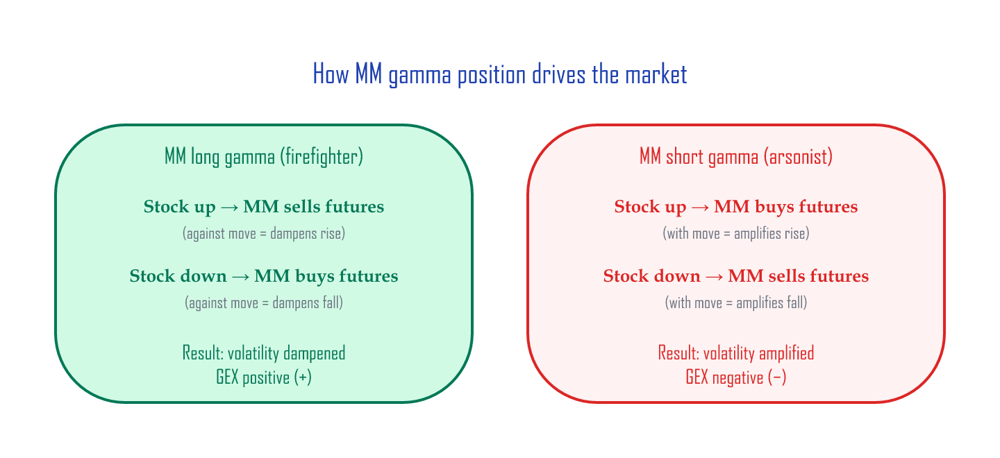
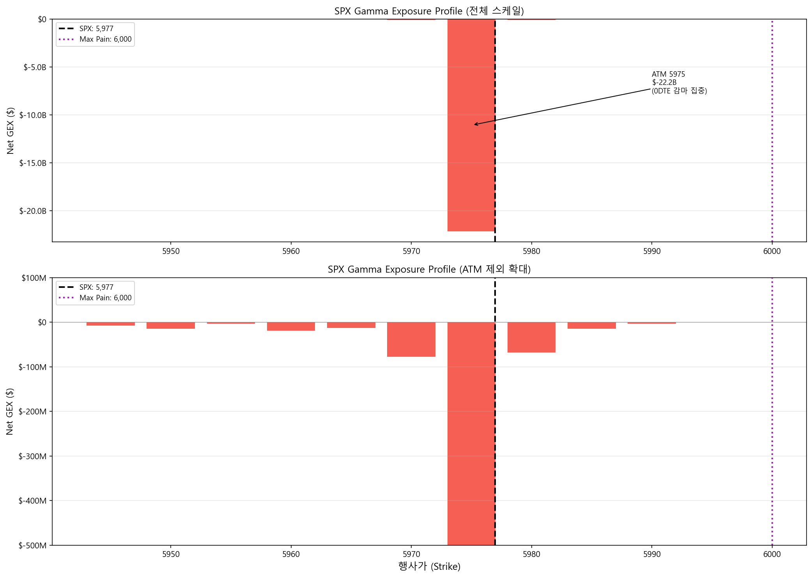
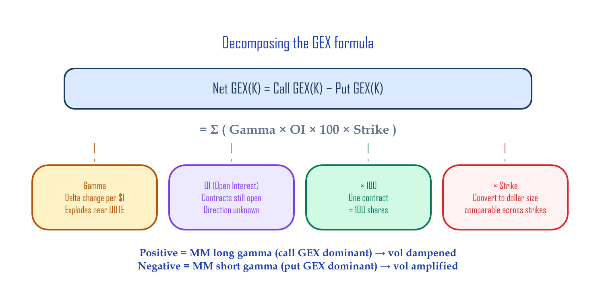
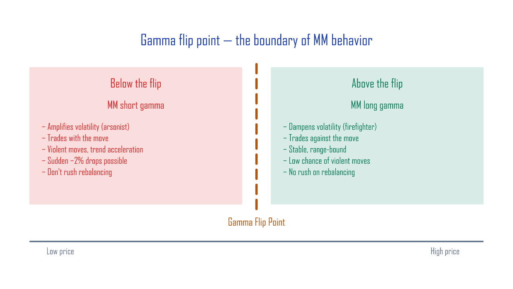

# Calculating GEX Yourself — Google Sheets + Python

> **Copy the Google Sheets template:** [GammaExposureAndMaxPain](https://docs.google.com/spreadsheets/d/1ZrnHpTddR4hwF3_QY6U5MxpjSzLiqG3n5aZkJ8GskTU/copy)

This article walks through a Google Sheets tool that takes Cboe's free option chain data and computes the **GEX profile, the gamma flip point, and Max Pain** automatically. We'll build it step by step so you understand what each number means, and the finished sheet is ready to use day-to-day — just refresh the data.

What you'll need:

- A Google account (to copy the sheet)
- (Optional) Python 3 with pandas and matplotlib

---

## 30-second preview: what the finished tool gives you

Once you copy the sheet and load data, you'll see something like this (every term below is explained later — for now just glance at the shape of the output):

| Metric | Example | What it means |
|:-------|:--------|:--------------|
| **Total GEX** | −$22.4B | MMs are short gamma — volatility-amplification mode |
| **Max Pain** | 6,000 | The "magnet" price that pins the index at expiration |
| **MM hedge size** | $22.4B per 1% | How much MMs must buy/sell on a 1% index move |
| **Put/Call Ratio** | 1.17 | More put volume than call volume |
| **Top GEX strike** | 5,975 (−$22.2B) | The strike where gamma is most concentrated |

We'll build up to that result step by step.

---

## Core concept: GEX in three minutes

### Market makers (MMs) and gamma

In the options market, MMs sit between buyers and sellers as the perpetual counterparty. They don't bet on direction — they hedge their directional exposure (delta — how much the option price moves for a $1 move in the stock) using the underlying (SPX futures, etc.).

**Gamma** is how much delta moves when the stock moves $1 — it's the *acceleration* of the option's sensitivity. When MMs hold gamma, every move in the underlying changes their hedge size, so they have to keep rebalancing. If the stock rises and the MM has to **buy** more futures, that buying *amplifies* the move. If they have to **sell**, it brakes the move:

- **MM long gamma**: stock rises → MM sells futures (against the move) → volatility **dampened** (firefighter)
- **MM short gamma**: stock rises → MM buys futures (with the move) → volatility **amplified** (arsonist)

### The two assumptions behind the GEX formula

GEX calculation rests on two assumptions:

1. **Call open interest (OI = contracts still open)** = institutions selling calls against shares (covered calls — the dominant SPX/NDX flow), MMs buy → **MM long gamma (+)**
2. **Put OI** = investors buying puts (insurance), MMs sell → **MM short gamma (−)**

So: **Net GEX = Call GEX(+) − Put GEX(−)**. Call GEX dampens for the MM (+), put GEX amplifies (−), so we subtract the two for the net effect.

Positive = MM is the firefighter. Negative = MM is the arsonist.



!!! warning "SPX/NDX only"
    These assumptions are valid only for large index options. On single names (TSLA, NVDA, etc.), retail buys calls aggressively, which flips assumption #1. Use this tool only for **SPX, NDX, RUT**.

---

## Step 1: Copy the Google Sheet

1. Click [this link](https://docs.google.com/spreadsheets/d/1ZrnHpTddR4hwF3_QY6U5MxpjSzLiqG3n5aZkJ8GskTU/copy) → "Make a copy"
2. The copied sheet has **7 tabs**:

| Tab | Role | What you do |
|:----|:-----|:------------|
| **How to import** | CBOE download guide (with screenshots) | Read only |
| **OptionChain Import** | Where you paste the CBOE CSV | **Import data here** |
| **GammaExposure Calc** | GEX is computed automatically | Just check the result |
| **GammaExposure Graph** | Settings + summary dashboard + **Gamma Flip** | Just check the result |
| **MaxPain Calc** | Max Pain computed automatically | Just check the result |
| **Gamma Profile Summary** | Final summary (top strikes, OI distribution) | **Read results here** |
| **0DTE Strategy Patterns** | Intraday 0DTE (same-day expiry) gamma patterns | See the [next article](./gex-0dte-patterns.md) |

---

## Step 2: Download the option chain from CBOE

1. Open the [CBOE SPX option chain](https://www.cboe.com/delayed_quotes/spx/quote_table) page
2. Change **Options Range** from `Near The Money` to **`All`**
3. Change **Expiration** to **`All`** (so every expiry is included)
4. Click **View Chain** → wait for the chain to load (a few seconds to a few tens of seconds)
5. Click **Download CSV** at the bottom of the page → save it locally

!!! tip "When to pull the data"
    Pull it **after the close (16:00 Eastern or later)** to get a clean snapshot at that day's close. CBOE's free quotes are 15-minute delayed, so this isn't real-time data during the session.

---

## Step 3: Load data into the sheet

1. In the Google Sheet, click the **`OptionChain Import`** tab
2. Open **File → Import**
3. **Upload** → **Browse** → pick the CSV you just downloaded
4. Set Import location to **`Replace current sheet`**
5. Click **Import data**

When it finishes, the `OptionChain Import` tab will be filled with rows like this:

```
Expiration Date | Calls         | Last | ... | Gamma | OI    | Strike | Puts          | Last | ... | Gamma | OI
Fri Jun 13 2025 | SPXW250613C.. | 1.18 | ... | 0.128 | 769   | 5975   | SPXW250613P.. | 0.48 | ... | 0.128 | 4720
Fri Jun 20 2025 | SPXW250620C.. | 45.2 | ... | 0.008 | 1203  | 5975   | SPXW250620P.. | 38.5 | ... | 0.008 | 2841
...
```

Having **dozens of rows** at the same strike (5,975) with different expirations is normal — you want all of them.

---

## Step 4: Read the result — automatic GEX calculation

Once the data is loaded, the rest of the tabs compute automatically. Go to the **`Gamma Profile Summary`** tab.

### What the dashboard shows

**Total gamma state:**

```
Call GEX total:    $4,477,749,074   (MM long-gamma contribution)
Put GEX total:    $26,857,654,715   (MM short-gamma contribution)
Total GEX:       -$22,379,905,641   ← net short gamma
```

→ Total GEX is **negative** = MMs are net short gamma = arsonist mode.

**Hedge-size interpretation:**

```
"Market makers need to SELL $22.4Bn worth of index for each 1% move DOWN,
 and BUY $22.4Bn for each 1% move UP."
```

→ For every 1% the index moves, MMs need to put **$22.4B of trades** through the market. That trading *amplifies* the move further.

**Max Pain / Gamma Flip:**

```
Max Pain     = 6,000
Gamma Flip   = none (entire range is short gamma)
```

→ Max Pain: the strike where total option-buyer intrinsic value is minimized at expiration — in plain English, the price at which option buyers collectively lose the most. When it's close to spot (5,976.97 here), there's a real chance of "pinning" — the index sticking to a specific strike at expiration.
→ Gamma Flip: in this dataset, Net GEX near the ATM is uniformly negative, so there's no flip point. That's typical when put OI is overwhelmingly dominant. On days where call OI is dominant in a region, you'll see an actual strike here.

**Top 5 strikes (by absolute Net GEX):**

| Strike | Net GEX | Interpretation |
|-------:|--------:|:---------------|
| 5,975 | −$22.2B | ATM — concentrated 0DTE gamma |
| 5,970 | −$77.4M | Short-gamma acceleration |
| 5,980 | −$67.7M | Short-gamma acceleration |
| 5,960 | −$19.3M | Downside pressure |
| 5,950 | −$14.5M | Potential downside support |

**OI distribution:**

| Top call OI | Top put OI |
|:------------|:-----------|
| 6,100 (12,787) | 6,000 (8,247) |
| 6,150 (11,673) | 5,975 (4,720) |
| 6,140 (9,143) | 5,960 (2,546) |

→ Call OI clusters **above** spot, put OI clusters **at and below** spot. Classic short-gamma structure.

**The GEX profile chart:** visualize the data above by strike and you get this profile.



Top: 0DTE gamma at the ATM (5,975) is so concentrated it produces a −$22.2B spike. Bottom: zoomed view excluding the ATM — the GEX distribution at surrounding strikes. Red = short gamma (volatility amplifier), blue = long gamma (volatility dampener).

---

## Under the hood: what the formulas actually do

Now that you've seen the result, let's understand what the sheet does internally.

### GEX calculation (`GammaExposure Calc` tab)

For each strike K, we sum across every expiration:

```
Call GEX(K) = Σ (Gamma_i × Call_OI_i × 100 × K)
Put GEX(K)  = Σ (Gamma_i × Put_OI_i × 100 × K)
Net GEX(K)  = Call GEX(K) − Put GEX(K)
```

| Term | Meaning |
|:-----|:--------|
| `Gamma_i` | Gamma at expiration i (very large for 0DTE, small for 30DTE) |
| `OI_i` | Open interest at expiration i |
| `× 100` | One option contract = 100 shares |
| `× K` | Convert gamma (delta change per $1) into a **dollar magnitude** at the strike level |



!!! note "Variations of the GEX formula"
    SpotGamma and similar services use `Gamma × OI × 100 × S² × 0.01` (S = spot) to directly produce "hedge dollars per 1% move." This sheet uses the `× K` variant, which is well-suited for comparing dollar-gamma across strikes. The absolute numbers differ, but the **shape of the profile and the location of the flip point are identical**.

Google Sheets formula (`GammaExposure Calc` tab, deduplicated-strike section):

```
Call GEX = SUMPRODUCT(
  (OptionChain!$K:$K = L2) *       ← strike match
  OptionChain!$J:$J *              ← Call Gamma
  OptionChain!$K2:$K2 *            ← Call OI
  100 * L2                         ← × 100 × strike
)
```

### Why GEX explodes at 5,975

Data at the 5,975 strike:

| Expiration | Gamma | Call OI | Put OI |
|:-----------|------:|--------:|-------:|
| **0DTE (Jun 13)** | **0.1281** | 769 | 4,720 |
| 1 week (Jun 20) | 0.0080 | 1,203 | 2,841 |
| 1 month (Jul 18) | 0.0025 | 587 | 1,156 |

Gamma rises sharply as expiration approaches — options near expiration are extremely sensitive to spot moves. The 0DTE gamma (0.1281) is **16× higher** than the 1-week (0.0080). Multiply by OI and the 0DTE expiration alone determines most of the strike's GEX.

### Gamma flip point

> **The price where, scanning down from the highest strike, cumulative Net GEX flips from positive to negative.**

This is the dividing line where MM behavior reverses:

| Spot relative to flip | MM state | Market behavior |
|:----------------------|:---------|:----------------|
| **Above** the flip point | Long gamma (firefighter) | Volatility dampened, calm |
| **Below** the flip point | Short gamma (arsonist) | Volatility amplified, prone to violent moves |



In the sheet, column AH on the `GammaExposure Calc` tab computes this cumulative sum automatically:

```
AH2 = MAP(L2:L258, LAMBDA(k, SUMPRODUCT((L$2:L$258>=k)*IF(ISNUMBER(V$2:V$258),V$2:V$258,0))))
```

For each strike, this computes "the sum of all Net GEX at or above this price." The point where the value flips from positive to negative is the flip point — and the `GammaExposure Graph` tab's **Gamma Flip** cell shows it automatically.

!!! note "What if there's no flip point?"
    If Total GEX is negative across the entire range, no flip point exists. MMs are short gamma at every price.

!!! note "A simplified approximation"
    This method holds the option chain's current gammas fixed and just sums cumulatively. The precise method would re-compute every option's gamma at each hypothetical spot using Black–Scholes (BSM) and then sum — but that's a lot more compute, and the answers usually differ only slightly.

### Max Pain (`MaxPain Calc` tab)

> **The expiration settlement price where total option-buyer intrinsic value is minimized** (= MM profit is maximized).

For each hypothetical settlement price S:

```
Call intrinsic(S) = Σ_K max(S − K, 0) × Call_OI(K) × 100
Put intrinsic(S)  = Σ_K max(K − S, 0) × Put_OI(K)  × 100
Total intrinsic(S) = Call intrinsic + Put intrinsic
```

**Max Pain = the S that minimizes total intrinsic** (the price where option buyers earn the least = MMs earn the most).

In the sheet, the `dollar value sum` column carries this number, and the row with the smallest value gives Max Pain.

---

## How to use it day to day

| When | What | Time |
|:-----|:-----|:-----|
| After the close | Download CSV from CBOE | 1 min |
| | Import into the sheet's `OptionChain Import` tab | 1 min |
| | Read the result on `Gamma Profile Summary` | — |
| Before the next session opens | Check Total GEX sign + flip point + Max Pain | 1 min |

**Three minutes a day gets you the GEX state for that session.**

The checklist:

- [ ] Total GEX sign: positive (calm) vs negative (unstable)
- [ ] Flip point: above or below current spot?
- [ ] Max Pain: how close is it to spot?
- [ ] Top 5 strikes: which prices likely act as support/resistance?

---

## Python version: automation

If you don't want to do this manually each day, automate it with Python. Feed in the CBOE CSV and get GEX, the flip point, and Max Pain in one pass.

<details><summary>Full Python code (GEX + Max Pain + chart)</summary>

```python
import pandas as pd
import numpy as np
import matplotlib.pyplot as plt
import matplotlib.ticker as mticker


def parse_cboe_csv(filepath):
    """Parse the CBOE SPX option chain CSV."""
    df = pd.read_csv(filepath, skiprows=3)
    df.columns = [
        'expiry', 'call_symbol', 'call_last', 'call_net', 'call_bid', 'call_ask',
        'call_volume', 'call_iv', 'call_delta', 'call_gamma', 'call_oi',
        'strike',
        'put_symbol', 'put_last', 'put_net', 'put_bid', 'put_ask',
        'put_volume', 'put_iv', 'put_delta', 'put_gamma', 'put_oi'
    ]
    for col in ['strike', 'call_gamma', 'put_gamma', 'call_oi', 'put_oi',
                'call_volume', 'put_volume']:
        df[col] = pd.to_numeric(df[col], errors='coerce')
    return df.dropna(subset=['strike'])


def calc_gex(df):
    """Compute GEX per strike (summed across all expirations)."""
    df['call_gex'] = df['call_gamma'] * df['call_oi'] * 100 * df['strike']
    df['put_gex'] = df['put_gamma'] * df['put_oi'] * 100 * df['strike']

    gex = df.groupby('strike').agg(
        call_gex=('call_gex', 'sum'),
        put_gex=('put_gex', 'sum'),
        call_oi=('call_oi', 'sum'),
        put_oi=('put_oi', 'sum'),
        call_volume=('call_volume', 'sum'),
        put_volume=('put_volume', 'sum'),
    ).reset_index()

    gex['net_gex'] = gex['call_gex'] - gex['put_gex']
    gex['total_gex'] = gex['call_gex'] + gex['put_gex']
    return gex


def find_gamma_flip(gex):
    """The strike where cumulative Net GEX (high → low) flips + → -."""
    g = gex.sort_values('strike', ascending=False).copy()
    g['cum'] = g['net_gex'].cumsum()
    sign_change = (g['cum'].shift(1) > 0) & (g['cum'] <= 0)
    if sign_change.any():
        return g.loc[sign_change.idxmax(), 'strike']
    return None


def calc_max_pain(gex):
    """The strike where total option intrinsic value is minimized."""
    strikes = gex['strike'].values
    call_oi = gex['call_oi'].values
    put_oi = gex['put_oi'].values

    pain = []
    for s in strikes:
        cp = np.sum(np.maximum(s - strikes, 0) * call_oi) * 100
        pp = np.sum(np.maximum(strikes - s, 0) * put_oi) * 100
        pain.append(cp + pp)
    gex['pain'] = pain
    return gex.loc[gex['pain'].idxmin(), 'strike']


def plot_gex(gex, spot, flip=None, max_pain=None):
    """Render the GEX profile chart."""
    margin = spot * 0.05
    g = gex[(gex['strike'] >= spot - margin) & (gex['strike'] <= spot + margin)]

    fig, ax = plt.subplots(figsize=(14, 7))
    colors = ['#2196F3' if v >= 0 else '#F44336' for v in g['net_gex']]
    ax.bar(g['strike'], g['net_gex'], width=3, color=colors, alpha=0.8)

    ax.axvline(spot, color='black', lw=2, ls='--', label=f'SPX: {spot:,.0f}')
    if flip:
        ax.axvline(flip, color='#FF9800', lw=2, label=f'Gamma Flip: {flip:,.0f}')
    if max_pain:
        ax.axvline(max_pain, color='#9C27B0', lw=2, ls=':', label=f'Max Pain: {max_pain:,.0f}')

    ax.set_xlabel('Strike')
    ax.set_ylabel('Net GEX ($)')
    ax.set_title('SPX Gamma Exposure Profile')
    ax.legend(fontsize=11)
    ax.yaxis.set_major_formatter(mticker.FuncFormatter(
        lambda x, _: f'${x/1e9:.1f}B' if abs(x) >= 1e9 else f'${x/1e6:.0f}M'))
    ax.axhline(0, color='gray', lw=0.5)
    ax.grid(axis='y', alpha=0.3)
    plt.tight_layout()
    plt.savefig('gex_profile.png', dpi=150, bbox_inches='tight')
    plt.show()


# === Run ===
df = parse_cboe_csv('spx_options.csv')  # path to CBOE CSV
gex = calc_gex(df)
spot = 5976.97

flip = find_gamma_flip(gex)
mp = calc_max_pain(gex)
total = gex['net_gex'].sum()

print(f"Total GEX:    ${total:,.0f}")
print(f"Gamma Flip:   {flip}")
print(f"Max Pain:     {mp}")
print(f"Put/Call Vol:  {gex['put_volume'].sum() / gex['call_volume'].sum():.2f}")

plot_gex(gex, spot, flip, mp)
```

</details>

---

## Limitations of this GEX calculation

Things you should know before relying on this tool:

1. **OI is yesterday's-close data** — it doesn't reflect intraday volume. → see the [next article: 0DTE Gamma Patterns](./gex-0dte-patterns.md) for an intraday correction approach.

2. **CBOE gamma is BSM-based** — it's the textbook theoretical gamma. Real MMs may use slightly different models.

3. **OI doesn't tell you the direction** — public data doesn't say who's the buyer and who's the seller. You're relying on the "calls = MM buys, puts = MM sells" assumption.

4. **0DTE dominates** — ATM 0DTE gamma is so large that GEX is dominated by a single expiration. As 0DTE OI shifts intraday, GEX shifts dramatically with it.

5. **It's not a trade signal** — GEX is a *directional indicator* about MM positioning. Don't make trading decisions on GEX alone.

---

## Wrap-up

What this tool gives you:

1. **Three minutes a day** — Total GEX sign, flip point, Max Pain, all read off the dashboard
2. **Support/resistance candidates** — strikes with large GEX = strikes where MM hedging is concentrated
3. **MM behavior estimate** — short gamma (amplification) vs long gamma (dampening)
4. **Context for fast moves** — a structural answer to "why did the index just snap?"

GEX is not a short-term trade signal. Its value to a long-term investor is **structurally understanding the market's violent moves and not getting shaken by fear**. When the index drops 2% out of nowhere, recognizing "that was 0DTE gamma hedging flow" lets you stick to your rebalancing plan instead of panic-selling.

---

## Next article

The GEX you compute in the morning is just the starting point. **What happens to GEX intraday when 0DTE options trade in size?** How do BTO/STO patterns push the MM gamma position around, and how do you apply intraday corrections to morning GEX?

→ [0DTE Gamma Patterns — How GEX shifts intraday](./gex-0dte-patterns.md)

---

## References

- [SqueezeMetrics GEX whitepaper (PDF)](https://squeezemetrics.com/monitor/docs)
- [Cboe SPX Options — Delayed Quotes](https://www.cboe.com/delayed_quotes/spx/quote_table)

*Cboe, SPX, and VIX are registered trademarks of Cboe Exchange, Inc. This article has no affiliation with or endorsement from Cboe.*

---

*Previous: [The Almanac Trader — Seasonality analysis](almanac.md) | Next: [0DTE Gamma Patterns — How GEX shifts intraday](gex-0dte-patterns.md)*
