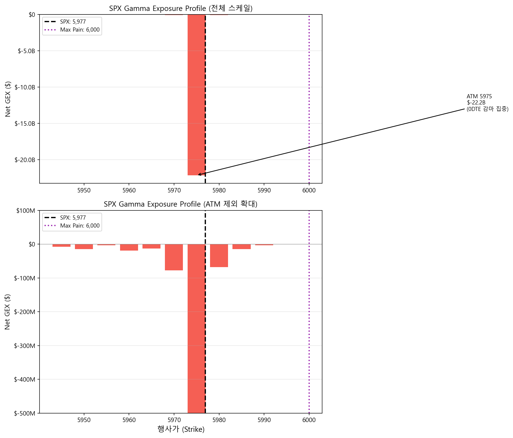

# GEX 직접 계산하기 — Google Sheets + Python

> **구글 시트 복사하기:** [GammaExposureAndMaxPain](https://docs.google.com/spreadsheets/d/1ZrnHpTddR4hwF3_QY6U5MxpjSzLiqG3n5aZkJ8GskTU/copy)

이 글에서는 Cboe의 무료 옵션 체인 데이터로 **GEX 프로파일, 감마 플립 포인트, Max Pain**을 자동 계산하는 구글 시트 도구를 만듭니다. 단계별로 따라 만들면서 각 계산의 의미를 이해하고, 완성된 시트는 매일 데이터만 갱신하면 바로 쓸 수 있습니다.

필요한 것:

- Google 계정 (시트 복사용)
- (선택) Python 3 + pandas, matplotlib

---

## 30초 미리보기: 완성된 도구

시트를 복사하고 데이터를 넣으면 이런 결과를 볼 수 있습니다:

| 지표 | 예시 값 | 의미 |
|:----|:-------|:----|
| **Total GEX** | -$22.4B | MM이 숏 감마 — 변동성 증폭 모드 |
| **Max Pain** | 6,000 | 만기일에 주가가 끌려가는 자석 가격 |
| **MM 헷지 규모** | 1% 당 $22.4B | 지수 1% 변동 시 MM이 사고팔아야 하는 금액 |
| **Put/Call Ratio** | 1.17 | 풋 거래량이 콜보다 많음 |
| **Top GEX 행사가** | 5,975 (-$22.2B) | 감마가 가장 집중된 가격대 |

지금부터 이 결과가 어떻게 나오는지 단계별로 따라갑니다.

---

## 핵심 개념: GEX가 뭔지 3분 요약

### 마켓메이커(MM)와 감마

옵션 시장에서 MM은 거래의 상대편을 맡고, 방향성 배팅을 하지 않습니다. 대신 기초자산(SPX 선물 등)으로 **델타를 헷지**합니다.

**감마**는 주가가 $1 움직일 때 델타가 얼마나 변하는지 나타냅니다. MM이 감마를 보유하면 주가 변동마다 헷지 물량이 바뀌어 추가 매매가 발생합니다:

- **MM 롱 감마**: 주가 상승 → 선물 매도(역방향) → 변동성 **억제** (소방관)
- **MM 숏 감마**: 주가 상승 → 선물 매수(순방향) → 변동성 **증폭** (방화범)

### GEX 공식의 핵심 가정

GEX 계산은 두 가지를 가정합니다:

1. **콜옵션 OI** = 투자자가 매도(SPX/NDX에서는 기관의 커버드콜 매도가 지배적), MM이 매수 → **MM 롱 감마 (+)**
2. **풋옵션 OI** = 투자자가 매수(보험), MM이 매도 → **MM 숏 감마 (-)**

따라서: **Net GEX = Call GEX(+) - Put GEX(-)**

양수면 MM이 소방관, 음수면 방화범.

!!! warning "SPX/NDX 전용"
    이 가정은 대형 지수 옵션에서만 유효합니다. 개별 종목(TSLA, NVDA 등)에서는 리테일이 콜을 매수하므로 가정 1이 뒤집힙니다. 이 도구는 **SPX, NDX, RUT**에만 사용하세요.

---

## 1단계: 구글 시트 복사

1. [이 링크](https://docs.google.com/spreadsheets/d/1ZrnHpTddR4hwF3_QY6U5MxpjSzLiqG3n5aZkJ8GskTU/copy)를 클릭 → "사본 만들기"
2. 복사된 시트에 **7개 탭**이 있습니다:

| 탭 | 역할 | 당신이 할 일 |
|:---|:-----|:-----------|
| **How to import** | CBOE 다운로드 가이드 (스크린샷 포함) | 읽기 전용 |
| **OptionChain Import** | CBOE CSV 데이터 붙여넣는 곳 | **여기에 데이터 import** |
| **GammaExposure Calc** | GEX 자동 계산 | 결과 확인 |
| **GammaExposure Graph** | 설정 + 요약 대시보드 | 결과 확인 |
| **MaxPain Calc** | Max Pain 자동 계산 | 결과 확인 |
| **Gamma Profile Summary** | 최종 요약 (Top strikes, OI 분포) | **여기서 결과 읽기** |
| **0DTE Strategy Patterns** | 장중 0DTE(당일 만기) 감마 패턴 | [다음 글](./gex-0dte-patterns.md) 참조 |

---

## 2단계: CBOE에서 옵션 체인 다운로드

1. [CBOE SPX 옵션 체인](https://www.cboe.com/delayed_quotes/spx/quote_table) 페이지 접속
2. **Options Range**를 `Near The Money` → **`All`**로 변경
3. **Expiration**을 **`All`**로 변경 (모든 만기 포함)
4. **View Chain** 클릭 → 옵션 체인 생성 대기 (수 초~수십 초)
5. 페이지 맨 아래 **Download CSV** 클릭 → 로컬에 저장

!!! tip "언제 받는 게 좋을까"
    **장 마감 후 (미국 동부 16:00 이후)**에 받으면 당일 종가 기준 데이터를 얻습니다. CBOE delayed quotes는 15분 지연 무료 데이터이므로, 장중에는 실시간이 아닙니다.

---

## 3단계: 구글 시트에 데이터 넣기

1. 구글 시트에서 **`OptionChain Import`** 탭 클릭
2. **File → Import** 메뉴
3. **Upload** → **Browse** → 방금 받은 CSV 파일 선택
4. Import location: **`Replace current sheet`** 선택
5. **Import data** 클릭

완료되면 `OptionChain Import` 탭에 이런 데이터가 채워집니다:

```
Expiration Date | Calls         | Last | ... | Gamma | OI    | Strike | Puts          | Last | ... | Gamma | OI
Fri Jun 13 2025 | SPXW250613C.. | 1.18 | ... | 0.128 | 769   | 5975   | SPXW250613P.. | 0.48 | ... | 0.128 | 4720
Fri Jun 20 2025 | SPXW250620C.. | 45.2 | ... | 0.008 | 1203  | 5975   | SPXW250620P.. | 38.5 | ... | 0.008 | 2841
...
```

같은 행사가(5,975)에 만기가 다른 행이 **수십 개** 있는 것이 정상입니다.

---

## 4단계: 결과 확인 — GEX 자동 계산

데이터를 넣으면 나머지 탭이 자동으로 계산됩니다. **`Gamma Profile Summary`** 탭으로 이동하세요.

### 대시보드에서 읽을 수 있는 것

**총 감마 상태:**

```
Call GEX 총합:    $4,477,749,074   (MM 롱 감마 기여)
Put GEX 총합:   $26,857,654,715   (MM 숏 감마 기여)
Total GEX:     -$22,379,905,641   ← 전체 숏 감마
```

→ Total GEX가 **음수** = MM이 전체적으로 숏 감마 = 방화범 모드

**헷지 규모 해석:**

```
"Market makers need to SELL $22.4Bn worth of index for each 1% move DOWN,
 and BUY $22.4Bn for each 1% move UP."
```

→ 지수가 1% 움직이면 MM이 **$22.4B** 규모의 매매를 해야 합니다. 이 매매가 움직임을 더 증폭시킵니다.

**Max Pain:**

```
Max Pain = 6,000
```

→ 만기일에 옵션 매수자 전체가 최소 이익을 얻는 가격. 현재가(5,976.97)와 가까우면 "핀닝" 가능성.

**Top 5 행사가 (Net GEX 기준):**

| 행사가 | Net GEX | 해석 |
|-------:|--------:|:-----|
| 5,975 | -$22.2B | ATM — 0DTE 감마 집중 |
| 5,970 | -$77.4M | 숏 감마 가속 |
| 5,980 | -$67.7M | 숏 감마 가속 |
| 5,960 | -$19.3M | 하방 압력 |
| 5,950 | -$14.5M | 하방 지지선 후보 |

**OI 분포:**

| 콜 OI 상위 | 풋 OI 상위 |
|:-----------|:-----------|
| 6,100 (12,787) | 6,000 (8,247) |
| 6,150 (11,673) | 5,975 (4,720) |
| 6,140 (9,143) | 5,960 (2,546) |

→ 콜 OI는 현재가 **위**에 집중, 풋 OI는 현재가 **부근**에 집중. 전형적인 숏 감마 구조.

**GEX 프로파일 차트:**



상단: ATM(5,975)에 0DTE 감마가 집중되어 -$22.2B 스파이크. 하단: ATM 제외 확대 — 주변 행사가의 GEX 분포. 빨간색 = 숏 감마(변동성 증폭), 파란색 = 롱 감마(변동성 억제).

---

## 뜯어보기: 수식이 실제로 무엇을 계산하는지

결과를 확인했으니, 이제 시트가 내부적으로 무엇을 하는지 이해합니다.

### GEX 계산 (`GammaExposure Calc` 탭)

각 행사가 K에 대해, 모든 만기의 데이터를 합산합니다:

```
Call GEX(K) = Σ (Gamma_i x Call_OI_i x 100 x K)
Put GEX(K)  = Σ (Gamma_i x Put_OI_i x 100 x K)
Net GEX(K)  = Call GEX(K) - Put GEX(K)
```

| 항목 | 의미 |
|:-----|:-----|
| `Gamma_i` | 만기 i에서의 감마 (0DTE면 극대, 30DTE면 작음) |
| `OI_i` | 만기 i에서의 미결제약정 |
| `x 100` | 옵션 1계약 = 100주 |
| `x K` | 감마($1당 델타 변화)를 해당 행사가 수준의 **달러 규모**로 환산 |

!!! note "GEX 공식 변형"
    SpotGamma 등에서는 `Gamma x OI x 100 x S^2 x 0.01` (S = 현재가)을 사용하여 "1% 변동당 헷지 금액"을 직접 산출합니다. 이 시트는 `x K`(행사가)를 사용하는 변형으로, 행사가별 달러 감마를 비교하는 데 적합합니다. 절대 금액은 다르지만 **프로파일의 형태와 플립 포인트는 동일**합니다.

구글 시트 수식 (`GammaExposure Calc` 탭, 행사가별 중복 제거 섹션):

```
Call GEX = SUMPRODUCT(
  (OptionChain!$K:$K = L2) *       ← 행사가 일치
  OptionChain!$J:$J *              ← Call Gamma
  OptionChain!$K2:$K2 *            ← Call OI
  100 * L2                         ← x 100 x 행사가
)
```

### 왜 5,975에서 GEX가 폭발하는가

행사가 5,975의 데이터:

| 만기 | Gamma | Call OI | Put OI |
|:----|------:|--------:|-------:|
| **0DTE (Jun 13)** | **0.1281** | 769 | 4,720 |
| 1주 (Jun 20) | 0.0080 | 1,203 | 2,841 |
| 1개월 (Jul 18) | 0.0025 | 587 | 1,156 |

0DTE의 감마(0.1281)가 1주 만기(0.0080)보다 **16배** 큽니다. OI에 곱하면 0DTE 한 만기가 GEX의 대부분을 결정합니다.

### 감마 플립 포인트

> **높은 행사가부터 아래로 내려가면서 Net GEX 누적합이 양수에서 음수로 전환되는 가격**

이 가격이 MM의 행동이 뒤바뀌는 경계선입니다:

| 현재가 위치 | MM 상태 | 시장 특성 |
|:-----------|:---------|:---------|
| 플립 포인트 **위** | 롱 감마 (소방관) | 변동성 억제, 안정적 |
| 플립 포인트 **아래** | 숏 감마 (방화범) | 변동성 증폭, 급변 가능 |

시트 수식 (누적합):

```
= SUMPRODUCT((Strike열 >= 이_행사가) * Net_GEX열)
```

이 누적합이 양수에서 음수로 바뀌는 지점이 플립 포인트입니다.

!!! note "플립 포인트가 없는 경우"
    Total GEX가 전 구간에서 음수이면 플립 포인트가 존재하지 않습니다. MM이 모든 가격대에서 숏 감마입니다.

!!! note "단순화된 근사"
    이 방법은 현재 옵션 체인의 감마를 고정하고 누적합을 구하는 근사입니다. 정밀한 방법은 각 가상 현재가에서 BSM으로 감마를 재계산하여 총 GEX를 구하지만, 계산량이 크고 결과 차이는 대부분 소폭입니다.

### Max Pain (`MaxPain Calc` 탭)

> **옵션 매수자 전체의 내재가치 합계가 최소가 되는 만기 정산 가격** (= MM 이익이 최대인 가격)

각 가상 정산가 S에 대해:

```
콜 내재가치(S) = Σ_K max(S - K, 0) x Call_OI(K) x 100
풋 내재가치(S) = Σ_K max(K - S, 0) x Put_OI(K) x 100
총 내재가치(S) = 콜 내재가치 + 풋 내재가치
```

**Max Pain = 총 내재가치가 최소인 S** (옵션 매수자가 가장 적게 버는 가격 = MM이 가장 많이 버는 가격)

시트에서 `dollar value sum` 컬럼이 이 값이고, 가장 작은 행의 행사가가 Max Pain입니다.

---

## 매일 사용하는 법

| 시점 | 할 일 | 소요 시간 |
|:----|:------|:---------|
| 장 마감 후 | CBOE에서 CSV 다운로드 | 1분 |
| | 구글 시트 `OptionChain Import` 탭에 import | 1분 |
| | `Gamma Profile Summary` 탭에서 결과 확인 | — |
| 다음 날 장 시작 전 | Total GEX 부호 + 플립 포인트 + Max Pain 확인 | 1분 |

**3분이면 당일 GEX 상태를 파악할 수 있습니다.**

확인할 체크리스트:

- [ ] Total GEX 부호: 양수(안정) vs 음수(불안정)
- [ ] 플립 포인트: 현재가보다 위인지 아래인지
- [ ] Max Pain: 현재가와 얼마나 가까운지
- [ ] Top 5 행사가: 지지/저항으로 작용할 가격대

---

## Python 버전: 자동화

매일 수동으로 하기 번거로우면 Python으로 자동화할 수 있습니다. CBOE CSV를 넣으면 GEX, 플립 포인트, Max Pain을 한 번에 계산합니다.

### 전체 코드

```python
import pandas as pd
import numpy as np
import matplotlib.pyplot as plt
import matplotlib.ticker as mticker


def parse_cboe_csv(filepath):
    """CBOE SPX 옵션 체인 CSV를 파싱합니다."""
    df = pd.read_csv(filepath, skiprows=3)
    df.columns = [
        'expiry', 'call_symbol', 'call_last', 'call_net', 'call_bid', 'call_ask',
        'call_volume', 'call_iv', 'call_delta', 'call_gamma', 'call_oi',
        'strike',
        'put_symbol', 'put_last', 'put_net', 'put_bid', 'put_ask',
        'put_volume', 'put_iv', 'put_delta', 'put_gamma', 'put_oi'
    ]
    for col in ['strike', 'call_gamma', 'put_gamma', 'call_oi', 'put_oi',
                'call_volume', 'put_volume']:
        df[col] = pd.to_numeric(df[col], errors='coerce')
    return df.dropna(subset=['strike'])


def calc_gex(df):
    """행사가별 GEX 계산 (모든 만기 합산)."""
    df['call_gex'] = df['call_gamma'] * df['call_oi'] * 100 * df['strike']
    df['put_gex'] = df['put_gamma'] * df['put_oi'] * 100 * df['strike']

    gex = df.groupby('strike').agg(
        call_gex=('call_gex', 'sum'),
        put_gex=('put_gex', 'sum'),
        call_oi=('call_oi', 'sum'),
        put_oi=('put_oi', 'sum'),
        call_volume=('call_volume', 'sum'),
        put_volume=('put_volume', 'sum'),
    ).reset_index()

    gex['net_gex'] = gex['call_gex'] - gex['put_gex']
    gex['total_gex'] = gex['call_gex'] + gex['put_gex']
    return gex


def find_gamma_flip(gex):
    """높은 행사가부터 누적하여 Net GEX가 +에서 -로 전환되는 행사가."""
    g = gex.sort_values('strike', ascending=False).copy()
    g['cum'] = g['net_gex'].cumsum()
    sign_change = (g['cum'].shift(1) > 0) & (g['cum'] <= 0)
    if sign_change.any():
        return g.loc[sign_change.idxmax(), 'strike']
    return None


def calc_max_pain(gex):
    """총 옵션 내재가치가 최소인 행사가."""
    strikes = gex['strike'].values
    call_oi = gex['call_oi'].values
    put_oi = gex['put_oi'].values

    pain = []
    for s in strikes:
        cp = np.sum(np.maximum(s - strikes, 0) * call_oi) * 100
        pp = np.sum(np.maximum(strikes - s, 0) * put_oi) * 100
        pain.append(cp + pp)
    gex['pain'] = pain
    return gex.loc[gex['pain'].idxmin(), 'strike']


def plot_gex(gex, spot, flip=None, max_pain=None):
    """GEX 프로파일 차트."""
    margin = spot * 0.05
    g = gex[(gex['strike'] >= spot - margin) & (gex['strike'] <= spot + margin)]

    fig, ax = plt.subplots(figsize=(14, 7))
    colors = ['#2196F3' if v >= 0 else '#F44336' for v in g['net_gex']]
    ax.bar(g['strike'], g['net_gex'], width=3, color=colors, alpha=0.8)

    ax.axvline(spot, color='black', lw=2, ls='--', label=f'SPX: {spot:,.0f}')
    if flip:
        ax.axvline(flip, color='#FF9800', lw=2, label=f'Gamma Flip: {flip:,.0f}')
    if max_pain:
        ax.axvline(max_pain, color='#9C27B0', lw=2, ls=':', label=f'Max Pain: {max_pain:,.0f}')

    ax.set_xlabel('Strike')
    ax.set_ylabel('Net GEX ($)')
    ax.set_title('SPX Gamma Exposure Profile')
    ax.legend(fontsize=11)
    ax.yaxis.set_major_formatter(mticker.FuncFormatter(
        lambda x, _: f'${x/1e9:.1f}B' if abs(x) >= 1e9 else f'${x/1e6:.0f}M'))
    ax.axhline(0, color='gray', lw=0.5)
    ax.grid(axis='y', alpha=0.3)
    plt.tight_layout()
    plt.savefig('gex_profile.png', dpi=150, bbox_inches='tight')
    plt.show()


# === 실행 ===
df = parse_cboe_csv('spx_options.csv')  # CBOE CSV 경로
gex = calc_gex(df)
spot = 5976.97

flip = find_gamma_flip(gex)
mp = calc_max_pain(gex)
total = gex['net_gex'].sum()

print(f"Total GEX:    ${total:,.0f}")
print(f"Gamma Flip:   {flip}")
print(f"Max Pain:     {mp}")
print(f"Put/Call Vol:  {gex['put_volume'].sum() / gex['call_volume'].sum():.2f}")

plot_gex(gex, spot, flip, mp)
```

---

## GEX 계산의 한계

이 도구를 사용할 때 반드시 알아야 할 점:

1. **OI는 어제 장 마감 기준** — 장중 대량 거래가 반영되지 않습니다. → [다음 글: 0DTE 감마 패턴](./gex-0dte-patterns.md)에서 장중 보정 방법

2. **CBOE Gamma는 BSM 모델 기반** — 이론적 감마입니다. 실제 MM이 사용하는 감마와 다를 수 있습니다.

3. **OI의 방향을 모릅니다** — 누가 매수이고 매도인지 공개 데이터로는 알 수 없습니다. "콜 = MM 매수, 풋 = MM 매도" 가정에 의존합니다.

4. **0DTE가 지배적** — ATM 0DTE 감마가 극대이므로, GEX가 당일 만기 하나에 좌우됩니다. 장중에 0DTE OI가 변하면 GEX도 크게 변합니다.

5. **절대적 매매 신호가 아닙니다** — GEX는 "MM의 예상 포지션"을 추정하는 방향성 지표입니다. 단독으로 매매 결정에 사용하지 마세요.

---

## 마무리

이 도구로 할 수 있는 것:

1. **매일 3분**으로 GEX 상태 파악 — Total GEX 부호, 플립 포인트, Max Pain
2. **지지/저항 후보 식별** — GEX가 큰 행사가 = MM 헷지가 집중되는 가격대
3. **MM 행동 방향 추정** — 숏 감마(변동성 증폭) vs 롱 감마(변동성 억제)
4. **장중 급변동의 맥락 이해** — "왜 갑자기?"에 대한 구조적 답

GEX는 단독 매매 신호가 아닌 **맥락 도구**입니다. 다른 분석(기술적 분석, VIX 등)과 함께 사용할 때 가장 유용합니다.

---

## 다음 글

아침에 계산한 GEX는 출발점입니다. **장중에 0DTE 옵션이 대량 거래되면 GEX가 어떻게 변하는가?** BTO/STO 패턴이 MM의 감마 포지션을 어떻게 밀어내는지, 아침 GEX에 장중 보정을 적용하는 방법을 다룹니다.

→ [0DTE 감마 패턴 — 장중 GEX는 어떻게 변하는가](./gex-0dte-patterns.md)

---

## 참고

- [SqueezeMetrics GEX 백서 (PDF)](https://squeezemetrics.com/monitor/docs)
- [Cboe SPX Options — Delayed Quotes](https://www.cboe.com/delayed_quotes/spx/quote_table)

*Cboe, SPX, VIX는 Cboe Exchange, Inc.의 등록 상표입니다. 이 글은 Cboe와 제휴 또는 보증 관계가 없습니다.*
