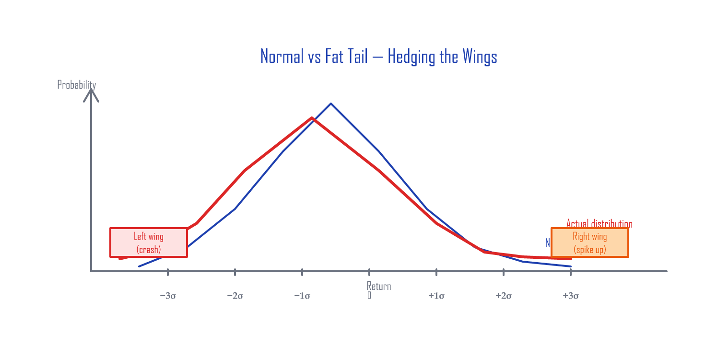
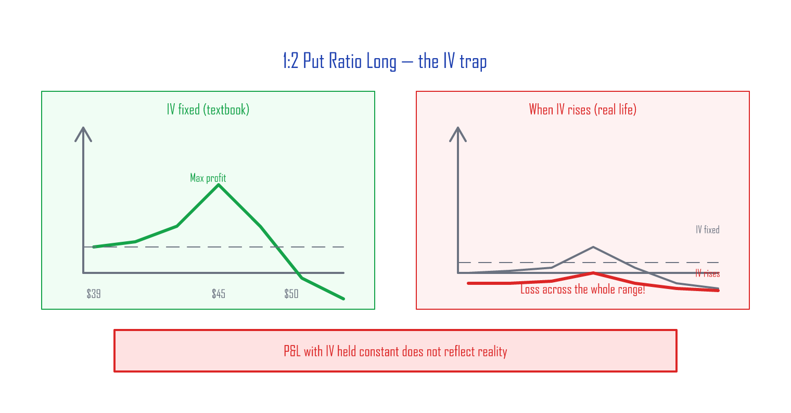
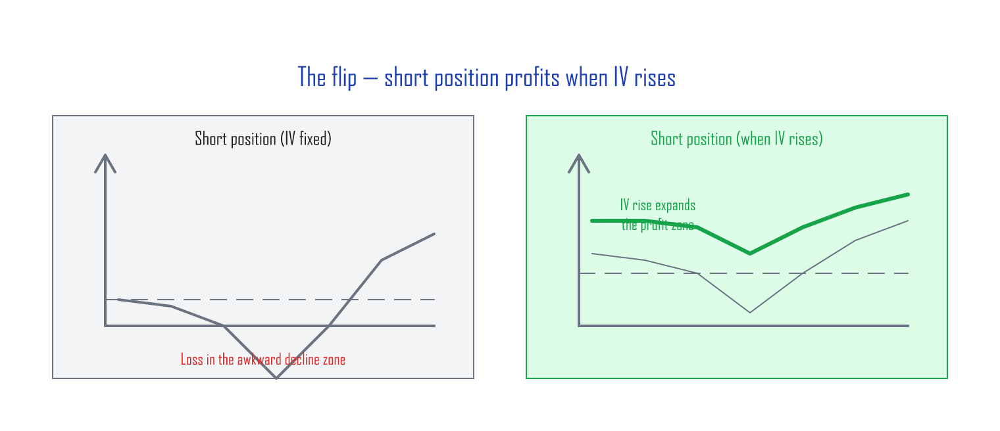
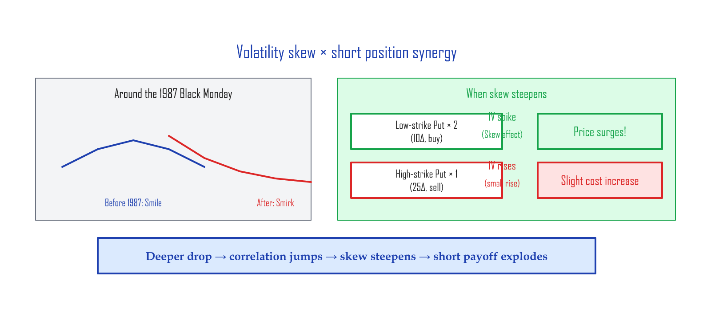
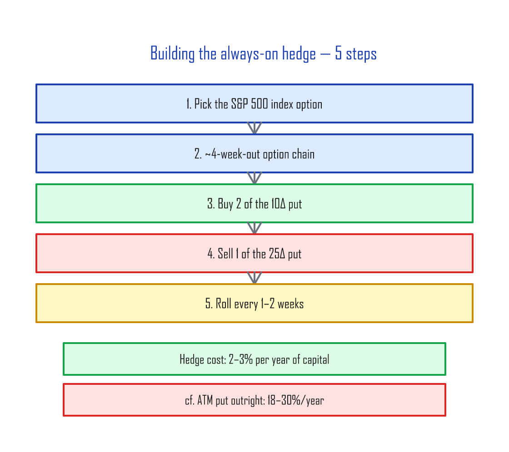

# Hedging the Wings — Cheap Tail-Risk Insurance

> This article distills the core ideas from Hari P. Krishnan's [**The Second Leg Down: Strategies for Profiting after a Market Sell-Off**](https://www.amazon.com/Second-Leg-Down-Strategies-Profiting/dp/1119219086) (Wiley, 2017).
>
> Previous: [Volatility Skew — The S&P 500's Smirk](skew.md)

---

## Before you read this

You'll get more out of this article if you already have these concepts down:

| Prerequisite | Level | What it is |
|:-------------|:------|:-----------|
| Put options | Required | The right to sell at a set price (= downside insurance) |
| Implied volatility (IV) | Required | The market's volatility expectation baked into the option price |
| Delta | Required | How much the option moves for a $1 move in the stock (10D ≈ 10% chance of finishing ITM) |
| Spreads | Recommended | Strategies that combine two or more options |
| [Volatility Skew](skew.md) | Recommended | Previous article — why index-option IV is asymmetric |

---

## Normal distribution vs. fat tails

Stock returns are *theoretically* normally distributed (the bell curve), but in reality, **events 3–5 standard deviations from the mean happen far more often than the bell curve predicts**. (A sigma is one standard deviation — a measure of how far from average a move is.)

| Sigma | Normal-distribution probability | What actually happens |
|:------|:--------------------------------|:----------------------|
| 3σ | 0.3% (3 days in 1,000) | Much more often |
| 4σ | 0.006% (essentially never) | 2008 GFC, 2020 COVID |
| 5σ | 0.00006% | 1987 Black Monday (−22% in a day) |

The two ends of the distribution look like wings. Hedging those tails is what people call **"hedging the wings"** — like the car insurance you keep paying for every month even when nothing happens. The conditions:

- A tail event can hit **at any time**, so the hedge has to be **always on**.
- Because it's always on, it has to be **cheap**.

> **Heads-up on difficulty:** This is a strategy for traders with options experience. You can run it on SPX index options or SPY ETF options (SPY is more accessible because the contract size is smaller), but it's not a beginner-friendly trade for these reasons:
>
> - **Multi-leg management**: holding two-plus legs at once, rolling them as expirations approach
> - **Slippage** (the price difference between bid and ask): each leg has a bid–ask spread, and OTM puts are especially wide
> - **The awkward zone**: in a slow grinding decline, the position can lose money

---

## The core idea: 1:2 Put Ratio Spread

### Structure

A 1:2 put ratio spread combines **two puts at different strikes**:

| Position | Higher-strike put (25Δ) | Lower-strike put (10Δ) |
|:---------|:------------------------|:-----------------------|
| **Long** | Buy 1 contract | Sell 2 contracts |
| **Short** (the focus of this article) | Sell 1 contract | Buy 2 contracts |

In plain language:

- **Long** = "buy one expensive insurance policy, sell two cheap ones" → profits from the premium gap
- **Short** = "sell one expensive policy, buy two cheap ones" → **the two cheap policies explode in a crash**

### A concrete SPY example

With SPY at $540:

| Leg | Strike | Delta | Trade | Price (illustrative) |
|:----|:-------|:------|:------|:---------------------|
| Leg A | $510 (25Δ) | -0.25 | **Sell 1 contract** | Receive $4.50 |
| Leg B | $490 (10Δ) | -0.10 | **Buy 2 contracts** | Pay $1.80 × 2 = $3.60 |
| **Net** | | | | **+$0.90 credit (received)** |

You enter the position with a **$0.90 credit** in your account. Four weeks later, here's what each scenario looks like at expiration:

| Scenario | SPY price | Outcome | P&L |
|:---------|:----------|:--------|:----|
| Flat / small rally | $535–$550 | All options expire worthless | **+$0.90** (credit kept) |
| Mild decline (−3%) | $524 | $510 put still OTM | **+$0.90** |
| **Danger zone (−5 to −7%)** | **$503–$513** | **$510 put ITM, $490 put OTM** | **−$3 to −$7** |
| Sharp drop (−10%) | $486 | The two $490 puts > the one $510 put | **+$5 to +$10** |
| Crash (−20%) | $432 | The two long puts blow out | **+$30+** |

> **Mind the danger zone (−5 to −7%):** if SPY parks near $510, the $510 put you sold goes ITM while the $490 puts you bought stay OTM. That's the "dead zone." Maximum loss in that zone is **the strike-difference ($510 − $490 = $20) minus the credit ($0.90) ≈ $19.10 per contract**. This is the worst-case scenario for the strategy, and it's exactly why you roll the position before expiration rather than ride it through.

---

## Why short, not long? — The IV magic

### The trap of the long version

As the previous article covered, textbook P&L curves assume IV doesn't move — they fix it as a constant. But in real life, when the market shakes, IV rises, and the long version of this trade ends up **losing across nearly the entire range**.

### The short version — IV rising is your friend

The short version *profits* when IV rises. When a tail event sends IV vertical, the P&L curve shifts upward.

### IV-change scenarios (SPY $540, two weeks to expiration)

| VIX move | IV change | Leg A (1 short) P&L | Leg B (2 long) P&L | **Net** |
|:---------|:----------|:--------------------|:-------------------|:--------|
| VIX 15 → 15 (flat) | 0 | +$0.30 (theta gain) | −$0.20 (theta cost) | **+$0.10** |
| VIX 15 → 25 (+10) | +10 pts | −$2.00 | +$3.50 | **+$1.50** |
| VIX 15 → 40 (+25) | +25 pts | −$5.00 | +$12.00 | **+$7.00** |

When VIX rockets from 15 to 40 (2020-COVID-style), the two 10Δ puts you bought rise **far faster** than the one 25Δ put you sold. Skew is the reason — IV at the lower strike (10Δ) rises *more* than IV at the higher strike during a crash.

---

## The skew synergy

When [volatility skew](skew.md) steepens during a crash, two effects compound:

1. **IV rises across the board** → all options get more expensive → the two long puts gain more than the one short put loses
2. **Skew steepens** → the lower-strike (10Δ) put's IV rises *more than* the higher-strike (25Δ) put's IV

Result: **the deeper the crash, the more aggressively the hedge pays off**. It's exponential, not linear.

---

## Why 10-delta puts?

| | 10Δ put | 25Δ put |
|:-|:--------|:--------|
| Weekly cost (premium) | **Low** | High |
| Hedge performance in a crash | Strong | Slightly stronger |
| Cost efficiency | **Better** | Worse |
| Institutional demand | Low | **Very high** → always trades rich |
| IV vs Realized Volatility (RV) | Trades fairly | IV > RV (options trade above theoretical fair value) |

25Δ puts are constantly bid up by institutional hedging demand — they trade rich. So the structurally efficient move is to **sell** the rich 25Δ and **buy** the relatively cheap 10Δ.

---

## How to actually build it — 5 steps

| Step | What | Concrete example (SPY at $540) |
|:-----|:-----|:--------------------------------|
| 1 | Pick the S&P 500 option | SPY (retail) or SPX (institutional) |
| 2 | Find an option chain ~4 weeks to expiration | 28-day-out options |
| 3 | Buy 2 contracts of the 10Δ put | SPY $490 put × 2 |
| 4 | Sell 1 contract of the 25Δ put | SPY $510 put × 1 |
| 5 | Roll after 1–2 weeks | Close the existing position → re-open at the new 4-week expiration |

---

## Cost comparison

| Hedge method | Annual cost | Crash payoff | Notes |
|:-------------|:-----------:|:-------------|:------|
| Always-on ATM puts | 18–30% | Linear (1:1) | Brutally expensive |
| Always-on 10Δ puts | 1.5–2% | Linear (1:1) | Most expire worthless |
| **1:2 Put Ratio Short** | **2–3%** | **Convex — accelerates the deeper it falls** | Bigger crash → exponentially bigger payoff |

> **"If the 10Δ put hedge is only 1.5–2%, why use the more expensive 2–3% structure?"**
>
> The difference is the *shape* of the payoff. A standalone 10Δ put pays off linearly with the drop. The 1:2 short ratio gets two effects stacking on each other — **rising IV** + **steepening skew** — so the deeper the crash, the **faster** the hedge pays off (this is convexity). In a 2008- or 2020-magnitude drawdown (>−30%), the ratio can pay **2–5× what a standalone 10Δ put would pay**. You're spending an extra 0.5–1% per year and getting exponentially better tail-event performance in return.

---

## Wrap-up

| Market state | 1:2 short position reaction | Why |
|:-------------|:----------------------------|:----|
| Flat / small rally | Small gain (the credit) | Theta + options expire |
| Mild drop (−3 to −7%) | **Small loss possible** | The 25Δ put approaches ITM |
| Sharp drop (−10%+) | **Profit** | IV rising + skew effect |
| Crash (−20%+) | **Big profit** | Both effects compound |

**The core idea:** sell expensive insurance (25Δ), buy two cheap policies (10Δ). In quiet times, the credit covers the cost. In a crash, the two cheap policies explode.

**One last tip:** if a crash has *already* started and you only now realize you need a hedge, consider the **long** version of the 1:2 put ratio instead of buying a put outright. The downsides of the long version (described above) flip into upsides here — IV is already elevated, has limited room to rise further and lots of room to fall. The long version *benefits* from IV mean-reverting downward.

---

**Reference:** Hari P. Krishnan, *The Second Leg Down: Strategies for Profiting after a Market Sell-Off*, Wiley Finance Series, 2017. ISBN 978-1119219088.

*Next: [Market-Sentiment Volatility Indices — Implied Correlation and the IV Surface](implied-correlation.md)*
