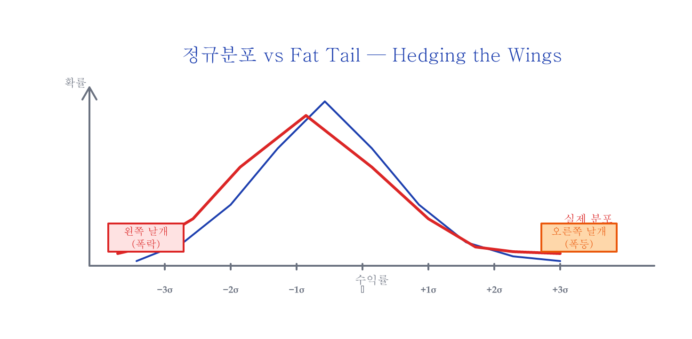
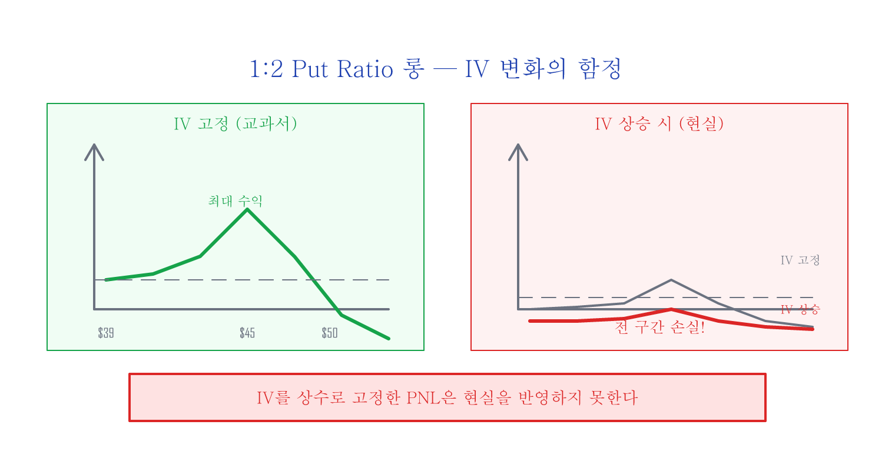
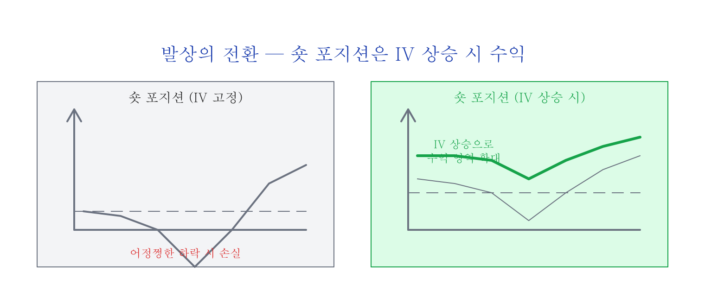
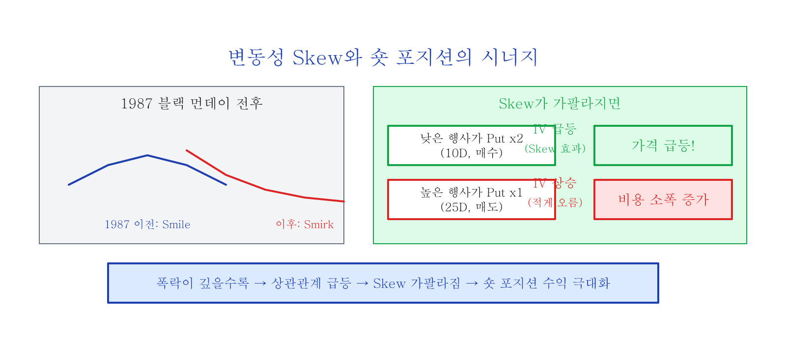
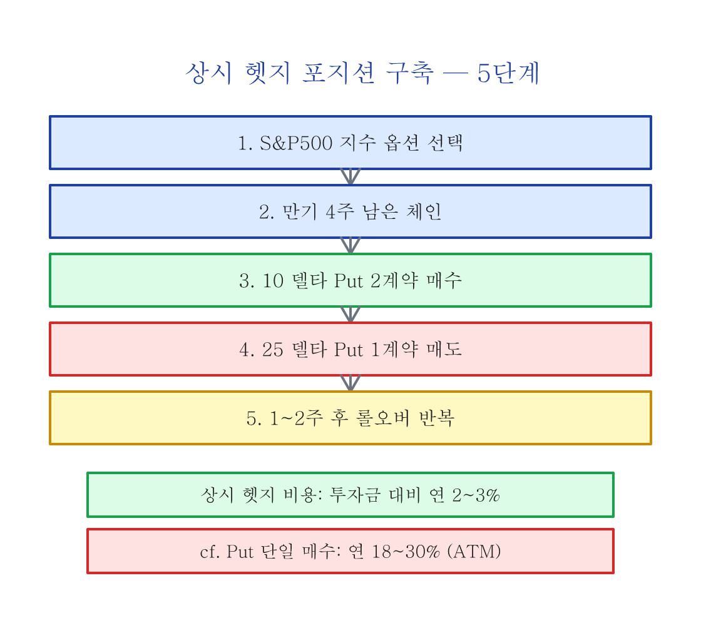

# Hedging the Wings — 저비용 테일 리스크 헷지

> 이전 글: [변동성 Skew — S&P500 지수 옵션의 썩소](skew.md)

---

## 정규분포와 Fat Tail

보통 주가는 수학적으로 로그정규분포(Log-normal distribution)로 표현할 수 있고, 주가의 기간 단위당 수익률(return)은 정규분포(Normal distribution, 벨 커브)로 표현할 수 있습니다.

정규분포에서 1 시그마는 68.2%의 사건을 포함하고, 3 시그마는 99.7%의 사건을 포함합니다. 하지만 주식 시장에서는 3~5 시그마 바깥 구간의 말도 안 되는 확률의 사건이 꽤나 자주 발생해 왔습니다. 이를 **테일 이벤트(Tail event)**라고 합니다.

따라서 주가의 수익률 분포는 일반적인 정규분포 그래프보다 몸통은 조금 더 얇고 테일이 뚱뚱한(Fat tail) 형태가 됩니다. 이 모양이 흡사 새가 날아오르는 모양을 연상시키기 때문에, 날개 부분에 해당하는 테일 이벤트를 헷지하는 것을 **"Hedging the wings"**라고 표현합니다.

발생할 확률은 **대단히** 낮지만, 일단 발생하면 투자자들에게 크게 낭패를 안겨줄 수 있는 테일 이벤트를 헷지할 수 있는 **고효율**, **저비용** 옵션 포지션에 대해서 설명합니다. 이러한 테일 이벤트는 아무도 예상할 수 없는 시간, 장소에서 발생하기 때문에 **상시 헷지를 유지해야 하며**, 따라서 반드시 **저비용**이어야만 합니다.

> **실행 난이도 안내:** 이 글에서 소개하는 1:2 Put Ratio Spread는 **SPX 지수 옵션 경험이 있는 투자자를 대상**으로 합니다. 일반 개인투자자에게는 실행이 쉽지 않은 전략입니다:
>
> - **멀티 레그 관리**: 2개 이상의 옵션 포지션을 동시에 관리해야 하며, 각 레그의 만기/행사가/수량을 지속적으로 모니터링하고 롤오버해야 합니다
> - **슬리피지(Slippage)**: 멀티 레그 스프레드는 각 레그마다 bid-ask spread가 발생하며, 레그 수가 많을수록 체결 비용이 누적됩니다. 특히 유동성이 낮은 OTM put에서 슬리피지가 심화됩니다
> - **마진/위험**: 합성 포지션이 어정쩡한 하락 구간에서 손실이 발생할 수 있으며, 마진 요구 사항과 롤오버 타이밍 관리가 필요합니다
>
> 옵션 기초(콜/풋, 그리스, 스프레드)를 먼저 충분히 이해한 후, 소규모로 시작하시기 바랍니다.

---

## 1:2 Put Ratio Spread

1:2 put ratio는 Front ratio spread w/put이라고도 불리며, 델타 중립(Delta neutral)을 유지하면서 변동성을 수익으로 확정하는 변동성 트레이딩(Volatility trading)에서 자주 사용됩니다.

통상적으로:

- **롱 포지션**: 높은 행사가 put 1계약 매수 + 낮은 행사가 put 2계약 매도
- **숏 포지션**: 높은 행사가 put 1계약 매도 + 낮은 행사가 put 2계약 매수

### 롱 포지션의 함정 — IV가 변하면?

대부분의 옵션 트레이더들은 처음에 교과서적으로 위 왼쪽과 같은 PNL을 분석하고 자신만만하게 실전에 돌입합니다. 하지만 생각지도 못한 결과에 크게 좌절하게 됩니다. 위의 PNL들은 모두 내재변동성이 **상수라고 고정**하고 그려졌기 때문입니다.

시장이 흔들리면서 변동성이 증가하면, 오른쪽 그림처럼 거의 **전 구간에서 무조건 손실이 발생**합니다.

> 옵션 트레이더가 시장의 변동성을 고려하지 않는다면 계좌가 피를 철철 흘릴 것이다...

---

## 발상의 전환 — 숏 포지션

> 그렇다면 반대로 1:2 put ratio spread **숏** 포지션을 합성하면 시장의 변동성이 증가할 때 무조건 수익이 발생하는 것 아닌가?

테일 이벤트 발생과 같은 급박한 상황에서 시장의 변동성이 슈팅하면, 1:2 put ratio 숏 포지션의 PNL은 수익 쪽으로 더 많이 들어올려집니다.

하지만 시장이 **어정쩡하게 하락**할 때에는, 만기일까지 유지하면 시장의 변동성이 상승하더라도 손실이 생길 수 있습니다. 따라서 지속적으로 **롤 오버(Roll over)**해야 합니다.

---

## 변동성 Skew의 시너지

S&P500과 같은 지수 옵션에는 변동성 왜곡(Skew) 현상이 있습니다. 이전 글에서 다루었듯이, 하락장에서는 하락의 크기가 크면 클수록 Skew의 왼쪽 입꼬리가 더 올라갑니다.

1:2 put ratio 숏 포지션은 낮은 행사가 put 2계약을 매수하고 높은 행사가 put 1계약을 매도하여 합성합니다. 시장이 폭락하고 투매가 발생할 때 Skew가 가팔라지면, 매수한 낮은 행사가 put의 IV가 매도한 높은 행사가 put보다 **훨씬 더 많이** 올라갑니다.

이런 이유들이 복합적으로 작용하면서, 1:2 put ratio 숏 포지션은 **하락의 깊이가 크면 클수록 더 강력한 헷지 포지션**으로 거듭나게 됩니다.

---

## Put 행사가 선정 — 10 델타 vs 25 델타

10 델타(10D) put이란 만기일에 내가격(ITM)이 될 확률이 약 10%인 깊은 외가격 put입니다. 25 델타(25D) put은 그 확률이 약 25%입니다.

과거 데이터에 의하면:

| 항목 | 10 델타 Put | 25 델타 Put |
|:----|:-----------|:-----------|
| 주간 손해 (보험료) | **작음** | 큼 |
| 헷지 성능 (폭락 시) | 양호 | 약간 더 좋음 |
| 비용 효율 | **더 높음** | 낮음 |
| 기관 수요 | 적음 | **매우 높음** (항상 비싸게 거래) |

대형 투자기관들은 헷지 목적으로 25 델타 put을 선호합니다. 더 많은 수요가 있기 때문에 25 델타 put은 다른 행사가의 put들보다 항상 더 비싸게 거래되는 경향이 있습니다. 실제로 25 델타 put의 내재변동성(IV)은 실현변동성(RV)보다 대부분 더 높았습니다 — 즉, **25 델타 put은 실제 가격보다 더 비싸게 거래되어 왔습니다.**

결론: 10 델타 put을 상시 보유하는 경우가 25 델타 put을 상시 보유하는 것보다 **비용 대비 효율이 더 높습니다.**

---

## 실전 구축: 상시 헷지 포지션

언제 발생할지 모르는 테일 이벤트(Tail event)를 효과적으로 헷지할 수 있습니다.

---

## Put 단일 매수가 안 되는 이유

처음 옵션을 배우면 지수 put 옵션 매수 포지션으로 저비용 고효율의 헷지가 가능할 것이라고 생각합니다. 하지만 put 옵션 매수 포지션의 시간 감쇄(time decay)가 대단히 비싼 비용이라는 것을 깨닫게 됩니다. 지수 옵션의 변동성 Skew 현상 때문에 지수 put 옵션은 거의 항상 이미 비싼 상태이기 때문입니다.

S&P500 지수 ATM put 옵션을 상시 매수하여 테일 이벤트를 헷지하는 데 드는 비용은 통상적으로 **투자금액 대비 연 18~30%**에 육박합니다. 10 델타 put으로 낮춰도 **연 1.5~2%** 수준의 비용이 꾸준히 발생하며, 대부분의 경우 만기 시 무가치하게 소멸합니다.

1:2 put ratio 숏 포지션의 경우 상시 헷지 비용은 단일 put 매수의 **약 1/10 수준인 투자금액 대비 연 2~3%**입니다.

---

## 마무리

1:2 put ratio 숏으로 구축하는 상시 헷지 포지션의 핵심을 정리하면:

- **IV 상승 시**: 숏 포지션 전체가 수익 방향으로 이동
- **Skew 가팔라질 때**: 매수한 낮은 행사가 put의 가격이 매도한 put보다 훨씬 빠르게 상승
- **폭락이 깊을수록**: 두 효과가 복합적으로 작용하여 헷지 성능 극대화
- **상시 비용**: 투자금 대비 연 2~3% (Put 단일 매수 대비 1/10)

**마지막 팁:** 만약 시장이 폭락하고 뒤늦게나마 헷지가 필요하다면, S&P500 지수 put 옵션 단일 매수가 아니라 S&P500 지수 1:2 put ratio **"롱"** 포지션을 매수하세요. 위에서 언급한 put 옵션 단일 매수의 단점들이 모두 반대로 작용할 수 있기 때문입니다.

**참고:** 효율적 시장 가설에 따르면, 시장에 왜곡이 발생하면 차익거래자들이 정상으로 빠르게 복귀시킵니다. 10 델타 put 가격이 25 델타 put 대비 저평가되었다면, 더 많은 투자자들이 10 델타 put을 사용하면서 상황이 바뀔 수 있습니다. 옵션 트레이딩에서 **시장의 변동성 변화 과정에 대한 이해가 반드시 필요**합니다.

---

*다음 글: [시장 심리 변동성 지수 — Implied Correlation과 IV Surface](implied-correlation.md)*
