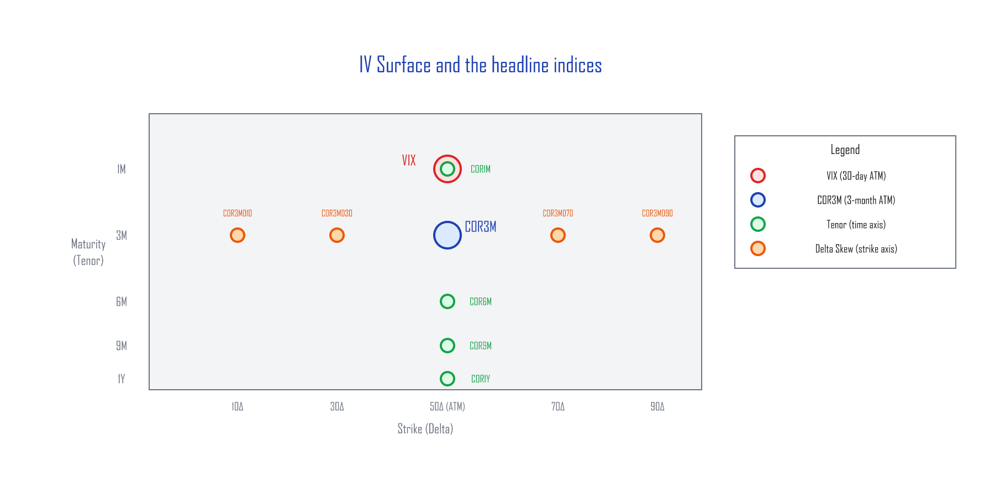
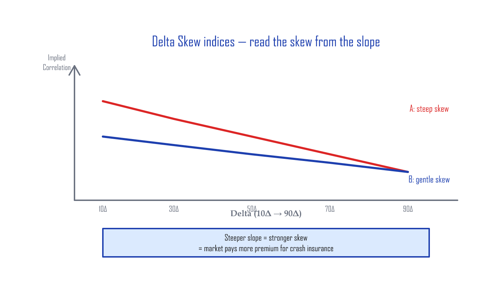
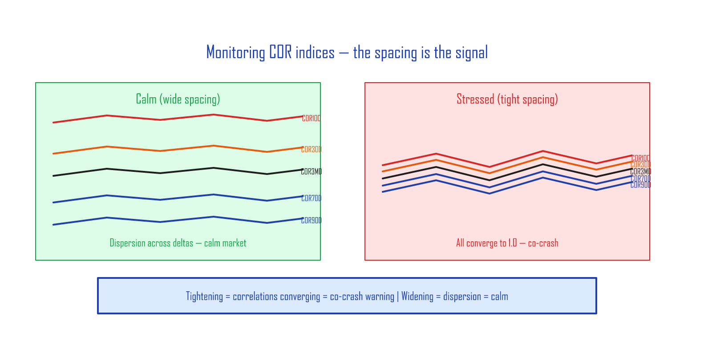
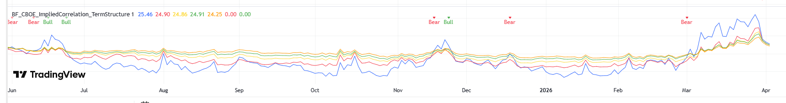

# Market-Sentiment Volatility Indices — Implied Correlation and the IV Surface

> Related: [Volatility Skew](skew.md) | [Hedging the Wings](hedging-wings.md)

> 📚 **Where this article fits**: this is the *concept and taxonomy* of COR/SKEW indices. The *day-to-day monitoring tool* is [Volatility Dashboard](volatility-dashboard.md). They're a pair.

---

## What implied volatility actually is

The **implied volatility (IV)** of an S&P 500 index option is the **future-volatility estimate** that SPX option market participants have implicitly agreed on for the period running to expiration.

| | What it is |
|:-|:-----------|
| **Historical / Realized Volatility (HV/RV)** | Computed from prices that have already happened |
| **Implied Volatility (IV)** | The forward estimate the options market has agreed on, after digesting all available information |

Think of SPX-option IV as the **market-cleared price of insurance**. When the crowd starts pricing in upside, call IV rises. When the crowd starts pricing in downside, put IV rises.

> If you watch the IV surface carefully enough, can you read the market's collective intent — without ever opening the news?

### Why bother watching these indices?

In February 2020, **before** mainstream news really picked up the COVID story, the options market was already moving. Implied correlation had jumped from around 30% to north of 60% — the unmistakable signature of institutions buying put insurance in size.

If you wait for the news, you're always late. The IV surface and the COR indices reflect **institutional positioning first**, so they give you a faster signal than the headlines.

---

## The IV surface

If you plot S&P 500 (SPX) option implied volatility with **moneyness** (strike vs spot) on one axis and **maturity** (time to expiration) on the other, you get the **IV surface**.



Each point on this surface is the IV at a specific strike-and-maturity combination. CBOE computes a number of implied-correlation indices by sampling specific points on this surface.

---

## VIX

**VIX** is the market's fear gauge. It computes the **expected 30-day volatility** of the S&P 500 from a wide strip of OTM SPX options (calls and puts together). It's not a single ATM point — it integrates a broad slice of the IV surface. So VIX is the SPX option market's **collective 30-day-ahead volatility forecast**.

<details><summary>How VIX is calculated (deeper dive)</summary>

VIX is built using a variance-swap replication formula. Instead of reading a single strike's IV, it computes a weighted sum of OTM option prices across many strikes to get the expected 30-day variance. Take the square root, annualize, and you have VIX.

</details>

---

## COR3M — 3-Month Implied Correlation

CBOE launched this index on July 1, 2021. Its formal name is **Cboe 3-Month Implied Correlation Index**.

COR3M reads the implied correlation at the **3-month maturity, at-the-money (50Δ)** point on the IV surface.

**Implied correlation** measures the relationship between the S&P 500 index option's IV and the IV of the top 50 single-name options, expressed as a 0–100% number. In plain terms: how much the index members move together.

| Market state | Implied correlation | What it says |
|:-------------|:--------------------|:-------------|
| Uptrend | ~30% | Mix of winners and losers; leadership stocks dragging the index up |
| Downtrend | Spikes above 60% | Everything falls together |

> COR3M is published in real time on the CBOE website (cboe.com).

---

## The Tenor indices — extending the time axis (added 2022)

COR3M's success led CBOE to launch eight more correlation indices on July 18, 2022 — four along the **time (tenor)** axis and five along the **strike (delta)** axis of the IV surface.

**The four tenor indices (ATM fixed, only maturity changes):**

| Index | Maturity | Strike | What it tells you |
|:------|:---------|:-------|:------------------|
| **COR1M** | 1 month | 50Δ (ATM) | Short-term sentiment |
| **COR6M** | 6 months | 50Δ (ATM) | Mid-term sentiment |
| **COR9M** | 9 months | 50Δ (ATM) | Mid-to-long-term sentiment |
| **COR1Y** | 1 year | 50Δ (ATM) | Long-term sentiment |

---

## The Delta Skew indices — extending the strike axis

**The five delta-skew indices (3-month maturity fixed, only strike changes):**

| Index | Maturity | Strike | What it covers |
|:------|:---------|:-------|:---------------|
| **COR10D** | 3 months | 10Δ | Deep OTM put |
| **COR30D** | 3 months | 30Δ | OTM put |
| **COR3MD** | 3 months | 50Δ | ATM baseline |
| **COR70D** | 3 months | 70Δ | OTM call |
| **COR90D** | 3 months | 90Δ | Deep OTM call |

S&P 500 index options have a [volatility skew](skew.md). When you plot all five delta-skew correlation indices on one chart, the COR readings line up **close to a straight line**. That makes the slope easy to read at a glance — and the slope *is* the skew.



A steeper negative slope (case A) corresponds to a **steeper skew on the IV surface** than a flatter slope (case B).

---

## How to monitor — the gap is the signal



When you track the historical levels of the delta-skew correlation indices, the key isn't the absolute level — it's the **spacing between them**:

- **Wide spacing** → correlations differ across deltas → market is healthy, names dispersing
- **Narrow spacing** → all correlations converging toward 1.0 (every stock moving in the same direction) → stress, broad sell-off

Below is a TradingView chart that monitors the tenor COR indices (COR1M through COR1Y) in real time:



In the calm window from August to October 2025, the indices are well separated. In November and December's pullbacks, you can see the spacing collapse and the Bear signal fire.

> You can read live COR data on the CBOE website, or run the Pine Scripts below in TradingView.

<details><summary>TradingView Pine Script — BF_CBOE_COR_TermStructure</summary>

```pine
//@version=6
indicator("BF_CBOE_COR_TermStructure", overlay=false)

mult = input.float(1.0, "Multiplier", minval=0.1, step=0.1)

cor1m = request.security("CBOE:COR1M", timeframe.period, close) * mult
cor3m = request.security("CBOE:COR3M", timeframe.period, close) * mult
cor6m = request.security("CBOE:COR6M", timeframe.period, close) * mult
cor9m = request.security("CBOE:COR9M", timeframe.period, close) * mult
cor1y = request.security("CBOE:COR1Y", timeframe.period, close) * mult

plot(cor1m, "COR1M", color=color.red, linewidth=2)
plot(cor3m, "COR3M", color=color.orange, linewidth=2)
plot(cor6m, "COR6M", color=color.yellow, linewidth=2)
plot(cor9m, "COR9M", color=color.green, linewidth=2)
plot(cor1y, "COR1Y", color=color.blue, linewidth=2)

// Bull/Bear: term structure inversion
bull = ta.crossunder(cor1m, cor1y)
bear = ta.crossover(cor1m, cor1y)

if bull
    label.new(bar_index, cor1m, "Bull", color=color.green,
              textcolor=color.white, style=label.style_label_down, size=size.small)
if bear
    label.new(bar_index, cor1m, "Bear", color=color.red,
              textcolor=color.white, style=label.style_label_down, size=size.small)
```

</details>

<details><summary>TradingView Pine Script — BF_CBOE_COR_DeltaSkew</summary>

```pine
//@version=6
indicator("BF_CBOE_COR_DeltaSkew", overlay=false)

mult = input.float(1.0, "Multiplier", minval=0.1, step=0.1)

cor10d = request.security("CBOE:COR10D", timeframe.period, close) * mult
cor30d = request.security("CBOE:COR30D", timeframe.period, close) * mult
cor3md = request.security("CBOE:COR3M", timeframe.period, close) * mult
cor70d = request.security("CBOE:COR70D", timeframe.period, close) * mult
cor90d = request.security("CBOE:COR90D", timeframe.period, close) * mult

plot(cor10d, "COR10D (10D Put)", color=color.red, linewidth=2)
plot(cor30d, "COR30D (30D Put)", color=color.orange, linewidth=2)
plot(cor3md, "COR3MD (50D ATM)", color=color.yellow, linewidth=2)
plot(cor70d, "COR70D (70D Call)", color=color.green, linewidth=2)
plot(cor90d, "COR90D (90D Call)", color=color.blue, linewidth=2)

// Skew spread background: wider = more stress
skew_spread = cor10d - cor90d
bgcolor(skew_spread > 25 ? color.new(color.red, 85) :
        skew_spread > 20 ? color.new(color.orange, 90) : na)
```

</details>

---

## Summary

| Index group | What it reads | The point |
|:------------|:--------------|:----------|
| **VIX** | 30-day forward volatility | The market's fear gauge |
| **COR3M** | 3-month ATM implied correlation | Are stocks dispersing or moving together? |
| **Tenor (COR1M–1Y)** | Implied correlation along the time axis | Short-term vs long-term sentiment |
| **Delta Skew (10D–90D)** | Implied correlation along the strike axis | Steepening skew = downside stress |

The IV surface is a real-time map of the options market's collective psychology. The COR indices put numbers on specific points of that map — giving you a tool to read participant intent faster than the news cycle.

> 💡 **The COR1M–COR1Y, COR10D–COR90D, and SKEW indices discussed here are tracked daily on the [home-page daily dashboard](../index.md).** Pulled directly from Cboe settlement data — an ad-free alternative to vixcentral.

---

*Previous: [Hedging the Wings](hedging-wings.md) | Related: [Volatility Skew](skew.md) | [Reading Credit Spreads as an Indicator](credit-spreads.md)*
