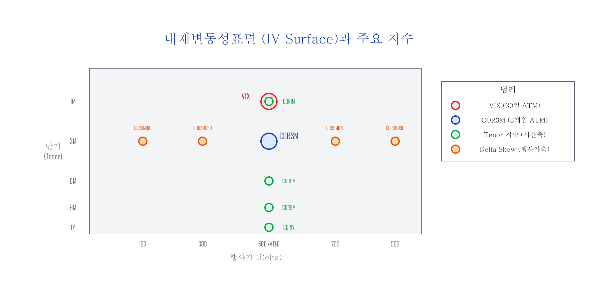
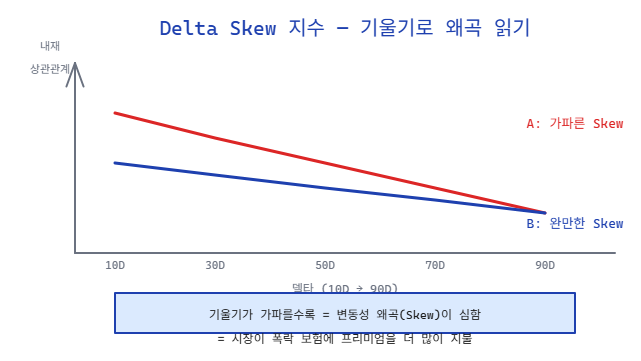
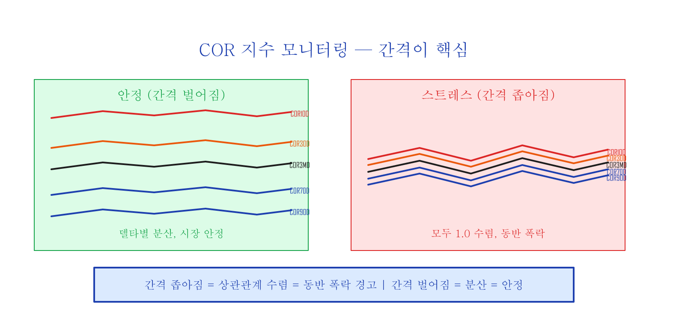
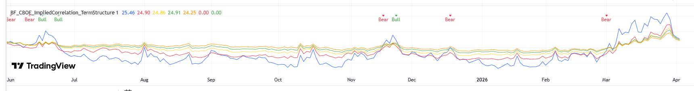

# 시장 심리 변동성 지수 — Implied Correlation과 IV Surface

> 관련 글: [변동성 Skew](skew.md) | [Hedging the Wings](hedging-wings.md)

---

## 30초 요약

이 글에서 다루는 COR 지수들은 **"S&P500 종목들이 얼마나 같은 방향으로 움직이는가"**를 수치화한 것입니다. 평소에는 종목마다 제각각(상관관계 낮음)이지만, 위기가 오면 모든 종목이 한꺼번에 떨어집니다(상관관계 급등). 이 변화를 뉴스보다 빠르게 포착하는 것이 이 지표들의 가치입니다.

## 이 글을 읽기 전에

| 사전 지식 | 수준 | 설명 |
|:---------|:-----|:-----|
| 내재변동성(IV) | 필수 | 옵션 가격에 녹아든 변동성 기대치 |
| VIX | 필수 | S&P500의 30일 IV 지수 |
| [변동성 Skew](skew.md) | 권장 | 지수 옵션의 IV가 왜 비대칭인지 |
| 옵션 기초 (행사가, 델타) | 권장 | Delta Skew 지수 이해에 필요 |

---

## 내재변동성(IV)이란

S&P500 지수 옵션의 **내재변동성(IV: Implied Volatility)**은 SPX 옵션 참여자들이 해당 옵션의 만기일까지 예상하고 암묵적으로 동의한 주식시장의 **"미래 변동성 추정값"**을 나타냅니다.

| 구분 | 설명 |
|:----|:-----|
| **역사적 변동성 (HV/RV)** | 과거 특정 기간 동안 이미 실현된 주가로 계산 |
| **내재변동성 (IV)** | 시장의 모든 정보가 녹아든 후, 옵션 시장 참여자들이 예측하고 동의한 추정값 |

SPX 옵션의 IV를 옵션 시장 참여자들이 동의한 **보험료 가격**이라 생각할 수 있습니다. 모두 상승을 보기 시작하면 call 옵션의 IV가 증가하고, 모두 하락을 보기 시작하면 put 옵션의 IV가 증가합니다.

> 내재변동성표면(IV Surface)을 잘 살펴보고 있으면 뉴스를 보지 않아도, 시황을 읽지 않아도, 남들보다 더 빠르게 시장 참여자들의 의중을 엿볼 수 있지 않을까?

### 왜 이 지표들을 봐야 하는가?

2020년 2월, 뉴스에서 코로나 확산을 본격적으로 다루기 **전에** 옵션 시장에서는 이미 변화가 감지되고 있었습니다. 내재상관관계가 30% 근방에서 60% 이상으로 급등하기 시작했고, 이는 기관 투자자들이 포트폴리오 보험(put 옵션)을 대량 매수하고 있다는 신호였습니다.

뉴스를 따라가면 항상 늦습니다. 옵션 시장의 IV Surface와 COR 지수들은 **기관 투자자의 행동이 먼저 반영**되는 곳이기 때문에, 뉴스보다 빠른 신호를 제공합니다.

---

## 내재변동성표면 (IV Surface)

SPX 옵션의 행사가(Moneyness)를 X축, 만기일(Maturity)을 Y축으로 하여 내재변동성을 그래프로 그리면 **내재변동성표면(IV Surface)**을 얻을 수 있습니다.



이 표면 위의 각 점은 특정 행사가와 만기일 조합의 IV를 나타냅니다. CBOE는 이 표면 위의 다양한 점에서 내재상관관계(Implied Correlation) 지수를 계산합니다.

---

## VIX 지수

**VIX 지수**는 SPX 옵션의 광범위한 OTM 행사가(콜+풋)를 사용하여, **향후 30일간의 기대 변동성**을 계산하는 대표적인 시장 지표입니다. ATM 단일 지점이 아니라 분산스왑(variance swap) 복제 구조를 사용하여 IV Surface의 넓은 영역을 반영합니다. 즉, SPX 지수 옵션 시장 참여자들이 **30일 후 시장의 변동성을 예측하고 암묵적으로 동의한 추정값**입니다.

---

## COR3M 지수 — 3개월 내재상관관계

CBOE에서 2021년 7월 1일 새로 런칭한 지수로, 정식 명칭은 **Cboe 3-Month Implied Correlation Index**입니다.

COR3M은 IV Surface에서 **만기 3개월, ATM(50 델타)** 지점의 내재상관관계를 나타냅니다.

**내재상관관계(Implied Correlation)**란 S&P500 지수 옵션의 IV와 S&P500 상위 50개 종목의 개별 옵션 IV 사이의 상관관계를 0~100% 수치로 표현한 것입니다. 쉽게 말해, 개별 종목들이 얼마나 같은 방향으로 움직이는지를 나타냅니다.

| 시장 상태 | 내재상관관계 | 의미 |
|:---------|:-----------|:-----|
| 상승 추세 | ~30% 근방 | 상승/하락 종목이 혼재, 주도주가 상승 주도 |
| 하락 추세 | 60% 이상 슈팅 | 모든 종목이 다 같이 하락 |

> COR3M은 CBOE 웹사이트(cboe.com)에서 실시간으로 확인할 수 있습니다.

---

## Tenor 지수 — 시간축 확장 (2022년 추가)

COR3M의 성공적인 데뷔에 힘입어, CBOE에서는 2022년 7월 18일 내재상관관계 지수를 대폭 확장했습니다. IV Surface의 **시간축(Tenor)**을 따라 4개, **행사가축(Delta)**을 따라 5개 — 총 9개 지수입니다 (이 중 COR3MD는 기존 COR3M과 동일한 50 델타 기준점).

**4개의 Tenor 지수 (ATM 고정, 만기만 변경):**

| 지수 | 만기 | 행사가 | 용도 |
|:-----|:-----|:------|:-----|
| **COR1M** | 1개월 | 50 델타 (ATM) | 단기 투자 심리 |
| **COR6M** | 6개월 | 50 델타 (ATM) | 중기 투자 심리 |
| **COR9M** | 9개월 | 50 델타 (ATM) | 중장기 투자 심리 |
| **COR1Y** | 1년 | 50 델타 (ATM) | 장기 투자 심리 |

---

## Delta Skew 지수 — 행사가축 확장

**5개의 Delta Skew 지수 (3개월 고정, 행사가만 변경):**

| 지수 | 만기 | 행사가 | 의미 |
|:-----|:-----|:------|:-----|
| **COR10D** | 3개월 | 10 델타 | 깊은 OTM put 영역 |
| **COR30D** | 3개월 | 30 델타 | OTM put 영역 |
| **COR3MD** | 3개월 | 50 델타 | ATM 기준선 |
| **COR70D** | 3개월 | 70 델타 | OTM call 영역 |
| **COR90D** | 3개월 | 90 델타 | 깊은 OTM call 영역 |

S&P500 지수 옵션에는 [변동성 왜곡(Volatility Skew)](skew.md) 현상이 있습니다. 내재상관관계의 Delta Skew 지수들을 한 그래프에 그리면, IV 왜곡의 곡선 모양이 아닌 **거의 직선**으로 표시됩니다.



직선의 기울기가 음의 방향으로 더 가파른 경우(A)가 완만한 경우(B)보다, 내재변동성표면에서 **더 가파른 IV 왜곡**으로 표현됩니다.

---

## 모니터링 — 간격이 핵심



Delta Skew 내재상관관계 지수들의 과거 가격들을 추적할 때, 핵심은 **지수들 사이의 간격**입니다:

- **간격이 벌어지면**: 델타별 상관관계가 분산 → 시장 안정
- **간격이 좁아지면**: 모든 상관관계가 1.0으로 수렴 → 하락 스트레스 (동반 폭락)

아래는 TradingView에서 Tenor COR 지수들(COR1M~COR1Y)을 실시간으로 모니터링하는 차트입니다:



2025년 8~10월 안정 구간에서는 지수들의 간격이 벌어져 있고, 11월과 12월 하락 구간에서는 간격이 좁아지면서 Bear 신호가 발생하는 것을 확인할 수 있습니다.

> COR 지수들은 CBOE 웹사이트에서 실시간 데이터를 확인하거나, TradingView에서 아래 Pine Script로 모니터링할 수 있습니다.

### TradingView Pine Script — BF_CBOE_COR_TermStructure

```pine
//@version=6
indicator("BF_CBOE_COR_TermStructure", overlay=false)

mult = input.float(1.0, "Multiplier", minval=0.1, step=0.1)

cor1m = request.security("CBOE:COR1M", timeframe.period, close) * mult
cor3m = request.security("CBOE:COR3M", timeframe.period, close) * mult
cor6m = request.security("CBOE:COR6M", timeframe.period, close) * mult
cor9m = request.security("CBOE:COR9M", timeframe.period, close) * mult
cor1y = request.security("CBOE:COR1Y", timeframe.period, close) * mult

plot(cor1m, "COR1M", color=color.red, linewidth=2)
plot(cor3m, "COR3M", color=color.orange, linewidth=2)
plot(cor6m, "COR6M", color=color.yellow, linewidth=2)
plot(cor9m, "COR9M", color=color.green, linewidth=2)
plot(cor1y, "COR1Y", color=color.blue, linewidth=2)

// Bull/Bear: term structure inversion
bull = ta.crossunder(cor1m, cor1y)
bear = ta.crossover(cor1m, cor1y)

if bull
    label.new(bar_index, cor1m, "Bull", color=color.green,
              textcolor=color.white, style=label.style_label_down, size=size.small)
if bear
    label.new(bar_index, cor1m, "Bear", color=color.red,
              textcolor=color.white, style=label.style_label_down, size=size.small)
```

### TradingView Pine Script — BF_CBOE_COR_DeltaSkew

```pine
//@version=6
indicator("BF_CBOE_COR_DeltaSkew", overlay=false)

mult = input.float(1.0, "Multiplier", minval=0.1, step=0.1)

cor10d = request.security("CBOE:COR10D", timeframe.period, close) * mult
cor30d = request.security("CBOE:COR30D", timeframe.period, close) * mult
cor3md = request.security("CBOE:COR3M", timeframe.period, close) * mult
cor70d = request.security("CBOE:COR70D", timeframe.period, close) * mult
cor90d = request.security("CBOE:COR90D", timeframe.period, close) * mult

plot(cor10d, "COR10D (10D Put)", color=color.red, linewidth=2)
plot(cor30d, "COR30D (30D Put)", color=color.orange, linewidth=2)
plot(cor3md, "COR3MD (50D ATM)", color=color.yellow, linewidth=2)
plot(cor70d, "COR70D (70D Call)", color=color.green, linewidth=2)
plot(cor90d, "COR90D (90D Call)", color=color.blue, linewidth=2)

// Skew spread background: wider = more stress
skew_spread = cor10d - cor90d
bgcolor(skew_spread > 25 ? color.new(color.red, 85) :
        skew_spread > 20 ? color.new(color.orange, 90) : na)
```

---

## 정리

| 지수 그룹 | 무엇을 보는가 | 핵심 |
|:---------|:------------|:-----|
| **VIX** | 30일 후 변동성 예측 | 시장의 공포 온도계 |
| **COR3M** | 3개월 ATM 내재상관관계 | 종목 분산 vs 동조화 |
| **Tenor (COR1M~1Y)** | 시간축 내재상관관계 | 단기 vs 장기 심리 비교 |
| **Delta Skew (10D~90D)** | 행사가축 내재상관관계 | Skew 가팔라짐 = 하락 스트레스 |

내재변동성표면(IV Surface)은 옵션 시장 참여자들의 집단 심리가 실시간으로 녹아든 지도입니다. COR 지수들은 이 지도의 다양한 지점을 수치화하여, 뉴스보다 빠르게 시장 참여자들의 의중을 읽을 수 있는 도구입니다.

---

*이전 글: [Hedging the Wings](hedging-wings.md) | 관련 글: [변동성 Skew](skew.md)*
