# Inside the Three Models — Prying the Lids Off Three Boxes

*Robot vision · Deep dive, Part 1. If the [overview](stereo-to-grasp.md) told you **what** the boxes do, this piece **opens the lids.***

> **How to read this**
>
> There are exactly two equations here, and both live inside collapsible blocks (▶). You never have to open them — the body reads end to end on pictures and analogies alone. Open one only when you're curious.
>
> If there's an order to it, this is it. [From Stereo Vision to Grasping](stereo-to-grasp.md) gave you the big picture of how a robot *sees*; this piece takes the inside apart. If the coordinate-frame story is what you're after, [Frames and Transforms](frames-transforms.md) has its own home. And if you want to go deeper still, right up to the papers, [Deep dive Part 2 — Model Anatomy](model-anatomy.md) continues from here.

## 1. Four Boxes, Again

Let me stand the big picture up one more time before we start. The pipeline is four questions flowing top to bottom.

There's one thing here you really want to hold onto: **the arrows point one way.** If a box up top puts out a wrong value, the box below has no idea it's wrong — it dutifully takes that value and computes on it. So when the top box, the depth stage that measures "how far away," wobbles, everything downstream wobbles with it.

Look at the dotted line on the right of the diagram, too. The depth that box 1 produces doesn't only feed box 3 (pose estimation); it also becomes the **obstacle map** for box 4 (path planning). That's why depth quality is at once a "do we grip it accurately" question and a "do we avoid a collision" — a **safety** — question.

> **From the floor.** Say forty chrome-plated bolts are tangled together in a bin. A shiny surface, so depth is at its hardest here. If depth comes up even slightly empty, the robot mistakes the spot where a bolt actually sits for "empty space," reaches in, and scrapes the bin wall. Later on we'll unpack, one by one, why this scene happens and how to stop it.

## 2. The Grammar the Three Models Share — 'Conditioning' Instead of 'Training'

The three do completely different jobs, yet they share a design philosophy. The old way retrained **the model** whenever a part changed. One new part meant thousands of photos, labeling, days of GPU time.

Today's foundation models swap that out for **conditioning**. The model has already learned everything it needs; all a new part requires is **one short input** that says, "this time, look at this." What that input *is* is what separates the identities of the three models.

All three handle a new part through an "input," not through "training." So adding a new part number becomes **opening a file**, not **running a training job**.

One point that's easy to miss. Of the three kinds of conditioning, the one **easiest to get hold of on a factory floor** is CAD. You need a drawing to manufacture a part in the first place. FoundationPose's choice to "use CAD as its condition" is, before it's an elegant technical decision, a practical one: **it uses, for free, an asset already lying around the shop.**

> **💡 Why 'zero-shot' works — in one sentence.** None of the three memorized "this object"; they memorized "how objects in general get captured by a camera." How shading falls when a surface curves, how color breaks at an edge, what silhouette a 3D shape leaves when it projects onto 2D. This is **physics** that has nothing to do with a part number, and a simulator can churn that physics out endlessly.
>
> *Zero-shot means the property of just working on things the model never saw once during training.*

## 3. FoundationStereo — How Far Away

Depth is the floor of the pipeline. And this stage is also the only one of the three boxes where **physical law has already fixed the right answer.** So let's start with that law.

### The principle you can check with one finger

Hold a finger up in front of your face and close one eye, then the other, back and forth. The finger jumps a lot, left and right, against the background. Now stretch your arm all the way out and do the same. It moves much less.

That "amount of jump" is the whole thing. When two cameras side by side look at the same object, that object lands slightly shifted horizontally between the left photo and the right photo. This shift is called **disparity**. Close objects shift a lot; far ones barely shift. Measure the disparity and out comes the distance.

If you'd rather see the math (you don't have to open this)

Call the camera spacing B (the baseline), the lens focal length f, and the disparity d. From similar triangles, the depth Z drops right out.

`Z = f × B / d`

Big d means close; small d means far. And because B is an actually-measured distance, the resulting depth comes out in real meters. That's the decisive difference from guessing distance off a single photo (mono), which suffers a "the proportions are right but the true scale is unknown" problem.

There's just one thing to remember: **the closer it is, the more it shifts, and the more precisely you can read that shift, the more accurate the distance.**

### Why it suddenly gets inaccurate as things get farther

You really do want this property in your bones. Double the distance and the error doesn't double — it grows **fourfold**. Triple the distance, ninefold. It doesn't degrade gently; it degrades sharply.

A quick look at the numbers. On a common camera setup, an object at 40 cm gets measured to about 2 mm of error, but point that same camera at something 2 m away and it's off by more than 50 mm. The camera didn't change — only the distance did.

Why it's squared (you don't have to open this)

Differentiate the depth formula `Z = f × B / d` with respect to the disparity d and you get this.

`ΔZ ≈ (Z² / (f × B)) × Δd`

It means the depth error (ΔZ) from misreading the disparity by one pixel (Δd) is proportional to the **square** of the distance Z. That's why doubling the distance quadruples the error.

> **⚠️ The shop-floor takeaway, in three lines.**
> **① Get the camera close to the part.** Halve the distance and the error drops to a quarter. Lowering a bracket 10 cm often beats days of algorithm tuning.
> **② Sub-pixel is free precision.** Read the disparity down to a quarter of a pixel and the error drops to a quarter too. What a good stereo model is really selling is exactly this fineness.
> **③ Don't validate a far-distance spec at a near distance.** Something that worked fine at 50 cm going nine times worse at 1.5 m isn't a malfunction — it's the formula.

### Why we 'rectify' first — turning a 2D search into a 1D one

You have to find where a given point in the left photo lands in the right photo. Do it blindly and you have to search the **entire** right photo. But geometry hands you a gift. If you know how the two cameras are positioned relative to each other, the right-image point matching a given left point **must lie on some straight line.** So we pre-warp the two images to make those lines **run parallel with the horizontal rows.** That's rectification.

Rectification isn't only about speed — it's an **accuracy device** too. If the rectification is off by 0.5 pixel, that error gets added straight onto every disparity. It's why a shaky calibration makes even the best model useless.

### Where the classical method collapses on shiny surfaces

Now you sweep along one horizontal row, scoring "is this the match?" This board of scores, one per candidate disparity, is called the **cost volume**. The answer is the valley where the score is best.

Where there's texture, the score dips distinctly at the correct position. But when the surface is uniform (shiny chrome, a plain painted face), every candidate looks about the same, so no valley forms. The result is a **depth map with a hole punched exactly where the part is.** That's what was really happening in the bolt-bin story from earlier.

> **⚠️ Why swapping cameras doesn't fix it.** This failure is a failure of the **algorithm**, not the **sensor**. Whether RealSense or OAK-D, on-chip stereo mostly uses a classical method called SGM (Semi-Global Matching), and SGM can't produce an answer when the valley above is missing. So buy a pricier camera and you get the same hole in the same place. There's a workaround — spray an infrared pattern to paint on fake texture — but on a shiny surface the pattern scatters and the hole comes back.

### What FoundationStereo added

The core idea is surprisingly human. **A person knows the shape of a chrome kettle even with one eye closed.** Even when two-eye matching fails, you infer shape from **single-image cues** like shading, contour, and perspective. FoundationStereo fuses these two lineages inside one model.

Where the match is certain, matching wins; where it isn't, single-image intuition wins. The plain stretches get filled in by intuition.

The same thing in the paper's terms

**STA (Side-Tuning Adapter)** — a structure that takes the features of a large model already well trained on the single-image-depth side (**Depth Anything V2**) as they are, and bolts them alongside the stereo network. The point is that it **borrows and plugs in someone else's prior knowledge** rather than retraining from scratch.

**AHCF (Attentive Hybrid Cost Filtering)** — the step that cleans up the cost volume. Axis- and plane-oriented convolutions (APC) gather context over a wide range, and attention along the disparity axis (DT) judges "does this candidate make sense with its neighbors?" Its job is to manufacture a valley from context where there wasn't one.

**Iterative refinement** — the process of looking at the score board again from the current disparity estimate and correcting it a little, repeated several times. Cutting the number of iterations makes it faster and less precise, so it works as a **speed-vs-accuracy knob.**

**Training data** — roughly a million synthetic stereo pairs with domain randomization applied (FSD). Presented as an oral at CVPR 2025 and nominated for best paper. The figures are approximate, per public materials.

### Where it still collapses

| Situation | What happens | What to do |
|---|---|---|
| Mirror / transparent parts | It measures the depth of **the reflection**, not the surface | Polarizing filter, change lighting angle, object-aware correction |
| Rectification drift | A constant error is added to every disparity (a global bias) | Periodic recalibration, manage vibration and temperature |
| Repeating texture (grids, threads) | Multiple spots match equally well, so it picks the **wrong valley** | Adjust the baseline, use a wider-context model |
| Occlusion | A band seen by only one eye has, in principle, no answer | Add a viewpoint, mark that region as 'unknown' |
| Overexposure / backlight | Pixel values saturate and the cue itself is lost | HDR, fix shutter/gain, shade the scene |

## 4. SAM 2 — Which Pixels

A depth map is the distance of the **whole** scene. The bin, the fixture, the neighboring part — they're all in there. Unless you point the next stage at "this one," pose estimation will mistake the bin wall for the part. The mask is the form that pointing takes. A mask is a cutout marking "which pixels are the chosen object."

### Heavy work once, light work every time

The most practical decision in SAM's design is **splitting the computation into two lumps.** The heavy job of understanding a photo runs exactly once per photo. The job of reacting to a click is made very light, so people don't have to wait.

This structure is decisive when you have to cut several parts out of the same photo. Cut out five and the heavy computation still runs **just once.** The prompt (the pointing input you give the model) can take three forms — points (include/exclude), a box, or a previous mask — and in practice what works best is "one include point plus one exclude point on the piece that got wrongly attached." Two clicks usually finishes it.

### It doesn't hide the ambiguity

Say you clicked once on a part. The model can't know whether you wanted the **screw head**, the **whole screw**, or the **entire assembly the screw is set into**. That's a shortage of information, not incompetence in the model.

SAM's response is clever. Instead of picking one, it **puts out several candidate masks of different sizes at once and attaches a self-confidence score to each.**

In automatic operation, you just take the top score. In the teaching phase, a person picks the level they want and pins it, and from then on the same part number keeps getting grabbed at that level.

### What SAM 2 added — memory

SAM 1 was single-photo. SAM 2 handles **video.** Rather than clicking again on every frame, **you point once at the start and from then on it follows the object on its own.** That's because it gained a **memory** that holds a summary of the frames it has seen so far.

Here's why this matters on a robot: while the arm moves, the camera viewpoint changes and the part is briefly occluded. Re-detect from scratch on every frame and the **numbering flips**, so it grabs the wrong part. Memory preserves the identity of "that part."

### The only one of the three trained on 'real photos'

Here's the most interesting part. FoundationStereo and FoundationPose learned from simulation, but **SAM learned from real photos.** Why the difference?

The answer is **whether a human can produce the label.** No person can tell whether a pixel's depth is 0.8143 m or 0.8157 m. Nor can they tell how many degrees a part has turned. But **"these pixels are one lump"** — that, a person can tell. Very well, in fact.

SAM grew its data to roughly 11 million photos through a **virtuous loop**: a person makes a label, the model drafts the next label, and the person only corrects it. For depth and pose that road is closed, so those went to simulation.

Facts that matter directly in practice

**License and size** — SAM 2 is Apache-2.0 and comes in four sizes from tiny to large (about 39 million to 220 million parameters). The small ones run comfortably even on an edge board. A short legal review for commercial deployment is a real, practical advantage.

**You can't call it by name in words** — SAM itself has no text input. If you want to point at "the part" with a **word**, you have to put a model that turns text into a box (GroundingDINO, Florence-2, and the like) in front of it, and that combination is called Grounded-SAM.

**The cost it replaces** — in the old days you had to train a detector per part number, and that was what "labeling thousands of photos per part" really amounted to. SAM erases that line item wholesale.

> **⚠️ What SAM doesn't do in bin picking.** When 40 of the same part are tangled in a bin, SAM **does not decide "which one to pick."** It's a cutting tool, not a choosing tool. That choice is usually handled by a separate rule: the topmost one (minimum depth), the most exposed one (maximum mask area), the one the gripper can reach. Another common failure: when the boundary between overlapping parts is ambiguous, the mask bites a little into the neighboring part — and that spreads straight into the next stage as pose error.

## 5. FoundationPose — Where, and How Turned

With depth and a mask in hand, you get the part's 3D cloud of points. But that isn't enough for a robot. It has to know **which way is up** to set the gripper angle.

### Six numbers

The state of a single rigid body sitting in space is fully fixed by six numbers. Three for position and three for orientation. This is 6-DoF (six degrees of freedom). The three positions are intuitive, but **there are several ways to express the three orientations**, and that choice creates real bugs.

| Representation | Numbers | Upside | Trap |
|---|---|---|---|
| Euler angles (roll/pitch/yaw) | 3 | Easy for a human to read | Rotation-order conventions vary · gimbal lock |
| Quaternion | 4 | Smooth, safe interpolation | a quaternion and its negation are the same rotation (sign ambiguity) |
| Rotation matrix | 9 | Composition is simple multiplication | Numerical error breaks orthogonality |

> **⚠️ The bug that actually blows up on the floor.** The pose itself is right, but you connect two systems with **different Euler-angle conventions** and the robot turns the wrong way — that happens far more often than any algorithm problem. At module boundaries, hand things off as quaternions or matrices where you can, and use Euler only on the screen a human reads.

### With CAD and without

That it can run from a few reference photos even on a part with no CAD (a hand-finished casting, a purchased item with no supplier drawing) broadens where you can use it considerably. Either way, there's no retraining.

### Brute but sure, in three steps — render, compare, choose

FoundationPose's method is remarkably intuitive. It **tries "is it this pose?" hundreds of times and picks the one most like the real photo.** This is called render-and-compare.

Without step ② refinement, you'd have to scatter hypotheses much more densely; without step ③ scoring, you'd pick "the best fit" on pixel difference alone and get fooled by glare. Each of the three steps has its role.

Why it's 'which of two is better,' not an 'absolute score'

Measure the difference between the render and the real photo in absolute terms, and lighting, reflection, and sensor noise make **even the correct pose** show a large error. So an absolute judgment like "this pose scores 0.87" doesn't work well. Instead the scoring network is trained to **compare pairs** of candidates. It may not know absolute quality, but the relative ranking is stable.

The training data here is synthetic too. Textures generated by language and diffusion models get applied to a wide variety of 3D models, lighting and background are randomized, and it runs at roughly 600,000 scenes (about 1.2 million images). That's why it's strong on "objects never seen before."

### Only the first frame is expensive — tracking mode

Run hundreds of hypotheses every frame and you don't get real time. So real operation does a **full search only on the first frame, and after that only refines, using the previous pose as the starting point.**

Even if the full recognition takes 2 to 6 seconds, it has little effect on the actual takt time, because this recognition runs in parallel **while the arm is placing the previous part.** The bottleneck is usually not vision but the robot's physical travel.

### Symmetry, a difficulty in principle

A smooth cylinder, a square flange, a plain hex bolt. Parts like these **look completely identical to the camera in several poses.** It's not that the model can't solve it — it's a problem where **the information simply isn't there.**

There are three responses. ① Declare the symmetry axis in the CAD so "this rotation isn't distinguished" is excluded from scoring; ② design the gripper to be indifferent to the symmetry; ③ set the camera angle so **an asymmetric feature is visible** — an engraving, a hole, a marking.

> **💡 A little-known second use — look again while it's in hand.** The instant you grip a part, it **slips slightly** inside the gripper. A few millimeters, a few degrees. If you're only going to pick it, it doesn't matter, but if you have to **place it precisely** (insertion inspection, assembly, seating in a fixture), it's fatal. So after gripping, you bring the part in front of the camera, shoot it once more, and run FoundationPose again. Now you know **how you're holding the part**, and you can correct for exactly that when you place it. Pick accuracy and place accuracy are separate problems, and this re-shoot is the bridge between them.

## 6. Chain the Three — the Error Budget

Each model's paper performance is excellent. But on the floor what matters is **the sum when the three are wired in series**, and error **stacks** top to bottom. And what waits at the end is a physically fixed limit: the gripper's clearance.

Even when each stage is "accurate enough," the sum can exceed the clearance. The example numbers are there to build intuition; the point is that **you have to compare the total against the clearance, not the individual performances.**

> **💡 Where to work first.** Of the error terms, **only one grows as a square — depth.** The rest are mostly linear. So the improvement priority is almost always the same.
> **First — get the camera close to the part.** Nearly free, and it pays back as a square.
> **Second — keep calibration current.** No model, however good, can erase a bias.
> **Third — grow the gripper clearance.** Reshaping the finger pads is often faster than improving recognition by 1 mm.
> **Fourth — model performance.** This is usually not the bottleneck.

## 7. Failure Modes on One Page

A table for working backward from symptom to cause. It's the page you'll reach for most on the floor.

| Symptom | Most common culprit | Check first |
|---|---|---|
| Depth is empty only where the part sits | 1 · Plain / reflective surface | Lighting angle, diffuse light, swap the model |
| Depth is uniformly biased across the whole scene | 1 · Rectification / calibration bias | Checkerboard recalibration, fixture vibration |
| Inaccurate only when things are far | 1 · The distance² law | Lower the camera or widen the baseline |
| It grabs the neighboring part too | 2 · Mask boundary | Add an exclude point, overlap rule, mask erosion |
| It tries to pick a different part every frame | 2 · Unstable tracking numbers | Use SAM 2 memory, pin the selection rule |
| The pose comes out flipped 180° | 3 · Symmetry ambiguity | Declare the symmetry axis, angle so an asymmetric feature shows |
| The pose jitters frame to frame | 3 · Depth-noise propagation | Check stage-1 quality first, use tracking mode |
| It picks fine but places wrong | 3 · Slip inside the gripper | In-hand re-estimation after gripping |
| The pose is right but the robot turns the wrong way | 4 · Rotation-convention mismatch | Euler order, quaternion sign, frame direction |
| It occasionally scrapes the bin wall | 4 · Missing obstacle map | Whether stage-1's hole went to the planner as 'empty space' |

> **⚠️ The bottom row is the scariest.** Interpret a hole in the depth map as "no obstacle" and the planner sees that spot as **empty space it may pass through** — when in reality a part or a bin wall is there. So a 'measurement failure' must always be passed on marked **'unknown,'** and the planner must **treat unknown as an obstacle.** Erring toward safety is the lifeline here.

## 8. The Order to Try It Yourself

Try to stand the whole thing up at once and you'll never know where it went wrong. It's faster to climb with a **visually verifiable output** at each step.

Stage 1 takes a day. And if depth doesn't fill in at stage 1, stages 2 and 3 are meaningless. Prove it first, then climb.

> **📝 A feel for the hardware.** Of the three, **SAM 2 is the lightest** (pick a small size and it's comfortable even on an 8 GB-class edge board), FoundationStereo gets heavier in proportion to resolution and iteration count, and FoundationPose is heavy **only on the first frame.** For deployment you usually optimize with a runtime like TensorRT, and dropping the precision (FP16) speeds things up considerably. The important thing is that it all runs **locally.** A cell with no external network is the premise.

## 9. All of It on One Page

|  | FoundationStereo | SAM 2 | FoundationPose |
|---|---|---|---|
| Question | How far away | Which pixels | Where, and how turned |
| Input | Left & right photos | Photo + click | Depth + mask + CAD |
| Output | Depth map (meters) | Mask | 6-DoF pose |
| How it's conditioned | Geometry (spacing, focal length) | Point · box · previous mask | CAD or reference photos |
| Training data | Synthetic (sim) | Real photos + human/model loop | Synthetic (sim) |
| Core technique | Matching + single-image-cue fusion | Heavy encoder / light decoder + memory | Render-and-compare (hypothesize, refine, score) |
| Main failure | Reflection, transparency, repeating texture | Overlap boundaries · doesn't do the choosing | Symmetry · dependent on depth quality |
| Cost profile | Scales with resolution and iterations | Expensive once per photo | Expensive only on the first frame |

> **In one sentence.** The three models didn't memorize 'this part'; they memorized 'the way objects get captured by a camera,' and so a new part is handled by **input, not training.** The price is that each carries its own failure mode, and what decides the outcome on the floor is not model performance but **fitting the sum of the three errors inside the gripper's clearance.**

### Further reading

- The follow-on [Deep dive Part 2 — Model Anatomy](model-anatomy.md): what shape the tensors flow in and what loss they train against, right up to the papers.
- Same series: [From Stereo Vision to Grasping](stereo-to-grasp.md) · [Frames and Transforms](frames-transforms.md)
- **FoundationStereo** — "Zero-Shot Stereo Matching" (NVIDIA, CVPR 2025). nvlabs.github.io/FoundationStereo
- **SAM 2** — "Segment Anything in Images and Videos" (Meta AI). github.com/facebookresearch/sam2
- **FoundationPose** — "Unified 6D Pose Estimation and Tracking of Novel Objects" (NVIDIA, CVPR 2024 Highlight). nvlabs.github.io/FoundationPose
- **Isaac ROS** — nvidia-isaac-ros.github.io (the package set for running this pipeline in a cell)
- **Webinar** — Vention, "Physical AI: Picking the Impossible Parts with GRIIP" (youtube.com/watch?v=Zl_KhE1_9SM)

### Glossary

- **disparity** — the number of pixels a given point is shifted horizontally between the left and right photos. Larger means closer.
- **baseline (B)** — the distance between the two lenses. It sets the physical ceiling on depth precision.
- **rectification** — the preprocessing that pre-warps the two images so corresponding points land on the same horizontal row.
- **cost volume** — the board of matching scores, one per candidate disparity. The valley is the answer.
- **SGM** — a classical stereo-matching algorithm. Most on-chip stereo uses it, and it punches holes on plain surfaces.
- **sub-pixel** — reading disparity finer than a whole pixel. It ties directly to depth precision.
- **mask / segmentation** — a cutout marking which pixels are the chosen object.
- **prompt** — the input you give a model instead of training, saying "this time, look at this" (click, box, CAD).
- **zero-shot** — the property of working on things never seen during training.
- **6-DoF** — position 3 + orientation 3, the six numbers that fully fix a rigid body's pose.
- **render-and-compare** — the method of drawing the CAD at a hypothesized pose, comparing it against the real photo, and picking the best fit.
- **domain randomization** — the technique of heavily shaking lighting, material, and background per training image so the model can't lean on any particular condition.
- **point cloud** — the cluster of 3D points reconstructed from depth. Used as the obstacle map for path planning.
- **hand-eye calibration** — the procedure of solving, once, for the relationship between the camera frame and the robot frame.

---

*Training-data sizes and paper figures are approximate, per public materials, and the millimeter values in the error budget are examples for building intuition. Actual values depend on the camera, distance, and part. NVIDIA Isaac, FoundationStereo, FoundationPose; Meta Segment Anything (SAM); Vention; Intel RealSense; and Luxonis are trademarks of their respective owners, used for identification only. All diagrams are original.*
