# 세 모델의 안쪽 — 세 상자의 뚜껑을 열어보다

*로봇 비전(robot vision) · 심화 1부. 앞선 [개요편](stereo-to-grasp.md)이 상자들이 **무엇을 하는지**였다면, 이 글은 그 상자의 **뚜껑을 엽니다.***

> **이 글을 읽는 법**
>
> 수식은 딱 두 개 나오는데, 전부 접이식 블록(▶) 안에 넣어뒀어요. 안 펼치셔도 본문은 그림과 비유만으로 끝까지 읽힙니다. 궁금할 때만 열어보세요.
>
> 순서가 있다면 이렇습니다. [스테레오 비전에서 목표물 잡기까지](stereo-to-grasp.md)에서 로봇이 어떻게 *보는지* 큰 그림을 봤고, 이 글에서 그 안을 뜯어봅니다. 좌표계 이야기가 궁금하시면 [좌표계와 변환](frames-transforms.md)이 따로 있어요. 더 깊이, 논문 직전까지 가는 [심화 2부 — 모델 해부](model-anatomy.md)도 이어집니다.

## 1. 다시, 네 개의 상자

큰 그림을 한 번 더 세워두고 시작할게요. 파이프라인은 질문 네 개가 위에서 아래로 흐르는 구조입니다.

여기서 꼭 기억하실 게 하나 있어요. **화살표가 한 방향**이라는 겁니다. 위 상자가 틀린 값을 내면, 아래 상자는 그게 틀린 줄도 모르고 그 값을 성실하게 받아서 계산해요. 그래서 맨 위 상자, 그러니까 "얼마나 먼가"를 재는 깊이 단계가 흔들리면 나머지가 전부 흔들립니다.

그림 오른쪽 점선도 봐주세요. 1번이 만든 깊이는 3번(자세 추정)으로만 가는 게 아니라, 4번(경로 계획)의 **장애물 지도**로도 쓰입니다. 깊이 품질이 "정확히 집느냐"이자 동시에 "부딪히지 않느냐"라는 **안전** 문제인 이유예요.

> **현장 예시.** 통 안에 크롬 도금된 볼트 마흔 개가 뒤엉켜 있다고 해볼게요. 반짝이는 표면이라 깊이 재기가 제일 까다로운 상황입니다. 여기서 깊이가 살짝 비면, 로봇은 볼트가 있는 자리를 "빈 공간"으로 착각하고 손을 뻗다가 통 벽을 긁어요. 뒤에서 이 장면이 왜 생기는지, 어떻게 막는지 하나씩 풀어봅니다.

## 2. 세 모델의 공통 문법 — '학습' 대신 '조건 걸기'

셋은 하는 일이 완전히 다른데도 설계 철학이 같습니다. 예전 방식은 부품이 바뀌면 **모델을 다시 학습**했어요. 새 부품 하나에 사진 수천 장, 라벨링, 며칠의 GPU 시간이 들었죠.

요즘의 파운데이션 모델은 그 자리를 **조건 걸기(conditioning)**로 바꿉니다. 모델은 이미 다 배워놨고, 새 부품마다 필요한 건 "이번엔 이걸 봐"라고 알려주는 **짧은 입력 하나**뿐이에요. 그 입력이 무엇이냐가 세 모델의 정체성을 가릅니다.

셋 다 "학습"이 아니라 "입력"으로 새 부품을 다룹니다. 그래서 신규 품번 추가가 **학습 실행**이 아니라 **파일 열기**가 돼요.

놓치기 쉬운 포인트 하나. 세 조건 중 **공장에서 가장 구하기 쉬운 것**이 CAD입니다. 부품을 만들려면 어차피 도면이 있어야 하니까요. FoundationPose가 "CAD를 조건으로 쓴다"는 선택은 우아한 기술적 결정이기 이전에, **제조 현장에 이미 굴러다니는 자산을 공짜로 쓴다**는 실용적 결정이에요.

> **💡 왜 '제로샷'이 되나 — 한 문장.** 세 모델 모두 "이 물체"를 외운 게 아니라 "물체 일반이 카메라에 어떻게 찍히는가"를 외웠기 때문입니다. 표면이 굽으면 음영이 어떻게 지는지, 경계에서 색이 어떻게 끊기는지, 3D 형상이 2D로 투영되면 어떤 실루엣이 되는지. 이건 부품 번호와 무관한 **물리**고, 그 물리는 시뮬레이터가 무한히 찍어낼 수 있어요.
>
> *제로샷(zero-shot)은 학습에서 한 번도 본 적 없는 대상에도 그냥 통하는 성질을 말합니다.*

## 3. FoundationStereo — 얼마나 먼가

깊이는 파이프라인의 바닥입니다. 그런데 이 단계는 세 상자 중 유일하게 **물리 법칙이 정답을 이미 정해둔** 문제이기도 해요. 먼저 그 법칙부터 짚어볼게요.

### 손가락 하나로 확인하는 원리

손가락을 눈앞에 세우고 한쪽 눈씩 번갈아 감아보세요. 손가락이 배경 위에서 좌우로 크게 튑니다. 이번엔 팔을 쭉 뻗어 같은 걸 해보세요. 훨씬 덜 움직이죠.

이 "튀는 정도"가 전부예요. 카메라 두 대가 나란히 같은 물체를 보면, 그 물체는 왼쪽 사진과 오른쪽 사진에서 가로로 조금 어긋나 찍힙니다. 이 어긋난 양을 **시차(disparity)**라고 불러요. 가까우면 많이 어긋나고, 멀면 거의 안 어긋납니다. 시차만 재면 거리가 나와요.

수식으로 보고 싶다면 (안 펼쳐도 됩니다)

카메라 간격을 B(베이스라인), 렌즈 초점거리를 f, 시차를 d라고 하면, 닮은꼴 삼각형에서 깊이 Z가 바로 떨어집니다.

`Z = f × B / d`

d가 크면 가깝고, d가 작으면 멀어요. 그리고 B가 실제로 측정된 거리라서, 결과 깊이도 실제 미터로 나옵니다. 사진 한 장으로 거리를 짐작하는 방식(모노)이 "비율은 맞는데 실제 크기를 모르는" 문제를 겪는 것과 결정적으로 다른 점이에요.

기억하실 건 하나예요. **가까울수록 많이 어긋나고, 그 어긋남을 정밀하게 읽을수록 거리가 정확해진다.**

### 멀어지면 왜 갑자기 부정확해지는가

이건 반드시 감으로 알아두셔야 하는 성질입니다. 거리가 2배 멀어지면 오차는 2배가 아니라 **4배**로 커져요. 3배 멀어지면 9배고요. 완만하게 나빠지는 게 아니라 확 나빠집니다.

숫자로 잠깐만 볼게요. 흔한 카메라 구성에서 40cm 거리의 물체는 2mm 오차로 재지는데, 같은 카메라로 2m 거리를 재면 50mm 넘게 틀립니다. 카메라는 그대로인데 거리만 멀어졌을 뿐인데요.

왜 제곱인가 (안 펼쳐도 됩니다)

깊이 공식 `Z = f × B / d`를 시차 d에 대해 미분하면 이렇게 됩니다.

`ΔZ ≈ (Z² / (f × B)) × Δd`

시차를 1픽셀 잘못 읽었을 때(Δd) 생기는 깊이 오차(ΔZ)가 거리 Z의 **제곱**에 비례한다는 뜻이에요. 그래서 거리가 2배면 오차는 4배가 됩니다.

> **⚠️ 현장 결론 세 줄.**
> **① 카메라를 부품에 붙이세요.** 거리를 절반으로 줄이면 오차는 4분의 1이 됩니다. 며칠 걸리는 알고리즘 튜닝보다 브래킷을 10cm 내리는 게 효과가 클 때가 많아요.
> **② 서브픽셀이 공짜 정밀도예요.** 시차를 0.25픽셀까지 잘게 읽으면 오차도 4분의 1. 좋은 스테레오 모델이 실제로 파는 게 이 정밀함입니다.
> **③ 먼 거리 사양을 가까운 거리로 검증하지 마세요.** 50cm에서 잘 되던 게 1.5m에서 9배 나빠지는 건 고장이 아니라 공식이에요.

### 왜 '정렬'부터 하는가 — 2차원 탐색을 1차원으로

왼쪽 사진의 어떤 점이 오른쪽 사진의 어디에 있는지 찾아야 합니다. 대책 없이 하면 오른쪽 사진 **전체**를 뒤져야 해요. 그런데 기하학이 선물을 줍니다. 두 카메라의 위치 관계를 알면, 왼쪽의 한 점에 대응되는 오른쪽 점은 **반드시 어떤 직선 위에** 있어요. 그래서 두 이미지를 미리 비틀어 그 직선들이 **가로줄과 나란해지도록** 맞춰둡니다. 이게 정렬(rectification)이에요.

정렬은 속도만이 아니라 **정확도 장치**이기도 합니다. 정렬이 0.5픽셀 틀어져 있으면 그 오차가 모든 시차에 그대로 더해져요. 캘리브레이션이 흔들리면 모델이 아무리 좋아도 소용없는 이유입니다.

### 반짝이는 표면에서 고전 방식이 무너지는 지점

이제 가로줄 하나를 훑으며 "여기가 맞나?" 점수를 매깁니다. 후보 시차마다 매긴 이 점수판을 **코스트 볼륨(cost volume)**이라고 해요. 정답은 점수가 가장 좋은 골짜기입니다.

무늬가 있으면 정답 위치에서 점수가 뚜렷하게 떨어집니다. 그런데 표면이 균일하면(반짝이는 크롬, 민무늬 도장면) 모든 후보가 비슷해서 골짜기가 안 생겨요. 결과는 **부품이 있는 자리에만 뻥 뚫린 깊이 맵**입니다. 아까 볼트 통 이야기의 정체가 이거예요.

> **⚠️ 카메라를 바꿔도 안 낫는 이유.** 이 실패는 **센서**가 아니라 **알고리즘**의 실패입니다. RealSense든 OAK-D든 온칩 스테레오는 대체로 SGM(Semi-Global Matching)이라는 고전 방식을 쓰는데, SGM은 위 골짜기가 없으면 답을 못 내요. 그래서 더 비싼 카메라를 사도 같은 자리에 같은 구멍이 납니다. 적외선 패턴을 뿌려 가짜 무늬를 입히는 우회로가 있지만, 반짝이는 표면에서는 패턴이 산란돼 다시 구멍이 나고요.

### FoundationStereo가 더한 것

핵심 아이디어는 의외로 인간적입니다. **사람은 한쪽 눈을 감아도 크롬 주전자의 형태를 압니다.** 두 눈 매칭이 실패해도 음영·윤곽·원근 같은 **한 장짜리 단서**로 형태를 짐작하죠. FoundationStereo는 이 두 계통을 한 모델 안에서 합칩니다.

매칭이 확실한 곳은 매칭이, 확실하지 않은 곳은 한 장짜리 직관이 이깁니다. 민무늬 구간은 직관이 메워주고요.

논문 용어로 다시 보기

**STA (Side-Tuning Adapter)** — 단일 이미지 깊이 쪽에서 이미 잘 학습된 대형 모델(**Depth Anything V2**)의 특징을 그대로 가져와, 스테레오 네트워크 옆에 붙여 쓰는 구조입니다. 처음부터 다시 학습하지 않고 **남의 사전지식을 빌려 끼운다**는 점이 포인트예요.

**AHCF (Attentive Hybrid Cost Filtering)** — 코스트 볼륨을 다듬는 단계. 축·평면 방향 합성곱(APC)으로 넓은 범위의 문맥을 모으고, 시차 축을 따라 어텐션(DT)을 걸어 "이 후보가 주변과 말이 되는가"를 판단합니다. 골짜기가 없던 구간에 문맥으로 골짜기를 만들어주는 역할이에요.

**반복 정제** — 현재 시차 추정을 기준으로 점수판을 다시 들여다보고 조금씩 고치는 과정을 여러 번 돕니다. 반복 횟수를 줄이면 빨라지고 정밀도가 떨어지는 **속도·정확도 손잡이**로 쓸 수 있어요.

**학습 데이터** — 도메인 랜덤화를 건 합성 스테레오 쌍 약 100만 장 규모(FSD). CVPR 2025에서 오랄로 발표됐고 최우수 논문 노미네이션에 올랐습니다. 수치는 공개 자료 기준의 근사치예요.

### 그래도 무너지는 곳

| 상황 | 무슨 일이 일어나나 | 대응 |
|---|---|---|
| 거울·투명 부품 | 표면이 아니라 **비친 것**의 깊이를 잰다 | 편광 필터, 조명 각도 변경, 물체 인식 기반 보정 |
| 정렬 틀어짐 | 모든 시차에 일정 오차가 더해짐 (전역 편향) | 주기적 재캘리브레이션, 진동·온도 관리 |
| 반복 무늬 (격자·나사산) | 여러 곳에서 똑같이 잘 맞아 **엉뚱한 골짜기** 선택 | 베이스라인 조정, 문맥 범위가 넓은 모델 |
| 가림(occlusion) | 한쪽에만 보이는 띠는 원리적으로 정답 없음 | 시점 추가, 해당 영역을 '모름'으로 표시 |
| 과노출·역광 | 픽셀값이 포화돼 단서 자체가 소실 | HDR, 셔터·게인 고정, 차광 |

## 4. SAM 2 — 어느 픽셀인가

깊이 맵은 장면 **전체**의 거리입니다. 통도, 지그도, 옆 부품도 다 들어 있죠. 다음 단계에 "이것"을 지목해주지 않으면 자세 추정은 통 벽면을 부품으로 착각합니다. 마스크가 그 지목의 형식이에요. 마스크(mask)는 "어느 픽셀이 선택된 물체인지" 표시한 오려내기입니다.

### 무거운 일은 한 번, 가벼운 일은 매번

SAM 설계에서 가장 실용적인 결정은 **계산을 두 덩어리로 쪼갠 것**입니다. 사진을 이해하는 무거운 작업은 사진당 딱 한 번. 클릭에 반응하는 작업은 아주 가볍게 만들어 사람이 기다리지 않게 했어요.

같은 사진에서 부품을 여러 개 잘라내야 할 때 이 구조가 결정적입니다. 다섯 개를 따도 무거운 계산은 **여전히 한 번**이거든요. 프롬프트(모델에 주는 지목 입력)는 점(포함/제외), 박스, 이전 마스크 세 형식으로 줄 수 있는데, 실무에서 제일 잘 먹히는 건 "포함 점 하나 + 잘못 붙은 부분에 제외 점 하나"예요. 두 번 클릭으로 대개 끝납니다.

### 모호성을 숨기지 않는다

부품 위를 한 번 클릭했다고 쳐요. 사용자가 원한 게 **나사 머리**인지, **나사 전체**인지, **나사가 꽂힌 조립체 전체**인지 모델은 알 수 없습니다. 정보 부족이지 모델의 무능이 아니에요.

SAM의 대응이 영리합니다. 하나를 고르는 대신 **서로 다른 크기의 후보 마스크 여러 장을 동시에 내고, 각각에 자기 확신 점수를 붙입니다.**

자동 운전에서는 점수 상위를 그냥 씁니다. 티칭 단계에서는 사람이 원하는 층위를 골라 고정해두면, 이후 같은 품번에서 계속 그 층위로 잡혀요.

### SAM 2가 더한 것 — 기억

SAM 1은 사진 한 장짜리였습니다. SAM 2는 **영상**을 다뤄요. 프레임마다 다시 클릭하는 게 아니라, **처음 한 번 지목하면 그다음부터는 스스로 따라갑니다.** 지금까지 본 프레임의 요약을 담아두는 **메모리**가 생겼기 때문이에요.

로봇에서 이게 왜 중요하냐면, 팔이 움직이는 동안 카메라 시점이 바뀌고 부품이 잠깐 가려집니다. 프레임마다 새로 검출하면 **번호가 뒤바뀌어** 엉뚱한 부품을 집어요. 메모리는 "그 부품"의 정체성을 유지해줍니다.

### 셋 중 유일하게 '진짜 사진'으로 배운 모델

여기가 제일 재미있는 부분이에요. FoundationStereo와 FoundationPose는 시뮬레이션으로 배웠는데, **SAM은 실제 사진으로 배웠습니다.** 왜 다를까요?

답은 **라벨을 사람이 만들 수 있느냐**입니다. 픽셀의 깊이가 0.8143m인지 0.8157m인지는 사람이 못 찍어요. 부품이 몇 도 돌아갔는지도 못 찍고요. 하지만 **"이 픽셀들이 한 덩어리다"**는 사람이 찍을 수 있습니다. 그것도 아주 잘.

SAM은 사람이 라벨을 만들고, 그 모델이 다음 라벨의 초안을 내고, 사람은 고치기만 하는 **선순환**으로 데이터를 약 1,100만 장 사진 규모까지 불렸습니다. 깊이·자세는 그 길이 막혀 있어 시뮬레이션으로 갔고요.

실무에 바로 쓰이는 사실들

**라이선스와 크기** — SAM 2는 Apache-2.0이고, tiny부터 large까지 네 가지 크기(약 3,900만~2억 2,000만 파라미터)로 나옵니다. 작은 쪽은 엣지 보드에서도 편하게 돌아요. 상용 배포에 법무 검토가 짧게 끝나는 것도 현실적인 장점입니다.

**글자로는 못 부른다** — SAM 자체에는 텍스트 입력이 없어요. "부품"이라는 **단어**로 지목하고 싶으면 텍스트를 박스로 바꿔주는 모델(GroundingDINO, Florence-2 등)을 앞에 붙여야 하고, 그 조합을 Grounded-SAM이라고 부릅니다.

**대체되는 비용** — 예전이라면 품번마다 검출기를 학습시켜야 했고, 그게 "부품당 사진 수천 장 라벨링"의 정체였어요. SAM은 그 항목을 통째로 지웁니다.

> **⚠️ 빈 피킹에서 SAM이 안 해주는 것.** 통 안에 같은 부품이 40개 뒤엉켜 있을 때, SAM은 **"어느 것을 집어야 하는가"를 결정해주지 않습니다.** 잘라내는 도구지 고르는 도구가 아니에요. 그 선택은 보통 별도 규칙이 맡습니다. 가장 위에 있는 것(깊이 최소), 가장 많이 드러난 것(마스크 면적 최대), 그리퍼가 접근 가능한 것. 겹친 부품의 경계가 애매할 때 마스크가 옆 부품을 조금 물고 들어오는 것도 흔한 실패고, 이건 다음 단계 자세 오차로 그대로 번집니다.

## 5. FoundationPose — 어디에, 어떻게 돌아가 있나

깊이가 있고 마스크가 있으면 부품의 3D 점 덩어리를 얻습니다. 그런데 로봇은 그걸로 충분하지 않아요. **어느 쪽이 위인지**를 알아야 그리퍼 각도를 정하거든요.

### 여섯 개의 숫자

강체 하나가 공간에 놓인 상태는 숫자 여섯 개로 완전히 정해집니다. 위치 셋과 방향 셋. 이게 6-DoF(six degrees of freedom, 6자유도)예요. 위치 셋은 직관적인데 **방향 셋은 표현 방법이 여러 가지**고, 그 선택이 실제 버그를 만듭니다.

| 표현 | 숫자 | 장점 | 함정 |
|---|---|---|---|
| 오일러 각 (roll/pitch/yaw) | 3 | 사람이 읽기 쉽다 | 회전 순서 규약이 제각각 · 짐벌락 |
| 쿼터니언 | 4 | 매끄럽고 안전한 보간 | q와 −q가 같은 회전 (부호 모호) |
| 회전 행렬 | 9 | 합성이 단순한 곱셈 | 수치 오차로 직교성이 깨짐 |

> **⚠️ 현장에서 실제로 터지는 버그.** 자세 자체는 맞는데 **오일러 각 규약이 서로 다른** 두 시스템을 연결해 로봇이 엉뚱하게 도는 경우가, 알고리즘 문제보다 훨씬 자주 일어납니다. 모듈 경계에서는 되도록 쿼터니언이나 행렬로 주고받고, 오일러는 사람이 보는 화면에서만 쓰는 게 안전해요.

### CAD가 있을 때와 없을 때

CAD가 없는 부품(손으로 다듬은 주물, 공급사 도면이 없는 구매품)에서도 참조 사진 몇 장으로 돌릴 수 있다는 점이 현장 적용 범위를 크게 넓힙니다. 어느 쪽이든 '재학습'은 없어요.

### 무식하지만 확실한 3단 — 찍고, 맞춰보고, 고른다

FoundationPose의 방식은 놀랄 만큼 직관적입니다. **"이 자세일까?"를 수백 번 시도해보고, 실제 사진과 제일 비슷한 걸 고릅니다.** 렌더-비교(render-and-compare)라고 불러요.

②번 정제가 없으면 가설을 훨씬 촘촘히 뿌려야 하고, ③번 채점이 없으면 "제일 잘 맞는 것"을 픽셀 차이로만 골라 반짝임에 속습니다. 세 단계가 각자 역할이 있어요.

왜 '절대 점수'가 아니라 '둘 중 누가 나은가'인가

렌더와 실제 사진의 차이를 절대값으로 재면, 조명·반사·센서 잡음 때문에 **정답 자세조차 큰 오차**를 냅니다. 그래서 "이 자세의 점수는 0.87" 같은 절대 평가는 잘 안 통해요. 대신 채점 네트워크는 후보 **쌍을 비교**하도록 학습됩니다. 절대 품질은 몰라도 상대 순위는 안정적이거든요.

학습 데이터는 여기서도 합성입니다. 다양한 3D 모델에 언어모델·확산모델로 생성한 텍스처를 입히고 조명·배경을 랜덤화해, 약 60만 장면(약 120만 장 이미지) 규모로 돌렸습니다. "본 적 없는 물체"에 강한 이유가 여기 있어요.

### 첫 프레임만 비싸다 — 추적 모드

수백 개 가설을 매 프레임 돌리면 실시간이 안 됩니다. 그래서 실제 운용은 **첫 프레임만 전체 탐색을 하고, 이후에는 직전 자세를 출발점 삼아 정제만** 돌려요.

인식 전체가 2~6초 걸려도 실제 택트 타임에 영향이 적은 이유는, 이 인식이 **팔이 직전 부품을 놓는 동안** 병렬로 돌기 때문입니다. 병목은 대개 비전이 아니라 로봇의 물리적 이동이에요.

### 대칭이라는 원리적 난제

매끈한 원통, 정사각 플랜지, 무지 육각볼트. 이런 부품은 **여러 자세가 카메라에 완전히 똑같이 보입니다.** 모델이 못 푸는 게 아니라 **정보가 원래 없는** 문제예요.

대응은 셋입니다. ① CAD에 대칭 축을 명시해 "이 회전은 구분하지 않는다"고 평가에서 빼기, ② 그리퍼를 대칭에 무관하게 설계하기, ③ 각인·구멍·마킹 같은 **비대칭 특징이 보이도록** 카메라 각도 잡기.

> **💡 잘 안 알려진 두 번째 용도 — 손에 쥔 채 다시 본다.** 부품을 집는 순간 그리퍼 안에서 부품이 **살짝 미끄러집니다.** 몇 mm, 몇 도. 집기만 할 거면 상관없지만 **정확히 놓아야** 한다면(삽입 검사, 조립, 지그 안착) 치명적이죠. 그래서 집은 뒤 부품을 카메라 앞으로 가져와 한 번 더 찍고 FoundationPose를 다시 돌립니다. 그러면 "내가 부품을 **어떻게 쥐고 있는지**"를 알게 되고, 놓을 때 그만큼 보정할 수 있어요. 집기 정확도와 놓기 정확도는 별개의 문제고, 이 재촬영이 그 둘을 잇는 다리입니다.

## 6. 셋을 엮으면 — 오차 예산

모델 각각의 논문 성능은 훌륭합니다. 그런데 현장에서는 **셋을 직렬로 이었을 때의 합**이 중요하고, 오차는 위에서 아래로 **쌓여요.** 게다가 마지막에 기다리는 건 물리적으로 정해진 한계, 그리퍼의 여유 폭입니다.

각 단계가 "충분히 정확"해도 합치면 여유를 넘길 수 있습니다. 예시 숫자는 감을 잡기 위한 것이고, 요점은 **개별 성능이 아니라 합계와 여유를 비교해야 한다**는 거예요.

> **💡 어디를 먼저 손대야 하나.** 오차 항목 중 **제곱으로 자라는 건 깊이 하나뿐**입니다. 나머지는 대체로 선형이고요. 그래서 개선 우선순위는 거의 항상 같습니다.
> **1순위 — 카메라를 부품에 가깝게.** 공짜에 가깝고 효과가 제곱으로 돌아옵니다.
> **2순위 — 캘리브레이션을 최신으로.** 편향은 아무리 좋은 모델로도 못 지워요.
> **3순위 — 그리퍼 여유를 키우기.** 인식을 1mm 개선하는 것보다 손가락 패드 형상을 바꾸는 게 빠를 때가 많습니다.
> **4순위 — 모델 성능.** 대개 여기가 병목이 아니에요.

## 7. 실패 모드 한 장 요약

증상에서 원인을 거슬러 올라가는 표입니다. 현장에서 제일 자주 쓰게 될 페이지예요.

| 증상 | 가장 흔한 범인 | 먼저 확인할 것 |
|---|---|---|
| 부품 자리에만 깊이가 비어 있다 | 1 · 민무늬/반사 표면 | 조명 각도, 확산광, 모델 교체 |
| 깊이가 전체적으로 일정하게 치우쳤다 | 1 · 정렬·캘리브레이션 편향 | 체커보드 재캘리브레이션, 고정부 진동 |
| 멀리 있을 때만 부정확하다 | 1 · 거리² 법칙 | 카메라를 내리거나 베이스라인 확대 |
| 옆 부품까지 같이 잡힌다 | 2 · 마스크 경계 | 제외 점 추가, 겹침 규칙, 마스크 침식 |
| 프레임마다 다른 부품을 집으려 한다 | 2 · 추적 번호 불안정 | SAM 2 메모리 사용, 선택 규칙 고정 |
| 자세가 180° 뒤집혀 나온다 | 3 · 대칭 모호성 | 대칭 축 선언, 비대칭 특징이 보이는 각도 |
| 자세가 프레임마다 떨린다 | 3 · 깊이 잡음 전파 | 1번 품질 먼저 점검, 추적 모드 사용 |
| 집기는 되는데 놓기가 틀린다 | 3 · 그리퍼 내 미끄러짐 | 집은 뒤 in-hand 재추정 |
| 자세는 맞는데 로봇이 엉뚱하게 돈다 | 4 · 회전 규약 불일치 | 오일러 순서, 쿼터니언 부호, 좌표계 방향 |
| 가끔 통 벽을 긁는다 | 4 · 장애물 지도 결손 | 1번의 구멍이 계획기에 '빈 공간'으로 갔는지 |

> **⚠️ 맨 아래 줄이 제일 무섭다.** 깊이 맵의 구멍을 "장애물 없음"으로 해석하면 계획기는 그 자리를 **지나가도 되는 빈 공간**으로 봅니다. 실제로는 부품이나 통 벽이 있는데도요. 그래서 '측정 실패'는 반드시 **'모름'**으로 표시해 전달해야 하고, 계획기는 모름을 **장애물로 간주**해야 합니다. 안전 쪽으로 틀리는 기본값이 여기서는 생명줄이에요.

## 8. 직접 돌려보는 순서

한 번에 전부 세우려다 보면 어디서 틀렸는지 영영 모르게 됩니다. 단계마다 **눈으로 확인 가능한 산출물**을 두고 올라가는 게 빨라요.

1단계는 하루면 됩니다. 그리고 1단계에서 깊이가 안 채워지면 2·3단계는 의미가 없어요. 먼저 증명하고 올라가세요.

> **📝 하드웨어 감각.** 세 모델 중 **SAM 2가 제일 가볍고**(작은 크기를 고르면 8GB급 엣지 보드에서도 편안), FoundationStereo는 해상도와 반복 횟수에 비례해 무거워지며, FoundationPose는 **첫 프레임만** 무겁습니다. 배포할 땐 보통 TensorRT 같은 런타임으로 최적화하고, 정밀도를 낮추면(FP16) 상당히 빨라져요. 중요한 건 전부 **로컬**에서 돈다는 것. 외부망 없는 셀이 전제입니다.

## 9. 한 장으로 다시 보기

|  | FoundationStereo | SAM 2 | FoundationPose |
|---|---|---|---|
| 질문 | 얼마나 먼가 | 어느 픽셀인가 | 어디에·어떻게 돌아가 있나 |
| 입력 | 좌·우 사진 | 사진 + 클릭 | 깊이 + 마스크 + CAD |
| 출력 | 깊이 맵 (미터) | 마스크 | 6-DoF 자세 |
| 조건 거는 법 | 기하(간격·초점거리) | 점 · 박스 · 이전 마스크 | CAD 또는 참조 사진 |
| 학습 데이터 | 합성 (시뮬) | 실사진 + 사람·모델 루프 | 합성 (시뮬) |
| 핵심 기법 | 매칭 + 단일 이미지 단서 융합 | 무거운 인코더 / 가벼운 디코더 + 메모리 | 렌더-비교 (가설·정제·채점) |
| 주요 실패 | 반사·투명·반복무늬 | 겹침 경계 · 선택은 안 해줌 | 대칭 · 깊이 품질 의존 |
| 비용 구조 | 해상도·반복에 비례 | 사진당 1회만 비쌈 | 첫 프레임만 비쌈 |

> **한 문장으로.** 세 모델은 '이 부품'을 외운 게 아니라 '물체가 카메라에 찍히는 방식'을 외웠고, 그래서 새 부품은 **학습이 아니라 입력**으로 처리됩니다. 그 대가로 각자 고유한 실패 모드를 가지며, 현장에서 승부를 가르는 건 모델 성능이 아니라 **세 오차의 합을 그리퍼 여유 안에 넣는 일**이에요.

### 더 읽을거리

- 이어지는 [심화 2부 — 모델 해부](model-anatomy.md): 텐서가 어떤 모양으로 흐르고 어떤 손실로 학습되는지, 논문 직전까지.
- 같은 시리즈 [스테레오 비전에서 목표물 잡기까지](stereo-to-grasp.md) · [좌표계와 변환](frames-transforms.md)
- **FoundationStereo** — "Zero-Shot Stereo Matching" (NVIDIA, CVPR 2025). nvlabs.github.io/FoundationStereo
- **SAM 2** — "Segment Anything in Images and Videos" (Meta AI). github.com/facebookresearch/sam2
- **FoundationPose** — "Unified 6D Pose Estimation and Tracking of Novel Objects" (NVIDIA, CVPR 2024 Highlight). nvlabs.github.io/FoundationPose
- **Isaac ROS** — nvidia-isaac-ros.github.io (이 파이프라인을 셀에서 돌리는 패키지 모음)
- **웨비나** — Vention, "Physical AI: Picking the Impossible Parts with GRIIP" (youtube.com/watch?v=Zl_KhE1_9SM)

### 용어 정리

- **시차(disparity)** — 같은 점이 좌·우 사진에서 가로로 어긋난 픽셀 수. 클수록 가깝다.
- **베이스라인(B)** — 두 렌즈 사이 거리. 깊이 정밀도의 물리적 상한을 정한다.
- **정렬(rectification)** — 대응점이 같은 가로줄에 오도록 두 이미지를 미리 비틀어 맞추는 전처리.
- **코스트 볼륨** — 후보 시차마다 매긴 매칭 점수판. 골짜기가 정답.
- **SGM** — 고전 스테레오 매칭 알고리즘. 대부분의 온칩 스테레오가 쓰며, 민무늬 표면에서 구멍을 낸다.
- **서브픽셀** — 시차를 정수 픽셀보다 잘게 읽는 것. 깊이 정밀도에 직결된다.
- **마스크/분할(segmentation)** — 어떤 픽셀이 선택된 물체인지 표시한 오려내기.
- **프롬프트** — 학습 대신 모델에 "이번엔 이걸 봐"라고 주는 입력(클릭·박스·CAD).
- **제로샷** — 학습에서 본 적 없는 대상에도 통하는 성질.
- **6-DoF** — 위치 3 + 방향 3, 강체의 자세를 완전히 정하는 여섯 숫자.
- **렌더-비교** — 가설 자세로 CAD를 그려보고 실제 사진과 대조해 가장 잘 맞는 것을 고르는 방식.
- **도메인 랜덤화** — 학습 이미지마다 조명·재질·배경을 크게 흔들어, 모델이 특정 조건에 기대지 못하게 만드는 기법.
- **점군(point cloud)** — 깊이로부터 복원한 3D 점 뭉치. 경로 계획의 장애물 지도로 쓰인다.
- **핸드아이 캘리브레이션** — 카메라 좌표계와 로봇 좌표계의 관계를 한 번 구해두는 절차.

---

*학습 데이터 규모·논문 수치는 공개 자료 기준의 근사치이며, 오차 예산의 밀리미터 값은 감을 잡기 위한 예시입니다. 실제 값은 카메라·거리·부품에 따라 달라집니다. NVIDIA Isaac·FoundationStereo·FoundationPose, Meta Segment Anything(SAM), Vention, Intel RealSense, Luxonis는 각 소유자의 상표이며 식별 목적으로만 사용했습니다. 도표는 전부 직접 그렸습니다.*
