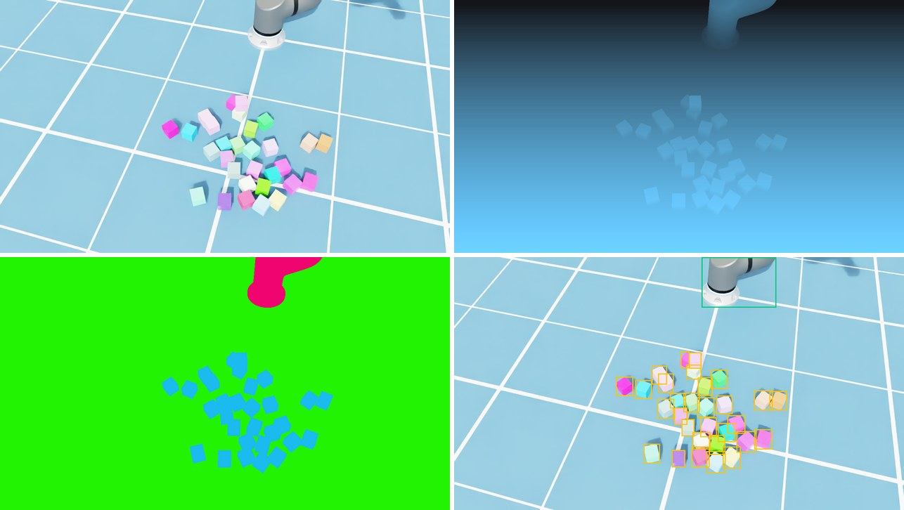
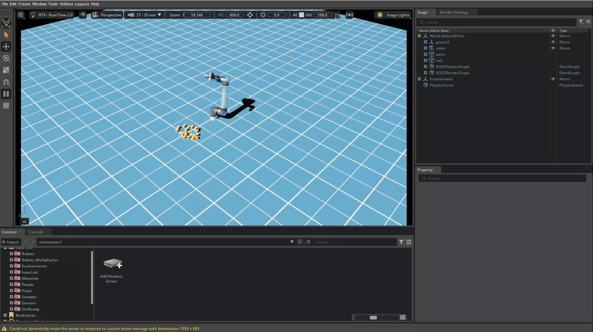

# Putting the Robot's Brain on the Edge — Isaac Sim: A Virtual Work Cell on an RTX 3090 PC and a Cloud GPU

> **Field Notes · Isaac Sim.** URSim in [The Simulators](jetson-ursim-planners.md) imitates the **robot controller**. The driver and protective stops behave like the real thing, but there's no physics, no objects and no camera. That post ended by saying that whether depth drops out on a shiny part, or a gripped part slips, "is Isaac Sim's job". This time I put Isaac Sim on an RTX 3090 PC that was sitting idle, and on a cloud GPU.

The short version: the 3090 PC was enough. The cloud GPU wasn't faster; its value was keeping the PC free and running several machines at once. This post collects the numbers measured along the way and the traps hit.

*(An R&D record done on a PC and in the cloud only, without the edge computer (Jetson). Every robot here is **Isaac Sim's own UR20 model**; no real arm moved.)*

---

## The 30-second version

- **URSim and Isaac Sim stay apart and split the work.** URSim checks the controller path, Isaac Sim checks physics, cameras and synthetic data, and anything that needs both happens on the real robot.
- **An RTX 3090, below the official minimum, was enough.** A UR20, 40 boxes and a virtual stereo camera at the real camera's full resolution ran at 19 frames per second, using under 5 GB of the 24 GB of GPU memory.
- **The 'weak drives' were a test mistake.** Swinging the arm around the all-zero joint pose pressed it into the floor. Starting from a ready pose, the error was about 0.01 rad. The model's mass, torque and speed limits match the real UR20.
- **The virtual camera and arm went out as ROS 2 topics.** To the edge computer they look like a real camera and a real robot. The Windows build's defaults (Jazzy, Zenoh) had to become Humble and Fast DDS, and the UDP buffers had to grow to 16 MB.
- **500 synthetic images at 0.79 seconds each.** But following NVIDIA's examples and toggling rendering off and on per capture leaked about 130 MB of GPU memory per image, and the run died at 170–190 images. Without the toggle, memory stayed flat.
- **The cloud L4 was not faster than the 3090.** On the same test it ran at between half and four-fifths of the 3090's speed, and the bottleneck was the CPU, not the GPU. The cloud is for running in parallel and keeping the PC free, not for speed. The whole validation cost about US$1.45.

---

## Why Isaac Sim: splitting the work with URSim

My first idea was to join the two. Mirror the joint angles URSim computes onto the robot in Isaac Sim, and you'd get the real controller and a realistic view in one go. But that turns Isaac Sim's robot into a **ghost** that just traces the angles it's given. Physics is off, so it passes straight through the boxes, and URSim has no way to know what it hit.

So the work is split. Isaac Sim moves its own UR20 model under physics and covers **the world**: gravity, contact, camera images and depth. URSim, together with the edge computer, covers **the controller path**: the driver, protective stops, speed limits. Anything that needs both, meaning the moment a real controller touches a real object, happens on the real robot, as in [The Real Robot](jetson-real-robot-first-move.md).

There are four jobs for Isaac Sim: making **synthetic training data**; running depth models at full resolution on a big GPU to measure what the edge computer's reduced resolution costs; checking path plans before a real robot; and **software-in-the-loop (SIL)**, feeding virtual camera images to the edge computer. This post lays the groundwork for those.

## A 3090 is below the minimum spec. Is that OK?

Isaac Sim 6.1's official requirements list a GeForce RTX 4080 as the minimum GPU, at least 16 GB of GPU memory, and 32 GB of RAM (64 GB recommended). This PC has an RTX 3090 with 24 GB and 32 GB of RAM, so the GPU sits below the minimum tier. Before buying a new disk or memory, I installed it on Windows and measured.

The test scene imitates the work cell I actually plan to use. A UR20 model moves its six joints in sine waves, 40 boxes drop into a pile on the floor, and two virtual stereo cameras 75 mm apart plus a colour camera stand in for the real camera (an OAK-D). Every frame, images and depth from all three cameras are copied back to the CPU, the same copy a ROS 2 publisher makes. Physics ran at 60 Hz, headless (no window), over 600 frames.

| Camera setting | Frames per second | Peak GPU memory |
|---|---|---|
| No cameras (physics only) | 62.5 | 3.1 GB |
| Stereo 480×288 (the resolution the Jetson's depth model runs at) | 30.6 | 3.5 GB |
| Stereo 640×400 + 720p colour | 27.1 | 3.6 GB |
| Stereo 1280×800 + 1080p colour (the real camera's maximum) | 18.9 | 4.3 GB |

Even the heaviest setting ran at 19 frames per second on under 5 GB of the 24 GB. The below-minimum worry didn't matter for this work. In real use the cameras don't need a frame every physics step, since the depth model on the Jetson runs far slower than 30 times a second. In the SIL section below, physics at 60 Hz and cameras at 30 Hz brought the sim up to 0.93× real time.

## Not weak drives: the floor

The first measurement gave odd numbers. The joints weren't following their commands well. The shoulder was off by 0.126 rad and one wrist by 0.615 rad (about 35°), and in a test that moved every joint by 0.3 rad, the shoulder and elbow didn't move at all. It looked as if Isaac Sim's UR20 model had weak drives.

Checking the model piece by piece, the drives were fine. The link masses matched UR's published values exactly, and the joint torque limits (shoulder 730 Nm vs 738 Nm on the real arm) and speed limits (shoulder 120 °/s) were nearly identical to a real UR20. The problem was the starting pose. With every joint at zero, a UR20's arm sticks out **horizontally** at shoulder height, and turning the shoulder and elbow in the + direction moves it **down**. The sine test swung around exactly that pose, so it was pushing the arm into the floor and the box pile. Holding the arm against gravity takes 328 Nm at the shoulder; the drive was pushing over 700 Nm, because the floor was in the way.

Swinging around a raised ready pose cut the error on every joint to 0.006–0.014 rad, about one 60 Hz step of lag. The same 0.3 rad step finished in about half a second with no error. It's the same lesson as "a floor in every request" in [The Simulators](jetson-ursim-planners.md): when a simulator's numbers look wrong, check **whether the start pose is clear of the floor** before blaming the model.

One more small trap from the same day. The array Isaac Sim's joint-position reader returns isn't a copy; it's a **window onto the simulator's buffer**. The value I saved as the 'start pose' had turned into the 'end pose' by the time the move finished. Anything you want to keep needs a `.copy()`.

## A virtual camera and arm as ROS 2 topics

Next is the PC side of SIL. The goal is for Isaac Sim to publish **data shaped exactly like** what the edge computer now gets from the real camera and robot. Then the edge computer's depth models and path planning see the virtual world without any code changes. On the robot side, `topic_based_ros2_control` makes the joint state and command topics look like ordinary ros2_control hardware, so cuMotion sends trajectories just as it would to a real arm.

This time only the PC side was built, without the edge computer, and checked with a separate topic checker.

| Topic | Content | Actual rate |
|---|---|---|
| `/clock` | simulation clock | ~56 Hz (0.93× real time) |
| `/isaac_joint_states` | joint states | ~56 Hz |
| `/isaac_joint_commands` | joint commands (subscribed) | a +0.300 rad command arrived exactly; no drift on other joints |
| `/oak/left`, `/oak/right` | stereo mono 640×400 | ~28 Hz |
| `/oak/rgb` | colour 1280×720 | ~28 Hz |
| three camera_info topics | lens values; the right camera gives a 75.0 mm baseline | ~28 Hz |

All four stereo topics (left and right images and their camera infos) carried identical timestamps on 224 of 224 frames. A depth model assumes left and right were taken at the same instant; if they drift apart, depth goes wrong.

Here's what got in the way:

- **Isaac Sim 6.1 on Windows defaults to Jazzy and Zenoh for ROS 2.** The edge computer runs Humble on Fast DDS, so out of the box they can't see each other. I set the bundled Humble and `rmw_fastrtps_cpp` explicitly. Also watch out: the bundled setup script only adds its library paths when `ROS_DISTRO` is unset.
- **One frame is 2.7 MB.** A single 1280×720 colour frame is 2.7 MB, and with Fast DDS's default buffers a best-effort subscriber lost about 75% of them. A profile with 16 MB UDP send and receive buffers fixed it. Linux caps `net.core.rmem_max` below that, so the edge computer needs that value raised as well. On the cloud's Linux, with the cap left alone, colour arrived at only 5.7 Hz.
- **The mono stereo pair is built by hand.** Isaac Sim's camera helper only publishes colour. The real camera's stereo pair is mono, so the colour image is converted to brightness and published as mono from Python.
- **The joint-state node must point at the robot's root joint.** Point it at the whole robot and it logs "no matching articulation" every frame and publishes nothing.

The edge computer's side (using sim time, matching topic names, a direct Ethernet link) is the next step. The images run at 50–80 MB per second, so this link belongs on the same LAN, never to a cloud machine across the internet.

## Synthetic data: 0.79 seconds per image

*The four outputs of one capture: colour image, depth (brighter is closer), colour by class, and 2D boxes. The boxes were drawn onto the image for this post from the output data.*

This was **domain randomization**, from [Why Robots Learn in a 'Fake World' First](robot-simulation.md), done for real. Every capture re-drops the boxes and changes their colours, the UR20's pose, the light level and the camera position a little. Then it waits for physics to settle and renders one image. Each capture yields a colour image, depth, a colour-by-class mask (box, robot, floor) and 2D boxes together. Nobody has to draw outlines around 30 boxes by hand; that's the whole point of synthetic data.

On the RTX 3090, 500 images took 0.79 seconds each, about six and a half minutes. But on the way there was a memory leak.

## Memory leaking 130 MB per capture

The first version of the script died at 97 images in the cloud, and at 169 after a driver change. The GPU threw a fault (Xid 31) and the renderer stopped responding. I suspected the cloud driver at first, but the same script run for 500 images on the 3090 died at 188 with **out of GPU memory**. Not the driver, the script.

To find the cause, I removed the suspects one at a time and compared 60-image runs. Without the colour changes, and without the physics wait, memory still grew the same way, from 2.2 GB to 9.9 GB over 60 images, about 130 MB each. But removing **the line that toggles render updates off and on** stopped memory at about 3 GB.

That line is the pattern NVIDIA's synthetic-data examples use: turn render updates off while physics settles so nothing renders, and turn them back on only to capture. In Isaac Sim 6.1, repeating that every capture leaks a little GPU memory each time and uses up 24 GB at 170–190 images. Removing it cost nothing. This script already steps physics in a way that doesn't render, so there was never a reason to toggle. After the fix, all 500 images finished on the 3090 and in the cloud, with flat memory (about 3.0 GB on the 3090, 2.4 GB on the L4). The script now logs GPU memory every 10 images.

The lesson: **some problems only show up in a long run.** The first 10-image test was fine. Synthetic data means tens of thousands of images, so a few-hundred-image test with a memory log is worth it.

## The cloud GPU: not faster

There's only one 3090 PC, and while it makes synthetic data it's hard to use for anything else. So I ran the same work on a cloud GPU.

The GPU choice is constrained first. Isaac Sim needs **RT cores** for rendering, so the A100 and H100, famous for AI training, are not supported (the official requirements say so). It has to be a GPU with graphics hardware: L4, L40S, A10G and the like. On prices checked on 4 October 2026, Google Cloud's L4 spot instance (`g2-standard-8`) was the cheapest at about US$0.51 an hour. Spot means the cloud rents spare capacity cheaply but can take it back at any time. Isaac Sim ran from NVIDIA's published Docker image.

On the same test scene the L4 ran at 49–83% of the 3090's speed. The telling part is that the L4 stalls around 16–20 frames per second whatever the camera resolution. If raising the resolution doesn't slow it down, the GPU isn't the limit: **the CPU (8 virtual cores at 2.2 GHz) is the bottleneck.** The 3090 PC's CPU was simply faster per core. Synthetic data was a little slower too, 0.91 seconds per image against the 3090's 0.79. Joint tracking error matched to three decimal places, so physics came out the same wherever it ran.

So the cloud's value isn't speed. It's for running **several machines at once** to split synthetic-data jobs, or for keeping the 3090 PC free. If you need one faster machine, you have to step up to an L40S-class GPU.

| Item | Cost |
|---|---|
| L4 spot instance, ~2.5 hours | ~US$1.30 |
| 150 GB disk, 2.5 hours | ~US$0.05 |
| Data download (under 1 GB) | ~US$0.10 |
| **Total** | **~US$1.45 (~CAD $2)** |

After validation the instance and disk were deleted, so the ongoing cost is zero. Only a budget alert stays.

### What got in the way in the cloud

Isaac Sim didn't work on the cloud image as-is. Three things needed fixing:

- **Cameras rendered blank.** Google Cloud's GPU image ships a driver for compute only, with no graphics libraries (Vulkan). You have to install the graphics libraries matching the driver version.
- **Installed, but still invisible inside the container.** Docker's usual GPU flag (`--gpus all`) passes only the compute libraries. Register the NVIDIA runtime and pass `--runtime=nvidia` with all driver capabilities (`NVIDIA_DRIVER_CAPABILITIES=all`) to get graphics through.
- **The remote-view server wouldn't start.** Streaming the screen as video needs the GPU's video encoder library, which also wasn't in the image.

The image's 580-series driver did work, but I moved to the 595 series to match Isaac Sim 6.1's requirements (595.58.03 or later on Linux). The first render on a new driver spends about 10 minutes compiling shaders, so saving the compiled cache makes later starts much quicker.

*Isaac Sim in the cloud, viewed from a local PC through NVIDIA's WebRTC streaming client. The arm moved live on screen.*

Even on a cloud server with no screen, you can watch the whole Isaac Sim interface as a video stream. Rather than open the streaming ports to the internet, I installed WireGuard on the server myself and made a private tunnel between it and the local PC, then connected through that. One trap: the streaming server must be told **the address the client will connect to**. If it differs, the connection succeeds but the picture can come up black.

## Wrap-up

| Checked | Result | Snags |
|---|---|---|
| Splitting the work | world in Isaac Sim, controller in URSim, both on the real robot | mirroring URSim turns the Isaac robot into a ghost |
| RTX 3090 PC (below minimum) | 19 fps at the real camera's resolution, under 5 GB | 32 GB of RAM is tight |
| UR20 model | mass, torque, speed limits match the real arm; ~0.01 rad error | the all-zero pose presses the arm into the floor |
| ROS 2 topics | cameras ~28 Hz, joints ~56 Hz, 0.93× real time | Jazzy/Zenoh defaults; 16 MB buffers for 2.7 MB frames |
| Synthetic data | 500 images, 0.79 s each (L4 0.91 s) | the render toggle leaked 130 MB per image |
| Cloud L4 | 49–83% of the 3090, CPU-bound, ~US$1.45 | graphics and encoder libraries, NVIDIA runtime |

- **Measure with what you have before buying anything.** Below the minimum spec can still be enough for the real job.
- **When numbers look wrong, suspect the test before the model.** This time the start pose was inside the floor.
- **Run synthetic data long, with a memory log.** The 10-image test showed no leak.
- **The cloud is for parallel runs, not speed.** Machine for machine, the 3090 PC was faster.
- **Keep the edge-computer link on the same LAN.** Tens of MB of images per second don't belong on the internet.

Next is the edge computer's side: putting the real camera's calibration into the virtual camera, and having the Jetson's depth and pose models take Isaac Sim's images and move the virtual UR20 through cuMotion.

---

Notes — sources for these results, and disclaimers

Figures are **my own measurements** from 4 October 2026 on an RTX 3090 24 GB under Windows 11 (driver 610.88, Isaac Sim 6.1.0 standalone) and on an NVIDIA L4 24 GB in a Google Cloud `g2-standard-8` spot instance (Ubuntu 22.04, drivers 580.178 and 595.91, Isaac Sim 6.1.0 container). Each is one machine and one or two runs, and the cloud machine was a shared spot instance, so read them as tendencies rather than statistics. The virtual camera's field of view and mount are published specs and placeholders; the real camera's calibration isn't in yet. Prices are from each cloud's public price list on 4 October 2026 and vary by region and over time.

GPU, RAM and driver requirements and the lack of support for GPUs without RT cores (A100, H100) are from Isaac Sim's official requirements page; the UR20's mass, torque and speed limits from Universal Robots' published specifications; the render-toggle pattern from NVIDIA Isaac Sim's synthetic-data examples; the ROS 2 setup from Isaac Sim's ROS 2 installation docs. The memory leak was reproduced with this script on Isaac Sim 6.1 and may differ in other versions.

NVIDIA, Isaac Sim, Omniverse, Jetson, cuMotion, RTX and GeForce are trademarks of NVIDIA Corporation; Universal Robots, UR, UR20, URSim and PolyScope of Universal Robots A/S; OAK-D of Luxonis; Google Cloud of Google LLC; Windows of Microsoft Corporation; Docker of Docker, Inc.; WireGuard of Jason A. Donenfeld; ROS of Open Robotics. They are used here for identification only. Fast DDS (eProsima) and Zenoh (Eclipse Foundation) are open-source software.

**Series** · [← Previous: The Simulators — three planners on two URSims](jetson-ursim-planners.md) · [Next: The Memory Budget — perception and motion on one 16 GB Jetson →](jetson-memory-budget.md)

*Related: [Why Robots Learn in a 'Fake World' First](robot-simulation.md) · [The Real Robot](jetson-real-robot-first-move.md) · [Pendant to ROS 2, Part 4: Isaac ROS and cuMotion](isaac-ros-gpu.md) · [Which 3D camera](depth-camera-selection.md) · [Try it: Hands-on Notes (0) — SO-101 and URSim](learn-without-industrial-robot.md)*

### Glossary

- *Isaac Sim*: NVIDIA's robot simulator; computes physics and near-photographic camera images on the GPU
- *URSim*: UR's free virtual controller; it runs the real controller software on a PC
- *Synthetic data*: training images and their answers (depth, class masks, boxes) rendered in a simulator
- *Domain randomization*: changing colours, lighting, positions and so on for every capture so a model doesn't latch onto one look of the fake world
- *SIL (software-in-the-loop)*: testing the real software unchanged by connecting a simulator in place of real sensors and robots
- *Topic*: a named channel that data flows through in ROS 2
- *Fast DDS · Zenoh*: communication layers ROS 2 can use; both ends must match to see each other
- *Headless*: running without a window on screen
- *RT cores*: dedicated GPU circuits that trace light paths; Isaac Sim's rendering needs them
- *Spot instance*: a cloud server rented cheaply from spare capacity that can be reclaimed at any time
- *Shader cache*: rendering programs compiled ahead of time for the GPU; having it makes startup faster
- *WireGuard*: VPN software that builds an encrypted private tunnel between two computers
