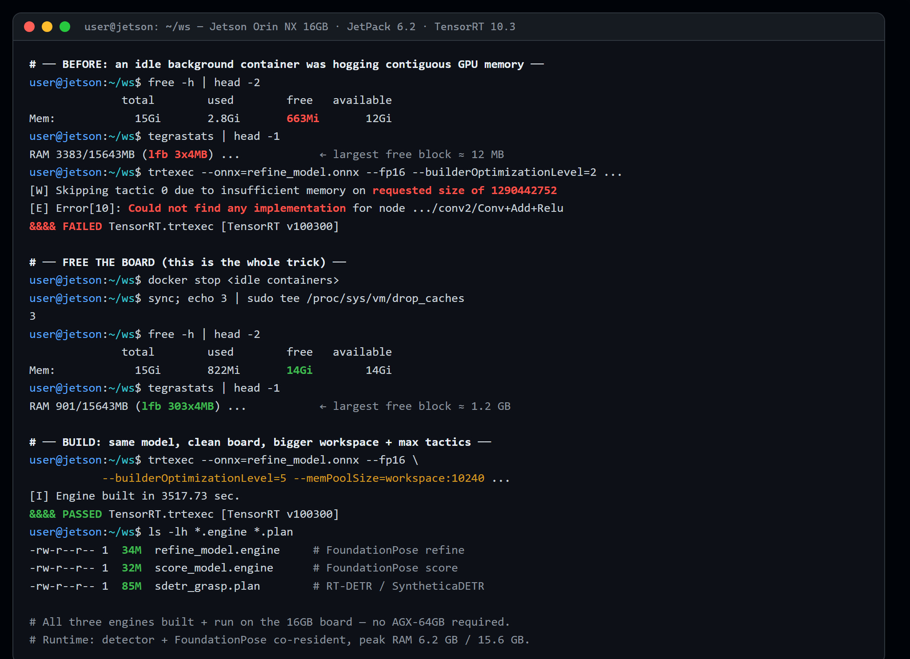
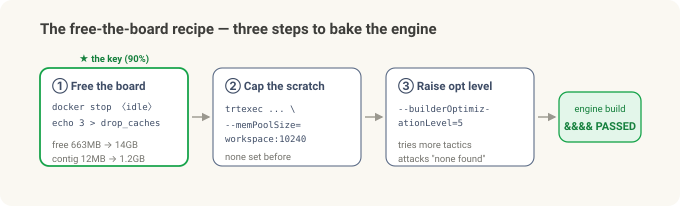
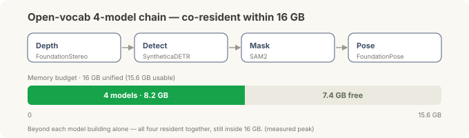

# Putting the Robot's Brain on the Edge — A Correction: Reversing the "16 GB Can't Do It" Verdict

> **Field notes · a correction to the two-part "brain on the edge" series.** In [Part 1](jetson-ros2-setup.md) we brought a bare board up to **ROS 2**; in [Part 2](jetson-isaac-foundation-models.md) we stacked **Isaac ROS** and a foundation-model pipeline on top and proved the "grab a new part with no training" picture. And at the end of Part 2 I wrote: *"The proof is done on 16 GB; production wants the next tier up, an AGX Orin 64 GB."* **This post reverses that verdict.**

Something nagged at me after Part 2. The two heavy models (FoundationStereo, FoundationPose) ran at "walking speed" on the 16 GB edge computer only because the **accelerated engine** (a TensorRT engine — a model pre-baked and optimized for the specific hardware) wouldn't build on 16 GB. So they fell back to a slow, generic path, and I wrote that up as "the 16 GB limit."

Then, digging through the forums, I found **success cases on the same 16 GB board**. So I went back at it. Bottom line: **it works.** On the very same Orin NX 16 GB, the FoundationPose engine builds, and the node puts out a live 6-DoF pose of a never-before-seen object. What I'd taken for a hardware wall was not hardware at all — it was one **memory thief** I hadn't spotted. And once that door opened, the rest — including FoundationStereo, the other model I'd also called "64 GB only" in Part 2 — **came inside the same 16 GB, the whole stack.**

*(As in Parts 1 and 2, this is general edge-R&D experience, not a specific field deployment.)*

---

## The 30-second version

- **Part 2's verdict ("16 GB is proof-only, production needs 64 GB") was an overstatement.** On the same 16 GB, the FoundationPose engine **builds** and the node **runs live**.
- **The real culprit wasn't "not enough memory" — it was "fragmented contiguous memory."** An **idle container I'd forgotten to stop** from an earlier experiment was holding memory, so at build time the largest *contiguous* free block was only ~12 MB (the build requested a ~1.29 GB scratch allocation). Every optimization attempt got skipped, and it looked like "can't build."
- **The recipe: free the board first.** Stop idle containers and drop the page cache and free memory jumps **663 MB → 14 GB**, the largest contiguous block returns **~12 MB → ~1.2 GB**. Add a **workspace cap** (`--memPoolSize`) and a **higher optimization level**, and the engine bakes.
- **Result: ~6.2 GB peak / 16 GB.** Engine build plus a live 6-DoF node — with the detector front-end loaded too — fit inside 16 GB with over 9 GB to spare. The 16 GB wall existed only **at the moment of baking the engine**, not at run time.
- **It's not just FoundationPose — the whole stack runs on 16 GB.** The last holdout, FoundationStereo, fell too (lower resolution + FP32), and the four-model detect → mask → pose chain fits **at 8.2 GB / 16 GB even with all of them resident at once.**
- **Lesson:** "can't build the engine" and "can't run it" are different sentences. And before you blame the hardware, look at **what's eating the memory.**

---

## What I wrote in Part 2 — and why it nagged

Part 2's hardware verdict read:

> The concept is proven on the 16 GB edge computer. The heavy models are at walking speed, but to run the whole thing at speed on one box in production, you want the next tier: an AGX Orin 64 GB.

I gave the reasoning, too: on a Jetson the CPU and GPU share one pool (unified memory — 16 GB total here). To run a big model at full speed you first **bake it into an accelerated engine**, and that **baking step** spikes memory hard, so a small edge computer can't clear the hump.

All of that was correct — the baking step is the hump, and unified memory is tight. What was **wrong was the conclusion, "therefore 16 GB can't do it."** I traced the hump to the hardware's *capacity* but never checked **how empty that 16 GB actually was at that moment.**

## Going back at it — the real culprit was a memory thief

Reopening the build log, the failure was very specific:

```
[W] Skipping tactic 0 due to insufficient memory on requested size of 1290442752
[E] Error[10]: Could not find any implementation for node .../conv2/Conv + Add + Relu
&&&& FAILED
```

`1290442752` is about 1.29 GB. The optimizer wanted that much **scratch memory** for a fast way to run an operation (a *tactic*), didn't have it, skipped it — and eventually **couldn't find any workable way**, so it failed. Capacity is 16 GB. So why?

Watching live memory answered it:

- At startup 13 GB was free, but **while the build ran, only 140 MB was free to the GPU.**
- Worse, the **largest contiguous free block** that Jetson's `tegrastats` reports (`lfb`) was a mere **3×4 MB (~12 MB)** — while the build needed a big contiguous scratch (the log's ~1.29 GB request). It wasn't the total; it was that no large **contiguous** block existed.

The culprit surfaced fast: **a container I'd forgotten to stop** from an earlier experiment had been up for 39 hours, holding ~4 GB and fragmenting memory. That's why six build attempts had all died at the **same spot** for the same reason. Not a hardware wall — a memory thief I never cleared.



*The actual terminal: **BEFORE** (free 663 MB · lfb 3×4 MB · requested 1.29 GB → `&&&& FAILED`) → **free the board** (free 14 GB · lfb 303×4 MB) → **BUILD** (`workspace:10240` + `optLevel=5` → `&&&& PASSED`). refine 34M · score 32M · detector (RT-DETR/SyntheticaDETR) 85M — all three engines come off this one 16 GB board.*

## The recipe — free the board first

Three steps. The first is 90% of it.

1. **Free the board (this is the key).** Stop idle containers; drop the page cache.
   ```
   docker stop <idle containers>
   sync; echo 3 | sudo tee /proc/sys/vm/drop_caches
   ```
   → free **663 MB → 14 GB**, largest contiguous block **3×4 MB → 303×4 MB (~1.2 GB)**. Before a build, **check** that `tegrastats`' `lfb` is large and `free -h` shows > 12 GB.
2. **Give it a workspace cap.** Tell the baking tool it has generous scratch.
   ```
   trtexec --onnx=refine_model.onnx --fp16 \
           --builderOptimizationLevel=5 \
           --memPoolSize=workspace:10240      # 10 GB scratch
   ```
   The earlier failing attempt set **no** such cap at all.
3. **Raise the optimization level.** `--builderOptimizationLevel=5` (max) tries more tactics — attacking "couldn't find any implementation" head-on. Earlier runs were at a lower level.



With that combination the **engine baked.** Both FoundationPose pieces (refine and score) came out as proper engine files, and the "couldn't find any implementation" error was gone.

## So what actually runs — engine build + live node

Once the engine bakes, the rest falls into place.

- **The FoundationPose node runs live.** It takes camera input and puts out a never-before-seen object's 6-DoF pose frame by frame. With the engine prebuilt, the "memory blows up while baking" hump from Part 2 simply isn't there.
- **Peak memory ~6.2 GB / 16 GB (with the detector front-end loaded too).** Over 9 GB to spare. In other words, **the 16 GB wall existed only at the "bake the engine" moment, never at run time.** That's the one-line takeaway — *can't build the engine ≠ can't run it.*
- The **detector front-end** that tells the pipeline *where* the object is (whether a closed-set one or a language-promptable open-vocabulary one) also fits on the same board **alongside** FoundationPose, inside 16 GB — the three engines in the capture above are exactly that (~6.2 GB peak). Which detector you pick is a topic for a later post.

**Speed is still "walking pace"** — heavy transformers, a few seconds per frame. But as Part 2 said, if a pick can take a few seconds, that's fine. What changed isn't "16 GB can't even do this"; it's "**16 GB runs it on the proper path (the engine), too.**"

## And all the rest — the whole stack runs on 16 GB

Once that one door opened, the remaining pieces fell in turn — including **FoundationStereo** (stereo images → depth), the *other* heavy model I'd also labeled "needs 64 GB" in Part 2.

This one is honestly a notch subtler. FoundationStereo wouldn't bake even after I freed the board. The log showed that this time memory really was short — one operation asked for **a single ~7.4 GB contiguous scratch**, which isn't the "fragmentation" from before but a genuinely tough ask for 16 GB. So there were **two different flavors of the 16 GB wall**: FoundationPose was fragmentation (fixed by cleaning), FoundationStereo a real capacity hump.

This time the fix wasn't cleaning but **input size and precision**:

- **Lower the resolution.** 480×640 → **288×480** (the size NVIDIA recommends for Jetson). That alone shrank the ~7.4 GB request to **~187 MB**.
- **FP32 instead of FP16.** This model's docs say FP16 conversion is blocked, so FP32 was the right answer, not a fallback.
- **Skip the post-build benchmark** (`--skipInference`) — bake and save the engine only.

Result: **a 258 MB engine, ~2 h build, running ~1.97 s/frame @ 5.95 GB peak — 5× faster than the no-engine path (~9.8 s).** The last piece, too, runs on its proper path inside 16 GB.

At that point the picture was complete. **Depth (FoundationStereo) · detection (SyntheticaDETR) · mask (SAM2) · pose (FoundationPose)** — plus ESS and cuMotion — the whole stack builds and runs on this one board.

And the number I really wanted: **do all four fit in 16 GB at once?** They do. With the four models of the open-vocab chain (detect → mask → pose) **all resident simultaneously**, peak was **8.2 GB / 16 GB**, over 7 GB to spare (measured). Beyond each piece working on its own, they **fit together** inside 16 GB.



Two honest footnotes:

- The **language-promptable open-vocabulary detector** (e.g. Grounding DINO) loads and co-runs on 16 GB, but the currently-published deployable checkpoint localized poorly — a **model (checkpoint) limitation, not the board**. For fixed, known parts a closed-set detector (SyntheticaDETR) is the production answer; open-vocab is a flexibility option.
- Whether the mask came from real SAM2 or a box-shaped rectangle, **the final pose moved by only ~1 mm / ~1°** — once the region of interest is roughly right, the back end (FoundationPose) finishes the job with depth.

## Why this digging was worth it

Three lessons, all traps I'll hit again.

- **"Can't build the engine" and "can't run it" are different problems.** Baking demands a big contiguous chunk for a moment; running doesn't. Give up on the second because the first is blocked, and you write down "impossible" for something that works (which is exactly what I did in Part 2).
- **Before blaming the hardware, look at how empty those 16 GB actually are right now** — not the total, but the **largest contiguous block** (`tegrastats lfb`). Idle containers and zombie processes fragment memory quietly; the total alone will never show it.
- **Re-verify forum success cases "on your own image."** Someone else succeeding doesn't guarantee you will, and someone else hitting a wall doesn't guarantee you will either. This post *is* that re-verification — I saw "it works" on the forums, went at it, and confirmed it on my own board: **one more success case.**

## Hardware verdict — rewritten

Correcting Part 2's hardware table:

| Edge computer | What Part 2 said | Now |
| --- | --- | --- |
| **Orin NX 16 GB** (the one we have) | Proof-of-concept; production is the next tier | ★ **Handles non-real-time production too** (a pick can take a few seconds). Free the board → engine builds + node runs live |
| **AGX Orin 64 GB** | Production, the answer | **For headroom / real-time / full resolution.** A choice when you need it, not a must-have to run |

- **Orin NX 16 GB** (roughly $800–1,400) — beyond *it runs*, it carries a **non-real-time production** load where a pick can take a few seconds. The lever isn't capacity; it's the **operational habit of keeping the board clear at build time.**
- **AGX Orin 64 GB** ($1,999) — when you need real-time, or headroom for full resolution and full speed. (FoundationStereo builds on 16 GB too — you just have to drop the resolution, and 64 GB removes that constraint.) **"You must have 64 GB to bake and run the engine" is now simply false.**

Prove *whether it works* cheaply first, then step up when you need to — that's what Part 2 said. This time I went one step further: it turns out that cheap board clears the production bar too, and what had been blocking it was not hardware but one memory thief I never cleared. The practical ladder for edge AI starts a rung lower than I thought.

> **Note — wouldn't upgrading to JetPack 7 / Isaac ROS 4.0 help?** Not on the Orin NX 16 GB. JetPack 7.2 does support the Orin NX, but **Isaac ROS 4.0 is Thor-first** — NVIDIA's recommended stack for the Orin NX 16 GB is still **Isaac ROS 3.2 / JetPack 6.2**. And 4.0's foundation models are heavier, so the 16 GB baking hump gets tighter, not looser, with little Orin-NX precedent (most testing is on Thor's larger memory). Newer isn't automatically better; on this board, staying on the proven 3.2 / 6.2 is the safe call.

---

## In summary

| | Part 2 | Now (corrected) |
| --- | --- | --- |
| **Engine build (16 GB)** | No → needs 64 GB | ✅ Yes — free the board + workspace cap + higher level |
| **Live node (16 GB)** | (walking speed, no engine) | ✅ Live 6-DoF, ~6.2 GB peak (with detector) |
| **Whole stack (16 GB)** | (only looked at FoundationPose) | ✅ depth·detect·mask·pose all build+run, **4 models co-resident 8.2 GB** |
| **Real cause** | "unified memory is tight" | An idle container **fragmenting contiguous memory** (not the total) |
| **Hardware** | Proof 16 GB / production 64 GB | **Non-real-time production on 16 GB too**; 64 GB for headroom/real-time |

**The one thing to remember:** sometimes the wall isn't a wall. This time it wasn't hardware capacity but the **contiguous memory at build time**, and clearing the board alone fixed it. Before you move "can't build the engine" over to "this hardware can't do it," read one line — the largest contiguous block in `tegrastats`. That's what this round of digging bought.

---

<details>
<summary>Notes — evidence and disclaimer</summary>

The numbers (free memory, contiguous-block size, peak RAM, whether the engine builds) are **values I measured directly in this R&D**; they vary with software versions and settings (Isaac ROS 3.2, JetPack 6.2 line, TensorRT 10.3, max-power mode) and over time. Edge-computer prices are approximate public list figures.

This post is **one more reproduction, on my own board, of success cases already public in the community and forums.** The build recipe (free the board, cap the workspace, raise the optimization level) and the failure diagnosis lean on NVIDIA's public TensorRT and Isaac ROS docs and public NVIDIA Developer Forum threads; check the latest docs for each model and tool before deploying.

This is general edge-R&D experience, not a specific field deployment. Jetson, Orin, AGX, JetPack, Isaac ROS, TensorRT, and CUDA are NVIDIA's; other product names are their respective owners' — used for reference only.

</details>
