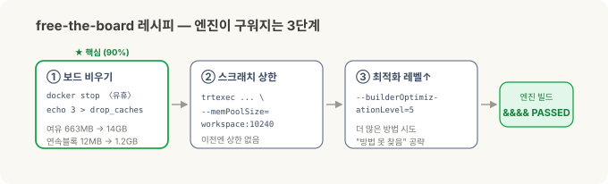

# 로봇의 뇌를 엣지에 올리기 — 정정편: 16GB로 안 된다던 그 결론, 뒤집었습니다

> **현장 노트 · '로봇의 뇌를 엣지에' 2부작의 정정편.** [1부](jetson-ros2-setup.md)에선 맨 보드에 JetPack과 **ROS 2**를 올렸고, [2부](jetson-isaac-foundation-models.md)에선 그 위에 **Isaac ROS**와 파운데이션 모델 파이프라인을 얹어 "학습 없이 새 부품을 잡는" 그림을 증명했습니다. 그리고 2부 끝에서 이렇게 적었죠 — *"증명은 16GB로 끝났고, 실전용은 다음 칸 AGX Orin 64GB다."* **이 글은 그 결론을 뒤집는 정정입니다.**

2부를 쓰고 나서도 마음 한구석이 걸렸습니다. 무거운 두 모델(FoundationStereo·FoundationPose)이 16GB 엣지 컴퓨터에서 "걷는 속도"로 동작한 건, 하드웨어에 맞춰 미리 최적화해 굽는 **가속 엔진**(TensorRT 엔진)이 16GB에서 안 만들어졌기 때문이었습니다. 그래서 엔진 없는 느린 범용 경로로 동작했고, 저는 그걸 "16GB의 한계"로 적었어요.

그런데 포럼을 뒤지다 보니 **같은 16GB 보드에서 되더라는 성공 사례**가 있었습니다. 그래서 다시 붙었습니다. 결론부터 — **됩니다.** 같은 Orin NX 16GB에서 FoundationPose 엔진이 구워지고, 노드가 처음 보는 물체의 6-DoF 자세를 라이브로 내놓습니다. 벽인 줄 알았던 건 하드웨어가 아니라 제가 못 본 **메모리 도둑** 하나였어요.

*(1·2부와 마찬가지로, 이건 특정 현장 배치가 아니라 일반적인 엣지 R&D 경험입니다.)*

---

## 30초 요약

- **2부 결론("16GB는 증명, 실전은 64GB")은 과장이었다.** 같은 16GB에서 FoundationPose 엔진이 **빌드되고**, 노드가 **라이브로 동작**한다.
- **진짜 범인은 "메모리 부족"이 아니라 "연속 메모리 조각남".** 이전 실험에서 **꺼두지 않은 유휴 컨테이너 하나**가 메모리를 붙들고 있어서, 엔진을 굽는 순간 가장 큰 **연속** 여유 블록이 ~12MB밖에 없었다(빌드가 요청한 스크래치는 ~1.29GB). 그래서 최적화 시도가 전부 건너뛰기 되고 "빌드 불가"로 보였다.
- **레시피: 보드부터 비운다.** 유휴 컨테이너를 끄고 페이지 캐시를 비우면 여유 메모리가 **663MB → 14GB**, 가장 큰 연속 블록이 **~12MB → ~1.2GB**로 돌아온다. 여기에 **워크스페이스 상한**(`--memPoolSize`)과 **최적화 레벨 상향**을 얹으면 엔진이 구워진다.
- **결과: 피크 ~6.2GB / 16GB.** 엔진 빌드 + 노드 라이브 6-DoF가, 검출 앞단까지 함께 올려도 9GB 넘게 여유를 두고 16GB 안에 들어온다. 16GB의 벽은 **엔진을 굽는 순간**에만 있었지, 실행에는 없었다.
- **교훈:** "엔진을 못 굽는다"와 "못 실행한다"는 다른 말이다. 그리고 하드웨어를 탓하기 전에 **뭐가 메모리를 먹고 있는지** 먼저 보라.

---

## 2부에서 내가 적은 것 — 그리고 왜 걸렸나

2부의 하드웨어 결론은 이랬습니다.

> 개념은 16GB 엣지 컴퓨터로 증명이 끝났다. 무거운 모델은 걷는 속도지만, 실전에서 한 대로 제 속도를 내려면 다음 칸 AGX Orin 64GB다.

근거도 적었습니다 — 젯슨은 CPU와 GPU가 메모리를 함께 씁니다(통합 메모리, 여기선 다 합쳐 16GB). 큰 모델을 최고 속도로 실행하려면 먼저 **가속 엔진**으로 구워야 하는데, 이 **굽는 과정**이 순간적으로 메모리를 크게 먹어서 작은 엣지 컴퓨터가 그 고비를 못 넘는다고요.

여기까지는 맞았습니다. 굽는 순간이 고비인 것도, 통합 메모리가 좁은 것도. **틀린 건 "그래서 16GB로는 불가능하다"는 결론**이었어요. 고비의 원인을 하드웨어 용량으로만 봤지, **그 16GB가 그 순간 실제로 얼마나 비어 있었는지**는 안 봤거든요.

## 다시 붙어서 본 것 — 진짜 범인은 메모리 도둑

엔진 빌드 로그를 다시 열어 보니 실패가 아주 구체적이었습니다.

```
[W] Skipping tactic 0 due to insufficient memory on requested size of 1290442752
[E] Error[10]: Could not find any implementation for node .../conv2/Conv + Add + Relu
&&&& FAILED
```

`1290442752`는 약 1.29GB. 최적화 도구가 그 연산을 빠르게 만들 방법(tactic)에 그만한 **작업용 메모리(scratch)를 요청했는데 모자라** 건너뛰고, 결국 **쓸 수 있는 방법을 하나도 못 찾아** 실패한 겁니다. 용량 자체는 16GB인데, 왜?

살아 있는 메모리 상태를 봤더니 답이 나왔습니다.

- 시작할 땐 13GB가 비어 있었는데, **빌드가 도는 중에는 GPU가 쓸 수 있는 여유가 140MB뿐**이었어요.
- 게다가 젯슨의 `tegrastats`가 보여주는 **가장 큰 연속(contiguous) 여유 블록**(`lfb`)이 겨우 **3×4MB(~12MB)**. 굽는 도구는 그만한 큰 스크래치(로그상 ~1.29GB)를 붙여서 잡아야 하는데, 12MB 조각으로는 어림없었죠. 총량이 아니라 **연속으로 붙은 블록**이 없어서 막힌 겁니다.

범인은 곧 드러났습니다. **이전 실험에서 꺼두는 걸 깜빡한 컨테이너 하나**가 39시간 동안 떠서 약 4GB를 붙들고 있었어요. 그게 메모리를 잘게 조각내면서, 여섯 번의 빌드 시도가 **전부 같은 지점**에서 같은 이유로 죽었던 겁니다. 하드웨어 벽이 아니라, 제가 안 치운 **메모리 도둑**이었죠.


*실제 터미널: **BEFORE**(free 663MB · lfb 3×4MB · requested 1.29GB → `&&&& FAILED`) → **보드 비우기**(free 14GB · lfb 303×4MB) → **BUILD**(`workspace:10240` + `optLevel=5` → `&&&& PASSED`). refine 34M · score 32M · 검출기(RT-DETR/SyntheticaDETR) 85M — 세 엔진이 모두 이 16GB 보드에서 나온다.*

## 레시피 — 보드부터 비운다

정리하면 세 단계입니다. 첫 단계가 90%예요.

1. **보드를 비운다 (이게 핵심).** 유휴 컨테이너를 끄고, 페이지 캐시를 비운다.
   ```
   docker stop <idle containers>
   sync; echo 3 | sudo tee /proc/sys/vm/drop_caches
   ```
   → 여유 **663MB → 14GB**, 가장 큰 연속 블록 **3×4MB → 303×4MB(~1.2GB)**. 빌드 전에 `tegrastats`의 `lfb`가 크고 `free -h`가 12GB 넘는지 **꼭 확인**하세요.
2. **작업용 메모리 상한을 준다.** 굽는 도구에 넉넉한 스크래치를 명시한다.
   ```
   trtexec --onnx=refine_model.onnx --fp16 \
           --builderOptimizationLevel=5 \
           --memPoolSize=workspace:10240      # 10GB 스크래치
   ```
   이전 실패한 시도는 이 상한을 **아예 안 줬습니다.**
3. **최적화 레벨을 올린다.** `--builderOptimizationLevel=5`(최대). 더 많은 방법을 시도하니 "쓸 방법을 못 찾음"을 정면으로 공략합니다. 이전엔 낮은 레벨이었어요.



이 조합으로 **엔진이 구워졌습니다.** FoundationPose의 두 조각(refine·score)이 각각 제대로 된 엔진 파일로 나왔고, "쓸 방법을 못 찾음" 에러는 완전히 사라졌어요.

## 그래서 무엇이 되나 — 엔진 빌드 + 노드 라이브

엔진이 구워지면 그다음은 술술 풀립니다.

- **FoundationPose 노드가 라이브로 동작합니다.** 카메라 입력을 받아 처음 보는 물체의 6-DoF 자세를 프레임마다 내놓아요. 미리 구운 엔진을 얹으니, 2부에서 겪은 "굽느라 메모리가 터지는" 고비 자체가 없습니다.
- **피크 메모리 ~6.2GB / 16GB (검출 앞단까지 함께).** 9GB 넘게 남습니다. 즉 **16GB의 벽은 "엔진을 굽는 순간"에만 있었지, 실행에는 처음부터 없었어요.** 이게 이 글의 한 줄 요약입니다 — *엔진을 못 굽는다 ≠ 못 실행한다.*
- 물체가 "어디 있는지" 찾아 주는 **검출 앞단**(닫힌집합형이든, 말로 지시하는 개방어휘형이든)까지 같은 보드에서 FoundationPose와 **함께** 올라옵니다 — 위 캡처의 엔진 셋이 그것(피크 ~6.2GB). 검출기 종류별 깊은 얘기는 다음 글감으로.

**속도는 여전히 "걷는 속도"입니다** — 무거운 트랜스포머라 프레임당 몇 초. 하지만 2부에서도 말했듯, 픽(집기) 한 번이 몇 초 걸려도 되는 일이라면 문제될 게 없어요. 달라진 건 "16GB에선 이것도 못 한다"가 아니라 "**16GB로도 제 경로(엔진)로 동작한다**"는 사실입니다.

## 왜 이 삽질이 값나가나

세 가지를 배웠습니다. 셋 다 다음에 또 걸릴 함정이에요.

- **"엔진을 못 굽는다"와 "못 실행한다"는 다른 문제다.** 굽기는 순간적으로 큰 연속 메모리를 요구하고, 실행은 그렇지 않습니다. 하나가 막혔다고 다른 하나까지 포기하면, 되는 걸 안 된다고 적게 됩니다(제가 2부에서 그랬죠).
- **하드웨어를 탓하기 전에 "지금 그 16GB가 실제로 얼마나 비어 있나"를 본다.** 총량이 아니라 **가장 큰 연속 블록**(`tegrastats lfb`)을요. 유휴 컨테이너·좀비 프로세스가 메모리를 조각내는 건 조용해서, 총량만 보면 절대 안 보입니다.
- **포럼 성공 사례도 "내 이미지에서" 다시 확인한다.** 남이 됐다고 내 환경에서 무조건 되는 건 아니고, 남이 막혔다고 내 환경에서 무조건 막히는 것도 아닙니다. 이 글 자체가 그 재확인의 결과예요 — 포럼에서 "된다"를 보고 붙어서, 내 보드에서도 되는 걸 확인한 **또 하나의 성공 사례**.

## 하드웨어 결론 — 다시 씁니다

2부의 하드웨어 표를 정정합니다.

| 엣지 컴퓨터 | 2부에서 적은 것 | 지금 |
| --- | --- | --- |
| **Orin NX 16GB** (우리가 가진 것) | 증명용. 실전은 다음 칸 | ★ **비실시간(픽 한 번 몇 초) 실전까지 된다.** 보드만 비우면 엔진 빌드+노드 라이브 |
| **AGX Orin 64GB** | 실전용, 정답 | **여유·실시간·풀해상도용.** 필요할 때의 선택이지, "돌리려면 반드시"는 아님 |

- **Orin NX 16GB** (대략 $800~1,400) — 파이프라인이 *동작한다*를 넘어, 픽 한 번이 몇 초 걸려도 되는 **비실시간 실전**까지 감당합니다. 관건은 용량이 아니라 **빌드 순간 보드를 비워 두는 운영**이에요.
- **AGX Orin 64GB** ($1,999) — 실시간이 필요하거나, 풀해상도 메시·더 무거운 모델(FoundationStereo 같은)의 빌드 여유가 필요할 때. **"엔진을 굽고 돌리려면 반드시 64GB"는 이제 틀린 말**입니다.

값싸게 '되는지'부터 증명하고 필요할 때 올라타는 것 — 2부에서 그렇게 적었죠. 이번엔 한 발 더 나갔습니다. **알고 보니 그 값싼 보드가 실전 문턱도 넘더라는 것**, 그리고 그걸 막고 있던 게 하드웨어가 아니라 안 치운 메모리 도둑 하나였다는 것. 엣지 AI의 현실적인 사다리는 생각보다 한 칸 아래에서 시작합니다.

---

## 정리

| | 2부 | 지금(정정) |
| --- | --- | --- |
| **엔진 빌드(16GB)** | 안 됨 → 64GB 필요 | ✅ 됨 — 보드 비우기 + 워크스페이스 상한 + 레벨 상향 |
| **노드 라이브(16GB)** | (엔진 없이 걷는 속도) | ✅ 6-DoF 라이브, 피크 ~6.2GB(검출기 함께) |
| **진짜 원인** | "통합 메모리가 좁다" | 유휴 컨테이너가 **연속 메모리를 조각냄**(총량 아님) |
| **하드웨어** | 증명 16GB / 실전 64GB | **비실시간 실전도 16GB**, 64GB는 여유·실시간용 |

**기억할 한 가지:** 벽인 줄 알았던 게 벽이 아닐 때가 있습니다. 이번 건 하드웨어 용량이 아니라 **빌드 순간의 연속 메모리**였고, 그건 보드를 비우는 것만으로 풀렸어요. "엔진을 못 굽는다"를 "이 하드웨어론 안 된다"로 옮겨 적기 전에, `tegrastats`의 연속 블록 한 줄을 먼저 보는 것 — 그게 이번 삽질이 남긴 값입니다.

---

<details>
<summary>참고 — 이 결과의 근거와 고지</summary>

수치(여유 메모리·연속 블록 크기·피크 RAM·엔진 동작 여부)는 **제가 이번 R&D에서 직접 측정한 값**으로, 소프트웨어 버전·설정(Isaac ROS 3.2, JetPack 6.2 계열, TensorRT 10.3, 최대 전력 모드)과 시점에 따라 달라집니다. 엣지 컴퓨터 가격은 공개 기준가의 근사치예요.

이 글은 **이미 공개된 커뮤니티·포럼의 성공 사례를 제 보드에서 재현한 또 하나의 사례**입니다. 빌드 레시피(보드 비우기·워크스페이스 상한·최적화 레벨)와 실패 진단은 NVIDIA의 TensorRT·Isaac ROS 공개 문서 및 NVIDIA 개발자 포럼의 공개 스레드를 근거로 했고, 실제 도입 전 각 모델·도구의 최신 문서를 확인하세요.

본 글은 특정 현장 배치가 아니라 일반적인 엣지 R&D 경험이며, Jetson·Orin·AGX·JetPack·Isaac ROS·TensorRT·CUDA는 NVIDIA의, 그 외 제품명은 각 소유자의 상표로 지칭 목적으로만 사용했습니다.

</details>
