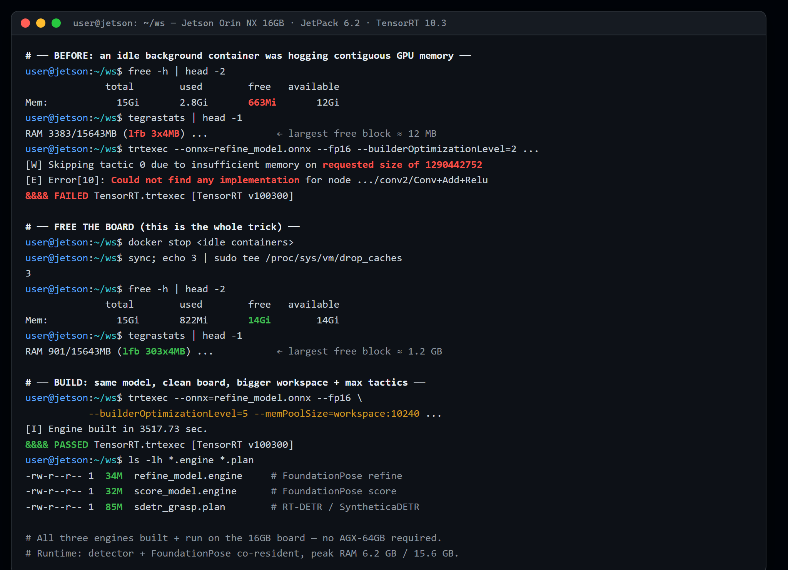
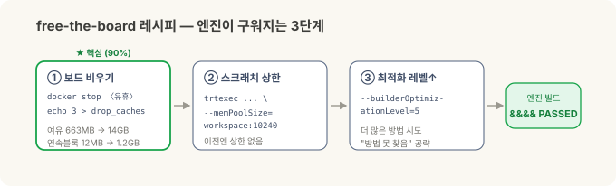
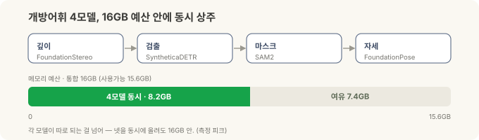
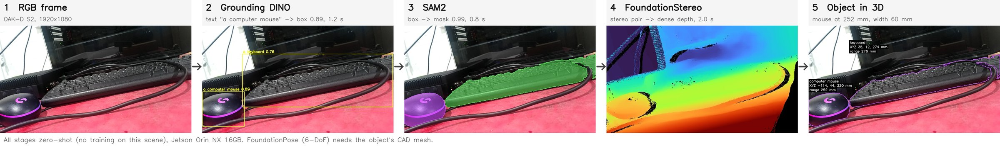
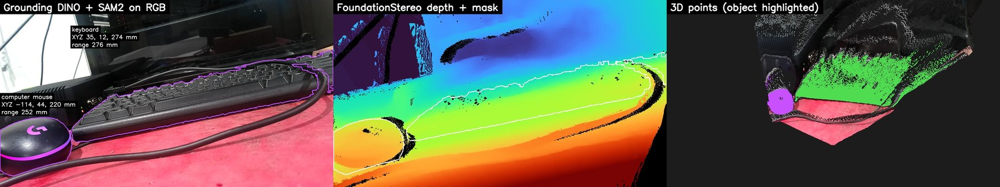
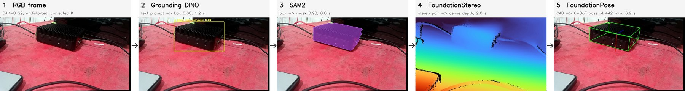
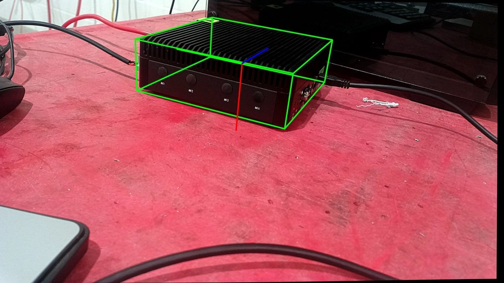
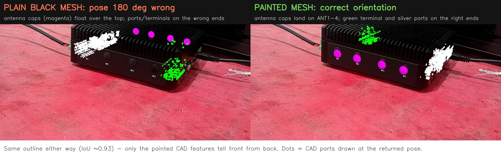
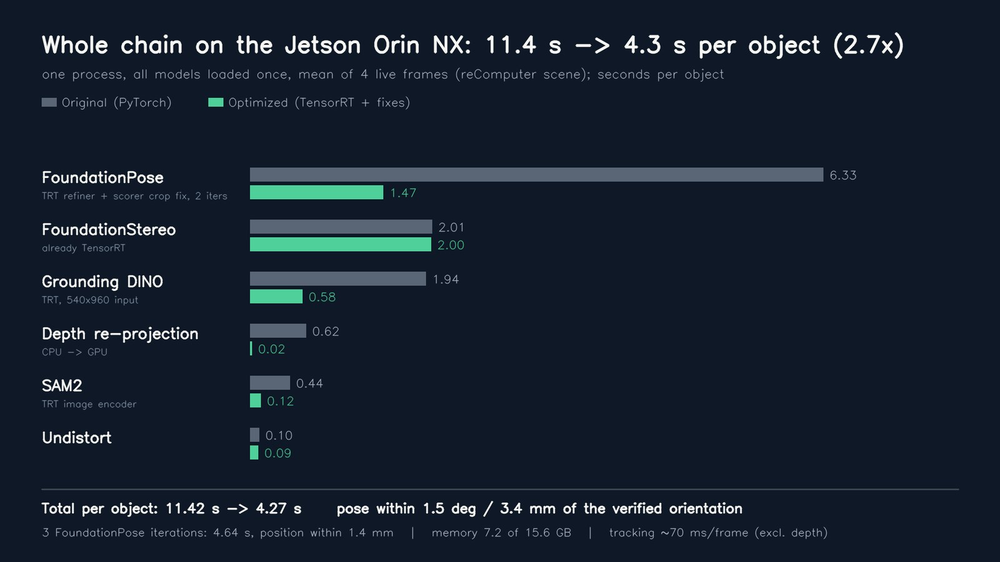
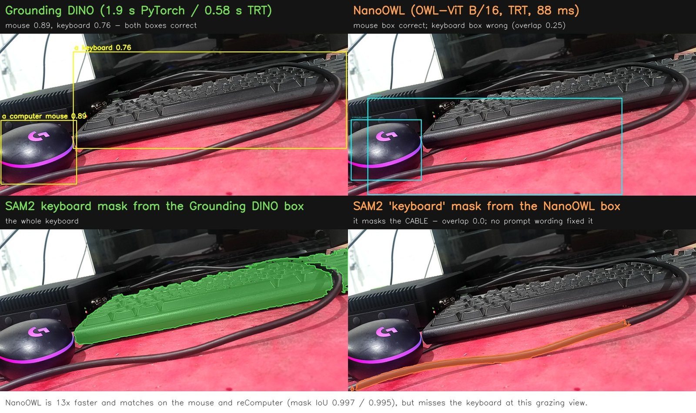

# 로봇의 뇌를 엣지에 올리기 — 정정편: 16GB로 안 된다던 그 결론, 뒤집었습니다

> **현장 노트 · '로봇의 뇌를 엣지에' 2부작의 정정편.** [1부](jetson-ros2-setup.md)에선 빈 엣지 컴퓨터에 JetPack과 **ROS 2**를 올렸고, [2부](jetson-isaac-foundation-models.md)에선 그 위에 **Isaac ROS**와 파운데이션 모델 파이프라인을 얹어 "학습 없이 새 부품을 잡는" 그림을 증명했습니다. 그리고 2부 끝에서 이렇게 적었죠. *"증명은 16GB로 끝났고, 실전용은 다음 칸 AGX Orin 64GB다."* **이 글은 그 결론을 뒤집는 정정입니다.**

2부를 쓰고 나서도 마음 한구석이 개운치 않았습니다. 무거운 두 모델(FoundationStereo·FoundationPose)이 16GB 엣지 컴퓨터에서 "걷는 속도"로 동작한 건, 하드웨어에 맞춰 미리 최적화해 굽는 **가속 엔진**(TensorRT 엔진)이 16GB에서 안 만들어졌기 때문이었습니다. 그래서 엔진 없는 느린 범용 경로로 동작했고, 저는 그걸 "16GB의 한계"로 적었어요.

그런데 포럼을 뒤지다 보니 **같은 16GB 모델에서 됐다는 성공 사례**가 있었습니다. 그래서 다시 매달려 봤습니다. 결론부터 말하면, **됩니다.** 같은 Orin NX 16GB에서 FoundationPose 엔진이 구워지고, 노드가 처음 보는 물체의 6-DoF 자세를 라이브로 내놓습니다. 벽인 줄 알았던 건 하드웨어가 아니라 제가 못 본 **메모리 도둑** 하나였어요. 그 문이 열리자 2부에서 함께 "64GB 필요"라고 적었던 FoundationStereo까지, **스택 전체가 같은 16GB 안으로** 들어왔습니다.

*(1·2부와 마찬가지로, 이건 특정 현장 배치가 아니라 일반적인 엣지 R&D 경험입니다.)*

---

## 30초 요약

- **2부 결론("16GB는 증명, 실전은 64GB")은 과장이었다.** 같은 16GB에서 FoundationPose 엔진이 **빌드되고**, 노드가 **라이브로 동작**한다.
- **진짜 범인은 "메모리 부족"이 아니라 "연속 메모리 조각남".** 이전 실험에서 **꺼두지 않은 유휴 컨테이너 하나**가 메모리를 붙들고 있어서, 엔진을 굽는 순간 가장 큰 **연속** 여유 블록이 ~12MB밖에 없었다(빌드가 요청한 스크래치는 ~1.29GB). 그래서 최적화 시도가 모두 건너뛰어졌고 "빌드 불가"로 보였다.
- **레시피: 보드부터 비운다.** 유휴 컨테이너를 끄고 페이지 캐시를 비우면 여유 메모리가 **663MB → 14GB**, 가장 큰 연속 블록이 **~12MB → ~1.2GB**로 돌아온다. 여기에 **워크스페이스 상한**(`--memPoolSize`)과 **최적화 레벨 상향**을 얹으면 엔진이 구워진다.
- **결과: 피크 ~6.2GB / 16GB.** 엔진 빌드 + 노드 라이브 6-DoF가, 검출 앞단까지 함께 올려도 9GB 넘게 여유를 두고 16GB 안에 들어온다. 16GB의 벽은 **엔진을 굽는 순간**에만 있었지, 실행에는 없었다.
- **FoundationPose만이 아니다. 스택 전체가 16GB에서 동작한다.** 마지막 하나 FoundationStereo까지 뚫었고(해상도↓ + FP32), 검출 → 마스크 → 자세 4모델을 **동시에 올려도 피크 8.2GB / 16GB**로 들어온다.
- **실제 카메라로도 확인했다(2026-09-28).** 글자 지시 → 검출 → 마스크 → 깊이 → 6-DoF 자세까지 전체 체인이 Orin NX 16GB에서 물체당 **4.1초**(최적화 전 11.4초), 첫 자세 1.8초, 이후 추적 프레임당 약 70ms. 앞뒤가 비슷한 물체는 CAD에 색을 살려 넣어야 방향이 맞는다.
- **교훈:** "엔진을 못 굽는다"와 "못 실행한다"는 다른 말이다. 그리고 하드웨어를 탓하기 전에 **뭐가 메모리를 먹고 있는지** 먼저 보라.

---

## 2부에서 내가 적은 것 — 그리고 왜 걸렸나

2부의 하드웨어 결론은 이랬습니다.

> 개념은 16GB 엣지 컴퓨터로 증명이 끝났다. 무거운 모델은 걷는 속도지만, 실전에서 한 대로 제 속도를 내려면 다음 칸 AGX Orin 64GB다.

근거도 적었습니다. 젯슨은 CPU와 GPU가 메모리를 함께 씁니다(통합 메모리, 여기선 다 합쳐 16GB). 큰 모델을 최고 속도로 실행하려면 먼저 **가속 엔진**으로 구워야 하는데, 이 **굽는 과정**이 순간적으로 메모리를 크게 먹어서 작은 엣지 컴퓨터가 그 고비를 못 넘는다고요.

여기까지는 맞았습니다. 굽는 순간이 고비인 것도, 통합 메모리가 좁은 것도. **틀린 건 "그래서 16GB로는 불가능하다"는 결론**이었어요. 고비의 원인을 하드웨어 용량으로만 봤지, **그 16GB가 그 순간 실제로 얼마나 비어 있었는지**는 안 봤거든요.

## 다시 들여다보니 — 진짜 범인은 메모리 도둑

엔진 빌드 로그를 다시 열어 보니 실패가 아주 구체적이었습니다.

```
[W] Skipping tactic 0 due to insufficient memory on requested size of 1290442752
[E] Error[10]: Could not find any implementation for node .../conv2/Conv + Add + Relu
&&&& FAILED
```

`1290442752`는 약 1.29GB. 최적화 도구가 그 연산을 빠르게 만들 방법(tactic)에 그만한 **작업용 메모리(scratch)를 요청했는데 모자라** 건너뛰고, 결국 **쓸 수 있는 방법을 하나도 못 찾아** 실패한 겁니다. 용량 자체는 16GB인데, 왜?

실시간 메모리 상태를 확인하니 답이 나왔습니다.

- 시작할 땐 13GB가 비어 있었는데, **빌드가 진행되는 동안에는 GPU가 쓸 수 있는 여유가 140MB뿐**이었어요.
- 게다가 젯슨의 `tegrastats`가 보여주는 **가장 큰 연속(contiguous) 여유 블록**(`lfb`)이 겨우 **3×4MB(~12MB)**. 굽는 도구는 그만한 큰 스크래치(로그상 ~1.29GB)를 한 덩어리로 잡아야 하는데, 12MB 조각으로는 어림없었죠. 총량이 아니라 **연속으로 붙은 블록**이 없어서 막힌 겁니다.

범인은 곧 드러났습니다. **이전 실험에서 꺼두는 걸 깜빡한 컨테이너 하나**가 39시간째 실행 중인 채 약 4GB를 붙들고 있었어요. 그게 메모리를 잘게 조각내면서, 여섯 번의 빌드 시도가 **전부 같은 지점**에서 같은 이유로 죽었던 겁니다. 하드웨어 벽이 아니라, 제가 안 치운 **메모리 도둑**이었죠.



*실제 터미널: **BEFORE**(free 663MB · lfb 3×4MB · requested 1.29GB → `&&&& FAILED`) → **보드 비우기**(free 14GB · lfb 303×4MB) → **BUILD**(`workspace:10240` + `optLevel=5` → `&&&& PASSED`). refine 34M · score 32M · 검출기(RT-DETR/SyntheticaDETR) 85M — 세 엔진이 모두 이 16GB 엣지 컴퓨터에서 나온다.*

## 레시피 — 보드부터 비운다

정리하면 세 단계입니다. 첫 단계가 90%예요.

1. **보드를 비운다 (이게 핵심).** 유휴 컨테이너를 끄고, 페이지 캐시를 비운다.
   ```
   docker stop <idle containers>
   sync; echo 3 | sudo tee /proc/sys/vm/drop_caches
   ```
   → 여유 **663MB → 14GB**, 가장 큰 연속 블록 **3×4MB → 303×4MB(~1.2GB)**. 빌드 전에 `tegrastats`의 `lfb`가 크고 `free -h`가 12GB 넘는지 **꼭 확인**하세요.
2. **작업용 메모리 상한을 준다.** 굽는 도구에 넉넉한 스크래치를 명시한다.
   ```
   trtexec --onnx=refine_model.onnx --fp16 \
           --builderOptimizationLevel=5 \
           --memPoolSize=workspace:10240      # 10GB 스크래치
   ```
   실패했던 이전 시도에서는 이 상한을 **아예 주지 않았습니다.**
3. **최적화 레벨을 올린다.** `--builderOptimizationLevel=5`(최대). 더 많은 방법을 시도하니 "쓸 방법을 못 찾음"을 정면으로 공략합니다. 이전엔 낮은 레벨이었어요.



이 조합으로 **엔진이 구워졌습니다.** FoundationPose의 두 조각(refine·score)이 각각 제대로 된 엔진 파일로 나왔고, "쓸 방법을 못 찾음" 에러는 완전히 사라졌어요.

## 그래서 무엇이 되나 — 엔진 빌드 + 노드 라이브

엔진이 구워지면 그다음은 술술 풀립니다.

- **FoundationPose 노드가 라이브로 동작합니다.** 카메라 입력을 받아 처음 보는 물체의 6-DoF 자세를 프레임마다 내놓아요. 미리 구운 엔진을 얹으니, 2부에서 겪은 "굽느라 메모리가 터지는" 고비 자체가 없습니다.
- **피크 메모리 ~6.2GB / 16GB (검출 앞단까지 함께).** 9GB 넘게 남습니다. 즉 **16GB의 벽은 "엔진을 굽는 순간"에만 있었지, 실행에는 처음부터 없었어요.** 한 줄로 요약하면 *엔진을 못 굽는다 ≠ 못 실행한다*입니다.
- 물체가 "어디 있는지" 찾아 주는 **검출 앞단**(닫힌집합형이든, 말로 지시하는 개방어휘형이든)까지 같은 엣지 컴퓨터에서 FoundationPose와 **함께** 올라옵니다. 위 캡처의 엔진 셋이 그것입니다(피크 ~6.2GB). 검출기 종류별 깊은 얘기는 다음 글감으로.

**속도는 여전히 "걷는 속도"입니다.** 무거운 트랜스포머라 프레임당 몇 초가 걸려요. 하지만 2부에서도 말했듯, 픽(집기) 한 번이 몇 초 걸려도 되는 일이라면 문제될 게 없어요. 달라진 건 "16GB에선 이것도 못 한다"가 아니라 "**16GB로도 제 경로(엔진)로 동작한다**"는 사실입니다.

## 그리고 나머지 전부 — 스택 전체가 16GB에서 동작합니다

문 하나가 열리자 나머지 조각도 차례로 넘어갔습니다. 2부에서 FoundationPose와 함께 "64GB 필요"라고 적었던 다른 무거운 모델 **FoundationStereo**(스테레오 영상 → 깊이)까지요.

이건 솔직히 한 겹 더 미묘한 이야기입니다. FoundationStereo는 보드를 비워도 처음엔 안 구워졌어요. 로그를 보니 이번엔 진짜로 용량이 모자랐습니다. 한 연산이 **한 덩어리로 ~7.4GB의 연속 스크래치**를 요구했는데, 이건 아까 같은 "조각남"이 아니라 16GB로는 정말 벅찬 크기였죠. 즉 **두 종류의 16GB 벽**이 있었던 겁니다. FoundationPose는 조각남(청소로 해결), FoundationStereo는 진짜 용량 고비.

이번엔 청소가 아니라 **입력 크기와 정밀도**로 넘었습니다.

- **해상도를 낮춘다.** 480×640 → **288×480**(NVIDIA가 젯슨용으로 권장하는 크기). 그 순간 ~7.4GB 요청이 **~187MB**로 확 줄었어요.
- **FP16 대신 FP32로.** 이 모델은 문서상 FP16 변환이 막혀 있어서, 오히려 FP32가 정답이었습니다.
- **빌드 후 벤치마크 단계를 건너뛴다**(`--skipInference`) — 엔진만 굽고 저장.

결과: **258MB 엔진, 약 2시간 빌드, 실행 프레임당 ~1.97초 @ 피크 5.95GB** — 엔진 없는 느린 경로(~9.8초)보다 **5배 빠릅니다.** 마지막 조각까지 16GB 안에서 제 경로로 동작한 거예요.

여기까지 오니 그림이 완성됐습니다. **깊이(FoundationStereo) · 검출(SyntheticaDETR) · 마스크(SAM2) · 자세(FoundationPose)** — 거기에 ESS·cuMotion까지, 스택 전체가 이 한 대에서 빌드되고 동작합니다.

그리고 정말 궁금했던 숫자. **넷을 동시에 올리면 16GB에 들어오나?** 들어옵니다. 검출 → 마스크 → 자세로 이어지는 개방어휘 체인의 네 모델을 **동시에 상주**시켰을 때 피크가 **8.2GB / 16GB**, 7GB 넘게 남았어요(측정치). 각 조각이 따로 되는 걸 넘어, **함께 올려도 16GB 안**이라는 뜻입니다.



실제 카메라로 체인 전체를 한 번에 실행한 결과도 있습니다(2026-09-28, OAK-D S2 + Orin NX 16GB). 글자로 "a computer mouse"라고만 알려 주면, 검출부터 3D 위치까지 쭉 이어집니다.



| 단계 | 모델 | 결과 | 시간 |
|---|---|---|---|
| 검출 (글자 → 상자) | Grounding DINO tiny | 마우스 0.89, 키보드 0.76 | 1.2초 |
| 마스크 (상자 → 마스크) | SAM2.1 tiny | 마우스 0.988, 키보드 0.905 | 0.84초 |
| 깊이 (스테레오 → 깊이) | FoundationStereo | 마우스 마스크의 96.7%에 깊이 | 2.0초 |
| 3D 위치 (마스크 × 깊이) | — | 카메라에서 약 25cm, 폭 60.4mm (제품 사양 62.2mm) | 1초 미만 |



*마지막 단계를 풀어 본 그림입니다. 왼쪽은 검출과 마스크에 카메라 기준 좌표(XYZ, mm)를 붙인 결과, 가운데는 FoundationStereo 깊이 위에 마스크 윤곽을 겹친 것, 오른쪽은 이를 3D 점으로 펼친 모습입니다(보라색이 마우스, 초록색이 키보드). 마우스 점들로 잰 폭 60.4mm는 제품 사양 62.2mm와 2mm 안쪽으로 맞습니다.*

이 장면으로 따로 학습시킨 적은 없습니다. 마우스는 CAD 파일이 없어서 여기서는 3D 위치까지만 구했습니다.

마지막 조각인 6-DoF 자세(FoundationPose)도 실제 카메라로 확인했습니다. 이번엔 제조사가 CAD 파일을 공개한 물체를 골랐어요. 책상 위에 놓인 Seeed reComputer Industrial(Orin NX를 넣은 산업용 미니 PC)입니다. 글자로 "a black mini computer with cooling fins"라고 알려 주고, 제조사 CAD만 넣었습니다. 역시 학습은 없습니다.



| 단계 | 결과 | 시간 |
|---|---|---|
| 검출 (Grounding DINO tiny) | 0.68 | 1.2초 |
| 마스크 (SAM2.1 tiny) | 0.98 | 0.8초 |
| 깊이 (FoundationStereo) | 98% 채워진 깊이 | 2.0초 |
| 자세 (FoundationPose, 첫 자세 추정) | 카메라에서 44cm, 6-DoF | 1.8초 (최적화 전 6.3초) |
| 이후 추적 (프레임마다) | 같은 자세를 따라감 | 약 70ms, 초당 14프레임 (깊이 계산 제외) |



*초록 상자는 CAD의 외곽, 분홍·흰색·초록 점은 CAD에 있는 안테나 캡·포트·단자를 이 자세대로 그린 것입니다. 안테나 캡 네 개가 실물의 ANT1~4 위에 그대로 얹힙니다. CAD 실루엣과 SAM2 마스크가 겹치는 비율(IoU)은 0.92, 물체를 그대로 둔 채 네 프레임을 연달아 추정하면 위치 0.94mm, 각도 0.48° 안에서 흔들렸습니다. (같은 날 먼저 올린 그림은 아래 설명처럼 앞뒤가 180° 뒤집힌 결과여서 교체했습니다.)*

여기서 배운 점이 하나 있습니다. 처음에는 CAD를 색 없이 까만 덩어리로 넣었는데, 외곽선은 잘 맞았지만(IoU 0.93) 자세가 **매번 180° 뒤집혀** 있었어요. 이 PC는 앞뒤가 거의 같은 상자라 모양만으로는 앞뒤를 가릴 수 없거든요. CAD에 원래 있는 안테나 캡·포트·단자의 색을 살려 넣자 바로 제 방향을 찾았습니다.



그래서 이 숫자를 읽을 때 조심할 점이 세 가지 있습니다.

- **외곽선이 맞는다고 방향까지 맞는 건 아닙니다.** 앞뒤가 비슷한 물체는 CAD에 색이나 특징을 살려 넣고, 이 그림처럼 특징 위치로 방향을 따로 확인해야 합니다.
- **정답 자세와 비교한 값이 아닙니다.** 방향 특징, 실루엣, 반복성을 본 자기 일관성 검사예요. 절대 정확도는 따로 재야 합니다.
- **CAD가 정확해야 합니다.** 크기가 다른 비슷한 모델의 CAD를 넣어도 그럴듯한 상자가 나옵니다(IoU 0.78, 맞는 CAD는 0.92). 겉보기로는 구분이 어려우니, CAD 치수를 실물과 먼저 대조해야 합니다.

속도도 더 줄였습니다. 모든 모델을 한 프로세스에 한 번만 올려 두고, 검출기와 SAM2, FoundationPose의 정제·채점 단계를 TensorRT 엔진으로 바꾸고, 느리던 코드 두 곳을 고쳤더니 물체 하나에 **11.4초 → 4.1초**가 됐습니다. 자세 결과는 그대로이고, 메모리는 16GB 중 7.2GB를 씁니다. 이제 가장 오래 걸리는 건 FoundationStereo(2.0초)로, 전체의 절반쯤입니다.



솔직한 단서 두 개도 남깁니다.

- **말로 지시하는 개방어휘 검출기**(예: Grounding DINO)는 16GB에 올라가고 함께 동작하기도 하는데, 지금 공개된 그 배포용 체크포인트는 상자를 잘 못 잡았습니다. 하드웨어가 아니라 **모델(체크포인트)의 한계**예요. 실제로 다른 공개 체크포인트(Hugging Face의 grounding-dino-tiny)로 바꾸자 위 책상 장면에서는 마우스와 키보드를 제대로 잡았습니다(0.89, 0.76). 어떤 체크포인트를 쓰느냐가 관건입니다. 정해진 부품을 다루는 현장이라면 닫힌집합형(SyntheticaDETR)이 실전 정답이고, 개방어휘는 유연성용 옵션입니다.
- 마스크를 진짜 SAM2로 뽑든 상자를 사각형으로 쓰든 **최종 자세는 ~1mm/~1° 차이뿐**이었어요. 관심 영역만 대충 맞으면 뒷단(FoundationPose)이 깊이로 마무리하거든요.

검출기를 더 빠른 것으로 바꿔 보기도 했습니다. NanoOWL(OWL-ViT, TensorRT)은 88ms로 Grounding DINO보다 13배 빠르고, 마우스와 미니 PC는 똑같이 잘 찾았어요. 그런데 비스듬히 누운 키보드는 어떤 문구로 불러도 엉뚱한 상자를 냈고, SAM2는 그 상자 안의 케이블을 오려 냈습니다. 빠른 검출기는 미리 확인해 둔 물체에만, 실패 검사와 함께 쓰는 게 맞습니다.



## 이번 시행착오가 값진 이유

세 가지를 배웠습니다. 셋 다 다음에 또 걸릴 함정이에요.

- **"엔진을 못 굽는다"와 "못 실행한다"는 다른 문제다.** 굽기는 순간적으로 큰 연속 메모리를 요구하고, 실행은 그렇지 않습니다. 하나가 막혔다고 다른 하나까지 포기하면, 되는 걸 안 된다고 적게 됩니다(제가 2부에서 그랬죠).
- **하드웨어를 탓하기 전에 "지금 그 16GB가 실제로 얼마나 비어 있나"를 본다.** 총량이 아니라 **가장 큰 연속 블록**(`tegrastats lfb`)을요. 유휴 컨테이너·좀비 프로세스가 메모리를 조각내는 건 조용해서, 총량만 보면 절대 안 보입니다.
- **포럼 성공 사례도 "내 이미지에서" 다시 확인한다.** 남이 됐다고 내 환경에서 무조건 되는 건 아니고, 남이 막혔다고 내 환경에서 무조건 막히는 것도 아닙니다. 이 글 자체가 그 재확인의 결과예요. 포럼에서 "된다"는 글을 보고 다시 매달려, 제 엣지 컴퓨터에서도 되는 걸 확인한 **또 하나의 성공 사례**죠.

## 하드웨어 결론 — 다시 씁니다

2부의 하드웨어 표를 정정합니다.

| 엣지 컴퓨터 | 2부에서 적은 것 | 지금 |
| --- | --- | --- |
| **Orin NX 16GB** (우리가 가진 것) | 증명용. 실전은 다음 칸 | ★ **비실시간(픽 한 번 몇 초) 실전까지 된다.** 보드만 비우면 엔진 빌드+노드 라이브 |
| **AGX Orin 64GB** | 실전용, 정답 | **여유·실시간·풀해상도용.** 필요할 때의 선택이지, "실행하려면 반드시"는 아님 |

- **Orin NX 16GB** (대략 $800~1,400) — 파이프라인이 *동작한다*를 넘어, 픽 한 번이 몇 초 걸려도 되는 **비실시간 실전**까지 감당합니다. 관건은 용량이 아니라 **빌드 순간 보드를 비워 두는 운영**이에요.
- **AGX Orin 64GB** ($1,999) — 실시간이 필요하거나, 풀해상도·풀속도 여유가 필요할 때. (FoundationStereo도 16GB에서 빌드됩니다. 다만 해상도를 낮춰야 하고, 64GB면 그 제약이 풀려요.) **"엔진을 굽고 실행하려면 반드시 64GB"는 이제 틀린 말**입니다.

'값싸게 되는지부터 증명하고, 필요할 때 올라탄다.' 2부에서 그렇게 적었죠. 이번엔 한 발 더 나갔습니다. **알고 보니 그 값싼 엣지 컴퓨터가 실전 문턱도 넘더라는 것**, 그리고 그걸 막고 있던 게 하드웨어가 아니라 안 치운 메모리 도둑 하나였다는 것. 엣지 AI의 현실적인 사다리는 생각보다 한 칸 아래에서 시작합니다.

> **참고 — 그럼 최신 JetPack 7 / Isaac ROS 4.0으로 올리면 더 낫지 않나?** Orin NX 16GB에선 권하지 않습니다. JetPack 7.2가 Orin NX를 지원하긴 하지만 **Isaac ROS 4.0은 Thor(더 큰 모듈) 우선**이고, NVIDIA가 Orin NX 16GB에 권장하는 조합은 여전히 **Isaac ROS 3.2 / JetPack 6.2**예요. 게다가 4.0의 파운데이션 모델은 더 무거워서 16GB 굽기 고비가 완화되기는커녕 더 빡빡해지고, 검증 사례 대부분이 Thor에 몰려 있어 Orin NX 선례도 적습니다. 최신이 곧 정답은 아니고, 이 엣지 컴퓨터에선 검증된 3.2/6.2에 머무는 게 안전합니다.

---

## 정리

| | 2부 | 지금(정정) |
| --- | --- | --- |
| **엔진 빌드(16GB)** | 안 됨 → 64GB 필요 | ✅ 됨 — 보드 비우기 + 워크스페이스 상한 + 레벨 상향 |
| **노드 라이브(16GB)** | (엔진 없이 걷는 속도) | ✅ 6-DoF 라이브, 피크 ~6.2GB(검출기 함께) |
| **스택 전체(16GB)** | (FoundationPose만 봤음) | ✅ 깊이·검출·마스크·자세 전부 빌드+구동, **4모델 동시 8.2GB** |
| **진짜 원인** | "통합 메모리가 좁다" | 유휴 컨테이너가 **연속 메모리를 조각냄**(총량 아님) |
| **하드웨어** | 증명 16GB / 실전 64GB | **비실시간 실전도 16GB**, 64GB는 여유·실시간용 |

**기억할 한 가지:** 벽인 줄 알았던 게 벽이 아닐 때가 있습니다. 이번 건 하드웨어 용량이 아니라 **빌드 순간의 연속 메모리**였고, 그건 보드를 비우는 것만으로 풀렸어요. "엔진을 못 굽는다"를 "이 하드웨어론 안 된다"로 옮겨 적기 전에, `tegrastats`의 연속 블록 한 줄을 먼저 보는 것 — 그게 이번 시행착오가 남긴 교훈입니다.

---

<details>
<summary>참고 — 이 결과의 근거와 고지</summary>

수치(여유 메모리·연속 블록 크기·피크 RAM·엔진 동작 여부)는 **제가 이번 R&D에서 직접 측정한 값**으로, 소프트웨어 버전·설정(Isaac ROS 3.2, JetPack 6.2 계열, TensorRT 10.3, 최대 전력 모드)과 시점에 따라 달라집니다. 엣지 컴퓨터 가격은 공개 기준가의 근사치예요.

이 글은 **이미 공개된 커뮤니티·포럼의 성공 사례를 제 엣지 컴퓨터에서 재현한 또 하나의 사례**입니다. 빌드 레시피(보드 비우기·워크스페이스 상한·최적화 레벨)와 실패 진단은 NVIDIA의 TensorRT·Isaac ROS 공개 문서 및 NVIDIA 개발자 포럼의 공개 스레드를 근거로 했고, 실제 도입 전 각 모델·도구의 최신 문서를 확인하세요.

본 글은 특정 현장 배치가 아니라 일반적인 엣지 R&D 경험이며, Jetson·Orin·AGX·JetPack·Isaac ROS·TensorRT·CUDA는 NVIDIA의, 그 외 제품명은 각 소유자의 상표로 지칭 목적으로만 사용했습니다.

</details>
