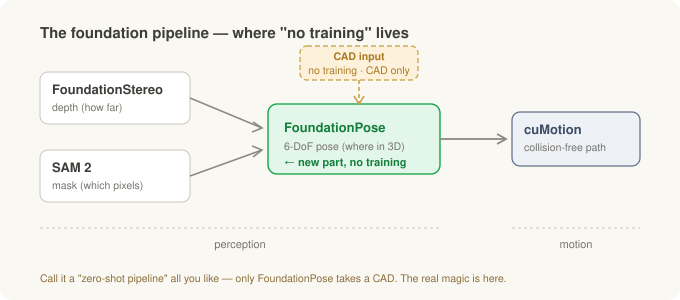
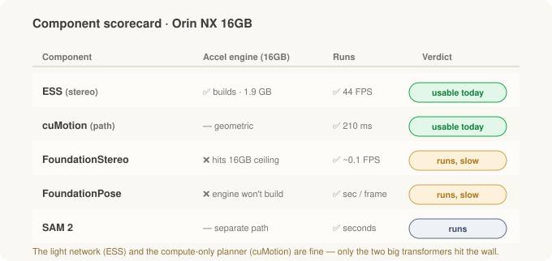
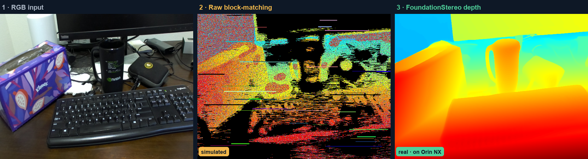
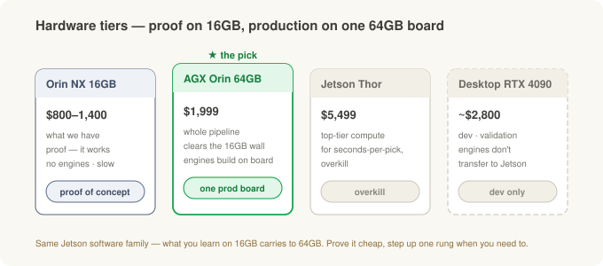

# Putting the Robot's Brain on the Edge (2) — Isaac ROS, Foundation Models, Running on the Edge

> **Field notes · Part 2 of the two-part "brain on the edge."** In [Part 1](jetson-ros2-setup.md) we brought a bare Jetson board up on JetPack and got **ROS 2 running**. This time we stack **Isaac ROS** and a **foundation-model pipeline** on top of it, to see for ourselves whether the "grab a new part with no training" promise really runs on the **small edge board we already have**.

In the [robot-vision series](stereo-to-grasp.md) we traced, as concepts, the path a robot walks to pick something up: read depth from stereo → cut out the object with a mask → find its 6-DoF pose → plan the arm's path. And in the [deep dive](inside-the-models.md) we opened up the models behind each stage — FoundationStereo, SAM 2, FoundationPose.

This post is about running those models **on electricity, not on paper.** NVIDIA paints a "**zero-shot**" picture — *pick an object you've never seen, with no extra training, given just its CAD.* There are slick demo videos, too. But whether that runs on a palm-sized computer bolted to a work cell, rather than on a big cloud GPU, is an entirely separate question.

So I put it on one directly, the **Jetson Orin NX 16 GB** we already had. And it runs: an object it's never seen, with no training, from a single CAD. This post is how we stood it up, what I watched with my own eyes, and what the next step is if this goes to production.

*(As in Part 1, this is a general edge-R&D experience, not a specific field deployment.)*

---

## The 30-second version

- **A foundation model = a big general model you don't have to train for your specific object.** No collecting data and retraining every time a new part shows up — that's the appeal.
- **Four stages:** depth (FoundationStereo) → mask (SAM 2) → **6-DoF pose (FoundationPose)** → path (cuMotion). The real star of "new part, no training" is **one stage, FoundationPose** — it's the only one that takes a CAD.
- **What we proved:** dense depth on an unseen scene; a clean mask of a drill (score 0.86); 6-DoF pose tracked across 300+ frames each on **two swapped CADs** (a bottle, a drill); a collision-free 7-axis path in 210 ms — all on our own Orin NX.
- **Speed:** the light stereo model (ESS, 44 frames/sec) and the path planner (cuMotion, 210 ms) run at usable speed today. The two heavy models run at seconds per frame on this small board — a walk, not a sprint — which is no flaw if a pick can take a few seconds.
- **Hardware:** the concept is proven on this 16 GB board. To run the whole pipeline **at full speed on one board** in production, the next rung — the **AGX Orin 64 GB** ($1,999) — is the answer.
- *Heavy training on a desktop/cloud, inference on the edge — Part 1's big picture holds here too.*

---

## Starting with Isaac ROS — ROS 2 that runs on the GPU

Part 1 ended with ROS 2 installed and "next up: Isaac ROS." To recap: **Isaac ROS is NVIDIA's set of GPU-accelerated ROS 2 perception packages.** It's the production version that runs the pipeline from the robot-vision series on the Jetson's GPU — and does it zero-copy, without shuffling data back and forth between the camera and the models.

Here's where the fork Part 1 warned about becomes real. Isaac ROS now comes in **two lines.**

- **JetPack 6 / Isaac ROS 3.x** — where I stood. Stable, with a thick ecosystem. The cost: a few of the newest models don't land here.
- **JetPack 7 / Isaac ROS 4.x** — the latest. If you want the newest FoundationStereo or the proper SAM 2, you go here — but you have to **reflash the whole board.**

Rather than tear down a board I'd already brought up on 6, I pushed **as far as 3.x could go.** That turns out to be the honest answer to "what runs on the board we actually have *right now*."

---

## What "zero-shot" actually means at each stage

Let's walk the pipeline again — this time marking **where training is and isn't needed.**

| Stage | What it does | "Zero-shot" means | Branch |
|---|---|---|---|
| **FoundationStereo** | how far is everything? | any **surface/scene** you've never seen (passive, no infrared) | perception |
| **SAM 2** | which pixels are the object? | **any object** from a click/box hint (no training) | perception |
| **FoundationPose** | where is it in 3D? | **any object, given its CAD**, even unseen (no training) | perception |
| **cuMotion** | how does the arm reach it? | (not a learned model — a geometric planner) | motion |

There's one misconception worth killing here. **"No training needed when a new part arrives" is really a claim about one stage, FoundationPose** — because that's the only stage that takes a CAD. The two stages before it (depth, mask) were object-agnostic to begin with, and the one after (path) is math with nothing to learn. So don't be dazzled by the blanket phrase "zero-shot pipeline" — remember that **the real magic is in the pose stage.**

One more thing: why FoundationStereo for depth? As we saw in the deep dive, shiny metal and smooth, featureless surfaces are exactly what stereo struggles with most — there's no texture to match, so depth comes back full of **holes.** FoundationStereo's strength is mixing in a single-camera depth guess (Depth Anything V2) to fill those holes. The lightweight ESS is real-time but weaker on such reflective surfaces. So when the target is a *shiny part*, the heavy option earns its keep.

Aside — why NOT using infrared can be the better choice

Some depth cameras project an infrared (IR) dot pattern and read distance from how it distorts (structured light / active stereo). Convenient — but in front of shiny metal, that pattern **bounces multiple times (inter-reflection)** and conjures ghost depth that isn't there. FoundationStereo and ESS are both **passive** learned stereo (no IR), so that ghosting never arises in the first place. What remains is the hole problem on featureless surfaces, and filling those with a single-camera depth guess is FoundationStereo's job.

---

## What actually ran — proof of concept

Here's what I watched run on the Jetson this session, stage by stage.

**Depth — FoundationStereo.** It turned a desk scene it had never seen into a dense depth map, whole, with no training.

*Left is what the camera saw; right is the depth FoundationStereo produced. Closer is red, farther is blue. On a scene it never trained on, the mug, keyboard, and tissue box still separate cleanly by distance.*

**Mask — SAM 2.** One box and one point as a hint, and it cut the object out of the background cleanly. Confidence 0.86, again with no training.

*The green region is what SAM 2 picked out (the drill). It has no pre-learned list of objects — point at something and it carves out that spot.*

**Pose — FoundationPose.** This is the heart of "new part, no training." Swapping the CAD between them, it tracked the 6-DoF pose of two objects (a bottle, a drill) across 300+ frames each. Same code, just a different CAD file.

*The green box is the 6-DoF pose of the first object, a mustard bottle. Give it just a CAD file and, with no training, it tracks the pose as the object moves. Captured live on the Orin NX.*

*Here only the CAD file changed, to a drill, not a line of code. Bottle to drill: that's what "new part, no training" actually looks like.*

**Path — cuMotion.** Finally, the collision-free route the arm takes to the object: a path for a 7-axis arm (Franka demo config), planned in 210 ms.

*The seven joints (J1–J7) sweep smoothly from start to goal — one collision-free trajectory, solved in a single pass.*

All four stages ran. The picture of "grab a new object from a single CAD, no training" was actually reproduced — not in the cloud, but on **a small computer you can bolt beside the work cell.** As a proof of concept, that's enough.

---

## What's fast, and what's still slow

Run the five pieces side by side on the same Jetson and the speed splits cleanly in two.

| Component | Accel engine | Runs | Speed |
|---|---|---|---|
| **ESS** (stereo) | ✅ builds · 1.9 GB | ✅ | 44 FPS · usable |
| **cuMotion** (path) | n/a (geometric) | ✅ | 210 ms · usable |
| **FoundationStereo** | ❌ not on this board | ✅ | ~0.1 FPS · slow |
| **FoundationPose** | ❌ not on this board | ✅ | sec/frame · slow |
| **SAM 2** | n/a (separate path) | ✅ | seconds |

The light stereo model (ESS) and the compute-only planner (cuMotion) run at usable speed right now. The two heavy transformers — FoundationStereo and FoundationPose — run at seconds per frame on this small 16 GB board: a walk, not a sprint. Not real-time, but no flaw if a pick can take a few seconds, and it speeds up on a bigger board (just below). For what it's worth, Vention's GRIIP demo uses the same kind of division of labor. Its perception cycle runs roughly 2–6 s, and the robot overlaps its previous move during that time.

Why only the heavy two? A Jetson's CPU and GPU **share one memory pool** (unified memory — 16 GB total here). To make a big model run at top speed, you first bake it into a hardware-specific **accelerated engine**, and that baking step momentarily uses a lot of memory. This small board can't clear that optimization moment, so the model falls back to a more general (and slower) path — that's what "a walk" is. Step up one board size and that moment clears.

Aside — what an 'accelerated engine' is, and why building one costs extra memory

The same model can run in a generic way, or in a form that's been "pre-optimized and baked for this specific hardware." That second form is what we're calling an **accelerated engine** (NVIDIA's TensorRT engine). Baking it means the engine *actually runs several different ways of doing the same operation and picks the fastest* (auto-tuning). During that "try everything" moment it uses far more memory than plain execution. A desktop GPU has plenty of its own dedicated memory, so it's a non-issue; on a shared 16 GB pool, that moment hits the ceiling. And the Jetson's swap (spillover space on disk) can't back GPU allocations, so there's nowhere to overflow to — it just fails. On a bigger board there's headroom, the engine builds on the board itself, and the heavy models run at full speed.

---

## ESS or FoundationStereo — trading speed for accuracy

Earlier I said FoundationStereo is the strong one on shiny surfaces. So which do you actually run for depth? Both are learned stereo, both are passive (no infrared, so no ghost depth), and the real split comes down to speed vs accuracy.

To see *why* the heavy model earns its keep, take the same stereo pair three ways — the raw depth a classic block-matching pipeline produces, next to what FoundationStereo makes of it.

*Left is the RGB the camera saw. The middle is how classic block-matching fails on the same scene — speckle, horizontal scanline streaks, and black invalid holes across the dark, low-texture regions. The right is FoundationStereo filling those holes into a clean, gap-free map. The left and right panels are the real Orin NX capture; the middle panel is **simulated** from them to depict the block-matching failure mode. It's modeled on an actual raw block-matching depth heatmap captured on the tester, though — so while it isn't a second live capture, it closely mirrors what the real failure looks like. The gap between that middle and the right is the whole argument for FoundationStereo on a shiny part.*

| | ESS | FoundationStereo |
|---|---|---|
| Character | lightweight, real-time | accuracy-first, large & general |
| Speed (16 GB) | 44 FPS, real-time | ~0.1 FPS, a walk |
| Accel engine (16 GB) | builds | won't build (fallback only) |
| Hard surfaces | weak on shiny/featureless | fills the holes with a mono depth prior → strong |
| Setup | ships with Isaac ROS (drop-in) | separate setup, heavy |

**How to choose.** For ordinary surfaces where you need real-time, ESS. For hard surfaces — chrome-like reflections, or featureless faces that punch holes in the depth — FoundationStereo earns its keep. But it isn't real-time on a 16 GB board, so if you want both accuracy and speed you need a bigger board.

So the takeaway here: **on a 16 GB board today, the depth model you'd actually run in production is ESS**, while FoundationStereo shows the accuracy ceiling — how clean depth can get. (Within the real-time tier there was also a research alternative, ESMStereo, but ESS is an officially supported Isaac ROS drop-in, far less hand-work than building one yourself.)

---

## The walls I hit — setup field notes

Getting foundation models onto a Jetson is where Part 1's lesson — **"the versions are all chained in a single line"** — repeats itself, harder. A few samples.

- **numpy must stay 1.x.** Jetson's PyTorch simply dies with `_ARRAY_API not found` on numpy 2. The desktop habit of grabbing the newest numpy without a thought betrays you here.
- **Install SAM 2 with `--no-deps`.** Install it plain and its dependencies **overwrite the carefully-matched Jetson PyTorch with a wrong-CUDA build.** A rerun of Part 1's "`pip install torch` betrays you."
- **Big CAD meshes overflow memory.** Pose estimation matches by hypothesizing the object's 3D model at many orientations — and a dense mesh makes those hypotheses eat memory. You have to decimate the mesh (open3d), cut the number of orientation candidates, and let memory be used in expandable segments before it'll run at all.
- Plus building PyTorch3D and nvdiffrast from source, pinning the OpenCV version, routing around a C++ routine that segfaults by falling back to pure numpy… a dozen-odd fixes, large and small.

It sounds tedious, but the point is one thing. **The difficulty of standing foundation models up on the edge isn't that the models are hard — it's that the dozen versions underneath them are all chained in a single line.** Draw that map once and the next person saves half a day. (So it can be reproduced, I recorded every fix and a frozen Docker image separately.)

---

## If this goes to production — which board?

Now that we've reached "the concept is proven on our 16 GB board," the natural next question for production — *what do you buy to get full speed?*

- **Orin NX 16 GB** (what we have, roughly $800–1,400) — the board that *proved the pipeline runs.* The heavy models walk, but for a proof of concept that's all you need.
- **AGX Orin 64 GB ($1,999) — the next rung, and the answer.** Same Jetson software family, so everything you learned carries over, and the heavy models' accelerated engines **build right on the board.** It runs the whole pipeline **at full speed on one board.** (There's a two-tier "slow base + fast accelerator" setup too, but that's for when you need *real-time division of labor*; here one board is enough.)
- **Jetson Thor ($5,499)** — overkill for a task where one pick can take seconds.
- **Desktop GPU (RTX 4090, roughly $2,800)** — excellent for dev and validation, but an accelerated engine baked here **does not transfer to the Jetson** (different hardware). Do the final validation on the real board.

In one line: **the proof is done on 16 GB; the one production board is 64 GB.**

---

## The big picture — so where does this go?

Part 1's big picture holds here too. **Heavy training on the desktop/cloud, inference on the edge.** What this part adds is actually seating foundation models in that "inference" slot, and confirming the picture runs on the board we have.

The next things to check are clear now, too.

- **A field test on real objects, swapping CADs on the fly** — not the demo's bottle and drill, but an actual part in hand.
- **A depth comparison on shiny metal surfaces** — whether FoundationStereo's hole-filling really earns its keep on a highly reflective hard surface, side by side with the lightweight ESS.
- And **if a task is judged worth this zero-shot pick pipeline** — then the spec is a single **AGX Orin 64 GB.**

---

## Wrap-up

| Stage | The core | The wall I hit |
|---|---|---|
| **Isaac ROS** | GPU-accelerated ROS 2 perception layer | Two tracks (JetPack 6/3.x vs 7/4.x) — newest models need a reflash |
| **What "zero-shot" is** | four-stage pipeline | "new part, no training" is really a claim about **one stage, FoundationPose** |
| **Proof of concept** | all four stages ran, new object via a CAD swap | (proven — on our own Orin NX) |
| **Speed** | light models/planner usable, the heavy two still slow | the small board's unified memory — clears on a bigger board |
| **Setup** | versions chained in a single line | pin numpy 1.x · SAM 2 `--no-deps` · mesh OOM |
| **Hardware** | proof on 16 GB, production on one 64 GB board | desktop-GPU engines don't transfer to the Jetson |

**The one thing to remember:** the foundation-model pick pipeline **already runs on a palm-sized edge board** — the picture of grabbing an unseen object from a single CAD, no training, not in the cloud but on a small computer beside the work cell. That the two heavy models still walk instead of sprint is a problem you fix by stepping up one board size. Prove "does it work" cheaply first, then climb a rung when you need to — that's the practical ladder of edge AI.

---

*Related: [From stereo vision to grasping the target](stereo-to-grasp.md) · [Inside the models — deep dive, part 1](inside-the-models.md) · [The robot's brain on the edge (1) — from JetPack to ROS 2](jetson-ros2-setup.md) · [If you're investing in Physical AI — the cobot angle](cobot-investing.md)*

### Sources and notes

The figures (frame rates, plan times, memory, whether a model runs) are all **measured by me in this R&D**, and depend on software versions/settings (Isaac ROS 3.2, the JetPack 6.2 line, max-power mode) and on when they were taken. Board prices are approximate public list prices. Pipeline structure and model characteristics draw on NVIDIA's Isaac and each model's public material (FoundationStereo, SAM 2, FoundationPose, cuMotion/cuRobo), and Vention's public GRIIP demo. Check each model's and board's latest docs before you deploy. This is a general edge-R&D experience, not a specific field deployment. Jetson, Orin, AGX, Thor, JetPack, Isaac ROS, TensorRT, and CUDA are trademarks of NVIDIA; SAM is Meta's; ROS is Open Robotics'; other product names belong to their respective owners, used here for reference only.

### Glossary

- *Isaac ROS* — NVIDIA's set of GPU-accelerated ROS 2 perception packages
- *foundation model* — a big general model you don't have to train for your specific object
- *zero-shot* — handling an object without ever having trained on it
- *6-DoF pose* — an object's full pose in six numbers: where it is in space (fore/aft, left/right, up/down) and which way it's turned
- *CAD* — the object's 3D model; the reference FoundationPose matches its pose against
- *FPS* — frames per second; higher is faster, and 30–60 looks smooth to the eye
- *unified memory* — on a Jetson, one memory pool the CPU and GPU share rather than split (16 GB total here)
- *accelerated engine / TensorRT engine* — a model baked into a hardware-specific, pre-optimized form; fast to run, but memory-hungry to build
- *ESS* — a lightweight real-time stereo-depth model (ships with Isaac ROS)
- *cuMotion / cuRobo* — a GPU geometric planner that computes a collision-free path for the robot arm
- *zero-copy* — handing data straight from camera to model without copying it, to save time
