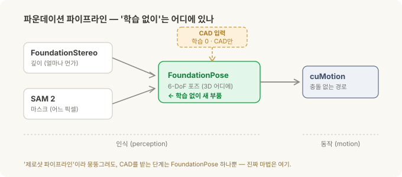
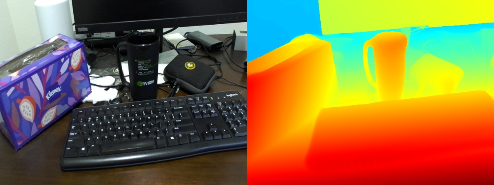
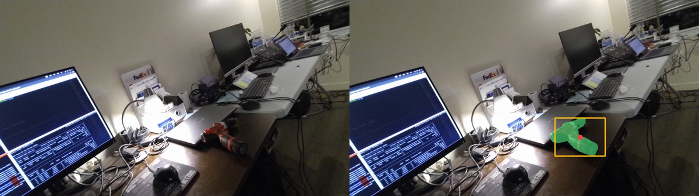
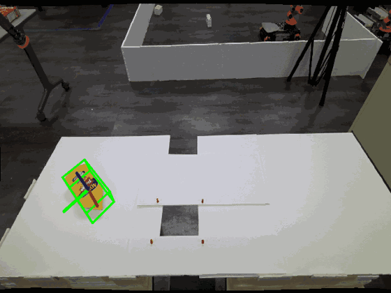
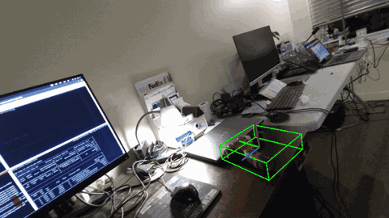
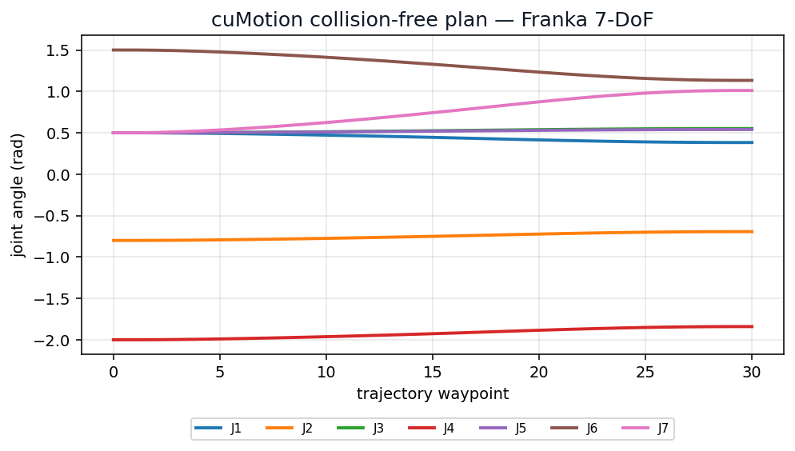
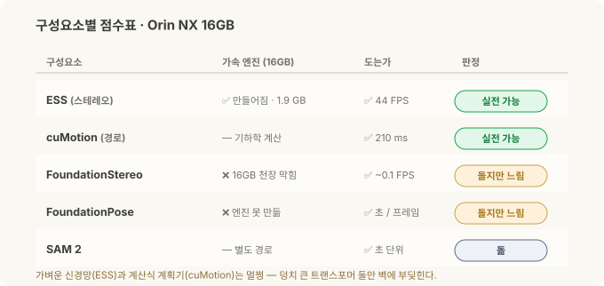

# 로봇의 뇌를 엣지에 올리기 (2) — Isaac ROS와 파운데이션 모델, 엣지에서 돌려보다

> **현장 노트 · '로봇의 뇌를 엣지에' 2부작 중 2부.** [1부](jetson-ros2-setup.md)에선 맨 Jetson 보드에 JetPack을 깔고 **ROS 2**까지 올렸습니다. 이번 편은 그 위에 **Isaac ROS**와 **파운데이션 모델 파이프라인**을 얹었어요. "학습 없이 새 부품을 잡는다"는 그 약속이, 우리가 가진 **작은 엣지 보드에서도 정말 동작하는지** 직접 확인해 봤습니다.

[로봇 비전 시리즈](stereo-to-grasp.md)에서는 로봇이 물체를 잡기까지의 과정을 개념으로 훑었습니다. 스테레오로 깊이를 재고, 마스크로 물체를 오려내고, 6-DoF 포즈를 잡고, 팔이 갈 길을 짜는 흐름이죠. [심화편](inside-the-models.md)에서는 그 단계를 각각 맡는 세 모델, FoundationStereo·SAM 2·FoundationPose를 하나씩 뜯어봤고요.

이번엔 그 모델들을 실제로 돌려봤습니다. NVIDIA가 내세우는 "**제로샷**"은 이런 그림이에요. 한 번도 본 적 없는 물체라도, 따로 학습시키지 않고 CAD 파일 하나만 주면 잡는다. 근사한 데모 영상도 많죠. 그런데 이게 클라우드의 커다란 GPU가 아니라 셀에 볼트로 붙는 손바닥만 한 컴퓨터에서도 도느냐, 그건 전혀 다른 문제입니다.

그래서 우리가 이미 갖고 있던 **Jetson Orin NX 16GB**에 직접 올려봤습니다. 결과부터 말하면, 동작합니다. 처음 보는 물체를, 학습 없이, CAD 하나로. 어떻게 세웠고 무엇을 봤는지, 실전으로 넘어간다면 뭐가 남는지를 아래에 적었어요.

*(1부와 마찬가지로, 이건 특정 현장 배치가 아니라 일반적인 엣지 R&D 경험입니다.)*

---

## 30초 요약

- **파운데이션 모델**은 특정 물체용으로 따로 학습시키지 않아도 되는 큰 범용 모델이에요. 새 부품이 와도 데이터를 모아 다시 학습할 필요가 없다는 게 매력이죠.
- **파이프라인은 네 단계.** 깊이(FoundationStereo) → 마스크(SAM 2) → **6-DoF 포즈(FoundationPose)** → 경로(cuMotion). '새 부품, 학습 없이'의 실제 주인공은 이 중 **FoundationPose 하나**예요. CAD만 있으면 되는 곳이 여기라서요.
- **증명한 것.** 처음 보는 장면의 깊이, 드릴을 오려낸 마스크(점수 0.86), 병과 드릴 두 CAD를 갈아끼우며 각각 300프레임 넘게 포즈 추적, 충돌 없는 7축 경로를 210 ms에. 이 전부를 우리 Orin NX에서 직접 돌렸습니다.
- **속도.** 가벼운 스테레오(ESS, 초당 44프레임)와 경로 계획(cuMotion, 210 ms)은 지금도 실전 속도가 나옵니다. 무거운 두 모델은 이 작은 보드에서 프레임당 몇 초, 걷는 속도고요. 픽(집기) 한 번이 몇 초 걸려도 되는 일이면 괜찮습니다.
- **하드웨어.** 개념은 이 16GB 보드로 증명이 끝났습니다. 실전에서 한 보드로 제 속도를 내려면 다음 칸인 **AGX Orin 64GB**($1,999)면 됩니다.
- *무거운 학습은 데스크톱이나 클라우드에서, 추론은 엣지에서. 1부의 그 큰 그림은 여기서도 그대로입니다.*

---

## Isaac ROS부터 — GPU로 동작하는 ROS 2

1부 끝에서 "다음은 Isaac ROS"라고 예고했었죠. **Isaac ROS는 NVIDIA가 만든, GPU로 가속되는 ROS 2 인식 패키지 모음**입니다. 로봇 비전 시리즈에서 본 파이프라인을 젯슨 GPU 위에서 빠르게 돌리라고 만든 물건이에요. 카메라와 모델 사이에 데이터를 복사하지 않는 zero-copy 방식이라 특히 빠릅니다.

여기서 1부에 예고한 갈림길을 실제로 만납니다. 요즘 Isaac ROS는 **두 갈래**예요.

- **JetPack 6 / Isaac ROS 3.x 계열** — 제가 선 곳입니다. 안정적이고 생태계가 두껍죠. 대신 최신 모델 몇 개는 여기 안 옵니다.
- **JetPack 7 / Isaac ROS 4.x 계열** — 최신입니다. FoundationStereo의 최신판이나 SAM 2 정식 버전을 쓰려면 이쪽인데, **보드를 통째로 다시 플래시**해야 합니다.

저는 6으로 이미 올려둔 보드를 다시 갈아엎지 않고, 3.x 위에서 갈 수 있는 데까지 가봤어요. 그게 "지금 이 보드로 뭐가 되나"라는 질문엔 오히려 더 정직한 답이 됩니다.

---

## 그 "제로샷"이 각 단계에서 뜻하는 것

파이프라인을 다시 보되, 이번엔 어느 단계가 학습이 필요 없는지 표시해 가며 봅시다.

| 단계 | 하는 일 | "제로샷"이라 함은 | 갈래 |
|---|---|---|---|
| **FoundationStereo** | 온 장면이 얼마나 먼가? | 처음 보는 **표면·장면** 아무거나 (수동식, 적외선 안 씀) | 인식 |
| **SAM 2** | 어느 픽셀이 그 물체인가? | 클릭/박스 힌트만 주면 **어떤 물체든** (학습 0) | 인식 |
| **FoundationPose** | 그게 3D 공간 어디에 있나? | **CAD만 주면 처음 보는 물체든** (학습 0) | 인식 |
| **cuMotion** | 팔이 어떻게 거기 닿나? | (학습 모델이 아니라 기하학 경로 계획기) | 동작 |

여기서 오해 하나를 풀고 갈게요. **"새 부품이 와도 학습이 필요 없다"는 건 사실 FoundationPose 한 단계 이야기**입니다. CAD를 받는 데가 여기뿐이거든요. 앞의 깊이·마스크는 원래부터 물체를 안 가리고, 뒤의 경로는 학습과 상관없는 계산입니다. 그러니 "제로샷 파이프라인"이라고 뭉뚱그려도, 진짜 핵심은 포즈 단계에 있다고 봐야 맞습니다.

깊이 단계에서 왜 하필 FoundationStereo를 골랐을까요. 심화편에서 봤듯이, 반짝이는 금속이나 무늬 없는 매끈한 면은 스테레오가 제일 힘들어하는 상대입니다. 짝을 맞출 무늬가 없으니 깊이에 구멍이 뚫리거든요. FoundationStereo는 여기에 단안(單眼) 깊이 짐작(Depth Anything V2)을 섞어 그 구멍을 메웁니다. 가벼운 ESS는 실시간이 되는 대신 이런 반사면에 약하고요. 그러니 상대가 반짝이는 부품이라면 무거운 쪽이 값을 합니다.

참고 — 왜 적외선을 안 쓰는 게 오히려 나을 때가 있나

깊이 카메라 중엔 적외선(IR) 점무늬를 쏘아 그 왜곡으로 거리를 재는 방식이 있어요(구조광/액티브 스테레오). 편하지만, 반짝이는 금속 앞에서는 그 점무늬가 **여러 번 되튀어(inter-reflection)** 있지도 않은 유령 깊이를 만들어냅니다. FoundationStereo와 ESS는 둘 다 **적외선을 안 쓰는(수동식)** 학습형 스테레오라 이 유령이 애초에 안 생겨요. 대신 무늬가 없는 면에서 생기는 구멍 문제는 남는데, 그걸 단안 깊이 짐작으로 메우는 게 FoundationStereo입니다.

---

## 실제로 돌려본 것 — 개념 증명

이번 세션에 젯슨 위에서 직접 확인한 것들입니다. 네 단계를 차례로 볼게요.

**깊이 — FoundationStereo.** 처음 보는 책상 장면을 통째로, 학습 없이 촘촘한 깊이 맵으로 바꿨습니다.

*왼쪽이 카메라가 본 그대로, 오른쪽이 FoundationStereo가 뽑은 깊이입니다. 가까울수록 붉고 멀수록 파래요. 한 번도 학습한 적 없는 장면인데도 컵·키보드·화장지 갑의 거리가 또렷이 나뉩니다.*

**마스크 — SAM 2.** 박스 하나와 점 하나만 힌트로 찍었더니 물체를 배경에서 깔끔하게 오려냈습니다. 신뢰 점수 0.86, 이것도 학습은 안 시켰고요.

*초록으로 칠해진 영역이 SAM 2가 잡아낸 물체(드릴)입니다. 미리 배운 물체 목록이 없어도, 어디를 가리키는지만 알려주면 그 자리를 오려내요.*

**포즈 — FoundationPose.** 여기가 "학습 없이 새 부품"의 핵심입니다. CAD를 갈아끼우며 두 물체(병 하나, 드릴 하나)의 6-DoF 포즈를 각각 300프레임 넘게 이어서 추적했어요. 코드는 그대로, CAD 파일만 바꿨습니다.

*초록 상자가 첫 번째 물체, 머스터드 병의 6-DoF 포즈입니다. CAD 파일 하나만 주면, 학습 없이도 물체가 움직이는 내내 자세를 따라가요. Orin NX에서 직접 돌린 화면입니다.*

*이번엔 CAD 파일만 드릴 것으로 바꿔 끼웠습니다. 코드는 한 줄도 안 건드리고요. 병에서 드릴로, 이게 '학습 없이 새 부품'의 실제 모습이에요.*

**경로 — cuMotion.** 마지막으로, 팔이 그 물체까지 부딪히지 않고 갈 길입니다. 7축 팔(데모용 Franka 설정)의 경로를 210 ms에 짜냈어요.

*일곱 관절(J1~J7)의 각도가 출발부터 목표까지 부드럽게 이어집니다. 충돌 없이 한 번에 계산된 궤적이에요. (그래프의 축 이름은 원본 그대로 영어입니다.)*

네 단계가 다 돌았습니다. 학습 없이 CAD 하나로 새 물체를 잡는 그림이, 클라우드가 아닌 셀 옆 작은 컴퓨터에서 그대로 나온 거죠. 개념 증명으로는 충분합니다.

---

## 무엇이 빠르고, 무엇이 아직 느린가

같은 젯슨에서 다섯 조각을 나란히 돌려보면 속도가 뚜렷이 둘로 갈립니다.

| 구성요소 | 가속 엔진 | 동작하는가 | 속도 |
|---|---|---|---|
| **ESS** (스테레오) | ✅ 만들어짐 · 1.9 GB | ✅ | 44 FPS · 실전 속도 |
| **cuMotion** (경로) | 해당 없음 (기하학) | ✅ | 210 ms · 실전 속도 |
| **FoundationStereo** | ❌ 이 보드에선 못 만듦 | ✅ | ~0.1 FPS · 느림 |
| **FoundationPose** | ❌ 이 보드에선 못 만듦 | ✅ | 초/프레임 · 느림 |
| **SAM 2** | 해당 없음 (별도 경로) | ✅ | 초 단위 |

가벼운 스테레오(ESS)와 계산식 경로 계획기(cuMotion)는 지금도 실전 속도가 나옵니다. 무거운 두 트랜스포머, FoundationStereo와 FoundationPose는 이 작은 16GB 보드에서 프레임당 몇 초씩, 걷는 속도로 돌고요. 실시간은 아니지만 픽 한 번이 몇 초 걸려도 되는 일이라면 문제될 게 없습니다. 더 큰 보드에선 이대로 빨라지고요. Vention의 GRIIP 데모도 비슷한 분업이었어요. 인식 한 사이클이 2~6초쯤 걸리는데, 그동안 로봇은 직전 동작을 하며 시간을 겹쳐 씁니다.

왜 무거운 둘만 느릴까요. 젯슨은 CPU와 GPU가 메모리를 나눠 갖지 않고 함께 씁니다(통합 메모리, 여기선 다 합쳐 16GB). 큰 모델을 최고 속도로 돌리려면 먼저 하드웨어에 맞춰 **가속 엔진**으로 구워야 하는데, 이 굽는 과정이 순간적으로 메모리를 크게 먹어요. 작은 보드는 그 고비를 못 넘깁니다. 그래서 엔진 없이 좀 더 범용적인, 그만큼 느린 경로로 동작하는 거고요. 그게 '걷는 속도'의 정체입니다. 보드를 한 칸만 키우면 이 고비가 사라집니다.

참고 — '가속 엔진'이 뭐고 왜 만들 때 메모리를 더 쓰나

같은 모델이라도, 그냥 범용 방식으로 돌리는 것과 "이 하드웨어 전용으로 미리 최적화해 구워둔" 형태로 돌리는 것 사이엔 속도 차가 큽니다. 후자를 여기선 **가속 엔진**(NVIDIA의 TensorRT 엔진)이라 부르는데, 이걸 굽는 과정에서 엔진은 *같은 연산을 하는 여러 방법을 실제로 다 돌려보고 제일 빠른 걸 고릅니다*(자동 튜닝). 이 "다 돌려보는" 순간에 메모리를 실행 때보다 훨씬 많이 씁니다. 데스크톱 GPU는 자기 전용 메모리가 넉넉해 문제가 안 되지만, 통합 16GB에선 이 순간이 천장을 쳐요. 게다가 젯슨의 스왑(디스크로 넘기는 여유 공간)은 GPU 메모리를 대신 받아주지 못해서, 넘칠 곳도 없이 그냥 실패합니다. 큰 보드에선 이 여유가 생겨 엔진이 보드 위에서 그대로 만들어지고, 무거운 모델도 제 속도가 납니다.

---

## ESS냐 FoundationStereo냐 — 속도와 정확도의 맞바꿈

앞서 반짝이는 면에서는 FoundationStereo가 강하다고 했죠. 그럼 깊이는 실제로 둘 중 뭘 쓸까요. 둘 다 학습형 스테레오이고 적외선을 안 써서 유령 깊이는 피하는데, 갈리는 지점은 결국 속도와 정확도의 맞바꿈입니다.

| | ESS | FoundationStereo |
|---|---|---|
| 성격 | 가벼운 실시간 모델 | 정확도 우선의 큰 범용 모델 |
| 속도(16GB) | 44 FPS, 실시간 | ~0.1 FPS, 걷는 속도 |
| 가속 엔진(16GB) | 만들어짐 | 못 만듦(우회로로만 돎) |
| 어려운 표면 | 반짝이는·무늬 없는 면에 약함 | 단안 깊이 짐작을 섞어 구멍을 메움 → 강함 |
| 도입 | Isaac ROS 기본 제공(드롭인) | 별도 셋업, 무거움 |

**어떻게 고르나.** 표면이 평범하고 실시간이 필요하면 ESS입니다. 크롬처럼 반사가 심하거나 무늬가 없어 깊이에 구멍이 뚫리는 어려운 표면이면 FoundationStereo가 값을 하고요. 다만 16GB 보드에선 FoundationStereo가 실시간이 안 되니, 정확도와 속도를 둘 다 원하면 더 큰 보드가 필요합니다.

그래서 이번 결론은 이래요. **지금 16GB 보드에서 실전으로 쓸 깊이는 ESS**, FoundationStereo는 '깊이가 어디까지 깨끗해질 수 있나'라는 정확도 상한을 보여주는 쪽입니다. (같은 실시간 계열엔 ESMStereo라는 연구용 대안도 있었지만, ESS가 Isaac ROS 공식 지원 드롭인이라 직접 빌드해야 하는 쪽보다 손이 훨씬 덜 갑니다.)

---

## 내가 부딪힌 벽들 — 셋업 현장 기록

파운데이션 모델을 젯슨에 올리는 구간은, 1부의 그 교훈이 더 지독하게 반복되는 곳이었어요. '버전이 한 줄로 맞물려 있다'는 그 이야기요. 몇 개만 추려봅니다.

- **numpy는 반드시 1.x로.** 젯슨용 파이토치는 numpy 2 위에서 `_ARRAY_API not found`를 뱉으며 그냥 죽습니다. 데스크톱에선 아무렇지 않게 최신 numpy를 쓰던 습관이 여기서 배신하죠.
- **SAM 2는 `--no-deps`로 설치.** 그냥 설치하면 딸려오는 의존성이, 애써 맞춰둔 젯슨 전용 파이토치를 엉뚱한 CUDA 버전으로 덮어버립니다. 1부의 "`pip install torch`가 배신한다"가 그대로 재방문합니다.
- **큰 CAD 메시는 메모리를 넘칩니다.** 포즈 추정은 물체 3D 모델을 여러 각도로 가정해보며 맞추는데, 메시가 촘촘하면 그 가정들이 메모리를 잡아먹어요. 메시를 성기게 줄이고(open3d), 시도할 각도 후보 수를 줄이고, 메모리를 조각내 쓰게 달래야 겨우 동작합니다.
- 그 밖에 PyTorch3D와 nvdiffrast를 소스에서 직접 빌드하고, opencv 버전을 고정하고, 죽어버리는 C++ 루틴은 순수 넘파이(numpy)로 우회하고. 크고 작은 손질이 열 개 남짓입니다.

지루하게 들리겠지만 결국 한 가지입니다. 엣지에서 파운데이션 모델을 세우는 어려움은 모델이 어려워서가 아니라, 그 아래를 받치는 열두 개 버전이 전부 한 줄로 맞물려 있어서예요. 이 맞물림을 한 번 지도로 그려두면 다음 사람은 반나절을 법니다. (그대로 재현할 수 있게, 손질 내역과 굳혀둔 도커 이미지는 따로 남겨뒀어요.)

---

## 다음 단계로 간다면 — 어떤 보드

16GB로 개념은 증명됐으니, 실전이라면 다음 질문이 자연스럽습니다. 그럼 뭘 사야 제 속도가 날까요.

- **Orin NX 16GB** (우리가 가진 것, 대략 $800~1,400) — 파이프라인이 *동작한다*를 증명한 보드입니다. 무거운 모델은 걷는 속도지만, 개념 증명엔 이거면 됩니다.
- **AGX Orin 64GB ($1,999) — 다음 칸이자 정답.** 같은 젯슨 소프트웨어 식구라 여기서 배운 게 그대로 통하고, 무거운 모델의 가속 엔진도 보드 위에서 바로 만들어집니다. 파이프라인 전체를 한 보드에서 제 속도로 돌려요. ("느린 base + 빠른 accelerator"로 두 층을 나누는 구성도 있지만, 그건 실시간 분업이 필요할 때 얘기고 여기선 한 보드로 충분합니다.)
- **Jetson Thor ($5,499)** — 픽 한 번이 초 단위여도 되는 작업엔 과합니다.
- **데스크톱 GPU(RTX 4090, 대략 $2,800)** — 개발·검증용으로는 훌륭하지만, 여기서 구운 가속 엔진은 하드웨어가 달라 젯슨으로 그대로 옮겨지지 않아요. 최종 검증은 실제 보드에서 해야 합니다.

증명은 16GB로 끝났습니다. 실전용 한 보드는 64GB고요.

---

## 큰 그림 — 그래서 이게 어디로 가나

1부의 큰 그림이 여기서도 그대로입니다. 무거운 학습은 데스크톱이나 클라우드에서, 추론은 엣지에서. 이번 편이 더한 건, 그 "추론" 칸에 파운데이션 모델을 실제로 앉혀보고, 가진 보드에서 동작하는 걸 확인한 겁니다.

다음으로 확인할 것도 분명해졌습니다.

- **진짜 물체로, CAD를 그때그때 갈아끼우는 현장 테스트.** 데모의 병·드릴이 아니라, 손에 쥔 실제 부품으로요.
- **반짝이는 금속면에서의 깊이 비교.** 반사가 심한 하드서피스에서 FoundationStereo의 구멍 메우기가 정말 값을 하는지, 가벼운 ESS와 나란히 놓고 봅니다.
- 그리고 어떤 작업이 이 제로샷 픽 파이프라인에 값을 낸다 싶으면, 그때 스펙은 **AGX Orin 64GB** 한 보드입니다.

---

## 정리

| 단계 | 핵심 | 부딪힌 벽 |
|---|---|---|
| **Isaac ROS** | GPU로 가속되는 ROS 2 인식 층 | 두 트랙(JetPack 6/3.x vs 7/4.x) — 최신 모델은 재플래시 필요 |
| **제로샷의 정체** | 파이프라인 4단계 | "학습 없이 새 부품"은 사실 **FoundationPose 한 단계**의 주장 |
| **개념 증명** | 네 조각 다 돌았고, CAD 교체로 새 물체까지 | (증명 완료 · 우리 Orin NX에서) |
| **속도** | 가벼운 모델·계획기는 실전 속도, 무거운 둘은 아직 느림 | 작은 보드의 통합 메모리 — 큰 보드에선 풀림 |
| **셋업** | 버전이 한 줄로 맞물림 | numpy 1.x 고정 · SAM 2 `--no-deps` · 메시 OOM |
| **하드웨어** | 증명 16GB, 실전 한 보드 64GB | 데스크톱 GPU 엔진은 젯슨으로 안 옮겨짐 |

**기억할 한 가지:** 파운데이션 모델 픽 파이프라인은 손바닥만 한 엣지 보드에서 이미 동작합니다. 학습 없이 CAD 하나로 처음 보는 물체를 잡는 그림이, 클라우드가 아니라 셀 옆 작은 컴퓨터에서 나오는 거죠. 무거운 두 모델이 아직 걷는 속도인 건 보드를 한 칸 키우면 풀립니다. 값싸게 '되는지'부터 증명하고 필요할 때 올라타는 것, 그게 엣지 AI의 현실적인 사다리입니다.

---

*관련: [스테레오 비전에서 목표물 잡기까지](stereo-to-grasp.md) · [모델 안을 들여다보다 — 심화 1부](inside-the-models.md) · [로봇의 뇌를 엣지에 (1) — JetPack부터 ROS 2까지](jetson-ros2-setup.md) · [Physical AI에 투자한다면 — 코봇 투자편](cobot-investing.md)*

### 출처와 표기

수치(프레임 속도·계획 시간·메모리·모델 동작 여부)는 모두 **제가 이번 R&D에서 직접 측정한 값**으로, 소프트웨어 버전·설정(Isaac ROS 3.2, JetPack 6.2 계열, 최대 전력 모드)과 시점에 따라 달라집니다. 보드 가격은 공개 기준가의 근사치예요. 파이프라인 구성·모델 성격은 NVIDIA의 Isaac 및 각 모델 공개 자료(FoundationStereo·SAM 2·FoundationPose·cuMotion/cuRobo), Vention의 GRIIP 공개 데모를 근거로 했습니다. 실제 도입 전 각 모델·보드의 최신 문서를 확인하세요. 본 글은 특정 현장 배치가 아니라 일반적인 엣지 R&D 경험이며, Jetson·Orin·AGX·Thor·JetPack·Isaac ROS·TensorRT·CUDA는 NVIDIA의, SAM은 Meta의, ROS는 Open Robotics의, 그 외 제품명은 각 소유자의 상표로 지칭 목적으로만 사용했습니다.

### 용어 설명

- *Isaac ROS* — NVIDIA의 GPU 가속 ROS 2 인식 패키지 모음
- *파운데이션 모델* — 특정 물체용으로 따로 학습시키지 않아도 되는 큰 범용 모델
- *제로샷(zero-shot)* — 그 물체를 한 번도 학습한 적 없이도 처리하는 것
- *6-DoF 포즈* — 물체가 공간에서 어디에 있는지(앞뒤·좌우·위아래)와 어느 방향으로 돌아 있는지까지, 여섯 값으로 잡은 자세
- *CAD* — 물체의 3D 도면. FoundationPose가 포즈를 맞추는 기준
- *FPS* — 초당 프레임 수. 클수록 빠르고, 30~60이면 사람 눈에 매끄러움
- *통합 메모리(unified memory)* — 젯슨에서 CPU와 GPU가 나눠 갖지 않고 함께 쓰는 메모리(여기선 총 16GB)
- *가속 엔진 / TensorRT 엔진* — 특정 하드웨어 전용으로 미리 최적화해 구워둔 모델 실행 형태. 빠르지만 구울 때 메모리를 많이 씀
- *ESS* — 가벼운 실시간 스테레오 깊이 모델(Isaac ROS 기본 제공)
- *cuMotion / cuRobo* — GPU로 로봇 팔의 충돌 없는 경로를 계산하는 기하학 경로 계획기
- *zero-copy* — 카메라와 모델 사이에서 데이터를 복사하지 않고 바로 넘겨 속도를 버는 방식
