# Putting the Robot's Brain on the Edge — The Memory Budget: Perception and Motion on One 16 GB Jetson

> **Field Notes · The Memory Budget.** Until now perception and motion were tested separately. [The 16GB correction](jetson-foundationpose-16gb.md) checked whether FoundationPose alone fits in 16 GB; [The Simulators](jetson-ursim-planners.md) checked how long cuMotion and the UR driver hold up. A real cell runs both: the camera finds the part pose, and the arm plans and moves to it. So we put both on one Jetson and ran them for hours.

The short answer: one 16 GB box is tight. With continuous tracking, memory ran out in about an hour. But the culprit wasn't the one we expected, and changing how perception is used made a big difference.

*(R&D on the same Jetson Orin NX 16GB as the earlier posts. The camera and perception were real, tracking a mini PC on a desk. The robot was **URSim (a UR12e simulator)**; no real robot moved.)*

*(Corrected on the night of October 5: the first version said FoundationPose's swings ate the 1.3 GB saved by the cuMotion settings. But alongside perception, cuMotion sits near 2.5 GB even with default settings, so there was never 1.3 GB to save. Later logs also showed that per-container Docker numbers are inflated on a Jetson; that's now noted too.)*

*(Updated October 6: the one-pose-per-cycle run finished its 24 hours, so the in-progress numbers are now the final results. The lights went off mid-run, so the last 15.5 hours were in a dark office.)*

---

## 30-second summary

- **On a Jetson, CPU and GPU share one pool of memory.** What the GPU holds can't be swapped out, so a full pool can freeze the whole Jetson. The tests stopped themselves when available memory fell below 1 GB.
- **Motion alone was fine for 7.6 hours.** 98.2 % success, 12 ms replies with no drift, about 4.1 GB in total.
- **With perception added and continuous tracking, it stopped after 26 minutes.** In a dark office, 0.93 GB was left. The biggest block was the FoundationPose container (6.7 GB per Docker).
- **Leaner settings bought 1 h 10 min.** The cuMotion settings save 1.3 GB with motion alone, but alongside perception cuMotion already sits near 2.5 GB, so they made little difference. All 8 CPU cores were saturated for the hour.
- **Taking one pose per cycle held for 24 hours.** 2,398 of 2,399 poses succeeded, about 4 s each, including 15.5 hours after the lights went off. Perception and motion peaks take turns instead of overlapping. But the lowest free memory was 1.18 GB, less than 0.2 GB above the 1 GB stop line.
- **A real cell wouldn't put it all on one 16 GB box.** Split it across two Jetsons, use a bigger Jetson (AGX Orin 32/64 GB), slim perception down, or design for one pose per cycle.

---

## Why memory first

A regular PC has RAM for the CPU and separate memory on the graphics card, and when RAM runs short it can swap to disk. A Jetson is different: CPU and GPU share one pool. The 16 GB module reports about 15.3 GB in total, and the OS, cameras, neural networks and path planning all have to fit in it.

The catch is that memory the GPU holds can't be swapped out. This Jetson had 7.8 GB of compressed swap (zram), and the tests barely touched it. When the pool fills, things don't just slow down; the whole Jetson can freeze. So every test ran with a watchdog: below 1.5 GB available it logs a warning, and below 1 GB it stops the test and cuMotion to protect the Jetson.

## How the test worked

The robot side reused the soak test from [The Simulators](jetson-ursim-planners.md). One long-lived client repeats a cycle:

1. Pilz PTP to the home pose
2. cuMotion 50 cm over a box
3. Pilz LIN 10 cm down and back up
4. cuMotion back

A cycle takes 30 to 50 seconds. Every step logs success, reply time and planning time, and every container's memory and CPU are logged each minute.

The perception side is the chain built up to [Tuning](jetson-tuning-licensing.md). From the OAK-D camera, Grounding DINO finds the object, SAM2 cuts the mask, ESS computes depth, and FoundationPose estimates and tracks the 6-DoF pose. It runs in two containers: one for FoundationPose, one for camera, detection, segmentation and depth.

## Who uses how much of the 16 GB

| Block | Memory | Note |
|---|---|---|
| FoundationPose container | 5.5 → 6.7–7.0 GB (per Docker) | moves 0.4–1.0 GB within a minute; its GPU allocation stays flat at 4.08 GB |
| Camera, detection, segmentation, depth | about 3.2–3.4 GB | nearly constant |
| cuMotion | motion only: 2.4 → 3.8 GB; with perception: 2.0–2.6 GB | a cache, not a leak; grows less alongside perception |
| Driver, MoveIt, test client | about 0.3 GB | nearly constant |
| OS and other | about 1.3–1.7 GB | the rest |

Add it up and a little over 1 GB of the 15.3 GB is left. Motion alone used about 4.1 GB, so perception takes more than twice that. The per-container numbers come from Docker, which inflates the FoundationPose side (more below), but the free memory reported by the OS really was just over 1 GB.

cuMotion rose from 2.4 to 3.8 GB in the first hour and then stayed there for hours. That's not a leak: it's PyTorch holding on to GPU memory to reuse it. But it doesn't come down while idle either (3.75 → 3.71 GB over 30 idle minutes), and only a process restart releases it. So budget about 4 GB for cuMotion.

Yet in all three runs alongside perception, cuMotion with default settings stayed within 2.0–2.6 GB, including the 24-hour run. Whether it caches less when memory is tight, we haven't confirmed.

## How long each run lasted

| Run | Conditions | Result |
|---|---|---|
| Motion only | no perception | 98.2 % of 3,961 steps over 7.6 h, 12 ms replies with no drift. Ended by choice once the numbers stopped changing |
| Continuous tracking | dark office, default settings | 1.4 GB free after 20 minutes, stopped at **26 min** with 0.93 GB. Tracking 6.8 → 4.5 fps, cuMotion planning 1.3 → 2.0 s |
| Continuous tracking, leaner settings | dark office | stopped at **1 h 10 min** with 0.88 GB. 588 of 625 steps OK |
| One pose per cycle | lit for the first 8.5 h, then dark for 15.5 h; default settings | **the full 24 h**. Lowest available 1.18 GB, median 1.29 GB |

The dark office wasn't planned. The tests ran into the night, the lights went off, and the mean image brightness fell to 19 out of 255. The object sat at the edge of the frame, so it was lost and re-found often. We treated those two runs as the worst case and kept going. The one-pose-per-cycle run also went dark, 8.5 hours in, and stayed dark all night.

## It didn't stop because of cuMotion

At first we suspected cuMotion. With motion alone, it was the thing whose memory grew the most. But in the runs with perception, cuMotion was at 2.51 GB (26 min) and 2.42 GB (1 h 10 min) when they stopped. What pulled free memory down to the floor was perception, and its biggest piece is the FoundationPose container.

FoundationPose does two jobs. When it first finds an object, it generates hundreds of pose hypotheses and scores them all at once (registration); after that, it nudges the previous frame's pose (tracking). Registration is heavy: here each one took about 2.8 to 3 seconds. Seen through Docker, this container's memory moved 0.4 to 1.0 GB within a minute (the sawtooth in the chart).

Read that number with care. When CPU and GPU share memory, as on a Jetson, Docker's per-container numbers are inflated. A later run logged GPU allocations (nvmap) separately, and FoundationPose's GPU memory stayed at 4.08 GB through hundreds of registrations. What moved was outside the GPU allocation. It wasn't imaginary, though: when the Docker number rose by 1 GB, the free memory reported by the OS fell by about 0.5 GB. Exactly what moves, we don't know yet. It isn't a leak: over the 24-hour run the GPU allocation stayed at 4.08–4.11 GB, and the lowest free memory sat near 1.2 GB from hour 2 to the end without sinking further.

In short: perception already takes close to 10 GB, leaving a little over 1 GB, and when the swing lands on top, the floor is crossed. In the dark office, 30 to 50 % of the time went to re-finding the object. Re-acquiring less is the first remedy to try, but we haven't confirmed that registration is what drives the swing.

## Trimming the settings

The same dark conditions, rerun with leaner settings:

| Change | Effect | Cost |
|---|---|---|
| Desktop off (headless) | +0.2 GB available | small, because no desktop session was logged in; access over SSH only |
| ESS light | depth 64–70 → 45 ms | slightly lower depth quality |
| Fewer cuMotion seeds + PyTorch cache cleanup | **flat at 2.33 GB**, planning 2.0 → 1.4 s. With motion alone that's about 1.3 GB less than 3.8 GB; alongside perception, a little over 0.1 GB | 24 % no-plan over the box (8 % with motion alone) |

With motion alone, the cuMotion settings pay off: memory that climbed to 3.8 GB stops at 2.33 GB. But alongside perception cuMotion already sits near 2.5 GB with defaults, so this run saved a little over 0.1 GB. Why the run went from 26 minutes to 1 h 10 min is one of two things: small savings adding up (desktop off, +0.2 GB), or the big swings landing at different times. One run each can't tell them apart. What's clear is that it stopped for the same reason, perception's memory. The settings can delay the crossing; they didn't prevent it.

Two more things showed up besides memory:

- **The CPU was saturated for the whole hour.** Load average on the 8-core Jetson was above 8, against 2.5 for motion alone.
- **The UR driver's link dropped 31 times an hour.** No move failed, and it reconnected between moves, but on a real robot that number can't be ignored. The UR driver has to answer the robot every 2 ms, and the Jetson's Linux isn't a real-time kernel, so a busy CPU delays the reply. The driver died outright once, and the watchdog brought it back in 32 seconds.

There are candidates on the perception side too. Turning off the front/back check should roughly halve registrations (at the risk of 180° flips on symmetric parts); calling an object lost only after several bad frames in a row should cut re-acquisitions; and not loading unused detection models should free an estimated 0.5 to 1 GB. These are unmeasured estimates, to be added after testing. None of them fixes the CPU saturation or the link drops.

## One pose per cycle

Think about a real cell again: few of them need the part pose every instant. The part stops on the conveyor, you look once, and you go pick it at that pose. So the test client changed: at the start of each cycle it turns perception on, takes one pose, turns perception off, then plans and moves.

Now perception's peak (registration) and motion's peak (planning) take turns. The pose is taken while the arm stands still, and perception rests while the arm moves. Every cycle starts with a registration, and memory still holds.

| Item | Result (24 h, October 5 11:00 → October 6 11:00) |
|---|---|
| Pose | 2,398 of 2,399 succeeded, median 3.9 s, 95 % within 4.8 s; the one failure was a 30 s timeout |
| Available memory | lowest 1.18 GB (3 a.m., in the dark), median 1.29 GB; never below 1 GB |
| Motion steps | 95.8 % OK; 96.2 % excluding the PC reboot and the simulator move; 16 % no-plan over the box |
| UR driver | died 4 times on link drops; the watchdog brought it back in about 30 s each time |
| Wrist-clamping protective stops (C403) | 0 (the three-layer fix from [The Simulators](jetson-ursim-planners.md), unchanged) |
| CPU load average | about 6.9 (8 cores); around 7.5 after 11 p.m. |

Free memory moved up and down the whole time, but the floor held. From hour 2 to the end, the lowest value in each hour stayed between 1.18 and 1.25 GB, and FoundationPose's GPU allocation stayed at 4.08–4.11 GB. In the lit daytime hours it swung between 1.2 and 2.0 GB; at night it sat near 1.25 GB. That's why the median is lower than at 7.7 hours (1.61 GB).

About 8.5 hours in, the office lights went off: the same kind of dark office at night in which the two continuous-tracking runs hit the memory floor. This time, every one of the 1,538 poses in the remaining 15.5 hours succeeded. At 7.7 hours we wrote that lighting and mode differed together, so the cause couldn't be split. Now we can say lighting alone doesn't explain it: in the same darkness, one pose per cycle held. It wasn't a controlled comparison (conditions such as the object's position weren't held fixed), so how much of the difference is down to the mode we can't say.

That doesn't make one 16 GB box enough. At the tightest moment, 1.18 GB was free, less than 0.2 GB above the 1 GB stop line. One more model, or nvblox, could push it over. For a cell where the part doesn't move during the cycle, the mode is realistic; for a production cell, we'd pair it with a Jetson that has room to spare, like an AGX Orin 32 GB.

The open issues are clear too. A 16 % no-plan rate is about twice the 8 % with motion alone. Both runs used cuMotion's default settings, so the settings aren't the cause; fewer seeds to save memory were used only in the leaner-settings run above, which was worse still at 24 %. It was 17 % in the light and 15 % in the dark, so lighting doesn't seem to matter. Sharing the Jetson's resources looks like the cause, but we haven't confirmed it. The test client counts a cycle as failed at the first failure and doesn't retry, so 448 of 2,399 cycles (about one in five) were logged as failed. 375 of those were no-plan, and the count includes failures when the simulator's PC rebooted and when the simulator moved to another PC. A real cell must have retries and a fallback for a failed plan (a Pilz straight-line move or a taught path).

## In a real cell

The conclusion from these tests: **motion plus continuous tracking on one 16 GB Orin NX doesn't survive bad conditions.** Settings delayed it but didn't prevent it. Designing a real cell, pick from four options:

1. **Two Jetsons.** One for perception, one for motion. They stop stealing each other's memory and CPU; the pose goes over the network.
2. **A bigger Jetson.** Put the same stack on an AGX Orin 32 GB or 64 GB. Price and power go up.
3. **Lighter perception.** A detector trained on the part instead of Grounding DINO, load only the models in use, fewer re-acquisitions, better lighting. This ties back to the "lowest step that solves it" principle in [Start Here](choosing-physical-ai.md).
4. **One pose per cycle.** The cheapest fix for cells where the part sits still, and it held for 24 hours, through a dark night. The cycle gets longer by the pose time (about 4 s), and nothing that changes during the motion is seen. On 16 GB the margin is under 0.2 GB, so it's safer combined with option 2.

Whichever you pick, a few things come with it:

- **A driver watchdog.** One dropped link kills the UR control node, and it doesn't come back on its own ([The Simulators](jetson-ursim-planners.md)).
- **A real-time kernel and dedicated CPU cores for the UR driver.** A busy CPU delays the 2 ms reply.
- **Retries and a fallback path for no-plan.**
- **A multi-day test under the worst conditions.** Here too, the problem showed up in the dark at night, not in daylight. A few demos won't show it.

Also, nvblox (the live obstacle map) wasn't running in these tests. A cell that maps live needs more memory.

## What others have found

We found no published data that logs memory while running FoundationPose, cuMotion and the UR driver together on one Jetson for hours. NVIDIA publishes throughput and latency, not memory for several models running together over time.

The closest is a 2026 paper from UC Berkeley and Microsoft, "Offload or Overload". Running a mobile manipulator's full workload (perception, mapping, a learned policy and more) plus the OS needed about 50 GB, so it couldn't all run at once on a 32 GB AGX Orin. The same learned policy (π0.5) had 440 ms latency and 30 % success on the AGX Orin, against 144 ms and 80 % on the larger Jetson Thor. The scale differs, but the conclusion points the same way: whether everything fits on one edge computer is settled by a memory budget and a soak test, not a demo.

## Wrap-up

| Checked | Result | Gotcha |
|---|---|---|
| Motion only | 7.6 h, 98.2 %, about 4.1 GB | cuMotion's cache isn't released when idle → budget about 4 GB |
| Continuous tracking, dark | memory floor at 26 min | perception about 10 GB, the FoundationPose container swinging; cuMotion 2.5 GB |
| Leaner settings | 1 h 10 min; alongside perception the cuMotion saving is a little over 0.1 GB | CPU saturated, 24 % no-plan, 31 link drops per hour |
| One pose per cycle | 24 h, poses 2,398/2,399, about 4 s; held through a dark night | lowest free 1.18 GB (under 0.2 GB margin), 16 % no-plan, 4 driver restarts |
| A real cell | two Jetsons, AGX Orin 32/64 GB, lighter perception, one pose per cycle | driver watchdog, real-time kernel, retries, long tests in bad conditions |

- **A working demo isn't a working cell.** This stack had no trouble in a few-minute demo either.
- **Budget memory for the peak, not the average.** What overflowed was the top of the swing, not the average.
- **Don't trust Docker numbers alone.** On a Jetson, log GPU allocations (nvmap) and the OS's free memory together to see what really uses memory. And don't predict the combined case from motion-only numbers; cuMotion showed why.
- **How you use perception matters as much as the hardware.** Watching continuously or looking once per cycle decides the memory and CPU picture.

---

### Glossary

- *Unified memory*: CPU and GPU share the same memory, as on a Jetson
- *Swap (zram)*: moving less-used memory elsewhere (disk or compressed memory) when memory runs short. It can't be used for what the GPU holds
- *Soak test*: repeating the same work for hours or days to see whether anything slows down or leaks
- *Registration and tracking*: FoundationPose's step that scores many pose hypotheses at once when it first finds an object (registration), and the step that nudges the previous frame's pose afterwards (tracking)
- *Cache*: memory held for reuse. Unlike a leak, it levels off
- *nvmap*: the Jetson driver that manages memory allocated for the GPU; its records show each process's GPU allocation
- *Load average*: the average number of tasks running or waiting to run. Equal to the core count means the CPU is full
- *Real-time kernel*: a Linux kernel built to answer within a fixed time, used for programs like robot drivers that must reply every few ms
- *Headless*: running without a screen (desktop)
- *nvblox*: an NVIDIA library that builds a live obstacle map from camera depth

---

**Series** · [← Previous: Isaac Sim — a virtual work cell on an RTX 3090 PC and a cloud GPU](isaac-sim-pc-and-cloud.md)
