# 로봇의 뇌를 엣지에 올리기 — 메모리편: 인식과 모션을 16 GB Jetson 한 대에

> **현장 노트 · 메모리편.** 지금까지 인식과 모션을 따로 시험했습니다. [16GB 정정편](jetson-foundationpose-16gb.md)에서는 FoundationPose 하나가 16 GB에 들어가는지, [시뮬레이터편](jetson-ursim-planners.md)에서는 cuMotion과 UR 드라이버가 몇 시간을 버티는지 봤어요. 실제 셀은 둘을 함께 실행합니다. 카메라로 부품 자세를 구하고, 그 자세로 경로를 계획해 움직이죠. 그래서 둘을 Jetson 한 대에 함께 올리고 몇 시간씩 실행해 봤습니다.

결론부터 말하면, 16 GB 한 대로는 빠듯했습니다. 물체를 계속 추적하면 한 시간 남짓에 메모리가 바닥났어요. 그런데 범인은 예상했던 cuMotion이 아니었고, 인식을 쓰는 방식만 바꿔도 사정이 크게 달라졌습니다.

*(앞 글들과 같은 Jetson Orin NX 16GB에서 한 R&D 기록입니다. 카메라와 인식은 실물로, 책상 위 미니 PC를 추적했습니다. 로봇은 **URSim(UR12e 시뮬레이터)**이고, 실제 로봇은 움직이지 않았습니다.)*

*(10월 5일 밤 고침: 처음 올린 글에는 'cuMotion 설정으로 아낀 1.3 GB를 FoundationPose 출렁임이 다시 먹었다'고 썼습니다. 그런데 인식과 함께 실행할 때는 cuMotion이 기본 설정에서도 2.5 GB 근처라, 그만큼 아낄 것이 처음부터 없었습니다. 또 컨테이너별 Docker 숫자가 Jetson에서는 부풀려 보인다는 점을 나중 기록으로 확인해 함께 적었습니다.)*

---

## 30초 요약

- **Jetson은 CPU와 GPU가 메모리 하나를 나눠 쓴다.** GPU가 잡은 메모리는 스왑으로 밀어낼 수 없어서, 다 차면 Jetson 전체가 멈출 수 있다. 그래서 남은 메모리가 1 GB 아래로 내려가면 시험을 멈추게 했다.
- **모션만 실행하면 7.6시간 동안 멀쩡했다.** 성공률 98.2%, 응답 12 ms 그대로, 전체 사용량 약 4.1 GB.
- **인식까지 함께 올리고 물체를 계속 추적하자 26분 만에 멈췄다.** 어두운 사무실에서 남은 메모리 0.93 GB. 가장 큰 덩어리는 FoundationPose 컨테이너(Docker 기준 6.7 GB)였다.
- **설정을 줄여도 1시간 10분이었다.** cuMotion 설정은 모션만 실행할 때는 1.3 GB를 아끼지만, 인식과 함께일 때는 cuMotion이 원래 2.5 GB 근처라 거의 차이가 없었다. CPU 8코어는 한 시간 내내 포화였다.
- **사이클마다 자세를 한 번만 구하자 7.7시간째 버티고 있다(10월 5일 밤 기준, 진행 중).** 자세 776번 중 775번 성공, 한 번에 약 4초. 인식과 모션의 최고점이 번갈아 와서 겹치지 않는다.
- **실제 셀이라면 16 GB 한 대에 다 올리지 않는다.** Jetson 두 대로 나누거나, 더 큰 Jetson(AGX Orin 32/64 GB)을 쓰거나, 인식을 가볍게 하거나, 사이클마다 한 번 구하는 방식으로 설계한다.

---

## 왜 메모리부터 보나

일반 PC는 CPU가 쓰는 RAM과 그래픽 카드의 GPU 메모리가 따로 있습니다. RAM이 모자라면 디스크로 밀어내는 스왑도 있고요. Jetson은 다릅니다. CPU와 GPU가 메모리 하나를 나눠 씁니다. 16 GB 모델이 실제로 보고하는 전체는 약 15.3 GB이고, 여기에 운영체제, 카메라, 신경망 모델, 경로 계획이 모두 들어가야 해요.

문제는 GPU가 잡은 메모리는 스왑으로 밀어낼 수 없다는 점입니다. 이 Jetson에도 압축 스왑(zram)이 7.8 GB 있었지만, 시험 내내 거의 쓰이지 않았어요. 메모리가 다 차면 느려지는 데서 끝나지 않고 Jetson 전체가 멈출 수 있습니다. 그래서 시험마다 감시 스크립트를 붙였습니다. 남은 메모리가 1.5 GB 아래면 경고를 남기고, 1 GB 아래면 시험과 cuMotion을 멈춰 Jetson을 지킵니다.

## 시험은 이렇게 했다

로봇 쪽은 [시뮬레이터편](jetson-ursim-planners.md)의 장시간 시험을 그대로 썼습니다. 오래 켜 두는 클라이언트 하나가 한 사이클을 계속 반복합니다.

1. Pilz PTP로 홈 자세
2. cuMotion으로 상자를 넘어 50 cm 이동
3. Pilz LIN으로 10 cm 내려갔다 올라오기
4. cuMotion으로 돌아오기

한 사이클은 30~50초쯤 걸립니다. 단계마다 성공 여부, 응답 시간, 계획 시간을 기록하고, 컨테이너마다 메모리와 CPU를 1분마다 기록했어요.

인식 쪽은 [튜닝편](jetson-tuning-licensing.md)까지 만든 체인입니다. OAK-D 카메라 영상에서 Grounding DINO로 물체를 찾고, SAM2로 마스크를 따고, ESS로 깊이를 계산하고, FoundationPose가 6-DoF 자세를 구해 추적합니다. 컨테이너 두 개로 나뉘는데, 하나는 FoundationPose, 다른 하나는 카메라·검출·분할·깊이를 맡습니다.

## 16 GB를 누가 얼마나 쓰나

| 덩어리 | 메모리 | 메모 |
|---|---|---|
| FoundationPose 컨테이너 | 5.5 → 6.7~7.0 GB (Docker 기준) | 1분 사이 0.4~1.0 GB씩 오르내림. GPU 할당은 4.08 GB로 평평 |
| 카메라·검출·분할·깊이 컨테이너 | 약 3.2~3.4 GB | 거의 일정 |
| cuMotion | 모션만: 2.4 → 3.8 GB. 인식과 함께: 2.0~2.55 GB | 누수가 아니라 캐시. 인식과 함께일 때는 덜 오름 |
| 드라이버·MoveIt·시험 클라이언트 | 약 0.3 GB | 거의 일정 |
| 운영체제 등 | 약 1.3~1.7 GB | 나머지 |

다 더하면 15.3 GB에서 1 GB 남짓이 남습니다. 모션만 실행할 때는 약 4.1 GB였으니, 인식이 그 두 배 넘게 차지하는 셈이에요. 컨테이너별 숫자는 Docker가 보고한 값이라 FoundationPose 쪽은 부풀려 보이지만(아래에서 다룹니다), 운영체제가 보고한 남은 메모리도 실제로 1 GB 남짓이었습니다.

cuMotion은 첫 한 시간 동안 2.4 GB에서 3.8 GB로 올랐다가 그 뒤로는 몇 시간째 그대로였습니다. 누수가 아니라 PyTorch가 GPU 메모리를 재사용하려고 쥐고 있는 캐시예요. 다만 쉬는 동안에도 내려가지 않고(30분 쉬는 동안 3.75 → 3.71 GB), 프로세스를 다시 시작해야만 풀립니다. 그러니 계획할 때 cuMotion 몫으로 약 4 GB를 잡아 둬야 합니다.

그런데 인식과 함께 실행한 세 시험에서는 기본 설정이어도 cuMotion이 2.0~2.55 GB를 넘지 않았어요. 7.7시간 동안 실행한 시험에서도 마찬가지였습니다. 메모리가 빠듯하면 캐시를 덜 잡는 것인지, 이유는 아직 확인하지 못했습니다.

## 네 시험이 버틴 시간

| 시험 | 조건 | 결과 |
|---|---|---|
| 모션만 | 인식 없음 | 7.6시간 동안 3,961단계 중 98.2% 성공, 응답 12 ms 그대로. 숫자가 더 바뀌지 않아 판단해 끝냄 |
| 계속 추적 | 어두운 사무실, 기본 설정 | 20분 뒤 남은 메모리 1.4 GB, **26분**에 0.93 GB로 정지. 추적 6.8 → 4.5 fps, cuMotion 계획 1.3 → 2.0초 |
| 계속 추적, 설정 줄임 | 어두운 사무실 | **1시간 10분**에 0.88 GB로 정지. 625단계 중 588단계 성공 |
| 사이클마다 자세 한 번 | 밝은 사무실, 기본 설정 | **7.7시간째 진행 중**. 남은 메모리 최저 1.21 GB, 중간값 1.61 GB |

어두운 사무실은 일부러 고른 조건이 아니었습니다. 시험이 밤까지 이어지면서 불이 꺼졌고, 영상 평균 밝기가 255 중 19까지 떨어졌어요. 물체가 화면 가장자리에 걸려 있어서 놓치고 다시 찾는 일이 잦았습니다. 그래서 이 두 시험은 가장 나쁜 조건으로 보고 그대로 진행했어요.

## 멈춘 건 cuMotion 때문이 아니었다

처음에는 cuMotion을 의심했습니다. 모션만 실행할 때 메모리가 가장 많이 오른 게 cuMotion이었으니까요. 그런데 인식을 함께 올린 시험에서는 멈춘 순간의 cuMotion이 2.51 GB(26분)와 2.42 GB(1시간 10분)였습니다. 남은 메모리를 바닥까지 끌어내린 건 인식 쪽이었어요. 그중 가장 큰 것이 FoundationPose 컨테이너입니다.

FoundationPose는 두 가지 일을 합니다. 물체를 처음 찾을 때는 자세 후보를 수백 개 만들어 한꺼번에 점수를 매기고(등록), 그 뒤로는 앞 프레임의 자세에서 조금씩 고쳐 나갑니다(추적). 등록은 무겁습니다. 이번 시험에서도 한 번에 약 2.8~3초가 걸렸어요. Docker로 본 이 컨테이너의 메모리는 1분 사이 0.4~1.0 GB씩 오르내렸습니다(그림의 톱니).

다만 이 숫자는 조심해서 읽어야 합니다. Jetson처럼 CPU와 GPU가 메모리를 나눠 쓰면 Docker의 컨테이너별 숫자가 부풀려 보입니다. 나중 시험에서 GPU 할당(nvmap)을 따로 기록해 보니, FoundationPose의 GPU 메모리는 등록을 수백 번 하는 동안 4.08 GB에서 움직이지 않았어요. 오르내린 건 GPU 할당 바깥이었습니다. 그렇다고 허수는 아니었습니다. Docker 숫자가 1 GB 오를 때 운영체제가 보고하는 남은 메모리도 약 0.5 GB 함께 줄었어요. 무엇이 오르내리는지는 아직 정확히 모릅니다. 누수는 아닙니다. 7.7시간 동안 늘지 않았거든요.

정리하면, 인식 쪽이 이미 10 GB 가까이 차지해 남은 메모리가 1 GB 남짓인 상태에서 이 오르내림이 겹치면 한계를 넘습니다. 어두운 사무실에서는 시간의 30~50%를 물체를 다시 찾는 데 썼어요. 다시 찾는 횟수를 줄이는 것이 첫째 처방 후보지만, 오르내림이 등록 때문인지는 아직 확인하지 못했습니다.

## 설정을 줄여 보다

같은 어두운 조건에서 설정을 줄여 다시 실행했습니다.

| 바꾼 것 | 효과 | 대가 |
|---|---|---|
| 데스크톱 끄기(headless) | 남은 메모리 +0.2 GB | 로그인한 데스크톱 세션이 없어서 효과가 작았다. 화면이 필요하면 SSH로만 접속 |
| ESS 가벼운 모델(ESS light) | 깊이 64~70 → 45 ms | 깊이 품질이 조금 낮다 |
| cuMotion 후보 수 줄이기 + PyTorch 캐시 정리 | **2.33 GB에서 평평**, 계획 2.0 → 1.4초. 모션만이라면 3.8 GB 대비 약 1.3 GB 절약이지만, 인식과 함께일 때는 0.1 GB 남짓 | 상자를 넘는 경로에서 '경로 없음' 24% (모션만일 때 8%) |

cuMotion 설정은 모션만 실행할 때라면 효과가 큽니다. 3.8 GB까지 오르던 메모리가 2.33 GB에서 멈추니까요. 그런데 인식과 함께일 때는 기본 설정에서도 cuMotion이 2.5 GB 근처라, 이 시험에서 아낀 건 0.1 GB 남짓이었습니다. 시험이 26분에서 1시간 10분으로 늘어난 이유는 둘 중 하나로 보입니다. 데스크톱 끄기(+0.2 GB) 같은 작은 절약이 쌓였거나, 큰 오르내림이 오는 시점이 달랐거나. 시험 한 번씩으로는 가를 수 없어요. 분명한 건 같은 이유, 인식 쪽 메모리로 결국 멈췄다는 점입니다. 설정은 한계에 닿는 시점을 늦출 수는 있어도 막지는 못했습니다.

메모리 말고도 두 가지가 더 걸렸습니다.

- **CPU가 한 시간 내내 포화였다.** 8코어 Jetson에서 부하 평균이 8을 넘었어요. 모션만 실행할 때는 2.5였습니다.
- **UR 드라이버의 연결 끊김이 시간당 31번 났다.** 이동 중 실패는 없었고 이동 사이에 다시 연결됐지만, 실제 로봇이라면 그냥 넘길 수 없는 숫자입니다. UR 드라이버는 2 ms마다 로봇에 응답해야 하는데, Jetson의 리눅스는 실시간 커널이 아니라 CPU가 바쁘면 응답이 밀립니다. 드라이버가 아예 죽은 것도 한 번 있었고, 감시 스크립트가 32초 만에 다시 띄웠어요.

인식 쪽 처방도 후보는 있습니다. 앞뒤 뒤집힘 검사를 끄면 등록이 절반쯤으로 줄고(대신 대칭 부품에서 180° 뒤집힐 위험), 몇 프레임 연속으로 나빠야 놓친 것으로 보면 다시 찾는 횟수가 줄고, 쓰지 않는 검출 모델을 올리지 않으면 0.5~1 GB가 빠질 것으로 봅니다. 아직 재지 않은 추정이라 시험 뒤에 덧붙이겠습니다. 다만 이것들로는 CPU 포화와 연결 끊김이 풀리지 않아요.

## 사이클마다 자세 한 번

실제 셀을 다시 생각해 보면, 부품 자세가 매 순간 필요한 경우는 많지 않습니다. 부품이 컨베이어에서 멈추면 한 번 보고, 그 자세로 집으러 가면 되죠. 그래서 시험 클라이언트를 바꿨습니다. 사이클 시작에 인식을 켜서 자세를 하나 받고, 인식을 끈 뒤 계획하고 움직입니다.

이렇게 하면 인식의 최고점(등록)과 모션의 최고점(계획)이 번갈아 옵니다. 팔이 서 있는 동안 자세를 구하고, 팔이 움직이는 동안 인식은 쉬니까요. 매 사이클이 등록으로 시작하는데도 메모리는 버팁니다.

| 항목 | 결과 (7.7시간, 10월 5일 밤 기준) |
|---|---|
| 자세 구하기 | 776번 중 775번 성공, 중간값 4.0초, 95%가 6.4초 안 |
| 남은 메모리 | 최저 1.21 GB, 중간값 1.61 GB. 아직 1 GB 아래로 내려간 적 없음 |
| 모션 단계 | 94% 성공(PC 재부팅과 시뮬레이터 이전 때의 실패 포함, 그 시간을 빼면 시간당 96~98%). 상자를 넘는 경로에서 '경로 없음' 17% |
| UR 드라이버 | 두 번 죽고 감시 스크립트가 다시 띄움 |
| CPU 부하 평균 | 약 6.6 (8코어) |

8.4시간 시점(10월 5일 19:28)에도 남은 메모리 최저는 약 1.2 GB 그대로였고, FoundationPose의 GPU 메모리는 4.08 GB에서 늘지 않았습니다. 드라이버는 짧은 연결 끊김으로 한 번 더 죽었고, 감시 스크립트가 약 30초 만에 다시 띄웠어요.

조명도 함께 바뀌어서, 버티는 이유가 방식 덕인지 밝은 덕인지는 하나로 가를 수 없습니다. 이 결과로 말할 수 있는 건 여기까지입니다. 부품이 사이클 중에 움직이지 않는 셀이라면 16 GB 한 대로도 현실적일 수 있어요.

남은 숙제도 분명합니다. '경로 없음' 17%는 모션만 실행할 때(8%)보다 두 배쯤 높습니다. 같은 Jetson에서 자원을 나눠 쓴 탓으로 보이는데, 원인은 아직 확인하지 못했어요. 시험 클라이언트는 첫 실패에서 그 사이클을 실패로 치고 재시도하지 않아서, 사이클 넷 중 하나꼴로 실패로 기록됐습니다. 이 수치에는 시뮬레이터가 돌던 PC를 재부팅했을 때와 시뮬레이터를 다른 PC로 옮길 때 난 실패도 섞여 있어요. 실제 셀이라면 재시도와 대체 경로가 꼭 있어야 합니다. 24시간 결과는 시험이 끝나면 덧붙이겠습니다.

## 실제 셀이라면

이 시험에서 얻은 결론은 이렇습니다. **16 GB Orin NX 한 대에 모션과 계속 추적을 함께 올리면, 나쁜 조건에서는 버티지 못합니다.** 설정으로 늦출 수는 있지만 막지는 못했어요. 실제 셀을 설계한다면 네 가지 중에서 고릅니다.

1. **Jetson 두 대.** 인식 한 대, 모션 한 대. 메모리와 CPU를 서로 뺏지 않습니다. 자세는 네트워크로 넘기면 됩니다.
2. **더 큰 Jetson.** AGX Orin 32 GB나 64 GB에 지금 구조를 그대로 올립니다. 값과 전력이 올라가요.
3. **인식을 가볍게.** Grounding DINO 대신 그 부품으로 학습시킨 검출기, 쓰는 모델만 올리기, 다시 찾기 줄이기, 조명. [시작하기 글](choosing-physical-ai.md)의 '문제를 푸는 가장 낮은 단계' 원칙과도 맞닿아 있습니다.
4. **사이클마다 한 번.** 부품이 멈춰 있는 셀이라면 가장 싸게 해결됩니다. 대신 사이클이 자세 시간(약 4초)만큼 길어지고, 움직이는 동안 바뀐 것은 보지 못해요.

어느 쪽을 고르든 함께 챙길 것이 있습니다.

- **드라이버 감시.** 연결이 한 번 끊기면 UR 제어 노드가 죽고 스스로 살아나지 않습니다([시뮬레이터편](jetson-ursim-planners.md)).
- **UR 드라이버에 실시간 커널과 전용 CPU 코어.** CPU가 바쁘면 2 ms 응답이 밀립니다.
- **'경로 없음'에 대한 재시도와 대체 경로.**
- **가장 나쁜 조건에서 며칠짜리 시험.** 이번에도 문제는 밝은 낮이 아니라 어두운 밤에 드러났습니다. 데모 몇 번으로는 보이지 않아요.

그리고 이번 시험에는 nvblox(실시간 장애물 지도)가 빠져 있습니다. 지도를 실시간으로 만드는 셀이라면 메모리가 더 필요해요.

## 다른 사람들은

FoundationPose, cuMotion, UR 드라이버를 Jetson 한 대에서 몇 시간씩 실행하며 메모리를 기록한 공개 자료는 찾지 못했습니다. NVIDIA는 처리 속도와 지연 시간을 공개하지만, 여러 모델을 함께 오래 실행했을 때의 메모리는 다루지 않아요.

가장 가까운 것은 UC Berkeley와 Microsoft의 2026년 논문 「Offload or Overload」입니다. 이동형 조작 로봇의 전체 작업(인식, 지도, 학습 정책 등)을 운영체제까지 합쳐 실행하려면 약 50 GB가 필요해서, 32 GB AGX Orin에서는 한 번에 올릴 수 없었다고 합니다. 같은 학습 정책(π0.5)이 AGX Orin에서는 지연 440 ms에 성공률 30%, 더 큰 Jetson Thor에서는 144 ms에 80%였고요. 규모는 다르지만 결론은 같은 방향입니다. 엣지 컴퓨터 한 대에 다 올릴 수 있는지는 데모가 아니라 메모리 예산과 장시간 시험으로 확인해야 합니다.

## 정리

| 확인한 것 | 결과 | 걸린 것 |
|---|---|---|
| 모션만 | 7.6시간, 98.2%, 약 4.1 GB | cuMotion 캐시는 쉬어도 안 풀림 → 약 4 GB 잡아 두기 |
| 계속 추적, 어두움 | 26분에 메모리 한계 | 인식 쪽이 약 10 GB, FoundationPose 컨테이너가 오르내림. cuMotion은 2.5 GB |
| 설정 줄임 | 1시간 10분. 인식과 함께일 때 cuMotion 절약은 0.1 GB 남짓 | CPU 포화, '경로 없음' 24%, 연결 끊김 시간당 31번 |
| 사이클마다 자세 한 번 | 7.7시간째 진행 중, 자세 775/776, 약 4초 | '경로 없음' 17%, 조명도 달라 원인을 하나로 가를 수 없음 |
| 실제 셀 | Jetson 두 대, AGX Orin 32/64 GB, 가벼운 인식, 사이클마다 한 번 | 드라이버 감시, 실시간 커널, 재시도, 나쁜 조건의 장시간 시험 |

- **데모가 된다고 셀이 되는 건 아닙니다.** 이번 스택도 몇 분짜리 데모에서는 아무 문제가 없었어요.
- **메모리 예산은 평균이 아니라 최고점으로 잡습니다.** 넘친 건 평균이 아니라 오르내림의 꼭대기였습니다.
- **Docker 숫자만 믿지 않습니다.** Jetson에서는 GPU 할당(nvmap)과 운영체제가 보고하는 남은 메모리를 함께 기록해야 무엇이 실제로 메모리를 쓰는지 보입니다. 모션만 실행한 시험의 숫자로 인식과 함께일 때를 짐작해서도 안 됩니다. cuMotion이 그랬어요.
- **인식을 쓰는 방식이 하드웨어만큼 중요합니다.** 계속 볼지, 한 번씩 볼지가 메모리와 CPU를 가릅니다.

---

### 용어 설명

- *통합 메모리*: CPU와 GPU가 같은 메모리를 나눠 쓰는 구조. Jetson이 이렇다
- *스왑(zram)*: 메모리가 모자랄 때 덜 쓰는 내용을 다른 곳(디스크나 압축 메모리)으로 밀어내는 기능. GPU가 잡은 메모리에는 쓸 수 없다
- *장시간 시험(소크 시험)*: 같은 동작을 몇 시간에서 며칠 동안 반복하며 느려지거나 새는 것이 없는지 보는 시험
- *등록과 추적*: FoundationPose가 물체를 처음 찾을 때 자세 후보를 한꺼번에 채점하는 단계(등록)와, 그 뒤 앞 프레임 자세를 조금씩 고치는 단계(추적)
- *캐시*: 다시 쓰려고 붙잡아 둔 메모리. 누수와 달리 어느 선에서 멈춘다
- *nvmap*: Jetson에서 GPU용으로 잡은 메모리를 관리하는 드라이버. 여기 기록으로 프로세스별 GPU 할당을 볼 수 있다
- *부하 평균*: 실행을 기다리거나 실행 중인 작업 수의 평균. 코어 수와 같으면 CPU가 꽉 찬 것
- *실시간 커널*: 정해진 시간 안에 응답하도록 만든 리눅스 커널. 로봇 드라이버처럼 몇 ms마다 응답해야 하는 프로그램에 쓴다
- *headless*: 화면(데스크톱) 없이 실행하는 방식
- *nvblox*: 카메라 깊이로 주변 장애물 지도를 실시간으로 만드는 NVIDIA 라이브러리

---

**시리즈** · [← 이전 글: Isaac Sim편 — RTX 3090 PC와 클라우드 GPU에 가상 작업 셀](isaac-sim-pc-and-cloud.md)
