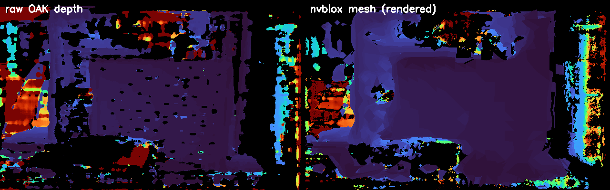
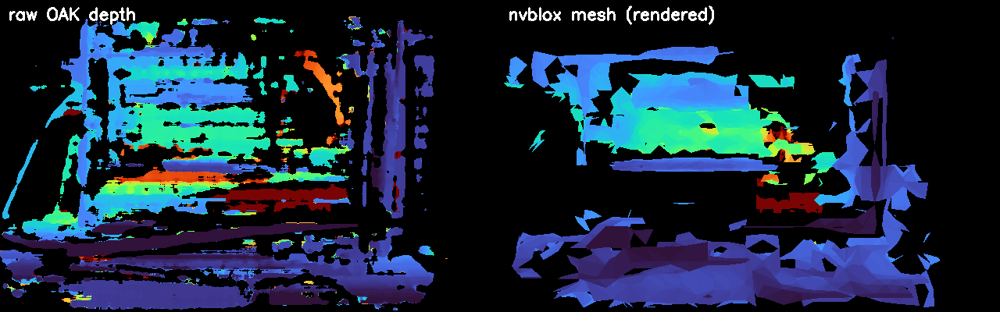

# 로봇의 뇌를 엣지에 올리기 — 모션편: 자세 다음은 움직임, 장애물 지도를 피해 가는 경로까지

> **현장 노트 · 모션편.** [정정편](jetson-foundationpose-16gb.md)부터 [스캔편](jetson-scan-no-cad.md)까지는 카메라 쪽 이야기였습니다. 글자로 지시하면 물체를 찾아 6-DoF 자세(위치와 방향)를 내놓는 데까지요. 그런데 자세는 숫자일 뿐이고, 로봇은 아직 한 발짝도 안 움직였습니다. 이번 글은 같은 엣지 컴퓨터에서 **자세를 움직임으로 바꾸는 쪽**을 시험한 기록입니다.

[펜던트에서 ROS 2로](ros2-for-robot-programmers.md) 시리즈에서 개념은 다 다뤘습니다. [3부](moveit2-goals-not-points.md)에서 MoveIt 2와 플래너를, [4부](isaac-ros-gpu.md)에서 GPU 플래너 cuMotion과 장애물 지도 nvblox를요. 이번에는 그걸 Orin NX 16GB 위에서 직접 실행해서 **숫자로** 확인했습니다. 중간에 하루는 장애물 지도가 틀렸다고 판단했다가, 다음 날 틀린 게 검사였다는 걸 알았어요. 그 과정도 그대로 싣습니다.

*(앞 글들과 같은 Jetson Orin NX 16GB와 OAK-D 3D 카메라로 사무실 책상에서 한 일반적인 R&D 기록입니다. 실제 로봇은 움직이지 않았고, 실제 힘도 재지 않았습니다.)*

---

## 30초 요약

- **cuMotion은 엣지에서도 빠르다.** UR10e 설정으로 계획 한 번에 중앙값 약 186 ms. 대신 처음 한 번은 GPU 준비에 16초가 걸리니, 첫 집기 때가 아니라 프로그램을 켤 때 미리 해 둔다.
- **nvblox는 답을 아는 장면에서 정확했다.** 계산으로 만든 깊이(0.6 m 상자, 1.0 m 벽)를 넣었더니 지도가 0.610 m, 1.000 m에 놓였다. 2 cm 칸 안이다.
- **라이브 카메라에서도 정확했다.** 평평한 장면에서 지도와 실제 깊이의 차이가 중앙값 5 mm. 첫날엔 보드가 지도에서 사라진 줄 알았는데, 지도의 점만 찍던 검사 프로그램이 틀렸던 것이다.
- **지도를 켜면 cuMotion이 물체를 피한다.** 녹화한 영상으로 만든 지도에서, 물체 속이나 너무 가까운 목표는 거부되고 빈 공간은 통과했다. 막힌 목표는 `NO_IK_SOLUTION`으로 돌아오니 헷갈리지 말 것.
- **UR 드라이버는 로봇 없이 올릴 수 있다.** 가상 하드웨어로 컨트롤러 13개(힘 모드 포함)가 모두 올라왔다. 단, 이 버전에서는 인자 이름이 `use_fake_hardware`다.
- **힘 제어는 지금 스택에서는 UR 힘 모드.** NVIDIA의 학습 기반 삽입 예제는 Isaac ROS 4.x 것이라, Orin에서 시도하려면 적어도 Isaac ROS 4.6과 JetPack 7.2로 올려야 한다.

---

## 자세 다음에 필요한 세 가지

물체의 자세를 알아도 로봇이 바로 집으러 갈 수는 없습니다. 세 가지가 더 있어야 해요.

1. **경로 계획:** 지금 팔 자세에서 물체 앞까지, 부딪히지 않는 길. 여기서는 cuMotion.
2. **장애물 지도:** 부딪히면 안 되는 것이 어디 있는지. CAD로 아는 것(작업대, 지그)은 플래닝 씬에 넣고, 모르는 것(두고 간 공구 상자, 늘어진 케이블)은 카메라로 봐야 합니다. 여기서는 nvblox.
3. **로봇 드라이버:** 계산한 경로를 실제 로봇 컨트롤러에 넘기는 통로. 여기서는 Universal Robots(UR)의 ROS 2 드라이버.

결과부터 보면 이렇습니다. 경로 계획과 장애물 지도, 그리고 둘을 잇는 것까지 동작했고, 드라이버는 가상으로만 확인했어요. 하나씩 보겠습니다.

## cuMotion, 준비는 한 번 길고 계획은 짧다

cuMotion은 NVIDIA의 GPU 경로 계획 라이브러리 cuRobo를 MoveIt 2에 끼워 쓰는 플러그인입니다. 이번에는 cuRobo에 들어 있는 UR10e 설정 파일로 시험했어요. 시작 자세를 바꿔 가며 다섯 번 계획했습니다.

| 항목 | 결과 |
|---|---|
| 처음 한 번 GPU 준비 | 16.4초 |
| 계획 한 번 | 중앙값 약 186 ms (61~190 ms) |
| 성공 | 다섯 번 중 네 번 |
| GPU 메모리 | 최대 +0.2 GB |

실패한 한 번은 일부러 크게 어긋나게 준 시작 자세였습니다. 계획이 실패하면 cuMotion은 "길을 못 찾았다"고 답하고 팔은 움직이지 않아요. 이상한 경로를 내놓는 게 아니라 멈추는 쪽이라 다행입니다. 프로그램은 이 답을 받아 다른 대기 자세에서 다시 시도하거나 사람을 부르게 만들면 됩니다.

여기서 실무에 바로 쓸 건 **16초**입니다. cuRobo는 처음 계획할 때 GPU 쪽 계산을 준비하느라 오래 걸리고, 그다음부터 빨라집니다. 그러니 첫 부품이 들어왔을 때 처음 계획하면 첫 사이클만 16초가 더 걸려요. 프로그램을 켤 때 아무 계획이나 한 번 미리 실행해 두면 됩니다.

[현장 노트 2부](jetson-isaac-foundation-models.md)에서 7축 팔(데모용 Franka 설정)로 잰 210 ms와 나란히 놓고 "빨라졌다"고 하지는 않겠습니다. 팔도 장면도 다르거든요. 둘 다 같은 엣지 컴퓨터에서 0.2초 안팎이라는 것까지가 말할 수 있는 범위입니다. 다른 UR 모델을 쓴다면 그 모델용 cuMotion 설정 파일(관절 한계, 충돌용 구 배치)을 따로 만들어야 합니다. UR의 MoveIt 설정에는 여러 모델이 들어 있지만, cuMotion 설정은 별개예요.

플래너를 고르는 기준은 [3부](moveit2-goals-not-points.md)에서 다뤘으니 짧게만 정리하면 이렇습니다.

| 플래너 | 하는 일 | 쓸 곳 |
|---|---|---|
| OMPL (RRT 계열) | 무작위로 나무를 뻗어 길을 찾는다. 어디든 찾지만 매번 다르고 구불구불할 수 있다 | 셋업, 넓은 공간 우회 |
| cuMotion | GPU로 후보 경로 여럿을 동시에 다듬는다. 매끄럽고 짧다 | 장애물이 많은 장면의 이동 |
| Pilz | 정해진 모양(관절 이동, 직선, 원호)을 그대로 | 부품 앞 마지막 몇 cm |

흔한 조합은 **이동은 cuMotion이나 OMPL로, 마지막 접근은 Pilz 직선으로**입니다. 이번에 설치된 Isaac ROS 3.2 환경에는 OMPL, Pilz, CHOMP, cuMotion 플러그인이 모두 들어 있었어요.

## 장애물 지도는 답을 아는 장면부터

nvblox는 깊이 영상을 받아 공간을 작은 정육면체(복셀)로 나누고, 칸마다 "가장 가까운 표면까지 거리"를 적은 지도를 만듭니다([4부](isaac-ros-gpu.md)의 'cuMotion은 무엇을 피하나'). 카메라를 바로 연결하고 싶었지만, 먼저 **답을 아는 장면**으로 시험했습니다. 라이브에서 지도가 이상하게 나오면 카메라 탓인지 설정 탓인지 가를 수 없기 때문이에요.

그래서 깊이 영상을 계산으로 만들었습니다. 카메라 앞 0.6 m에 상자, 1.0 m에 벽. 그걸 nvblox에 넣고, 나온 지도에서 두 면이 어디 놓였는지 쟀습니다.

| 항목 | 결과 |
|---|---|
| 상자 면 (정답 0.6 m) | 0.610 m |
| 벽 (정답 1.0 m) | 1.000 m |
| 지도 칸 크기 | 2 cm |
| 깊이 한 장을 지도에 더하는 시간 | 약 0.6 ms |
| 지도 출력 | 약 11 Hz |
| 메모리 | +0.4 GB |

두 면 모두 한 칸(2 cm) 안에 들어왔으니 **통과**입니다. 이걸로 nvblox 설정, 좌표 변환(로봇 기준 좌표계 `base_link`), 토픽 연결이 맞다는 건 확인됐어요. 남은 변수는 카메라뿐입니다.

## 라이브 카메라: 지도가 틀린 줄 알았다

이제 진짜 카메라입니다. OAK-D의 스테레오 깊이를 ROS 2 토픽으로 내보내고, nvblox가 그걸 받아 지도를 만들게 했습니다. 카메라 앞 0.39 m에 체커보드를 세웠어요.

속도는 처음부터 충분했습니다. 카메라는 초당 13.5장을 보냈고, 깊이 한 장을 지도에 더하는 데 4~7 ms, 메모리는 0.3~0.5 GB 늘었어요.

지도가 맞는지는 이렇게 확인했습니다. 지도를 카메라 시점으로 다시 그려서, 같은 픽셀에서 카메라가 잰 깊이와 비교하는 거예요. 첫날 결과는 나빴습니다. 3 cm 안으로 맞는 점이 **14%**뿐이었고, 바로 앞 보드가 지도에서 거의 사라진 것처럼 보였어요. 먼 곳을 잘못 잰 깊이가 보드를 지웠다는 그럴듯한 설명까지 세웠습니다.

다음 날 다시 보니, 틀린 건 지도가 아니라 **검사**였습니다.

검사 프로그램은 지도 메시의 꼭짓점만 한 픽셀씩 찍고 있었어요. 그런데 0.4 m 거리에서 2 cm 칸 하나는 화면에서 약 400 픽셀을 차지합니다. 점만 찍으니 가까운 보드는 대부분 빈칸으로 남았고, 그 틈으로 뒤쪽 먼 점들이 비쳐 보였죠. 메시의 면을 채워서 다시 그리자 결과가 완전히 달라졌습니다.

*왼쪽이 카메라가 잰 깊이, 오른쪽이 nvblox 지도를 같은 시점에서 면으로 채워 다시 그린 것입니다(색은 거리, 검은 곳은 값 없음). 그림 안 글자는 원본 그대로 영어입니다.*

| 장면 | 가까운 픽셀의 오차 (중앙값) | 3 cm 안 | 지도가 덮은 비율 |
|---|---|---|---|
| 평평한 체커보드, 어두운 사무실 | **5 mm** | 81% | 95% |
| 유리 옆판 PC 케이스, 조명 켬 | 19 mm | 63% | 95% |
| 같은 장면, 깊이를 1.5 m에서 자름 | 15 mm | 70% | 56% |

평평한 장면에서 중앙값 5 mm면 지도 칸(2 cm)보다 훨씬 작습니다. 어두운 조명도 문제가 아니었어요. 유리처럼 반사하는 면이 있으면 스테레오 깊이 자체가 흔들려서 19 mm로 커지지만, 그래도 칸 하나 정도입니다.

깊이를 1.5 m에서 잘라 넣으면 먼 곳의 잡음이 빠져서 오차가 조금 줄지만(19 → 15 mm), 지도가 덮는 범위가 95%에서 56%로 줄어듭니다. 작업 영역만 보면 되는 셀이라면 쓸 만하고, 아니라면 굳이 자를 필요는 없어요.

여기서 가져갈 건 숫자보다 **순서**입니다. 첫날의 14%만 믿었다면 nvblox를 의심하며 설정을 이리저리 바꿨을 거예요. 답을 아는 장면에서 이미 통과했으니, 도구보다 검사를 먼저 다시 볼 수 있었던 거예요. 도구를 의심하기 전에 측정부터 확인하세요. 그리고 [4부](isaac-ros-gpu.md)에서 말한 대로 nvblox는 사람을 지키는 장치가 아닙니다. 사람 안전은 로봇 컨트롤러의 안전 기능과 안전 센서가 맡습니다.

연결하면서 걸린 것들

- nvblox는 `base_link` 좌표 변환(TF)이 없으면 지도를 안 만듭니다. 깊이 토픽(`/camera_0/depth/image`)과 렌즈 정보 토픽(`/camera_0/depth/camera_info`)도 이 이름 그대로 있어야 했어요.
- 카메라 프로그램(DepthAI)과 nvblox가 서로 다른 Docker 컨테이너에 있어서, 두 컨테이너를 같은 `ROS_DOMAIN_ID`로 맞춰 토픽이 보이게 했습니다.
- USB 카메라는 한 프로그램만 잡을 수 있습니다. 자세 추정 데모가 카메라를 잡고 있으면 먼저 꺼야 해요.

## 한 번 녹화해 두면 카메라 없이 다시 본다

시험할 때마다 카메라를 켜고 물건을 다시 놓으면, 결과가 바뀌어도 장면 탓인지 설정 탓인지 알 수 없습니다. 그래서 카메라 영상을 **ROS bag**(토픽을 그대로 녹화한 파일)으로 남겼어요. 미니 PC와 무선 마우스를 체커보드 앞에 두고, 마우스를 손으로 움직이며 44초를 녹화했습니다. 컬러, 컬러에 맞춘 깊이, 좌우 영상, 렌즈 정보, 좌표 변환이 모두 시각이 맞춰져 들어갔어요(1.3 GB, 스트림마다 434장).

녹화하면서 두 가지를 챙겼습니다.

- **컬러 카메라의 초점을 공장 보정 위치에 고정했습니다.** [스캔편](jetson-scan-no-cad.md)에서 이 카메라의 공장 렌즈 값은 한 초점 위치에서만 맞는다는 걸 쟀었죠. 녹화 내내 그 위치에 고정해 두면 나중에 이 bag으로 무엇을 계산하든 렌즈 값이 맞습니다.
- **ROS 2 Python에서 영상 메시지를 만드는 방식 하나가 10배 속도 차이를 냈습니다.** 처음에는 초당 2.2장밖에 안 나왔는데, 카메라는 초당 10.4세트를 보내고 있었고 Python 처리도 2.6 ms면 끝났어요. 원인은 `Image.data`에 바이트 문자열을 그대로 넣는 부분이었습니다. `array("B")`로 채워 넣자 초당 10장이 모두 나왔어요.

이 bag을 nvblox에 다시 재생하니 카메라 없이도 깊이 425장이 모두 지도에 들어갔습니다(한 장에 약 1.8 ms). 이제 같은 장면으로 설정만 바꿔 가며 비교할 수 있어요.

## 지도를 경로 계획에 연결하기

지도가 맞는다는 걸 확인했으니, 이제 cuMotion이 그 지도를 장애물로 읽게 할 차례입니다. 녹화한 bag의 깊이로 nvblox 지도를 로봇 기준 좌표계에서 만들고, 카메라가 UR10e 받침대 옆에 있다고 가정하는 좌표 변환을 하나 줬습니다. 그다음 툴을 아래로 향한 목표 자세 몇 개를 보내 봤어요. 지도를 끈 경우와 켠 경우를 나란히 놓으면 이렇습니다.

지도를 끄면 미니 PC 속에 놓은 목표까지 계획이 나옵니다. cuMotion은 모르는 물체를 피할 수 없으니까요. 지도를 켜면 물체 속 목표는 거부되고, 빈 공간 목표는 그대로 통과합니다. 마우스 위 12 cm가 막힌 건 툴 끝이 아니라 **손목**이 표면에 너무 가까워져서였어요(8.9 cm). 미니 PC 위 목표가 막힌 건 바로 뒤에 있던 유리 PC 케이스(1.7~4.7 cm) 때문이었고요. 계획 한 번에 0.3~0.9초, 그중 지도를 가져오는 데 약 50 ms가 들었습니다.

하나 헷갈리는 점이 있습니다. 장애물 때문에 막힌 목표를 cuMotion은 **`NO_IK_SOLUTION`**(역기구학 해 없음)으로 돌려줘요. 이 이름만 보면 팔이 닿지 않는 자리라고 생각하기 쉬운데, 실제로는 충돌 때문일 수 있습니다. 같은 목표를 지도 없이 다시 계획해 보면 어느 쪽인지 바로 갈립니다.

## UR 드라이버를 로봇 없이 올리기

로봇이 없어도 드라이버까지는 확인할 수 있습니다. UR ROS 2 드라이버(이번 환경은 2.9.0, ROS 2 Humble)에는 ros2_control의 **가상 하드웨어**가 있어서, 로봇 대신 받은 명령을 그대로 따라 하는 흉내만 냅니다. 컨트롤러가 뜨는지, 명령이 오가는지 보기에는 충분해요.

결과는 컨트롤러 **13개가 모두** 올라왔습니다. 관절 궤적 컨트롤러는 물론이고 힘 모드, 프리드라이브(손으로 끌어 옮기기), 공구 접촉 감지 컨트롤러까지요.

하나 걸린 게 있습니다. 최신 문서는 가상 하드웨어 인자를 `use_mock_hardware:=true`로 안내하는데, **Humble용 2.9.0은 이 이름을 모릅니다.** `use_fake_hardware:=true`라고 써야 해요. 모르는 인자는 오류 없이 무시되고 드라이버는 실제 로봇용 설정으로 뜹니다. 가상 하드웨어로 띄웠다고 생각했는데 로봇 연결 오류가 난다면 이것부터 보세요. ROS 2 Jazzy용 드라이버부터는 `use_mock_hardware`입니다.

가상 하드웨어는 연결만 확인합니다. 실제 UR 컨트롤러처럼 움직여 보려면 UR의 시뮬레이터 **URSim**이 필요한데, 이건 Orin에서 실행되지 않았어요. PolyScope X용 URSim 이미지는 arm64 판이 있지만, 그 안에서 다시 띄우는 시뮬레이터 컨테이너가 x86 전용이었습니다. 그래서 URSim은 같은 망의 x86 PC에서 실행하고, Orin은 네트워크로 거기 붙는 구성이 됩니다.

여기에 앞에서 녹화한 ROS bag을 더하면 **카메라도 로봇도 없이** 전체 흐름을 실행해 볼 수 있습니다. 녹화한 카메라 영상으로 자세를 잡고, cuMotion이 계획하고, URSim의 가상 UR이 움직이는 거죠. 다만 힘과 접촉은 어느 쪽도 흉내 내지 않습니다. 그건 물리 시뮬레이터(Isaac Sim, RTX GPU 필요)나 실제 로봇의 몫입니다.

## 힘 제어는 지금 어디까지

부품을 끼우거나 눌러야 하는 마지막 몇 mm는 경로 계획보다 힘 제어가 맡습니다([3부](moveit2-goals-not-points.md)). 이번 스택에서 쓸 수 있는 건 UR 컨트롤러 자체의 힘 모드예요.

ROS 2 드라이버의 힘 모드 컨트롤러로 기준 좌표계, 힘을 따라 움직일(순응할) 축, 목표 힘, 속도 한계를 넘기면, 실제 힘 제어는 UR 컨트롤러 안에서 이뤄집니다. URScript의 `force_mode()`를 ROS 2에서 부르는 셈이에요. 이번에는 이 컨트롤러가 올라오는 것까지만 확인했습니다.

NVIDIA는 Isaac ROS 4.0부터 **학습 기반 기어 삽입** 예제를 내놨습니다. 시뮬레이션에서 강화학습으로 익힌 정책이 UR10e의 저수준 토크 인터페이스로 팔을 직접 다루는 방식이에요. 이 예제는 이번에 쓴 Isaac ROS 3.2에는 없습니다. Isaac ROS 4.x가 Orin을 지원하기 시작한 건 2026년 8월의 4.6부터라, Orin에서 시도하려면 최소한 Isaac ROS 4.6과 JetPack 7.2(Ubuntu 24.04, ROS 2 Jazzy)로 통째로 올려야 해요. 그렇게 올렸을 때 이 예제가 Orin에서 그대로 동작하는지는 확인하지 않았습니다. 버전은 한 세트로 바꾼다는 [4부](isaac-ros-gpu.md)의 원칙대로, 지금 체인이 다 동작하는 상태에서 서두를 이유는 없다고 봤습니다.

## 4부 표에 없던 몇 줄

[4부](isaac-ros-gpu.md)의 '시리즈를 한 장으로' 표는 J·L·C 이동, 티칭, 간섭 영역이 ROS 2에서 어디로 가는지 정리했습니다. 이번에 드라이버를 들여다보면서 그 표에 없던 줄 몇 개를 채웠어요. 펜던트 프로그램을 ROS 2로 옮겨 주는 자동 변환기는 없으니, 이런 대응표를 보고 손으로 옮겨야 합니다.

| 펜던트·URScript | ROS 2 쪽 |
|---|---|
| 블렌드(`movel`의 반경), 화낙 `CNT` | Pilz 모션 시퀀스 (여러 동작을 이어 붙여 한 번에) |
| 디지털 출력 (`set_digital_out`, `DO[]`) | UR 드라이버의 IO 컨트롤러 서비스 |
| `force_mode()`, 화낙 힘 제어 | 힘 모드 컨트롤러 |
| 접촉하면 멈추기 (화낙 `SKIP`) | 공구 접촉 컨트롤러 |
| 티칭 포인트 (오일러각, UR 회전 벡터) | 사원수(quaternion)로 바꾸거나 다시 티칭 |

마지막 줄이 생각보다 손이 갑니다. 화낙은 W·P·R 오일러각, UR은 회전 벡터(축과 각도)로 방향을 적는데, ROS는 사원수를 씁니다. 변환 공식은 정해져 있지만 각도 순서와 기준 좌표계를 하나라도 잘못 잡으면 툴이 엉뚱한 방향을 봐요. 옮긴 점은 가상 하드웨어나 URSim에서 먼저 확인하세요.

그리고 큰 그림에서는 "티칭한 점 + 비전 오프셋"이 **"파운데이션 모델이 잡은 물체 자세 + 집기 전 접근 오프셋"**으로 바뀝니다. 그 사이 경로는 cuMotion이 nvblox 지도의 장애물을 피해 계산하고요. 다만 [3부](moveit2-goals-not-points.md)의 자동화 사다리에서 본 것처럼, 편차가 작으면 티칭 경로와 오프셋이 여전히 더 단순하고 예측 가능합니다.

## 정리

| 단계 | 결과 | 다음 할 일 |
|---|---|---|
| cuMotion 경로 계획 | 계획 한 번 약 186 ms, 준비 16초는 처음 한 번 | 프로그램 시작 때 미리 준비. 쓸 UR 모델의 cuMotion 설정 만들기 |
| nvblox (답을 아는 장면) | 두 면 모두 2 cm 칸 안 | — |
| nvblox (라이브 카메라) | 평평한 장면 중앙값 5 mm, 유리 장면 19 mm. 카메라 속도를 따라감 | — |
| 지도 → cuMotion (녹화 영상) | 물체 속·너무 가까운 목표는 거부, 빈 공간은 통과. 계획 0.3~0.9초 | 파운데이션 모델이 잡은 자세를 목표로 넘기기 |
| UR 드라이버 (가상 하드웨어) | 컨트롤러 13개 모두, 힘 모드 포함 | x86 PC에서 URSim과 ROS bag으로 전체 흐름 |
| 힘 제어 | UR 힘 모드는 지금 스택에서 가능 | 실제 로봇에서 힘 재기 |

- **경로 계획은 엣지에서도 실전 속도입니다.** 준비 16초만 사이클 밖으로 빼면 됩니다.
- **장애물 지도는 답을 아는 장면부터 시험하세요.** 그래야 라이브에서 틀렸을 때 카메라 문제라고 좁힐 수 있습니다.
- **도구를 의심하기 전에 검사부터 확인하세요.** 답을 아는 장면에서 통과했던 덕분에, 라이브에서 나쁜 숫자가 나왔을 때 검사 쪽을 다시 볼 수 있었습니다.
- **한 번 녹화해 두면 같은 장면으로 계속 비교할 수 있습니다.** 카메라도 로봇도 없이요.
- **가짜는 층마다 확인하는 게 다릅니다.** 가상 하드웨어는 연결, URSim은 컨트롤러 동작, 물리 시뮬레이터나 실제 로봇은 힘과 접촉을 확인합니다.

---

참고 — 이 결과의 근거와 고지

수치는 Jetson Orin NX 16GB와 OAK-D 3D 카메라에서 2026년 10월 1~2일 **직접 측정한 값**입니다(Isaac ROS 3.2, ROS 2 Humble, JetPack 6). cuMotion은 cuRobo의 UR10e 설정 파일로 계획 다섯 번을 잰 것이고, nvblox 라이브 결과는 두 장면, 지도와 경로 계획 연결은 녹화한 한 장면에서 잰 것이라 통계라기보다 경향으로 봐 주세요. 이 글의 첫 판(10월 2일 아침)은 검사 프로그램의 오류 때문에 라이브 지도를 실패로 적었고, 같은 날 바로잡았습니다. 실제 로봇은 움직이지 않았고 실제 힘도 재지 않았습니다.

학습 기반 기어 삽입 예제와 UR10e 저수준 토크 인터페이스는 NVIDIA 기술 블로그 "Bridging the Sim-to-Real Gap for Industrial Robotic Assembly Applications Using NVIDIA Isaac Lab"과 Isaac ROS 4.0 발표를, Isaac ROS 4.6.0(2026년 8월 18일)의 Orin·JetPack 7.2 지원은 Isaac ROS 릴리스 문서를, `use_fake_hardware`(Humble)와 `use_mock_hardware`(Jazzy)의 차이는 Universal Robots ROS 2 드라이버 문서(docs.ros.org)를 근거로 했습니다.

NVIDIA·Jetson·Orin·JetPack·Isaac ROS·Isaac Sim·cuMotion·cuRobo·nvblox·RTX는 NVIDIA Corporation의, OAK-D·DepthAI는 Luxonis의, Universal Robots·UR·UR10e·URSim·PolyScope는 Universal Robots A/S의, FANUC는 FANUC Corporation의, MoveIt은 PickNik Inc.의, ROS는 Open Robotics의, Pilz는 Pilz GmbH & Co. KG의, Docker는 Docker, Inc.의 상표이며 지칭 목적으로만 사용했습니다.

**시리즈** · [← 이전 글: 스캔편 — CAD가 없는 물체, 인쇄한 보드 한 장과 사진 스무 장으로](jetson-scan-no-cad.md)

*관련: [티치 펜던트에서 ROS 2로 (3) — MoveIt 2](moveit2-goals-not-points.md) · [티치 펜던트에서 ROS 2로 (4) — Isaac ROS와 cuMotion](isaac-ros-gpu.md) · [카메라는 몇 대, 어디에](camera-placement.md) · [직접 해 보기: 실습 노트 (0) — SO-101과 URSim](learn-without-industrial-robot.md)*
