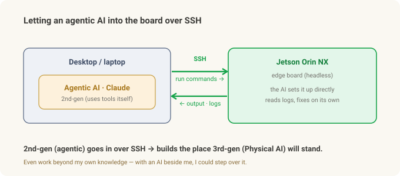
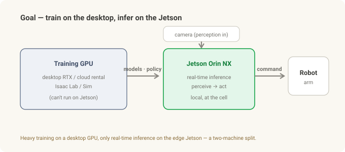
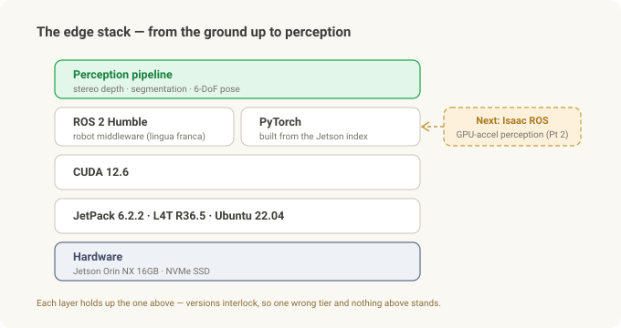

# Putting the Robot's Brain on the Edge (1) — From JetPack to ROS 2, and the Walls I Hit

> **Field notes · "The Robot's Brain on the Edge," Part 1 of 2.** This part is the road from a bare Jetson board to **ROS 2 running.** Part 2 (planned) puts **Isaac ROS** on top for GPU-accelerated perception.

First, a word on how this piece was written. A good share of the setup below, I **didn't type myself.** The first thing I did at the start was **open SSH on the Jetson so an agentic AI (2nd-gen — Claude) could reach the board directly**, and from there the AI ran the commands, read the logs, and worked through the blockers faster than my own hands. I **climbed past my own knowledge and ability with 2nd-gen AI, up onto 3rd-gen Physical AI.** How I wired that up comes shortly — first, what we're building and why.

The [Robot Vision series](stereo-to-grasp.md) was about how a robot *sees* — the pipeline that measures depth from stereo, cuts out the object with a mask, and pins down a 6-DoF pose. But all of that has to **actually run somewhere** — not in the cloud, but on a palm-sized computer bolted to the cell.

This is the story of building that "somewhere." Standing up the stack that becomes a robot's brain, from scratch, on a small edge computer called a **Jetson Orin NX**. And the honest version — the walls that hit me between unboxing the board and getting ROS 2 to run.

Physical AI is really about "AI moving into the robot." The place that AI actually **lands** is this edge computer. So this isn't a glamorous story; it's a story of grinding at the bottom of the stack. If it saves someone else the same grinding, good.

---

## In 30 seconds

- **Edge AI = running the perceive→act loop on a small computer next to the cell, with no cloud.** That computer is a **Jetson** (NVIDIA's edge GPU board).
- **Hardware:** Jetson **Orin NX 16GB** + an **NVMe SSD** (effectively required). Perception models and Docker images are too big for an SD card.
- **JetPack** (Jetson's OS + drivers + CUDA bundle) **6** flashed → Ubuntu 22.04 / CUDA 12.6. (Deliberately 6, *not* the newest 7 — more stable, thicker support.) The first walls show up here.
- **ROS 2 Humble** via apt — the common language of robot software. This part was relatively smooth.
- **The biggest wall:** `pip install torch` pulls the wrong CUDA build and won't run → you have to get it from a Jetson-specific index. The point where desktop instincts betray you.
- **The big picture:** heavy **training on a desktop GPU**, **inference on the Jetson.** ROS 2 is the on-ramp to the next step, **Isaac ROS** — which is Part 2.
- **Why it went fast:** I started by opening **SSH on the Jetson so an agentic AI (2nd-gen — Claude) could reach the board directly.** I climbed past my own knowledge with 2nd-gen AI to get up onto **3rd-gen Physical AI.**
- *This is a general Jetson setup experience, not a specific field deployment.*

---

## First — letting the AI in over SSH

This is the first place edge development diverges from the desktop. A Jetson is usually run **headless** (no monitor). So the starting sequence looks like this:

1. **First boot only** with a monitor and keyboard, to finish the initial setup (account, network).
2. Put it on the network over **wired Gigabit Ethernet.** (My industrial carrier board has no WiFi module, so wired was the surest path.)
3. Find the Jetson's IP (a static IP helps), and set up **key-based SSH login** from the desktop so you get in without a password (`ssh-keygen` → copy the public key to the board).
4. Then **hand that SSH connection to an agentic AI (Claude).** Now the AI runs commands on the board directly, reads the output and logs, and fixes things when it gets stuck. (If you need remote access, something like Tailscale gives you the same address from anywhere.)

That **one setup changed the speed of everything after it.** The walls coming up — the CUDA mismatch, the kernel breakage, the PATH issues — were mostly solved not by me but by the AI beside me, reading the logs as it went.

There's a nice nesting here. The generations from the Robot Vision series — 1st-gen generative (text, images), 2nd-gen agentic (decides for itself and uses tools), 3rd-gen physical (AI that moves into the robot). I used **2nd-gen agentic AI to stand up the edge box where 3rd-gen Physical AI will land.** The 2nd generation laid the runway for the 3rd. So this isn't a story about an experts-only domain — even work beyond my own knowledge, I could get over it with an AI beside me.

---

## Why the edge, and why Jetson

The loop where a robot sees and grabs a part — see, decide, move, feel force, correct — has to run in **milliseconds**. Round-trip it to the cloud? Latency is fatal, a dropped connection stops the robot, and plant security often forbids outbound connections at all. So perception and decision have to run **locally, on a computer attached to the cell.**

The catch is that this "small computer" needs a **GPU.** Deep-learning perception models are unusably slow without one — and you can't cram a desktop graphics card into a cell.

**Jetson** is the answer: NVIDIA's palm-sized edge computer with a GPU built in. The **Orin NX** is low-power and small while still packing enough GPU to run a perception pipeline. Two things are worth settling up front:

- **Why 16GB** — stereo, segmentation, and pose models eat a fair amount of memory. There's an 8GB variant, but run several models at once and it's tight. **16GB is the safe choice.**
- **Why an NVMe SSD** — this is what beginners miss most. Perception frameworks, Docker images, and model files quickly become tens of GB. They simply won't fit on the default storage (eMMC or an SD card). **Booting from an NVMe SSD** is effectively a prerequisite. (I used a 128GB NVMe, and the factory image left about half of it unallocated, so I had to grow the partition to full disk with `parted`.)

---

## Flashing JetPack 6 — replacing the OS from the ground up

First, terms. **JetPack** isn't plain Ubuntu — it's a **bundle of OS + GPU drivers + CUDA + acceleration libraries** assembled for Jetson, sitting on a kernel called **L4T** (Linux for Tegra). Because the versions are all interlocked, touching the wrong thing brings the whole thing down.

The board shipped on an old JetPack (5.x). To get newer CUDA / Ubuntu / ROS 2, I re-flashed to **JetPack 6.2.2** (L4T R36.5, Ubuntu 22.04, CUDA 12.6, Python 3.10). Flashing is done from an Ubuntu host PC with **SDK Manager**, putting the board into recovery mode and writing to the NVMe.

But one thing here was a **deliberate choice** — stopping at **JetPack 6, not the newest JetPack 7.** On the edge, "newest" isn't the answer. JetPack 6 is already well-stabilized, and its ecosystem support is **thick**: drivers, prebuilt ML packages (the Jetson PyTorch that comes up later), Isaac ROS, and a pile of accumulated community answers. The newest 7 is out front, but its support is still thin. I chose **"proven and supported" over "newest"** — a judgment that matters more the closer a thing gets to the floor.

Here are the walls that hit me — all real:

- **Do not run `sudo apt upgrade`.** Type it out of habit and you break the kernel. If you don't first `apt-mark hold` the `nvidia-l4t-*` packages, the A/B-partition post-install step fails on a single-NVMe layout and boot dies with `Rootfs AB is not enabled`. **Drop the update habit on JetPack.**
- **`nvcc` isn't on PATH.** CUDA is installed but the compiler isn't found. You have to add `/usr/local/cuda/bin` to PATH and the library path to `LD_LIBRARY_PATH` yourself (`.bashrc`).
- **`pip3`, `nano`, `curl` aren't even installed.** It's a minimal image; you install the basics yourself.
- **Network interface names change.** On JetPack 6, names like `eth0` become things like `enP8p1s0`, so old scripts and static-IP configs quietly break.

One lesson: JetPack is not "Ubuntu plus a little" — it's **"a version-locked Ubuntu that breaks easily when you poke it."** Bring desktop-Linux habits straight over and you'll get burned at least once.

---

## ROS 2 Humble — the common language of robot software

**ROS 2** (Robot Operating System 2), despite the name, isn't an OS — it's **middleware** for robot software. You make pieces like camera, perception, and motion into "nodes," and the nodes talk to each other over "topics." It's effectively the industry's common language, which makes it easy to bolt on parts other people built.

**Humble** is its LTS (long-term support) release. Installing it was relatively smooth — `apt` the `ros-humble-ros-base` package from `packages.ros.org`, install the build tool **colcon** via apt too, and source it in `.bashrc`.

The real wall came not from ROS 2 but from **the GPU stack standing right next to it.**

---

## The real wall — the night PyTorch wouldn't run

To run perception models you need **PyTorch** (a deep-learning framework) on the GPU. So I typed `pip install torch` without thinking. That mistake ate days.

Plain `pip` pulls a PyTorch built for the newest CUDA (say, CUDA 13). But my Jetson's driver is **CUDA 12.6.** The versions don't match, so it can't grab the GPU and throws a pile of inscrutable errors. On a desktop this would just work. Here it doesn't.

The fix was to get it from a **Jetson-specific index.** You have to pull PyTorch from NVIDIA's Jetson package index (Jetson AI Lab, built for JetPack 6 / CUDA 12.6) so the GPU is properly detected — not plain PyPI.

This is the essence of the edge. The **CPU architecture (ARM), CUDA version, JetPack, and framework build are all interlocked in one chain**, so a one-line command that's routine on a desktop is anything but here. Nine times out of ten, the answer to "why won't this work" is a **version mismatch.**

---

## The big picture — where this is going

That's the "as far as I've gotten" point. But you need to see where this setup is headed to understand why I did all of it.

The goal is a **two-machine division of labor.**

- **Training on a desktop GPU.** Heavy work like simulation and model training goes to an RTX-class desktop GPU. (The Jetson can't do this — a gotcha in its own right.)
- **Inference on the Jetson.** The trained models/policies come down to the Jetson, which runs only the real-time perceive→act loop at the cell.

And an honest confession. **The control loop that actually runs today is plain Python** — grab a frame from the camera, run the model, send a command to the robot. ROS 2 is still closer to "nice-to-have infrastructure." So why bother installing ROS 2 at all?

**Because it's the on-ramp to the next step, Isaac ROS.**

---

## Next — Isaac ROS, but there's a fork

Now that ROS 2 is up, the next step is **Isaac ROS** — NVIDIA's collection of GPU-accelerated ROS 2 perception packages. Think of it as the on-Jetson implementation of the very pipeline from the Robot Vision series — stereo depth, segmentation, 6-DoF pose — running fast and zero-copy on the board.

But you have to read the map before climbing. Isaac ROS has recently **split into two tracks** — an older JetPack 6 / ROS 2 Humble line, and a newest JetPack 7 / ROS 2 Jazzy line. My **JetPack 6.2.2** sits right near that fork. (By the same "stable and supported" logic I used to pick 6, the Humble side is the natural choice — but whether it actually slots in cleanly is something you only learn by doing it.) Which way to go, how it affects the existing ROS 2 version, and actually spinning up the container and running a first perception job — I'll write that honestly in Part 2, **after I've actually done it.**

The map is drawn. Now it's time to climb.

---

## Summary

| Step | Core | The wall that hit me |
|---|---|---|
| **Hardware** | Orin NX 16GB + NVMe SSD | SD card too small — NVMe required, grow the partition |
| **JetPack 6** | OS+drivers+CUDA bundle, flashed via SDK Manager | `apt upgrade` breaks the kernel · nvcc PATH · missing basics · NIC renames |
| **ROS 2 Humble** | robot middleware, installed via apt | (smooth) |
| **PyTorch/GPU** | runs the perception models | `pip torch` CUDA mismatch → Jetson-specific index |
| **Big picture** | train on desktop, infer on Jetson | today's loop is plain Python; ROS 2 is the road to Isaac ROS |
| **Next (Part 2)** | Isaac ROS | the two-track fork (Humble vs Jazzy) |

**The one thing to remember:** edge setup is hard not because Linux is hard, but because **architecture, CUDA, JetPack, and framework versions are all interlocked in one chain.** Knowing in advance where desktop instincts betray you turns days of grinding into an afternoon.

---

*Related: [From Stereo to Grasp](stereo-to-grasp.md) · [Frames & Transforms](frames-transforms.md)*

### Sources & trademarks

Versions and procedures follow NVIDIA's JetPack/Jetson documentation and the public ROS 2 (Humble) docs; JetPack, CUDA, ROS 2, and PyTorch versions vary by date and module, so these are approximate to my setup. Check the latest docs for your exact module before installing. This article is a general Jetson development-setup experience, not a specific field deployment. Jetson, JetPack, Isaac ROS, and CUDA are trademarks of NVIDIA; ROS is a trademark of Open Robotics — used here for identification only.

### Glossary

- *Jetson* — NVIDIA's small edge GPU computer; Orin NX is a mid-tier module in the family
- *JetPack* — the Jetson-specific bundle of OS + drivers + CUDA + acceleration libraries
- *L4T (Linux for Tegra)* — the Jetson Linux kernel / BSP that JetPack sits on
- *CUDA* — NVIDIA's platform for computing on the GPU; its version must match the framework
- *ROS 2 · Humble* — robot-software middleware and its LTS release
- *colcon* — the ROS 2 workspace build tool
- *NVMe SSD* — fast storage; effectively required to run a perception stack on Jetson
- *Edge AI* — running AI directly on the on-site device instead of in the cloud
- *Isaac ROS* — NVIDIA's GPU-accelerated ROS 2 perception packages (the subject of Part 2)
