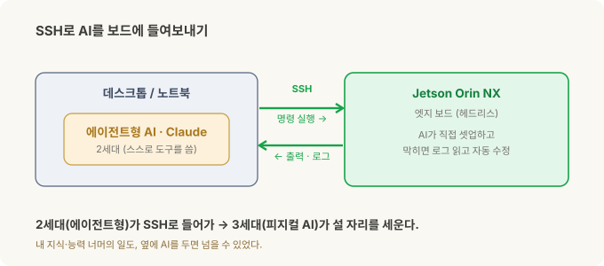
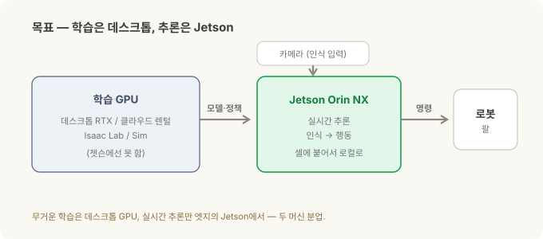
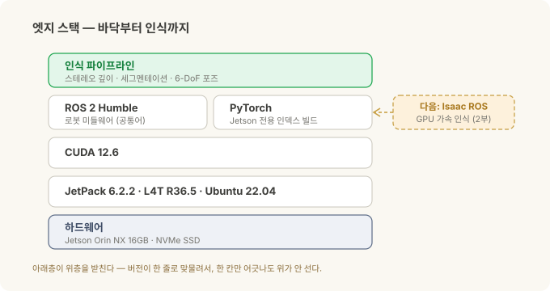

# 로봇의 뇌를 엣지에 올리기 (1) — JetPack부터 ROS 2까지, 내가 부딪힌 벽들

> **현장 노트 · '로봇의 뇌를 엣지에' 2부작 중 1부.** 이번 편은 아무것도 안 깔린 Jetson 보드에서 **ROS 2가 도는 상태**까지 실제로 걸어간 길입니다. 2부는 그 위에 **Isaac ROS**를 올려 GPU 가속 인식을 붙입니다.

먼저 이 글이 어떻게 쓰였는지부터 짚을게요. 여기 나오는 셋업의 상당 부분을, 저는 **직접 키보드로 치지 않았습니다.** 시작할 때 Jetson에 **SSH를 열어 에이전트형 AI(2세대·Claude)가 보드에 직접 들어오게** 해뒀고, 그 뒤로는 AI가 제 손보다 빠르게 명령을 치고 로그를 읽고 막힌 데를 풀었어요. **제 지식과 능력 너머의 일을 2세대 AI로 밟고 넘어, 3세대 피지컬 AI에 올라탄** 셈입니다. 그 시작(어떻게 붙였나)은 잠시 뒤에 자세히 — 먼저 무엇을·왜 만드는지부터.

[로봇 비전 시리즈](stereo-to-grasp.md)에서 로봇이 어떻게 *보는지*를 다뤘습니다. 스테레오로 깊이를 재고, 마스크로 물체를 오려내고, 6-DoF 포즈를 잡는 그 파이프라인. 그런데 그 전부가 **어딘가에서는 진짜로 돌아야** 합니다 — 클라우드가 아니라, 셀에 볼트로 붙은 손바닥만 한 컴퓨터 위에서요.

이 글은 그 "어딘가"를 세우는 이야기입니다. **Jetson Orin NX**라는 작은 엣지 컴퓨터에, 로봇의 뇌가 될 스택을 바닥부터 올린 기록. 그리고 정직한 버전 — 박스를 뜯고 나서 ROS 2가 돌기까지, 저를 문 벽들.

Physical AI는 결국 "AI가 로봇 속으로 들어가는" 흐름이에요. 그 AI가 실제로 **착륙하는 곳**이 바로 이 엣지 컴퓨터입니다. 그러니 이건 화려한 이야기는 아니고, 바닥에서 삽질한 이야기예요. 저처럼 삽질할 누군가에게, 지도가 되었으면 합니다.

---

## 30초 요약

- **엣지 AI = 클라우드 없이, 셀 옆 작은 컴퓨터에서 인식→행동을 돌리는 것.** 그 컴퓨터가 **Jetson**(NVIDIA의 엣지 GPU 보드)이에요.
- **하드웨어:** Jetson **Orin NX 16GB** + **NVMe SSD**(사실상 필수). 인식 모델과 도커 이미지가 커서 SD카드엔 안 들어갑니다.
- **JetPack**(=Jetson 전용 OS+드라이버+CUDA 묶음) **6**으로 플래시 → Ubuntu 22.04·CUDA 12.6. (일부러 최신 7이 아니라 6 — 더 안정적이고 생태계 지원이 두껍습니다.) 여기서 첫 벽들이 나옵니다.
- **ROS 2 Humble**을 apt로 설치 — 로봇 소프트웨어의 공통어. 여기까진 비교적 순탄.
- **제일 큰 벽:** `pip install torch`가 엉뚱한 CUDA 버전을 끌어와 안 돌아가요 → Jetson 전용 인덱스로 받아야 해결됩니다. 데스크톱 상식이 배신하는 지점.
- **큰 그림:** 무거운 **학습은 데스크톱·클라우드 GPU**에서, **추론은 Jetson**에서. ROS 2는 다음 단계인 **Isaac ROS**로 가는 길목이고, 그건 2부에서.
- **어떻게 빨랐나:** 시작할 때 Jetson에 **SSH를 열어 에이전트형 AI(2세대·Claude)가 보드에 직접 접근**하게 해두고 출발했어요. 제 지식 너머의 일을 2세대 AI로 밟고 넘어 **3세대 피지컬 AI**에 올라탄 셈입니다.
- *이건 특정 현장 배치가 아니라, 일반적인 Jetson 셋업 경험입니다.*

---

## 먼저 — SSH로 AI를 들여보내기

엣지 개발이 데스크톱과 다른 첫 지점이 여기예요. Jetson은 대개 **헤드리스**(모니터 없이)로 다룹니다. 그래서 시작 순서는 이렇습니다.

1. **첫 부팅**만 모니터·키보드를 붙여 초기 설정(계정·네트워크)을 마칩니다.
2. **유선 기가비트 이더넷**으로 망에 물립니다. (제 산업용 캐리어 보드엔 WiFi 모듈이 없어서, 유선이 제일 확실했어요.)
3. Jetson의 IP를 확인하고(고정 IP 권장), 데스크톱에서 **SSH 키 기반 로그인**을 걸어 비밀번호 없이 들어가게 합니다(`ssh-keygen` → 공개키를 보드로 복사).
4. 그다음 그 **SSH 접속을 에이전트형 AI(Claude)에게 넘깁니다.** 이제 AI가 보드에서 직접 명령을 치고, 출력과 로그를 읽고, 막히면 스스로 고쳐요. (원격에서 붙어야 하면 Tailscale 같은 걸로 어디서든 같은 주소가 되게 해두면 편합니다.)

이 **한 번의 셋업이 나머지 전부의 속도를 바꿨습니다.** 앞으로 나올 벽들 — CUDA 불일치, 커널 붕괴, PATH 문제 — 도 상당수는 제가 아니라, 옆에 앉은 AI가 로그를 읽어가며 풀었어요.

여기에 재미있는 포개짐이 있죠. 로봇 비전 시리즈의 세대 이야기 — 1세대 생성형(글·그림), 2세대 에이전트형(스스로 판단하고 도구를 쓰는), 3세대 피지컬(로봇 속으로 들어간 AI). 저는 **2세대 에이전트형 AI를 써서, 3세대 피지컬 AI가 착륙할 엣지 박스를 세운** 겁니다. 2세대가 3세대의 활주로를 깔아준 셈이에요. 그러니 이건 '전문가만의 영역'이라는 이야기가 아닙니다 — 제 지식 너머도, AI를 옆에 두면 넘을 수 있었어요.

---

## 왜 엣지인가, 왜 Jetson인가

로봇이 부품을 보고 집는 루프 — 보고, 판단하고, 움직이고, 힘을 느끼고 보정하고 — 는 **밀리초 단위**로 돌아야 합니다. 이걸 클라우드로 왕복시키면? 지연이 치명적이고, 인터넷이 끊기면 로봇이 멈추고, 공장 보안상 외부 연결 자체가 금지인 경우도 많아요. 그래서 인식과 판단은 **셀에 붙은 컴퓨터에서 로컬로** 돌아야 합니다.

문제는 그 "작은 컴퓨터"가 **GPU**를 품어야 한다는 거예요. 딥러닝 인식 모델은 GPU 없이는 느려서 못 씁니다. 그런데 셀에 데스크톱 그래픽카드를 우겨넣을 순 없죠.

**Jetson**이 그 답입니다. NVIDIA가 만든, 손바닥만 한데 GPU가 달린 엣지 컴퓨터예요. 그중 **Orin NX**는 저전력·소형이면서 인식 파이프라인을 돌릴 만한 GPU를 갖췄습니다. 두 가지는 처음부터 정해두는 게 좋아요.

- **왜 16GB인가** — 스테레오·세그멘테이션·포즈 추정 모델이 메모리를 꽤 먹습니다. 8GB짜리도 있지만 여러 모델을 동시에 돌리면 빡빡해요. **16GB가 안전한 선택**입니다.
- **왜 NVMe SSD인가** — 이게 초심자가 제일 자주 놓치는 부분입니다. 인식 프레임워크·도커 이미지·모델 파일은 금방 수십 GB가 돼요. 기본 저장소(eMMC나 SD카드)엔 애초에 안 들어갑니다. **NVMe SSD에서 부팅**하는 게 사실상 전제조건이에요. (저는 128GB NVMe를 썼는데, 공장 이미지가 절반쯤을 미할당으로 남겨둬서 `parted`로 풀디스크까지 넓혀야 했습니다.)

---

## JetPack 6 플래시 — OS부터 갈아엎기

먼저 용어. **JetPack**은 그냥 우분투가 아니라, Jetson용 **OS + GPU 드라이버 + CUDA + 가속 라이브러리**를 한 묶음으로 조립한 겁니다. **L4T**(Linux for Tegra)라는 커널 위에 얹혀 있고요. 즉 버전이 전부 맞물려 있어서, 아무거나 건드리면 와르르 무너집니다.

보드는 원래 구형 JetPack(5.x)으로 왔어요. 그래서 더 최신 CUDA·Ubuntu·ROS 2를 쓰려고 **JetPack 6.2.2**(L4T R36.5, Ubuntu 22.04, CUDA 12.6, Python 3.10)로 재플래시했습니다. 플래시는 우분투 호스트 PC에서 **SDK Manager**로, 보드를 리커버리 모드에 넣고 NVMe에 굽는 방식이에요.

다만 여기서 한 가지는 **의도적인 선택**이었습니다 — 가장 최신인 **JetPack 7이 아니라 6에 멈춘 것**. 엣지에서는 '가장 새것'이 답이 아니거든요. JetPack 6은 이미 안정화가 충분히 됐고, 드라이버·미리 빌드된 ML 패키지(뒤에 나올 Jetson용 PyTorch)·Isaac ROS·쌓인 커뮤니티 답변까지 **생태계 지원이 두껍습니다.** 최신 7은 앞서가는 만큼 아직 지원이 얇고요. '새것'보다 **'검증되고 받쳐주는 것'**을 택한 겁니다 — 현장에 들어갈 물건일수록 이 판단이 중요해요.

여기서 저를 문 벽들 — 전부 실제로 걸린 것들이에요:

- **`sudo apt upgrade`를 하지 마세요.** 습관적으로 쳤다간 커널이 깨집니다. `nvidia-l4t-*` 패키지들을 먼저 `apt-mark hold`로 묶어두지 않으면, 단일 NVMe 레이아웃에서 A/B 파티션 후처리가 실패하면서 `Rootfs AB is not enabled` 에러로 부팅이 망가져요. **JetPack에서 업데이트 습관은 버리세요.**
- **`nvcc`가 PATH에 없습니다.** CUDA는 깔려 있는데 컴파일러가 안 잡혀요. `/usr/local/cuda/bin`을 PATH에, 라이브러리 경로를 `LD_LIBRARY_PATH`에 직접 추가해야 합니다(`.bashrc`).
- **`pip3`·`nano`·`curl`조차 없습니다.** 미니멀 이미지라 기본 도구부터 직접 깔아야 해요.
- **네트워크 인터페이스 이름이 바뀝니다.** JetPack 6에서 `eth0` 같은 이름이 `enP8p1s0` 식으로 바뀌어서, 예전 스크립트나 고정 IP 설정이 조용히 다 깨집니다.

교훈 하나. JetPack은 "우분투 + 약간"이 아니라 **"손대면 깨지기 쉬운, 버전이 꽉 맞물린 우분투"**입니다. 데스크톱 리눅스 습관을 그대로 들고 오면 반드시 한 번은 됩니다.

---

## ROS 2 Humble — 로봇 소프트웨어의 공통어

**ROS 2**(Robot Operating System 2)는 이름과 달리 OS가 아니라, 로봇 소프트웨어를 위한 **미들웨어**예요. 카메라·인식·모션 같은 조각들을 '노드'로 만들고, 노드들이 '토픽'으로 서로 메시지를 주고받게 해줍니다. 사실상 로봇 업계의 공통어라, 남이 만든 부품을 가져다 붙이기 쉬워지죠.

**Humble**은 그 LTS(장기 지원) 배포판입니다. 설치 자체는 비교적 순탄했어요 — `packages.ros.org`에서 apt로 `ros-humble-ros-base`를 깔고, 빌드 도구인 **colcon**도 apt로, `.bashrc`에서 source 걸어주면 끝.

정작 진짜 벽은 ROS 2가 아니라, **그 옆에 나란히 서는 GPU 스택**에서 왔습니다.

---

## 진짜 벽 — PyTorch가 안 돌던 밤

인식 모델을 돌리려면 **PyTorch**(딥러닝 프레임워크)를 GPU로 띄워야 합니다. 그래서 아무 생각 없이 `pip install torch`를 쳤죠. 그게 며칠을 잡아먹은 실수였어요.

일반 `pip`은 최신 CUDA(예: CUDA 13)용으로 빌드된 PyTorch를 끌어옵니다. 그런데 제 Jetson의 드라이버는 **CUDA 12.6**이에요. 버전이 어긋나니 GPU를 못 잡고, 온갖 알 수 없는 에러가 납니다. 데스크톱이라면 그냥 됐을 일이, 여기선 안 돼요.

해결책은 **Jetson 전용 인덱스**에서 받는 것이었습니다. NVIDIA의 Jetson용 파이썬 패키지 인덱스(Jetson AI Lab, JetPack 6·CUDA 12.6에 맞춘 빌드)에서 PyTorch를 가져와야 GPU가 제대로 잡혀요. 일반 PyPI가 아니라요.

이게 엣지의 본질입니다. **CPU 아키텍처(ARM)·CUDA 버전·JetPack·프레임워크 빌드가 전부 한 줄로 맞물려** 있어서, 데스크톱에서 당연하던 한 줄 명령이 여기선 하나도 당연하지 않아요. "왜 안 되지"의 답이 열에 아홉은 **버전 불일치**입니다.

---

## 큰 그림 — 이게 어디로 가나

여기까지가 "여기까지 온" 지점입니다. 그런데 이 셋업이 향하는 목적지를 알아야 왜 이걸 다 했는지가 보여요.

목표는 **두 머신 분업**입니다.

- **학습은 데스크톱(또는 클라우드) GPU에서.** 시뮬레이션과 모델 학습처럼 무거운 일은 RTX급 데스크톱 GPU — 없으면 **클라우드 GPU 렌털** — 이 맡아요. (어느 쪽이든 젯슨에선 못 합니다 — 뒤에 나올 함정이기도 하고요.)
- **추론은 Jetson에서.** 학습으로 나온 모델·정책을 Jetson으로 내려서, 셀에서 실시간 인식→행동만 돌립니다.

그리고 솔직한 고백. **지금 실제로 도는 제어 루프는 순수 파이썬**이에요 — 카메라에서 프레임을 받아, 모델을 돌리고, 로봇에 명령을 보내는. ROS 2는 아직 "있으면 좋은 선택적 인프라"에 가깝습니다. 그럼 왜 굳이 ROS 2를 깔았을까요?

**다음 단계인 Isaac ROS로 가는 길목이기 때문**입니다.

---

## 다음 편 — Isaac ROS

ROS 2까지 왔으니 다음은 **Isaac ROS**입니다. NVIDIA가 만든, GPU로 가속되는 ROS 2 인식 패키지 모음이에요. 로봇 비전 시리즈에서 본 그 파이프라인 — 스테레오 깊이, 세그멘테이션, 6-DoF 포즈 — 을 젯슨 위에서 zero-copy로 빠르게 돌리는 실장판입니다.

미리 짚어둘 갈림길이 하나 있어요. 최근 Isaac ROS는 **두 갈래**로 나뉩니다 — 옛 JetPack 6/ROS 2 Humble 계열과, 최신 JetPack 7/ROS 2 Jazzy 계열. 제가 선 **JetPack 6.2.2**에선, 앞서 '안정·지원'을 이유로 6을 택한 그 논리 그대로 **Humble 쪽**이 자연스러운 선택이죠. 2부에서 이 위에 인식 스택을 올립니다.

---

## 정리

| 단계 | 핵심 | 나를 문 벽 |
|---|---|---|
| **하드웨어** | Orin NX 16GB + NVMe SSD | SD카드론 부족 — NVMe 필수, 디스크 확장 |
| **JetPack 6** | OS+드라이버+CUDA 묶음, SDK Manager로 플래시 | `apt upgrade` 커널 붕괴 · nvcc PATH · 기본 도구·NIC 이름 |
| **ROS 2 Humble** | 로봇 미들웨어, apt로 설치 | (순탄) |
| **PyTorch/GPU** | 인식 모델 구동 | `pip torch`가 CUDA 불일치 → Jetson 전용 인덱스 |
| **큰 그림** | 학습=데스크톱, 추론=Jetson | 지금 실루프는 순수 파이썬, ROS 2는 Isaac ROS로 가는 길 |
| **다음(2부)** | Isaac ROS | 두 트랙(Humble vs Jazzy) 갈림길 |

**기억할 한 가지:** 엣지 셋업의 어려움은 리눅스가 어려워서가 아니라, **아키텍처·CUDA·JetPack·프레임워크 버전이 전부 한 줄로 맞물려** 있어서입니다. 데스크톱 상식이 배신하는 그 지점들을 미리 알면, 삽질이 반나절로 줄어요.

---

*관련: [스테레오 비전에서 목표물 잡기까지](stereo-to-grasp.md) · [좌표계와 변환](frames-transforms.md) · [Physical AI에 투자한다면 — 코봇 투자편](cobot-investing.md)*

### 출처와 표기

버전·절차는 NVIDIA의 JetPack·Jetson 문서와 ROS 2(Humble) 공개 문서를 근거로 했고, JetPack·CUDA·ROS 2·PyTorch 버전은 시점과 모듈에 따라 달라지는 값이라 제 셋업 기준의 근사치입니다. 실제 설치 전 각자 모듈의 최신 문서를 확인하세요. 본 글은 특정 현장 배치가 아니라 일반적인 Jetson 개발 셋업 경험이며, Jetson·JetPack·Isaac ROS·CUDA는 NVIDIA의, ROS는 Open Robotics의 상표로 지칭 목적으로만 사용했습니다.

### 용어 설명

- *Jetson* — NVIDIA의 엣지용 소형 GPU 컴퓨터. Orin NX는 그 중형급 모듈
- *JetPack* — Jetson 전용 OS+드라이버+CUDA+가속 라이브러리 묶음
- *L4T (Linux for Tegra)* — JetPack이 얹히는 Jetson용 리눅스 커널·BSP
- *CUDA* — NVIDIA GPU로 계산을 돌리는 플랫폼. 버전이 프레임워크와 맞아야 함
- *ROS 2 · Humble* — 로봇 소프트웨어 미들웨어와 그 LTS 배포판
- *colcon* — ROS 2 워크스페이스 빌드 도구
- *NVMe SSD* — 고속 저장장치. Jetson에서 인식 스택을 돌리려면 사실상 필수
- *엣지 AI* — 클라우드가 아니라 현장 기기에서 직접 AI를 돌리는 것
- *Isaac ROS* — NVIDIA의 GPU 가속 ROS 2 인식 패키지 모음(2부 주제)
