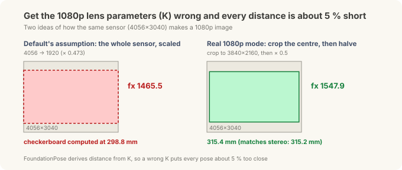
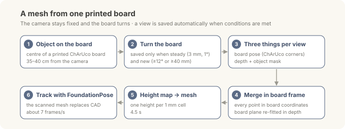
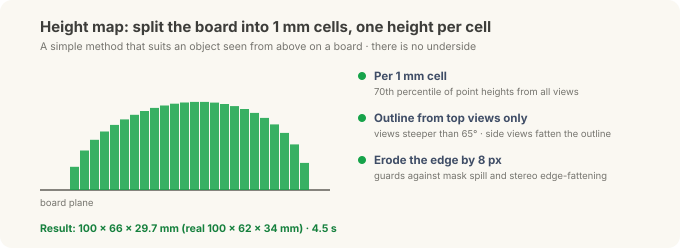

# Putting the Robot's Brain on the Edge — Scanning: No CAD? One Printed Board and Twenty Photos

> **Field Notes · Scanning.** In [the correction post](jetson-foundationpose-16gb.md) and [the tuning post](jetson-tuning-licensing.md), FoundationPose found a mini PC's 6-DoF pose from the maker's public CAD file. The mouse on the desk had no CAD, so its chain stopped at a 3D position. This post fills that gap. **No CAD? Photograph it and build one.**

Model-based pose estimation like FoundationPose takes a 3D model of "what this object looks like" as input. With a model, it handles objects it has never seen, with no training; without one, it can't start. Factory parts usually have CAD, but objects without it are common too: suppliers' parts, old jigs.

We tried two answers. One is a simple method: **photograph the object on a printed board and build the mesh yourself**. The other is the **model-free mode (BundleSDF)** that NVIDIA's researchers released alongside FoundationPose.

*(Same Jetson Orin NX 16GB and OAK-D stereo camera as the earlier posts, and a wireless mouse on an office desk; general R&D, not a site deployment.)*

---

## 30-second summary

- **One printed ChArUco board is enough.** Put the object in the middle, turn the board in front of a fixed camera, and a view is saved automatically whenever conditions are right. About twenty photos do it.
- **The mesh takes 4.5 seconds.** A "height map" splits the board into 1 mm cells with one height each; the result is 100×66×29.7 mm against the real 100×62×34 mm.
- **Track with that mesh straight away.** The detect → mask → depth → FoundationPose chain follows the mouse at about 7 frames per second using the scanned mesh instead of CAD, all with commercially usable parts.
- **BundleSDF (model-free) ran on the same photos.** It got the width more exactly (61.7 mm), but took 8.7 minutes, fit the live depth less well than the height map, and is research-licensed.
- **Check the camera before scanning.** On the OAK-D we used, the 1080p mode's default lens parameters (K) put every distance 5.6 % short, and autofocus shifted the focal length by 3.3 % up close (17 cm). With an autofocus camera and its factory values, the key is **don't get closer than the factory-calibration distance (about 44 cm on this camera)**; going farther barely changed the error. Every camera behaves differently, both in the numbers and in whether the trap exists at all, so check the one you're using.

---

## Why a printed board

To build a 3D shape from several photos, you need to know **where the camera saw the object from** in each photo; only then can the points from every photo go into one coordinate frame. Professional scanners know this from a turntable angle or built-in sensors; photogrammetry software estimates it by matching features across photos.

A printed board solves it in the cheapest way. We know exactly where every pattern on the board is, so whenever the board is in view, the camera's position and angle relative to the board can be computed directly. The object sits still on the board, so **board coordinates are object coordinates**.


A ChArUco board combines a checkerboard (black-and-white grid) with ArUco markers (small QR-like tags). The checkerboard corners give very precise positions; the markers say "which corner this is". So **even when the object hides part of the board**, the visible corners are enough. In scanning, the object always covers the middle of the board, so this property is essential.

| Item | Value |
|---|---|
| Paper | US Letter landscape (279.4 × 215.9 mm) |
| Squares | 13 × 10, 19.0 mm each |
| Markers | 14.0 mm, OpenCV `DICT_5X5_100` |
| Corners | 108 inner corners |
| Check | Measure the bar at the bottom: exactly 100 mm |

**[Download the board (SVG, actual size)](../assets/downloads/charuco-scan-board-letter.svg)**. Turn off "fit to page" and print at **100 % / actual size**. If the bar isn't 100 mm, every dimension is off by the same ratio. Our print measured exactly 100 mm, so the 19.0 mm square size could be trusted as is.

> **Print it from Inkscape.** In our tests, the only app that printed the SVG at exactly 100 % was the free vector editor **Inkscape**. Other apps changed the size slightly even when set to "actual size". Open the file in Inkscape, print it on Letter landscape as is, and check the bar is 100 mm with a ruler.

<details>
<summary>Making the same board with OpenCV</summary>

```python
import cv2
board = cv2.aruco.CharucoBoard(
    (13, 10),            # squares across, down
    0.019, 0.014,        # square side, marker side (m)
    cv2.aruco.getPredefinedDictionary(cv2.aruco.DICT_5X5_100))
img = board.generateImage((2600, 2000), marginSize=0)   # PNG preview
cv2.imwrite("charuco_13x10.png", img)
```

A PNG's print scale depends easily on printer settings, so for the real print, an SVG or PDF drawn in millimetres is safer. Whatever file you use, measure the bar or a square with a ruler.

</details>

## Check the camera before scanning: three traps we found on this one

To compute the camera position from the board, you need the camera's **lens parameters (K)**: focal length and image centre. If they're wrong, the distance to the board is wrong, and the mesh and poses built on it are wrong with it. We found three traps on the OAK-D we used.

One thing first: the numbers below come from **this one camera**. They don't mean every camera behaves this way. How the sensor is cropped and scaled, the factory calibration, and the lens type all vary by camera (and unit to unit within a model); on another camera a trap may not exist at all, or may show up at a different size. What carries over is not the numbers but **the way to check** (the checklist at the end of this section).



**Trap 1: this camera's 1080p lens parameters were 5.6 % off.** This camera's colour sensor is 4056×3040, and its 1080p image is made by cropping the central 3840×2160 and halving it. But the 1080p lens parameters the camera SDK returned by default assumed "the whole sensor was scaled to 1920 wide". The focal length came out as 1465.5; following the crop-and-halve correctly gives 1547.9.

It shows up directly in distance. With the default, the checkerboard came out at 298.8 mm; with the corrected value, 315.4 mm. The same scene measured separately with the stereo pair gave 315.2 mm, so the correction is right. FoundationPose computes distance from these lens parameters too, so with the default, **every pose would have come out about 5.6 % too close**, without a single error message.

**Trap 2: the stereo rectification was 1.9 pixels off vertically.** A stereo camera aligns (rectifies) its left and right images to the same height, then measures depth from the left–right shift. Matching hundreds of the same points in the rectified pair and comparing their vertical positions showed a consistent 1.8–1.9 px offset, regardless of the scene. A well-calibrated camera is within 0.5 px. That's enough to degrade the camera's on-board depth, so this unit needs recalibrating.

**Trap 3: autofocus changes the lens parameters.** This camera's colour lens is autofocus (AF), so the lens moves to focus on near objects. When the lens moves, the focal length changes a little too. But this camera's factory lens parameters are a single value, for one lens position (the one that focuses at about 44 cm).

We measured how much it changes. The stereo cameras have fixed focus, so their lens parameters don't change; using them as the reference, we put the board at several distances and compared the colour camera's real focal length.


*The horizontal axis is the lens position (higher = closer focus); the vertical axis is the real focal length relative to the factory value. The stars are where autofocus actually settled; the black dashed line is the correction table built for this camera.*

These are from this one unit; a different lens will shift by a different amount.

| Board distance | Autofocus lens position | Error vs factory value |
|---|---|---|
| 17 cm | 180 | **+3.3 %** |
| 24 cm | 161 | +2.3 % |
| 44 cm | 143 | +0.2 % |
| 59–77 cm | 133–137 | −0.4 % |

The closer, the bigger the error. At 17 cm, 3.3 % means an object 20 cm away is placed 6–7 mm off. Depth comes from the fixed-focus stereo cameras, so it's unaffected; only positions computed from the colour image (the board pose, FoundationPose's input) are skewed. Our scan was taken at about 40 cm, right where the factory value holds, which is why the problem didn't show.

So should you lock the focus manually? Up close, that isn't the answer either.


On this camera at 17 cm, moving just ±15 steps from the autofocus position blurs the image. Lock the focus in one place and other distances go blurry, and in a blurry image the board corners can't be found precisely.

We found two more things on this camera. After a big lens move, the lens takes time to settle: 2.5 s later it was still about 1 % off. And at the lens's end stop (its closest focus), the error grew to +6 %. The timing and size will differ by camera, but using only frames where the lens position has stopped changing holds for any autofocus camera.

There are three fixes.

- **Work near the factory-calibration distance:** if you use the factory values as they are, with no table, the simplest fix is to keep the object near the distance where they hold. On this camera the error was +0.2 % at 44 cm and −0.4 % at 59–77 cm: it barely changes going farther, and climbs steeply going closer. It's less "44 cm is optimal" than **"don't get closer than the factory-calibration distance"**. Too far has its own cost, though: the object covers fewer pixels and stereo depth error grows, so about 40–50 cm looks like a safe range for this camera. Which distance the factory values fit differs by camera, so check yours first.
- **A per-camera correction table:** tabulate the focal length per lens position, and on every frame look up the value from the lens position the camera reports. Tested on sessions not used to build the table, the error dropped from 1.4 % median (5.9 % max) to **0.24 % (1.1 % max)**. It has to be built separately for each camera.
- **A fixed-focus camera:** if measurement is the goal, a fixed-focus model is cleanest from the start. Check that its closest sharp distance is nearer than your working distance.

Again, the numbers above are this camera's. Yours may not have these traps, or may have them at a different size. What they share is that all three **produce plausible numbers**, so you can't spot them from the results. When you use a new camera or a new resolution mode (or even another unit of the same model), check three things first:

- With a flat target at a known distance (a checkerboard), does the distance from the lens parameters match the stereo distance?
- In the rectified pair, is the vertical offset between matching points within 0.5 px?
- With an autofocus camera, does the first check still hold at your actual working distance? (The factory value is right at only one distance.)

## How to scan



The camera stays fixed; you slowly turn the board, with the object on it, 35–40 cm in front of the camera. The program looks for the board every frame and saves a view only when two conditions hold.

- **Steady:** the board moved less than 3 mm and 1° over three consecutive frames. This filters out blurred photos.
- **New:** the view differs by at least 12°, or at least 40 mm, from every view already saved. This avoids collecting the same angle many times.

We also required at least 15 visible board corners and a board-pose error (reprojection error) under 2 px. In practice, with the mouse covering the board, 45–71 of 108 corners were visible and the error was 0.6–0.7 px.

Each photo yields three things.

1. **Board pose:** the board's position and angle as seen by the camera, computed from the visible ChArUco corners
2. **Depth:** per-pixel distance from FoundationStereo
3. **Object mask:** Grounding DINO finds a box for the text "a computer mouse" and SAM2 cuts it out. On top of that goes a condition: "points 1–150 mm above the board surface".

Then all points inside the mask move into the board frame and are gathered together.

### Traps along the way

It wasn't clean from the start. These are the things we fixed one by one.

- **Depth and board pose disagreed by 0.3–8 mm per view.** The board pose (from corners) and the stereo depth are measured in different ways, so they differ slightly. Merged as is, the "at least 1 mm above the board" condition kept only the top of the mouse. So we re-fitted the board plane **inside the depth data**, using the board visible around the object, and corrected every point to that plane.
- **Not too far.** At about 90 cm the mask was patchy. Moving in to 40 cm, the mouse filled about a quarter of the frame and both depth and mask came out clean.
- **Shiny spots dropped out of the mask.** SAM2 treated the highlight on the mouse's top as not part of the object and left holes. The depth there was fine, so we filled the mask inside its outer outline. Views at 40 cm, whose outline used to drop to 55 %, now keep 91–96 %.
- **Edges bloated.** The mask was slightly generous, and stereo depth tends to spread at object edges, so the first mesh was 112×79 mm, far bigger than the real thing. Eroding the edge by 8 px fixed it.

## Building the mesh: a height map

With the points gathered, we need a surface. The plan was the standard method of stacking depth from many views into a volume grid (TSDF fusion) or Poisson surface reconstruction, but in Open3D 0.20 for the Jetson (ARM), neither worked properly. So we chose a simpler method that suits this setup.



Seen from above the board, the object is like terrain with "a height per cell". Split the board into 1 mm cells and take the **70th percentile** of the point heights gathered in each cell from all views as that cell's height. The 70th percentile instead of the maximum keeps a few stray points from dominating. Colour is the per-cell median; empty cells are filled from their neighbours; then the top, sides and bottom are joined into a closed mesh.

One more lesson here. Adding 12 low-angle views to the 11 top views actually fattened the outline to 104×74 mm. Side views blur the boundary between the object's side and its shadow, so they draw the outline too wide. So we split the job: **the outline comes only from views steeper than 65°, the height from all views**.

| Mesh | Length × width × height |
|---|---|
| 11 top views | 99 × 64 × 28.9 mm |
| 23 views, all used for the outline | 104 × 74 × 29.7 mm (side views fatten the outline) |
| **23 views, outline from top views only** | **100 × 66 × 29.7 mm** |
| Re-scan after the highlight mask fix | 102 × 63 × 29.5 mm |
| Real | 100 × 62 × 34 mm |

Length and width are within a few millimetres, but height comes out about 4 mm low. The mouse's top is shiny, so stereo couldn't measure depth there, and those cells were filled from lower neighbours. More views don't fix it; a matte spray or powder that kills the reflection does. It's the shiny-part depth problem from [the tuning post](jetson-tuning-licensing.md) again.

The mesh takes **4.5 seconds** to build.

## Tracking with the scanned mesh

We put the mesh in place of CAD and ran the tuning post's commercial chain unchanged (Grounding DINO → SAM2 → ESS → Isaac ROS FoundationPose). It followed the correct pose at 6.9 frames/s from about 35 cm, and at 6.7 frames/s from a low angle (about 26 cm). **From scan to live 6-DoF tracking with no CAD, all with commercially usable parts.**

## Comparison with BundleSDF (model-free)

FoundationPose has a separate **model-free mode** that works without CAD. Give it a few reference photos of the object from different directions, and it learns the object's shape with a neural network using a method called BundleSDF, then builds a mesh. The network learns how far each point in space is from the surface, so in principle it can capture shapes a height map can't (a handle loop, an undercut).

We fed it the same 23 scan photos; no new photos were needed. Running it on the Jetson took a few changes (dropping one library that has no ARM build, and fixing a render path that depended on it). The learned shape also invented about 12 mm of geometry below the board, which had to be cut off at the board plane.


We compared them with the mouse sitting still, tracking for 30 seconds each.

| | Height map | BundleSDF (model-free) |
|---|---|---|
| Size (real 100 × 62 × 34 mm) | 100 × 66 × 29.7 mm | 96.2 × **61.7** × 27.7 mm |
| Build time | **4.5 s** | 8.7 min (1000 training steps) |
| Tracking kept / losses | 100 % / 0 | 100 % / 0 |
| Mesh vs measured depth (median) | **2.8 mm** | 4.2 mm |
| Outline overlap with the mask (IoU) | **0.85–0.91** | 0.79–0.83 |
| Pose jitter (x/y/z std) | 0.5 / 0.5 / 1.5 mm | 0.5 / 0.9 / 1.7 mm |
| Licence | Commercially usable (own method) | NVLabs research only |

In a 30-second hand-moving test, both tracked 99 % of the time. BundleSDF lost the object once and the height map twice, all found again within 3.4 s, with no 180° flips. In motion, the difference was negligible.

In short, BundleSDF got **the width most exactly**, but the height map fit the live depth better, builds about 100 times faster, and can be used commercially. BundleSDF earns its place for shapes a height map can't represent, or when you have a video of the object turned 360° in the hand.

## What doesn't work yet: upside down


A scan taken on the board **has no underside**. The mesh's bottom is a flat plate with made-up colour. So when the mouse is flipped, there's nothing real to match and the pose is wrong.

We did add a way to notice it. Rendering the mesh at the estimated pose and comparing that depth with the measured depth, the difference is 2.9–4.1 mm upright and 14–19 mm flipped. Exceeding 6 mm twice in a row triggers re-detection. Because the near-symmetric mouse can also flip front-to-back, every registration also scores the pose turned 180° and keeps the better fit (comparing only inside the object mask, so a hand in front doesn't count).

We started on merging a scan of the underside but stopped. The mouse's outline and dome are close to symmetric, so matching the two scans front-to-back from the data alone was unreliable. It needs a capture rule: mark the front, and flip by rolling over the long axis.

## Summary

| | Method | Mesh | Time | Licence |
|---|---|---|---|---|
| **With CAD** | The CAD as is, coloured by part | Most accurate, includes the underside | 0 s | — |
| **No CAD (default)** | Printed ChArUco board + ~20 photos + height map | 100 × 66 mm (real 100 × 62) | 4.5 s | Commercially usable |
| **Complex shapes** | BundleSDF model-free | Most exact width | 8.7 min | Research only |

- **If you have CAD, CAD is best.** It includes the underside, and as in [the correction post](jetson-foundationpose-16gb.md), colouring it by part prevents front-back flips. The scanner is the fallback when there's no CAD.
- **One board solves the camera-position problem.** ChArUco tolerates hidden corners, so it works with the object on it, and one bar tells you whether it printed at 100 %.
- **Camera first.** On this camera, lens parameters, stereo rectification and autofocus drift were all off, and each skews the mesh and poses silently. With an autofocus camera, **don't get closer than the factory-calibration distance.** Cameras differ, so check that distance and the error size on the one you're using.
- **Kill reflections on shiny objects.** The low height came from reflection, not from too few views.

---

<details>
<summary>Notes — sources and disclaimers</summary>

The figures were **measured directly** on a Jetson Orin NX 16GB (MAXN) with an OAK-D stereo camera. They come from one object (a wireless mouse, maker's spec 100×62×34 mm) and one session, so read them as tendencies, not statistics. The height-map vs BundleSDF comparison is 30 seconds of tracking each, and pose quality is judged by consistency (difference from measured depth, outline overlap), not absolute accuracy against separate equipment. The lens-parameter trap applies to this camera's colour sensor (4056×3040) in 1080p mode, and the autofocus measurement comes from one camera unit (principal-point and distortion shifts were below this test's resolution); for other cameras and modes, check how the SDK crops and scales.

The BundleSDF and FoundationPose model-free code is under the NVLabs repositories' research/evaluation licence. The height-map method was implemented directly with OpenCV and NumPy. The ChArUco board was generated from OpenCV's `CharucoBoard` definition.

Jetson, Orin and Isaac ROS are trademarks of NVIDIA and OAK-D of Luxonis; other product names belong to their owners and are used for identification only.

</details>

**Series** · [← Previous: Tuning — from 11 seconds to 4, and a chain you can ship](jetson-tuning-licensing.md)

*Related: [Frames & Transforms](frames-transforms.md) · [Inside the Three Models](inside-the-models.md) · [Putting the Robot's Brain on the Edge (2) — Isaac ROS, Foundation Models](jetson-isaac-foundation-models.md)*
