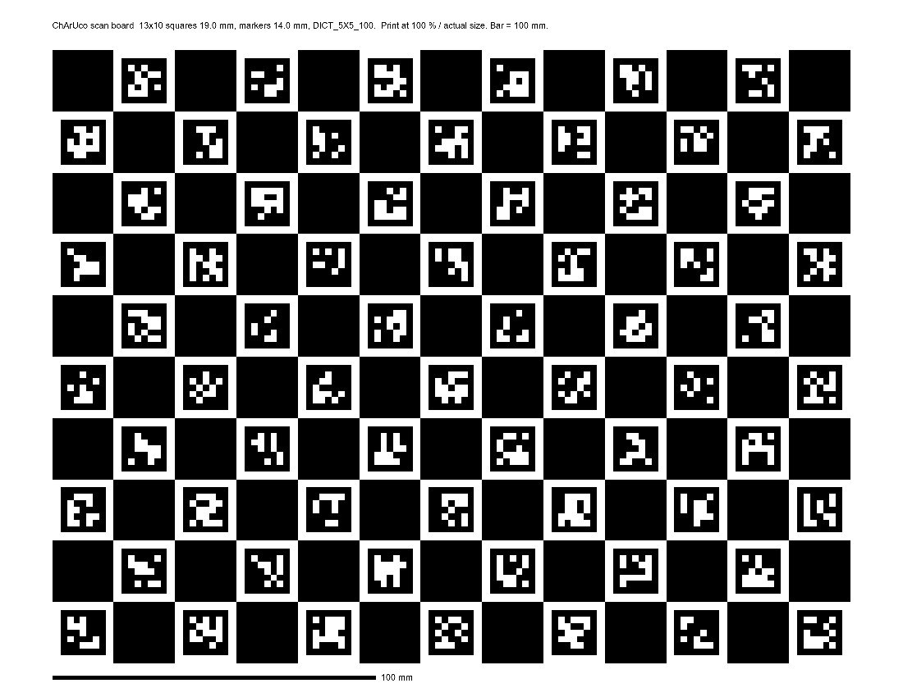
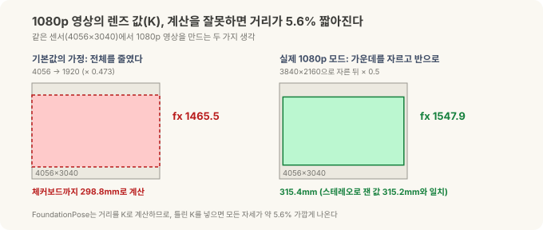
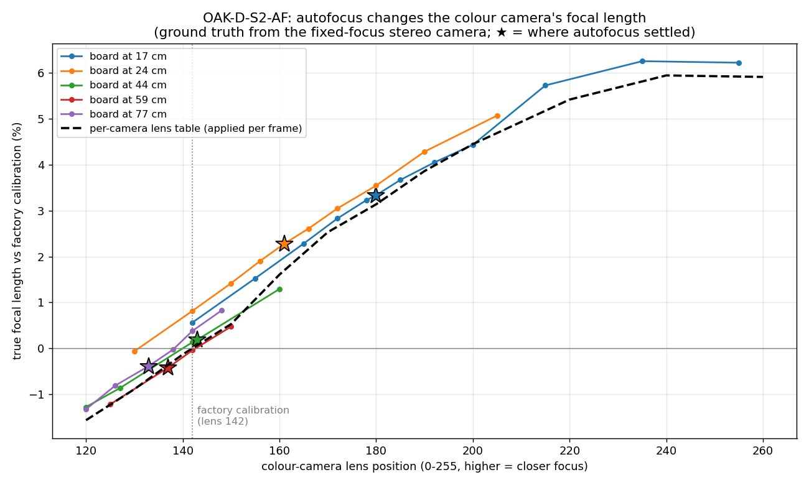
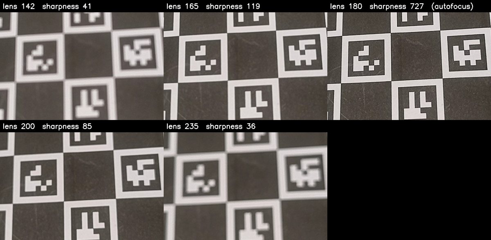
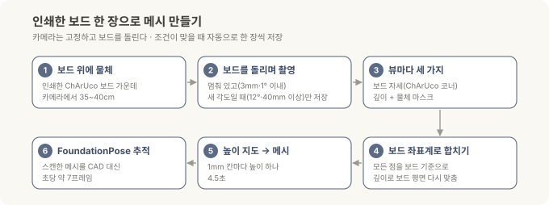
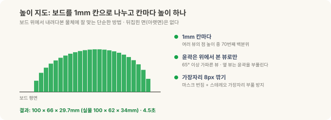
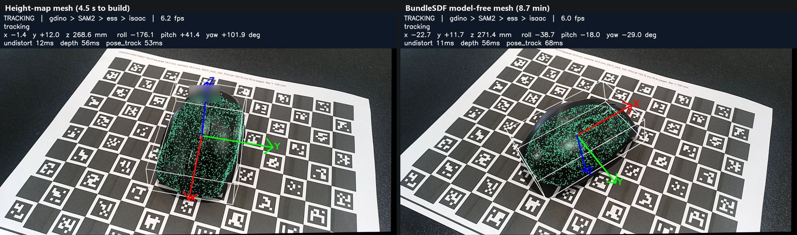
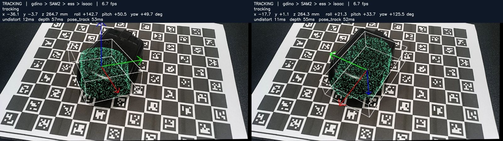

# 로봇의 뇌를 엣지에 올리기 — 스캔편: CAD가 없는 물체, 인쇄한 보드 한 장과 사진 스무 장으로

> **현장 노트 · 스캔편.** [정정편](jetson-foundationpose-16gb.md)과 [튜닝편](jetson-tuning-licensing.md)에서 FoundationPose는 제조사가 공개한 CAD 파일로 미니 PC의 6-DoF 자세를 잡았습니다. 그런데 책상 위 마우스는 CAD가 없어서 3D 위치까지만 구하고 멈췄죠. 이번 글은 그 빈칸을 채웁니다. **CAD가 없으면, 찍어서 만든다.**

FoundationPose 같은 모델 기반 자세 추정은 "이 물체가 이렇게 생겼다"는 3D 모델을 입력으로 받습니다. 모델이 있으면 처음 보는 물체도 학습 없이 잡지만, 모델이 없으면 시작을 못 해요. 공장 부품은 대개 CAD가 있지만, 협력사 부품이나 오래된 지그처럼 CAD를 구할 수 없는 물체도 흔합니다.

해법은 두 가지를 시험했습니다. 하나는 **인쇄한 보드 위에서 사진을 찍어 직접 메시를 만드는** 단순한 방법이고, 다른 하나는 NVIDIA 연구진이 FoundationPose와 함께 내놓은 **모델 프리(BundleSDF) 방식**입니다.

*(앞 글들과 같은 Jetson Orin NX 16GB와 OAK-D 스테레오 카메라, 사무실 책상 위 무선 마우스로 한 일반적인 R&D 기록입니다.)*

---

## 30초 요약

- **인쇄한 ChArUco 보드 한 장이면 된다.** 물체를 보드 가운데 올리고, 고정된 카메라 앞에서 보드를 돌리면 조건이 맞을 때 자동으로 한 장씩 찍힌다. 사진 스무 장 남짓이면 충분하다.
- **메시는 4.5초 만에 나온다.** 보드를 1mm 칸으로 나눠 칸마다 높이 하나를 정하는 "높이 지도" 방식으로, 결과는 100×66×29.7mm(실물 100×62×34mm).
- **그 메시로 바로 추적한다.** 검출 → 마스크 → 깊이 → FoundationPose 체인이 CAD 대신 스캔한 메시로 마우스를 초당 약 7프레임으로 따라간다. 전부 상업용으로 쓸 수 있는 부품으로.
- **BundleSDF(모델 프리)도 같은 사진으로 돌려 봤다.** 폭은 더 정확했지만(61.7mm) 만드는 데 8.7분, 라이브에서 맞는 정도는 높이 지도가 더 좋았고, 라이선스가 연구용이다.
- **스캔 전에 카메라부터 확인한다.** 1080p 모드의 렌즈 값(K)을 그대로 쓰면 모든 거리가 5.6% 짧게 나왔고, 자동 초점은 가까운 거리(17cm)에서 초점 거리를 3.3% 바꿨다.

---

## 왜 인쇄한 보드인가

사진 여러 장으로 3D 모양을 만들려면, 사진마다 **카메라가 물체를 어디서 봤는지**를 알아야 합니다. 그래야 각 사진의 점들을 한 좌표계에 모을 수 있어요. 전문 3D 스캐너는 턴테이블 각도나 내장 센서로 이걸 알고, 사진 측량 소프트웨어는 사진끼리 특징점을 맞춰 추정합니다.

인쇄한 보드는 이 문제를 가장 싸게 풉니다. 보드의 무늬가 어디에 있는지 우리가 정확히 알고 있으니, 사진에 보드가 보이기만 하면 카메라가 보드를 어느 위치·각도에서 봤는지 바로 계산됩니다. 물체는 보드 위에 가만히 올려 두었으니, **보드 기준 좌표가 곧 물체 기준 좌표**가 되죠.



ChArUco 보드는 체커보드(흑백 격자)와 ArUco 마커(작은 QR 비슷한 표식)를 합친 것입니다. 체커보드 모서리는 위치를 아주 정밀하게 잡아 주고, 마커는 "이 모서리가 몇 번인지" 알려 줘요. 그래서 **물체가 보드 일부를 가려도** 보이는 모서리만으로 계산이 됩니다. 스캔에서는 물체가 늘 보드 가운데를 가리고 있으니 이 성질이 꼭 필요합니다.

| 항목 | 값 |
|---|---|
| 용지 | US Letter 가로 (279.4 × 215.9mm) |
| 칸 | 13 × 10, 한 칸 19.0mm |
| 마커 | 14.0mm, OpenCV `DICT_5X5_100` |
| 모서리 | 안쪽 모서리 108개 |
| 확인 | 아래 막대를 자로 재서 정확히 100mm인지 |

**[보드 내려받기 (SVG, 실제 크기)](../assets/downloads/charuco-scan-board-letter.svg)** — 인쇄할 때는 "용지에 맞춤"을 끄고 **100% 실제 크기**로 뽑으세요. 막대가 100mm가 아니면 모든 치수가 그 비율만큼 틀어집니다. 이번에 뽑은 보드는 막대가 정확히 100mm로 나와서 칸 크기 19.0mm를 그대로 믿을 수 있었습니다.

> **인쇄는 Inkscape로.** 직접 해 보니 SVG를 정확히 100% 크기로 뽑아 준 건 무료 벡터 편집기 **Inkscape**뿐이었습니다. 다른 앱으로 열어 인쇄하면 "실제 크기"로 설정해도 크기가 조금씩 달라졌어요. Inkscape에서 파일을 열고 Letter 가로로 그대로 인쇄한 뒤, 막대가 100mm인지 자로 확인하세요.

<details>
<summary>같은 보드를 OpenCV로 직접 만들기</summary>

```python
import cv2
board = cv2.aruco.CharucoBoard(
    (13, 10),            # 가로·세로 칸 수
    0.019, 0.014,        # 칸 한 변, 마커 한 변 (m)
    cv2.aruco.getPredefinedDictionary(cv2.aruco.DICT_5X5_100))
img = board.generateImage((2600, 2000), marginSize=0)   # 미리보기용 PNG
cv2.imwrite("charuco_13x10.png", img)
```

PNG는 인쇄 배율이 프린터 설정에 따라 달라지기 쉬워서, 실제로 뽑을 때는 밀리미터 단위로 그린 SVG나 PDF가 안전합니다. 어떤 파일을 쓰든 막대나 칸을 자로 재서 확인하세요.

</details>

## 스캔 전에 확인할 카메라 보정 함정 세 가지

보드로 카메라 위치를 계산하려면 카메라의 **렌즈 값(K)**, 즉 초점 거리와 영상 중심을 알아야 합니다. 이 값이 틀리면 보드까지의 거리가 통째로 틀어지고, 그 위에서 만든 메시와 자세도 같이 틀어져요. 이번에 세 가지 함정을 찾았습니다.



**함정 1: 1080p 모드의 렌즈 값이 5.6% 틀려 있었다.** 이 카메라의 컬러 센서는 4056×3040인데, 1080p 영상은 센서 가운데 3840×2160을 잘라낸 뒤 반으로 줄여 만듭니다. 그런데 카메라 SDK가 기본으로 돌려준 1080p용 렌즈 값은 "센서 전체를 1920 폭으로 줄였다"고 가정한 값이었어요. 초점 거리가 1465.5로 나왔는데, 자르고 반으로 줄인 과정을 제대로 따라가면 1547.9가 맞습니다.

효과는 바로 거리로 나타납니다. 체커보드까지의 거리를 기본값으로 계산하면 298.8mm, 고친 값으로는 315.4mm였어요. 같은 장면을 스테레오 카메라로 따로 잰 값이 315.2mm였으니 고친 쪽이 맞습니다. FoundationPose도 이 렌즈 값으로 거리를 계산하므로, 기본값을 그대로 넣으면 **모든 자세가 약 5.6% 가깝게** 나왔을 겁니다. 오류 메시지는 하나도 없이요.

**함정 2: 스테레오 정렬이 세로로 1.9픽셀 어긋나 있었다.** 스테레오 카메라는 왼쪽·오른쪽 영상을 같은 높이로 맞춘(정렬한) 뒤 좌우 차이로 깊이를 잽니다. 정렬된 두 영상에서 같은 점을 수백 개 찾아 세로 위치를 비교해 보니, 장면과 상관없이 1.8~1.9픽셀씩 어긋나 있었어요. 잘 보정된 카메라는 0.5픽셀 이내입니다. 이 정도면 카메라 안에서 계산하는 깊이의 품질이 떨어지므로, 이 카메라는 다시 보정해야 합니다.

**함정 3: 자동 초점이 렌즈 값을 바꾼다.** 이 카메라의 컬러 렌즈는 자동 초점(AF)이라, 가까운 물체에 초점을 맞추려고 렌즈가 움직입니다. 렌즈가 움직이면 초점 거리도 조금 바뀌어요. 그런데 공장에서 잰 렌즈 값은 렌즈가 한 위치(약 44cm에 초점이 맞는 자리)에 있을 때의 값 하나뿐입니다.

얼마나 바뀌는지 쟀습니다. 스테레오 카메라는 초점이 고정이라 렌즈 값이 변하지 않으니, 그걸 기준 삼아 보드를 여러 거리에 두고 컬러 카메라의 실제 초점 거리를 비교했어요.



*가로축이 렌즈 위치(클수록 가까이 초점), 세로축이 공장 값 대비 실제 초점 거리 차이입니다. 별표가 자동 초점이 실제로 멈춘 자리이고, 검은 점선이 이 카메라용으로 만든 보정표입니다.*

| 보드까지 거리 | 자동 초점 렌즈 위치 | 공장 값 대비 오차 |
|---|---|---|
| 17cm | 180 | **+3.3%** |
| 24cm | 161 | +2.3% |
| 44cm | 143 | +0.2% |
| 59~77cm | 133~137 | −0.4% |

가까울수록 크게 틀립니다. 17cm에서 3.3%면, 20cm 떨어진 물체의 위치가 6~7mm 어긋나는 셈이에요. 깊이는 고정 초점 스테레오 카메라가 재므로 영향이 없고, 컬러 영상으로 계산하는 위치(보드 자세, FoundationPose 입력)만 틀어집니다. 이번 스캔은 약 40cm, 공장 값이 맞는 거리에서 해서 문제가 드러나지 않았던 거죠.

그럼 초점을 수동으로 고정하면 될까요? 가까운 거리에서는 그것도 답이 아닙니다.



17cm에서는 자동 초점 위치에서 ±15단계만 벗어나도 영상이 흐려집니다. 초점을 한 곳에 고정하면 다른 거리에서 흐려지고, 흐린 영상에서는 보드 모서리도 정확히 못 찾아요.

해결책은 두 가지입니다.

- **카메라별 보정표:** 렌즈 위치별 초점 거리를 표로 만들어 두고, 매 프레임 카메라가 알려 주는 렌즈 위치로 값을 찾아 씁니다. 표를 만들 때 쓰지 않은 세션으로 확인해 보니 오차가 중앙값 1.4%(최대 5.9%)에서 **0.24%(최대 1.1%)**로 줄었어요. 단, 카메라마다 따로 만들어야 합니다.
- **고정 초점 카메라:** 측정이 목적이라면 애초에 고정 초점 모델을 쓰는 게 가장 깔끔합니다. 대신 그 카메라가 선명하게 찍히는 가장 가까운 거리가 작업 거리보다 가까운지 확인하세요.

세 함정 모두 **숫자가 그럴듯하게 나와서** 결과만 봐서는 모릅니다. 새 카메라나 새 해상도 모드를 쓸 때는 세 가지를 먼저 확인하세요.

- 거리를 아는 평면(체커보드)을 두고, 렌즈 값으로 계산한 거리와 스테레오로 잰 거리가 맞는지
- 정렬된 좌우 영상에서 같은 점의 세로 위치 차이가 0.5픽셀 이내인지
- 자동 초점 카메라라면, 실제 작업 거리에서도 위 첫 번째 확인이 맞는지(공장 값은 한 거리에서만 맞다)

## 스캔하는 법



카메라는 고정하고, 물체를 올린 보드를 카메라 앞 35~40cm에서 천천히 돌립니다. 프로그램이 매 프레임 보드를 찾다가 두 조건이 맞을 때만 한 장을 저장해요.

- **멈춰 있을 때:** 연속 세 프레임 동안 보드가 3mm, 1° 이상 움직이지 않을 때. 흔들린 사진을 거릅니다.
- **새 각도일 때:** 이미 저장한 모든 사진과 12° 이상, 또는 40mm 이상 다를 때. 같은 각도를 여러 장 모으지 않습니다.

여기에 보드 모서리가 15개 이상 보이고, 계산된 보드 자세의 오차(재투영 오차)가 2픽셀 미만일 것도 조건으로 걸었습니다. 실제로는 마우스가 보드를 가려도 108개 중 45~71개가 보였고, 오차는 0.6~0.7픽셀이었어요.

사진 한 장마다 세 가지를 얻습니다.

1. **보드 자세:** 보이는 ChArUco 모서리로 계산한, 카메라에서 본 보드의 위치와 각도
2. **깊이:** FoundationStereo로 잰 픽셀마다의 거리
3. **물체 마스크:** "a computer mouse"라는 글자로 Grounding DINO가 상자를 찾고 SAM2가 오려낸 영역. 여기에 "보드 면보다 1~150mm 위에 있는 점"이라는 조건을 겹칩니다.

그다음 마스크 안의 점들을 전부 보드 좌표계로 옮겨 한데 모읍니다.

### 하다가 만난 함정들

처음부터 깔끔하게 나오지는 않았습니다. 하나씩 고친 것들이에요.

- **깊이와 보드 자세가 뷰마다 0.3~8mm씩 어긋났다.** 보드 자세(모서리로 계산)와 스테레오 깊이는 서로 다른 방법으로 잰 값이라 조금씩 다릅니다. 그대로 합치면 "보드 위 1mm 이상"이라는 조건이 마우스 윗부분만 남겨 버렸어요. 그래서 물체 주변에 보이는 보드를 **깊이 데이터 안에서** 평면으로 다시 맞추고, 모든 점을 그 평면 기준으로 고쳤습니다.
- **너무 멀면 안 된다.** 약 90cm에서는 마스크가 군데군데 비었습니다. 40cm로 당기자 마우스가 화면의 4분의 1쯤을 차지하면서 깊이도 마스크도 깨끗해졌어요.
- **반짝이는 부분이 마스크에서 빠졌다.** SAM2가 마우스 윗면의 반사광을 물체가 아니라고 보고 구멍을 냈습니다. 그 자리의 깊이는 멀쩡했으니, 마스크의 바깥 윤곽을 기준으로 속을 채웠어요. 40cm에서 찍은 뷰의 윤곽이 55%까지 떨어지던 것이 91~96%로 유지됐습니다.
- **가장자리가 부풀었다.** 마스크를 약간 넓게 잡은 데다 스테레오 깊이도 물체 가장자리에서 번지는 경향이 있어서, 첫 메시가 112×79mm로 실물보다 훨씬 컸어요. 가장자리를 8픽셀 깎아 해결했습니다.

## 메시 만들기: 높이 지도

점을 모았으면 이제 표면을 만들어야 합니다. 원래는 여러 뷰의 깊이를 부피 격자에 쌓는 표준 방법(TSDF 융합)이나 푸아송 표면 재구성을 쓰려고 했는데, 젯슨(ARM)용 Open3D 0.20에서는 두 기능 모두 제대로 동작하지 않았어요. 그래서 이 상황에 맞는 더 단순한 방법을 택했습니다.



보드 위에서 내려다보면 물체는 "칸마다 높이가 얼마인 지형"으로 볼 수 있습니다. 보드를 1mm 칸으로 나누고, 칸마다 여러 뷰에서 모인 점들의 높이 가운데 **70번째 백분위 값**을 그 칸의 높이로 씁니다. 가장 높은 값 대신 70번째 백분위를 쓰는 건 튀는 점 몇 개에 휘둘리지 않기 위해서예요. 색도 칸마다 중앙값을 쓰고, 빈 칸은 주변 값으로 메운 뒤 윗면·옆면·바닥면을 이어 닫힌 메시로 만듭니다.

여기서 하나 더 배운 게 있습니다. 위에서 찍은 11장에 낮은 각도에서 찍은 12장을 더했더니 오히려 윤곽이 104×74mm로 부풀었어요. 옆에서 본 뷰는 물체 옆면과 그림자 경계가 흐려서 윤곽을 넓게 잡거든요. 그래서 **윤곽은 65° 이상 위에서 본 뷰로만 정하고, 높이는 모든 뷰에서** 가져오도록 나눴습니다.

| 메시 | 가로 × 세로 × 높이 |
|---|---|
| 위에서 본 11장 | 99 × 64 × 28.9mm |
| 23장, 윤곽도 전부 사용 | 104 × 74 × 29.7mm (옆 뷰가 윤곽을 부풀림) |
| **23장, 윤곽은 위 뷰로만** | **100 × 66 × 29.7mm** |
| 반사광 마스크 고친 뒤 다시 스캔 | 102 × 63 × 29.5mm |
| 실물 | 100 × 62 × 34mm |

가로·세로는 몇 mm 안으로 맞는데, 높이는 4mm쯤 낮게 나옵니다. 마우스 꼭대기가 반짝여서 스테레오가 깊이를 못 잡은 자리를 주변 낮은 칸 값으로 메웠기 때문이에요. 뷰를 더 찍어서는 안 풀리고, 무광 스프레이나 파우더로 반사를 죽이는 게 해법입니다. [튜닝편](jetson-tuning-licensing.md)에서 본 반짝이는 부품의 깊이 문제가 여기서도 나온 셈이죠.

메시는 **4.5초** 만에 만들어집니다.

## 스캔한 메시로 추적하기

만든 메시를 CAD 대신 넣고, 튜닝편의 상업용 체인(Grounding DINO → SAM2 → ESS → Isaac ROS FoundationPose)을 그대로 돌렸습니다. 약 35cm 거리에서 초당 6.9프레임, 낮은 각도(약 26cm)에서도 초당 6.7프레임으로 올바른 자세를 따라갔어요. **CAD 없이 스캔에서 라이브 6-DoF 추적까지, 전부 상업용으로 쓸 수 있는 부품으로** 이어진 겁니다.

## BundleSDF(모델 프리)와 비교

FoundationPose에는 CAD 없이 쓰는 **모델 프리 모드**가 따로 있습니다. 물체를 여러 방향에서 찍은 기준 사진 몇 장을 주면, BundleSDF라는 방법으로 물체의 모양을 신경망으로 학습해 메시를 만들어요. 신경망이 공간의 각 점이 표면에서 얼마나 떨어져 있는지를 배우는 방식이라, 높이 지도로는 표현할 수 없는 모양(손잡이 구멍, 아래로 파인 부분)도 이론상 담을 수 있습니다.

같은 23장의 스캔 사진을 이 방식에 그대로 넣었습니다. 사진을 새로 찍을 필요는 없었어요. 젯슨에서 돌리려면 몇 가지 손을 봐야 했습니다(ARM용 빌드가 없는 라이브러리 하나를 빼고, 그 때문에 막히는 렌더링 경로 하나를 고치는 등). 그리고 학습된 모양이 보드 아래로 12mm쯤 가상의 형체를 지어내서, 보드 면에서 잘라 내야 했습니다.



마우스를 가만히 두고 30초씩 추적해 비교했습니다.

| | 높이 지도 | BundleSDF (모델 프리) |
|---|---|---|
| 크기 (실물 100 × 62 × 34mm) | 100 × 66 × 29.7mm | 96.2 × **61.7** × 27.7mm |
| 만드는 시간 | **4.5초** | 8.7분 (학습 1000단계) |
| 추적 유지 / 놓침 | 100% / 0회 | 100% / 0회 |
| 메시와 실측 깊이 차이 (중앙값) | **2.8mm** | 4.2mm |
| 윤곽이 마스크와 겹치는 정도 (IoU) | **0.85~0.91** | 0.79~0.83 |
| 자세 떨림 (x/y/z 표준편차) | 0.5 / 0.5 / 1.5mm | 0.5 / 0.9 / 1.7mm |
| 라이선스 | 상업 사용 가능 (직접 만든 방법) | NVLabs 연구용 |

손으로 들고 움직이는 30초 시험에서는 둘 다 99% 추적했습니다. BundleSDF는 한 번, 높이 지도는 두 번 놓쳤지만 모두 3.4초 만에 다시 찾았고, 180° 뒤집힘은 없었습니다. 움직일 때는 차이가 거의 없었어요.

정리하면 BundleSDF는 **폭을 가장 정확히** 잡았지만, 라이브에서 실제 깊이와 맞는 정도는 높이 지도가 더 좋았고, 만드는 속도는 약 100배 빨랐고, 상업용으로 쓸 수 있습니다. BundleSDF가 제값을 하는 건 높이 지도로 표현할 수 없는 모양이거나, 물체를 손에 들고 360° 돌려 찍은 영상이 있을 때입니다.

## 아직 안 되는 것: 뒤집힌 자세



보드 위에서 찍은 스캔에는 **바닥면이 없습니다.** 메시의 아랫면은 평평한 판에 색을 지어낸 것이에요. 그래서 마우스를 뒤집으면 맞출 실제 정보가 없어 자세가 틀립니다.

그래도 틀린 걸 알아채는 장치는 넣었습니다. 추정한 자세대로 메시를 그려서 나오는 깊이와 실제로 잰 깊이를 비교해, 똑바로 놓였을 때 2.9~4.1mm이던 차이가 뒤집히면 14~19mm로 커지는 걸 이용해요. 6mm를 두 번 연속 넘으면 다시 찾기를 시작합니다. 앞뒤가 비슷한 마우스가 앞뒤로 뒤집히는 경우도 있어서, 자세를 잡을 때마다 180° 돌린 자세도 같이 점수를 매겨 더 잘 맞는 쪽을 고르게 했습니다(이때 손이 가린 부분은 빼고 물체 마스크 안에서만 비교).

바닥면까지 스캔해 합치는 기능도 만들다가 멈췄습니다. 마우스는 윤곽과 돔 모양이 대칭에 가까워서, 두 스캔의 앞뒤를 데이터만으로 맞추기가 어려웠거든요. 촬영 규칙(앞쪽 방향을 표시하고, 긴 축을 기준으로 굴려 뒤집기)을 정해야 풀립니다.

## 정리

| | 방법 | 메시 | 시간 | 라이선스 |
|---|---|---|---|---|
| **CAD가 있을 때** | CAD를 그대로, 부품별로 색을 입혀서 | 가장 정확, 바닥면 포함 | 0초 | — |
| **CAD가 없을 때 (기본)** | 인쇄한 ChArUco 보드 + 사진 20여 장 + 높이 지도 | 100 × 66mm (실물 100 × 62) | 4.5초 | 상업 가능 |
| **모양이 복잡할 때** | BundleSDF 모델 프리 | 폭이 가장 정확 | 8.7분 | 연구용 |

- **CAD가 있으면 CAD가 최선입니다.** 바닥면까지 있고, [정정편](jetson-foundationpose-16gb.md)에서 본 것처럼 부품별로 색을 입히면 앞뒤 뒤집힘도 막을 수 있어요. 스캐너는 CAD가 없을 때의 대안입니다.
- **보드 한 장이 카메라 위치 문제를 풉니다.** 모서리 일부가 가려져도 되는 ChArUco라서 물체를 올린 채로 쓸 수 있고, 100% 크기로 뽑았는지는 막대 하나로 확인됩니다.
- **스캔 전에 카메라부터.** 렌즈 값, 스테레오 정렬, 자동 초점 중 하나만 틀려도 메시와 자세가 조용히 틀어집니다.
- **반짝이는 물체는 반사부터 죽입니다.** 높이가 낮게 나오는 원인은 뷰 개수가 아니라 반사였어요.

---

<details>
<summary>참고 — 이 결과의 근거와 고지</summary>

수치는 Jetson Orin NX 16GB(MAXN)와 OAK-D 스테레오 카메라로 **직접 측정한 값**입니다. 물체 하나(무선 마우스, 제조사 사양 100×62×34mm)와 세션 하나에서 잰 결과라 통계라기보다 경향으로 봐 주세요. 높이 지도와 BundleSDF 비교는 각 30초 추적 기준이고, 자세 정확도는 실측 깊이와의 차이와 윤곽 겹침으로 본 일관성 검사이지 별도 장비로 잰 절대 정확도가 아닙니다. 렌즈 값 함정은 이 카메라의 컬러 센서(4056×3040)와 1080p 모드에 해당하는 내용이고, 자동 초점 측정은 카메라 한 대로 한 결과입니다(영상 중심·왜곡 변화는 이 시험의 해상도로는 보이지 않았습니다). 다른 카메라·모드에서는 해당 SDK의 자르기·축소 방식을 직접 확인해야 합니다.

BundleSDF와 FoundationPose 모델 프리 코드는 NVLabs 저장소의 연구·평가용 라이선스를 따릅니다. 높이 지도 방식은 OpenCV·NumPy로 직접 구현한 것입니다. ChArUco 보드는 OpenCV의 `CharucoBoard` 정의로 생성했습니다.

Jetson·Orin·Isaac ROS는 NVIDIA의, OAK-D는 Luxonis의, 그 외 제품명은 각 소유자의 상표로 지칭 목적으로만 사용했습니다.

</details>

**시리즈** · [← 이전 글: 튜닝편 — 11초를 4초로, 그리고 상업용으로 쓸 수 있는 조합](jetson-tuning-licensing.md)

*관련: [좌표계와 변환](frames-transforms.md) · [세 모델의 안쪽](inside-the-models.md) · [로봇의 뇌를 엣지에 올리기 (2) — Isaac ROS와 파운데이션 모델](jetson-isaac-foundation-models.md)*
