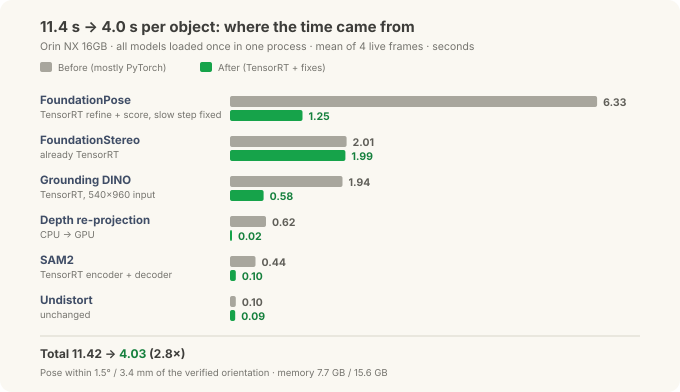
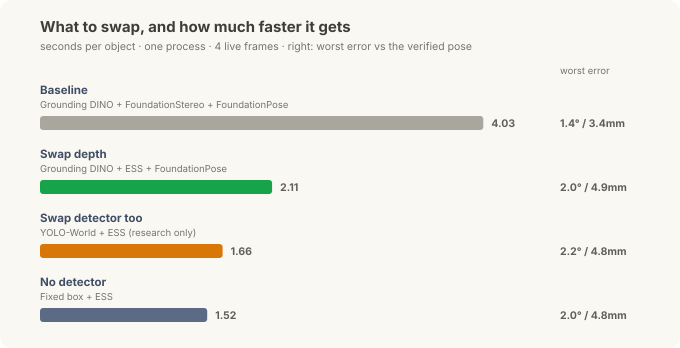
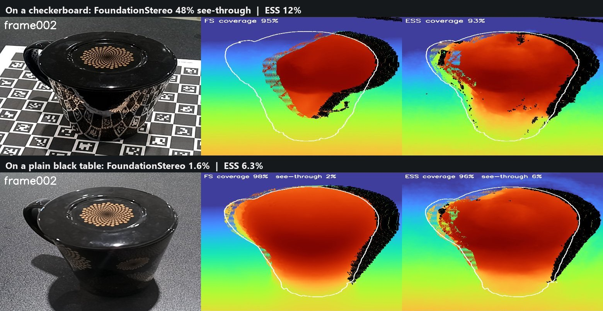
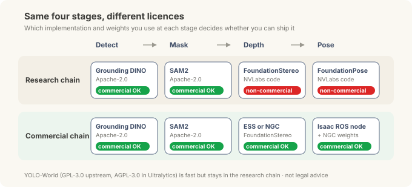
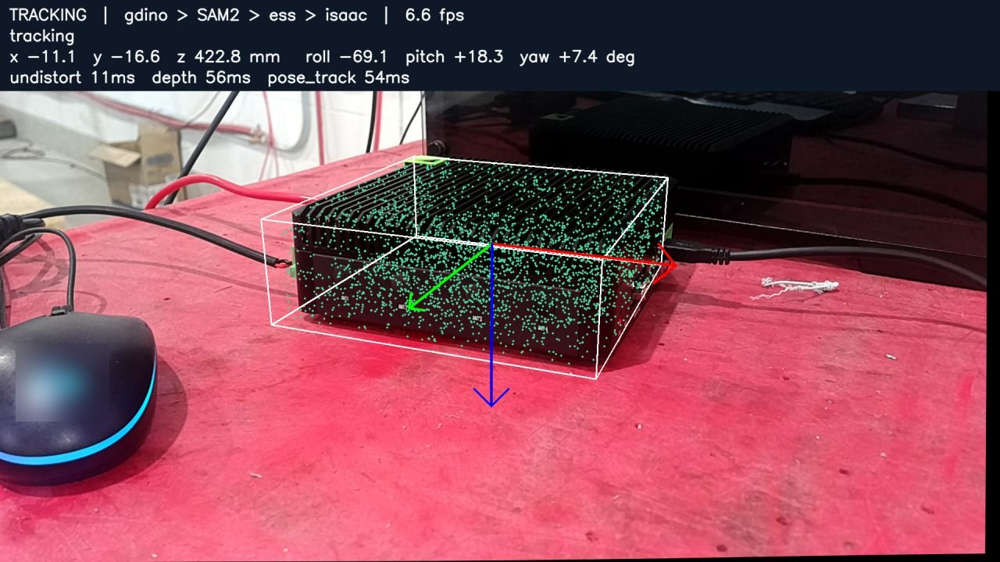
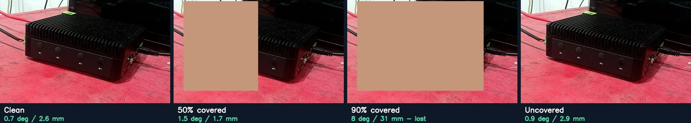
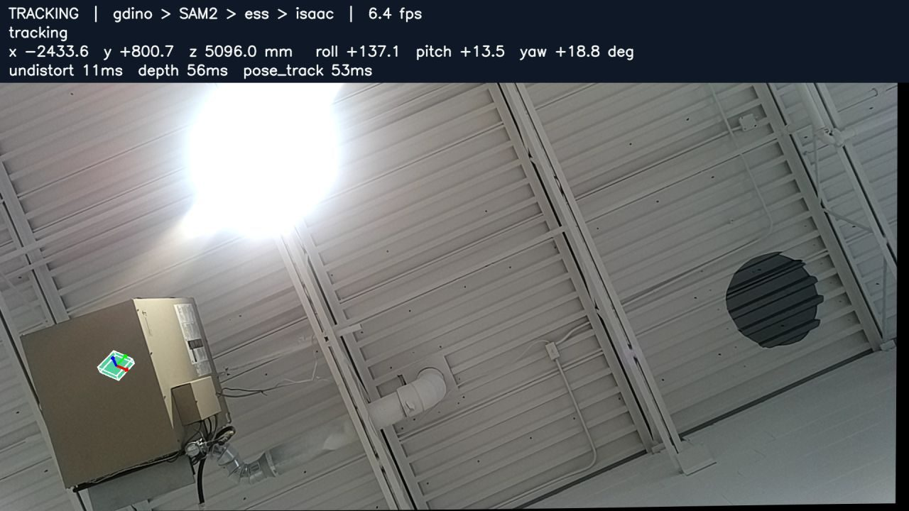

# Putting the Robot's Brain on the Edge — Tuning: From 11 Seconds to 4, and a Chain You Can Ship

> **Field Notes · Tuning.** In [the correction post](jetson-foundationpose-16gb.md), one Orin NX 16GB ran the whole chain: text prompt → detection → mask → depth → 6-DoF pose. This post takes the next two questions: **how much faster can it go**, and **can you put it in a product**.

A chain that runs and a chain you can use on a line are separated by two thresholds. The first is speed. Eleven seconds per object is fine for a demo but slow next to a production line. The second is licensing. Many of the best models in this field are released first as lab code, and several of them come with a "research and evaluation only" condition. However fast and accurate they are, that condition keeps them out of equipment you sell.

*(As with the earlier posts, this is general edge R&D with objects on an office desk, not a specific site deployment.)*

---

## 30-second summary

- **Same chain, same Orin NX 16GB: 11.4 s → 4.0 s per object (2.8×).** Every network moved to a TensorRT engine and two slow pieces of code were fixed. The pose stayed within 1.5° and 3.4 mm of the verified orientation.
- **FoundationPose shrank the most (6.3 s → 1.25 s).** The bottleneck now is the depth model, FoundationStereo (2.0 s), about half of the total.
- **After each speed-up we checked the answers stayed the same.** Masks overlap 99.95 %+, detection boxes 0.99+, pose-model outputs within 0.3 %. That check also caught a bug in the conversion tool.
- **Swap the depth model for ESS, NVIDIA's real-time stereo model, and the chain takes 2.1 s.** Depth drops from 2.0 s to 61 ms; pose error grows a little, to 2.0° and 4.9 mm. On shiny parts, though, the two models fail differently, so control the background first.
- **Licensing splits the chain in two.** The NVLabs FoundationPose and FoundationStereo code is non-commercial (research and evaluation). For commercial use you take the Isaac ROS node and the weights published on NGC. That commercial chain ran at **3.3 s per object** and tracked at **34 ms per frame**.

---

## First decision: measure in one process

The per-stage times in the correction post were measured one stage at a time. In real use, the four models are **loaded once** into one program and every frame passes through them in turn. So this time we measured under exactly that condition: all models resident in one process, four real camera frames, averaged.

Measured this way, model loading drops out and only the time to process one object remains. The baseline before tuning was **11.42 s**.

## Where the time came from

Each stage needed something different.

| Stage | Before | After | What changed |
|---|---|---|---|
| FoundationPose (pose) | 6.33 s | **1.25 s** | Refine and score networks as TensorRT engines, a slow crop step fixed, 3 → 2 iterations |
| FoundationStereo (depth) | 2.01 s | 1.99 s | Already TensorRT |
| Grounding DINO (detect) | 1.94 s | **0.58 s** | TensorRT engine, input fixed at 540×960 |
| Depth re-projection | 0.62 s | **0.02 s** | Moved from CPU to GPU |
| SAM2 (mask) | 0.44 s | **0.10 s** | Image encoder and mask decoder as TensorRT engines |
| Undistort | 0.10 s | 0.09 s | Unchanged |
| **Total** | **11.42 s** | **4.03 s** | Memory 7.7 GB / 15.6 GB |

TensorRT is NVIDIA's tool for "baking" a model ahead of time for a specific GPU. The baked engine runs the same model several times faster than the general-purpose PyTorch path, and most of the saving in the table comes from that conversion.

The row that stands out, though, is **depth re-projection**. It's a plain coordinate calculation that moves the depth map into the colour camera's viewpoint, but the CPU was handling millions of pixels one at a time and taking 0.62 s. On the GPU it takes 0.02 s. Tuning that only looks at the models misses code like this. Until each stage was timed, nobody knew it was slow.

Read the FoundationPose row with care. The drop from 6.33 s to 1.25 s includes the engines and the code fix, but also **cutting refinement from three iterations to two**. With three, the whole chain takes 4.41 s and position error drops a little, to 1.7 mm. That gives you one dial to trade speed against precision.

## Faster, but the same answer?

Converting a model to an engine changes the order and precision of the arithmetic. If results drift slightly in exchange for speed, it rarely shows on the surface. So for each stage we **fed the same input and compared the results before and after**.

| Stage | Compared | Result |
|---|---|---|
| SAM2 | PyTorch mask vs engine mask overlap (IoU) | ≥ 0.9995 (encoder), ≥ 0.9997 (encoder + decoder) |
| Grounding DINO | 540×960 engine vs full-resolution PyTorch box overlap | 0.990–0.995, scores equal or higher |
| FoundationPose refine | Output difference | 0.2–0.3 % |
| FoundationPose score | Per-candidate score difference, top candidate | ~0.2 %, same winner for 1–252 candidates, identical final pose |
| Depth re-projection (GPU) | Pixel-level match | 99.99 % |

IoU measures how much two regions overlap, from 0 to 1, where 1 means identical. An IoU of 0.9995 means about five pixels in ten thousand differ.

Without this comparison, two problems would have slipped through.

- **A bug in the conversion tool.** The SAM2 mask decoder engine produced wrong masks. The cause was a bug in this TensorRT version (10.3): an optimization that fuses the decoder's small network layers into one got the arithmetic wrong. Exposing five intermediate results as extra outputs blocks that fusion, and the masks match the original again. Looking only at speed, we would have written "faster" and moved on.
- **A fast but wrong detector.** An engine built earlier from a different Grounding DINO checkpoint that NVIDIA distributes ran at 166 ms, much faster, but drew boxes in the wrong places. TensorRT wasn't at fault; the checkpoint was. Rebuilt from the public Hugging Face weights, it detects correctly.

Every speed number should come with a note that says "same input, same answer". Only then can you rely on that speed.

## What to swap to go further

Half of the 4.0 s is FoundationStereo, so going further means changing the model itself. We swapped one stage at a time in the same chain.

- **Depth → ESS.** ESS is NVIDIA's real-time stereo depth model built for Isaac ROS. It does in **61 ms** what took FoundationStereo 2.0 s, using about 3 GB of memory instead of 7.9 GB. The whole chain halved to **2.11 s**. Pose error grew a little, from 1.4°/3.4 mm to 2.0°/4.9 mm, because FoundationStereo's depth is denser and smoother.
- **Detector → YOLO-World.** An open-vocabulary detector that also takes a text prompt, returning boxes in 15 ms (32 ms inside the chain). Its boxes overlapped Grounding DINO's by 0.86–0.96, and the chain came down to **1.66 s**. Because of its licence, covered below, we kept it for research only.
- **No detector at all.** If the object always arrives near a known spot, a fixed region of interest (a box) can replace detection. **1.52 s**, with the same error as the ESS chain. In a cell where a jig or pallet roughly fixes the position, this is the simplest answer.

Swapping the depth model made the biggest difference; the detector choices were worth about half a second. The order of tuning came down to one rule: **measure where the bottleneck is, then change that**.

### Shiny parts change the picture

ESS is faster, but the two depth models fail in different ways. So we compared them again on shiny parts: a glossy plastic mouse and a mirror-smooth black cup.

*From left: camera image, FoundationStereo depth, ESS depth. The white line is the cup's outline. In the top row, the lower left of the FoundationStereo depth is missing from the outline: the depth there came out at the height of the surface behind, not the cup.*

| Part and background | FoundationStereo | ESS |
|---|---|---|
| Glossy mouse: surface noise (RMS) | **3.3 mm** | 6.0 mm |
| Mirror-like cup on a checkerboard: "see-through" | **48 %** | 12 % |
| Same cup on a plain **black** table | **1.6 %** | 6.3 % |
| Cup with the lid off, on plain **white** paper | ~11 % | ~11 % |

"See-through" is the share of the part whose depth came out at the height of the surface below instead of the part. When stereo matches a pattern reflected in a shiny surface, it places the depth where that pattern really is, behind the surface.

- **Normally FoundationStereo is cleaner.** Its surface noise on the mouse is about half of ESS's.
- **But it follows reflections more confidently.** On the cup reflecting the checkerboard, it read half the cup as "not there". Both models fill depth for 94 % of the cup, so coverage alone hides the problem completely.
- **The background decides.** The problem grew from a plain black surface to plain white to a patterned one. With shiny parts, controlling **what the part reflects** works better than changing models.

So "swap to ESS and halve the time" holds for matte parts. In a cell with many glossy parts, clean up the background first, then compare both models on those parts before choosing. (One cup and one mouse show a tendency, not a statistic.)

## Licensing: same four stages, different terms

Here a problem appears that has nothing to do with speed. The FoundationPose and FoundationStereo code used so far is what NVIDIA's research lab (NVLabs) published on GitHub, and the licence says:

> The Work and any derivative works thereof only may be used or intended for use non-commercially … "non-commercially" means for research or evaluation purposes only.

So using this code to check performance is fine, but selling equipment that contains it is outside the terms. Fortunately NVIDIA also ships the same technology through a commercial path. Depending on which implementation and weights you pick at each stage, the chain splits in two.

| Stage | Research chain | Commercial chain |
|---|---|---|
| Detect | Grounding DINO (Apache-2.0) | Same |
| Mask | SAM2 (Apache-2.0) | Same |
| Depth | FoundationStereo, NVLabs code (non-commercial) | **ESS** or **NGC FoundationStereo** (NVIDIA marks them ready for commercial use) |
| Pose | FoundationPose, NVLabs code (non-commercial) | **Isaac ROS FoundationPose node + NGC weights** (ready for commercial use) |
| Fast detector | YOLO-World (GPL-3.0 upstream, AGPL-3.0 in Ultralytics) | Not used |

NGC is NVIDIA's catalogue for models and containers. The ESS and FoundationPose model cards there say "ready for commercial use", and each model follows its own terms (a model EULA or the NVIDIA Open Model License). Apache-2.0 is an open-source licence that broadly allows commercial use.

YOLO-World sits under different terms again. Copyleft licences like GPL and AGPL don't forbid commercial use, but they require you to publish the source of any program you distribute combined with the code, under the same terms (for AGPL, even serving it over a network counts). Unless you plan to open the whole equipment software, it's safer to leave it out. That's why the good 1.66 s number carries a "research only" label.

## How fast is the commercial chain?

So we rebuilt the chain from commercial parts and measured it: Grounding DINO → SAM2 → ESS → Isaac ROS FoundationPose node (NGC weights).

| Item | Result |
|---|---|
| First pose (2 refinement iterations) | 2.4 s |
| First pose (3 iterations) | 3.4 s, 0.67° |
| **Whole chain (per object)** | **3.26 s** |
| **Tracking afterwards (per frame)** | **34 ms** (about 2× the NVLabs research tracker) |

It's actually faster than the tuned research chain (4.0 s). Swapping in ESS does most of that, and the Isaac ROS node was tuned for Jetson from the start, so tracking is especially quick. At least for this combination, the worry that going commercial means going slower didn't hold.

To go further, we also cut the number of pose candidates the node checks at the start. The first pose got faster, 1.0–1.8 s instead of 2.5 s, but flipped poses rose from 2 to 4–6 out of 23. With a near-symmetric object, fewer candidates make it likelier to pick the opposite orientation. Saving a second isn't worth two to three times as many wrong answers, so we left it as it was.

*The top line shows the chain (gdino > SAM2 > ess > isaac) and per-stage times. The green dots are CAD model points drawn at the estimated pose; the red, green and blue arrows are the object's X, Y and Z axes. It sits about 42 cm from the camera.*

## Covered and moving

On a real line, objects don't sit still, and hands or grippers get in the way. We checked how well tracking holds up.

First, a flat, hand-coloured rectangle was pasted over the image to hide part of the object (a synthetic cover, not a real hand).

*The numbers under the photos are from the same test with the NVLabs research tracker. The table below is the commercial Isaac ROS tracker. Both hold up to half covered and drift badly from 90 %.*

| Covered | Pose error (commercial Isaac ROS tracker) |
|---|---|
| 0–50 % | within 1.4° / 4.4 mm, about the same as uncovered |
| 75 % | 3.3–4.0° / 8.5–14.6 mm |
| 90 % | 3.2–4.6° / 25–31 mm, position well off |
| 100 % | 8.6–10.2° / 30–36 mm, effectively lost |
| Uncovered again | back to 0.9° / 2.7 mm within a frame or two |

Up to half covered, it barely moves; once most of the object is hidden, the position drifts by a few centimetres. When the cover comes off, it snaps back.

We also tried a real hand: a 98-second test of picking up the mini PC, moving it, half covering it with a hand, and shaking it fast.

- Tracked **86 %** of the time; the longest unbroken track was **58.6 s**
- **100 %** tracked while a hand covered half of it
- Followed motion up to about 300 mm/s and 130°/s
- When lost, found again in **3.4 s**

## The safety check we kept while speeding up

When you're tuning, it's tempting to drop checks because they're slow. This test made clear that one check has to stay.

When the camera tipped towards the ceiling, the detector picked a wall-mounted heater as "a black mini computer with cooling fins". The later stages trusted that box and dutifully computed a pose, 5 m from the camera. The object we wanted was on the desk, 40 cm away.

This kind of failure is silent. Every stage returns normal values, so there's no error message. That's why the chain ends with a **size and distance check**: if the measured size doesn't match the CAD dimensions, or the distance is outside the work area, the result is thrown away. It takes a few milliseconds, so it costs almost nothing in speed.

## Summary

| | Before tuning | After tuning (research) | Commercial chain |
|---|---|---|---|
| Parts | GDINO + SAM2 + FoundationStereo + FoundationPose (mostly PyTorch) | Same parts, all TensorRT | GDINO + SAM2 + **ESS** + **Isaac ROS FoundationPose** |
| Per object | 11.42 s | 4.03 s | **3.26 s** |
| Tracking | ~70 ms | ~70 ms | **34 ms** |
| Can ship in a product | ✗ (non-commercial code) | ✗ (non-commercial code) | ✓ (subject to each model's terms) |

- **Time each stage in one process first.** Bottlenecks hide outside the models too (depth re-projection).
- **When something gets faster, check the answer right away.** That's how a conversion-tool bug and a bad checkpoint surfaced here.
- **Change the bottleneck.** Here it was the depth model; with ESS the chain halved.
- **Check licences at the start.** Prove performance with research code, then look for the commercial path to the same technology and measure again with it.

What about objects with no CAD file? We also tried putting the object on a printed board and taking about twenty photos to build a mesh. That gets its own post next.

---

Notes — sources and disclaimers

The times, errors and memory figures were **measured directly** on a Jetson Orin NX 16GB (MAXN power mode) with an OAK-D stereo camera. They come from one scene and one object (Seeed reComputer Industrial, using the maker's public CAD), so other objects or lighting may differ. Pose error is the difference from a reference pose checked by orientation features and repeatability, not absolute accuracy against separate measuring equipment. The detector engines are fixed to one input size (540×960) and were checked only on large, near objects. The occlusion photos use a synthetic flat cover; the real-hand test is one session (98 s).

Licence details were checked on 2026-09-29 against the LICENSE files of the NVLabs FoundationPose and FoundationStereo repositories, the NGC model cards for ESS, FoundationPose and FoundationStereo, the Grounding DINO and SAM2 repositories (Apache-2.0), and the YOLO-World repository (GPL-3.0). **This is not legal advice**; check each model's current terms before putting it in a product.

Jetson, Orin, Isaac ROS, TensorRT and NGC are trademarks of NVIDIA; other product names belong to their owners and are used for identification only.

**Series** · [← Previous: A Correction — reversing the "16 GB can't do it" verdict](jetson-foundationpose-16gb.md)

*Related: [Putting the Robot's Brain on the Edge (2) — Isaac ROS, Foundation Models](jetson-isaac-foundation-models.md) · [Inside the Three Models](inside-the-models.md) · [From Teach Pendant to ROS 2 (4) — Isaac ROS and cuMotion](isaac-ros-gpu.md)*
