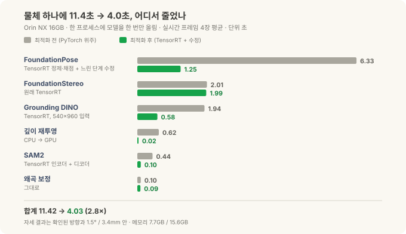
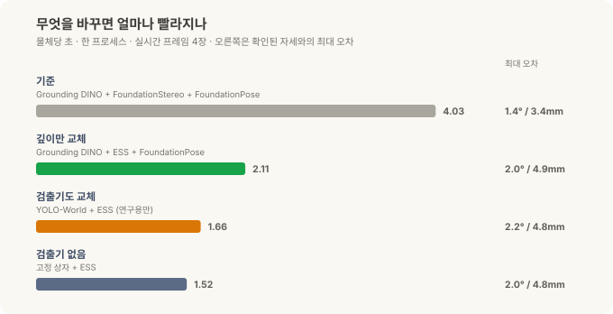
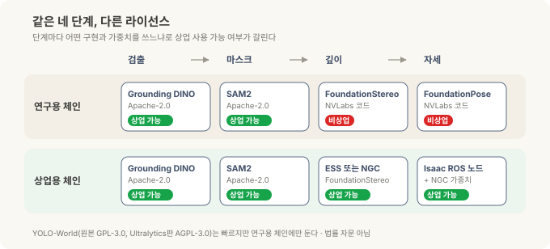

# 로봇의 뇌를 엣지에 올리기 — 튜닝편: 11초를 4초로, 그리고 상업용으로 쓸 수 있는 조합

> **현장 노트 · 튜닝편.** [정정편](jetson-foundationpose-16gb.md)에서 Orin NX 16GB 한 대로 글자 지시 → 검출 → 마스크 → 깊이 → 6-DoF 자세까지 이어지는 체인이 동작하는 걸 확인했습니다. 이번 글은 그다음 두 질문을 다룹니다. **얼마나 더 빠르게 만들 수 있나**, 그리고 **그걸 제품에 넣어도 되나**.

체인이 동작한다는 것과 현장에서 쓸 수 있다는 것 사이에는 두 개의 문턱이 있습니다. 하나는 속도예요. 물체 하나에 11초가 걸리면 데모로는 괜찮아도 라인 옆에 두기엔 답답하죠. 다른 하나는 라이선스입니다. 이 분야의 좋은 모델 상당수가 연구소 코드로 먼저 공개되는데, 그중 여럿은 "연구·평가용으로만 쓰라"는 조건이 붙어 있어요. 빠르고 정확해도 이 조건에 걸리면 판매하는 장비에는 넣을 수 없습니다.

*(앞 글들과 마찬가지로 특정 현장 배치가 아니라 사무실 책상 위 물체로 한 일반적인 엣지 R&D 기록입니다.)*

---

## 30초 요약

- **같은 체인, 같은 Orin NX 16GB에서 물체당 11.4초 → 4.0초(2.8배).** 네트워크를 전부 TensorRT 엔진으로 바꾸고, 느리던 코드 두 곳을 고친 결과입니다. 자세는 확인된 방향과 1.5°, 3.4mm 안에서 그대로였어요.
- **가장 많이 줄어든 곳은 FoundationPose(6.3초 → 1.25초).** 남은 병목은 깊이 모델 FoundationStereo(2.0초)로, 이제 전체의 절반을 차지합니다.
- **빨라진 뒤에는 답이 같은지부터 확인했습니다.** 마스크 겹침 99.95% 이상, 검출 상자 겹침 0.99 이상, 자세 모델 출력 차이 0.3% 이내. 변환 도구의 버그 하나도 이 과정에서 드러났어요.
- **깊이 모델을 NVIDIA의 실시간 스테레오 모델 ESS로 바꾸면 2.1초.** 깊이 계산이 2.0초에서 61ms로 줄고, 자세 오차는 2.0°, 4.9mm로 약간 늘어납니다. 단, 반짝이는 부품에서는 두 모델의 약점이 달라서 배경부터 통제해야 합니다.
- **라이선스가 체인을 둘로 나눕니다.** NVLabs의 FoundationPose·FoundationStereo 코드는 비상업(연구·평가용)입니다. 상업용으로 쓰려면 Isaac ROS 노드와 NGC에 올라온 가중치를 씁니다. 그렇게 짠 상업용 체인이 물체당 **3.3초**, 이후 추적은 **프레임당 34ms**였어요.

---

## 튜닝 전에 기준부터 정했습니다

정정편에 실었던 단계별 시간은 단계마다 따로 잰 값이었습니다. 실제로 쓸 때는 모델 네 개를 한 프로그램 안에 **한 번만 올려 두고** 프레임이 들어올 때마다 차례로 통과시켜요. 그래서 이번에는 그 조건 그대로, 모델을 한 프로세스에 전부 올려 둔 상태에서 실제 카메라 프레임 네 장을 흘려 평균을 냈습니다.

기준을 이렇게 잡으면 "모델을 불러오는 시간"이 빠지고, 물체 하나를 처리하는 데 드는 순수한 시간만 남습니다. 튜닝 전 기준값이 **11.42초**였어요.

## 어디서 시간이 줄었나

단계별로 보면 한 일이 저마다 다릅니다.

| 단계 | 전 | 후 | 한 일 |
|---|---|---|---|
| FoundationPose (자세) | 6.33초 | **1.25초** | 정제·채점 네트워크를 TensorRT 엔진으로, 느리던 잘라내기 단계 수정, 반복 3회 → 2회 |
| FoundationStereo (깊이) | 2.01초 | 1.99초 | 이미 TensorRT라 그대로 |
| Grounding DINO (검출) | 1.94초 | **0.58초** | TensorRT 엔진, 입력 크기 540×960으로 고정 |
| 깊이 재투영 | 0.62초 | **0.02초** | CPU에서 하던 계산을 GPU로 |
| SAM2 (마스크) | 0.44초 | **0.10초** | 이미지 인코더와 마스크 디코더를 TensorRT 엔진으로 |
| 왜곡 보정 | 0.10초 | 0.09초 | 그대로 |
| **합계** | **11.42초** | **4.03초** | 메모리 7.7GB / 15.6GB |

TensorRT는 NVIDIA GPU에 맞춰 모델을 미리 최적화해 "굽는" 도구입니다. 같은 모델이라도 이렇게 구운 엔진은 범용 경로(PyTorch)보다 몇 배 빨리 실행돼요. 표에서 줄어든 시간의 대부분이 이 변환에서 나왔습니다.

그런데 가장 인상적인 줄은 오히려 **깊이 재투영**입니다. 깊이 지도를 컬러 카메라 시점으로 옮기는 단순한 좌표 계산인데, 픽셀 수백만 개를 CPU가 하나씩 처리하느라 0.62초가 걸리고 있었어요. GPU로 옮기자 0.02초가 됐습니다. 모델만 보고 튜닝하면 이런 "모델 아닌 코드"를 놓치기 쉽습니다. 단계별로 시간을 재 보기 전에는 여기가 느린 줄도 몰랐어요.

FoundationPose는 조금 조심해서 읽어야 합니다. 6.33초 → 1.25초에는 엔진 변환과 코드 수정 외에 **반복 횟수를 3회에서 2회로 줄인 효과**도 들어 있어요. 3회로 두면 체인 전체가 4.41초이고 위치 오차가 1.7mm로 조금 줄어듭니다. 속도와 정밀도를 맞바꿀 수 있는 선택지가 하나 생긴 셈이죠.

## 빨라졌는데, 답도 같은가

모델을 엔진으로 바꾸면 계산 순서와 정밀도가 달라집니다. 빨라진 대신 결과가 조금씩 틀어져도 겉으로는 잘 안 보여요. 그래서 단계마다 **같은 입력을 넣고 전후 결과를 직접 비교**했습니다.

| 단계 | 비교한 것 | 결과 |
|---|---|---|
| SAM2 | PyTorch 마스크 vs 엔진 마스크의 겹침(IoU) | 0.9995 이상 (인코더), 0.9997 이상 (인코더+디코더) |
| Grounding DINO | 540×960 엔진 vs 원본 해상도 PyTorch의 상자 겹침 | 0.990~0.995, 점수는 같거나 더 높음 |
| FoundationPose 정제 | 출력값 차이 | 0.2~0.3% |
| FoundationPose 채점 | 후보별 점수 차이, 1등 후보 | 약 0.2%, 후보 1~252개 모두 같은 1등, 최종 자세 동일 |
| 깊이 재투영 (GPU) | 픽셀 단위 일치 | 99.99% |

IoU는 두 영역이 얼마나 겹치는지를 0~1로 나타낸 값입니다. 1이면 완전히 같아요. 0.9995면 마스크 1만 픽셀 중 다섯 개 정도가 다르다는 뜻입니다.

이 비교를 하지 않았다면 놓쳤을 문제가 두 개 있었습니다.

- **변환 도구의 버그.** SAM2 마스크 디코더를 엔진으로 구웠더니 마스크가 틀어졌어요. 원인은 이 버전의 TensorRT(10.3)가 디코더 안의 작은 신경망 층들을 하나로 합치는 최적화를 하다 계산을 틀리는 버그였습니다. 중간 결과 다섯 개를 일부러 출력으로 꺼내 두면 그 합치기가 막혀서, 결과가 원본과 다시 맞아요. 속도만 봤다면 "빨라졌다"로 끝났을 겁니다.
- **빠르지만 틀린 검출기.** 예전에 NVIDIA가 배포한 다른 Grounding DINO 체크포인트로 구운 엔진은 166ms로 훨씬 빨랐지만, 상자를 엉뚱한 곳에 그렸습니다. TensorRT 탓이 아니라 체크포인트 자체의 문제였어요. 공개된 Hugging Face 가중치로 다시 구우니 제대로 잡았습니다.

속도 숫자 옆에는 항상 "같은 입력에서 같은 답이 나오는가"를 함께 적어야 합니다. 그래야 그 속도를 믿고 쓸 수 있어요.

## 더 줄이려면 무엇을 바꾸나

4.0초 중 절반이 FoundationStereo입니다. 여기서 더 줄이려면 모델 자체를 바꿔야 해요. 같은 체인에서 단계 하나씩 바꿔 가며 재 봤습니다.

- **깊이를 ESS로.** ESS는 NVIDIA가 Isaac ROS용으로 만든 실시간 스테레오 깊이 모델입니다. FoundationStereo가 2.0초 걸리던 깊이 계산을 **61ms**에 끝내고, 메모리도 7.9GB 대신 약 3GB만 씁니다. 체인 전체가 **2.11초**로 절반이 됐어요. 대신 자세 오차가 1.4°/3.4mm에서 2.0°/4.9mm로 조금 늘었습니다. FoundationStereo의 깊이가 더 촘촘하고 매끈하기 때문이에요.
- **검출기를 YOLO-World로.** 글자로 지시하는 개방어휘 검출기인데, 15ms 만에 상자를 냅니다(체인 안에서는 32ms). Grounding DINO 상자와 0.86~0.96 겹쳐서 쓸 만했고, 체인은 **1.66초**까지 내려갔어요. 다만 뒤에서 설명할 라이선스 때문에 연구용으로만 남겨 뒀습니다.
- **검출기를 아예 빼기.** 물체가 늘 정해진 자리 근처에 온다면 검출 대신 고정된 관심 영역(상자)을 쓸 수 있습니다. **1.52초**, 오차는 ESS 체인과 같은 수준이었어요. 지그나 팔레트로 위치가 대략 정해지는 셀이라면 이게 가장 단순한 답입니다.

깊이 교체가 가장 큰 효과를 냈고, 검출기 쪽은 0.5초 안팎의 차이였습니다. 튜닝 순서는 결국 하나였어요. **병목이 어디인지 먼저 재고, 그 자리를 바꾼다.**

### 반짝이는 부품에서는 이야기가 달라집니다

ESS로 바꾸면 빨라지지만, 두 깊이 모델은 약점이 다릅니다. 그래서 반짝이는 부품으로 다시 비교해 봤어요. 광택 있는 플라스틱 마우스와, 거울처럼 매끈한 검은 컵입니다.

*왼쪽부터 카메라 영상, FoundationStereo 깊이, ESS 깊이입니다. 흰 선이 컵의 윤곽이에요. 위 줄에서 FoundationStereo 깊이는 윤곽 왼쪽 아래가 비어 있습니다. 그 자리의 깊이가 컵이 아니라 뒤쪽 바닥 높이로 나왔다는 뜻이에요.*

| 부품과 배경 | FoundationStereo | ESS |
|---|---|---|
| 광택 마우스 — 표면 잡음(RMS) | **3.3mm** | 6.0mm |
| 거울 같은 컵, 체크무늬 판 위 — "비쳐 보임" | **48%** | 12% |
| 같은 컵, 무늬 없는 **검은** 탁자 위 | **1.6%** | 6.3% |
| 뚜껑 연 컵, 무늬 없는 **흰** 종이 위 | 약 11% | 약 11% |

"비쳐 보임"은 부품 영역 가운데 깊이가 부품이 아니라 그 아래 바닥 높이로 나온 비율입니다. 반짝이는 표면에 비친 무늬를 스테레오가 짝지어 버리면, 그 무늬가 실제 있는 곳, 즉 표면 뒤쪽으로 깊이를 계산하거든요.

- **평소엔 FoundationStereo가 더 깨끗합니다.** 마우스 표면 잡음이 ESS의 절반 정도예요.
- **대신 반사에 더 쉽게 속습니다.** 체크무늬를 비추는 컵에서는 절반을 "없는 것"으로 읽었어요. 깊이가 채워진 비율(커버리지)은 둘 다 94%라서, 커버리지만 보면 이 문제가 전혀 안 보입니다.
- **배경이 결과를 정합니다.** 무늬 없는 검은 바닥 < 흰 바닥 < 무늬 있는 바닥 순으로 문제가 커졌어요. 반짝이는 부품을 다룬다면 모델보다 먼저 **부품이 무엇을 비추는지**를 통제하는 게 효과적입니다.

그러니 "ESS로 바꾸면 절반"은 무광 부품 기준의 이야기입니다. 광택 부품이 많은 셀이라면 배경을 먼저 정리하고, 두 모델을 그 부품으로 직접 비교한 뒤 고르세요. (컵 하나, 마우스 하나로 본 경향이라 통계라고 하기는 어렵습니다.)

## 같은 네 단계, 다른 라이선스

여기서 속도와 전혀 다른 문제가 나옵니다. 지금까지 쓴 FoundationPose와 FoundationStereo는 NVIDIA 연구소(NVLabs)가 GitHub에 공개한 코드인데, 라이선스에 이렇게 적혀 있어요.

> 이 저작물과 파생물은 비상업적으로만 사용할 수 있다. 여기서 "비상업적"은 연구 또는 평가 목적만을 뜻한다.

즉 이 코드로 성능을 확인하는 건 괜찮지만, 이걸 넣은 장비를 고객에게 파는 건 조건 밖입니다. 다행히 NVIDIA는 같은 기술을 상업용 경로로도 내놓고 있어요. 단계마다 어떤 구현과 가중치를 고르느냐에 따라 체인이 둘로 나뉩니다.

| 단계 | 연구용 체인 | 상업용 체인 |
|---|---|---|
| 검출 | Grounding DINO (Apache-2.0) | 같음 |
| 마스크 | SAM2 (Apache-2.0) | 같음 |
| 깊이 | FoundationStereo, NVLabs 코드 (비상업) | **ESS** 또는 **NGC판 FoundationStereo** (NVIDIA가 상업 사용 가능으로 표시) |
| 자세 | FoundationPose, NVLabs 코드 (비상업) | **Isaac ROS FoundationPose 노드 + NGC 가중치** (상업 사용 가능) |
| 빠른 검출기 | YOLO-World (원본 GPL-3.0, Ultralytics판 AGPL-3.0) | 쓰지 않음 |

NGC는 NVIDIA가 모델과 컨테이너를 배포하는 저장소예요. 거기 올라온 ESS와 FoundationPose 모델 카드에는 "상업 사용 준비됨(ready for commercial use)"이라고 적혀 있고, 각 모델의 사용 약관(EULA 또는 NVIDIA Open Model License)을 따릅니다. Apache-2.0은 상업 사용을 폭넓게 허용하는 오픈소스 라이선스고요.

YOLO-World는 조건이 또 다릅니다. GPL·AGPL 같은 카피레프트 라이선스는 상업 사용 자체를 막지는 않지만, 이 코드와 섞어 배포하는 프로그램의 소스까지 같은 조건으로 공개하라고 요구해요(AGPL은 네트워크로 서비스만 해도 해당됩니다). 장비 소프트웨어 전체를 공개할 생각이 아니라면 넣지 않는 게 안전하죠. 그래서 1.66초라는 좋은 숫자에도 연구용 표시를 붙여 뒀습니다.

## 상업용 체인은 얼마나 빠른가

그래서 상업용 조합으로 체인을 다시 짜서 쟀습니다. Grounding DINO → SAM2 → ESS → Isaac ROS FoundationPose 노드(NGC 가중치)입니다.

| 항목 | 결과 |
|---|---|
| 첫 자세 (정제 반복 2회) | 2.4초 |
| 첫 자세 (반복 3회) | 3.4초, 0.67° |
| **체인 전체 (물체당)** | **3.26초** |
| **이후 추적 (프레임당)** | **34ms** (NVLabs 연구 코드 추적의 약 2배 속도) |

연구용 최적화 체인(4.0초)보다 오히려 빠릅니다. 깊이를 ESS로 바꾼 효과가 크고, Isaac ROS 노드는 처음부터 젯슨용으로 다듬어져 있어서 추적이 특히 빨라요. "상업용으로 바꾸면 느려진다"는 걱정은 적어도 이 조합에서는 해당되지 않았습니다.

여기서 더 줄여 보려고, 노드가 처음에 검토하는 자세 후보 수를 줄여도 봤습니다. 첫 자세가 2.5초에서 1.0~1.8초로 빨라지긴 했는데, 23번 중 뒤집힌 자세가 2번에서 4~6번으로 늘었어요. 앞뒤가 비슷한 물체는 후보가 적으면 반대 방향을 고를 가능성이 커지기 때문입니다. 1초를 아끼자고 오답을 두세 배로 늘릴 수는 없어서 원래대로 뒀습니다.

*화면 위쪽 줄이 체인 구성(gdino > SAM2 > ess > isaac)과 단계별 시간입니다. 초록 점은 CAD 모델의 점들을 추정한 자세대로 그린 것이고, 빨강·초록·파랑 화살표가 물체의 X·Y·Z 축이에요. 카메라에서 약 42cm 거리입니다.*

## 가렸을 때, 움직일 때

현장에서는 물체가 가만히 있지 않고, 사람 손이나 그리퍼가 앞을 가리기도 합니다. 추적이 이런 상황을 얼마나 버티는지도 봤어요.

먼저 사진 위에 손 색깔의 평평한 사각형을 붙여 물체를 일부러 가렸습니다(실제 손이 아니라 합성한 가림막입니다).

*사진 아래 숫자는 NVLabs 연구용 추적기로 같은 시험을 한 값입니다. 아래 표는 상업용 Isaac ROS 추적기의 결과예요. 두 추적기 모두 절반까지는 버티고, 90%부터 크게 벗어났습니다.*

| 가린 비율 | 자세 오차 (상업용 Isaac ROS 추적) |
|---|---|
| 0~50% | 1.4° / 4.4mm 이내, 가리지 않았을 때와 비슷 |
| 75% | 3.3~4.0° / 8.5~14.6mm |
| 90% | 3.2~4.6° / 25~31mm, 위치가 크게 벗어남 |
| 100% | 8.6~10.2° / 30~36mm, 사실상 놓침 |
| 다시 치웠을 때 | 한두 프레임 만에 0.9° / 2.7mm로 복귀 |

절반까지는 가려도 거의 흔들리지 않고, 대부분이 가려지면 위치가 몇 cm씩 벗어납니다. 그리고 가림막이 치워지면 금방 제자리로 돌아와요.

실제 손으로도 해 봤습니다. 미니 PC를 손으로 들고 움직이고, 손으로 반쯤 덮고, 빠르게 흔드는 98초짜리 시험입니다.

- 전체 시간의 **86%** 동안 추적했고, 가장 길게 끊기지 않은 구간이 **58.6초**
- 손으로 **반쯤 덮은 동안은 100%** 추적 유지
- 초당 약 300mm, 130°까지 움직여도 따라감
- 놓쳤을 때 다시 찾기까지 **3.4초**

## 빠르게 만들 때 함께 넣은 안전장치

튜닝하다 보면 검사 단계를 "느리니까" 빼고 싶어집니다. 그런데 이번 시험에서 남겨 둬야 하는 검사가 하나 분명해졌어요.

카메라가 천장을 향한 순간, 검출기가 벽걸이 난방기를 "냉각핀이 달린 검은 미니 컴퓨터"로 잡았습니다. 그다음 단계들은 그 상자를 그대로 받아 자세를 계산했고, 결과는 카메라에서 5m 떨어진 곳이었어요. 우리가 찾는 물체는 책상 위 40cm 거리에 있었는데 말이죠.

이런 실패는 조용합니다. 모든 단계가 정상적으로 값을 내놓기 때문에 오류 메시지가 없어요. 그래서 체인 끝에 **크기와 거리 검사**를 둡니다. 측정된 물체 크기가 CAD 치수와 맞는지, 거리가 작업 영역 안인지 확인해서 벗어나면 결과를 버리는 거예요. 몇 밀리초면 끝나는 검사라 속도에는 거의 영향이 없습니다.

## 정리

| | 튜닝 전 | 튜닝 후 (연구용) | 상업용 체인 |
|---|---|---|---|
| 구성 | GDINO + SAM2 + FoundationStereo + FoundationPose (PyTorch 위주) | 같은 구성, 전부 TensorRT | GDINO + SAM2 + **ESS** + **Isaac ROS FoundationPose** |
| 물체당 | 11.42초 | 4.03초 | **3.26초** |
| 추적 | 약 70ms | 약 70ms | **34ms** |
| 제품에 넣기 | ✗ (비상업 코드) | ✗ (비상업 코드) | ✓ (각 모델 약관 확인 전제) |

- **먼저 한 프로세스에서 단계별로 잰다.** 병목은 모델이 아닌 곳(깊이 재투영)에도 있습니다.
- **빨라지면 답이 같은지 바로 확인한다.** 이번에는 변환 도구의 버그와 잘못된 체크포인트가 그렇게 드러났어요.
- **병목을 바꾼다.** 여기서는 깊이 모델이었고, ESS로 바꾸자 체인이 절반이 됐습니다.
- **라이선스는 처음에 확인한다.** 연구용 코드로 성능을 확인한 뒤, 같은 기술의 상업용 경로가 있는지 찾아 그걸로 다시 잽니다.

CAD 파일이 없는 물체는 어떻게 할까요? 인쇄한 보드 위에 물체를 올리고 사진 스무 장쯤 찍어 메시를 만드는 방법도 시험해 봤는데, 이건 [스캔편](jetson-scan-no-cad.md)에서 따로 다뤘습니다.

---

참고 — 이 결과의 근거와 고지

시간·오차·메모리 수치는 제가 Jetson Orin NX 16GB(MAXN 전력 모드)와 OAK-D 스테레오 카메라로 **직접 측정한 값**입니다. 장면 하나, 물체 하나(Seeed reComputer Industrial, 제조사 공개 CAD 사용)에서 잰 결과라 다른 물체나 조명에서는 달라질 수 있어요. 자세 오차는 방향 특징과 반복성으로 확인한 기준 자세와의 차이이지, 별도 측정 장비로 잰 절대 정확도가 아닙니다. 검출 엔진은 입력 크기 하나(540×960)로 고정되어 있고, 가까이 있는 큰 물체에서만 확인했습니다. 가림 시험 사진은 합성한 평평한 가림막이고, 실제 손 시험은 한 번의 세션(98초) 결과입니다.

라이선스 내용은 2026-09-29 기준으로 NVLabs FoundationPose·FoundationStereo 저장소의 LICENSE, NGC의 ESS·FoundationPose·FoundationStereo 모델 카드, Grounding DINO·SAM2 저장소(Apache-2.0), YOLO-World 저장소(GPL-3.0)를 확인한 것입니다. **법률 자문이 아니며**, 제품에 넣기 전에는 각 모델의 최신 약관을 직접 확인하세요.

Jetson·Orin·Isaac ROS·TensorRT·NGC는 NVIDIA의, 그 외 제품명은 각 소유자의 상표로 지칭 목적으로만 사용했습니다.

**시리즈** · [← 이전 글: 정정편 — 16GB로 안 된다던 그 결론, 뒤집었습니다](jetson-foundationpose-16gb.md) · [다음 글: 스캔편 — CAD가 없는 물체, 인쇄한 보드 한 장과 사진 스무 장으로 →](jetson-scan-no-cad.md)

*관련: [로봇의 뇌를 엣지에 올리기 (2) — Isaac ROS와 파운데이션 모델](jetson-isaac-foundation-models.md) · [세 모델의 안쪽](inside-the-models.md) · [티치 펜던트에서 ROS 2로 (4) — Isaac ROS와 cuMotion](isaac-ros-gpu.md)*
