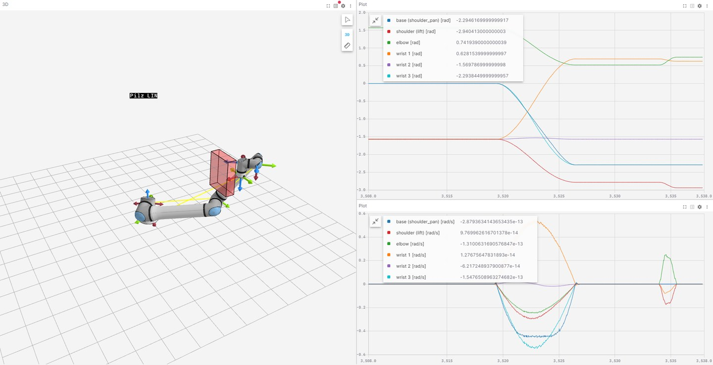
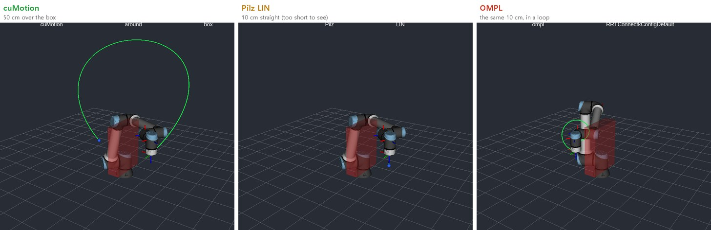
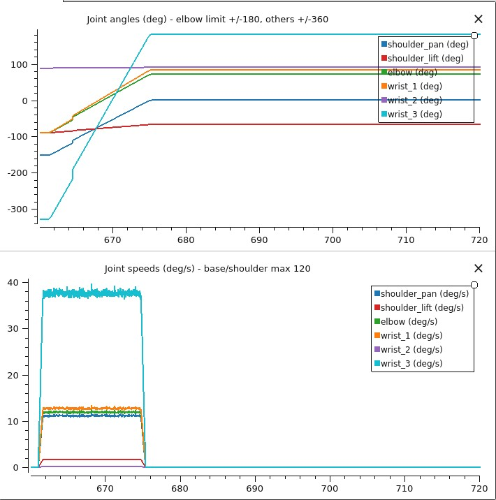

# Putting the Robot's Brain on the Edge — The Simulators: Three Planners on Two URSims, and What the Joint Charts Say

> **Field Notes · The Simulators.** In [The Real Robot](jetson-real-robot-first-move.md) the edge computer moved a real UR20 for the first time, but only by lifting the tool 5 cm and lowering it again, a move kept deliberately tiny. Large detours around obstacles, or comparing planners against each other, are risky to try first on a real arm. So the same stack was attached to two of UR's virtual controllers, **URSim**, to try big moves and planner comparisons in simulation first.

The short version: judged by the tool tip, all three planners reached the goal. The difference showed up in the **joint charts**. This post is about those charts, and about what it took to connect simulators running on a PC to the edge computer.

*(An R&D record on the same Jetson Orin NX 16GB as the earlier posts. Every robot in this post is a **simulator**; none of these scripts was used on a real arm.)*

---

## 30-second summary

- **The real robot's stack, with simulators instead.** The UR driver, cuMotion and MoveIt 2 (OMPL and Pilz) drove both a UR12e simulator on PolyScope 5 and a UR20 simulator on PolyScope X.
- **The tool got there every time; the joints did not agree.** For the same 10 cm move, Pilz LIN stayed within 0.1 mm of a straight line, while OMPL reached within 1 mm of the goal but detoured the tool 1–1.9 m, and on the UR12e turned the last wrist joint **about 510°**. On a real arm, cables and hoses would wind up.
- **With OMPL, the trouble comes after.** The next run started from a folded pose with a protective stop (C403). The cause is UR's wrist-clamping rule, which the ROS robot model doesn't include. Checking every plan and adding the rule to cuMotion's collision model took risky plans from 58 to 0.
- **Soak test:** motion alone ran 7.6 h at 98.2 % success, 12 ms replies with no drift, cuMotion memory flat at 3.8 GB (not a leak). But a dropped link kills the driver, so it needs supervision, and about 8 % of box detours find no plan, so it needs retries and a fallback.
- **Add perception on the same 16 GB and memory runs out.** With continuous object tracking it hit the memory floor after 26 minutes, and after 1 h 10 min even with leaner settings. Perception, not cuMotion, filled the memory. A run that takes one pose per cycle has been holding for 7.5 hours (as of October 5).
- **cuMotion is smooth, but not identical every time.** It cleared the box on a 50 cm move by about 199 mm. The same request, though, went over the box once and around it another time (clearance 93–199 mm).
- **Put the floor in every request.** Without one, OMPL sent the UR20's tool 0.68 m below its base, and the simulator needed a restart after a protective stop.
- **Connect PC simulators with a reverse SSH tunnel.** Simulators in Docker inside WSL aren't visible from outside. One tunnel opened outward from the PC connected them, with no admin rights and no firewall change.
- **To only watch, Lichtblick on Windows.** No WSL, 3D and charts in one window. Make it read-only at the bridge, not in the viewer.
- **The edge computer isn't a real-time OS.** The UR driver must answer every 2 ms, and with heavy containers running alongside, the connection dropped in the middle of a move.

---

## Why simulators after the real robot

The order looks backwards, but there's a reason. The Real Robot asked "can the edge computer move a real robot at all?", so its moves were kept tiny on purpose. This time the question is **what path each planner produces for a large move**: 50 cm over a box, and the same distance with three planners. That's something to look at in simulation before a real arm.

URSim isn't a picture of a robot; it runs **UR's actual controller software** ([Hands-on Notes, Part 0](learn-without-industrial-robot.md)). So it connects with the same driver and the same protocol as a real robot. What it doesn't have is the factory-calibration gap seen in [The Real Robot](jetson-real-robot-first-move.md), real motor timing, or contact. What it can and can't check is the same as the simulated-hardware comparison figure in [Motion](jetson-pose-to-motion.md).

It's a different kind of simulator from NVIDIA's **Isaac Sim**. URSim imitates the **robot controller**; Isaac Sim imitates the **world around it**. URSim has no physics, no objects and no cameras, so picking up a part does nothing. In exchange, the real UR driver connects exactly as to a real robot, and modes, protective stops and joint limits behave as in the controller. Isaac Sim computes gravity, contact, camera images, depth and lighting, but drives the robot with generic joint controllers, so there's no PolyScope or UR safety behaviour, and it needs a PC or cloud machine with an RTX GPU. That's why the Remote-control mode, the protective stops from wound-up poses and the floor problem in this post showed up in URSim, while whether depth drops out on a shiny part, or a grasped part slips, is Isaac Sim's job ([Why Robots Learn in a 'Fake World' First](robot-simulation.md); a hands-on record is in [Isaac Sim](isaac-sim-pc-and-cloud.md)). Neither shows the factory-calibration gap or real contact forces, so the final check is always on the real robot.

## The setup: simulators on the PC, the brain on the edge computer

URSim targets x86 PCs but is **Linux software**, so it doesn't run on Windows directly, and the PolyScope X simulator ships only as a Docker image. So Docker was installed in Linux inside Windows (WSL2), with ROS 2, RViz and PlotJuggler in the same Ubuntu, so the views ran the same ROS version as the edge computer. Two simulators ran in Docker inside WSL2 on a Windows PC: a **UR12e** on PolyScope 5, and a **UR20** on PolyScope X, the same as the real robot in The Real Robot. On the edge computer, one UR driver ran per robot, plus cuMotion and MoveIt 2, with OMPL and Pilz loaded together so each request could pick one. The views (RViz, PlotJuggler) were on the PC.

Three parts of the connection took work.

- **A reverse SSH tunnel.** Docker containers inside WSL can't be seen from outside the PC, so the PC opened an SSH tunnel to the edge computer and carried the simulators' ports over. Because the connection goes outward, it needed no Windows admin rights and no firewall change.
- **One address per robot.** The UR driver uses fixed port numbers. To use two simulators from one edge computer, each robot needs its own address, so the tunnel's end was republished on two different local addresses on the edge computer.
- **The other direction as is.** The connection a robot opens back to the driver comes straight from the simulator to the edge computer; each robot just needs its own ports.

One thing differed on the PolyScope X simulator. To switch power and brakes on from outside, the pendant has to be in **Automatic mode with Remote control**; otherwise the request is refused with "must be in remote mode". In Remote control the driver connected without an External Control program on the pendant. The Real Robot deliberately used manual mode with a person starting the pendant program; running a real arm under Remote control needs more safety procedure to match.

### To only watch, Lichtblick on Windows

*Lichtblick during the UR20 demo. Left, the robot and the box in 3D; top right, joint angles; bottom right, joint speeds. The large bell shapes in the speed chart are cuMotion; the small pulse at the right end is Pilz LIN. The charts are in radians (this version ignores the degree conversion).*

The views first ran as RViz and PlotJuggler inside WSL, but just to watch, the free, open-source Windows viewer **Lichtblick** was lighter and easier. It installs straight on Windows, and the 3D view and the joint charts fit in one window. Run a read-only `foxglove_bridge` on the edge computer and connect through the tunnel. It subscribes to each topic matching its publishers, so the robot's frames (`/tf`) arrive complete too (no Zenoh frame problem, see "What got in the way of the connection" below). The installer isn't code-signed, so check it against the SHA-256 published with the release before installing.

Both were view-only, but the block sits in different places. RViz and PlotJuggler are ROS 2 programs that can publish too (RViz's goal-pose tools, PlotJuggler's re-publisher), so here the Zenoh bridge carried a "subscribe only" allow list to close the way back to the edge computer. On the Lichtblick side, `foxglove_bridge` was started with nothing to receive (no client publishing, services or parameters), so nothing pressed in the viewer has anywhere to go. To only watch next to a real robot, blocking at the bridge is the surer choice than trusting the viewer.

## The seven-step demo

The same demo ran on both robots: start at home, go 50 cm over the box with cuMotion, go 10 cm down and back up with Pilz LIN, return with cuMotion, do the same 10 cm with OMPL, and finally go back home with Pilz PTP.

| Step | UR12e | UR20 |
|---|---|---|
| 1 home (joint move) | reached | reached |
| 2 cuMotion, 50 cm over the box | plan 0.67 s, 0.5 mm, 199 mm clearance | plan 1.84 s, 1.8 mm, 198 mm clearance |
| 3 Pilz LIN 10 cm down | 0.0 mm, 0.1 mm off straight | 0.0 mm, 0.0 mm off straight |
| 4 Pilz LIN 10 cm up | 0.0 mm, 0.1 mm off straight | 0.0 mm |
| 5 cuMotion, back over the box | plan 1.2 s, 0.0 mm, 129 mm clearance | plan 1.56 s, 0.3 mm |
| 6 OMPL, the same 10 cm | 0.96 mm, 1.0 m tool detour, **wrist 3 ~510°** | 0.83 mm, 1.1–1.9 m tool detour |
| 7 Pilz PTP, home (joint goal) | exactly home | exactly home |

The mm figure is the distance between where the tool stopped and the goal; clearance is the tool path's closest approach to the box. Judged by the table alone, the OMPL row is a success too: within 1 mm. The UR20's OMPL numbers come from runs before OMPL was dropped by default (below).

## The same distance, three planners

*UR12e, RViz from the same camera angle. The red box is the obstacle and the green line is the executed tool path.*

Draw the tool path in RViz and each planner's character shows at once. cuMotion makes a large, smooth arc over the box; Pilz LIN is a 10 cm line, which looks almost like a dot at this distance; OMPL does the same 10 cm as a loop. This measures what [Pendant to ROS 2, Part 3](moveit2-goals-not-points.md) stated: "Pilz keeps a fixed shape, OMPL with default settings takes a different shape each time".

## What the tool-tip number hides: the joint chart

"The tool arrived within 1 mm" doesn't show this difference. So PlotJuggler charted all six joints' angles and speeds.

*Top, joint angles; bottom, joint speeds. Light blue is the last wrist joint (wrist_3).*

To move 10 cm with OMPL, **the last wrist joint turned from −330° to +180°, about 510°**, and the base joint turned 150°. The tool stopped within 1 mm of the goal, so by the tool-tip number it's a success. But with a cable or air hose wrapped around a real wrist, that's a turn and a half to travel 10 cm. This kind of wind-up only shows in a joint chart.

Charting the whole UR20 demo on one screen, each planner has its own speed shape.

*UR20, joint speeds (°/s) for demo steps 3–6. The coloured labels on top name each segment's planner.*

- **Pilz**: short, clean pulses. A 10 cm line briefly moves mainly two joints.
- **cuMotion**: every joint speeds up and slows down in a smooth bell shape (the fastest at about 20 °/s).
- **OMPL**: flat-topped bars. Several joints move far at a constant speed for nearly 15 seconds, when the tool only needed to go 10 cm.

Something similar happened once with cuMotion: after one cuMotion move, the second wrist joint sat at −270°. And the simulator's default start pose is right next to a wrist flip, so a 5 cm move from there swung joints about 150°. Start demos from a normal working pose.

## The trouble after OMPL: UR's wrist-clamping rule (C403)

OMPL wasn't only a problem while moving. When it finished, the arm was left **folded or wound up**, and starting the next run's robot program from there caused a protective stop. Even a URScript joint move home (`movej`) stopped again, so the container had to be restarted. It happened on both the UR12e and the UR20.

The cause wasn't a simulator quirk but **a UR controller safety rule**. Protective stop C403 is **wrist-clamping (finger-pinch) protection**: a cylinder around the forearm and a sphere around the tool flange must stay at least 28 mm apart, and the rule can't be disabled. The radii live in the controller's configuration, which puts the limit from the forearm axis to the flange at 115.5 mm on the UR12e and 130.2 mm on the UR20. UR's robot description for ROS (the URDF) doesn't model this rule (issue #112 on UR's ROS 2 description package, still open), so MoveIt, OMPL and cuMotion can all plan into it, and once the arm is inside, every move trips it again until a person recovers it.

Three layers now block it:

- **Check every plan.** Each planned trajectory is checked against UR's rule plus a margin (20 mm on the UR12e, 30 mm on the UR20) and rejected and replanned if it fails.
- **Tell cuMotion.** cuMotion's collision spheres now sit along the real clamping axis (elbow to the first wrist joint), with a buffer around the flange; the stock spheres sat on a line 0.17 m away.
- **A flange margin sphere** in MoveIt requests too.

The check alone blocked 58 near-miss plans (one 2.7 mm inside the limit). With the corrected collision model there were 0 to block, and the closest approach was 40 mm outside the limit. The demo still ends with **step 7, back home with Pilz PTP**, and the UR20 still runs without OMPL by default.

Two lessons: **plan all the way to where the move ends**, and **the robot controller has safety rules the ROS model doesn't know about**. On the pendant, the controller simply blocks such poses; when ROS plans the path, the rule has to go into the model.

## cuMotion doesn't always take the same route

cuMotion's paths were smooth and cleared the box comfortably. But **the same request went over the box once and around it another time**. Both are valid, with 93–199 mm clearance. That's natural for a planner that searches between obstacles, but a cell that expects the same path every time needs to know it.

So the uses split: **Pilz** for approach and retreat right next to parts, where the shape should be the same every time; **cuMotion** for large moves around obstacles; and OMPL not with default settings, only after checking its result. Whatever the planner, the principle from [Pendant to ROS 2, Part 1](ros2-for-robot-programmers.md) stands: keep the verdict deterministic.

## Put the floor in every request

At first MoveIt's planning scene had no floor, and OMPL sent the UR20's tool **0.68 m below its base**. From that pose every program start protective-stopped (this too turned out to be the C403 wrist-clamping rule above), and only restarting the container cleared it. After a restart, PolyScope X was back in Local control, so the mode had to be switched again too.

From then on, **every planning request carried a floor slab 2 cm below the base**, and OMPL stayed above it. It's the same story as "the floor cuMotion adds without asking" in [The Real Robot](jetson-real-robot-first-move.md): any obstacle in a request replaces cuMotion's default floor, so add the floor yourself. On a real cell, the floor, the stand and the fence always belong in the planning scene.

## What got in the way of the connection

The connection took longer than the demo. Written down so it takes less wandering next time.

- **Containers see each other but no data arrives.** ROS 2's default transport (FastDDS) uses shared memory within one computer, so every container needs `--ipc host`.
- **Goals refused with "controller is not running".** Touching the pendant, reopening the tunnel or a protective stop halts the robot-side driver program. The demo script resends the program and **waits 3 s** before sending a goal; a goal sent while the controllers are coming back is cancelled and can lead to a protective stop.
- **The connection drops in the middle of a move.** The UR driver must answer the robot every 2 ms, and the Jetson's Linux isn't a real-time kernel. Two idle cuMotion planners (75–80 % of a CPU core each) plus FoundationPose containers were too much. During demos, only one robot's planner ran, and other heavy containers were stopped.
- **The viewing bridge carried action servers too.** The bridge (Zenoh) set up to watch RViz on the PC passed everything, so the edge computer saw two cuMotion action servers. The bridge now passes only the three topics the views need. It also carried a single QoS setting per topic, so part of the robot's frames (`/tf`), which mixed settings, never crossed; the PC now rebuilds the frames from the joint values.
- **Hours later, a new script can't find the frames.** Test scripts that exited hard without cleaning up left stale participants behind, and after a few hours new programs no longer received the robot's static frames (`/tf_static`). Every script now cleans up its node before exiting.
- **Long-running planner containers go stale too.** After many client restarts, cuMotion planned goals whose "accepted" reply never arrived, and MoveIt stalled during a straight-line move. Before a demo, restart the robot's driver, planner and MoveIt containers. Here the likely cause was R&D-style use, hundreds of test scripts started and hard-killed over a few hours, but on a real cell that runs for days or weeks, restarting isn't the answer. Send goals from one long-lived app node, give every request a timeout and retries, and restart a container only at a safe point between cycles when replies slow down. Whether things degrade over time has to be checked with a soak test, so we ran long tests in simulation. Results:

| | Result | Meaning |
|---|---|---|
| Run 1 | After 30 minutes the robot data link (RTDE) through the tunnel dropped; the UR control node died and never recovered | A real cell needs **supervision**. A watchdog was added and the test restarted |
| Run 3, 7.6 h | 98.2 % of 3,961 steps succeeded, "goal accepted" in 12 ms with no drift, 0 clamping rejects | No slowdown over time |
| cuMotion memory | 2.4 → 3.8 GB in the first hour, then flat; it doesn't shrink while idle either | Not a leak but the GPU memory cache, freed only by restarting the process; budget about 4 GB on a 16 GB Orin |
| No-plan rate | About 8 % of the 50 cm box detours find no path | Clean failures that don't grow, but a real cell needs retries and a fallback |

Run 3 was stopped at 7.6 hours. The numbers had stopped changing, so we moved on to running perception alongside.

### Perception on the same box

A real cell gets the part pose from the camera and moves to it. So on the same 16 GB Orin NX we left the perception chain from the earlier posts running (Grounding DINO → SAM2 → depth → FoundationPose tracking an object) and repeated the motion test. The watchdog stopped the test when available memory fell below 1 GB: GPU memory can't be swapped out, so hitting the limit can freeze the whole Jetson.

| Run | Result | Meaning |
|---|---|---|
| Continuous tracking, dark office | 1.4 GB free after 20 minutes, stopped at **26 min**. Tracking 6.8 → 4.5 fps, cuMotion planning 1.3 → 2.0 s | Default settings don't fit in 16 GB |
| Continuous tracking, leaner settings | Desktop off, ESS light, fewer cuMotion seeds, PyTorch cache cleanup. cuMotion flat at 2.33 GB, planning 1.4 s. Still stopped at **1 h 10 min** | Delays the crossing, doesn't prevent it. All 8 CPU cores saturated for the hour, 24 % no-plan over the box, 31 driver link drops per hour |
| One pose per cycle, lit room, default settings | **Still running at 7.5 h** (as of October 5). 757 of 758 poses succeeded, median 4.0 s, about 1.5 GB free. Motion steps 94 % OK (17 % no-plan over the box), 2 driver restarts | A realistic setup for a cell that needs the part pose once per cycle |

- **Perception, not cuMotion, filled the memory.** Alongside perception, cuMotion sat near 2.5 GB even with default settings; what pulled free memory down was perception (about 10 GB). The FoundationPose container's memory in particular swung up and down, but its GPU allocation stayed flat, so exactly what moves is still unknown.
- **The cuMotion settings pay off with motion alone.** Memory that climbed to 3.8 GB stops at 2.33 GB. Alongside perception it already sits near 2.5 GB, so they made little difference there, apart from more no-plans.
- **nvblox (live mapping) wasn't running in these tests.** A cell that maps live needs more memory.

The verdict: motion plus continuous tracking on one 16 GB Orin NX doesn't survive bad conditions. A real cell would split perception and motion across two Jetsons, use an AGX Orin 32/64 GB, or slim perception down (a trained detector, fewer re-acquisitions). Either way, give the UR driver a real-time kernel and dedicated CPU cores. These three runs differ in both lighting and mode, so the difference can't be pinned on one factor. Who uses how much memory, and how a real cell would split the work, is covered in [The Memory Budget](jetson-memory-budget.md). A UR20 run comes after that.

## Wrap-up

| Checked | Result | Gotcha |
|---|---|---|
| Two simulators, same stack | PolyScope 5 UR12e and PolyScope X UR20 both connected and ran | PolyScope X needs Automatic + Remote control to power on from outside |
| cuMotion | 50 cm over the box, ~199 mm clearance, 0.5–1.8 mm | the same request doesn't always take the same route |
| Pilz LIN | 10 cm, within 0.1 mm of a line | doesn't avoid obstacles |
| OMPL (defaults) | within 1 mm of the goal | 1–1.9 m tool detour, wrist 3 ~510° |
| After OMPL | the next run protective-stops from a pose that trips the wrist-clamping rule (C403) | check every plan + clamp-aware collision model + Pilz PTP home; risky plans 58 → 0 |
| Soak test (motion only, 7.6 h) | 98.2 % success, 12 ms replies with no drift, memory flat at 3.8 GB | a dropped link kills the driver → supervision; ~8 % no-plan → retries and a fallback |
| Perception on the same box | continuous tracking hit the memory floor at 26 min (1 h 10 min with leaner settings); one pose per cycle still running at 7.5 h | a real cell: two Jetsons, AGX Orin 32/64 GB, or lighter perception |
| Floor | a floor slab in every request | without it, the tool went 0.68 m below the base |
| Connection | one reverse SSH tunnel | `--ipc host`, resend the program, a non-real-time kernel, restart containers before a demo |
| Viewing | Lichtblick on Windows | read-only at the bridge |

- **Look at the joint chart, not just the tool-tip number.** A path that arrives within 1 mm can turn a wrist one and a half times.
- **Choose the planner by its job.** Pilz near parts, cuMotion around obstacles, OMPL only after checking.
- **Plan all the way to where you end up.** Plan the move home with a collision-checking planner too.
- **Add the floor yourself.** In every request, not trusting a default.
- **Simulator first, then the real robot in steps.** Look at big moves in simulation; climb on a real arm in small steps, as in [The Real Robot](jetson-real-robot-first-move.md).

---

Notes — basis for these results and disclaimer

The numbers were **measured directly** on 3–4 October 2026 with a Jetson Orin NX 16GB and two URSims (a UR12e on PolyScope 5.26.1 and a UR20 on PolyScope X 10.12.1) running in WSL2 (Ubuntu 22.04) and Docker on a Windows PC (Isaac ROS 3.2, ROS 2 Humble, UR ROS 2 driver 2.14, MoveIt 2 with OMPL and Pilz). The UR12e's cuMotion collision model was the UR10e configuration shipped with Isaac ROS (the UR12e shares the UR10e's kinematics); the UR20 used the configuration built in [Motion](jetson-pose-to-motion.md). These are one or two runs on one PC, so read them as tendencies, not statistics. **All results are simulated**; a real robot's calibration gap, motor timing and contact are not reflected. Using this approach on a real arm must follow that robot's safety settings and risk assessment.

The wrist-clamping rule (C403) is based on UR staff answers on the UR forum, the radii in the controller configuration and issue #112 on UR's ROS 2 description package; OMPL and Pilz behaviour on the MoveIt 2 documentation, the driver's Remote control and ports on the Universal Robots ROS 2 driver documentation, and cuMotion's default floor on the Isaac ROS cuMotion source.

Universal Robots, UR, UR12e, UR20, PolyScope, URSim and URCap are trademarks of Universal Robots A/S; NVIDIA, Jetson, Orin, Isaac ROS and cuMotion of NVIDIA Corporation; ROS of Open Robotics; MoveIt of PickNik Inc.; Windows of Microsoft Corporation; Docker of Docker, Inc. They are used for identification only. PlotJuggler, Lichtblick, Zenoh and foxglove_bridge are open-source software from their respective projects.

**Series** · [← Previous: The Real Robot — an edge computer moves a real arm for the first time](jetson-real-robot-first-move.md) · [Next: Isaac Sim — a virtual work cell on an RTX 3090 PC and a cloud GPU →](isaac-sim-pc-and-cloud.md)

*Related: [Pendant to ROS 2, Part 3: MoveIt 2](moveit2-goals-not-points.md) · [Pendant to ROS 2, Part 4: Isaac ROS and cuMotion](isaac-ros-gpu.md) · [Motion](jetson-pose-to-motion.md) · [Try it: Hands-on Notes (0) — SO-101 and URSim](learn-without-industrial-robot.md) · [UR vs FANUC: openness](cobot-ur-vs-fanuc.md)*

### Glossary

- *URSim*: UR's free virtual controller; it runs the real controller software on a PC
- *PolyScope 5 · PolyScope X*: the previous and current generations of UR's controller software
- *Planner*: software that computes a collision-free path to a goal
- *cuMotion*: NVIDIA's GPU path planner, producing smooth obstacle-avoiding paths
- *Pilz*: MoveIt 2's industrial planner; moves in fixed shapes like a pendant's joint, linear and circular moves (PTP, LIN, CIRC)
- *OMPL*: MoveIt 2's default set of planners; finds any collision-free path, whatever its shape
- *Planning scene*: the world the planner knows about; the floor, stand and obstacles go here
- *Protective stop*: the robot stopping itself because it judges something unsafe
- *WSL2*: a Windows feature for running Linux inside Windows
- *Reverse SSH tunnel*: an inside computer opens an SSH connection to an outside one and lets the outside use inside ports through it
- *Real-time kernel*: an OS kernel built to guarantee responses within a set time
- *RViz · PlotJuggler*: ROS's 3D view tool and time-series chart tool
- *Lichtblick*: a free, open-source robot data viewer that shows ROS topics as 3D views and charts
