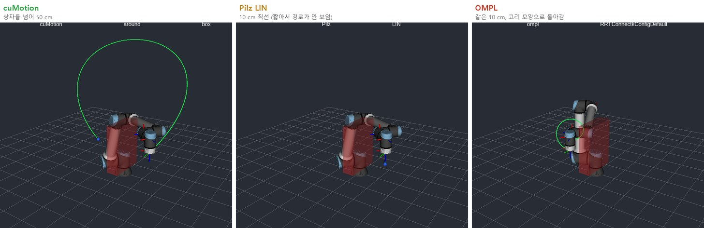
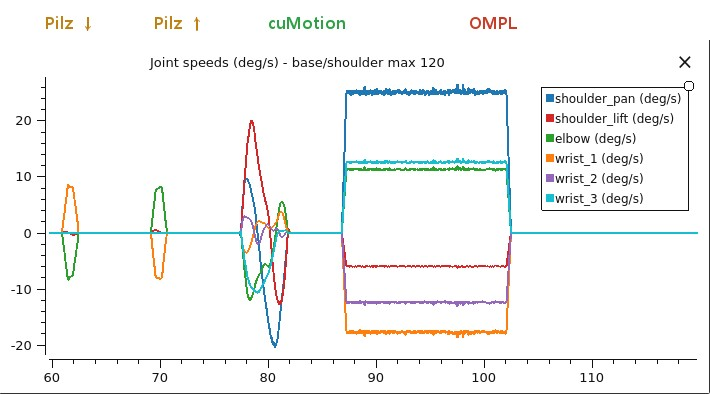

# 로봇의 뇌를 엣지에 올리기 — 시뮬레이터편: URSim 두 대로 본 세 플래너, 관절 그래프가 말해 주는 것

> **현장 노트 · 시뮬레이터편.** [실물편](jetson-real-robot-first-move.md)에서 엣지 컴퓨터가 실제 UR20을 처음 움직였습니다. 다만 툴을 5 cm 올렸다 내리는 정도로, 일부러 아주 작게 움직였어요. 장애물을 크게 돌아가는 경로나 플래너끼리의 비교를 처음부터 실제 로봇으로 하기는 위험합니다. 그래서 같은 스택을 UR의 가상 컨트롤러 **URSim** 두 대에 연결해, 큰 움직임과 플래너 비교를 시뮬레이터에서 먼저 해 봤습니다.

결론부터 말하면, 세 플래너 모두 툴을 목표에 정확히 가져다 놓았습니다. 차이는 툴이 아니라 **관절 그래프**에서 드러났어요. 이 글은 그 그래프 이야기와 함께, PC에서 동작하는 시뮬레이터를 엣지 컴퓨터에 연결하면서 겪은 일을 정리합니다.

*(앞 글들과 같은 Jetson Orin NX 16GB에서 한 R&D 기록입니다. 이 글의 로봇은 모두 **시뮬레이터**이고, 여기 나오는 스크립트는 실제 로봇에 쓰지 않았습니다.)*

---

## 30초 요약

- **실제 로봇에 쓴 스택을 그대로, 로봇만 시뮬레이터로.** UR 드라이버, cuMotion, MoveIt 2(OMPL과 Pilz)로 PolyScope 5의 UR12e와 PolyScope X의 UR20 시뮬레이터를 모두 움직였다.
- **툴은 셋 다 도착했지만, 관절은 딴판이었다.** 같은 10 cm 이동에서 Pilz LIN은 직선에서 0.1 mm도 벗어나지 않았다. OMPL도 목표 1 mm 안에 도착했지만, 툴이 1~1.9 m를 돌아갔고 UR12e에서는 손목 마지막 관절이 **약 510°** 돌았다. 실제 로봇이라면 케이블과 호스가 감긴다.
- **OMPL은 끝난 뒤가 더 문제였다.** 접힌 자세에서 다음 실행이 보호 정지(C403)로 시작했다. 원인은 UR의 손목 끼임 방지 규칙인데, ROS의 로봇 모델에는 없다. 계획마다 검사하고 cuMotion 충돌 모델에 넣자 위험 계획이 58개에서 0개가 됐다.
- **장시간 시험:** 모션만 실행하면 7.6시간 동안 성공률 98.2%, 응답 12 ms 그대로, cuMotion 메모리는 3.8 GB에서 멈췄다(누수 아님). 대신 연결이 끊기면 드라이버가 죽어 감시가 필요하고, 상자 우회 계획은 약 8% 실패해 재시도와 대체 경로가 필요하다.
- **인식까지 같은 16 GB에 올리면 메모리가 모자랐다.** 물체를 계속 추적하자 26분, 설정을 줄여도 1시간 10분 만에 메모리 한계에 걸렸다. 메모리를 채운 쪽은 cuMotion이 아니라 인식이었다. 사이클마다 자세를 한 번만 구하는 시험은 7.5시간째 버티고 있다(10월 5일 기준).
- **cuMotion은 부드럽지만 매번 같은 길로 가지는 않는다.** 50 cm를 가며 상자 위를 약 199 mm 띄우고 넘었다. 다만 같은 요청이 한 번은 상자 위로, 한 번은 옆으로 갔다(간격 93~199 mm).
- **바닥은 모든 요청에 넣는다.** 바닥이 없자 OMPL은 UR20의 툴을 받침면보다 0.68 m 아래로 보냈고, 보호 정지가 난 시뮬레이터는 다시 시작해야 풀렸다.
- **PC의 시뮬레이터는 역방향 SSH 터널로 연결한다.** WSL 안 Docker의 시뮬레이터는 PC 밖에서 보이지 않는다. PC에서 바깥으로 여는 터널 하나로, 관리자 권한이나 방화벽 변경 없이 연결했다.
- **보기만 한다면 윈도에서는 Lichtblick.** WSL 없이 설치되고, 3D 화면과 그래프를 한 창에서 본다. 읽기 전용은 뷰어가 아니라 브리지에서 막는다.
- **엣지 컴퓨터는 실시간 OS가 아니다.** UR 드라이버는 2 ms마다 응답해야 하는데, 무거운 컨테이너를 함께 실행하자 움직이던 도중에 연결이 끊겼다.

---

## 왜 실물 다음에 시뮬레이터인가

순서가 거꾸로 같아 보이지만 이유가 있습니다. 실물편은 "엣지 컴퓨터가 실제 로봇을 움직일 수 있는가"를 확인하는 글이라 움직임을 일부러 작게 잡았어요. 이번에 보고 싶은 건 **움직임이 클 때 플래너가 어떤 경로를 내놓는가**입니다. 상자를 넘어 50 cm를 가 보고, 같은 거리를 세 플래너로 비교하는 일은 실제 로봇보다 시뮬레이터에서 먼저 하는 게 맞습니다.

URSim은 겉모습만 흉내 내는 시뮬레이터가 아니라 **UR 컨트롤러 소프트웨어를 그대로** 실행합니다([실습 노트 0부](learn-without-industrial-robot.md)). 그래서 실제 로봇과 같은 드라이버, 같은 통신 방식으로 연결돼요. 대신 [실물편](jetson-real-robot-first-move.md)에서 본 공장 보정 차이나 실제 모터의 타이밍, 접촉은 없습니다. 무엇을 확인할 수 있고 무엇은 못 하는지는 [모션편](jetson-pose-to-motion.md)의 가상 하드웨어 비교 그림과 같아요.

같은 시뮬레이터라도 NVIDIA의 **Isaac Sim**과는 하는 일이 다릅니다. URSim이 **로봇 컨트롤러**를 흉내 낸다면, Isaac Sim은 **주변 세계**를 흉내 내요. URSim에는 물리도, 물체도, 카메라도 없어서 부품을 집어도 아무 일이 일어나지 않습니다. 대신 진짜 UR 드라이버가 실제 로봇과 똑같이 연결되고, 모드와 보호 정지, 관절 한계까지 컨트롤러 그대로 동작합니다. Isaac Sim은 중력과 접촉, 카메라 영상과 깊이, 조명까지 계산하지만, 로봇은 일반 관절 컨트롤러로 움직여서 PolyScope나 UR 안전 기능은 들어 있지 않고, RTX GPU가 달린 PC나 클라우드가 필요합니다. 그래서 이 글에서 잡은 원격 제어 모드, 감긴 자세에서의 보호 정지, 바닥 문제는 URSim이라서 보인 것이고, 반짝이는 부품에서 깊이가 비는지나 집은 부품이 미끄러지는지는 Isaac Sim의 몫입니다([로봇은 왜 '가짜 세계'에서 먼저 배우나](robot-simulation.md), 직접 올려 본 기록은 [Isaac Sim편](isaac-sim-pc-and-cloud.md)). 공장 보정 차이나 실제 접촉 힘은 둘 다 보여 주지 못하니, 마지막 확인은 늘 실제 로봇에서 합니다.

## 구성: 시뮬레이터는 PC에, 두뇌는 엣지 컴퓨터에

시뮬레이터는 두 대입니다. PolyScope 5로 동작하는 **UR12e**와, 실물편의 로봇과 같은 PolyScope X의 **UR20**이에요. 둘 다 윈도 PC의 WSL2 안에서 Docker로 띄웠습니다. URSim은 x86 PC용이긴 하지만 **리눅스용**이라 윈도에서 바로 실행되지 않고, PolyScope X 시뮬레이터는 Docker 이미지로만 나오기 때문이에요. 같은 Ubuntu에 ROS 2와 RViz, PlotJuggler도 설치해서, 엣지 컴퓨터와 같은 ROS 버전으로 화면을 봤습니다.

엣지 컴퓨터에서는 로봇마다 UR 드라이버를 하나씩 띄우고, cuMotion과 MoveIt 2를 실행했습니다. MoveIt 2에는 OMPL과 Pilz를 함께 올려서 요청마다 플래너를 고를 수 있게 했어요.

연결에서 손이 간 곳은 세 군데입니다.

- **역방향 SSH 터널.** WSL 안의 Docker 컨테이너는 PC 밖에서 보이지 않습니다. 그래서 PC에서 엣지 컴퓨터 쪽으로 SSH 터널을 열고, 그 터널로 시뮬레이터의 포트를 엣지 컴퓨터에 넘겼어요. PC에서 바깥으로 나가는 연결이라 윈도 관리자 권한도, 방화벽 변경도 필요 없었습니다.
- **로봇마다 주소 하나씩.** UR 드라이버는 정해진 포트 번호만 씁니다. 한 엣지 컴퓨터에서 시뮬레이터 두 대를 쓰려면 로봇마다 주소가 달라야 해서, 터널로 넘어온 포트를 엣지 컴퓨터 안의 서로 다른 로컬 주소 두 개에 나눠 열었어요.
- **반대 방향은 터널 없이.** 로봇 쪽에서 드라이버로 여는 연결은 시뮬레이터에서 엣지 컴퓨터로 곧바로 들어옵니다. 로봇마다 포트만 다르게 주면 됩니다.

PolyScope X 시뮬레이터에는 다른 점이 하나 있었습니다. 밖에서 전원과 브레이크를 켜려면 펜던트가 **자동 모드이면서 원격 제어** 상태여야 해요. 아니면 "원격 모드여야 한다"며 거부합니다. 대신 원격 제어에서는 펜던트에 External Control 프로그램을 만들어 두지 않아도 드라이버가 바로 연결됐어요. 실물편에서는 수동 모드에서 사람이 펜던트 프로그램을 실행하는 방식을 택했습니다. 실제 로봇을 원격 제어로 움직이려면 그만큼 안전 절차를 더 갖춰야 합니다.

### 보기만 한다면 윈도에서는 Lichtblick

*UR20 데모 중 Lichtblick 화면입니다. 왼쪽 3D 화면에 로봇과 상자가 있고, 오른쪽 위는 관절 각도, 아래는 관절 속도예요. 속도 그래프의 큰 종 모양이 cuMotion, 오른쪽 끝의 작은 펄스가 Pilz LIN입니다. 그래프 단위는 라디안이고(이 버전은 도 단위 변환을 무시합니다), 그림 속 글자는 원래 화면 그대로입니다.*

처음에는 WSL 안의 RViz와 PlotJuggler로 화면을 봤는데, 보기만 할 거라면 윈도용 무료 오픈소스 뷰어 **Lichtblick**이 더 가볍고 편했습니다. 윈도에 바로 설치되고, 3D 화면과 관절 그래프를 한 창에서 볼 수 있어요. 엣지 컴퓨터에서 읽기 전용 `foxglove_bridge`를 띄우고 터널로 연결하면 됩니다. 이 브리지는 토픽마다 보내는 쪽 설정에 맞춰 받기 때문에, 로봇 좌표계(`/tf`)도 빠짐없이 넘어옵니다. 아래 '연결에서 걸린 것들'에 나오는 Zenoh 브리지의 좌표계 문제가 여기서는 없었어요. 설치 파일에 코드 서명이 없으니, 릴리스에 공개된 SHA-256과 맞춰 본 뒤 설치하세요.

두 방식 모두 '보기만' 하지만, 막는 자리가 다릅니다. RViz와 PlotJuggler는 원래 토픽을 보낼 수도 있는 ROS 2 프로그램이에요(RViz의 목표 자세 도구, PlotJuggler의 다시 내보내기 기능). 그래서 이번에는 Zenoh 브리지에 '구독만' 허용하는 목록을 걸어, 엣지 컴퓨터로 되돌아가는 길을 막았습니다. Lichtblick 쪽은 `foxglove_bridge`를 처음부터 아무것도 받지 않게(발행·서비스·파라미터 없이) 띄웠기 때문에, 뷰어에서 무엇을 눌러도 엣지 컴퓨터로 갈 길이 없어요. 실제 로봇 옆에서 화면만 볼 거라면 뷰어를 믿기보다 브리지에서 막는 쪽이 확실합니다.

## 일곱 단계 데모

두 로봇에 같은 데모를 실행했습니다. 홈에서 출발해 cuMotion으로 상자를 넘어 50 cm를 가고, Pilz LIN으로 10 cm 내려갔다가 다시 올라옵니다. 그다음 cuMotion으로 상자를 넘어 돌아오고, 비교를 위해 같은 10 cm를 OMPL로 가 본 뒤, 마지막으로 Pilz PTP로 홈에 돌아왔어요.

| 단계 | UR12e | UR20 |
|---|---|---|
| 1 홈 (관절 이동) | 도착 | 도착 |
| 2 cuMotion, 상자 넘어 50 cm | 계획 0.67초, 0.5 mm, 간격 199 mm | 계획 1.84초, 1.8 mm, 간격 198 mm |
| 3 Pilz LIN 10 cm 아래로 | 0.0 mm, 직선에서 0.1 mm | 0.0 mm, 직선에서 0.0 mm |
| 4 Pilz LIN 10 cm 위로 | 0.0 mm, 직선에서 0.1 mm | 0.0 mm |
| 5 cuMotion, 상자 넘어 복귀 | 계획 1.2초, 0.0 mm, 간격 129 mm | 계획 1.56초, 0.3 mm |
| 6 OMPL, 같은 10 cm | 0.96 mm, 툴 우회 1.0 m, **손목 3 약 510°** | 0.83 mm, 툴 우회 1.1~1.9 m |
| 7 Pilz PTP, 홈으로 (관절 목표) | 정확히 도착 | 정확히 도착 |

표의 mm는 툴이 멈춘 자리와 목표 사이의 거리이고, 간격은 툴 경로가 상자에 가장 가까이 다가간 거리입니다. 표만 보면 OMPL도 1 mm 안에 도착했으니 성공이에요. UR20의 OMPL 숫자는 OMPL을 기본에서 빼기 전(아래 설명)에 실행한 결과입니다.

## 같은 거리, 세 플래너

*UR12e를 같은 시점에서 본 RViz 화면입니다. 빨간 상자가 장애물, 초록 선이 실제로 지나간 툴 경로예요. 그림 속 글자는 원래 화면 그대로 영어입니다.*

RViz에 툴 경로를 그려 보면 세 플래너의 성격이 한눈에 보입니다. cuMotion은 상자를 넘는 크고 매끄러운 호를 그립니다. Pilz LIN은 10 cm 직선이라 이 거리에서는 점처럼 보이고, OMPL은 같은 10 cm를 고리 모양으로 돌아갔어요. [펜던트에서 ROS 2로 3부](moveit2-goals-not-points.md)에서 "Pilz는 정해진 모양, OMPL은 기본 설정에서 매번 다른 모양"이라고 적었는데, 그 말을 실제로 재 본 셈입니다.

## 도착 오차가 감추는 것: 관절 그래프

툴이 목표 1 mm 안에 도착했다는 숫자만으로는 이 차이가 보이지 않습니다. 그래서 PlotJuggler로 관절 여섯 개의 각도와 속도를 함께 그렸어요.

*위는 관절 각도, 아래는 관절 속도입니다(그래프 글자는 원래 화면 그대로). 하늘색 선이 손목 마지막 관절(wrist_3)이에요.*

OMPL로 10 cm를 가는 동안 **손목 마지막 관절은 −330°에서 +180°까지 약 510°**, 베이스 관절도 150° 돌았습니다. 툴은 목표에서 1 mm 안에 멈췄으니 도착 오차로만 보면 성공이에요. 하지만 실제 로봇 손목에 케이블이나 에어 호스가 감겨 있다면, 10 cm를 가려고 손목을 한 바퀴 반 돌린 셈입니다. 이런 감김은 관절 그래프를 봐야만 보입니다.

UR20에서 데모 전체를 한 화면에 그리면, 플래너마다 속도 그래프의 모양이 다릅니다.

*UR20, 데모 3~6단계의 관절 속도(°/s)입니다. 위쪽 색 글자는 그 구간에 쓴 플래너예요.*

- **Pilz**: 짧고 깔끔한 펄스입니다. 10 cm 직선이라 주로 관절 두 개가 잠깐 움직여요.
- **cuMotion**: 모든 관절이 부드러운 종 모양으로 빨라졌다가 느려집니다(가장 빠른 관절이 약 20 °/s).
- **OMPL**: 꼭대기가 평평한 막대 모양입니다. 툴은 10 cm만 가면 되는데, 여러 관절이 15초 가까이 일정한 속도로 크게 움직여요.

cuMotion에서도 비슷한 일이 한 번 있었습니다. 어떤 움직임이 끝난 뒤 손목 두 번째 관절이 −270°에 가 있었어요. 또 시뮬레이터의 기본 시작 자세는 손목이 뒤집히기 직전이라, 그 자세에서 5 cm를 움직이는 데 관절이 약 150° 돌았습니다. 데모는 평소 작업 자세에서 시작해야 합니다.

## OMPL 다음이 더 문제였다: 손목 끼임 방지 규칙(C403)

OMPL은 움직이는 동안만 문제가 아니었습니다. 움직임이 끝난 뒤 팔이 **접히거나 감긴 자세**로 남았고, 그 자세에서 다음 데모를 시작하려고 로봇 프로그램을 켜자 보호 정지가 났어요. URScript로 홈까지 관절 이동(`movej`)을 보내도 다시 멈춰서, 컨테이너를 다시 시작해야 했습니다. UR12e에서도, UR20에서도 같은 일이 있었어요.

원인은 시뮬레이터의 버릇이 아니라 **UR 컨트롤러의 안전 규칙**이었습니다. 보호 정지 코드 C403은 **손목 끼임 방지**예요. 팔뚝을 감싼 원기둥과 툴 플랜지를 감싼 구가 28 mm 이상 떨어져 있어야 하고, 이 규칙은 끌 수 없습니다. 반지름은 컨트롤러 설정에 들어 있어서, 팔뚝 축에서 플랜지까지 UR12e는 115.5 mm, UR20은 130.2 mm 안으로 들어오면 안 됩니다. 그런데 ROS에서 쓰는 UR 로봇 설명(URDF)에는 이 규칙이 없습니다(UR의 ROS 2 설명 패키지에 열려 있는 이슈 #112). 그래서 MoveIt도, OMPL도, cuMotion도 이 영역 안으로 경로를 짤 수 있고, 한번 들어가면 어떤 움직임이든 다시 걸려 사람이 꺼내야 합니다.

세 겹으로 막았습니다.

- **계획마다 검사.** 계획된 궤적을 UR의 규칙에 여유(UR12e 20 mm, UR20 30 mm)를 더해 검사하고, 걸리면 버리고 다시 계획합니다.
- **cuMotion에게 알려 주기.** cuMotion의 충돌 구를 실제 끼임 축(팔꿈치에서 첫 손목 관절까지)을 따라 배치하고, 플랜지 둘레에 여유를 줬습니다. 기본 설정의 구는 이 축에서 0.17 m 떨어진 선 위에 있었어요.
- **MoveIt 요청에도 플랜지 여유 구.**

검사만 했을 때는 위험할 뻔한 계획 58개를 막았고(하나는 한계보다 2.7 mm 안쪽이었습니다), 충돌 모델까지 고친 뒤에는 막을 계획이 0개, 가장 가까운 접근도 한계에서 40 mm 바깥이었습니다. 데모 마지막에는 여전히 **Pilz PTP로 홈에 돌아오는 7단계**를 두고, UR20에서는 OMPL을 기본에서 뺐습니다.

교훈은 두 가지입니다. **움직임이 끝나는 자리까지 계획할 것**, 그리고 **로봇 컨트롤러에는 ROS 모델이 모르는 안전 규칙이 있다는 것**. 펜던트로만 쓸 때는 컨트롤러가 알아서 막아 주던 것을, ROS로 경로를 짤 때는 직접 모델에 넣어야 합니다.

## cuMotion도 매번 같은 길로 가지는 않는다

cuMotion의 경로는 부드러웠고 상자도 넉넉히 피했습니다. 다만 **같은 요청이 한 번은 상자 위로, 한 번은 상자 옆으로** 갔어요. 두 경로 모두 문제없었고 상자와의 간격은 93~199 mm였습니다. 장애물 사이로 길을 찾는 플래너라면 자연스러운 일이지만, 매번 같은 경로를 기대하는 셀이라면 미리 알아 둬야 할 성질입니다.

그래서 쓰임새가 갈립니다. 부품 바로 근처에서 다가가고 물러나는 동작은 매번 같은 모양인 **Pilz**로, 장애물을 돌아가는 큰 이동은 **cuMotion**으로 하고, OMPL은 기본 설정 그대로 쓰지 말고 결과를 확인한 뒤에 씁니다. 어떤 플래너를 쓰든 합격·불합격 판정은 결정론적으로 둔다는 [펜던트에서 ROS 2로 1부](ros2-for-robot-programmers.md)의 원칙은 그대로예요.

## 바닥은 모든 요청에

처음에는 MoveIt의 플래닝 씬에 바닥이 없었습니다. 그러자 OMPL이 UR20의 툴을 **받침면보다 0.68 m 아래**로 보냈어요. 그 자세가 된 뒤로는 프로그램을 켤 때마다 보호 정지했고(나중에 보니 이것도 위의 손목 끼임 방지 C403이었습니다), 컨테이너를 다시 시작해야 풀렸습니다. 다시 시작하면 PolyScope X가 원격 제어에서 로컬 제어로 돌아가 있어서, 모드도 다시 바꿔야 했어요.

그 뒤로는 **모든 계획 요청에 받침면 2 cm 아래로 바닥 판**을 넣었고, OMPL도 그 위에서만 움직였습니다. [실물편](jetson-real-robot-first-move.md)의 "cuMotion이 몰래 넣는 바닥"과 같은 이야기예요. 요청에 장애물을 하나라도 넣으면 cuMotion의 기본 바닥은 빠지니, 바닥은 직접 넣어야 합니다. 실제 셀이라면 바닥과 받침대, 펜스는 언제나 플래닝 씬에 들어 있어야 해요.

## 연결에서 걸린 것들

데모 자체보다 연결에 시간이 더 걸렸습니다. 다음에 덜 헤매도록 적어 둡니다.

- **컨테이너끼리는 보이는데 데이터가 오지 않는다.** ROS 2의 기본 통신(FastDDS)은 같은 컴퓨터 안에서는 공유 메모리를 씁니다. 그래서 컨테이너마다 `--ipc host`를 줘야 해요.
- **"컨트롤러가 동작하지 않는다"며 목표를 거부한다.** 펜던트를 만지거나, 터널을 다시 열거나, 보호 정지가 나면 로봇 쪽 드라이버 프로그램이 멈춥니다. 그래서 데모 스크립트가 프로그램을 다시 보내고, **3초 기다린 뒤** 목표를 보내게 했어요. 컨트롤러가 다시 켜지는 도중에 보낸 목표는 취소되고, 보호 정지로 이어질 수도 있습니다.
- **움직이던 도중에 연결이 끊긴다.** UR 드라이버는 2 ms마다 로봇에 응답해야 하는데, Jetson의 리눅스는 실시간 커널이 아닙니다. 대기 중인 cuMotion 두 개(각각 CPU 한 코어의 75~80%)에 FoundationPose 컨테이너까지 함께 실행하자 연결이 끊겼어요. 데모 중에는 로봇 한 대의 플래너만 켜고, 다른 무거운 컨테이너는 껐습니다.
- **화면용 브리지가 액션 서버까지 넘겼다.** PC에서 RViz를 보려고 놓은 Zenoh 브리지가 아무것도 거르지 않아서, 엣지 컴퓨터에 cuMotion 액션 서버가 두 개 있는 것처럼 보였어요. 그래서 화면에 필요한 토픽 세 개만 통과시켰습니다. 또 이 브리지는 토픽마다 통신 설정을 하나만 넘기는데, 로봇 좌표계(`/tf`)에는 설정이 섞여 있어서 일부가 넘어오지 않았어요. PC 쪽에서 관절 값으로 좌표계를 다시 계산해 해결했습니다.
- **몇 시간 뒤, 새로 띄운 스크립트가 좌표계를 못 받는다.** 시험 스크립트를 정리 없이 강제로 끄다 보니 끝나지 않은 통신 참가자가 쌓였고, 몇 시간 뒤에는 새 프로그램이 로봇 좌표계(`/tf_static`)를 받지 못했습니다. 모든 스크립트가 노드를 정리한 뒤 끝나도록 바꿨어요.
- **오래 켜 둔 플래너 컨테이너가 응답을 놓친다.** 클라이언트를 여러 번 다시 띄우자 cuMotion은 계획을 하는데도 '목표를 받았다'는 응답이 오지 않았고, MoveIt은 직선 이동 도중에 멈췄어요. 그래서 데모 전에는 로봇의 드라이버, 플래너, MoveIt 컨테이너를 다시 시작합니다.

마지막 항목은 시험 스크립트를 몇 시간 동안 수백 번 띄웠다 강제로 끈 R&D식 사용이 원인으로 보입니다. 하지만 며칠, 몇 주씩 켜 두는 실제 셀에서 재시작은 답이 아니에요. 실제 셀이라면 오래 켜 두는 앱 노드 하나가 목표를 보내고, 모든 요청에 시간 제한과 재시도를 두고, 응답이 늦어지면 사이클 사이의 안전한 시점에만 컨테이너를 다시 띄우게 합니다. 시간이 갈수록 나빠지는지는 장시간 시험으로 확인해야 해서, 시뮬레이터로 장시간 시험을 했습니다. 결과는 이렇습니다.

| | 결과 | 의미 |
|---|---|---|
| 1차 시험 | 30분 만에 터널 경로의 로봇 데이터 연결(RTDE)이 끊기며 UR 제어 노드가 죽고 다시 살아나지 않음 | 실제 셀에는 **감시 프로그램**이 꼭 필요. 감시 스크립트를 넣은 뒤 다시 시작 |
| 3차 시험, 7.6시간 | 3,961단계 중 98.2% 성공, '목표 받음' 응답 12 ms 그대로, 손목 끼임 거부 0 | 시간이 지나도 느려지지 않음 |
| cuMotion 메모리 | 첫 한 시간에 2.4 → 3.8 GB, 그 뒤 그대로. 쉬는 동안에도 줄지 않음 | 누수가 아니라 GPU 메모리 캐시라서 프로세스를 다시 시작해야 풀림. 16 GB Orin에서는 약 4 GB를 잡아 둬야 함 |
| 계획 실패 | 상자를 넘는 50 cm에서 약 8%가 '경로 없음' | 깔끔한 실패라 늘지는 않지만, 실제 셀에는 재시도와 대체 경로가 필요 |

3차 시험은 7.6시간에서 멈췄습니다. 숫자가 더 바뀌지 않아서, 인식을 함께 실행하는 시험으로 넘어갔어요.

### 인식까지 한 대에 올리면

실제 셀에서는 카메라로 부품 자세를 구하고 그 자세로 움직입니다. 그래서 같은 Orin NX 16 GB에 앞 글들의 인식 체인(Grounding DINO → SAM2 → 깊이 → FoundationPose로 물체 추적)을 켜 둔 채 같은 모션 시험을 했습니다. 감시 스크립트는 남은 메모리가 1 GB 아래로 내려가면 시험을 멈추게 했어요. GPU 메모리는 스왑으로 밀어낼 수 없어서, 한계에 닿으면 Jetson 전체가 멈출 수 있기 때문입니다.

| 시험 | 결과 | 의미 |
|---|---|---|
| 계속 추적, 어두운 사무실 | 20분 뒤 남은 메모리 1.4 GB, **26분**에 멈춤. 추적 6.8 → 4.5 fps, cuMotion 계획 1.3 → 2.0초 | 기본 설정으로는 16 GB에 들어가지 않음 |
| 계속 추적, 설정 줄임 | 화면 끄기, ESS light, cuMotion 후보 수 축소, PyTorch 캐시 정리. cuMotion 2.33 GB로 평평, 계획 1.4초. 그래도 **1시간 10분**에 멈춤 | 늦출 뿐 막지는 못함. CPU 8코어가 한 시간 내내 포화, 상자 넘기 '경로 없음' 24%, 드라이버 연결 끊김 시간당 31번 |
| 사이클마다 자세 한 번, 밝은 조명, 설정 그대로 | 10월 5일 기준 **7.5시간째 진행 중**. 자세 758번 중 757번 성공, 중간값 4.0초, 남은 메모리 약 1.5 GB. 모션 단계 94% 성공(상자 넘기 '경로 없음' 17%), 드라이버 재시작 2번 | 부품 자세가 사이클마다 한 번이면 되는 셀이라면 현실적인 구성 |

- **메모리를 채운 건 cuMotion이 아니라 인식이었습니다.** 인식과 함께 실행하면 cuMotion은 기본 설정에서도 2.5 GB 근처였고, 남은 메모리를 끌어내린 건 인식 쪽(약 10 GB)이었어요. 특히 FoundationPose 컨테이너 메모리가 오르내렸는데, GPU 할당은 평평해서 정확히 무엇이 오르내리는지는 아직 모릅니다.
- **cuMotion 설정은 모션만일 때 효과가 큽니다.** 3.8 GB까지 오르던 메모리가 2.33 GB에서 멈춰요. 인식과 함께일 때는 원래 2.5 GB 근처라 거의 차이가 없었고, '경로 없음'만 늘었습니다.
- **이 시험에는 nvblox(실시간 지도)가 빠져 있습니다.** 지도를 실시간으로 만드는 셀이라면 메모리가 더 필요해요.

정리하면, 16 GB Orin NX 한 대에 모션과 계속 추적을 함께 올리면 나쁜 조건에서는 버티지 못합니다. 실제 셀이라면 인식과 모션을 Jetson 두 대로 나누거나, AGX Orin 32/64 GB를 쓰거나, 인식을 가볍게(학습된 검출기, 다시 찾기 줄이기) 만듭니다. 어느 쪽이든 UR 드라이버에는 실시간 커널과 전용 CPU 코어를 줘야 해요. 다만 세 시험은 조명과 방식이 함께 달라서, 차이가 어디서 왔는지 한 가지로 가를 수는 없습니다. 메모리를 누가 얼마나 쓰는지, 실제 셀이라면 어떻게 나눌지는 [메모리편](jetson-memory-budget.md)에 자세히 정리했습니다. UR20 시험은 그다음 차례예요.

## 정리

| 확인한 것 | 결과 | 걸린 것 |
|---|---|---|
| 같은 스택으로 시뮬레이터 두 대 | PolyScope 5의 UR12e, PolyScope X의 UR20 모두 연결·실행 | PolyScope X는 자동 모드 + 원격 제어여야 밖에서 전원을 켬 |
| cuMotion | 상자 넘어 50 cm, 간격 약 199 mm, 0.5~1.8 mm | 같은 요청에도 경로가 달라짐 |
| Pilz LIN | 10 cm, 직선에서 0.1 mm 이내 | 장애물은 피하지 않음 |
| OMPL (기본 설정) | 목표 1 mm 안 | 툴 우회 1~1.9 m, 손목 3 약 510° |
| OMPL 다음 | 손목 끼임 방지(C403)에 걸린 자세에서 다음 실행이 보호 정지 | 계획마다 검사 + 끼임 축 충돌 모델 + Pilz PTP 홈. 위험 계획 58 → 0 |
| 장시간 시험(모션만, 7.6시간) | 성공률 98.2%, 응답 12 ms 그대로, 메모리 3.8 GB에서 멈춤 | 연결이 끊기면 드라이버가 죽음 → 감시. 계획 실패 약 8% → 재시도·대체 경로 |
| 인식까지 한 대에 | 계속 추적은 26분(설정을 줄여 1시간 10분)에 메모리 한계. 사이클마다 자세 한 번은 7.5시간째 진행 중 | 실제 셀은 Jetson 두 대, AGX Orin 32/64 GB, 또는 가벼운 인식 |
| 바닥 | 모든 요청에 바닥 판 | 없으면 툴이 받침면 0.68 m 아래로 |
| 연결 | 역방향 SSH 터널 하나 | `--ipc host`, 프로그램 다시 보내기, 실시간이 아닌 커널, 데모 전 컨테이너 재시작 |
| 보기 | 윈도에서는 Lichtblick | 읽기 전용은 브리지에서 |

- **도착 오차만 보지 말고 관절 그래프도 함께 봅니다.** 1 mm 안에 도착한 경로가 손목을 한 바퀴 반 돌렸을 수도 있습니다.
- **플래너는 쓰임새에 맞게 고릅니다.** 부품 근처는 Pilz, 장애물을 돌아갈 때는 cuMotion, OMPL은 결과를 확인한 뒤에.
- **움직임이 끝나는 자리까지 계획합니다.** 홈으로 돌아가는 이동도 충돌을 검사하는 플래너로.
- **바닥은 직접 넣습니다.** 기본값을 믿지 말고, 모든 요청에.
- **큰 움직임은 시뮬레이터에서 먼저, 실제 로봇은 계단으로.** 큰 움직임은 시뮬레이터에서 확인하고, 실제 로봇에서는 [실물편](jetson-real-robot-first-move.md)처럼 작은 계단으로 올라갑니다.

---

참고 — 이 결과의 근거와 고지

수치는 Jetson Orin NX 16GB와 윈도 PC의 WSL2(Ubuntu 22.04)·Docker에서 동작한 URSim 두 대(PolyScope 5.26.1의 UR12e, PolyScope X 10.12.1의 UR20)로 2026년 10월 3~4일 **직접 측정한 값**입니다(Isaac ROS 3.2, ROS 2 Humble, UR ROS 2 드라이버 2.14, MoveIt 2의 OMPL·Pilz). UR12e의 cuMotion 충돌 모델은 Isaac ROS에 들어 있는 UR10e 설정을 썼고(UR12e는 UR10e와 기구학이 같음), UR20은 [모션편](jetson-pose-to-motion.md)에서 만든 설정을 썼습니다. 한 대의 PC에서 한두 번씩 실행한 결과라 통계라기보다 경향으로 봐 주세요. **모두 시뮬레이터 결과**이며, 실제 로봇의 보정 차이, 모터 타이밍, 접촉은 반영되지 않습니다. 실제 팔에 이 방식을 쓸 때는 해당 로봇의 안전 설정과 위험성 평가를 따라야 합니다.

손목 끼임 방지(C403)의 내용은 UR 포럼의 UR 측 답변, 컨트롤러 설정 파일의 반지름, UR ROS 2 설명 패키지의 이슈 #112를, OMPL과 Pilz의 동작은 MoveIt 2 공식 문서를, 드라이버의 원격 제어와 포트는 Universal Robots ROS 2 드라이버 문서를, cuMotion의 기본 바닥은 Isaac ROS cuMotion 소스를 근거로 했습니다.

Universal Robots·UR·UR12e·UR20·PolyScope·URSim·URCap은 Universal Robots A/S의, NVIDIA·Jetson·Orin·Isaac ROS·cuMotion은 NVIDIA Corporation의, ROS는 Open Robotics의, MoveIt은 PickNik Inc.의, Windows는 Microsoft Corporation의, Docker는 Docker, Inc.의 상표이며 지칭 목적으로만 사용했습니다. PlotJuggler, Lichtblick, Zenoh, foxglove_bridge는 각 프로젝트의 오픈소스 소프트웨어입니다.

**시리즈** · [← 이전 글: 실물편 — 엣지 컴퓨터가 실제 로봇을 처음 움직이다](jetson-real-robot-first-move.md) · [다음 글: Isaac Sim편 — RTX 3090 PC와 클라우드 GPU에 가상 작업 셀 →](isaac-sim-pc-and-cloud.md)

*관련: [펜던트에서 ROS 2로 3부: MoveIt 2](moveit2-goals-not-points.md) · [펜던트에서 ROS 2로 4부: Isaac ROS와 cuMotion](isaac-ros-gpu.md) · [모션편](jetson-pose-to-motion.md) · [직접 해 보기: 실습 노트 (0) — SO-101과 URSim](learn-without-industrial-robot.md) · [UR vs 화낙: 개방성](cobot-ur-vs-fanuc.md)*

### 용어 설명

- *URSim*: UR이 무료로 제공하는 가상 컨트롤러. 진짜 컨트롤러 소프트웨어를 PC에서 실행한다
- *PolyScope 5 · PolyScope X*: UR 컨트롤러 소프트웨어의 이전 세대와 최신 세대
- *플래너*: 목표까지 부딪히지 않는 경로를 계산하는 프로그램
- *cuMotion*: NVIDIA의 GPU 경로 계획기. 장애물을 피하는 부드러운 경로를 낸다
- *Pilz*: MoveIt 2의 산업용 플래너. 펜던트의 관절·직선·원호 이동(PTP·LIN·CIRC)처럼 정해진 모양으로 움직인다
- *OMPL*: MoveIt 2의 기본 플래너 모음. 부딪히지 않는 경로라면 아무 모양이든 찾는다
- *플래닝 씬*: 플래너가 아는 주변 세계. 바닥, 받침대, 장애물을 여기에 넣는다
- *보호 정지*: 로봇이 위험하다고 판단해 스스로 멈추는 것
- *WSL2*: 윈도 안에서 리눅스를 실행하는 기능
- *역방향 SSH 터널*: 안쪽 컴퓨터가 바깥 컴퓨터로 SSH 연결을 열고, 그 연결로 안쪽 포트를 바깥에서 쓰게 하는 방법
- *실시간 커널*: 정해진 시간 안에 응답을 보장하도록 만든 운영체제 커널
- *RViz · PlotJuggler*: ROS의 3D 화면 도구와 시계열 그래프 도구
- *Lichtblick*: 무료 오픈소스 로봇 데이터 뷰어. ROS 토픽을 3D 화면과 그래프로 본다
