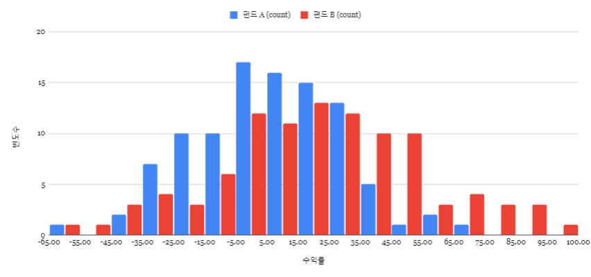
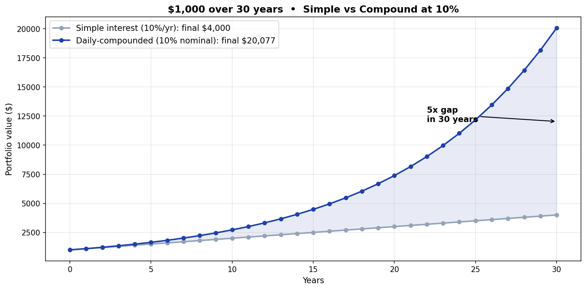

# Returns, Compounding, and Log Charts

> "My fund was +10% then −10%, so it's flat at 0%, right?" — No. **It's −1%.**
>
> The stock market runs on compounding. The "returns" we use day-to-day **don't simply add up**. That single fact is what arithmetic returns, log returns, and log charts are all about. This article walks through why those three are one package — using pictures.

---

## The 30-second version — why returns don't add

Suppose you invest $1,000, and a month later it's $2,000, and the month after that it's back to $1,000.

```
$1,000  →  $2,000  →  $1,000
         +100%        −50%
```

Intuitively `+100% + (−50%) = +50%` — but the actual answer is **0%**. Arithmetic returns don't add up.


Left: **arithmetic returns** sum to +50%, but reality is 0%. Off by a lot.
Right: **log returns** sum to 0, and reality is 0. Match.

That's the heart of this article. **Log returns convert multiplication into addition**, and **log charts visualize that fact**.

---

## 1. Two kinds of returns

### Arithmetic return (the one we use day-to-day)

```
Arithmetic return = current price / previous price − 1
```

Intuitive. $1,000 → $2,000 is +100%. $2,000 → $1,000 is −50%.

### Log return (the one used in quant work)

```
Log return = ln (current price / previous price)
```

`ln` is the natural logarithm — `=LN()` in Google Sheets or Excel. Less intuitive, but everything resolves once you know this one identity:

> **log return = ln(1 + arithmetic return)**

When the arithmetic return is small (short windows, modest moves), the two values are practically the same.

### When they diverge

The further the arithmetic return is from zero, the more the two values diverge:

| Arithmetic | Log |
|----------:|----:|
| +5% | +4.88% |
| +10% | +9.53% |
| +50% | +40.55% |
| +100% | +69.31% |
| −50% | −69.31% |
| −90% | −230.26% |

A +100% and a −50% — log-equivalents are **+0.693 and −0.693, exact mirror images**. That's the whole trick.

---

## 2. Why use log returns at all?

Same data, same 100 years — fund A and fund B. Which one do you choose?



Fund A's returns are clustered tight around the middle — looks *stable*. Fund B's returns are spread wide — looks *volatile*. Instinct says A.

If you take each year's return, log-transform it, and sum:

| | 100-year cumulative log return | 100-year cumulative arithmetic |
|:--|:----------------------------:|:------------------------------:|
| Fund A | 3.77 | 4,271% (≈ 43×) |
| Fund B | (much higher) | overwhelmingly higher |


**Fund B is overwhelmingly better.** Higher volatility doesn't mean lower return. The visual impression of "stable = better" is wrong here.

Doing this calculation with arithmetic returns would mean multiplying 100 numbers together: `(1+r₁)·(1+r₂)·…·(1+r₁₀₀) − 1`. With log returns, it's just *addition*: `r₁ + r₂ + … + r₁₀₀`. **Vastly easier, and the intuition holds better.**

<details><summary>📐 The math (basic logarithm rules)</summary>

```
ln(a/b) = ln(a) − ln(b)        ← log of a quotient
ln(1 + arithmetic) = ln(current/previous)
                   = log return
```

So:

> **log return = ln(1 + arithmetic return)**
> **arithmetic return = exp(log return) − 1**

For small returns, the first-order Taylor approximation gives:

> **ln(1 + x) ≈ x** when x is near 0

Which is why short-window arithmetic and log returns are almost identical.

</details>

---

## 3. Compounding — why "every day" matters

### Simple vs compound — the 30-year gap

Same 10% rate, 30 years, $1,000 starting capital:



- **Simple interest** (10% on principal each year): $4,000
- **Compound** (10% nominal, daily-compounded → effective 10.5155%): **$20,076** — about **5×** the simple version

**The longer the horizon, the wider the gap.** This is what Warren Buffett calls "the magic of time."

### Compounding gets stronger the more often you apply it (with a ceiling)

At 10% nominal rate, the *effective* annual rate depends on how often you compound:


| Frequency | Effective annual rate |
|:----------|:----------:|
| Annual | 10.0000% |
| Semi-annual | 10.2500% |
| Quarterly | 10.3813% |
| Monthly | 10.4713% |
| Daily | 10.5155% |
| **Continuous** (period → 0) | **10.5171%** = e^0.10 − 1 |

The cap turns out to be `e^rate − 1`. **Compounding and the exponential function (`e`) are family.** That's also the secret behind log charts in the next section.

### The stock market compounds daily

Stock prices change daily and apply compounding daily — every day's return *multiplies* into your balance. That's why arithmetic returns can't simply be added.

---

## 4. Log charts — same picture, different truth

Almost every charting tool has a "log scale" toggle. Flip it and the curve transforms. Why?


Both panels show the same 30-year compound growth.

- **Linear scale**: an exponential curve that hockey-sticks at the end → "wow, late stage went vertical"
- **Log scale**: a clean straight line → "actually, the growth rate has been steady the whole time"

**Same fact, two ways to display it.**

### What log charts tell you

The **slope of the line = the compound growth rate**. Steeper line = faster growth, flatter line = slower growth. If the curve *deviates from a straight line*, the growth rate has changed — that's a regime shift.

For long charts (10+ years), **log scale almost always gives the more accurate impression**. Linear scale makes the late period look like everything's exploding, but log scale shows you that the growth rate has been roughly constant the whole time.

<details><summary>📐 Why log scale produces a straight line (math)</summary>

If the price grows at a constant rate `r` per period:

```
price(t) = start × (1 + r)^t
```

Take log of both sides:

```
ln(price(t)) = ln(start) + t · ln(1 + r)
```

`ln(start)` and `ln(1+r)` are both constants. So:

```
ln(price(t)) = (constant1) + (constant2) · t   ← a straight line!
```

Plot ln(price) on the Y-axis vs time on the X-axis and you get a line. That's the entire trick.

</details>

---

## 5. Summary

| Concept | The point |
|:--------|:----------|
| **Arithmetic return** | Intuitive, but doesn't sum cleanly |
| **Log return** | Less intuitive but sums *cleanly* — the natural language of compound markets |
| **Conversion** | log return = ln(1 + arithmetic return) |
| **Compounding** | Stock market compounds daily — gap with simple interest grows fast over time |
| **Log charts** | Compound growth becomes a *straight line* — slope = growth rate |

**Why this matters**: the next article — [How is my portfolio actually doing? — TWR vs MWR](portfolio-return.md) — covers Time-Weighted Return, Money-Weighted Return, and DCF, all built on this foundation. It also explains why your brokerage app and your own calculation can disagree.

The same concept underpins [Shannon's Demon (S1 series)](../series/s1-shannons-demon.md) — arithmetic mean vs geometric mean, and the mathematical identity of "volatility drag."

---

*Next: [How is my portfolio actually doing? — TWR vs MWR](portfolio-return.md)*

*Related: [Shannon's Demon — arithmetic vs geometric mean (S1 series)](../series/s1-shannons-demon.md) | [Volatility Dashboard](volatility-dashboard.md)*
